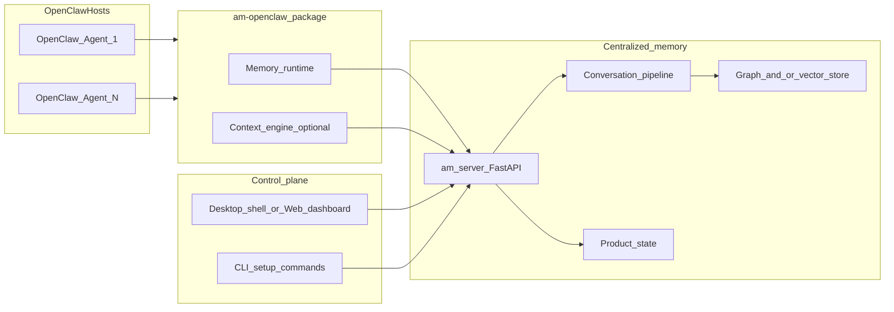

# OpenClaw Plugin: Production Readiness Blueprint

## One-page executive summary

**Problem:** Teams using OpenClaw need shared, durable memory across agents and devices without brittle manual wiring. The repo already ships a native dual-slot plugin ([`packages/am-openclaw`](d:\code\agentic-memory\packages\am-openclaw)) and backend routes ([`src/am_server/routes/openclaw.py`](d:\code\agentic-memory\src\am_server\routes\openclaw.py)), but GA requires frictionless install, multi-agent scale, operational rigor, and a polished dashboard.

**Solution:** Treat **one logical memory plane** (`am-server` + conversation/search pipeline + product state) as the system of record; **N OpenClaw hosts** (up to 10 agents in v1) are stateless clients that authenticate with API keys, identify via `(workspace_id, device_id, agent_id, session_id)`, and use `capture_only` by default with optional `augment_context`.

**ROI-focused metrics (targets for GA sign-off):**
- **Time-to-first-memory:** p95 under 15 minutes from “install plugin” to verified cross-session recall (instrumented funnel).
- **Reliability:** monthly uptime SLO 99.5% for `am-server` API (excluding customer Neo4j/network); plugin-side **zero user-visible latency** on agent stdio (async ingest already assumed in proxy design in [SPEC-browser-extension-and-ACP-proxy.md](d:\code\agentic-memory\SPEC-browser-extension-and-ACP-proxy.md)).
- **Support load:** under 5% of monthly active workspaces filing P1 install tickets (measured via support tags).
- **Security:** zero critical/high unfixed vulns in published packages; secrets never in repo; audit trail on admin actions.

**Recommended rollout:** **Private beta** (single-tenant or trusted design partners) → **Public beta** (marketplace + installers + runbooks) → **GA** (SLO-backed, dashboard GA, pricing). Parallel workstreams: **hardening/E2E with live OpenClaw host** (called out as partial in [docs/PLAN-openclaw-integration.md](d:\code\agentic-memory\docs\PLAN-openclaw-integration.md)), **dashboard UX**, **observability**, **multi-agent load tests**.

---

## 1. Current state (repo-grounded)

| Area | Fact | Gap to GA |
|------|------|-----------|
| Plugin package | [`packages/am-openclaw`](d:\code\agentic-memory\packages\am-openclaw): `openclaw.plugin.json`, `kind: memory + context-engine`, `minHostVersion` in package.json | Live host matrix testing; semver policy vs OpenClaw releases |
| Config | `backendUrl`, `apiKey`, identity fields, `mode` enum | Docs + UI for rotating keys; org-level workspace templates |
| Backend | `/openclaw/*` router with `Depends(require_auth)` | Rate limits, per-workspace quotas, multi-tenant isolation review |
| Auth | Single shared `AM_SERVER_API_KEY` ([`auth.py`](d:\code\agentic-memory\src\am_server\auth.py)) | Scoped tokens or workspace-scoped API keys for production |
| Shell | [`desktop_shell`](d:\code\agentic-memory\desktop_shell) OpenClaw panel + API proxy | “Upscale” dashboard, accessibility, design system |
| Docs | [docs/PLAN-openclaw-integration.md](d:\code\agentic-memory\docs\PLAN-openclaw-integration.md) | Formal OpenAPI, operator runbooks, marketplace copy |

---

## 2. Target architecture and integration blueprint



**Components (deliverable list):**
- **OpenClaw plugin (`agentic-memory`):** build artifact `dist/index.js`, manifest [`openclaw.plugin.json`](d:\code\agentic-memory\packages\am-openclaw\openclaw.plugin.json), setup entry [`setup-api.js`](d:\code\agentic-memory\packages\am-openclaw\setup-api.js).
- **Backend (`am-server`):** OpenClaw router + existing conversation/search/product routes; auth middleware.
- **Memory stores:** Neo4j + embeddings pipeline (per AGENTS.md); document actual deployment (Docker/VM) in runbooks.
- **Control plane:** extend [`desktop_shell`](d:\code\agentic-memory\desktop_shell) or add a **web dashboard** package (recommended for “upscale” UX) behind the same API.
- **Optional:** [`packages/am-proxy`](d:\code\agentic-memory\packages\am-proxy) for non-OpenClaw agents—out of OpenClaw critical path but part of unified memory story.

**Integration contracts (normative):**
- **Identity tuple:** `workspace_id`, `device_id`, `agent_id`, `session_id` on all OpenClaw calls (see models in [`am_server/models.py`](d:\code\agentic-memory\src\am_server\models.py) and tests in [`tests/test_am_server.py`](d:\code\agentic-memory\tests\test_am_server.py)).
- **Source of conversation ingest:** `source_key: chat_openclaw` for analytics and correctness (already validated in tests).
- **Modes:** `capture_only` (default) vs `augment_context`—product and support docs must explain token/latency tradeoffs.

---

## 3. API contracts and failure modes

**Representative endpoints** (authoritative list: scan `@router` in [`openclaw.py`](d:\code\agentic-memory\src\am_server\routes\openclaw.py)): session registration, memory search, ingest turn, memory read, context resolve, project activate/deactivate/status/automation.

**Machine-readable stub (OpenAPI strategy):** generate OpenAPI from FastAPI app; publish **`openapi.json`** artifact per release; version with **API revision** in `X-AM-API-Revision` response header.

**Failure modes and user-visible behavior:**

- **401/503 from auth:** Plugin should surface a **single actionable line** in OpenClaw logs (“invalid API key” vs “server misconfigured”); dashboard shows red status with “copy diagnostics” bundle.
- **Backend timeout during ingest:** Must not block OpenClaw turn loop—**queue/drop with metric** (align with proxy “ingest after pass-through” principle).
- **Partial graph/embedding failure:** Define degradation: return empty search vs last-good cache; document in support playbook.
- **Session/project mismatch:** `_resolve_active_project_id` behavior—document when explicit `project_id` overrides product store.

---

## 4. Ten agents: scaling model

**Clarification:** “Ten OpenClaw agents” = **ten concurrent OpenClaw runtime identities** (distinct `agent_id` or sessions) pointing at **one `am-server`**. Not ten separate backend instances unless you shard by customer.

**Load model (planning assumptions):**
- **Ingress:** up to 10 concurrent agents × sustained turn rate (define: e.g. 2–10 turns/min/agent peak) → RPS on `/openclaw/memory/ingest-turn` and search.
- **Fan-out:** context resolve is heavier than capture-only; default beta to `capture_only` for most workspaces.

**Resource budgets (starting point for capacity doc):**
- **API tier:** 2 vCPU / 4 GB RAM minimum for 10-agent beta; validate with load tests.
- **Neo4j:** separate memory for heap + page cache; vector index size grows with chunks—add **storage growth** alert.
- **Embeddings:** external API QPS limits—use **queue + backoff**; define max batch concurrency.

**Concurrency controls:** per-workspace rate limits; idempotency keys on ingest if duplicate turn delivery is possible; **single-writer** semantics per `session_id` where applicable.

---

## 5. Environment, prerequisites, provisioning runbooks

**Dev:** local `am-server`, `AM_SERVER_API_KEY`, Neo4j from docker-compose ([AGENTS.md](d:\code\agentic-memory\AGENTS.md)); `npm run build` in `packages/am-openclaw`; link plugin per OpenClaw docs.

**Staging:** production-like TLS, secrets in vault, synthetic OpenClaw host CI runner (or nightly manual), seeded test workspace, **feature flags** for `augment_context`.

**Prod:** HA `am-server` (2+ replicas behind LB), managed Neo4j or clustered, backups, secret rotation, **read-only** disaster recovery drill quarterly.

**Runbook outline (each becomes a markdown file in `docs/runbooks/`):**
- RB-001 Provision new environment
- RB-002 Rotate API keys
- RB-003 Neo4j backup/restore
- RB-004 Scale API replicas
- RB-005 Incident: memory search returns empty
- RB-006 Incident: embedding provider outage

---

## 6. Orchestration: agent lifecycle and fault tolerance

- **Lifecycle:** install plugin → `openclaw agentic-memory setup` → health check → register session → optional project activate → run.
- **Upgrades:** semver for plugin; `minHostVersion` already in [`package.json`](d:\code\agentic-memory\packages\am-openclaw\package.json)—maintain compatibility matrix doc.
- **Fault tolerance:** retries with jitter on HTTP client in plugin (`AgenticMemoryBackendClient`); **circuit breaker** when error rate &gt; threshold; fallback messaging to switch to `legacy` context engine if documented in OpenClaw host.

**Observability hooks (see section 10):** trace id per turn propagated as optional header; structured logs from plugin at `warn`+ for failures only in hot paths.

---

## 7. Testing strategy (complete matrix)

**Unit:** plugin TypeScript (`config resolution`, URL building); Python (`openclaw` route helpers, project resolution). **Pass:** 100% of critical branches on identity resolution.

**Integration:** FastAPI TestClient against `/openclaw/*` with auth headers (pattern in [`tests/test_am_server.py`](d:\code\agentic-memory\tests\test_am_server.py)); desktop_shell proxy tests ([`desktop_shell/tests`](d:\code\agentic-memory\desktop_shell\tests)).

**Contract:** OpenAPI diff gate in CI; **consumer-driven** tests if OpenClaw publishes SDK contracts.

**E2E:** **mandatory gap closure:** live OpenClaw host + plugin install script in CI or scheduled nightly; assert turn appears in search. Acceptance: 5 consecutive green runs on `main`.

**Performance:** p95 latency budgets (see section 8); k6 or Locust against staging.

**Load:** simulate 10 agents with Poisson turn arrival; watch DB CPU, API errors, embedding QPS.

**Chaos:** kill Neo4j replica, kill API pod, network partition to embeddings—document **expected** user impact.

**Data correctness:** golden fixtures for shared workspace recall ([`tests/test_openclaw_shared_memory.py`](d:\code\agentic-memory\tests) if present per PLAN); cross-device scenarios.

**Security:** OWASP API tests (auth bypass, IDOR across `workspace_id`), dependency scan (npm + pip), SAST.

**Acceptance criteria (GA gate):** E2E green + load SLO met + security scan clean + rollback tested once.

---

## 8. Performance targets (SLO draft)

- **Search API:** p95 &lt; 500 ms server-side (excluding client network); p99 &lt; 2 s.
- **Ingest turn:** p95 &lt; 300 ms async accept path; **non-blocking** on OpenClaw thread.
- **Context resolve (`augment_context`):** p95 &lt; 2 s with token budget 4k (tunable).
- **Memory footprint:** API process RSS under 1 GB at 10-agent load (validate).
- **Resilience:** 5xx rate &lt; 0.1% over 7-day rolling window in staging before GA.

---

## 9. Security and compliance

- **Authentication:** migrate from single global key to **workspace-scoped API keys** or JWT with claims `{workspace_id, role}` when multi-tenant GA is ready; short-term: rotate keys via runbook.
- **Authorization:** enforce **every** query filters by authenticated workspace; audit for IDOR.
- **Privacy:** PII in prompts—document data residency, retention, deletion API, DPA template.
- **Secrets:** never commit; use OS keychain for desktop; env vars for servers; **seal** config files with 0600 perms where applicable.
- **Supply chain:** lockfiles, `npm audit` / `pip-audit`, signed release artifacts optional phase 2.
- **Audit trails:** admin actions (key rotation, workspace delete) append-only log with actor + timestamp.

---

## 10. Telemetry and observability

**Metrics (Prometheus-style names):**
- `am_openclaw_ingest_total`, `am_openclaw_ingest_errors_total`
- `am_openclaw_search_latency_seconds` histogram
- `am_embedding_calls_total`, `am_embedding_errors_total`
- `am_neo4j_query_duration_seconds`

**Logs:** JSON lines with `workspace_id` (hashed if needed), `agent_id`, `trace_id`, `route`.

**Traces:** OpenTelemetry on FastAPI + outbound embedding calls.

**Dashboards:** Grafana: SLO, error budget, Neo4j health, queue depth.

**Alerting:** page on SLO burn; warn on embedding error spike.

**SRE runbooks:** tie each alert to RB-xxx.

---

## 11. CI/CD and packaging

**Repo structure:** keep monorepo; publish **`agentic-memory` npm package** from `packages/am-openclaw` (name collision risk—align npm scope e.g. `@agentic-memory/openclaw` before publish).

**Branching:** trunk-based; `main` protected; required checks: typecheck, pytest subset, OpenAPI diff.

**Plugin packaging:** `npm pack` or GitHub Releases with `dist/`, `openclaw.plugin.json`, SBOM.

**Cross-platform:** OpenClaw handles host OS; document Windows/macOS/Linux paths for config.

**Auto-updater:** defer to OpenClaw marketplace mechanism; ship **release notes** + semver.

**Rollback:** pin plugin version in config; server API backward compatible for N-1 clients.

---

## 12. Distribution: frictionless install

- **Marketplace listing:** one-liner value prop, screenshots, `minHostVersion`, link to docs.
- **Installers:** `npm install` / `openclaw plugins install` (exact command per OpenClaw docs—verify before GA).
- **Onboarding:** 3-step wizard in dashboard: (1) backend URL + key test (2) identity defaults (3) verify recall.
- **User documentation:** quickstart, troubleshooting, “switch back to legacy context engine”.

---

## 13. UI/UX: upscale dashboard

**Layout:** app shell with **sidebar**: Overview | Workspaces | Agents | Memory health | Integrations | Settings.

**Themes:** light/dark; CSS variables for **design tokens** (copy into `design-tokens.json` artifact): `--color-bg`, `--color-surface`, `--color-accent`, `--font-sans`, `--radius-md`, `--shadow-elevated`.

**Accessibility:** WCAG 2.1 AA for dashboard web; focus rings, contrast, form labels.

**Component library:** align with existing minimal shell or adopt one stack (e.g. React + headless components) in a **new** `packages/am-dashboard` if scope warrants—keep OpenClaw plugin itself thin.

**User journeys:**
- **New user:** install → connect → green checks → sample query.
- **Power user:** multi-agent matrix, project lifecycle, API keys.
- **Support:** export diagnostics JSON from one click.

**Wireframe descriptions:** Overview cards—Backend status, Neo4j status, Active agents (10 slots), Last error, Quick actions.

---

## 14. Developer and operator documentation set

- **API reference:** generated OpenAPI + markdown guides per route family.
- **Integration guide:** sequence diagrams for turn ingest + search.
- **Sample code:** curl snippets; minimal TypeScript fetch for `ingest-turn`.
- **Example workflows:** “two devices one workspace” (already partially in desktop_shell tests).

---

## 15. Go-to-market

**Positioning:** “Structural memory for OpenClaw—shared across agents and machines.”

**Pricing/packaging:** per-workspace/month + usage (embedding tokens) OR self-hosted license—pick one before public beta.

**Launch timeline:** align with phased milestones (section 17).

**Onboarding:** email drip + in-product checklist.

**Support:** L1 script for auth and connectivity; L2 for data issues.

**Success metrics:** activation (first successful search), WAU, NPS, support ticket rate.

**Feedback loops:** in-app “Was this memory helpful?” + weekly review of failed searches.

---

## 16. Risk assessment and mitigations

- **Risk:** OpenClaw host API drift → **Mitigation:** version matrix CI, pinned SDK types [`openclaw-sdk.d.ts`](d:\code\agentic-memory\packages\am-openclaw\src\openclaw-sdk.d.ts).
- **Risk:** Neo4j ops burden → **Mitigation:** managed offering or reference Terraform; backups.
- **Risk:** Embedding cost spike → **Mitigation:** quotas, caching, smaller model tier.
- **Risk:** Single API key compromise → **Mitigation:** rotation + scoped keys (phase 2).

**Contingency:** feature-flag disable `augment_context` globally; read-only mode for incidents.

---

## 17. Phased timeline with exit criteria

**Phase 0 – Hardening (4–6 weeks):** E2E with live OpenClaw; fix session-id UX gaps from PLAN. **Exit:** E2E stable; SLO draft agreed.

**Phase 1 – Private beta (4–8 weeks):** 3–5 design partners; dashboard MVP; runbooks v1. **Exit:** partner sign-off; P1 bug count under threshold.

**Phase 2 – Public beta (6–10 weeks):** marketplace; load test 10 agents; security review. **Exit:** SLO met 2 weeks in staging.

**Phase 3 – GA:** pricing live; support ready; rollback drill. **Exit:** exec checklist signed.

---

## 18. Dependency mapping and risk log (template)

**Dependency graph (engineering view):**
- OpenClaw host semver → `am-openclaw` plugin
- Plugin → `am-server` `/openclaw/*`
- `am-server` → Neo4j, OpenAI (embeddings), product store

**Risk log (CSV columns for import to tracker):** `id,description,likelihood,impact,owner,mitigation,target_date`.

---

## 19. Sample artifact templates (machine-readable)

**A) OpenAPI fragment naming** (convention): `POST /openclaw/memory/search` request body fields match `OpenClawMemorySearchRequest`.

**B) Data model snippet (YAML):**

```yaml
OpenClawIdentity:
  workspace_id: string
  device_id: string
  agent_id: string
  session_id: string
PluginMode:
  enum: [capture_only, augment_context]
```

**C) CI pipeline stages (YAML outline):**

```yaml
stages: [lint, test_unit, test_integration, test_e2e_nightly, package, sbom]
```

**D) Dashboard design tokens (`design-tokens.json` outline):**

```json
{
  "color": { "bg": "#0b0f14", "surface": "#121826", "accent": "#3b82f6" },
  "radius": { "md": "8px" },
  "font": { "sans": "Inter, system-ui, sans-serif" }
}
```

**E) Memory store schema:** reference existing Neo4j constraints from AGENTS.md; extend with OpenClaw provenance properties on nodes/edges as needed—track as a migration task.

---

## 20. Deliverable checklist (for PM/engineering)

- [ ] Published OpenAPI + revision header
- [ ] E2E OpenClaw host CI or nightly
- [ ] Runbooks RB-001–006
- [ ] Dashboard MVP with tokens + a11y audit
- [ ] Scoped API keys or documented single-key hardening
- [ ] Marketplace page + screenshots
- [ ] Load test report (10 agents)
- [ ] Security scan gates in CI
- [ ] GTM one-pager + pricing decision

---

**Note:** This blueprint intentionally references concrete repo paths so engineering can map work items directly. The next implementation step after approval is to **split** this into tracked epics (plugin, server, dashboard, GTM) and assign owners.
