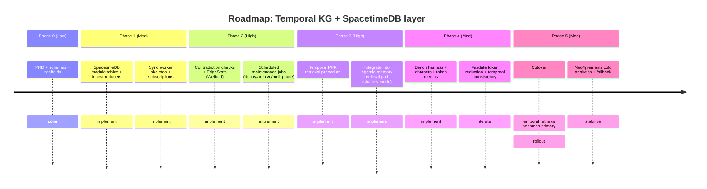

# PRD/SPEC: Temporal GraphRAG for `jarmen423/agentic-memory` using SpacetimeDB Reducers as an Autonomous Temporal Maintenance Layer

## Executive summary

This PRD/SPEC upgrades `jarmen423/agentic-memory` from primarily **semantic similarity + Neo4j graph traversal** into a **temporal knowledge graph retrieval stack** where **time is a first-class dimension** of relationships (edges carry intervals such as `valid_from`/`valid_to`, and time influences retrieval and pruning). The system will implement a **Structure-Aware Temporal GraphRAG**-style pipeline: **(a)** time-aware structural abstraction and evidence localization, **(b)** **Personalized PageRank (PPR)**-guided propagation that biases toward **temporally proximate** facts, and **(c)** **MDL-driven pruning** so noisy/contradictory, temporally scattered edges are automatically suppressed at the graph-structure level rather than relying on LLM adjudication. This is directly motivated by SAT‑Graph RAG and STAR‑RAG, which emphasize a two-stage retrieval paradigm (summarize → propagate) and report large token savings (up to **97% token reduction** in their evaluations), while preserving/improving accuracy. citeturn12view0turn11view0turn16view0

The architectural innovation is to use **SpacetimeDB server-side reducers + schedule tables** as the **autonomous temporal maintenance layer**: consistency checks, decay, pruning, and archival run *inside* the database process, transactionally; schedule tables trigger reducers/procedures at specific times for recurring maintenance or timed actions. citeturn3search0turn3search3turn7view0turn9view0 Neo4j remains valuable for “cold” analytics and rich Cypher exploration (and can preserve your current Cypher tooling), but it will receive only **validated, temporally curated facts** via a sync worker fed by SpacetimeDB subscriptions (row-level replication + onInsert/onUpdate/onDelete callbacks). citeturn4search0turn4search3

Critically, this PRD updates ingestion to be **ACP-first** (Phase 5: `am-proxy`): agent conversations and tool I/O are passively captured from ACP JSON-RPC and ingested to the server already (no user prompts, no agent prompting). The Phase 5 implementation already maps ACP methods (`threads/create`, `threads/message`, `threads/update`, `threads/tool_call`, `threads/tool_result`) into `POST /ingest/conversation` payloads (with buffering and TTL handling for tool call/result pairing). fileciteturn35file0L1-L205 This PRD keeps that behavior and extends the *downstream* pipeline so conversations/research outputs produce **temporal edges** in SpacetimeDB which undergo autonomous maintenance and time-aware retrieval.

Assumptions (explicitly stated vs invented): baseline branch is `main` (per user instruction). Anything not present in sources below is marked **unspecified**.

## Current baseline in `agentic-memory` and Phase 5 ACP ingestion constraints

### What exists today and must remain compatible

`agentic-memory` is designed as a modular knowledge graph system with three memory modules (code, web research, conversation), with Neo4j as the primary graph store and MCP tools as the agent-facing interface. fileciteturn24file0L1-L16 Architecture research in `/.planning` recommends a hub-and-spoke pattern with database-per-module to avoid embedding dimension conflicts (e.g., OpenAI 3072d vs Gemini 768d). fileciteturn25file0L1-L33 A major pain point is **context pollution** and lack of temporal bias in retrieval—explicitly flagged as a pitfall where semantic search alone surfaces stale/irrelevant history. fileciteturn31file0L82-L110

Conversation memory is already specified with a turn-level schema and idempotent MERGE semantics (dedup by `(session_id, turn_index)`), embedding applied only to user/assistant roles, and a REST ingest endpoint (`POST /ingest/conversation`) as the passive connector target. fileciteturn23file0L18-L63 The REST route exists and dispatches to the ingestion pipeline via `run_in_executor`. fileciteturn26file0L12-L36

### Phase 5 is already implemented: ACP proxy is the primary ingestion path

Phase 5 (`am-proxy`) is explicitly defined as the “ACP Proxy” in the roadmap and is marked complete in state. fileciteturn8file0L300-L345 fileciteturn28file0L31-L40 The implemented proxy (`packages/am-proxy`) reads ACP JSON-RPC lines, passes them through *without blocking*, and asynchronously posts turn payloads to `am-server`. fileciteturn35file0L1-L21

Key ACP ingestion mechanics we must preserve (because they are shipping behavior):

- ACP methods mapped to turn ingestion:
  - `threads/message` → role `user` turn (passive) fileciteturn35file0L124-L147  
  - `threads/update` (when `done` is not `False`) → role `assistant` turn (passive) fileciteturn35file0L149-L174  
  - `threads/tool_call` buffered by id with TTL; ingested only after `threads/tool_result` arrives. fileciteturn35file0L176-L205  
- Request/response pairing uses a TTL eviction timer (buffer entries removed after `buffer_ttl_seconds`). fileciteturn35file0L71-L95  
- Turns are posted with `ingestion_mode: "passive"` and `source_key: "chat_proxy"`. fileciteturn35file0L133-L146  

This PRD therefore does **not** redesign capture. It redesigns what happens **after** turns enter the system: extraction + temporal KG maintenance + time-aware retrieval.

## Research synthesis: what SAT‑Graph RAG, STAR‑RAG, and temporal GraphRAG imply for this build

SAT‑Graph RAG (as summarized by EmergentMind) formalizes a two-stage approach: (1) **rule graph summarization** of event-level temporal KGs, and (2) **PPR propagation** on that structure to produce a small candidate pool; it also describes **MDL pruning** where edges are “added greedily only if their inclusion decreases total MDL” and temporal cost is modeled via negative log-likelihood over observed time lags. citeturn12view0 STAR‑RAG (arXiv:2510.16715) frames the core problem as time-inconsistent answers and inflated token usage when temporal constraints are not enforced, and proposes a **time-aligned rule graph** plus propagation to prioritize temporally consistent evidence. citeturn16view0turn11view0

For `agentic-memory`, the key takeaway is not that you must literally implement Apriori and rule graphs on day one. The transferable primitives are:

- **Temporal distinctness must be structural**: “identical facts at different times” should not collapse into one edge; a temporal KG represents them as distinct timestamped edges. TG‑RAG explicitly calls out that static triples lack native temporal support and that time-sensitive facts produce near-identical embeddings in vector retrieval, making time-aware representation necessary. citeturn13view1turn11view1  
- **Propagation-based retrieval beats broad semantic retrieval** when time matters: personalized seeding then PageRank propagation on a temporal structure can shrink the candidate set dramatically. SAT‑Graph RAG gives the canonical PPR form and emphasizes that PageRank is anchored from semantically relevant seeds but propagates through structure and temporal proximity. citeturn12view0  
- **Token reduction is an empirical claim that must be validated for your workload**. STAR‑RAG reports up to 97% token reduction in its evaluation context (and a reported accuracy lift), which is directionally encouraging but not automatically transferrable. citeturn11view0turn12view0 This PRD includes a benchmark plan to replicate the claim on your own agentic-memory traces.

## Target architecture: SpacetimeDB hot temporal maintenance + Neo4j cold analytical graph, with ACP-first ingestion

### Why SpacetimeDB fits the “autonomous temporal maintenance layer” role

SpacetimeDB’s model is: **tables + reducers + (optionally) procedures + views**, where reducers are the primary mechanism for mutating state, run transactionally, and cannot do external I/O; procedures can do operations reducers cannot (e.g., HTTP) but must explicitly open transactions to read/write database state. citeturn3search3turn3search8turn9view0 TypeScript modules define tables/reducers and are bundled/deployed via `spacetime publish`. citeturn7view0

Crucially for this PRD:
- **Schedule tables** can trigger reducers or procedures at specific times, enabling periodic maintenance “inside the DB,” not via cron + external orchestration. citeturn3search0turn3search1  
- Subscriptions replicate database rows to clients and push updates whenever subscribed rows change; client SDK provides `onInsert/onUpdate/onDelete` hooks, which we will use as a reliable replication feed into Neo4j. citeturn4search0turn4search3  

### Architecture diagram

```mermaid
flowchart LR
  subgraph ACP[ACP-first Agent IO]
    A1[Editor/Terminal] <--> A2[ACP Agent CLI<br/>claude/codex/gemini/...]
    A3[am-proxy<br/>packages/am-proxy] --- A1
    A3 --- A2
    A3 -->|POST /ingest/conversation| S1[am-server REST API]
  end

  subgraph Extract[Claim Extraction + Canonicalization]
    S1 --> X1[Extractor Service<br/>TS worker or existing Python pipeline]
    X1 -->|calls LLM (Groq/etc)<br/>external I/O| X2[Claim JSON<br/>(s,p,o,valid_from,valid_to,evidence)]
  end

  subgraph STDB[SpacetimeDB Hot Temporal KG]
    X2 -->|call reducers| R1[Reducers: ingest + contradiction + stats]
    R2[Scheduled reducers/procedures<br/>via schedule tables] --> R1
    T1[(Tables: Nodes, Edges, Evidence,<br/>EdgeStats, Archives, Jobs)]
    R1 <--> T1
  end

  subgraph Sync[Sync + Cold Graph]
    STDB -->|subscriptions| W1[Sync Worker (TS)]
    W1 -->|MERGE edges w/ valid_from/valid_to<br/>+ vector metadata| N1[Neo4j Cold Graph + Vector Index]
  end

  subgraph Query[Retrieval]
    Q1[Agent Query] --> Q2[Entity extraction (existing)] --> Q3[Temporal PPR retrieval]
    Q3 -->|procedure returns ranked edges| STDB
    Q3 -->|optional deep Cypher / global analytics| N1
  end
```

### Option comparison tables

**Pure SpacetimeDB vs hot/cold hybrid**

| Design | What it is | Pros | Cons | Recommended use |
|---|---|---|---|---|
| Pure SpacetimeDB | All nodes/edges + traversal + retrieval inside module; Neo4j removed | Lowest-latency traversal because tables and reducers run co-located in the same process; transactional reducers; schedule tables for maintenance citeturn7view0turn3search0turn3search3 | You lose your existing Cypher workflows; SpacetimeDB subscriptions SQL is constrained (single table, whole row), which pushes complex retrieval composition into module code citeturn4search3 | If you want a greenfield, cohesive TS stack and can invest in traversal/query tooling |
| Hot/cold hybrid | SpacetimeDB = temporal maintenance + “hot” retrieval; Neo4j = “cold” analytics & Cypher | Preserves existing Neo4j graphs/Cypher; ensures Neo4j receives temporally curated edges only; keeps advanced Cypher exploration for debugging/analytics; uses subscriptions as replication feed citeturn4search0turn6search2 | Requires sync worker + schema mapping; dual-store operational complexity | Best for this repo because it aligns with current Neo4j-based architecture and minimizes disruptive rewrites |

**TypeScript vs Rust for the SpacetimeDB module**

| Choice | Pros | Cons | Recommendation |
|---|---|---|---|
| TypeScript module | Aligns with your request (“TypeScript implementation-ready”); first-class module support; familiar tooling; straightforward schema/type definitions in TS citeturn7view0turn8search3 | Might be slower than Rust for heavy graph algorithms; must be careful with reducer determinism and avoiding global state assumptions citeturn10search1turn7view0 | Start in TypeScript; reserve Rust for later optimization once benchmarks identify hotspots |
| Rust module | Potentially higher performance; stronger compile-time guarantees | Higher developer friction if your stack is Python/JS-heavy; longer iteration cycles | Consider only after token/latency benefits are proven and module CPU becomes bottleneck |

## Implementation-ready TypeScript repo plan and exact SpacetimeDB SPEC

This section is written as an implementation plan you can commit to `main` as a new PRD folder plus scaffolding.

### Repository layout additions

You currently have a Python-first repo with `src/` and `packages/am-proxy/` (Python) already present. fileciteturn34file0L1-L9 The TS additions should be **non-invasive** and live under a new `packages/` subtree so Python packaging remains intact.

Proposed additions:

```text
agentic-memory/
├─ packages/
│  ├─ am-temporal-kg/                  # SpacetimeDB TypeScript module project
│  │  ├─ src/
│  │  │  ├─ index.ts                   # REQUIRED SpacetimeDB entrypoint citeturn7view0
│  │  │  ├─ schema.ts                  # table definitions + types
│  │  │  ├─ reducers/
│  │  │  │  ├─ ingest.ts               # reducers: upsert nodes, insert edges, evidence
│  │  │  │  ├─ contradiction.ts        # reducers: conflict checks + segment updates
│  │  │  │  ├─ maintenance.ts          # scheduled reducers for decay/prune/archive
│  │  │  ├─ procedures/
│  │  │  │  ├─ retrieve.ts             # temporal PPR retrieval procedure(s)
│  │  │  │  ├─ admin.ts                # housekeeping procedures (optional)
│  │  │  └─ views/
│  │  │     ├─ health.ts               # public view for module status (optional)
│  │  ├─ am-sync-neo4j/                # TS worker: STDB subscriptions -> Neo4j MERGE
│  │  │  ├─ src/
│  │  │  │  ├─ index.ts                # worker entry
│  │  │  │  ├─ stdb_client.ts          # DbConnection + subscriptions citeturn4search0
│  │  │  │  ├─ neo4j_client.ts         # Neo4j driver + Cypher templates
│  │  │  │  ├─ mappers.ts              # STDB row -> Neo4j node/rel mapping
│  │  │  │  ├─ checkpoints.ts          # idempotency + replay protection
│  │  │  │  └─ metrics.ts              # Prometheus/OpenTelemetry hooks (optional)
│  │  └─ am-claims-extractor/          # optional TS microservice (if not reused from Python)
│  │     ├─ src/
│  │     │  ├─ index.ts                # HTTP server or queue consumer
│  │     │  ├─ acp_event_parser.ts      # normalize conversation/tool turns
│  │     │  ├─ llm_client.ts            # Groq/OpenAI calls (external I/O)
│  │     │  ├─ claim_canonicalize.ts    # entity linking + predicate normalization
│  │     │  └─ stdb_ingest.ts           # calls reducers
└─ docs/prd/
   └─ temporal-kg-spacetimedb.md        # this PRD in-repo form
```

Notes:
- The SpacetimeDB TypeScript docs explicitly require a `src/index.ts` entrypoint that imports other files to ensure they are bundled. citeturn7view0
- Reducers are deterministic, transactional, and cannot do network I/O; external LLM extraction therefore belongs outside reducers (either the existing Python ingestion pipelines or a TS service). citeturn10search1turn9view0

### SpacetimeDB table schemas

Below are **exact** TypeScript table definitions using the documented `table({ name, public, indexes, scheduled }, columns)` pattern and index configuration (btree/direct, unique, primaryKey/autoInc). citeturn7view0turn3search0

#### Core types

We treat time as **microseconds since epoch** (`bigint`) to align with schedule examples and to avoid timezone ambiguity.

```ts
// packages/am-temporal-kg/src/schema.ts
import { schema, table, t } from "spacetimedb/server";
import { ScheduleAt } from "spacetimedb";

// Common
export const TimeUS = t.i64(); // microseconds since epoch (UTC) as bigint
export const EdgeId = t.u128(); // stable hash id (see reducer spec)
export const NodeId = t.u128();
export const EvidenceId = t.u128();
```

#### Node registry

```ts
export const Node = table(
  {
    name: "node",
    public: false,
    indexes: [
      { algorithm: "btree", columns: ["project_id", "kind"] as const },
      { algorithm: "btree", columns: ["project_id", "name_norm"] as const },
    ],
  },
  {
    node_id: t.u128().primaryKey(),
    project_id: t.string(),
    kind: t.string(),          // e.g. Entity / Memory / File / Symbol (aligned to existing typed nodes; exact taxonomy is unspecified)
    name: t.string(),
    name_norm: t.string(),     // lowercase + stripped
    created_at_us: t.i64(),
    updated_at_us: t.i64(),
  }
);
```

#### Evidence records (provenance)

Evidence links edges back to source turns, research findings, or external citations.

```ts
export const Evidence = table(
  {
    name: "evidence",
    public: false,
    indexes: [
      { algorithm: "btree", columns: ["project_id", "source_kind"] as const },
      { algorithm: "btree", columns: ["project_id", "source_id"] as const },
    ],
  },
  {
    evidence_id: t.u128().primaryKey(),
    project_id: t.string(),

    source_kind: t.string(),     // "conversation_turn" | "research_finding" | "code_event" (exact set: partially specified; extendable)
    source_id: t.string(),       // e.g., session_id:turn_index for conversation fileciteturn23file0L28-L44
    source_uri: t.string().optional(),   // for web sources if any
    captured_at_us: t.i64(),

    raw_excerpt: t.string().optional(),  // minimal excerpt (avoid huge payloads)
    hash: t.string(),                   // sha256 for dedup
  }
);
```

#### Temporal edges (the core innovation)

Edges are temporal first-class: `valid_from_us`/`valid_to_us` are **required columns**, not “metadata,” and are included in edge identity and maintenance.

```ts
export const Edge = table(
  {
    name: "edge",
    public: false,
    indexes: [
      // fast lookups for maintenance and retrieval
      { algorithm: "btree", columns: ["project_id", "subj_id", "pred"] as const },
      { algorithm: "btree", columns: ["project_id", "obj_id", "pred"] as const },
      { algorithm: "btree", columns: ["project_id", "pred"] as const },
      { algorithm: "btree", columns: ["project_id", "valid_from_us"] as const },
      { algorithm: "btree", columns: ["project_id", "valid_to_us"] as const },
    ],
  },
  {
    edge_id: t.u128().primaryKey(),   // stable hash: (project_id, subj_id, pred, obj_id, valid_from_us, valid_to_us)
    project_id: t.string(),

    subj_id: t.u128(),
    pred: t.string(),                 // typed relation label (align to existing relationships; exact catalog unspecified)
    obj_id: t.u128(),

    // Temporal first-class interval
    valid_from_us: t.i64(),
    valid_to_us: t.i64().optional(),  // undefined => open-ended "still true"

    // belief & maintenance fields
    created_at_us: t.i64(),
    updated_at_us: t.i64(),

    confidence: t.f32(),              // derived from evidence + reinforcement
    support_count: t.u32(),           // number of evidence items supporting this edge
    contradiction_count: t.u32(),     // number of contradictions observed

    // retrieval weight (updated by maintenance)
    relevance: t.f32(),               // decayed score used by retrieval
    last_reinforced_at_us: t.i64().optional(),
  }
);
```

#### Edge evidence join table

Many-to-many between edges and evidence.

```ts
export const EdgeEvidence = table(
  {
    name: "edge_evidence",
    public: false,
    indexes: [
      { algorithm: "btree", columns: ["edge_id"] as const },
      { algorithm: "btree", columns: ["evidence_id"] as const },
    ],
  },
  {
    id: t.u64().primaryKey().autoInc(),
    edge_id: t.u128(),
    evidence_id: t.u128(),
  }
);
```

#### Edge statistics (for MDL-lite / variance tracking)

SAT‑Graph RAG describes MDL pruning using time-lag likelihood and greedy inclusion based on total description length. citeturn12view0 We implement a reducer-friendly approximation by storing incremental statistics per **(project_id, subj_id, pred, obj_id)** and also per **(project_id, subj_id, pred)** for contradiction checks. (Exact formulas in algorithm section.)

```ts
export const EdgeStats = table(
  {
    name: "edge_stats",
    public: false,
    indexes: [
      { algorithm: "btree", columns: ["project_id", "subj_id", "pred"] as const },
    ],
  },
  {
    stats_id: t.u128().primaryKey(),   // hash(project_id, subj_id, pred, obj_id)
    project_id: t.string(),
    subj_id: t.u128(),
    pred: t.string(),
    obj_id: t.u128(),

    // Online stats for event times (use midpoint = (valid_from + valid_to)/2; or valid_from if open-ended)
    n: t.u32(),
    mean_t_us: t.f64(),
    m2_t_us: t.f64(),                  // Welford M2 for variance

    // Optional: segment count and last change-point (MDL-lite)
    segment_count: t.u32(),
    last_segment_start_us: t.i64(),
  }
);
```

#### Archive (“cold inside hot”) and scheduled jobs

Schedule tables can trigger reducers or procedures using a `scheduleAt` column, and scheduled reducers should include internal-auth checks if they must not be called by external clients. citeturn3search0turn3search2

```ts
export const MaintenanceJob = table(
  { name: "maintenance_job", scheduled: "run_maintenance", public: false },
  {
    scheduled_id: t.u64().primaryKey().autoInc(),
    scheduled_at: t.scheduleAt(),
    project_id: t.string().optional(),       // null => all projects
    job_kind: t.string(),                    // "nightly_decay" | "archive_expired" | "mdl_prune"
  }
);

export const EdgeArchive = table(
  {
    name: "edge_archive",
    public: false,
    indexes: [{ algorithm: "btree", columns: ["project_id", "archived_at_us"] as const }],
  },
  {
    archive_id: t.u64().primaryKey().autoInc(),
    project_id: t.string(),
    edge_id: t.u128(),
    archived_at_us: t.i64(),
    reason: t.string(),
    snapshot_json: t.string(),               // serialized edge snapshot (kept compact)
  }
);
```

### SpacetimeDB module entrypoint wiring

```ts
// packages/am-temporal-kg/src/index.ts
import { schema } from "spacetimedb/server";
import {
  Node, Evidence, Edge, EdgeEvidence, EdgeStats,
  EdgeArchive, MaintenanceJob
} from "./schema";

export const spacetimedb = schema({
  Node, Evidence, Edge, EdgeEvidence, EdgeStats,
  EdgeArchive, MaintenanceJob,
});
export default spacetimedb;

// IMPORTANT: import reducers/procedures so bundler includes them citeturn7view0
import "./reducers/ingest";
import "./reducers/contradiction";
import "./reducers/maintenance";
import "./procedures/retrieve";
```

### Reducers and procedure signatures

Reducers are the only mutation path and run transactionally. citeturn3search3turn10search1 Procedures can return values and do external I/O, but must use `ctx.withTx` to access db and are currently beta/unstable. citeturn9view0

#### Ingest reducers

**Reducer: `upsert_node`**

- Purpose: ensure canonical node ids exist (entity registry).
- Inputs: `(project_id, kind, name)`; returns nothing (mutates Node table).

```ts
// reducers/ingest.ts
export const upsert_node = spacetimedb.reducer(
  { project_id: t.string(), kind: t.string(), name: t.string(), now_us: t.i64() },
  (ctx, args) => { /* ... */ }
);
```

**Reducer: `ingest_temporal_edge`**

- Inputs: canonical ids + predicate + validity interval + evidence pointer.
- Behavior: upserts Edge row (or creates new if interval differs), updates EdgeEvidence/Evidence, updates EdgeStats, then triggers contradiction logic (in-module call pattern described below).

```ts
export const ingest_temporal_edge = spacetimedb.reducer(
  {
    project_id: t.string(),
    subj_id: t.u128(),
    pred: t.string(),
    obj_id: t.u128(),
    valid_from_us: t.i64(),
    valid_to_us: t.i64().optional(),
    evidence: t.object({
      source_kind: t.string(),
      source_id: t.string(),
      captured_at_us: t.i64(),
      raw_excerpt: t.string().optional(),
      hash: t.string(),
    }),
    now_us: t.i64(),
  },
  (ctx, args) => { /* ... */ }
);
```

Key invariant: reducer computes `edge_id = hash(project_id, subj_id, pred, obj_id, valid_from_us, valid_to_us)` so the *time interval is part of identity*, making time a true dimension of the relationship (not a “bolt-on timestamp property”). This matches your formal edge model where time is baked into the edge definition rather than stored only as node metadata. citeturn12view0

#### Contradiction reducer (write-time maintenance)

**Reducer: `check_contradictions_on_insert`**  
Runs inside the same transactional call chain as ingestion (either explicitly invoked by the ingest reducer as an internal helper function, or implemented inside `ingest_temporal_edge` directly—SpacetimeDB reducers are functions in module code, so composing logic is just code organization).

Responsibilities:
- Detect overlapping time intervals for same `(subj_id, pred)` but different `obj_id`.
- Increment `contradiction_count` and, optionally, adjust validity intervals if policy allows (described in algorithm section).

Signature:

```ts
export const check_contradictions_on_insert = spacetimedb.reducer(
  { project_id: t.string(), edge_id: t.u128(), now_us: t.i64() },
  (ctx, args) => { /* ... */ }
);
```

#### Scheduled maintenance reducers (nightly)

Schedule tables trigger reducers/procedures at specific times; the scheduled function is still callable by clients unless you enforce internal-only checks. citeturn3search0turn3search2

**Reducer: `run_maintenance`** (scheduled)

```ts
export const run_maintenance = spacetimedb.reducer(
  { arg: MaintenanceJob.rowType },
  (ctx, { arg }) => {
    // MUST protect from external calls if desired citeturn3search0
    if (!ctx.senderAuth.isInternal) {
      throw new Error("run_maintenance is scheduler-only");
    }
    // dispatch by job_kind
  }
);
```

Nightly workflows that this PRD requires:

- `nightly_decay`: update `relevance` based on decay since `last_reinforced_at_us`
- `archive_expired`: move edges with `valid_to_us < now` to `EdgeArchive` and delete from `Edge`
- `mdl_prune`: use MDL-lite stats to prune high-variance edges (detailed later)

To make “nightly” recurring, the reducer re-inserts a new `maintenance_job` row for the next day after finishing the current one.

### Retrieval APIs in SpacetimeDB: procedures (parameterized) + views (optional)

Views are read-only and can be subscribed to, but SpacetimeDB views do **not** accept user-defined arguments beyond context, making them ill-suited for query-time PPR that needs `(seed_nodes, as_of_time, k, alpha)` parameters. citeturn8search0turn8search1 Therefore retrieval will be implemented as **procedures** that return results to the caller. citeturn9view0

**Procedure: `temporal_ppr_retrieve`**

This procedure returns a compact evidence set (edges + supporting evidence ids) suitable for LLM context injection.

```ts
// procedures/retrieve.ts
export const temporal_ppr_retrieve = spacetimedb.procedure(
  {
    project_id: t.string(),
    seed_node_ids: t.array(t.u128()),
    as_of_us: t.i64(),
    max_edges: t.u32(),
    max_hops: t.u32(),
    alpha: t.f32(),                 // PPR damping factor
    half_life_hours: t.f32(),       // temporal decay control
    min_relevance: t.f32(),
  },
  t.array(
    t.product({
      edge_id: t.u128(),
      subj_id: t.u128(),
      pred: t.string(),
      obj_id: t.u128(),
      valid_from_us: t.i64(),
      valid_to_us: t.i64().optional(),
      relevance: t.f32(),
      confidence: t.f32(),
      support_count: t.u32(),
    })
  ),
  (ctx, args) => {
    // must use withTx to read tables in procedures citeturn9view0
    return ctx.withTx((tx) => {
      // run bounded PPR using indexed lookups (implementation notes below)
      // return top edges
    });
  }
);
```

Notes:
- Procedures need `ctx.withTx` to access the database (“no ctx.db” outside the tx), and `withTx` may be invoked multiple times, so the function must be deterministic with respect to database state and its own arguments. citeturn9view0 We therefore prohibit external HTTP calls inside the procedure; embedding/entity extraction happens upstream (existing Python or TS extractor service).

### Neo4j sync worker design (SpacetimeDB subscriptions → Neo4j MERGE)

Subscriptions replicate rows to a client and push updates on changes; TypeScript client SDK shows `subscriptionBuilder().subscribe([...])` and table event hooks for inserts/updates/deletes. citeturn4search0turn4search1 Subscription SQL is restricted to a single table and whole row, so the worker subscribes to each relevant table separately (Edge, Node, Evidence, EdgeEvidence, EdgeArchive). citeturn4search3

Worker responsibilities:

- Maintain a live subscription:
  - `SELECT * FROM edge`
  - `SELECT * FROM node`
  - `SELECT * FROM evidence`
  - `SELECT * FROM edge_evidence`
  - `SELECT * FROM edge_archive`
- On each insert/update/delete, apply idempotent Cypher to Neo4j:
  - Nodes → `MERGE (n:Entity {node_id}) SET ...`
  - Edges → `MERGE (s)-[r:PRED {edge_id}]->(o)` with properties `valid_from`, `valid_to`, `confidence`, `relevance`, etc.

Neo4j temporal values can be stored as properties on nodes and relationships; Cypher has built-in temporal types (DATE/TIME/DATETIME/DURATION) and can store them on relationships. citeturn6search2turn6search1 For simplicity and to avoid timezone confusion, store raw `valid_from_us`/`valid_to_us` as integers on relationships and also materialize `datetime()` for convenience if needed (policy: **unspecified**; choose one approach consistently).

## Algorithms and logic: temporal PPR, MDL-lite pruning, contradiction resolution

### Temporal Personalized PageRank for time-aware propagation

SAT‑Graph RAG uses anchored personalized PageRank: a personalization vector γ is seeded from query anchors and PageRank is propagated on normalized adjacency; the formula is given as π = α γ + (1−α) π Ã. citeturn12view0 Standard PPR is classically defined as a random walk with teleportation seeded to a personalization distribution. citeturn5search4 Temporal extensions allow time-dependent personalization/graphs. citeturn5search5turn5search2

#### Graph model

Let the temporal KG be \( G=(V,E) \) where each edge is:

\[
e = (u, v, r, [t_s, t_e])
\]

and \(t_e\) may be open-ended. We define an edge weight at query time \(t_q\):

\[
w_e(t_q) = w_r \cdot \text{conf}_e \cdot \text{temp}(e, t_q)
\]

where:
- \(w_r\) is a relation-type base weight (configurable; default 1.0, unspecified),
- \(\text{conf}_e\) is `confidence` stored on the edge,
- \(\text{temp}(e,t_q)\) is a decay factor based on temporal proximity.

A practical temporal decay aligned with your “time decay waiting” concept is an exponential half-life:

\[
\text{temp}(e,t_q) = 2^{- \Delta(e,t_q)/h}
\]

where \(h\) is a half-life (in hours) and \(\Delta(e,t_q)\) is the distance from query time to the edge’s validity interval:

\[
\Delta(e,t_q) =
\begin{cases}
0 & t_s \le t_q \le t_e \text{ (or } t_e=\infty\text{)}\\
t_s - t_q & t_q < t_s\\
t_q - t_e & t_q > t_e
\end{cases}
\]

This makes currently-valid edges dominate, and recent edges dominate over stale ones even if semantically similar—directly addressing the “temporal ambiguity” failure mode described in temporal GraphRAG literature. citeturn13view1turn11view1

#### Transition matrix

For each node \(u\), define outgoing neighbors \(N(u)\). The transition probability from \(u\) to \(v\) via edge \(e=(u,v,\dots)\) is:

\[
P_{uv} = \frac{w_e(t_q)}{\sum_{v' \in N(u)} w_{e(u,v')}(t_q) + \epsilon}
\]

#### PPR iteration

Let \(p\) be personalization distribution over nodes, centered on seed nodes extracted from the query (entity extraction already exists in `agentic-memory`). Then:

\[
\mathbf{r}_{k+1} = (1-\alpha)\mathbf{p} + \alpha \mathbf{r}_{k} \mathbf{P}
\]

This is the standard PPR recurrence in row-vector form (notation aligns with SAT‑Graph RAG’s expression). citeturn12view0turn5search4

#### Reducer-friendly pseudocode (bounded, sparse)

Because SpacetimeDB procedures cannot scan entire tables inefficiently and views discourage full scans, we implement bounded PPR over a limited frontier.

```text
Input: seed_node_ids S, time tq, hops H, max_nodes M, alpha, half_life h
Output: ranked edges E*

1) Frontier expansion (bounded BFS):
   V' := S
   for i in 1..H:
       V' := V' ∪ neighbors(V')   // using indexed Edge lookups by (project_id, subj_id) and (project_id, obj_id)

   if |V'| > M: truncate by heuristic (e.g., top by node degree * recency)  // heuristic; exact policy unspecified

2) Build local adjacency over V':
   For each u in V':
       For each outgoing edge e(u->v) where v in V':
           compute w_e(tq) with temporal decay
       normalize outgoing weights to get P_uv

3) Personalized PageRank on subgraph:
   initialize r0 := p (mass on seeds)
   repeat for K iterations or until L1 change < tol:
       r := (1-alpha)*p + alpha*(r*P)

4) Rank edges:
   Score edge e(u->v) := r[u] * P_uv   (flow-through score)
   Keep top max_edges edges with:
       - valid interval intersects [tq - window, tq + window] OR high temp weight
       - relevance >= min_relevance

Return ranked edges with their properties + evidence ids (joined via EdgeEvidence in Neo4j later if needed).
```

### MDL-lite segmentation and incremental pruning

SAT‑Graph RAG describes greedy MDL-based incorporation of edges where total description length \(L(M)+L(G|M)\) decreases, and temporal cost is a negative log-likelihood under an exponential distribution over observed time lags. citeturn12view0 The general MDL principle is to choose the model that best compresses the data (minimizes model cost + data cost). citeturn5search9turn5search48

For reducers, we need an **incremental approximation** that avoids expensive global optimization.

#### MDL-lite objective for a single relation family

For a fixed key \(k=(\text{project},s,p)\), consider competing objects \(o\) over time. We want to keep edges whose occurrence times are **concentrated** and penalize scattered/contradictory ones.

Define for each candidate object \(o\):
- observed times \(t_1,\dots,t_n\) (e.g., midpoints for that edge’s validity interval),
- estimate exponential rate \(\lambda = 1/\max(\epsilon, \overline{\Delta t})\) if modeling lags, or treat \(t\) variance directly.

A reducer-friendly MDL-lite score per object edge-family:

\[
\text{MDL}(o) \approx A \cdot \log(n) \;+\; \frac{n}{2}\log(\hat{\sigma}^2 + \epsilon)
\]

Interpretation:
- First term is a complexity penalty (like BIC/MDL-style growth with sample size).
- Second term is the coding cost of variance (lower variance → lower code length).

This is not a literal reproduction of SAT‑Graph RAG’s exponential NLL, but it implements the same core bias: **stable temporal patterns are cheaper** than scattered ones. (Exact constant \(A\) is a tunable hyperparameter; unspecified default: 1.)

#### Online updates in reducers (Welford)

We maintain `EdgeStats` with \(n\), mean, M2 so variance is:

\[
\hat{\sigma}^2 = \frac{M2}{n-1}
\]

Welford updates are O(1) per insert and fit reducers well.

Reducer rule:

- If adding a new observation increases **MDL(o)** above a threshold relative to alternatives or above a max budget, mark edge family as “high variance” → degrade `relevance` and/or schedule pruning.
- If `n` is small, do not prune (avoid overreacting early).

#### Pruning policy (nightly reducer)

Nightly `mdl_prune` job:
- For each `EdgeStats` key with `n >= n_min`:
  - compute variance
  - if variance exceeds threshold AND contradictions are present:
    - reduce `relevance` aggressively or archive edges in that family except the best-supported recent segment

This aligns with SAT‑Graph RAG’s claim that pruning happens structurally via MDL rather than LLM contradiction resolution. citeturn12view0

### Contradiction resolution logic

This PRD implements *structural* contradiction handling in two layers:

- **Immediate write-time checks** (inside `ingest_temporal_edge` transaction):
  - For same `(project_id, subj_id, pred)`:
    - Find edges whose interval overlaps new edge’s interval but have different `obj_id`.
    - Increment `contradiction_count` on both sides.
    - If confidence of new edge > existing edge AND overlap is strong, optionally “clip” existing `valid_to_us` to `new.valid_from_us - 1` (policy flag; default **off** until benchmarks show safety).

- **Maintenance-time consolidation**:
  - Use MDL-lite stats to decide which object is dominant per time segment.
  - For edges with low support and high variance, archive them (preserving evidence in `EdgeArchive`).

This approach is consistent with temporal KG literature emphasizing that time-agnostic triples cannot represent evolving truths cleanly and that temporal graphs must preserve different facts across time rather than collapsing them. citeturn13view1turn11view1

## Migration plan: MCP → ACP-first ingestion, tool contracts, and backward compatibility

### What changes and what stays

- **Primary ingestion becomes ACP-first**:
  - Already true for conversations via `am-proxy` (Phase 5). fileciteturn35file0L124-L205
  - This PRD extends ingestion by adding claim extraction → temporal KG writes.

- **MCP remains supported for retrieval and explicit writes**:
  - Existing MCP integration docs and tool matrix remain valid for code/search tools. fileciteturn9file0L301-L369
  - `add_message` remains as fallback for non-ACP environments (already a Phase 4 requirement). fileciteturn23file0L104-L116

### Updated contracts (ACP ingestion → temporal KG)

Define a normalized ingestion event envelope (internal interface) to bridge between the existing `POST /ingest/conversation` turn schema and the temporal KG extractor:

```ts
type IngestedTurn = {
  project_id: string;
  session_id: string;
  turn_index: number;
  role: "user" | "assistant" | "system" | "tool";
  content: string;
  source_agent?: string;
  source_key: "chat_proxy" | "chat_mcp" | "chat_ext" | string; // existing semantics fileciteturn23file0L52-L58
  ingestion_mode: "passive" | "active" | "manual";
  captured_at_us: bigint; // derived from timestamp/ingested_at
};
```

This aligns with the Phase 4 conversation schema (role/content/session_id/project_id/turn_index + optional tool fields) fileciteturn23file0L28-L44 and the Phase 5 proxy behavior (`source_key: chat_proxy`, `ingestion_mode: passive`). fileciteturn35file0L133-L146

### Backward compatibility strategy

- Keep Neo4j conversation ingests as-is initially.
- Introduce temporal KG writes in parallel (“shadow mode”):
  - Extractor service consumes ingested turns and writes edges to SpacetimeDB but does not yet affect retrieval output.
- After validation, switch retrieval endpoints (`get_conversation_context` or new tool) to use temporal KG retrieval first, with Neo4j semantic search as fallback.

## Test plan, benchmarks, observability, and phased rollout

### Benchmark objectives

The STAR‑RAG / SAT‑Graph RAG line reports dramatic token reductions through structural filtering (up to 97% reduction), which motivates a measurable goal but must be validated on your traces. citeturn11view0turn12view0

Define success metrics:

- **Token reduction**: compare total tokens sent to LLM context between baseline retrieval (semantic + broad GraphRAG) vs temporal PPR retrieval candidate set.
- **Answer quality**: human scoring or automated QA where possible.
- **Temporal consistency**: rate of time-inconsistent answers (define datasets with known evolving facts).
- **Latency**: p50/p95 retrieval time for multi-hop queries.

### Bench harness (repo deliverables)

Add a new `bench/` directory (TS-based for reproducibility) with:

```text
bench/
├─ datasets/
│  ├─ conversations.jsonl          # captured turn streams (from am-proxy logs; unspecified)
│  ├─ temporal_facts_gold.json     # curated gold facts with validity intervals (hand-built; required)
├─ scripts/
│  ├─ build_temporal_kg.ts         # replay dataset → call ingest reducers
│  ├─ run_queries.ts               # run query set against baseline + PPR
│  ├─ measure_tokens.ts            # compute prompt token counts
│  ├─ report_results.ts            # produce csv/markdown summary
└─ metrics_schema.json
```

Baseline comparisons:
- Baseline A: Neo4j vector search on conversation turns (`/search/conversations`) as implemented. fileciteturn26file0L37-L106  
- Baseline B: Neo4j Cypher multi-hop traversal (existing capability; exact queries unspecified by sources).
- New: SpacetimeDB temporal PPR retrieval procedure.

### Observability plan

SpacetimeDB supports logging via standard `console` methods in reducers. citeturn10search3 Additionally:

- Maintain internal tables for:
  - reducer execution counts by kind
  - prune/archive counts per maintenance run
  - contradiction detection counters
- Sync worker exports Prometheus metrics (implementation choice; not provided by sources).

### Rollout roadmap (phased)

Effort estimates use Low/Med/High only (as requested); actual timelines are unspecified.



### CI/CD checklist (implementation-ready)

- TypeScript packages:
  - `pnpm lint` / `pnpm typecheck`
  - SpacetimeDB module build: `spacetime publish <db_name>` (exact deployment targets unspecified; depends on whether you self-host or maincloud) citeturn7view0
- Python packages (existing):
  - `pytest` (already established)
- Integration:
  - Contract tests: feed representative ACP turn stream into extractor → verify expected edges exist in SpacetimeDB and are mirrored into Neo4j.
  - Determinism audit for reducers: zero global mutable state reliance (SpacetimeDB explicitly warns global/static state is not reliable across reducer calls). citeturn10search1

### Risks and mitigations

- **Dual-store consistency risk**: hot/cold replication bugs. Mitigate with idempotent edge ids (hash including time interval) and replayable subscription processing. citeturn4search0turn4search3  
- **Procedure semantics risk**: procedures are beta and require `withTx`, and transaction functions may run multiple times; retrieval procedures must be deterministic and avoid external I/O. citeturn9view0  
- **Over-pruning risk**: MDL-lite heuristics may delete important rare facts. Mitigate with archive rather than hard delete (EdgeArchive) and conservative thresholds.
- **Token reduction claim risk**: STAR‑RAG’s 97% token reduction is reported in their benchmark setting and may not hold for your data. Mitigate by building the benchmark harness and treating the claim as a hypothesis to validate. citeturn11view0turn12view0  
- **ACP protocol drift**: Phase 5 notes ACP method names may change across agent versions (already flagged as a risk). fileciteturn8file0L340-L345 Keep the proxy’s ingest routing table configurable.

---

**Unspecified details (not invented):** complete predicate/type catalog for nodes/relationships across modules; specific entity linking strategy (beyond “entity extraction exists”); exact datasets for benchmarking; deployment target for SpacetimeDB (maincloud vs self-host); Neo4j schema constraints for temporal relationships (beyond that relationships can store temporal values). citeturn6search2