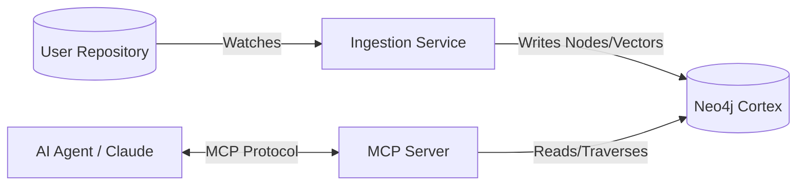

# 🧠 Agentic Memory

> **Active, Structural Memory System for AI Coding Agents**

Agentic Memory is not just "RAG" for code. It is an **active, structural memory layer** that understands code relationships (dependencies, imports, inheritance), not just text similarity.

**Core Value Prop:** *"Don't let your Agent code blind. Give it a map."*

---

## 🏗️ Architecture



### Components

| Component | Role | Description |
|-----------|------|-------------|
| **Observer** (`cli.py` + `watcher.py`) | The "Writer" | Watches filesystem changes and keeps the graph in sync |
| **Graph Builder** (`graph.py`) | The "Mapper" | Parses code with Tree-sitter, builds Neo4j graph with embeddings |
| **MCP Server** (`app.py` + `tools.py`) | The "Interface" | Exposes high-level skills to AI agents via MCP protocol |

---

## 🚀 Quick Start

### Prerequisites

- Python 3.10+
- Neo4j Database (local or Aura)
- OpenAI API key

### Installation

```bash
# Clone the repository
git clone <repo-url>
cd agentic-memory

# Install the package
pip install -e .

# Configure environment
cp .env.example .env
# Edit .env with your Neo4j and OpenAI credentials
```

### Configuration (.env)

```ini
NEO4J_URI=bolt://localhost:7687
NEO4J_USER=neo4j
NEO4J_PASSWORD=your-password
OPENAI_API_KEY=sk-...
```

---

## 📖 Usage

### 1. Watch Mode (Continuous Ingestion)

Watch a repository for changes and continuously update the knowledge graph:

```bash
# Watch current directory
codememory watch .

# Watch specific path with custom Neo4j URI
codememory watch /path/to/repo --neo4j-uri bolt://localhost:7687
```

### 2. MCP Server Mode

Start the MCP server for AI agent integration:

```bash
codememory serve --port 8000
```

### Available MCP Tools

| Tool | Description |
|------|-------------|
| `search_codebase(query)` | Semantic search for code functionality |
| `get_file_dependencies(path)` | Returns imports and dependents for a file |

---

## 📦 Project Structure

```
agentic-memory/
├── src/codememory/
│   ├── __init__.py
│   ├── cli.py                    # CLI entry point
│   ├── ingestion/
│   │   ├── __init__.py
│   │   ├── graph.py              # KnowledgeGraphBuilder (Neo4j interface)
│   │   ├── parser.py             # Tree-sitter parsing logic
│   │   └── watcher.py            # Filesystem watcher
│   └── server/
│       ├── __init__.py
│       ├── app.py                # FastMCP server
│       └── tools.py              # MCP tool implementations
├── pyproject.toml                # Package configuration
├── graphrag_requirements.txt     # Legacy scripts dependencies
└── README.md                     # This file
```

---

## 🔧 Legacy GraphRAG Scripts

The repository includes standalone scripts for one-time ingestion:

| Script | Purpose |
|--------|---------|
| `4_pass_ingestion_with_prep_hybridgraphRAG.py` | Day 0 full ingestion (4-pass hybrid chunking) |
| `5_continuous_ingestion.py` | Day N continuous daemon (legacy) |
| `5_continuous_ingestion_jina.py` | Jina AI embeddings variant |

**⚠️ Python 3.11 Required for legacy scripts**

These scripts use `llama-index` and `tree-sitter` bindings that require Python 3.11:

```bash
# Create dedicated environment for legacy scripts
python3.11 -m venv .venv-graphrag
source .venv-graphrag/bin/activate  # On Windows: .venv-graphrag\Scripts\activate
pip install -r graphrag_requirements.txt
```

---

## 🧪 Development

```bash
# Install in editable mode with dev dependencies
pip install -e ".[dev]"

# Run type checking
mypy src/codememory

# Run tests (when added)
pytest
```

---

## 🔌 MCP Integration

Configure your AI agent (Cursor, Windsurf, Claude Desktop) to use the MCP server:

```json
{
  "mcpServers": {
    "agentic-memory": {
      "command": "codememory",
      "args": ["serve", "--port", "8000"]
    }
  }
}
```

---

## 📝 License

[Your License Here]

---

## 🤝 Contributing

Contributions welcome! Please ensure:
- Code follows the existing type hint patterns
- No circular imports introduced
- `close()` methods properly registered for resource cleanup
