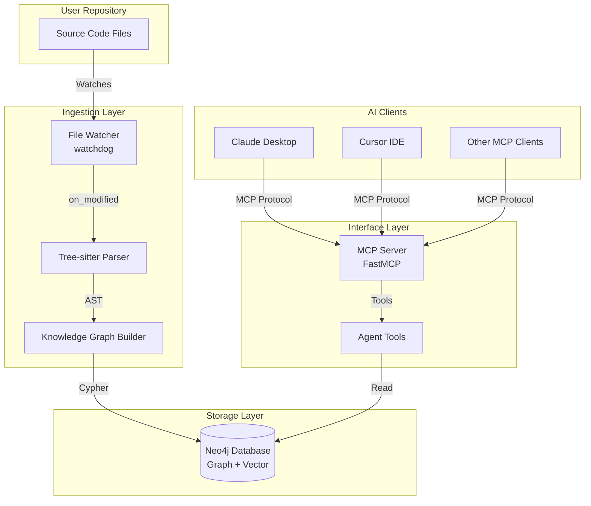
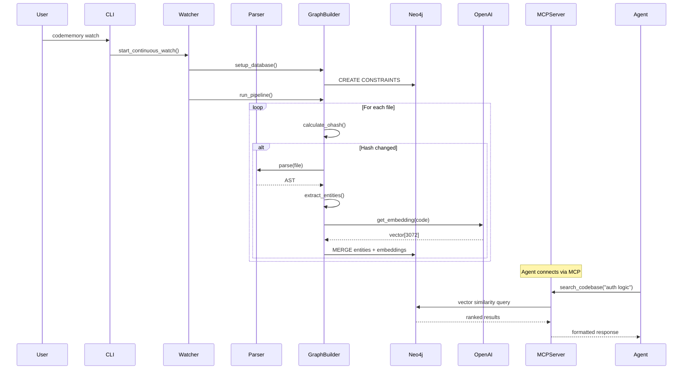

# Architecture Documentation

This document provides a comprehensive technical overview of Agentic Memory's architecture, design decisions, and implementation details.

## Table of Contents

- [System Overview](#system-overview)
- [Graph Schema](#graph-schema)
- [4-Pass Ingestion Pipeline](#4-pass-ingestion-pipeline)
- [Tree-sitter Parsing Strategy](#tree-sitter-parsing-strategy)
- [Vector Embeddings](#vector-embeddings)
- [Cypher Query Patterns](#cypher-query-patterns)
- [Component Architecture](#component-architecture)
- [Performance Considerations](#performance-considerations)

---

## System Overview

Agentic Memory is a **hybrid GraphRAG** system that combines:

1. **Structural Graph:** Captures code relationships (imports, calls, containment)
2. **Semantic Embeddings:** Vector search for natural language queries
3. **Real-time Sync:** File watcher keeps graph updated

### High-Level Architecture



### Design Principles

| Principle | Implementation |
|-----------|----------------|
| **Structure over Similarity** | Graph relationships first, vectors second |
| **Incremental Updates** | Only process changed files (oHash-based) |
| **Contextual Embeddings** | Prefix chunks with file/class/function context |
| **Decoupled Components** | Ingestion, storage, and interface are independent |
| **MCP-First** | All agent access via MCP protocol (no raw DB access) |

---

## Graph Schema

### Node Types

#### File Node

Represents a source code file.

```cypher
(:File {
  path: string,          // Unique: "src/services/auth.py"
  name: string,          // "auth.py"
  ohash: string,         // MD5 hash for change detection
  last_updated: datetime // Timestamp of last update
})
```

**Constraints:**
```cypher
CREATE CONSTRAINT file_path_unique
FOR (f:File) REQUIRE f.path IS UNIQUE
```

#### Function Node

Represents a function or method definition.

```cypher
(:Function {
  signature: string,     // Unique: "src/auth.py:authenticate"
  name: string,          // "authenticate"
  code: string,          // Full source code
  docstring: string?,    // Extracted docstring
  parameters: string?,   // Comma-separated parameter names
  return_type: string?   // Return type annotation
})
```

**Constraints:**
```cypher
CREATE CONSTRAINT function_sig_unique
FOR (f:Function) REQUIRE f.signature IS UNIQUE
```

#### Class Node

Represents a class definition.

```cypher
(:Class {
  qualified_name: string, // Unique: "src/models/user.py:User"
  name: string,          // "User"
  code: string           // Full source code
})
```

**Constraints:**
```cypher
CREATE CONSTRAINT class_name_unique
FOR (c:Class) REQUIRE c.qualified_name IS UNIQUE
```

#### Chunk Node

Contains semantic embeddings for natural language search.

```cypher
(:Chunk {
  id: string,            // UUID
  text: string,          // Code snippet
  embedding: vector[3072], // OpenAI text-embedding-3-large
  created_at: datetime
})
```

**Vector Index:**
```cypher
CREATE VECTOR INDEX code_embeddings
FOR (c:Chunk) ON (c.embedding)
OPTIONS {
  indexConfig: {
    `vector.dimensions`: 3072,
    `vector.similarity_function`: 'cosine'
  }
}
```

### Relationship Types

#### DEFINES

`(File:File)-[:DEFINES]->(Entity:Function|Class)`

Represents containment. A file defines functions and classes.

**Example:**
```cypher
(src/auth.py:File)-[:DEFINES]->(authenticate:Function)
(src/auth.py:File)-[:DEFINES]->(AuthService:Class)
```

#### IMPORTS

`(File:File)-[:IMPORTS]->(Target:File)`

Represents module dependencies.

**Example:**
```cypher
(src/routes/users.py:File)-[:IMPORTS]->(src/models/user.py:File)
(src/services/auth.py:File)-[:IMPORTS]->(src/utils/hash.py:File)
```

#### CALLS

`(Caller:Function)-[:CALLS]->(Callee:Function)`

Represents function call graph.

**Example:**
```cypher
(login:Function)-[:CALLS]->(verify_password:Function)
(login:Function)-[:CALLS]->(create_session:Function)
```

#### HAS_METHOD

`(Class:Class)-[:HAS_METHOD]->(Method:Function)`

Represents class membership.

**Example:**
```cypher
(User:Class)-[:HAS_METHOD]->(save:Function)
(User:Class)-[:HAS_METHOD]->(delete:Function)
```

#### DESCRIBES

`(Chunk:Chunk)-[:DESCRIBES]->(Entity:Function|Class)`

Links semantic embeddings to code entities.

**Example:**
```cypher
(chunk_abc123:Chunk)-[:DESCRIBES]->(authenticate:Function)
```

### Fulltext Index

For keyword-based search:

```cypher
CREATE FULLTEXT INDEX entity_text_search
FOR (n:Function|Class|File) ON EACH [n.name, n.docstring, n.path]
```

---

## 4-Pass Ingestion Pipeline

The ingestion pipeline processes code in 4 sequential passes to build the complete graph.

### Pass 0: Pre-flight (Database Setup)

**File:** `src/codememory/ingestion/graph.py:setup_database()`

**Purpose:** Create constraints and indexes before ingestion.

**Operations:**
1. Create uniqueness constraints (File.path, Function.signature, Class.qualified_name)
2. Create vector index on Chunk.embeddings
3. Create fulltext index for keyword search

**Why:** Constraints enable efficient `MERGE` operations and prevent duplicates.

```cypher
-- Enable fast lookups and upserts
CREATE CONSTRAINT file_path_unique IF NOT EXISTS
FOR (f:File) REQUIRE f.path IS UNIQUE;

-- Enable vector similarity search
CREATE VECTOR INDEX code_embeddings IF NOT EXISTS
FOR (c:Chunk) ON (c.embedding)
OPTIONS {
  indexConfig: {
    `vector.dimensions`: 3072,
    `vector.similarity_function`: 'cosine'
  }
};
```

---

### Pass 1: Structure Scan & Change Detection

**File:** `src/codememory/ingestion/graph.py:pass_1_structure_scan()`

**Purpose:** Discover files and detect changes using MD5 hashes.

**Algorithm:**
1. Walk directory tree (recursively)
2. Calculate MD5 hash for each file (`_calculate_ohash()`)
3. Check if file exists in graph with matching hash
4. Only create/update if hash differs

**Change Detection:**
```python
# Pseudocode
for file in files:
    current_hash = md5(file.read_bytes())

    existing = query("MATCH (f:File {path: $path}) RETURN f.ohash", path=file.path)

    if existing["hash"] == current_hash:
        continue  # Skip, no changes

    # Create or update File node
    merge("(:File {path: $path, ohash: $current_hash})")
```

**Benefits:**
- Incremental updates (only process changed files)
- Idempotent (safe to re-run)
- Fast for large repos (most files unchanged)

**Output:** File nodes with up-to-date hashes.

---

### Pass 2: Entity Definition & Chunking

**File:** `src/codememory/ingestion/graph.py:pass_2_entity_definition()`

**Purpose:** Extract functions/classes and create semantic chunks.

**Algorithm:**
1. Fetch all File nodes from Pass 1
2. Parse each file with Tree-sitter
3. Extract function/class definitions
4. Create Function/Class nodes
5. Generate embeddings with **contextual prefixing**

#### Tree-sitter Queries

**Python:**
```scheme
(class_definition
  name: (identifier) @name
  body: (block) @body) @class

(function_definition
  name: (identifier) @name
  body: (block) @body) @function
```

**JavaScript/TypeScript:**
```scheme
(class_declaration name: (identifier) @name) @class
(function_declaration name: (identifier) @name) @function
```

#### Contextual Prefixing

**The Secret Sauce:** Prepend context to code before embedding.

**Example:**
```python
# Raw code
def authenticate(username, password):
    """Verify user credentials"""
    return check_password(username, password)

# Contextual prefix
enriched_text = """Context: File src/auth.py > Method: authenticate

def authenticate(username, password):
    \"\"\"Verify user credentials\"\"\"
    return check_password(username, password)"""
```

**Why?**
- Embeddings capture hierarchical context
- Search results include file/class path
- Disambiguates同名 functions (e.g., `parse()` in different modules)

**Output:**
- Function nodes with full code
- Class nodes with full code
- Chunk nodes with 3072-dim embeddings

---

### Pass 3: Import Resolution

**File:** `src/codememory/ingestion/graph.py:pass_3_imports()`

**Purpose:** Build dependency graph by analyzing import statements.

**Algorithm:**
1. Fetch all `.py` files from graph
2. Parse with Tree-sitter to find import statements
3. Convert module names to file paths (heuristic)
4. Create `[:IMPORTS]` relationships

#### Tree-sitter Query

```scheme
(import_statement name: (dotted_name) @module)
(import_from_statement module_name: (dotted_name) @module)
```

#### Path Resolution Heuristic

```python
# Example import
import command_service.app

# Convert to potential file path
module_name.replace(".", "/")  # → "command_service/app"

# Fuzzy match in graph
MATCH (source:File {path: "src/routes/users.py"})
MATCH (target:File)
WHERE target.path CONTAINS "command_service/app"
MERGE (source)-[:IMPORTS]->(target)
```

**Limitations:**
- May create false positives (e.g., `http.server` vs local `http/server.py`)
- Doesn't handle dynamic imports
- Doesn't resolve aliased imports (`from x import y as z`)

**Future Improvements:**
- AST-based resolution
- Python module path resolution
- Configuration for custom import mappings

**Output:** `[:IMPORTS]` relationships between File nodes.

---

### Pass 4: Call Graph Construction

**File:** `src/codememory/ingestion/graph.py:pass_4_call_graph()`

**Purpose:** Build function call graph for dependency analysis.

**Algorithm:**
1. Fetch all Function nodes grouped by file
2. Parse each file with Tree-sitter
3. Extract all function calls
4. Match calls to Function nodes by name
5. Create `[:CALLS]` relationships

#### Tree-sitter Query

```scheme
(call function: (identifier) @name)
```

#### Optimized Batch Processing

**Old approach (slow):** Process each function separately
```python
for func in functions:
    calls = parse_calls(file)
    for call in calls:
        create_relationship(caller=func, callee=call)
```

**New approach (fast):** Process all calls in file, then batch
```python
# Parse file once
all_calls_in_file = parse_all_calls(file)

# Batch create relationships
UNWIND $calls as called_name
MATCH (caller:Function {signature: $caller_sig})
MATCH (callee:Function {name: called_name})
WHERE caller <> callee
MERGE (caller)-[:CALLS]->(callee)
```

**Benefits:**
- 10-50x faster (fewer Cypher queries)
- Single pass per file
- Batching reduces Neo4j round-trips

**Limitations:**
- Doesn't resolve method calls on objects (`obj.method()`)
- Doesn't handle indirect calls (callbacks, decorators)
- May create false matches (same-named functions in different modules)

**Output:** `[:CALLS]` relationships between Function nodes.

---

## Tree-sitter Parsing Strategy

### Why Tree-sitter?

| Feature | Tree-sitter | Regex | AST (ast module) |
|---------|-------------|-------|------------------|
| Language-agnostic | ✅ | ❌ | ❌ |
| Error recovery | ✅ | ❌ | ❌ |
| Incremental parsing | ✅ | ❌ | ❌ |
| Captures line numbers | ✅ | Partial | ✅ |
| Handles syntax errors | ✅ | ❌ | ❌ |

### Language Support

**Currently Supported:**
- Python (`.py`)
- JavaScript (`.js`, `.jsx`)
- TypeScript (`.ts`, `.tsx`)

**Adding New Languages:**

```python
# 1. Install tree-sitter language binding
pip install tree-sitter-go

# 2. Add to _init_parsers()
go_lang = Language(tree_sitter_go.language())
parsers[".go"] = Parser(go_lang)

# 3. Add language-specific queries
if extension == ".go":
    query_scm = """
    (function_declaration name: (identifier) @name) @function
    (type_declaration name: (identifier) @name) @class
    """
```

### Query Cursor Pattern

**Standard pattern for executing Tree-sitter queries:**

```python
from tree_sitter import Language, Query, QueryCursor

# 1. Get language object
lang = Language(tree_sitter_python.language())

# 2. Compile query
query = Query(lang, query_scm)

# 3. Create cursor and execute
cursor = QueryCursor(query)
captures = cursor.captures(tree.root_node)

# 4. Process captures
for tag, nodes in captures.items():
    for node in nodes:
        # Extract text from node
        text = code[node.start_byte:node.end_byte]
```

### Navigating AST

```python
# Find parent class
current = node.parent
while current:
    if current.type == "class_definition":
        # Found parent class
        break
    current = current.parent

# Find children
for child in node.children:
    if child.type == "identifier":
        name = code[child.start_byte:child.end_byte]
```

---

## Vector Embeddings

### Embedding Model

**Model:** OpenAI `text-embedding-3-large`
- **Dimensions:** 3072
- **Cost:** $0.13 per 1M tokens
- **Max Input:** 8191 tokens (~24,000 chars)

### Contextual Prefixing Strategy

**Problem:** Naive embeddings lose hierarchical context.

**Solution:** Prepend hierarchical path to code snippet.

```
┌─────────────────────────────────────────────────────────┐
│ Context: File src/auth.py > Class AuthService > Method login │
├─────────────────────────────────────────────────────────┤
│                                                          │
│ async def login(username, password):                    │
│     """Authenticate user and return session token"""    │
│     user = await db.get_user(username)                  │
│     if not verify_password(password, user.hash):        │
│         raise AuthenticationError()                     │
│     return create_session(user.id)                      │
│                                                          │
└─────────────────────────────────────────────────────────┘
```

**Benefits:**
- Disambiguates同名 functions
- Search results include full path
- Improves semantic similarity
- Helps LLMs understand context

### Token Management

**Truncation:**
```python
MAX_CHARS = 24000  # Safety margin for 8191 tokens

if len(text) > MAX_CHARS:
    text = text[:MAX_CHARS] + "...[TRUNCATED]"
```

**Cost Tracking:**
```python
self.token_usage = {
    "embedding_tokens": 0,
    "embedding_calls": 0,
    "total_cost_usd": 0.0
}

# After each embedding
cost = (tokens / 1_000_000) * 0.13
self.token_usage["total_cost_usd"] += cost
```

### Vector Search

**Cypher Query:**
```cypher
CALL db.index.vector.queryNodes('code_embeddings', $limit, $vec)
YIELD node, score
MATCH (node)-[:DESCRIBES]->(target)
RETURN target.name, target.signature, score, node.text
ORDER BY score DESC
```

**How it works:**
1. Convert query text to embedding
2. Find nearest chunks (cosine similarity)
3. Traverse to described entities
4. Return ranked results

---

## Cypher Query Patterns

### Pattern 1: File Dependencies

**Get what a file imports:**
```cypher
MATCH (f:File {path: $path})-[:IMPORTS]->(dep)
RETURN dep.path
```

**Get what imports a file:**
```cypher
MATCH (f:File {path: $path})<-[:IMPORTS]-(caller)
RETURN caller.path
```

**Combined (bidirectional):**
```cypher
MATCH (f:File {path: $path})
OPTIONAL MATCH (f)-[:IMPORTS]->(imported)
OPTIONAL MATCH (dependent)-[:IMPORTS]->(f)
RETURN
  collect(DISTINCT imported.path) as imports,
  collect(DISTINCT dependent.path) as imported_by
```

---

### Pattern 2: Transitive Dependencies (Impact Analysis)

**Find all files that transitively depend on a file:**
```cypher
MATCH path = (f:File {path: $path})<-[:IMPORTS*1..3]-(dependent)
RETURN DISTINCT
  dependent.path,
  length(path) as depth
ORDER BY depth, path
```

**Explanation:**
- `<-[:IMPORTS*1..3]` - Reverse traversal, 1 to 3 hops
- `length(path)` - Distance from source
- `DISTINCT` - Deduplicate multiple paths

---

### Pattern 3: Call Graph

**Find what a function calls:**
```cypher
MATCH (fn:Function {signature: $sig})-[:CALLS]->(callee)
RETURN callee.name, callee.signature
```

**Find what calls a function:**
```cypher
MATCH (fn:Function {signature: $sig})<-[:CALLS]-(caller)
RETURN caller.name, caller.signature
```

---

### Pattern 4: File Structure

**Get all entities in a file:**
```cypher
MATCH (f:File {path: $path})
OPTIONAL MATCH (f)-[:DEFINES]->(fn:Function)
OPTIONAL MATCH (f)-[:DEFINES]->(c:Class)
OPTIONAL MATCH (f)-[:IMPORTS]->(imp:File)
RETURN
  f.name,
  collect(DISTINCT fn.name) as functions,
  collect(DISTINCT c.name) as classes,
  collect(DISTINCT imp.path) as imports
```

---

### Pattern 5: Hybrid Search (Vector + Graph)

**Find relevant code and its dependencies:**
```cypher
// Vector search
CALL db.index.vector.queryNodes('code_embeddings', 5, $vec)
YIELD node, score
MATCH (node)-[:DESCRIBES]->(target)

// Get file context
OPTIONAL MATCH (target)<-[:DEFINES]-(f:File)

// Return with dependencies
RETURN
  target.name,
  target.signature,
  score,
  f.path as file_path,
  [(f)-[:IMPORTS]->(dep) | dep.path] as dependencies
ORDER BY score DESC
```

---

### Pattern 6: Change Detection

**Files modified since last scan:**
```cypher
MATCH (f:File)
WHERE f.last_updated < datetime() - duration('P1D')
RETURN f.path, f.last_updated
ORDER BY f.last_updated DESC
```

**Orphaned nodes (file deleted from disk):**
```cypher
// After Pass 1, mark files not found during scan
MATCH (f:File)
WHERE f.scanned = false
DETACH DELETE f
```

---

## Component Architecture

### 1. CLI Layer (`cli.py`)

**Responsibilities:**
- Argument parsing (argparse)
- Command dispatch
- User interaction (init wizard)

**Commands:**
```python
codememory init      # Interactive setup
codememory status    # Show statistics
codememory index     # One-time ingestion
codememory watch     # Continuous monitoring
codememory serve     # MCP server
codememory search    # Test semantic search
```

---

### 2. Config Layer (`config.py`)

**Responsibilities:**
- Load/save `.codememory/config.json`
- Environment variable fallback
- Find repository root

**Priority:**
1. Command-line arguments
2. `.codememory/config.json`
3. Environment variables
4. Defaults

---

### 3. Ingestion Layer (`ingestion/`)

#### Graph Builder (`graph.py`)

**Class:** `KnowledgeGraphBuilder`

**Core Methods:**
- `setup_database()` - Create constraints/indexes
- `run_pipeline()` - Execute all 4 passes
- `pass_1_structure_scan()` - File discovery
- `pass_2_entity_definition()` - Parse and embed
- `pass_3_imports()` - Build import graph
- `pass_4_call_graph()` - Build call graph
- `semantic_search()` - Vector similarity search
- `get_file_dependencies()` - Dependency analysis
- `identify_impact()` - Blast radius analysis

**State:**
```python
self.driver: neo4j.Driver           # Database connection
self.openai_client: OpenAI          # Embedding client
self.parsers: Dict[str, Parser]     # Tree-sitter parsers
self.token_usage: Dict              # Cost tracking
self.repo_root: Path                # Repository path
```

#### File Watcher (`watcher.py`)

**Class:** `CodeChangeHandler`

**Event Handlers:**
- `on_modified()` - File changed (debounced)
- `on_created()` - New file added
- `on_deleted()` - File removed

**Debouncing:**
```python
# Ignore events within 1 second of last event
if now - last_time < 1.0:
    return
```

**Incremental Updates:**
1. Delete old entities for file
2. Re-parse file
3. Re-create embeddings
4. Update imports

**Does NOT update call graph** (requires full repo scan).

---

### 4. Server Layer (`server/`)

#### MCP Server (`app.py`)

**Framework:** FastMCP

**Tools:**
- `search_codebase()`
- `get_file_dependencies()`
- `identify_impact()`
- `get_file_info()`

**Initialization:**
```python
def init_graph():
    # Try local config first
    config = Config(repo_root)
    if config.exists():
        neo4j_cfg = config.get_neo4j_config()
    else:
        # Fall back to environment variables
        neo4j_cfg = {
            "uri": os.getenv("NEO4J_URI"),
            "user": os.getenv("NEO4J_USER"),
            "password": os.getenv("NEO4J_PASSWORD")
        }

    graph = KnowledgeGraphBuilder(**neo4j_cfg)
    return graph
```

#### Toolkit (`tools.py`)

**Class:** `Toolkit`

**Purpose:** Business logic separated from server protocol.

**Methods:**
- `semantic_search()` - Format results for LLM
- `get_file_dependencies()` - Query and format deps

**Why separate?** Testable without MCP server.

---

## Performance Considerations

### Bottlenecks

1. **Embedding API Calls** (largest bottleneck)
   - ~100ms per call (network latency)
   - Batch processing doesn't help (OpenAI limitation)
   - Solution: Only embed changed files

2. **Cypher Query Execution**
   - CALLS relationship creation is expensive
   - Solution: Batch processing with UNWIND

3. **Tree-sitter Parsing**
   - Fast for most files
   - Slow for very large files (>10K LOC)
   - Solution: Skip vendor directories

### Optimization Strategies

#### 1. Incremental Updates

```python
# Only process files with changed hashes
if current_hash == stored_hash:
    continue  # Skip
```

#### 2. Batch Cypher Operations

```python
# Instead of N queries:
for call in calls:
    session.run("MATCH ... MERGE (caller)-[:CALLS]->(callee)")

# Use UNWIND:
session.run("""
UNWIND $calls as called_name
MATCH (caller:Function {signature: $sig})
MATCH (callee:Function {name: called_name})
MERGE (caller)-[:CALLS]->(callee)
""", calls=calls, sig=caller_sig)
```

#### 3. Index Utilization

```cypher
// Ensure queries use indexes
PROFILE MATCH (f:File {path: $path}) RETURN f

// Look for:
// - "NodeIndexSeek" (good)
// - "NodeByLabelScan" (bad - needs index)
```

#### 4. Memory Management

```python
# Process files in batches to avoid memory spikes
BATCH_SIZE = 100

for i in range(0, len(files), BATCH_SIZE):
    batch = files[i:i+BATCH_SIZE]
    process_batch(batch)
```

### Performance Benchmarks

**Test Repository:** 50K LOC Python project

| Operation | Time | Cost |
|-----------|------|------|
| Pass 1 (Scan) | 2s | $0.00 |
| Pass 2 (Parse + Embed) | 45s | $0.82 |
| Pass 3 (Imports) | 8s | $0.00 |
| Pass 4 (Call Graph) | 12s | $0.00 |
| **Total (Initial)** | **67s** | **$0.82** |
| **Incremental (1 file)** | **3s** | **$0.01** |

---

## Data Flow Diagram



---

## Future Enhancements

### Planned Features

1. **Additional Languages**
   - Go, Rust, Java, C/C++
   - Community-contributed parsers

2. **Advanced Relationships**
   - `[:INHERITS]` - Class inheritance
   - `[:IMPLEMENTS]` - Interface implementation
   - `[:DECORATES]` - Python decorators

3. **Hybrid Search**
   - Combine vector + keyword + graph traversal
   - Reranking with graph context

4. **Multi-Repository Support**
   - Namespace isolation
   - Cross-repo dependencies

5. **Caching Layer**
   - Redis for frequently accessed queries
   - Materialized views for common patterns

### Contribution Opportunities

See [CONTRIBUTING.md](../CONTRIBUTING.md) for:
- Adding language support
- Optimizing Cypher queries
- Improving parser accuracy
- Extending MCP tools

---

## References

- **Neo4j Cypher Manual:** https://neo4j.com/docs/cypher-manual/
- **Tree-sitter Documentation:** https://tree-sitter.github.io/tree-sitter/
- **OpenAI Embeddings:** https://platform.openai.com/docs/guides/embeddings
- **MCP Protocol:** https://modelcontextprotocol.io/

---

**Document Version:** 1.0.0
**Last Updated:** 2025-02-09
**Maintainer:** Agentic Memory Contributors
