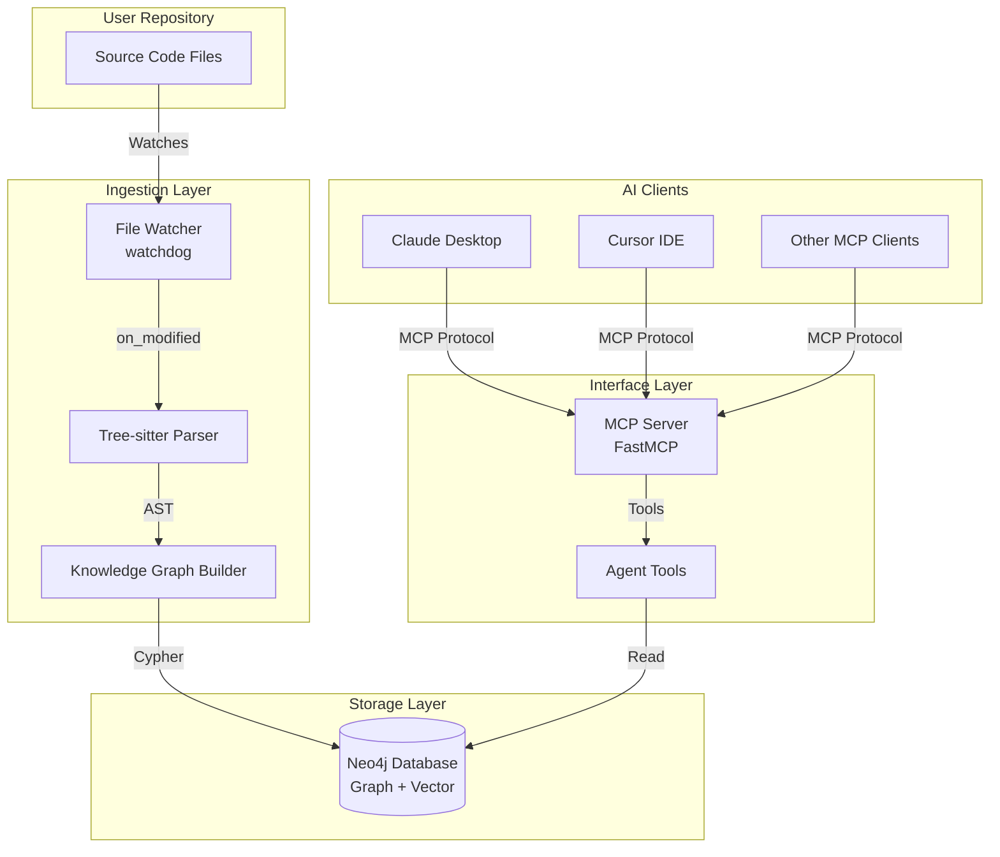
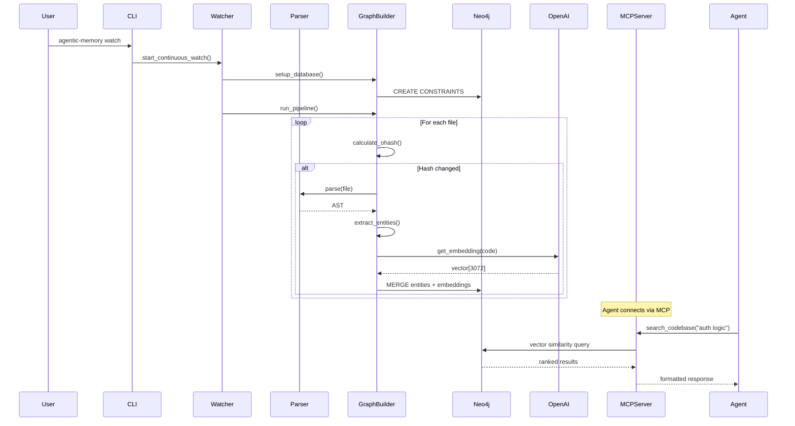
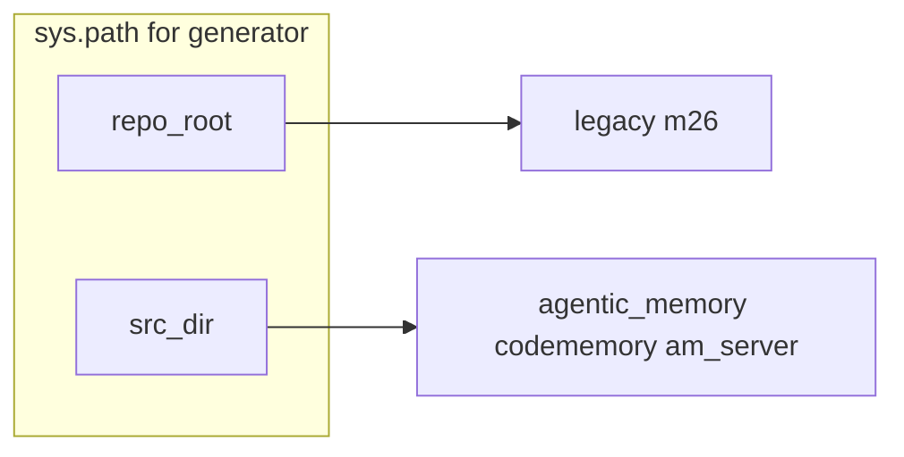

# Project Overview: Agentic Memory

*Auto-generated by `scripts/generate_notebooklm_docs.py`. Part of the agentic-memory full-stack context for NotebookLM.*

This file aggregates README and static documentation files. Read this first for project purpose, architecture, and setup context.

---

## `README.md`

# 🧠 Agentic Memory
https://github.com/jarmen423/agentic-memory

> **Active, Structural Memory System for AI Coding Agents**

Agentic Memory is not just "RAG" for code. It is an **active, structural memory layer** that understands code relationships (dependencies, imports, inheritance), not just text similarity.

**Core Value Prop:** *"Don't let your Agent code blind. Give it a map."*

---

## ✨ Features

| Feature | Description |
|---------|-------------|
| **📊 Structural Graph** | Understands imports, dependencies, call graphs - not just text similarity |
| **🔍 Semantic Search** | Vector embeddings with contextual prefixing for accurate results |
| **⚡ Real-time Sync** | File watcher automatically updates the graph as you code |
| **🧬 Git Graph (Opt-in)** | Adds commit/author/file-version history in the same Neo4j DB with separate labels |
| **🤖 MCP Protocol** | Drop-in integration with Claude, Cursor, Windsurf, and any MCP-compatible AI |
| **💥 Impact Analysis** | See the blast radius of changes before you make them |

---

## 🚀 Quick Start (One Command Setup)

### 1. Install globally

```bash
# Recommended: Use pipx for isolated global installation
pipx install agentic-memory

# Or with uv tooling
uv tool install agentic-memory
uvx agentic-memory --help

# Or use pip in a virtualenv
pip install agentic-memory
```

`codememory` remains available as a compatibility alias, but `agentic-memory` is the primary name.

### 2. Initialize in any repository

```bash
cd /path/to/your/repo
agentic-memory init
```

The interactive wizard will guide you through:
- Neo4j setup (local Docker, Aura cloud, or custom)
- OpenAI API key (for semantic search)
- File extensions to index

That's it! Your repository is now indexed and ready for AI agents.

---

## 📖 Usage

### In any initialized repository:

```bash
# Show repository status and statistics
agentic-memory status

# One-time full index (e.g., after major changes)
agentic-memory index

# Watch for changes and continuously update
agentic-memory watch

# Start MCP server for AI agents
agentic-memory serve

# Test semantic search
agentic-memory search "where is the auth logic?"

# Git graph (rollout build)
agentic-memory git-init --repo /absolute/path/to/repo --mode local --full-history
agentic-memory git-sync --repo /absolute/path/to/repo --incremental
agentic-memory git-status --repo /absolute/path/to/repo --json
```

Git graph command details and rollout notes: [docs/GIT_GRAPH.md](docs/GIT_GRAPH.md)

---

## 🧾 Tool-Use Annotation (Research)

Agentic Memory now supports SQLite telemetry for MCP tool calls plus manual post-response labeling as `prompted` or `unprompted`.

```bash
agentic-memory --prompted "check our auth"
agentic-memory --unprompted "check our auth"
```

Full workflow and options: [docs/TOOL_USE_ANNOTATION.md](docs/TOOL_USE_ANNOTATION.md)

---

## 🏗️ Architecture

```
┌─────────────────┐     Watches      ┌──────────────────┐
│  User Repository│ ───────────────> │ Ingestion Service│
│                 │                  │ (Observer)       │
└─────────────────┘                  └────────┬─────────┘
                                              │ Writes
                                              ▼
                                       ┌──────────────┐
                                       │  Neo4j       │
                                       │  Cortex      │
                                       └──────┬───────┘
                                              │ Reads
                                              ▼
┌─────────────────┐     MCP Protocol  ┌──────────────────┐
│   AI Agent /    │ <───────────────> │  MCP Server      │
│   Claude        │                   │  (Interface)     │
└─────────────────┘                   └──────────────────┘
```

### Components

| Component | Role | Description |
|-----------|------|-------------|
| **Observer** (`watcher.py`) | The "Writer" | Watches filesystem changes and keeps the graph in sync |
| **Graph Builder** (`graph.py`) | The "Mapper" | Parses code with Tree-sitter, builds Neo4j graph with embeddings |
| **MCP Server** (`app.py`) | The "Interface" | Exposes high-level skills to AI agents via MCP protocol |

---

## ⏱️ Experimental Temporal GraphRAG

Phase 8 adds a shadow-mode temporal maintenance layer alongside the existing Neo4j graph:

- `packages/am-temporal-kg/` — SpacetimeDB TypeScript module for temporal edge ingest, scheduled maintenance, and deterministic temporal retrieval
- `packages/am-sync-neo4j/` — subscription worker that mirrors curated temporal rows back into Neo4j

This layer is additive in the current branch. Existing retrieval paths remain unchanged until the later retrieval cutover phase.

## Full-Stack Local Flow

Phase 10 adds a unified search surface across code, research, and conversation memory:

- MCP: `search_all_memory(...)`
- REST: `GET /search/all`

The next packaging layer adds a local product control plane for install and dogfood
loops:

- CLI: `agentic-memory product-status`, `agentic-memory product-repo-add`, `agentic-memory product-integration-set`, `agentic-memory product-component-set`, `agentic-memory product-event-record`
- REST: `GET /product/status`, `POST /product/repos`, `POST /product/integrations`, `POST /product/components/{component}`, `POST /product/events`, `POST /product/onboarding`
- Workflow: [docs/PRODUCT_DOGFOODING.md](docs/PRODUCT_DOGFOODING.md)

The first desktop-facing shell is a lightweight local FastAPI app in `desktop_shell/`. It
proxies the `am-server` product API and gives a browser-based control plane without
committing to a native desktop framework yet.

- Run `python -m am_server.server`
- Then run `python -m desktop_shell --backend-url http://127.0.0.1:8765`

Use these docs for the current local operator flow:

- [docs/SETUP_FULL_STACK.md](docs/SETUP_FULL_STACK.md)
- [docs/MCP_TOOL_REFERENCE.md](docs/MCP_TOOL_REFERENCE.md)
- [docs/PROVIDER_CONFIGURATION.md](docs/PROVIDER_CONFIGURATION.md)
- [docs/SPACETIMEDB_OPERATIONS.md](docs/SPACETIMEDB_OPERATIONS.md)
- [docs/PRODUCT_DOGFOODING.md](docs/PRODUCT_DOGFOODING.md)

---

## 🔌 MCP Tools Available to AI Agents

| Tool | Description |
|------|-------------|
| `search_codebase(query, limit=5, domain="code")` | Semantic search for code, git, or hybrid domain routing |
| `get_file_dependencies(file_path, domain="code")` | Returns imports and dependents for a file |
| `identify_impact(file_path, max_depth=3, domain="code")` | Blast radius analysis for changes |
| `get_file_info(file_path, domain="code")` | File structure overview (classes, functions) |
| `get_git_file_history(file_path, limit=20, domain="git")` | File-level commit history and ownership signals (git rollout) |
| `get_commit_context(sha, include_diff_stats=true)` | Commit metadata and change statistics (git rollout) |
| `find_recent_risky_changes(path_or_symbol, window_days, domain="hybrid")` | Recent high-risk changes using hybrid signals (git rollout) |

> Note: `domain` routing and git-domain tools are part of the git graph rollout. If they are missing in your installed build, use code-domain tools only and upgrade to a git-enabled release.

---

## ✅ Integration Recommendation Policy (PR7)

Current recommendation policy is explicit:

1. **Recommended default:** `mcp_native` integration for production reliability.
2. **Optional path:** `skill_adapter` workflow for shell/script-driven operators.
3. **Promotion rule:** `skill_adapter` becomes first-class only after parity evidence
   is captured versus `mcp_native` across success rate, latency, token cost, retries,
   and operator steps.

Reference docs and evaluation artifacts:

- [docs/evaluation-decision.md](docs/evaluation-decision.md)
- [evaluation/README.md](evaluation/README.md)
- [evaluation/tasks/benchmark_tasks.json](evaluation/tasks/benchmark_tasks.json)
- [evaluation/schemas/benchmark_results.schema.json](evaluation/schemas/benchmark_results.schema.json)
- [evaluation/skills/skill-adapter-workflow.md](evaluation/skills/skill-adapter-workflow.md)

---

## 🐳 Docker Setup (Neo4j)

### Quick Start

```bash
# Start Neo4j
docker-compose up -d neo4j

# Neo4j will be available at:
# HTTP: http://localhost:7474
# Bolt: bolt://localhost:7687
# Username: neo4j
# Password: password (change this in production!)
```

### Neo4j Aura (Cloud)

Get a free instance at [neo4j.com/cloud/aura/](https://neo4j.com/cloud/aura/)

---

## 📁 Configuration

Per-repository configuration is stored in `.codememory/config.json`:

```json
{
  "neo4j": {
    "uri": "bolt://localhost:7687",
    "user": "neo4j",
    "password": "password"
  },
  "openai": {
    "api_key": "sk-..."  // Optional - can use OPENAI_API_KEY env var
  },
  "indexing": {
    "ignore_dirs": ["node_modules", "__pycache__", ".git"],
    "extensions": [".py", ".js", ".ts", ".tsx", ".jsx"]
  }
}
```

**Note:** `.codememory/` is gitignored by default to prevent committing API keys.

---

## 🔧 Installation from Source

```bash
# Clone the repository
git clone https://github.com/jarmen423/agentic-memory.git
cd agentic-memory

# Install in editable mode
pip install -e .

# Run the init wizard in any repo
agentic-memory init
```

---

## 🧪 Development

```bash
# Install in editable mode
pip install -e .

# Run type checking (when mypy is configured)
mypy src/agentic_memory

# Run tests (when added)
pytest
```

---

## 📊 What Gets Indexed?

| Entity | Description | Relationships |
|--------|-------------|---------------|
| **Files** | Source code files | `[:DEFINES]`→ Functions/Classes, `[:IMPORTS]`→ Files |
| **Functions** | Function definitions | `[:CALLS]`→ Functions, `[:HAS_METHOD]`← Classes |
| **Classes** | Class definitions | `[:HAS_METHOD]`→ Methods |
| **Chunks** | Semantic embeddings | `[:DESCRIBES]`→ Functions/Classes |

---

## 🔌 MCP Integration

### Claude Desktop

```json
{
  "mcpServers": {
    "agentic-memory": {
      "command": "agentic-memory",
      "args": ["serve", "--repo", "/absolute/path/to/your/project"]
    }
  }
}
```

### Cursor IDE

```json
{
  "mcpServers": {
    "agentic-memory": {
      "command": "agentic-memory",
      "args": ["serve", "--repo", "/absolute/path/to/your/project", "--port", "8000"]
    }
  }
}
```

### Windsurf

Add to your MCP configuration file.

> Note: `--repo` requires the upcoming release that adds explicit repo targeting for `serve`.
> If your installed version does not support `--repo`, use your client's `cwd` setting
> (if supported) or launch via a wrapper script that runs `cd /absolute/path/to/project && agentic-memory serve`.

---

## 📝 License

MIT License - see LICENSE file for details.

---

## 🤝 Contributing

Contributions welcome! Please see TODO.md for the roadmap.

---

## 🙏 Acknowledgments

- **Neo4j** - Graph database with vector search
- **Tree-sitter** - Incremental parsing for code
- **OpenAI** - Embeddings for semantic search
- **MCP (Model Context Protocol)** - Standard interface for AI tools


---

## `docs\API.md`

# API Reference

Complete reference for Agentic Memory's CLI commands, MCP tools, configuration options, and Python API.

## Table of Contents

- [CLI Commands](#cli-commands)
- [MCP Tools](#mcp-tools)
- [Configuration Options](#configuration-options)
- [Python API](#python-api)
- [Error Codes](#error-codes)

---

## CLI Commands

### `agentic-memory init`

Initialize Agentic Memory in the current repository with an interactive wizard.

**Usage:**
```bash
agentic-memory init
```

**What it does:**
1. Creates `.codememory/` directory
2. Generates `config.json` with your settings
3. Offers to run initial indexing
4. Tests Neo4j connection

**Interactive prompts:**
```
━━━━━━━━━━━━━━━━━━━━━━━━━━━━━━━━━━━━━━━━━━━━━━━━━━━━━━━━━━━━━━━
Step 1: Neo4j Database Configuration
━━━━━━━━━━━━━━━━━━━━━━━━━━━━━━━━━━━━━━━━━━━━━━━━━━━━━━━━━━━━━━━

Options:
  1. Local Neo4j (Docker)
  2. Neo4j Aura (Cloud)
  3. Custom URL
  4. Use environment variables

Choose Neo4j setup [1-4] (default: 1):
```

**Output files:**
- `.codememory/config.json` - Repository configuration
- `.codememory/` - Added to `.gitignore`

**Example:**
```bash
$ cd /path/to/my/project
$ agentic-memory init

🚀 Initializing Agentic Memory in: /path/to/my/project

[Follow prompts...]

✅ Agentic Memory initialized successfully!
Config file: /path/to/my/project/.codememory/config.json

Next steps:
  • agentic-memory status    - Show repository status
  • agentic-memory watch     - Start continuous monitoring
  • agentic-memory serve     - Start MCP server for AI agents
```

**Exit codes:**
- `0` - Success
- `1` - Already initialized (use --force to override)

---

### `agentic-memory status`

Display statistics about the indexed repository.

**Usage:**
```bash
agentic-memory status
```

**Output:**
```
📊 Agentic Memory Status
━━━━━━━━━━━━━━━━━━━━━━━━━━━━━━━━━━━━━━━━━━━━━━━━━━━━━━━━━━━━━━━
Repository: /path/to/project
Config:     /path/to/project/.codememory/config.json

📈 Graph Statistics:
   Files:     142
   Functions: 856
   Classes:   67
   Chunks:    923
   Last sync: 2025-02-09 14:32:15
```

**Error cases:**
- Not initialized: Suggests running `agentic-memory init`
- Neo4j unavailable: Shows connection error

---

### `agentic-memory index`

Run a one-time full ingestion pipeline.

**Usage:**
```bash
agentic-memory index [options]
```

**Options:**
- `--quiet`, `-q` - Suppress progress output

**What it does:**
1. Pass 0: Setup database constraints
2. Pass 1: Scan files and detect changes
3. Pass 2: Parse entities and create embeddings
4. Pass 3: Build import graph
5. Pass 4: Construct call graph

**Example:**
```bash
$ agentic-memory index

============================================================
🚀 Starting Hybrid GraphRAG Ingestion
============================================================

📂 [Pass 1] Scanning Directory Structure...
✅ [Pass 1] Processed 15 new/modified files.

🧠 [Pass 2] Extracting Entities & Creating Chunks...
[1/15] 🧠 Processing: src/auth.py...
...
✅ [Pass 2] Entities and Semantic Chunks created.

🕸️ [Pass 3] Linking Files via Imports...
✅ [Pass 3] Import graph built.

📞 [Pass 4] Constructing Call Graph...
[1/15] 📞 Processing calls in: src/auth.py...
...
✅ [Pass 4] Call Graph approximation complete. Processed 15 files.

============================================================
📊 COST SUMMARY
============================================================
⏱️  Total Time: 45.23 seconds
🔢 Embedding API Calls: 142
📝 Total Tokens Used: 85,234
💰 Estimated Cost: $0.0111 USD
📦 Model: text-embedding-3-large
============================================================
✅ Graph is ready for Agent retrieval.
============================================================
```

**When to use:**
- After cloning a new repository
- After major code changes
- If watch mode missed updates

**Exit codes:**
- `0` - Success
- `1` - Not initialized
- `2` - Neo4j connection failed
- `3` - OpenAI API error

---

### `agentic-memory watch`

Start continuous file monitoring and incremental updates.

**Usage:**
```bash
agentic-memory watch [options]
```

**Options:**
- `--no-scan` - Skip initial full scan (start watching immediately)

**What it does:**
1. Optionally runs full pipeline first
2. Watches filesystem for changes
3. Incrementally updates only changed files
4. Runs until interrupted (Ctrl+C)

**Example:**
```bash
$ agentic-memory watch

👀 Starting Observer on: /path/to/project
🛠️  Setting up Database Indexes...
🚀 Running initial full pipeline...
[Full pipeline runs...]
✅ Initial scan complete. Watching for changes...
👀 Watching /path/to/project for changes. Press Ctrl+C to stop.

♻️  Change detected: src/auth.py
✅ Updated graph for: src/auth.py

➕ New file detected: src/utils/helpers.py
✅ Indexed new file: src/utils/helpers.py

🗑️  File deleted: src/legacy.py
✅ Removed from graph: src/legacy.py
```

**Events handled:**
- `on_modified` - File content changed
- `on_created` - New file added
- `on_deleted` - File removed

**Debouncing:**
- Ignores events within 1 second of last event per file
- Prevents redundant processing during save operations

**Limitations:**
- Does not update call graph (requires full scan)
- Only processes supported file extensions (.py, .js, .ts, .tsx, .jsx)

**Exit codes:**
- `0` - Graceful shutdown (Ctrl+C)
- `1` - Configuration error
- `130` - Interrupted by SIGINT

---

### `agentic-memory serve`

Start the MCP server for AI agent integration.

**Usage:**
```bash
agentic-memory serve [options]
```

**Options:**
- `--port` <port> - Port to listen on (default: 8000)

**Example:**
```bash
$ agentic-memory serve

📂 Using config from: /path/to/project/.codememory/config.json
✅ Connected to Neo4j at bolt://localhost:7687
🧠 Starting MCP Interface on port 8000
```

**Server behavior:**
- Runs until interrupted (Ctrl+C)
- Exposes 4 MCP tools (see [MCP Tools](#mcp-tools))
- Uses local config or environment variables
- Graceful shutdown on SIGTERM/SIGINT

**Configuration priority:**
1. `.codememory/config.json`
2. Environment variables (NEO4J_URI, OPENAI_API_KEY, etc.)
3. Defaults

**Testing the server:**
```bash
# In another terminal
curl http://localhost:8000/tools/search_codebase \
  -X POST \
  -H "Content-Type: application/json" \
  -d '{"query": "authentication", "limit": 3}'
```

**Exit codes:**
- `0` - Graceful shutdown
- `1` - Port already in use
- `2` - Neo4j connection failed

---

### `agentic-memory search`

Test semantic search from the command line (for debugging/testing).

**Usage:**
```bash
agentic-memory search <query> [options]
```

**Arguments:**
- `query` - Natural language search query (required)

**Options:**
- `--limit`, `-l` <number> - Maximum results to return (default: 5)

**Example:**
```bash
$ agentic-memory search "JWT token validation" --limit 3

Found 3 result(s):

1. **verify_token** [`src/auth/tokens.py:verify_token`] - Score: 0.94
   ```
   def verify_token(token: str) -> bool:
       """Verify JWT signature and expiration"""
       try:
           decoded = jwt.decode(token, SECRET, algorithms=["HS256"])
           return decoded.get("exp", 0) > time.time()
       except JWTError:
           return False
   ```

2. **decode_jwt** [`src/auth/utils.py:decode_jwt`] - Score: 0.87
   ```
   def decode_jwt(encoded: str) -> dict:
       """Decode JWT payload without verification"""
       return jwt.decode(encoded, options={"verify_signature": False})
   ```

3. **refresh_access** [`src/auth/session.py:refresh_access`] - Score: 0.81
   ```
   async def refresh_access(refresh_token: str) -> str:
       """Generate new access token from refresh token"""
       user = await verify_refresh_token(refresh_token)
       return create_access_token(user.id)
   ```

```

**When to use:**
- Verify embeddings are working
- Test search query quality
- Debug search results
- Quick lookup without AI agent

**Exit codes:**
- `0` - Success
- `1` - Not initialized
- `2` - OpenAI API key not configured
- `3` - No results found

---

## MCP Tools

### Tool: `search_codebase`

Semantically search the codebase for functionality.

**Signature:**
```python
def search_codebase(query: str, limit: int = 5) -> str
```

**Parameters:**
| Parameter | Type | Required | Default | Description |
|-----------|------|----------|---------|-------------|
| `query` | string | Yes | - | Natural language search query |
| `limit` | integer | No | 5 | Maximum number of results |

**Returns:**
Formatted Markdown string with search results.

**Example output:**
```markdown
Found 3 relevant code result(s):

1. **authenticate** (`src/auth.py:authenticate`) [Score: 0.92]
   ```
   def authenticate(username, password):
       """Verify user credentials and return session token"""
       if not verify_password(username, password):
           raise AuthenticationError("Invalid credentials")
       return create_session(username)
   ```

2. **login** (`src/controllers/user.py:login`) [Score: 0.87]
   ```
   async def login(request):
       """Handle user login requests"""
       data = await request.json()
       user = authenticate(data["username"], data["password"])
       return json_response({"token": user.token})
   ```
```

**Use cases:**
- Finding implementation of specific features
- Locating bug-prone code areas
- Understanding codebase organization

**Error cases:**
- Graph not initialized: Returns "❌ Graph not initialized"
- OpenAI key missing: Returns "❌ OpenAI API key not configured"
- No results: Returns "No relevant code found"

---

### Tool: `get_file_dependencies`

Returns files that this file IMPORTS and files that IMPORT this file.

**Signature:**
```python
def get_file_dependencies(file_path: str) -> str
```

**Parameters:**
| Parameter | Type | Required | Description |
|-----------|------|----------|-------------|
| `file_path` | string | Yes | Relative path to file (e.g., "src/services/auth.py") |

**Returns:**
Formatted Markdown string with bidirectional dependencies.

**Example output:**
```markdown
## Dependencies for `src/services/auth.py`

### 📥 Imports (this file depends on):
- `src/models/user.py`
- `src/database/connection.py`
- `src/utils/hash.py`

### 📤 Imported By (files that depend on this):
- `src/api/routes/users.py`
- `src/api/routes/auth.py`
- `src/scripts/migrate_users.py`
```

**Use cases:**
- Understanding module dependencies
- Refactoring without breaking imports
- Identifying tightly coupled code

**Error cases:**
- File not found: Returns "❌ File `{path}` not found in the graph"
- Invalid path: Returns "❌ Invalid file path format"

---

### Tool: `identify_impact`

Identify the blast radius of changes to a file (transitive dependents).

**Signature:**
```python
def identify_impact(file_path: str, max_depth: int = 3) -> str
```

**Parameters:**
| Parameter | Type | Required | Default | Description |
|-----------|------|----------|---------|-------------|
| `file_path` | string | Yes | - | Relative path to file |
| `max_depth` | integer | No | 3 | Maximum depth for transitive deps |

**Returns:**
Formatted Markdown string with affected files organized by depth.

**Example output:**
```markdown
## Impact Analysis for `src/models/user.py`

**Total affected files:** 8

### Depth 1 (direct dependents): 3 files
- `src/services/user.py`
- `src/api/routes/users.py`
- `src/api/routes/auth.py`

### Depth 2 (2-hop transitive dependents): 5 files
- `src/api/routes/admin.py`
- `src/tests/test_users.py`
- `src/tests/test_auth.py`
- `src/scripts/init_db.py`
- `src/controllers/user_controller.py`
```

**Use cases:**
- Assessing risk before refactoring
- Pre-commit impact checks
- Planning incremental changes

**Error cases:**
- File not found: Returns "❌ File not found in the graph"
- No dependents: Returns "No files depend on this file. Changes are isolated."

---

### Tool: `get_file_info`

Get detailed information about a file including its entities and relationships.

**Signature:**
```python
def get_file_info(file_path: str) -> str
```

**Parameters:**
| Parameter | Type | Required | Description |
|-----------|------|----------|-------------|
| `file_path` | string | Yes | Relative path to file |

**Returns:**
Formatted Markdown string with file structure.

**Example output:**
```markdown
## File: `user.py`

**Path:** `src/services/user.py`
**Last Updated:** 2025-02-09 14:32:15

### 📦 Classes (2)
- `UserService`
- `UserProfile`

### ⚡ Functions (5)
- `create_user()`
- `get_user_by_id()`
- `update_user()`
- `delete_user()`
- `list_users()`

### 📥 Imports (3)
- `src/models/user.py`
- `src/database/connection.py`
- `src/utils/hash.py`
```

**Use cases:**
- Quick file overview
- Understanding file organization
- Navigating large codebases

**Error cases:**
- File not found: Returns "❌ File `{path}` not found in the graph"
- Not yet indexed: Returns "*No entities found. File may not be parsed yet.*"

---

## Configuration Options

### Configuration File Structure

**Location:** `.codememory/config.json`

**Schema:**
```json
{
  "neo4j": {
    "uri": "bolt://localhost:7687",
    "user": "neo4j",
    "password": "password"
  },
  "openai": {
    "api_key": null
  },
  "indexing": {
    "ignore_dirs": [
      "node_modules",
      "__pycache__",
      ".git",
      "dist",
      "build",
      ".venv",
      "venv",
      ".pytest_cache",
      ".mypy_cache",
      "target",
      "bin",
      "obj"
    ],
    "ignore_files": [],
    "extensions": [".py", ".js", ".ts", ".tsx", ".jsx"]
  }
}
```

### Configuration Options Reference

#### `neo4j.uri`

**Type:** string
**Default:** `"bolt://localhost:7687"`
**Environment variable:** `NEO4J_URI`

Neo4j connection URI.

**Examples:**
- Local Docker: `bolt://localhost:7687`
- Neo4j Aura: `neo4j+s://instance.databases.neo4j.io`
- Remote server: `bolt://neo4j.example.com:7687`

---

#### `neo4j.user`

**Type:** string
**Default:** `"neo4j"`
**Environment variable:** `NEO4J_USER`

Neo4j username.

---

#### `neo4j.password`

**Type:** string
**Default:** `"password"`
**Environment variable:** `NEO4J_PASSWORD`

Neo4j password.

**Security:** Avoid committing to version control. Use environment variables in production.

---

#### `openai.api_key`

**Type:** string or null
**Default:** `null`
**Environment variable:** `OPENAI_API_KEY`

OpenAI API key for embeddings.

**Examples:**
- In config: `"sk-..."`
- Use env var: `null` (recommended)
- No key: `null` (semantic search disabled)

**Get API key:** https://platform.openai.com/api-keys

---

#### `indexing.ignore_dirs`

**Type:** array of strings
**Default:** `["node_modules", "__pycache__", ".git", ...]`

Directories to skip during indexing.

**Patterns:** Simple name matching (not regex).

**Examples:**
```json
{
  "ignore_dirs": [
    "node_modules",
    "__pycache__",
    "tests",
    "migrations",
    "vendor"
  ]
}
```

---

#### `indexing.ignore_files`

**Type:** array of strings
**Default:** `[]`

Specific files to skip during indexing.

**Examples:**
```json
{
  "ignore_files": [
    "setup.py",
    "__init__.py"
  ]
}
```

---

#### `indexing.extensions`

**Type:** array of strings
**Default:** `[".py", ".js", ".ts", ".tsx", ".jsx"]`

File extensions to index.

**Supported:**
- `.py` - Python
- `.js`, `.jsx` - JavaScript
- `.ts`, `.tsx` - TypeScript

**Examples:**
```json
{
  "extensions": [".py"]  // Only Python files
}
```

---

### Environment Variables

**Priority:** Environment variables override config file values.

| Variable | Purpose | Example |
|----------|---------|---------|
| `NEO4J_URI` | Neo4j connection URI | `bolt://localhost:7687` |
| `NEO4J_USER` | Neo4j username | `neo4j` |
| `NEO4J_PASSWORD` | Neo4j password | `your_password` |
| `OPENAI_API_KEY` | OpenAI API key | `sk-...` |
| `LOG_LEVEL` | Logging verbosity | `DEBUG`, `INFO`, `WARNING` |

**Example `.env` file:**
```bash
# Neo4j Configuration
NEO4J_URI=bolt://localhost:7687
NEO4J_USER=neo4j
NEO4J_PASSWORD=secure_password

# OpenAI Configuration
OPENAI_API_KEY=sk-your-api-key-here

# Optional
LOG_LEVEL=INFO
```

---

## Python API

### KnowledgeGraphBuilder

Main class for graph operations.

**Location:** `src/agentic_memory/ingestion/graph.py`

#### Constructor

```python
def __init__(
    uri: str,
    user: str,
    password: str,
    openai_key: str,
    repo_root: Optional[Path] = None,
    ignore_dirs: Optional[Set[str]] = None,
    ignore_files: Optional[Set[str]] = None
)
```

**Parameters:**
- `uri` - Neo4j connection URI
- `user` - Neo4j username
- `password` - Neo4j password
- `openai_key` - OpenAI API key
- `repo_root` - Repository path (optional)
- `ignore_dirs` - Directories to ignore (optional)
- `ignore_files` - Files to ignore (optional)

**Example:**
```python
from agentic_memory.ingestion.graph import KnowledgeGraphBuilder
from pathlib import Path

builder = KnowledgeGraphBuilder(
    uri="bolt://localhost:7687",
    user="neo4j",
    password="password",
    openai_key="sk-...",
    repo_root=Path("/path/to/repo")
)
```

---

#### Methods

##### `setup_database()`

Create database constraints and indexes.

```python
def setup_database(self) -> None
```

**Example:**
```python
builder.setup_database()
# Creates:
# - Uniqueness constraints
# - Vector index
# - Fulltext index
```

---

##### `run_pipeline()`

Execute the full 4-pass ingestion pipeline.

```python
def run_pipeline(self, repo_path: Optional[Path] = None) -> Dict
```

**Returns:**
```python
{
    "elapsed_seconds": 45.23,
    "embedding_calls": 142,
    "tokens_used": 85234,
    "cost_usd": 0.0111
}
```

**Example:**
```python
metrics = builder.run_pipeline(Path("/path/to/repo"))
print(f"Cost: ${metrics['cost_usd']:.4f}")
```

---

##### `semantic_search()`

Perform vector similarity search.

```python
def semantic_search(self, query: str, limit: int = 5) -> List[Dict]
```

**Returns:**
```python
[
    {
        "name": "authenticate",
        "sig": "src/auth.py:authenticate",
        "score": 0.92,
        "text": "def authenticate(username, password):..."
    },
    ...
]
```

**Example:**
```python
results = builder.semantic_search("JWT validation", limit=3)
for r in results:
    print(f"{r['name']} - Score: {r['score']:.2f}")
```

---

##### `get_file_dependencies()`

Get bidirectional file dependencies.

```python
def get_file_dependencies(self, file_path: str) -> Dict[str, List[str]]
```

**Returns:**
```python
{
    "imports": ["src/models/user.py", "src/utils/hash.py"],
    "imported_by": ["src/api/routes/users.py"]
}
```

**Example:**
```python
deps = builder.get_file_dependencies("src/services/auth.py")
print(f"Imports: {deps['imports']}")
print(f"Imported by: {deps['imported_by']}")
```

---

##### `identify_impact()`

Analyze transitive dependents of a file.

```python
def identify_impact(
    self,
    file_path: str,
    max_depth: int = 3
) -> Dict[str, List[Dict]]
```

**Returns:**
```python
{
    "affected_files": [
        {"path": "src/api/users.py", "depth": 1, "impact_type": "dependents"},
        {"path": "src/controllers/user.py", "depth": 2, "impact_type": "dependents"}
    ],
    "total_count": 2
}
```

**Example:**
```python
impact = builder.identify_impact("src/models/user.py", max_depth=2)
print(f"Total affected: {impact['total_count']}")
for f in impact['affected_files']:
    print(f"  {f['path']} (depth {f['depth']})")
```

---

##### `close()`

Close database connection.

```python
def close(self) -> None
```

**Example:**
```python
builder.close()
```

---

### Config

Configuration management class.

**Location:** `src/agentic_memory/config.py`

#### Constructor

```python
def __init__(self, repo_root: Path)
```

**Example:**
```python
from agentic_memory.config import Config
from pathlib import Path

config = Config(Path("/path/to/repo"))
```

---

#### Methods

##### `exists()`

Check if configuration exists.

```python
def exists(self) -> bool
```

---

##### `load()`

Load configuration from file.

```python
def load(self) -> Dict[str, Any]
```

---

##### `save()`

Save configuration to file.

```python
def save(self, config: Dict[str, Any]) -> None
```

---

##### `get_neo4j_config()`

Get Neo4j configuration with env var fallback.

```python
def get_neo4j_config(self) -> Dict[str, str]
```

**Returns:**
```python
{
    "uri": "bolt://localhost:7687",
    "user": "neo4j",
    "password": "password"
}
```

---

##### `get_openai_key()`

Get OpenAI API key with env var fallback.

```python
def get_openai_key(self) -> Optional[str]
```

---

##### `get_indexing_config()`

Get indexing configuration.

```python
def get_indexing_config(self) -> Dict[str, Any]
```

---

## Error Codes

### CLI Exit Codes

| Code | Meaning | Common Causes |
|------|---------|---------------|
| 0 | Success | - |
| 1 | General error | Not initialized, invalid config |
| 2 | Connection failed | Neo4j unavailable, wrong credentials |
| 3 | API error | OpenAI key invalid, rate limit |
| 130 | Interrupted | Ctrl+C pressed |

### MCP Tool Errors

| Error | Message | Resolution |
|-------|---------|------------|
| Graph not initialized | "❌ Graph not initialized" | Run `agentic-memory index` |
| File not found | "❌ File not found in the graph" | Check file path, run indexing |
| OpenAI key missing | "❌ OpenAI API key not configured" | Set `OPENAI_API_KEY` |
| No results | "No relevant code found" | Try different query |
| Connection failed | "❌ Failed to connect to Neo4j" | Check Neo4j is running |

### Exception Types

**Python exceptions raised:**

| Exception | When | How to handle |
|-----------|------|---------------|
| `RuntimeError` | Config file corrupted | Re-run `agentic-memory init` |
| `neo4j.ServiceUnavailable` | Neo4j not running | Start Neo4j |
| `openai.AuthenticationError` | Invalid API key | Check `OPENAI_API_KEY` |
| `openai.RateLimitError` | API rate limit | Wait and retry |
| `FileNotFoundError` | Repository not found | Check path is correct |

---

## Type Definitions

### FileNode

```python
{
    "path": str,              # Unique identifier
    "name": str,              # Filename
    "ohash": str,             # MD5 hash
    "last_updated": datetime  # Timestamp
}
```

### FunctionNode

```python
{
    "signature": str,         # Unique identifier
    "name": str,              # Function name
    "code": str,              # Full source
    "docstring": str | None,  # Docstring
    "parameters": str | None, # Parameters
    "return_type": str | None # Return type
}
```

### ClassNode

```python
{
    "qualified_name": str,    # Unique identifier
    "name": str,              # Class name
    "code": str               # Full source
}
```

### ChunkNode

```python
{
    "id": str,                # UUID
    "text": str,              # Code snippet
    "embedding": List[float], # 3072-dim vector
    "created_at": datetime    # Timestamp
}
```

### SearchResult

```python
{
    "name": str,              # Entity name
    "sig": str,               # Entity signature
    "score": float,           # Similarity (0-1)
    "text": str               # Code snippet
}
```

### ImpactResult

```python
{
    "path": str,              # File path
    "depth": int,             # Distance from source
    "impact_type": str        # "dependents"
}
```

---

**API Version:** 1.0.0
**Last Updated:** 2025-02-09


---

## `docs\ARCHITECTURE.md`

# Architecture Documentation

This document provides a comprehensive technical overview of Agentic Memory's architecture, design decisions, and implementation details.

## Table of Contents

- [System Overview](#system-overview)
- [Graph Schema](#graph-schema)
- [4-Pass Ingestion Pipeline](#4-pass-ingestion-pipeline)
- [Tree-sitter Parsing Strategy](#tree-sitter-parsing-strategy)
- [Vector Embeddings](#vector-embeddings)
- [Cypher Query Patterns](#cypher-query-patterns)
- [Component Architecture](#component-architecture)
- [Performance Considerations](#performance-considerations)

---

## System Overview

Agentic Memory is a **hybrid GraphRAG** system that combines:

1. **Structural Graph:** Captures code relationships (imports, calls, containment)
2. **Semantic Embeddings:** Vector search for natural language queries
3. **Real-time Sync:** File watcher keeps graph updated

### High-Level Architecture



### Design Principles

| Principle | Implementation |
|-----------|----------------|
| **Structure over Similarity** | Graph relationships first, vectors second |
| **Incremental Updates** | Only process changed files (oHash-based) |
| **Contextual Embeddings** | Prefix chunks with file/class/function context |
| **Decoupled Components** | Ingestion, storage, and interface are independent |
| **MCP-First** | All agent access via MCP protocol (no raw DB access) |

---

## Graph Schema

### Node Types

#### File Node

Represents a source code file.

```cypher
(:File {
  path: string,          // Unique: "src/services/auth.py"
  name: string,          // "auth.py"
  ohash: string,         // MD5 hash for change detection
  last_updated: datetime // Timestamp of last update
})
```

**Constraints:**
```cypher
CREATE CONSTRAINT file_path_unique
FOR (f:File) REQUIRE f.path IS UNIQUE
```

#### Function Node

Represents a function or method definition.

```cypher
(:Function {
  signature: string,     // Unique: "src/auth.py:authenticate"
  name: string,          // "authenticate"
  code: string,          // Full source code
  docstring: string?,    // Extracted docstring
  parameters: string?,   // Comma-separated parameter names
  return_type: string?   // Return type annotation
})
```

**Constraints:**
```cypher
CREATE CONSTRAINT function_sig_unique
FOR (f:Function) REQUIRE f.signature IS UNIQUE
```

#### Class Node

Represents a class definition.

```cypher
(:Class {
  qualified_name: string, // Unique: "src/models/user.py:User"
  name: string,          // "User"
  code: string           // Full source code
})
```

**Constraints:**
```cypher
CREATE CONSTRAINT class_name_unique
FOR (c:Class) REQUIRE c.qualified_name IS UNIQUE
```

#### Chunk Node

Contains semantic embeddings for natural language search.

```cypher
(:Chunk {
  id: string,            // UUID
  text: string,          // Code snippet
  embedding: vector[3072], // OpenAI text-embedding-3-large
  created_at: datetime
})
```

**Vector Index:**
```cypher
CREATE VECTOR INDEX code_embeddings
FOR (c:Chunk) ON (c.embedding)
OPTIONS {
  indexConfig: {
    `vector.dimensions`: 3072,
    `vector.similarity_function`: 'cosine'
  }
}
```

### Relationship Types

#### DEFINES

`(File:File)-[:DEFINES]->(Entity:Function|Class)`

Represents containment. A file defines functions and classes.

**Example:**
```cypher
(src/auth.py:File)-[:DEFINES]->(authenticate:Function)
(src/auth.py:File)-[:DEFINES]->(AuthService:Class)
```

#### IMPORTS

`(File:File)-[:IMPORTS]->(Target:File)`

Represents module dependencies.

**Example:**
```cypher
(src/routes/users.py:File)-[:IMPORTS]->(src/models/user.py:File)
(src/services/auth.py:File)-[:IMPORTS]->(src/utils/hash.py:File)
```

#### CALLS

`(Caller:Function)-[:CALLS]->(Callee:Function)`

Represents function call graph.

**Example:**
```cypher
(login:Function)-[:CALLS]->(verify_password:Function)
(login:Function)-[:CALLS]->(create_session:Function)
```

#### HAS_METHOD

`(Class:Class)-[:HAS_METHOD]->(Method:Function)`

Represents class membership.

**Example:**
```cypher
(User:Class)-[:HAS_METHOD]->(save:Function)
(User:Class)-[:HAS_METHOD]->(delete:Function)
```

#### DESCRIBES

`(Chunk:Chunk)-[:DESCRIBES]->(Entity:Function|Class)`

Links semantic embeddings to code entities.

**Example:**
```cypher
(chunk_abc123:Chunk)-[:DESCRIBES]->(authenticate:Function)
```

### Fulltext Index

For keyword-based search:

```cypher
CREATE FULLTEXT INDEX entity_text_search
FOR (n:Function|Class|File) ON EACH [n.name, n.docstring, n.path]
```

---

## 4-Pass Ingestion Pipeline

The ingestion pipeline processes code in 4 sequential passes to build the complete graph.

### Pass 0: Pre-flight (Database Setup)

**File:** `src/agentic_memory/ingestion/graph.py:setup_database()`

**Purpose:** Create constraints and indexes before ingestion.

**Operations:**
1. Create uniqueness constraints (File.path, Function.signature, Class.qualified_name)
2. Create vector index on Chunk.embeddings
3. Create fulltext index for keyword search

**Why:** Constraints enable efficient `MERGE` operations and prevent duplicates.

```cypher
-- Enable fast lookups and upserts
CREATE CONSTRAINT file_path_unique IF NOT EXISTS
FOR (f:File) REQUIRE f.path IS UNIQUE;

-- Enable vector similarity search
CREATE VECTOR INDEX code_embeddings IF NOT EXISTS
FOR (c:Chunk) ON (c.embedding)
OPTIONS {
  indexConfig: {
    `vector.dimensions`: 3072,
    `vector.similarity_function`: 'cosine'
  }
};
```

---

### Pass 1: Structure Scan & Change Detection

**File:** `src/agentic_memory/ingestion/graph.py:pass_1_structure_scan()`

**Purpose:** Discover files and detect changes using MD5 hashes.

**Algorithm:**
1. Walk directory tree (recursively)
2. Calculate MD5 hash for each file (`_calculate_ohash()`)
3. Check if file exists in graph with matching hash
4. Only create/update if hash differs

**Change Detection:**
```python
# Pseudocode
for file in files:
    current_hash = md5(file.read_bytes())

    existing = query("MATCH (f:File {path: $path}) RETURN f.ohash", path=file.path)

    if existing["hash"] == current_hash:
        continue  # Skip, no changes

    # Create or update File node
    merge("(:File {path: $path, ohash: $current_hash})")
```

**Benefits:**
- Incremental updates (only process changed files)
- Idempotent (safe to re-run)
- Fast for large repos (most files unchanged)

**Output:** File nodes with up-to-date hashes.

---

### Pass 2: Entity Definition & Chunking

**File:** `src/agentic_memory/ingestion/graph.py:pass_2_entity_definition()`

**Purpose:** Extract functions/classes and create semantic chunks.

**Algorithm:**
1. Fetch all File nodes from Pass 1
2. Parse each file with Tree-sitter
3. Extract function/class definitions
4. Create Function/Class nodes
5. Generate embeddings with **contextual prefixing**

#### Tree-sitter Queries

**Python:**
```scheme
(class_definition
  name: (identifier) @name
  body: (block) @body) @class

(function_definition
  name: (identifier) @name
  body: (block) @body) @function
```

**JavaScript/TypeScript:**
```scheme
(class_declaration name: (identifier) @name) @class
(function_declaration name: (identifier) @name) @function
```

#### Contextual Prefixing

**The Secret Sauce:** Prepend context to code before embedding.

**Example:**
```python
# Raw code
def authenticate(username, password):
    """Verify user credentials"""
    return check_password(username, password)

# Contextual prefix
enriched_text = """Context: File src/auth.py > Method: authenticate

def authenticate(username, password):
    \"\"\"Verify user credentials\"\"\"
    return check_password(username, password)"""
```

**Why?**
- Embeddings capture hierarchical context
- Search results include file/class path
- Disambiguates同名 functions (e.g., `parse()` in different modules)

**Output:**
- Function nodes with full code
- Class nodes with full code
- Chunk nodes with 3072-dim embeddings

---

### Pass 3: Import Resolution

**File:** `src/agentic_memory/ingestion/graph.py:pass_3_imports()`

**Purpose:** Build dependency graph by analyzing import statements.

**Algorithm:**
1. Fetch all `.py` files from graph
2. Parse with Tree-sitter to find import statements
3. Convert module names to file paths (heuristic)
4. Create `[:IMPORTS]` relationships

#### Tree-sitter Query

```scheme
(import_statement name: (dotted_name) @module)
(import_from_statement module_name: (dotted_name) @module)
```

#### Path Resolution Heuristic

```python
# Example import
import command_service.app

# Convert to potential file path
module_name.replace(".", "/")  # → "command_service/app"

# Fuzzy match in graph
MATCH (source:File {path: "src/routes/users.py"})
MATCH (target:File)
WHERE target.path CONTAINS "command_service/app"
MERGE (source)-[:IMPORTS]->(target)
```

**Limitations:**
- May create false positives (e.g., `http.server` vs local `http/server.py`)
- Doesn't handle dynamic imports
- Doesn't resolve aliased imports (`from x import y as z`)

**Future Improvements:**
- AST-based resolution
- Python module path resolution
- Configuration for custom import mappings

**Output:** `[:IMPORTS]` relationships between File nodes.

---

### Pass 4: Call Graph Construction

**File:** `src/agentic_memory/ingestion/graph.py:pass_4_call_graph()`

**Purpose:** Build function call graph for dependency analysis.

**Algorithm:**
1. Fetch all Function nodes grouped by file
2. Parse each file with Tree-sitter
3. Extract all function calls
4. Match calls to Function nodes by name
5. Create `[:CALLS]` relationships

#### Tree-sitter Query

```scheme
(call function: (identifier) @name)
```

#### Optimized Batch Processing

**Old approach (slow):** Process each function separately
```python
for func in functions:
    calls = parse_calls(file)
    for call in calls:
        create_relationship(caller=func, callee=call)
```

**New approach (fast):** Process all calls in file, then batch
```python
# Parse file once
all_calls_in_file = parse_all_calls(file)

# Batch create relationships
UNWIND $calls as called_name
MATCH (caller:Function {signature: $caller_sig})
MATCH (callee:Function {name: called_name})
WHERE caller <> callee
MERGE (caller)-[:CALLS]->(callee)
```

**Benefits:**
- 10-50x faster (fewer Cypher queries)
- Single pass per file
- Batching reduces Neo4j round-trips

**Limitations:**
- Doesn't resolve method calls on objects (`obj.method()`)
- Doesn't handle indirect calls (callbacks, decorators)
- May create false matches (same-named functions in different modules)

**Output:** `[:CALLS]` relationships between Function nodes.

---

## Tree-sitter Parsing Strategy

### Why Tree-sitter?

| Feature | Tree-sitter | Regex | AST (ast module) |
|---------|-------------|-------|------------------|
| Language-agnostic | ✅ | ❌ | ❌ |
| Error recovery | ✅ | ❌ | ❌ |
| Incremental parsing | ✅ | ❌ | ❌ |
| Captures line numbers | ✅ | Partial | ✅ |
| Handles syntax errors | ✅ | ❌ | ❌ |

### Language Support

**Currently Supported:**
- Python (`.py`)
- JavaScript (`.js`, `.jsx`)
- TypeScript (`.ts`, `.tsx`)

**Adding New Languages:**

```python
# 1. Install tree-sitter language binding
pip install tree-sitter-go

# 2. Add to _init_parsers()
go_lang = Language(tree_sitter_go.language())
parsers[".go"] = Parser(go_lang)

# 3. Add language-specific queries
if extension == ".go":
    query_scm = """
    (function_declaration name: (identifier) @name) @function
    (type_declaration name: (identifier) @name) @class
    """
```

### Query Cursor Pattern

**Standard pattern for executing Tree-sitter queries:**

```python
from tree_sitter import Language, Query, QueryCursor

# 1. Get language object
lang = Language(tree_sitter_python.language())

# 2. Compile query
query = Query(lang, query_scm)

# 3. Create cursor and execute
cursor = QueryCursor(query)
captures = cursor.captures(tree.root_node)

# 4. Process captures
for tag, nodes in captures.items():
    for node in nodes:
        # Extract text from node
        text = code[node.start_byte:node.end_byte]
```

### Navigating AST

```python
# Find parent class
current = node.parent
while current:
    if current.type == "class_definition":
        # Found parent class
        break
    current = current.parent

# Find children
for child in node.children:
    if child.type == "identifier":
        name = code[child.start_byte:child.end_byte]
```

---

## Vector Embeddings

### Embedding Model

**Model:** OpenAI `text-embedding-3-large`
- **Dimensions:** 3072
- **Cost:** $0.13 per 1M tokens
- **Max Input:** 8191 tokens (~24,000 chars)

### Contextual Prefixing Strategy

**Problem:** Naive embeddings lose hierarchical context.

**Solution:** Prepend hierarchical path to code snippet.

```
┌─────────────────────────────────────────────────────────┐
│ Context: File src/auth.py > Class AuthService > Method login │
├─────────────────────────────────────────────────────────┤
│                                                          │
│ async def login(username, password):                    │
│     """Authenticate user and return session token"""    │
│     user = await db.get_user(username)                  │
│     if not verify_password(password, user.hash):        │
│         raise AuthenticationError()                     │
│     return create_session(user.id)                      │
│                                                          │
└─────────────────────────────────────────────────────────┘
```

**Benefits:**
- Disambiguates同名 functions
- Search results include full path
- Improves semantic similarity
- Helps LLMs understand context

### Token Management

**Truncation:**
```python
MAX_CHARS = 24000  # Safety margin for 8191 tokens

if len(text) > MAX_CHARS:
    text = text[:MAX_CHARS] + "...[TRUNCATED]"
```

**Cost Tracking:**
```python
self.token_usage = {
    "embedding_tokens": 0,
    "embedding_calls": 0,
    "total_cost_usd": 0.0
}

# After each embedding
cost = (tokens / 1_000_000) * 0.13
self.token_usage["total_cost_usd"] += cost
```

### Vector Search

**Cypher Query:**
```cypher
CALL db.index.vector.queryNodes('code_embeddings', $limit, $vec)
YIELD node, score
MATCH (node)-[:DESCRIBES]->(target)
RETURN target.name, target.signature, score, node.text
ORDER BY score DESC
```

**How it works:**
1. Convert query text to embedding
2. Find nearest chunks (cosine similarity)
3. Traverse to described entities
4. Return ranked results

---

## Cypher Query Patterns

### Pattern 1: File Dependencies

**Get what a file imports:**
```cypher
MATCH (f:File {path: $path})-[:IMPORTS]->(dep)
RETURN dep.path
```

**Get what imports a file:**
```cypher
MATCH (f:File {path: $path})<-[:IMPORTS]-(caller)
RETURN caller.path
```

**Combined (bidirectional):**
```cypher
MATCH (f:File {path: $path})
OPTIONAL MATCH (f)-[:IMPORTS]->(imported)
OPTIONAL MATCH (dependent)-[:IMPORTS]->(f)
RETURN
  collect(DISTINCT imported.path) as imports,
  collect(DISTINCT dependent.path) as imported_by
```

---

### Pattern 2: Transitive Dependencies (Impact Analysis)

**Find all files that transitively depend on a file:**
```cypher
MATCH path = (f:File {path: $path})<-[:IMPORTS*1..3]-(dependent)
RETURN DISTINCT
  dependent.path,
  length(path) as depth
ORDER BY depth, path
```

**Explanation:**
- `<-[:IMPORTS*1..3]` - Reverse traversal, 1 to 3 hops
- `length(path)` - Distance from source
- `DISTINCT` - Deduplicate multiple paths

---

### Pattern 3: Call Graph

**Find what a function calls:**
```cypher
MATCH (fn:Function {signature: $sig})-[:CALLS]->(callee)
RETURN callee.name, callee.signature
```

**Find what calls a function:**
```cypher
MATCH (fn:Function {signature: $sig})<-[:CALLS]-(caller)
RETURN caller.name, caller.signature
```

---

### Pattern 4: File Structure

**Get all entities in a file:**
```cypher
MATCH (f:File {path: $path})
OPTIONAL MATCH (f)-[:DEFINES]->(fn:Function)
OPTIONAL MATCH (f)-[:DEFINES]->(c:Class)
OPTIONAL MATCH (f)-[:IMPORTS]->(imp:File)
RETURN
  f.name,
  collect(DISTINCT fn.name) as functions,
  collect(DISTINCT c.name) as classes,
  collect(DISTINCT imp.path) as imports
```

---

### Pattern 5: Hybrid Search (Vector + Graph)

**Find relevant code and its dependencies:**
```cypher
// Vector search
CALL db.index.vector.queryNodes('code_embeddings', 5, $vec)
YIELD node, score
MATCH (node)-[:DESCRIBES]->(target)

// Get file context
OPTIONAL MATCH (target)<-[:DEFINES]-(f:File)

// Return with dependencies
RETURN
  target.name,
  target.signature,
  score,
  f.path as file_path,
  [(f)-[:IMPORTS]->(dep) | dep.path] as dependencies
ORDER BY score DESC
```

---

### Pattern 6: Change Detection

**Files modified since last scan:**
```cypher
MATCH (f:File)
WHERE f.last_updated < datetime() - duration('P1D')
RETURN f.path, f.last_updated
ORDER BY f.last_updated DESC
```

**Orphaned nodes (file deleted from disk):**
```cypher
// After Pass 1, mark files not found during scan
MATCH (f:File)
WHERE f.scanned = false
DETACH DELETE f
```

---

## Component Architecture

### 1. CLI Layer (`cli.py`)

**Responsibilities:**
- Argument parsing (argparse)
- Command dispatch
- User interaction (init wizard)

**Commands:**
```python
agentic-memory init      # Interactive setup
agentic-memory status    # Show statistics
agentic-memory index     # One-time ingestion
agentic-memory watch     # Continuous monitoring
agentic-memory serve     # MCP server
agentic-memory search    # Test semantic search
```

---

### 2. Config Layer (`config.py`)

**Responsibilities:**
- Load/save `.codememory/config.json`
- Environment variable fallback
- Find repository root

**Priority:**
1. Command-line arguments
2. `.codememory/config.json`
3. Environment variables
4. Defaults

---

### 3. Ingestion Layer (`ingestion/`)

#### Graph Builder (`graph.py`)

**Class:** `KnowledgeGraphBuilder`

**Core Methods:**
- `setup_database()` - Create constraints/indexes
- `run_pipeline()` - Execute all 4 passes
- `pass_1_structure_scan()` - File discovery
- `pass_2_entity_definition()` - Parse and embed
- `pass_3_imports()` - Build import graph
- `pass_4_call_graph()` - Build call graph
- `semantic_search()` - Vector similarity search
- `get_file_dependencies()` - Dependency analysis
- `identify_impact()` - Blast radius analysis

**State:**
```python
self.driver: neo4j.Driver           # Database connection
self.openai_client: OpenAI          # Embedding client
self.parsers: Dict[str, Parser]     # Tree-sitter parsers
self.token_usage: Dict              # Cost tracking
self.repo_root: Path                # Repository path
```

#### File Watcher (`watcher.py`)

**Class:** `CodeChangeHandler`

**Event Handlers:**
- `on_modified()` - File changed (debounced)
- `on_created()` - New file added
- `on_deleted()` - File removed

**Debouncing:**
```python
# Ignore events within 1 second of last event
if now - last_time < 1.0:
    return
```

**Incremental Updates:**
1. Delete old entities for file
2. Re-parse file
3. Re-create embeddings
4. Update imports

**Does NOT update call graph** (requires full repo scan).

---

### 4. Server Layer (`server/`)

#### MCP Server (`app.py`)

**Framework:** FastMCP

**Tools:**
- `search_codebase()`
- `get_file_dependencies()`
- `identify_impact()`
- `get_file_info()`

**Initialization:**
```python
def init_graph():
    # Try local config first
    config = Config(repo_root)
    if config.exists():
        neo4j_cfg = config.get_neo4j_config()
    else:
        # Fall back to environment variables
        neo4j_cfg = {
            "uri": os.getenv("NEO4J_URI"),
            "user": os.getenv("NEO4J_USER"),
            "password": os.getenv("NEO4J_PASSWORD")
        }

    graph = KnowledgeGraphBuilder(**neo4j_cfg)
    return graph
```

#### Toolkit (`tools.py`)

**Class:** `Toolkit`

**Purpose:** Business logic separated from server protocol.

**Methods:**
- `semantic_search()` - Format results for LLM
- `get_file_dependencies()` - Query and format deps

**Why separate?** Testable without MCP server.

---

## Performance Considerations

### Bottlenecks

1. **Embedding API Calls** (largest bottleneck)
   - ~100ms per call (network latency)
   - Batch processing doesn't help (OpenAI limitation)
   - Solution: Only embed changed files

2. **Cypher Query Execution**
   - CALLS relationship creation is expensive
   - Solution: Batch processing with UNWIND

3. **Tree-sitter Parsing**
   - Fast for most files
   - Slow for very large files (>10K LOC)
   - Solution: Skip vendor directories

### Optimization Strategies

#### 1. Incremental Updates

```python
# Only process files with changed hashes
if current_hash == stored_hash:
    continue  # Skip
```

#### 2. Batch Cypher Operations

```python
# Instead of N queries:
for call in calls:
    session.run("MATCH ... MERGE (caller)-[:CALLS]->(callee)")

# Use UNWIND:
session.run("""
UNWIND $calls as called_name
MATCH (caller:Function {signature: $sig})
MATCH (callee:Function {name: called_name})
MERGE (caller)-[:CALLS]->(callee)
""", calls=calls, sig=caller_sig)
```

#### 3. Index Utilization

```cypher
// Ensure queries use indexes
PROFILE MATCH (f:File {path: $path}) RETURN f

// Look for:
// - "NodeIndexSeek" (good)
// - "NodeByLabelScan" (bad - needs index)
```

#### 4. Memory Management

```python
# Process files in batches to avoid memory spikes
BATCH_SIZE = 100

for i in range(0, len(files), BATCH_SIZE):
    batch = files[i:i+BATCH_SIZE]
    process_batch(batch)
```

### Performance Benchmarks

**Test Repository:** 50K LOC Python project

| Operation | Time | Cost |
|-----------|------|------|
| Pass 1 (Scan) | 2s | $0.00 |
| Pass 2 (Parse + Embed) | 45s | $0.82 |
| Pass 3 (Imports) | 8s | $0.00 |
| Pass 4 (Call Graph) | 12s | $0.00 |
| **Total (Initial)** | **67s** | **$0.82** |
| **Incremental (1 file)** | **3s** | **$0.01** |

---

## Data Flow Diagram



---

## Future Enhancements

### Planned Features

1. **Additional Languages**
   - Go, Rust, Java, C/C++
   - Community-contributed parsers

2. **Advanced Relationships**
   - `[:INHERITS]` - Class inheritance
   - `[:IMPLEMENTS]` - Interface implementation
   - `[:DECORATES]` - Python decorators

3. **Hybrid Search**
   - Combine vector + keyword + graph traversal
   - Reranking with graph context

4. **Multi-Repository Support**
   - Namespace isolation
   - Cross-repo dependencies

5. **Caching Layer**
   - Redis for frequently accessed queries
   - Materialized views for common patterns

### Contribution Opportunities

See [CONTRIBUTING.md](../CONTRIBUTING.md) for:
- Adding language support
- Optimizing Cypher queries
- Improving parser accuracy
- Extending MCP tools

---

## References

- **Neo4j Cypher Manual:** https://neo4j.com/docs/cypher-manual/
- **Tree-sitter Documentation:** https://tree-sitter.github.io/tree-sitter/
- **OpenAI Embeddings:** https://platform.openai.com/docs/guides/embeddings
- **MCP Protocol:** https://modelcontextprotocol.io/

---

**Document Version:** 1.0.0
**Last Updated:** 2025-02-09
**Maintainer:** Agentic Memory Contributors


---

## `docs\evaluation-decision.md`

# Integration Decision Memo (PR6/PR7)

## Status

- Date: 2026-02-24
- Decision state: Interim (no fresh benchmark run completed yet)
- Recommended default: `mcp_native`
- Optional path: `skill_adapter` (pending parity evidence)

## Decision

Until benchmark parity evidence exists, Agentic Memory documentation should
recommend **MCP-native integration by default**. The skill-adapter workflow is
documented as an optional path for teams that prefer shell/script-driven
operations, but it is not first-class yet.

## Evidence Available Today

No new benchmark execution results were produced in this PR. This PR adds the
evaluation harness required to run that comparison and record a decision.

- Benchmark task set: [evaluation/tasks/benchmark_tasks.json](../evaluation/tasks/benchmark_tasks.json)
- Metrics schema: [evaluation/schemas/benchmark_results.schema.json](../evaluation/schemas/benchmark_results.schema.json)
- Run scaffold script: [evaluation/scripts/create_run_scaffold.py](../evaluation/scripts/create_run_scaffold.py)
- Summary script: [evaluation/scripts/summarize_results.py](../evaluation/scripts/summarize_results.py)
- Decision template: [evaluation/templates/decision_memo_template.md](../evaluation/templates/decision_memo_template.md)
- Skill-adapter workflow doc: [evaluation/skills/skill-adapter-workflow.md](../evaluation/skills/skill-adapter-workflow.md)

## Promotion Criteria

Promote `skill_adapter` to first-class only after benchmark runs show parity
against `mcp_native` on:

1. Success rate
2. Latency
3. Token cost
4. Retries
5. Operator steps

If parity is not met, keep `mcp_native` as recommended default and keep
`skill_adapter` optional.


---

## `docs\FIELD_TEST_RESULTS_2026-02-24.md`

# Field Test Results (2026-02-24)

## Context

- Environment: cloned repo `radiology-ai-video-v2`
- Package source: TestPyPI install in local venv
- Neo4j: local Docker instance
- MCP startup path: wrapper script (old version, pre-`--repo` support)

Wrapper used during test:

```bash
#!/usr/bin/env bash
set -euo pipefail
cd "$(dirname "$0")"
set -a
source .env
set +a
exec codememory serve --port 8090
```

## Results

### 1. Semantic Retrieval Quality

- Query: `HeyGen video generation` (limit 3)
- Top results included relevant backend and frontend entities:
  - `HeyGenService` (score ~0.76)
  - `generate_avatar_clip` (score ~0.74)
  - `VideoBrain` (score ~0.70)
- Outcome: strong relevance for cross-stack lookup.

### 2. End-to-End Tooling Flow

- Query flow: semantic search -> file dependency inspection -> impact analysis
- Representative frontend target: `frontend/src/components/XRayIngestion.tsx`
- Observed outcomes:
  - file info extraction worked
  - impact analysis worked (reported isolated impact in this case)
  - dependency extraction for TSX was weak at test time (`No imports found`)

## Findings

- Core retrieval and graph traversal are functioning end-to-end.
- A dependency-parsing gap was identified for JS/TS/TSX import edges.

## Follow-up Implemented After This Test

- Added JS/TS/TSX import extraction and linking in `pass_3_imports`.
- Added per-file rebuild of `IMPORTS` edges during full index to avoid stale relationships.
- Added unit coverage for JS/TS import extraction and TSX relative-path candidate resolution.

## Re-Validation Plan

1. Re-run `codememory index` on the same repo.
2. Re-run `get_file_dependencies` on `frontend/src/components/XRayIngestion.tsx`.
3. Confirm non-empty `imports` for files with known TSX imports.
4. Spot-check additional TS/TSX files for false positives/negatives.

---

## Validation Run (User Reported, 2026-02-24)

### Environment/State Fix

- During indexing, authentication initially failed with Neo4j auth/rate-limit style errors.
- Root cause: `.codememory/config.json` password mismatch (`"1"` vs expected `"radiology-app"` from `.env`).
- After correcting config, indexing resumed successfully.

### Graph Size Snapshot

- Node count: `649`
- Relationship count: `1384`

### Test Outcomes

1. Python dependency accuracy: **PASS**
   - Semantic search surfaced `new-backend/app/.../job_store.py` for DB-related logic.
   - `get_file_dependencies` returned meaningful importers/imports for that file.
   - `identify_impact` reported broad downstream impact (`22` affected files, depth up to `3`).

2. Prune behavior regression: **PASS**
   - Added `frontend/_archive/` to `.codememory/.graphignore`.
   - Re-indexed and verified:
   - `MATCH (f:File) WHERE f.path CONTAINS "frontend/_archive" RETURN count(f);` -> `0`

3. Reindex dedupe behavior: **PASS**
   - Re-running `codememory index` with no source changes produced:
   - Embedding API Calls: `0`
   - Tokens Used: `0`
   - Estimated Cost: `$0.0000`
   - Processed entities: `0`

4. Graph health checks: **PASS**
   - Orphan chunks: `0`
   - Duplicate function signatures: none
   - `IMPORTS` edges: `169`
   - `CALLS` edges: `506`

### Summary

- Ingestion, prune/deletion, dedupe, and core graph integrity checks all passed.
- The graph appears healthy for continued MCP/tool validation.

---

## Validation Run (User Reported, v0.1.3, 2026-02-24)

### 1. TS/JSX Dependency Extraction: **PASS**

- Target file: `frontend/src/components/XRayIngestion.tsx`
- Prior issue (`No imports found`) is resolved.
- `get_file_dependencies` returned:
  - Imports: `ParticleBrain.tsx`, `trustStore.ts`, `config.ts`, `types/index.ts`, `mockData.ts`
  - Imported by: `App.tsx`

### 2. Tool Quality Flow (MCP): **PASS**

- Query: `HeyGen video generation`
  - Top hit: `new-backend/app/services/heygen_service.py:HeyGenService` (score `0.76`)
  - Relevance: excellent for external API service location.
  - `get_file_info`: class signature + 4 functions detected (including `generate_avatar_clip`).
  - `get_file_dependencies`: detected `app/core/config.py` import.
  - `identify_impact` (depth 3): `9` affected files, including `pipeline_service.py` and unit tests.

- Query: `PDF parsing`
  - Top hits:
    - `new-backend/app/services/pdf_service.py` (score `0.70`)
    - `frontend/.../PDFViewer.tsx` (score `0.69`)
  - Relevance: strong cross-language retrieval (backend parser + frontend parsing path).
  - `get_file_info` (`PDFViewer.tsx`): found `HighlightedText()`, `ExtractedTextView()`, `parseReportSections()`.
  - `get_file_dependencies`: mapped `Skeleton.tsx` imports.
  - `identify_impact`: mapped dependency from `LaserLinkWorkspace.tsx`.

### 3. Prune Behavior Regression: **PASS**

- `.codememory/.graphignore` included `frontend/_archive/`.
- Verification query:
  - `MATCH (f:File) WHERE f.path CONTAINS "frontend/_archive" RETURN count(f);`
  - Result: `0`

### 4. Reindex Dedupe / Cost Regression: **PASS**

- Re-ran `codememory index` with no local changes.
- Result:
  - Embedding API Calls: `0`
  - Tokens: `0`
  - Cost: `$0.0000 USD`
  - Processed entities: `0`

### 5. Graph Health Checks: **PASS**

- Orphan chunks: `0`
- Duplicate signatures (`count > 1`): empty
- `IMPORTS` edges: `224` (up from `169` in prior run, consistent with TS import extraction fix)
- `CALLS` edges: `506`

### v0.1.3 Conclusion

- Regression checks for TS/JSX imports, pruning, dedupe, and graph integrity all passed.
- MCP retrieval quality remained strong across backend/frontend and Python/TypeScript contexts.


---

## `docs\FIELD_TEST_TEMPLATE.md`

# Field Test Template (Re-Run Validation)

Use this template when re-running validation in a user test repository (for example, `radiology-ai-video-v2`).

## Metadata

- Date:
- Operator:
- Repository:
- Branch/commit under test:
- `agentic-memory` version (`agentic-memory --version`):
- Neo4j version:
- Python version:
- Test mode: `local` or `local+github`

## Preflight

- [ ] Neo4j is running and credentials are valid.
- [ ] Repository has a clean/known git state.
- [ ] `.codememory/config.json` matches expected environment values.
- [ ] `agentic-memory --help` includes `git-init`, `git-sync`, `git-status` (if validating git graph CLI).

## Commands Executed

```bash
# 1) Code graph baseline
agentic-memory index
agentic-memory status --json

# 2) Git graph setup + sync
agentic-memory git-init --repo /absolute/path/to/repo --mode local --full-history
agentic-memory git-sync --repo /absolute/path/to/repo --incremental
agentic-memory git-status --repo /absolute/path/to/repo --json

# 3) Optional MCP checks (domain routing)
# search_codebase(query="...", domain="code")
# get_git_file_history(file_path="...", domain="git")
# find_recent_risky_changes(path_or_symbol="...", window_days=30, domain="hybrid")
```

## Metrics Capture

Record exact values from command output.

### Code Graph

- Files indexed:
- Functions indexed:
- Classes indexed:
- Chunks indexed:
- Last code sync timestamp:

### Git Graph

- Commits indexed:
- Authors indexed:
- File versions indexed:
- Last synced SHA:
- Partial history flag (`true/false`):
- GitHub enrichment state (`disabled|ok|stale|error`):

### Performance

- `agentic-memory index` elapsed time:
- `agentic-memory git-sync --incremental` elapsed time:
- Embedding calls:
- Token usage:
- Estimated cost:

## PASS / FAIL Checklist

- [ ] PASS / FAIL: `git-init` succeeds with expected repo metadata.
- [ ] PASS / FAIL: first `git-sync` ingests history and sets checkpoint.
- [ ] PASS / FAIL: second `git-sync --incremental` with no new commits reports zero new commits.
- [ ] PASS / FAIL: `git-status --json` returns stable envelope (`ok`, `error`, `data`, `metrics`).
- [ ] PASS / FAIL: code graph queries still work with git graph enabled.
- [ ] PASS / FAIL: `domain="code"` queries return expected code entities.
- [ ] PASS / FAIL: `domain="git"` queries return commit/file history signals.
- [ ] PASS / FAIL: `domain="hybrid"` queries combine code + git context without duplicates.
- [ ] PASS / FAIL: failures in GitHub enrichment do not block local-only ingestion.

## Evidence

- Console output snippets:
- Cypher verification queries and results:
- Screenshots/log paths:

## Issues Found

- Issue 1:
  - Severity:
  - Repro steps:
  - Expected:
  - Actual:

## Final Verdict

- Overall status: PASS / FAIL
- Recommended next action:


---

## `docs\GIT_GRAPH.md`

# Git Graph Integration

This document defines the git graph integration for Agentic Memory and how to run it in practice.

## Status and Scope

- Code graph behavior remains the default path.
- Git graph is an opt-in domain in the same Neo4j database.
- Local git ingestion is the baseline.
- GitHub enrichment is optional and non-blocking.

If your installed `agentic-memory` build does not yet expose `git-init`, `git-sync`, or `git-status`, update to a build that includes the git graph rollout.

## Architecture: Separate Labels in the Same Database

The git graph uses separate labels and relationships so code queries remain stable and predictable.

Code-domain labels (existing):
- `File`
- `Function`
- `Class`
- `Chunk`

Git-domain labels (new):
- `GitRepo`
- `GitCommit`
- `GitAuthor`
- `GitFileVersion`
- `GitRef`

Optional enrichment labels:
- `GitPullRequest`
- `GitIssue`

Bridge edge between domains:
- `(:GitFileVersion)-[:VERSION_OF]->(:File)`

The bridge edge links commit/file history to current code files without mixing code-domain nodes into git ingestion paths.

## Query Domains

Use explicit domain routing in MCP tool calls:

- `domain=code`: code graph only.
- `domain=git`: git graph only.
- `domain=hybrid`: merges code + git signals.

## CLI Commands

### `agentic-memory git-init`

Initialize git graph metadata and checkpoint state for a repository.

```bash
agentic-memory git-init \
  --repo /absolute/path/to/repo \
  --mode local \
  --full-history
```

Common options:
- `--repo PATH`
- `--mode local|local+github`
- `--full-history`
- `--since <rev>`

Expected output (human-readable):

```text
✅ Git graph initialized
Repository: /absolute/path/to/repo
Mode: local
Checkpoint: <HEAD_SHA>
```

### `agentic-memory git-sync`

Sync commits from git history into the git graph.

```bash
agentic-memory git-sync --repo /absolute/path/to/repo --incremental
```

Common options:
- `--repo PATH`
- `--incremental`
- `--full`
- `--from-ref <ref>`

Expected output (human-readable):

```text
✅ Git sync complete
Mode: incremental
New commits: 3
Updated checkpoint: <NEW_HEAD_SHA>
```

Expected output when no new commits:

```text
✅ Git sync complete
Mode: incremental
New commits: 0
Checkpoint unchanged: <HEAD_SHA>
```

### `agentic-memory git-status`

Show git graph ingestion status for the current repository.

```bash
agentic-memory git-status --repo /absolute/path/to/repo --json
```

Expected JSON envelope:

```json
{
  "ok": true,
  "error": null,
  "data": {
    "repo": "/absolute/path/to/repo",
    "mode": "local",
    "last_synced_sha": "<HEAD_SHA>",
    "commits_indexed": 1240,
    "partial_history": false,
    "github_enrichment": {
      "enabled": false,
      "state": "disabled"
    }
  },
  "metrics": {}
}
```

## Local-Only Baseline and GitHub Enrichment Roadmap

### Baseline (required)

- Ingest local commit graph: commit metadata, parent links, author links, touched files.
- Maintain checkpoint-based incremental sync.
- Keep ingestion idempotent by `(repo_id, sha)`.

### Optional enrichment (roadmap / feature flag)

- Attach PR metadata (`GitPullRequest`) and issue metadata (`GitIssue`) when enabled.
- Continue local ingestion even when enrichment fails.
- Mark enrichment status as stale/disabled in `git-status` rather than failing sync.

## Validation and Expected Results

Quick validation sequence:

```bash
agentic-memory git-init --repo /absolute/path/to/repo --mode local --full-history
agentic-memory git-sync --repo /absolute/path/to/repo --incremental
agentic-memory git-status --repo /absolute/path/to/repo --json
```

Expected behavior:
- `git-init` creates git repo/checkpoint state.
- `git-sync` ingests unseen commits only on repeated runs.
- `git-status` reports checkpoint and ingestion counts.

## Troubleshooting

### `invalid choice: 'git-init'`

Your installed package does not include the git graph CLI yet.

Action:
- Upgrade to a build/release that includes git graph commands.
- Verify with `agentic-memory --help`.

### `Not a git repository`

`--repo` does not point to a valid git working tree.

Action:
- Confirm `.git/` exists under the provided path.
- Re-run with absolute path to the repo root.

### `partial_history: true` in status

Repository is shallow or history is incomplete.

Action:

```bash
git fetch --unshallow
agentic-memory git-sync --full
```

### Diverged/rewritten history after force push

Checkpoint no longer matches reachable history.

Action:

```bash
agentic-memory git-sync --full
```

If reconcile support is enabled in your build, use the reconcile flag documented by `agentic-memory git-sync --help`.

### GitHub enrichment fails (auth/rate limit)

Local ingestion should continue; enrichment should be marked stale/failed in status.

Action:
- Verify token and provider settings.
- Re-run sync later; do not block local-only ingestion.


---

## `docs\INSTALLATION.md`

# Installation Guide

This guide covers installing and configuring Agentic Memory for local development or production use.

## Table of Contents

- [Prerequisites](#prerequisites)
- [Installation Methods](#installation-methods)
- [Neo4j Setup](#neo4j-setup)
- [Environment Configuration](#environment-configuration)
- [Initial Setup](#initial-setup)
- [Troubleshooting](#troubleshooting)

---

## Prerequisites

### Required Software

| Software | Minimum Version | Recommended | Purpose |
|----------|----------------|-------------|---------|
| **Python** | 3.10 | 3.11+ | Runtime environment |
| **Neo4j** | 5.18 | 5.25+ | Graph database with vector search |
| **OpenAI API Key** | - | - | For semantic embeddings |
| **Git** | 2.0+ | Latest | For version control (optional) |

### System Requirements

- **RAM:** 4GB minimum (8GB recommended for larger codebases)
- **Disk Space:** 500MB for Neo4j + additional space for graph data
- **OS:** Linux, macOS, or Windows 10+

### API Keys Required

- **OpenAI API Key** - Required for semantic search (embeddings)
  - Get yours at: https://platform.openai.com/api-keys
  - Pricing: ~$0.13 per 1M tokens (text-embedding-3-large)
  - Typical cost: $0.50-2.00 for a medium codebase (10K-50K LOC)

---

## Installation Methods

### Method 1: pipx (Recommended for Global Installation)

**pipx** installs packages in isolated environments, ideal for CLI tools:

```bash
# Install pipx (if not already installed)
python -m pip install --user pipx

# Add pipx to PATH (Linux/macOS)
# Add this to your ~/.bashrc or ~/.zshrc:
export PATH="$PATH:$HOME/.local/bin"

# Install Agentic Memory
pipx install agentic-memory

# Verify installation
agentic-memory --version
```

**Advantages:**
- Isolated from system Python
- No dependency conflicts
- Easy to uninstall: `pipx uninstall agentic-memory`

### Method 2: uv / uvx (Global Tooling)

```bash
# Install globally as a Python tool
uv tool install agentic-memory

# Run without installing globally
uvx agentic-memory --help
```

**Advantages:**
- Fast dependency resolution and installs
- Great for ephemeral tool usage via `uvx`

### Method 3: pip (System-wide Installation)

```bash
# Install directly
pip install agentic-memory

# Or with user-only installation
pip install --user agentic-memory
```

**Note:** This may conflict with other packages requiring different versions of dependencies.

### Method 4: From Source (For Developers)

```bash
# Clone the repository
git clone https://github.com/jarmen423/agentic-memory.git
cd agentic-memory

# Create virtual environment
python -m venv .venv
source .venv/bin/activate  # Windows: .venv\Scripts\activate

# Install in editable mode
pip install -e .

# Verify installation
agentic-memory --help
```

**Advantages:**
- Can modify source code directly
- Changes take effect immediately
- Ideal for contributors

---

## Neo4j Setup

Agentic Memory requires Neo4j 5.18+ with vector search support. Choose one of the following methods:

### Option 1: Docker (Recommended for Local Development)

#### Quick Start with Docker Compose

```bash
# Using the project's docker-compose.yml
docker-compose up -d neo4j

# Check logs
docker-compose logs -f neo4j

# Stop when done
docker-compose down
```

This starts Neo4j with:
- **HTTP UI:** http://localhost:7474
- **Bolt Protocol:** bolt://localhost:7687
- **Default credentials:** neo4j / password

#### Manual Docker Run

```bash
docker run -d \
  --name agentic-memory-neo4j \
  -p 7474:7474 \
  -p 7687:7687 \
  -e NEO4J_AUTH=neo4j/your_secure_password \
  -e NEO4J_dbms_memory_heap_max__size=2G \
  -e NEO4J_dbms_memory_pagecache_size=1G \
  -v neo4j_data:/data \
  neo4j:5.25-community
```

**Environment Variables:**
- `NEO4J_AUTH` - Set username/password (format: `username/password`)
- `NEO4J_dbms_memory_heap_max__size` - Max JVM heap size
- `NEO4J_dbms_memory_pagecache_size` - Page cache for graph data

#### Security Note for Production

Change the default password:

```bash
# Connect to Neo4j container
docker exec -it agentic-memory-neo4j cypher-shell -u neo4j -p password

# Change password
CALL dbms.security.changePassword('new_secure_password');
```

### Option 2: Neo4j Aura (Free Cloud Instance)

Neo4j offers a free AuraDB instance (limited to 200K nodes):

1. **Sign up:** https://neo4j.com/cloud/aura/
2. **Create free instance:**
   - Select "AuraDB Free"
   - Choose a region closest to you
3. **Get connection details:**
   - Copy the connection URL (format: `neo4j+s://...`)
   - Save the password

**Limitations:**
- 200K nodes limit
- No data persistence after 3 days of inactivity
- May be slow for large codebases

**Use case:** Great for testing, small projects, or quick demos.

### Option 3: Manual Installation

#### Linux

```bash
# Import Neo4j GPG key
wget -O - https://debian.neo4j.com/neotechnology.gpg.key | sudo apt-key add -

# Add Neo4j repository
echo 'deb https://debian.neo4j.com stable latest' | sudo tee /etc/apt/sources.list.d/neo4j.list

# Install
sudo apt update
sudo apt install neo4j

# Start service
sudo systemctl start neo4j
sudo systemctl enable neo4j
```

#### macOS

```bash
# Using Homebrew
brew install neo4j

# Start service
brew services start neo4j

# Or run manually
neo4j start
```

#### Windows

1. Download from: https://neo4j.com/download/
2. Extract to a directory (e.g., `C:\neo4j`)
3. Run as Administrator: `bin\neo4j.bat install-service`
4. Start: `bin\neo4j.bat start`

### Verify Neo4j Installation

```bash
# Check if Neo4j is running
curl http://localhost:7474

# Or using cypher-shell
cypher-shell -u neo4j -p password "RETURN 1"

# Expected output:
# 1
```

---

## Environment Configuration

### Option 1: Interactive Setup (Recommended)

Run the init wizard in your project directory:

```bash
cd /path/to/your/project
agentic-memory init
```

The wizard will guide you through:
1. Neo4j connection setup
2. OpenAI API key configuration
3. File extension selection
4. Initial indexing

### Option 2: Manual Configuration

#### Create `.env` File

Create a `.env` file in your project root:

```bash
# Neo4j Configuration
NEO4J_URI=bolt://localhost:7687
NEO4J_USER=neo4j
NEO4J_PASSWORD=password

# OpenAI Configuration
OPENAI_API_KEY=sk-your-api-key-here

# Optional: Logging
LOG_LEVEL=INFO
```

**Security:** Never commit `.env` to version control. Add `.env` to your `.gitignore`:

```bash
echo ".env" >> .gitignore
```

#### Configuration File (`.codememory/config.json`)

The init wizard creates `.codememory/config.json`:

```json
{
  "neo4j": {
    "uri": "bolt://localhost:7687",
    "user": "neo4j",
    "password": "password"
  },
  "openai": {
    "api_key": null
  },
  "indexing": {
    "ignore_dirs": [
      "node_modules",
      "__pycache__",
      ".git",
      "dist",
      "build",
      ".venv",
      "venv",
      ".pytest_cache",
      ".mypy_cache",
      "target",
      "bin",
      "obj"
    ],
    "ignore_files": [],
    "extensions": [".py", ".js", ".ts", ".tsx", ".jsx"]
  }
}
```

**Note:** `.codememory/` is automatically gitignored to prevent committing API keys.

---

## Initial Setup

### Step 1: Initialize in Your Repository

```bash
cd /path/to/your/repository
agentic-memory init
```

Follow the interactive prompts:
1. Choose Neo4j setup (Docker, Aura, or custom)
2. Enter OpenAI API key (or use environment variable)
3. Select file extensions to index
4. Run initial indexing

### Step 2: Verify Installation

```bash
# Check status
agentic-memory status

# Expected output:
# 📊 Agentic Memory Status
# ━━━━━━━━━━━━━━━━━━━━━━━━━━━━━━━━━━━━━━━━━━━━━━━━━━━━━━━━━━━━━━━
# Repository: /path/to/your/repo
# Config:     /path/to/your/repo/.codememory/config.json
#
# 📈 Graph Statistics:
#    Files:     42
#    Functions: 156
#    Classes:   23
#    Chunks:    179
#    Last sync: 2025-02-09 14:32:15
```

### Step 3: Test Semantic Search

```bash
agentic-memory search "where is the auth logic?"

# Expected output:
# Found 3 result(s):
#
# 1. **authenticate** [`src/auth.py:authenticate`] - Score: 0.89
#    def authenticate(username, password):
#         """Verify user credentials and return session token"""...
#
# 2. **login** [`src/controllers/user.py:login`] - Score: 0.82
#    async def login(request):
#         """Handle user login requests"""...
```

### Step 4: Start MCP Server (Optional)

```bash
agentic-memory serve

# Output: 🧠 Starting MCP Interface on port 8000
```

See [MCP_INTEGRATION.md](MCP_INTEGRATION.md) for client configuration.

---

## Troubleshooting

### Issue: "Module not found" Errors

**Symptom:**
```
ModuleNotFoundError: No module named 'agentic_memory'
```

**Solution:**
```bash
# Reinstall the package
pip install --force-reinstall agentic-memory

# Or if installing from source
pip install -e .
```

### Issue: Neo4j Connection Refused

**Symptom:**
```
ServiceUnavailable: Unable to connect to bolt://localhost:7687
```

**Solutions:**

1. **Check if Neo4j is running:**
```bash
# Docker
docker ps | grep neo4j

# System service
systemctl status neo4j  # Linux
brew services list      # macOS
```

2. **Start Neo4j:**
```bash
# Docker
docker-compose up -d neo4j

# Manual
docker start agentic-memory-neo4j
```

3. **Verify ports:**
```bash
# Check if port 7687 is listening
netstat -an | grep 7687  # Linux/macOS
netstat -an | findstr 7687  # Windows
```

4. **Check firewall:**
- Ensure port 7687 (Bolt) and 7474 (HTTP) are not blocked

### Issue: OpenAI API Errors

**Symptom:**
```
Error: The OPENAI_API_KEY environment variable is not set
```

**Solutions:**

1. **Set environment variable:**
```bash
# Linux/macOS
export OPENAI_API_KEY="sk-your-key-here"

# Windows (Command Prompt)
set OPENAI_API_KEY=sk-your-key-here

# Windows (PowerShell)
$env:OPENAI_API_KEY="sk-your-key-here"
```

2. **Add to `.env` file:**
```bash
echo "OPENAI_API_KEY=sk-your-key-here" >> .env
```

3. **Verify API key is valid:**
```bash
curl https://api.openai.com/v1/models \
  -H "Authorization: Bearer $OPENAI_API_KEY"
```

### Issue: "Out of Memory" During Indexing

**Symptom:**
```
Java heap space error during Neo4j operations
```

**Solutions:**

1. **Increase Neo4j heap size:**
```bash
# Docker: Add to docker-compose.yml
environment:
  - NEO4J_dbms_memory_heap_max__size=4G

# Manual: Edit conf/neo4j.conf
dbms.memory.heap.max_size=4G
```

2. **Index in batches:**
```bash
# Use --watch for incremental indexing instead of full re-index
agentic-memory watch
```

### Issue: Parser Errors for Unsupported Languages

**Symptom:**
```
No parser found for .go files
```

**Current Support:**
- Python (.py)
- JavaScript (.js, .jsx)
- TypeScript (.ts, .tsx)

**Solutions:**
- Only index supported file types (configure in `.codememory/config.json`)
- Contribute language support (see [CONTRIBUTING.md](../CONTRIBUTING.md))

### Issue: Slow Indexing Performance

**Symptoms:**
- Indexing takes >10 minutes
- High CPU/memory usage

**Solutions:**

1. **Reduce file extensions:**
```json
{
  "indexing": {
    "extensions": [".py"]  // Only Python files
  }
}
```

2. **Increase ignore_dirs:**
```json
{
  "indexing": {
    "ignore_dirs": [
      "node_modules",
      "__pycache__",
      ".git",
      "dist",
      "build",
      ".venv",
      "venv",
      "tests",  // Add test directories
      "migrations"  // Add migration files
    ]
  }
}
```

3. **Use incremental updates:**
```bash
# Instead of full re-index
agentic-memory watch  # Only processes changed files
```

### Issue: Docker Volume Permission Errors

**Symptom:**
```
Permission denied: /data/neo4j
```

**Solution:**
```bash
# Fix volume permissions
sudo chown -R 7474:7474 /var/lib/docker/volumes/neo4j_data

# Or recreate volumes
docker-compose down -v
docker-compose up -d
```

### Issue: MCP Server Not Found by Clients

**Symptom:**
Claude Desktop/Cursor can't connect to the MCP server.

**Solutions:**

1. **Check server is running:**
```bash
agentic-memory serve

# Should see: 🧠 Starting MCP Interface on port 8000
```

2. **Verify port is not in use:**
```bash
# Linux/macOS
lsof -i :8000

# Windows
netstat -an | findstr 8000
```

3. **Check client configuration:**
- See [MCP_INTEGRATION.md](MCP_INTEGRATION.md) for proper setup

### Getting Help

If none of these solutions work:

1. **Check logs:**
```bash
# Neo4j logs
docker-compose logs neo4j

# Agentic Memory logs
agentic-memory --verbose
```

2. **Enable debug logging:**
```bash
export LOG_LEVEL=DEBUG
agentic-memory index
```

3. **Report issues:**
- GitHub Issues: https://github.com/jarmen423/agentic-memory/issues
- Include: OS, Python version, Neo4j version, error messages

---

## Next Steps

After successful installation:

1. **Read [MCP_INTEGRATION.md](MCP_INTEGRATION.md)** - Connect to AI clients
2. **Read [ARCHITECTURE.md](ARCHITECTURE.md)** - Understand the system design
3. **See [examples/](../examples/)** - Usage examples and prompts
4. **Join the community** - Share feedback and contribute

---

## Quick Reference

```bash
# Install
pipx install agentic-memory

# Initialize
agentic-memory init

# Status
agentic-memory status

# Index
agentic-memory index

# Watch
agentic-memory watch

# Search
agentic-memory search "query"

# MCP Server
agentic-memory serve
```

For CLI command details, see [API.md](API.md#cli-commands).


---

## `docs\MCP_INTEGRATION.md`

# MCP Integration Guide

This guide explains how to integrate Agentic Memory with AI clients using the Model Context Protocol (MCP).

## Table of Contents

- [What is MCP?](#what-is-mcp)
- [Integration Recommendation Policy (PR7)](#integration-recommendation-policy-pr7)
- [Starting the MCP Server](#starting-the-mcp-server)
- [Client Configuration](#client-configuration)
- [Available Tools](#available-tools)
- [Usage Examples](#usage-examples)
- [Troubleshooting](#troubleshooting)

---

## What is MCP?

The **Model Context Protocol (MCP)** is a standardized protocol for connecting AI assistants to external tools and data sources. With MCP, Agentic Memory exposes high-level "skills" to AI agents, allowing them to:

- Search your codebase semantically
- Understand file dependencies
- Analyze the impact of changes
- Navigate complex code relationships

**Benefits:**
- No raw database access required
- Structured, LLM-friendly responses
- Works across multiple AI platforms
- Secure and controlled

---

## Integration Recommendation Policy (PR7)

Current recommendation policy (as of 2026-02-24):

1. **Default recommendation:** use `mcp_native` integration.
2. **Optional path:** use the `skill_adapter` workflow when you specifically want shell/script-driven operations.
3. **Promotion criteria:** promote `skill_adapter` to first-class only after benchmark parity evidence is recorded.

No new benchmark execution results are included in this PR, so the default remains `mcp_native`.

Evaluation references:

- [Evaluation decision memo](evaluation-decision.md)
- [Benchmark tasks](../evaluation/tasks/benchmark_tasks.json)
- [Metrics schema](../evaluation/schemas/benchmark_results.schema.json)
- [Run scaffold script](../evaluation/scripts/create_run_scaffold.py)
- [Summary script](../evaluation/scripts/summarize_results.py)
- [Skill-adapter workflow doc](../evaluation/skills/skill-adapter-workflow.md)

---

## Starting the MCP Server

### Prerequisites

1. **Agentic Memory installed:** See [INSTALLATION.md](INSTALLATION.md)
2. **Repository initialized:** Run `agentic-memory init` in your project
3. **Neo4j running:** The server requires a live connection

### Start the Server

```bash
# In your project directory
cd /path/to/your/project

# Start MCP server (default port 8000)
agentic-memory serve

# Custom port
agentic-memory serve --port 3000
```

**Expected Output:**
```
📂 Using config from: /path/to/project/.codememory/config.json
✅ Connected to Neo4j at bolt://localhost:7687
🚀 Starting Agentic Memory MCP server on port 8000
```

**Note:** The server must remain running while you use AI clients. Keep it in a separate terminal.

### Environment Variables (Optional)

If you don't have a local `.codememory/config.json`, the server will use environment variables:

```bash
export NEO4J_URI="bolt://localhost:7687"
export NEO4J_USER="neo4j"
export NEO4J_PASSWORD="password"
export OPENAI_API_KEY="sk-..."

agentic-memory serve
```

---

## Client Configuration

### Claude Desktop

**Claude Desktop** is the most popular MCP client. Configuration depends on your OS.

#### macOS

1. **Open config directory:**
```bash
open ~/Library/Application\ Support/Claude
```

2. **Edit `claude_desktop_config.json`:**
```json
{
  "mcpServers": {
    "agentic-memory": {
      "command": "agentic-memory",
      "args": ["serve", "--repo", "/absolute/path/to/your/project"],
      "env": {
        "NEO4J_URI": "bolt://localhost:7687",
        "NEO4J_USER": "neo4j",
        "NEO4J_PASSWORD": "password",
        "OPENAI_API_KEY": "sk-your-api-key-here"
      }
    }
  }
}
```

3. **Restart Claude Desktop**

#### Windows

1. **Open config directory:**
```powershell
notepad "%APPDATA%\Claude\claude_desktop_config.json"
```

2. **Edit config:**
```json
{
  "mcpServers": {
    "agentic-memory": {
      "command": "agentic-memory",
      "args": ["serve", "--repo", "/absolute/path/to/your/project"],
      "env": {
        "NEO4J_URI": "bolt://localhost:7687",
        "NEO4J_USER": "neo4j",
        "NEO4J_PASSWORD": "password",
        "OPENAI_API_KEY": "sk-your-api-key-here"
      }
    }
  }
}
```

3. **Restart Claude Desktop**

#### Linux

1. **Config location:** `~/.config/Claude/claude_desktop_config.json`

2. **Edit config** (same as macOS above)

**Version note:** `--repo` requires the release that adds explicit repo targeting to `agentic-memory serve`.
If your installed version does not support `--repo`, use `cwd` if your client supports it,
or a wrapper script that runs:
```bash
cd /absolute/path/to/your/project && agentic-memory serve
```

#### Verify Claude Desktop Integration

1. Open Claude Desktop
2. Click the "Attachments" or "Tools" icon
3. You should see "agentic-memory" listed
4. Start chatting!

**Example prompts:**
- "Use agentic-memory to find the authentication logic"
- "What files import from `src/utils/helpers.py`?"
- "Show me the impact of changing `User` model"

---

### Cursor IDE

Cursor is a code-focused AI editor with built-in MCP support.

#### Configuration

1. **Open Cursor Settings:**
   - Press `Ctrl+,` (Windows/Linux) or `Cmd+,` (macOS)
   - Or: File > Preferences > Settings

2. **Navigate to MCP settings:**
   - Search for "MCP" in settings
   - Or: Settings > Features > MCP Servers

3. **Add Agentic Memory:**
```json
{
  "mcpServers": {
    "agentic-memory": {
      "command": "agentic-memory",
      "args": ["serve", "--repo", "/absolute/path/to/your/project", "--port", "8000"]
    }
  }
}
```

**Fallback for older versions:** if `--repo` is unavailable in your installed `agentic-memory`, use:
```json
{
  "mcpServers": {
    "agentic-memory": {
      "command": "agentic-memory",
      "args": ["serve", "--port", "8000"],
      "cwd": "/absolute/path/to/your/project"
    }
  }
}
```

#### Usage in Cursor

1. **Inline Chat:** Press `Ctrl+K` (Windows/Linux) or `Cmd+K` (macOS)
2. **Prompt examples:**
   ```
   Use agentic-memory to find all files that use the Database class
   ```
   ```
   What would break if I modify src/api/routes.py?
   ```

3. **Sidebar Panel:**
   - Open the AI sidebar
   - Agentic Memory tools appear as available actions
   - Click to run tools directly

#### Keyboard Shortcuts (Custom)

Create custom keybindings in `keybindings.json`:

```json
[
  {
    "key": "ctrl+shift+s",
    "command": "agentic-memory.search",
    "when": "editorTextFocus"
  }
]
```

---

### Windsurf

Windsurf is another AI-powered IDE with MCP support.

#### Configuration

1. **Config location:** `~/.windsurf/mcp_config.json`

2. **Add server:**
```json
{
  "servers": {
    "agentic-memory": {
      "command": "agentic-memory",
      "args": ["serve", "--repo", "/absolute/path/to/your/project"],
      "env": {
        "NEO4J_URI": "bolt://localhost:7687"
      }
    }
  }
}
```

#### Usage

1. **AI Chat Panel:** Use the built-in chat interface
2. **Code Context:** Right-click code > "Ask AI with Context"
3. **Tool Integration:** Agentic Memory appears in the tools menu

---

### Generic MCP Clients

For custom MCP clients or HTTP-based integrations:

#### HTTP Endpoint

The MCP server runs on `http://localhost:8000` (default).

#### Example with Python

```python
import requests

# Call search_codebase tool
response = requests.post("http://localhost:8000/tools/search_codebase", json={
    "query": "authentication logic",
    "limit": 5,
    "domain": "code"
})

results = response.json()
print(results)
```

#### Example with JavaScript/TypeScript

```typescript
const response = await fetch('http://localhost:8000/tools/search_codebase', {
  method: 'POST',
  headers: {
    'Content-Type': 'application/json',
  },
  body: JSON.stringify({
    query: 'authentication logic',
    limit: 5,
    domain: 'code'
  })
});

const results = await response.json();
console.log(results);
```

#### MCP SDK Integration

For building custom MCP clients:

```python
from mcp import Client

# Connect to server
client = Client()
await client.connect("stdio", command="agentic-memory", args=["serve"])

# Call tools
result = await client.call_tool("search_codebase", {
    "query": "find user authentication",
    "limit": 5,
    "domain": "code"
})

print(result.content)
```

---

## Available Tools

Agentic Memory supports explicit query routing:
- `domain="code"`: code graph only (default behavior).
- `domain="git"`: git history graph only.
- `domain="hybrid"`: merged code + git signals.

> Compatibility note: some installed builds may not yet include `domain` parameters or git-domain tools.
> If unavailable, continue with code-domain tools and update to a git-enabled release.

### Tool Matrix

| Tool | Domain | Status |
|------|--------|--------|
| `search_codebase(query, limit=5, domain="code")` | code/git/hybrid | code: available, git/hybrid: rollout |
| `get_file_dependencies(file_path, domain="code")` | code/git/hybrid | code: available, git/hybrid: rollout |
| `identify_impact(file_path, max_depth=3, domain="code")` | code/git/hybrid | code: available, git/hybrid: rollout |
| `get_file_info(file_path, domain="code")` | code/git/hybrid | code: available, git/hybrid: rollout |
| `get_git_file_history(file_path, limit=20, domain="git")` | git | rollout |
| `get_commit_context(sha, include_diff_stats=true)` | git | rollout |
| `find_recent_risky_changes(path_or_symbol, window_days, domain="hybrid")` | hybrid | rollout |

### Domain Selection Guide

| If your question is about... | Use |
|------------------------------|-----|
| Current implementation and structure | `domain="code"` |
| Ownership, recency, commit provenance | `domain="git"` |
| Refactoring risk + historical churn | `domain="hybrid"` |

### Core Tool Examples

#### 1. Code-domain semantic search

```python
search_codebase(
    query="Where is the JWT token validation logic?",
    limit=3,
    domain="code",
)
```

#### 2. Git-domain file history (rollout)

```python
get_git_file_history(
    file_path="src/auth/tokens.py",
    limit=10,
    domain="git",
)
```

#### 3. Git-domain commit context (rollout)

```python
get_commit_context(
    sha="9b31ce0",
    include_diff_stats=True,
)
```

#### 4. Hybrid risk scan (rollout)

```python
find_recent_risky_changes(
    path_or_symbol="src/database/connection.py",
    window_days=30,
    domain="hybrid",
)
```

#### 5. Impact analysis with explicit domain

```python
identify_impact(
    file_path="src/models/user.py",
    max_depth=2,
    domain="code",
)
```

## Usage Examples

### Example 1: Code-Only Root Cause Analysis

**Prompt to Claude:**
```
Use agentic-memory with domain=code to find where JWT validation failures are handled.
```

**What happens:**
1. Claude calls `search_codebase(query=..., domain="code")`.
2. Claude follows up with `get_file_dependencies(file_path=..., domain="code")`.
3. You get concrete implementation context and callers/importers.

---

### Example 2: Ownership and Commit Provenance (Git Domain)

**Prompt to Cursor:**
```
Use domain=git to show who changed src/services/payment.py most recently and summarize the commit context.
```

**What happens:**
1. Cursor calls `get_git_file_history(file_path="src/services/payment.py", domain="git")`.
2. Cursor selects a commit SHA from results.
3. Cursor calls `get_commit_context(sha=...)` for message and diff stats.

---

### Example 3: Hybrid Refactor Risk Check

**Prompt to Claude:**
```
Before I refactor src/database/connection.py, run a hybrid risk check over the last 30 days.
```

**What happens:**
1. Claude calls `identify_impact(..., domain="code")` for blast radius.
2. Claude calls `find_recent_risky_changes(..., domain="hybrid")` for churn and recency.
3. You get an ordered risk view before changing critical infrastructure.

---

### Example 4: Codebase Onboarding with Domain Routing

**Prompt to Claude:**
```
Give me a tour of authentication. Start with domain=code, then use domain=git for recent changes.
```

**What happens:**
1. Claude maps structure with `search_codebase(..., domain="code")` and `get_file_info(..., domain="code")`.
2. Claude pivots to `get_git_file_history(..., domain="git")` to show recent ownership/activity.
3. You get both architecture context and change history.

---

### Example 5: Backward-Compatible Fallback

If your build does not support `domain` yet:
1. Call `search_codebase`, `get_file_dependencies`, `identify_impact`, and `get_file_info` without `domain`.
2. Keep workflows code-only.
3. Upgrade to a git-enabled build to use git/hybrid routing.

---

## Troubleshooting

### Issue: "Server not found" or Connection Refused

**Symptoms:**
- Client can't connect to MCP server
- "Connection refused" errors
- Tools appear but fail when called

**Solutions:**

1. **Verify server is running:**
```bash
agentic-memory serve

# Should see:
# 🚀 Starting Agentic Memory MCP server on port 8000
```

2. **Check port conflicts:**
```bash
# Check if port 8000 is in use
lsof -i :8000  # Linux/macOS
netstat -an | findstr 8000  # Windows

# Use different port if needed
agentic-memory serve --port 3000
```

3. **Test with HTTP client:**
```bash
curl http://localhost:8000/tools/search_codebase \
  -X POST \
  -H "Content-Type: application/json" \
  -d '{"query": "test", "limit": 1}'
```

---

### Issue: Tools Return Empty Results

**Symptoms:**
- `search_codebase` returns "No relevant code found"
- `get_file_dependencies` returns "File not found"

**Solutions:**

1. **Check if repository is indexed:**
```bash
agentic-memory status

# Look for:
# Files:     0  ← This means nothing is indexed!
```

2. **Run initial indexing:**
```bash
agentic-memory index
```

3. **Verify file path format:**
```bash
# Must be relative to project root
get_file_info("src/auth.py")  ✅ Correct
get_file_info("/absolute/path/auth.py")  ❌ Wrong
```

---

### Issue: "Graph not initialized" Error

**Symptoms:**
```
❌ Graph not initialized. Check Neo4j connection.
```

**Solutions:**

1. **Check Neo4j is running:**
```bash
# Docker
docker ps | grep neo4j

# System service
systemctl status neo4j
```

2. **Test Neo4j connection:**
```bash
cypher-shell -u neo4j -p password "RETURN 1"

# Expected: 1
```

3. **Check configuration:**
```bash
cat .codememory/config.json

# Verify NEO4J_URI matches your setup
```

4. **Restart MCP server:**
```bash
# Stop server (Ctrl+C)
# Start again
agentic-memory serve
```

---

### Issue: Semantic Search Returns Poor Results

**Symptoms:**
- Search results don't match query
- Low similarity scores (< 0.5)
- Returns random code

**Solutions:**

1. **Check OpenAI API key:**
```bash
echo $OPENAI_API_KEY

# Should start with: sk-
```

2. **Verify embeddings were created:**
```bash
# Connect to Neo4j
cypher-shell -u neo4j -p password

# Run query
MATCH (ch:Chunk) RETURN count(ch) as total_chunks;

# Should be > 0
```

3. **Re-index if needed:**
```bash
agentic-memory index --force
```

---

### Issue: Claude Desktop Shows "Disconnected"

**Symptoms:**
- Claude Desktop shows "agentic-memory" with red icon
- Hover shows "Disconnected" status

**Solutions:**

1. **Check Claude Desktop logs:**
```bash
# macOS
tail -f ~/Library/Logs/Claude/claude-desktop.log

# Windows
notepad %APPDATA%\Claude\logs\claude-desktop.log
```

2. **Verify config syntax:**
```bash
# Validate JSON
cat ~/Library/Application\ Support/Claude/claude_desktop_config.json | jq .

# Should not have syntax errors
```

3. **Check `agentic-memory` is in PATH:**
```bash
which agentic-memory

# Should return: /usr/local/bin/agentic-memory (or similar)
```

4. **Restart Claude Desktop completely:**
```bash
# Quit Claude Desktop (not just close window)
# Kill any remaining processes
pkill Claude

# Restart from Applications
```

---

### Issue: Cursor Can't Find `.codememory/config.json`

**Symptoms:**
```
Warning: No local config found, using environment variables
```

**Solutions:**

1. **Verify config exists:**
```bash
ls -la .codememory/config.json
```

2. **Preferred: set explicit repo in args (newer versions):**
```json
{
  "mcpServers": {
    "agentic-memory": {
      "command": "agentic-memory",
      "args": ["serve", "--repo", "/absolute/path/to/your/project"]
    }
  }
}
```

3. **Fallback for older versions: set `cwd` in client config:**
```json
{
  "mcpServers": {
    "agentic-memory": {
      "command": "agentic-memory",
      "args": ["serve"],
      "cwd": "/absolute/path/to/your/project"
    }
  }
}
```

4. **Or use environment variables:**
```json
{
  "mcpServers": {
    "agentic-memory": {
      "command": "agentic-memory",
      "args": ["serve"],
      "env": {
        "NEO4J_URI": "bolt://localhost:7687",
        "NEO4J_USER": "neo4j",
        "NEO4J_PASSWORD": "password",
        "OPENAI_API_KEY": "sk-..."
      }
    }
  }
}
```

---

## Best Practices

### 1. Run Server Continuously

Keep `agentic-memory serve` running in a dedicated terminal while working. This ensures:
- Instant tool responses
- Real-time graph updates
- No startup latency

### 2. Use Specific Queries

Better: "Find JWT token validation in authentication middleware"
Worse: "Show me auth stuff"

### 3. Combine Tools

Use multiple tools together:
1. `search_codebase(..., domain="code")` to find relevant files
2. `get_file_dependencies(..., domain="code")` to understand context
3. `identify_impact(..., domain="code")` for blast radius
4. `get_git_file_history(..., domain="git")` when ownership/history is needed
5. `find_recent_risky_changes(..., domain="hybrid")` for recent churn risk

### 4. Verify Before Major Changes

Before refactoring:
```bash
agentic-memory search "function_name"
agentic-memory impact path/to/file.py
# Optional git graph sync (git-enabled builds)
agentic-memory git-sync --repo /absolute/path/to/repo --incremental
```

### 5. Keep Index Updated

After significant changes:
```bash
agentic-memory index

# Or use watch mode
agentic-memory watch
```

---

## Advanced Configuration

### Custom Tool Aliases

Create aliases for complex queries in your AI client settings:

```json
{
  "aliases": {
    "find-deps": "get_file_dependencies",
    "blast-radius": "identify_impact"
  }
}
```

### Rate Limiting

To prevent abuse, configure rate limits in `.codememory/config.json`:

```json
{
  "mcp": {
    "rate_limit": {
      "requests_per_minute": 60,
      "burst_size": 10
    }
  }
}
```

### Custom Logging

Enable debug logging for troubleshooting:

```bash
export LOG_LEVEL=DEBUG
agentic-memory serve
```

Logs will show:
- Incoming tool calls
- Cypher queries executed
- Timing information
- Error details

---

## Next Steps

- Explore [examples/mcp_prompt_examples.md](../examples/mcp_prompt_examples.md) for more prompts
- Read [ARCHITECTURE.md](ARCHITECTURE.md) to understand graph structure
- See [API.md](API.md#mcp-tools) for complete tool reference

---

## Quick Reference

| Tool | Purpose | Example |
|------|---------|---------|
| `search_codebase` | Semantic retrieval with domain routing | `search_codebase(query="auth", domain="code")` |
| `get_file_dependencies` | Dependency graph lookup | `get_file_dependencies(file_path="src/auth.py", domain="code")` |
| `identify_impact` | Transitive blast radius | `identify_impact(file_path="src/models/user.py", domain="code")` |
| `get_file_info` | File structure overview | `get_file_info(file_path="src/app.py", domain="code")` |
| `get_git_file_history` | File commit history and ownership | `get_git_file_history(file_path="src/app.py", domain="git")` |
| `get_commit_context` | Commit message + diff stats | `get_commit_context(sha="9b31ce0")` |
| `find_recent_risky_changes` | Hybrid churn + structural risk | `find_recent_risky_changes(path_or_symbol="src/db.py", domain="hybrid")` |


---

## `docs\MCP_TOOL_REFERENCE.md`

# MCP Tool Reference

This document describes the primary MCP surfaces exposed by the current server implementation.

## Core code-memory tools

- `search_codebase(query, limit=5, domain="code")`
  Searches code or git-aware memory depending on `domain`.

- `get_file_dependencies(file_path, domain="code")`
  Returns imports and dependents for a file.

- `identify_impact(file_path, max_depth=3, domain="code")`
  Returns transitive impact information for a file.

- `get_file_info(file_path, domain="code")`
  Returns structure and metadata for a file.

## Research-memory tools

- `memory_ingest_research(...)`
  Stores research reports or findings into research memory.

- `search_web_memory(query, limit=5, as_of=None)`
  Searches research memory. Uses temporal retrieval when the bridge is available and seeded; otherwise falls back to the baseline path.

- `brave_search(query, count=5, freshness=None)`
  Executes Brave Search without ingesting by default.

## Conversation-memory tools

- `search_conversations(query, project_id=None, role=None, limit=10, as_of=None)`
  Searches conversation memory with temporal-first behavior and deterministic fallback.

- `get_conversation_context(session_id, turn_index, as_of=None)`
  Returns the local context window around a turn.

- `add_message(...)`
  Ingests a conversation turn directly through the MCP layer.

## Unified Phase 10 tool

- `search_all_memory(query, limit=10, project_id=None, as_of=None, modules=None)`
  Runs unified cross-module retrieval across:
  - code
  - web research
  - conversation

### Normal behavior

- code results come from the existing code graph search
- web and conversation results keep their temporal-first behavior
- one module can fail without suppressing healthy modules

### `modules` filter

Optional comma-separated subset:

- `code`
- `web`
- `conversation`

Examples:

- `modules="code,web"`
- `modules="conversation"`

### Fallback behavior

- if the temporal bridge is unavailable, baseline results are still returned
- if temporal retrieval fails, the API contract stays stable and results fall back deterministically
- partial failures are returned as warnings or `errors`, not as a global hard failure

## REST parity

Phase 10 added REST parity for unified search:

- `GET /search/all`

This endpoint mirrors the unified normalized result contract used by `search_all_memory`.

## Request correlation

`am-server` now emits an `X-Request-ID` header. That request id is also propagated into structured fallback logs for the REST path.


---

## `docs\NEO4J_BROWSER_VISUALIZATION.md`

# Neo4j Browser Visualization Queries

Use these queries in Neo4j Browser at `http://localhost:7474/browser` to inspect the CodeMemory graph.

## Connect

- URI: `bolt://localhost:7687`
- Username: `neo4j`
- Password: your configured Neo4j password

After each query, switch the result panel to **Graph** view.

## Quick Visual Checks

```cypher
MATCH (n)
RETURN n
LIMIT 25;
```

```cypher
MATCH p=()-[r]->()
RETURN p
LIMIT 50;
```

## Focused Structural Views

```cypher
MATCH p=(f:File)-[:DEFINES]->(e)
RETURN p
LIMIT 100;
```

```cypher
MATCH p=(f:File)-[:IMPORTS]->(g:File)
RETURN p
LIMIT 100;
```

## Broader Sample (Safer Than Full-Graph Render)

```cypher
MATCH p=()-[r]->()
RETURN p
LIMIT 500;
```

```cypher
MATCH (f:File)
WITH f ORDER BY rand() LIMIT 100
MATCH p=(f)-[r*1..2]-()
RETURN p
LIMIT 1000;
```

## Graph Size / Health Checks (Table-Friendly)

```cypher
MATCH (n)
RETURN count(n) AS nodes;
```

```cypher
MATCH ()-[r]->()
RETURN count(r) AS rels;
```

```cypher
MATCH (n)
RETURN labels(n), count(*)
ORDER BY count(*) DESC;
```

```cypher
MATCH ()-[r]->()
RETURN type(r), count(*)
ORDER BY count(*) DESC;
```

## Notes

- Avoid trying to render every node and edge at once on larger graphs; Browser can become slow or unresponsive.
- Use `LIMIT` and label-scoped patterns (`File`, `Function`, `Class`, `Chunk`) to keep exploration responsive.


---

## `docs\notebooklm_context.md`

*[Skipped: file size 1336 KB exceeds limit of 500 KB]*

## `docs\PLAN-openclaw-integration.md`

# OpenClaw Magic Integration Plan

## Summary

- Build a first-class OpenClaw package that ships both:
  - an `Agentic Memory` native memory plugin
  - an optional `Agentic Memory` context-engine plugin
- Default product behavior:
  - memory plugin `on`
  - context engine `off` by default
  - docs and setup position context-engine mode as an upgrade path when users do not already prefer another engine
- Shared memory scope is `per user workspace`, not per device. Devices can connect however they want; the backend treats them as one memory workspace with device-aware metadata.
- Keep all existing integrations intact. OpenClaw is an additive package and onboarding path, not a replacement for MCP, extension, proxy, or desktop-shell surfaces.
- This plan assumes OpenClaw’s current plugin model with separate `memory` and `contextEngine` slots and a built-in `legacy` context engine. Sources: [Plugins](https://docs.openclaw.ai/plugins), [Context Engine](https://docs.openclaw.ai/context-engine), [Context](https://docs.openclaw.ai/context/).

## Progress Snapshot

### Status as of 2026-04-07

- `Implemented`
  - OpenClaw backend routes and shared-memory identity contract
  - `chat_openclaw` conversation source plumbing
  - cross-device OpenClaw stress harness and tests
  - desktop shell OpenClaw setup/verify flow against real `/openclaw/*` routes
  - Python setup command: `agentic-memory openclaw-setup`
  - OpenClaw-native setup command: `openclaw agentic-memory setup`
  - native `packages/am-openclaw/` runtime package with real memory/context wiring
- `In progress`
  - live host validation inside a real OpenClaw install
  - canonical read support for non-conversation memory hits
- `Not started`
  - performance/failure benchmarking beyond targeted tests

### Implemented Commits

- `7a2b692` `feat: add openclaw shared memory wave`
  - added backend routes, identity fields, source registration, and OpenClaw stress tests
- `d558e4e` `feat: add openclaw setup shell and package scaffold`
  - added shell proxy routes, `openclaw-setup`, and the initial `am-openclaw` workspace package
- `pending in worktree`
  - real `am-openclaw` runtime implementation, native plugin manifest, and OpenClaw-native setup config output
  - OpenClaw-native plugin CLI setup command and config patch path

### Where Progress Has Been Tracked

- This plan file:
  - `C:\Users\jfrie\Documents\DEVDRIVE\code\agentic-memory\docs\PLAN-openclaw-integration.md`
- Commit history:
  - `C:\Users\jfrie\Documents\DEVDRIVE\code\agentic-memory` via `git log --oneline`
- The implementation surface itself:
  - `C:\Users\jfrie\Documents\DEVDRIVE\code\agentic-memory\src\am_server\routes\openclaw.py`
  - `C:\Users\jfrie\Documents\DEVDRIVE\code\agentic-memory\src\agentic_memory\cli.py`
  - `C:\Users\jfrie\Documents\DEVDRIVE\code\agentic-memory\desktop_shell\app.py`
  - `C:\Users\jfrie\Documents\DEVDRIVE\code\agentic-memory\packages\am-openclaw\src\index.ts`

## Key Changes

### 1. OpenClaw package

- Add a new package: `packages/am-openclaw/`
- `Status`
  - `Done:` package scaffold, workspace registration, native plugin manifest, README, typed bootstrap/config surface, real memory runtime, optional context-engine runtime
  - `Next:` validate against a live OpenClaw host install and close remaining read-path gaps
- Ship three deliverables from that package:
  - `memory` plugin for retrieval and memory persistence
  - `context-engine` plugin for assembly/compaction integration
  - `setup` CLI for “magic install” and config wiring
- Plugin package behavior:
  - installs as a normal OpenClaw plugin package
  - registers both plugin kinds in one package
  - exposes config flags so users can enable memory only or memory + context engine without reinstalling
- Default generated OpenClaw config:
  - `plugins.slots.memory = "agentic-memory"`
  - `plugins.slots.contextEngine` remains `legacy`
  - plugin entry includes backend URL, API key, workspace ID, device ID, and optional project mapping

### 2. Backend/API additions

- Extend conversation ingest to support OpenClaw as a first-class source:
  - add `chat_openclaw` source key
- Extend conversation ingest/search payloads to carry shared-workspace identity:
  - `workspace_id`
  - `device_id`
  - `agent_id`
  - optional `project_id` remains supported
- Add OpenClaw-specific API routes in `am-server`:
  - `POST /openclaw/memory/search`
    - input: query, workspace_id, device_id, agent_id, optional project_id, session_id, limit
    - output: ranked memory hits with provenance
  - `POST /openclaw/context/resolve`
    - input: current turn, workspace_id, device_id, agent_id, session_id, optional project_id, token budget hints
    - output: ordered context blocks plus optional `system_prompt_addition`
  - `POST /openclaw/session/register`
    - records device/workspace/session metadata and updates product-state integration health
- Keep existing generic routes intact. OpenClaw routes are thin adapters over current search/ingest primitives.
- `Status`
  - `Done:` all items in this section are implemented
  - backend routes live at:
    - `C:\Users\jfrie\Documents\DEVDRIVE\code\agentic-memory\src\am_server\routes\openclaw.py`

### 3. Memory and context behavior

- Memory plugin behavior:
  - writes new turns to Agentic Memory using `chat_openclaw`
  - retrieves from shared workspace memory across devices
  - boosts same-project and same-session results, but never hides cross-device workspace memory
- Context-engine behavior:
  - uses Agentic Memory retrieval during `assemble`
  - returns ordered context blocks and optional prompt guidance
  - delegates compaction to OpenClaw runtime in v1 unless memory-specific compaction is clearly needed
- Shipping behavior:
  - package both plugins together
  - recommend users start in memory-only mode
  - allow one config switch to turn the Agentic Memory context engine on for evaluation
- `Status`
  - `Done:` backend context resolution contract and shared-memory search contract
  - `Done:` desktop shell and CLI can configure memory-only vs context-engine mode
  - `Done:` the native OpenClaw runtime now calls `/openclaw/session/register`, `/openclaw/memory/search`, `/openclaw/context/resolve`, and `/ingest/conversation`
  - `Done:` conversation-turn canonical reads now flow through `/openclaw/memory/read`
  - `Partial:` non-conversation reads still fall back to cached search snippets

### 4. Product and onboarding

- Add a dedicated OpenClaw setup command on the Python side:
  - `agentic-memory openclaw-setup`
- Add a dedicated OpenClaw-native setup command:
  - `openclaw agentic-memory setup`
- That command should:
  - verify `am-server` reachability
  - generate or patch OpenClaw plugin config
  - register `openclaw_memory` and `openclaw_context_engine` integration records in product state
  - emit a single “next command” or “done” experience for power users
- Extend desktop shell with an OpenClaw integration card:
  - status for memory plugin
  - status for context engine
  - workspace/device diagnostics
  - copyable setup commands
- Instrument product events:
  - `openclaw_setup_started`
  - `openclaw_setup_completed`
  - `openclaw_memory_connected`
  - `openclaw_context_enabled`
  - `openclaw_cross_device_recall_verified`
- `Status`
  - `Done:`
    - shell OpenClaw setup card
    - shell verification flow hitting `/openclaw/context/resolve`
    - `agentic-memory openclaw-setup`
    - `openclaw agentic-memory setup` now writes the live OpenClaw plugin config in-place
    - `openclaw_setup_completed` event recording
  - `Partial:`
    - the Python setup command still writes a deterministic config artifact for non-OpenClaw flows
    - live OpenClaw host validation is still incomplete because the host CLI has been hanging in this environment
  - `Next:`
    - prove the native setup command end-to-end inside a responsive real OpenClaw host session

## Test Plan

### 1. Functional plugin tests

- Memory plugin can install, register, and retrieve memory from `am-server`
- Context-engine plugin can install and resolve context while `legacy` remains available as fallback config
- Setup command produces valid OpenClaw config for:
  - memory-only
  - memory + context engine
- `Status`
  - `Done:` setup command config generation test coverage
  - `Done:` native plugin package build/typecheck passes
  - `Done:` backend search and canonical conversation-read tests
  - `Partial:` runtime code exists and is wired to the backend, but host-installed end-to-end plugin tests are still missing

### 2. Cross-device hardening tests

- Simulate one workspace across at least:
  - 2 devices
  - 3 agents/sessions
- Verify:
  - memory written on device A is retrievable on device B
  - project-local recall beats unrelated workspace recall
  - same-session recall beats older cross-device recall when both are relevant
  - device metadata is preserved in provenance/debug output
- `Status`
  - `Done:` simulated workspace/device/agent harness and shared-memory tests
  - test files:
    - `C:\Users\jfrie\Documents\DEVDRIVE\code\agentic-memory\tests\openclaw_harness.py`
    - `C:\Users\jfrie\Documents\DEVDRIVE\code\agentic-memory\tests\test_openclaw_shared_memory.py`

### 3. Performance and failure scenarios

- Compare `memory only` vs `memory + context engine` on:
  - retrieval usefulness
  - latency
  - token impact
  - failure behavior under missing backend or API auth
- Validate context-engine safety:
  - if Agentic Memory context engine is selected but backend is unhealthy, diagnostics are explicit
  - setup docs tell users how to switch back to `legacy`
- `Status`
  - `Partial:` shell proxy layer now translates unreachable backend errors cleanly
  - `Not done:` formal latency/token/failure comparison matrix

### 4. Regression checks

- No regressions to:
  - MCP tool flow
  - browser extension ingestion
  - proxy ingestion
  - desktop shell product-status flow
- Existing chat ingest/search tests gain OpenClaw source coverage without changing old source behavior.
- `Status`
  - `Done:` OpenClaw source coverage added to conversation pipeline tests
  - `Done:` focused regression runs passed for product state, shell, API, and conversation pipeline

## Assumptions and Defaults

- OpenClaw integration is additive and must not weaken existing integrations.
- Shared memory identity is `workspace_id`; `device_id` is diagnostic/ranking metadata, not the ownership boundary.
- v1 context-engine mode is shipped in the same package, but not enabled by default.
- v1 compaction remains runtime-delegated unless implementation proves that custom compaction is required for acceptable results.
- GTM positioning is:
  - “best memory layer for OpenClaw power users”
  - “context-engine support included if you want deeper integration”

## Next Wave

- Validate the runtime package inside a real OpenClaw host install:
  - `C:\Users\jfrie\Documents\DEVDRIVE\code\agentic-memory\packages\am-openclaw\src\index.ts`
- Highest-value follow-up:
  - extend canonical read support beyond conversation turns
  - add host-level install and runtime tests instead of relying only on package build/typecheck
  - benchmark `memory only` vs `memory + context engine` latency and usefulness
- Keep the default shipping posture:
  - memory plugin on
  - context engine optional


---

## `docs\plans\notebooklm_agentic-memory_handoff_4b45f1ce.plan.md`

---
name: NotebookLM agentic-memory handoff
overview: "A handoff for an agent working in `d:\\code\\agentic-memory`: first improve repo documentation (docstrings and narrative docs) where it matters for NotebookLM, then add and configure a NotebookLM Markdown generator derived from m26's `generate_notebooklm_docs.py`, with critical `src/` layout and multi-language path fixes."
todos:
  - id: inventory-docs
    content: Inventory src/ and docs/; list modules needing module-level docstrings and public APIs
    status: pending
  - id: add-docstrings
    content: Add concise module + public API docstrings (and optional docs/ARCHITECTURE.md)
    status: pending
  - id: add-generator
    content: Add scripts/generate_notebooklm_docs.py with REPO_ROOT/src on sys.path, PACKAGES, TS roots, static README/docs includes
    status: pending
  - id: harden-generator
    content: "Optional: emit source without docstrings; exclude patterns; verify no secrets"
    status: pending
  - id: verify-run
    content: Run generator + pytest; confirm notebooklm_context.md structure and size
    status: pending
isProject: false
---

# Handoff: Agentic Memory documentation + NotebookLM generator

## Context for the receiving agent

**Repository:** [`d:\code\agentic-memory`](d:\code\agentic-memory) (GitHub: `jarmen423/agentic-memory`).

**Goal:** (1) Add documentation so AI-readable context is strong. (2) Add an adapted `generate_notebooklm_docs.py` that emits `docs/notebooklm_context.md` for NotebookLM.

**Upstream reference** (source to copy ideas or code from): [mutdb-mobile-apps/scripts/generate_notebooklm_docs.py](c:\Users\jfrie\Documents\DEVDRIVE\code\mutdb-mobile-apps\scripts\generate_notebooklm_docs.py) — the receiving repo does **not** use the same layout; see "Critical differences" below.

---

## Critical differences from the m26 script

| Topic | m26 (mutdb-mobile-apps) | agentic-memory |
|--------|-------------------------|----------------|
| Python layout | Packages at **repo root** (`command_service`, …) | **Hatch src layout**: packages live under [`src/`](d:\code\agentic-memory\src) — see [`pyproject.toml`](d:\code\agentic-memory\pyproject.toml) `[tool.hatch.build.targets.wheel]` |
| Importable package names | Root-level names | **`agentic_memory`**, **`codememory`**, **`am_server`** (three wheel packages) |
| Frontend | Single `mutdashboard-tauri` | **npm workspaces** in root [`package.json`](d:\code\agentic-memory\package.json): `packages/am-temporal-kg`, `packages/am-sync-neo4j`, `packages/am-openclaw`; plus TS under [`bench/`](d:\code\agentic-memory\bench), optional other dirs |
| Monitoring | `monitoring/*.yml` | **None assumed** — use empty list or only if files exist |
| Extra Python | — | Optional nested project [`packages/am-proxy`](d:\code\agentic-memory\packages\am-proxy) with its **own** [`pyproject.toml`](d:\code\agentic-memory\packages\am-proxy\pyproject.toml) (`am_proxy` under `packages/am-proxy/src`) — treat as **optional** second pass |

**Blocking fix for imports:** The stock script does `sys.path.insert(0, REPO_ROOT)`. For Hatch `src/` layout, imports like `import agentic_memory` require **`sys.path.insert(0, REPO_ROOT / "src")`** (or run only after `pip install -e .` with the environment that exposes those packages). The adapted script should insert **`src`** explicitly so `python scripts/generate_notebooklm_docs.py` works from a clean venv without relying on editable install.



---

## Phase 1: Documentation (what to add, in what order)

### 1.1 Understand current doc surface

- Root [`README.md`](d:\code\agentic-memory\README.md) is already strong for humans; NotebookLM still benefits from **in-repo architecture** and **API-level docstrings**.
- Scan [`src/agentic_memory`](d:\code\agentic-memory\src\agentic_memory), [`src/codememory`](d:\code\agentic-memory\src\codememory), [`src/am_server`](d:\code\agentic-memory\src\am_server) for modules with no module docstring and public classes/functions with no docstrings.

### 1.2 Docstring strategy (aligned with how the m26 generator behaves)

The generator uses `inspect.getdoc()` and, in the original script:

- **Classes** are only emitted in full if at least one **method has a non-empty docstring** (otherwise the class section can be skipped).
- **Functions** get a header; docstring + **source** are gated on having a docstring in the original.

**Recommendation:** Prefer **short, accurate module docstrings** (1–3 sentences) on every package submodule that matters, plus docstrings on **public** functions and class `__init__` / main methods. **Style:** Google/NumPy/Plain all work; pick one (repo may already use Ruff; check `ruff` pydocstyle rules if any).

**Optional efficiency:** In Phase 2, **relax the generator** to always append `inspect.getsource` for functions/methods when source is available, even if docstring is empty — then Phase 1 docstrings can be **thinner** while NotebookLM still gets code text.

### 1.3 Narrative docs (optional but high value)

Add or extend under [`docs/`](d:\code\agentic-memory\docs):

- **`docs/ARCHITECTURE.md`** (or similar): data flow among Neo4j, MCP, ingestion, `codememory` vs `agentic_memory` naming, when to use `am_server`.
- Link from root README if appropriate (user may want minimal diff — follow repo conventions).

Do **not** duplicate the entire README; focus on **diagrams-level** relationships and boundaries.

### 1.4 Include narrative in NotebookLM output

Either:

- **Ingest `docs/*.md`** in the generator (new section: glob `docs/**/*.md` excluding huge files), or  
- Rely on docstrings + TS source only.

Recommend **explicitly listing** `docs/ARCHITECTURE.md` and `README.md` in the generator as **static includes** at the top of the Markdown output so NotebookLM sees them first.

---

## Phase 2: Adapt the NotebookLM generator

### 2.1 Placement and invocation

- Add [`scripts/generate_notebooklm_docs.py`](d:\code\agentic-memory\scripts\generate_notebooklm_docs.py) (create `scripts/` at repo root if missing).
- Set `REPO_ROOT = Path(__file__).resolve().parents[1]`.
- Insert `src` on `sys.path`: `sys.path.insert(0, str(REPO_ROOT / "src"))` (and keep repo root if any imports need it).

### 2.2 Configuration constants

- **`PACKAGES`:** `["agentic_memory", "codememory", "am_server"]`.
- **`FRONTEND_PROJECTS`:** e.g. `packages/am-temporal-kg`, `packages/am-sync-neo4j`, `packages/am-openclaw`, and optionally `bench` if TS benchmarks matter — **exclude `node_modules` and `dist`** (existing `document_frontend` logic already skips `node_modules` in path segments; verify `dist/` under packages).
- **`FRONTEND_EXTENSIONS`:** extend beyond `.ts`, `.tsx`, `.css` if the repo uses `.mts`, `.js` in `src/` — align with actual tree.
- **`MONITORING_CONFIGS`:** `[]` unless the repo adds Prometheus later.
- **Title / TOC / section blurbs:** Replace "M26 Pipeline" / Tauri copy with Agentic Memory stack (FastAPI `am_server`, Neo4j, MCP, TS worker packages).

### 2.3 Optional: `am-proxy`

If included: add `packages/am-proxy/src` to `sys.path` **or** run a second pass with `PACKAGES = ["am_proxy"]` and path injection for that subdirectory only. Prefer **not** blocking the main task on this.

### 2.4 Hardening (recommended)

- **`document_module` improvements:** Emit **source** for module-level functions and methods even when docstring is missing (fixes sparse output without mandating a full docstring sweep).
- **Size guard:** Log total output size or file count; optionally `--max-files` / exclude patterns for `codememory` hot paths if the Markdown exceeds practical NotebookLM limits.
- **Secrets:** Add a short comment in the script header: do not upload generated files if they might contain `.env` patterns; the generator should **never** read `.env` files (current script does not — keep it that way).

### 2.5 Verification checklist

- From repo root, with dev deps installed:  
  `python scripts/generate_notebooklm_docs.py` (or `python -m scripts.generate_notebooklm_docs` if packaged — only if `scripts` is a package; simplest is direct script path).
- Confirm `docs/notebooklm_context.md` exists and contains sections for all three Python packages and selected TS roots.
- Run **`pytest`** (or targeted tests) after large docstring edits to ensure no accidental syntax issues.

---

## Deliverables summary

| Deliverable | Description |
|-------------|-------------|
| Docstrings / small `docs/` architecture file | Targeted coverage across `src/` public surfaces |
| [`scripts/generate_notebooklm_docs.py`](d:\code\agentic-memory\scripts\generate_notebooklm_docs.py) | Adapted generator with `src/` path, correct `PACKAGES`, TS roots, optional README/docs includes |
| [`docs/notebooklm_context.md`](d:\code\agentic-memory\docs\notebooklm_context.md) | Generated artifact (gitignore decision: **user choice** — often committed for reproducibility or gitignored if huge) |

---

## Out of scope / risks

- **NotebookLM token limits:** Full monorepo + `node_modules` accidentally included would balloon the file — double-check walks.
- **Import failures:** If optional deps are missing in the environment, `importlib.import_module` may fail for some submodules — catch and log (existing pattern), and document `uv sync` / `pip install -e ".[dev]"` as the supported run environment.


---

## `docs\PRODUCT_DOGFOODING.md`

# Product Dogfooding Loop

This document turns the packaging/UI/UX plan into a repeatable local validation loop.

## Goal

Validate Agentic Memory in the same shape future users should run it:

- local app / local services
- optional cloud account later
- one-click or guided integrations
- repeated install, uninstall, patch, repair, and reconnect cycles

The target is not just "the repo works." The target is:

- setup is easy
- integrations are legible
- failures are recoverable
- first useful value happens quickly

## Core Artifacts

- Local product state:
  - `agentic-memory product-status --json`
  - `GET /product/status`
- Repo registration:
  - `agentic-memory product-repo-add`
  - `POST /product/repos`
- Integration registration:
  - `agentic-memory product-integration-set`
  - `POST /product/integrations`
- Runtime component health:
  - `agentic-memory product-component-set`
  - `POST /product/components/{component}`
- Dogfood event capture:
  - `agentic-memory product-event-record`
  - `POST /product/events`
- Desktop shell:
  - `python -m am_server.server`
  - `python -m desktop_shell --backend-url http://127.0.0.1:8765`

## Required Journeys

Run these as the primary UI/UX validation suite for packaging work:

1. Fresh install
2. First-run onboarding
3. Add first repo
4. Connect first MCP client
5. Connect first browser extension surface
6. Connect first proxy/ACP surface
7. Break local runtime and repair it
8. Uninstall and reinstall cleanly
9. Upgrade over an existing install

## Metrics To Capture

For every journey, record:

- completion status
- elapsed time
- number of manual steps
- number of retries
- terminal interventions required
- docs lookups required
- failure point
- repair success

## Suggested CLI Flow During Dogfooding

```bash
# Inspect the local control-plane state
agentic-memory product-status --json

# Register a repo under test
agentic-memory product-repo-add C:\path\to\repo --label "Dogfood Repo" --json

# Mark an integration as configured
agentic-memory product-integration-set ^
  --surface mcp ^
  --target claude_desktop ^
  --status configured ^
  --config-json "{\"command\":\"agentic-memory\"}" ^
  --json

# Mark runtime health
agentic-memory product-component-set ^
  --component server ^
  --status healthy ^
  --details-json "{\"endpoint\":\"http://localhost:8000\"}" ^
  --json

# Record friction or success
agentic-memory product-event-record ^
  --event install_completed ^
  --status ok ^
  --actor dogfood ^
  --details-json "{\"journey\":\"fresh_install\"}" ^
  --json
```

## Release Gate

Do not call a packaging/UI release ready unless all of these pass:

- fresh install completes without manual config editing
- first repo can be added and indexed
- at least one MCP integration works
- at least one passive capture surface works
- server downtime and config drift are recoverable
- uninstall/reinstall leaves the system usable without manual cleanup
- the browser-based `desktop_shell` view can load the local product status endpoint


---

## `docs\PROVIDER_CONFIGURATION.md`

# Provider Configuration

Agentic Memory now treats embedding-provider selection and extraction-provider selection as separate concerns.

## Two independent provider paths

Embedding providers are used by module retrieval and ingestion:

- `code`
- `web`
- `chat`

Extraction providers are used by:

- entity extraction
- claim extraction
- scheduler variable filling

Do not assume changing one changes the other.

## Embedding provider resolution

Live web and chat runtime factories now resolve embedding configuration from:

1. module-specific env vars
2. generic embedding env vars
3. repo config in `.codememory/config.json`
4. provider defaults

## Supported embedding providers

- `openai`
- `gemini`
- `nemotron`

## Useful embedding env vars

Global:

- `EMBEDDING_PROVIDER`
- `EMBEDDING_MODEL`
- `EMBEDDING_DIMENSIONS`
- `EMBEDDING_BASE_URL`
- `EMBEDDING_API_KEY`

Module-specific:

- `WEB_EMBEDDING_PROVIDER`
- `WEB_EMBEDDING_MODEL`
- `WEB_EMBEDDING_DIMENSIONS`
- `WEB_EMBEDDING_BASE_URL`
- `WEB_EMBEDDING_API_KEY`
- `CHAT_EMBEDDING_PROVIDER`
- `CHAT_EMBEDDING_MODEL`
- `CHAT_EMBEDDING_DIMENSIONS`
- `CHAT_EMBEDDING_BASE_URL`
- `CHAT_EMBEDDING_API_KEY`
- `CODE_EMBEDDING_PROVIDER`
- `CODE_EMBEDDING_MODEL`
- `CODE_EMBEDDING_DIMENSIONS`
- `CODE_EMBEDDING_BASE_URL`
- `CODE_EMBEDDING_API_KEY`

Provider-specific auth fallbacks:

- OpenAI: `OPENAI_API_KEY`
- Gemini: `GEMINI_API_KEY` or `GOOGLE_API_KEY`
- Nemotron: `NVIDIA_API_KEY` or `NEMOTRON_API_KEY`

## Extraction provider env vars

- `EXTRACTION_LLM_PROVIDER`
- `EXTRACTION_LLM_MODEL`
- `EXTRACTION_LLM_API_KEY`
- `EXTRACTION_LLM_BASE_URL`

Supported extraction providers:

- `groq`
- `cerebras`
- `openai`
- `gemini`

## Example: keep Groq for extraction, switch web embeddings to Nemotron

```powershell
$env:WEB_EMBEDDING_PROVIDER="nemotron"
$env:WEB_EMBEDDING_MODEL="nvidia/nv-embedqa-e5-v5"
$env:NVIDIA_API_KEY="..."
$env:EXTRACTION_LLM_PROVIDER="groq"
$env:GROQ_API_KEY="..."
```

That changes the web embedder only. Extraction stays on Groq.

## Example: switch chat embeddings to OpenAI

```powershell
$env:CHAT_EMBEDDING_PROVIDER="openai"
$env:CHAT_EMBEDDING_MODEL="text-embedding-3-large"
$env:OPENAI_API_KEY="..."
```

## Repo config example

`.codememory/config.json`:

```json
{
  "modules": {
    "code": {
      "embedding_provider": "openai",
      "embedding_model": "text-embedding-3-large",
      "embedding_dimensions": 3072
    },
    "web": {
      "embedding_provider": "gemini",
      "embedding_model": "gemini-embedding-2-preview",
      "embedding_dimensions": 3072
    },
    "chat": {
      "embedding_provider": "gemini",
      "embedding_model": "gemini-embedding-2-preview",
      "embedding_dimensions": 3072
    }
  }
}
```

## Notes

- Gemini supports non-default output dimensionality.
- OpenAI and Nemotron are treated as fixed-dimension providers in config validation.
- Nemotron support is now live in runtime factories and CLI paths, not just the base abstraction.


---

## `docs\SETUP_FULL_STACK.md`

# Full-Stack Local Setup

This runbook starts the full local stack used by the current Phase 10 implementation:

1. Neo4j
2. SpacetimeDB
3. `am-temporal-kg` publish and bindings generation when needed
4. `am-sync-neo4j` when you want Neo4j shadow sync from SpacetimeDB
5. `am-server`
6. REST or MCP search verification
7. Product control-plane smoke tests for packaging and dogfooding

## Prerequisites

- Docker running locally
- SpacetimeDB CLI installed
- Python environment available at `.venv-agentic-memory`
- Node dependencies installed with `npm install`
- Python package installed in editable mode (run once after cloning or after adding new modules):
  ```powershell
  .\.venv-agentic-memory\Scripts\pip.exe install -e .
  ```
- A populated `.env` file for Neo4j, auth, and provider credentials

## 1. Start Neo4j

From the repo root:

```powershell
docker compose up -d neo4j
```

Expected endpoints:

- Browser: `http://127.0.0.1:7474`
- Bolt: `bolt://127.0.0.1:7687`

## 2. Start SpacetimeDB

Default repo examples assume port `3000`:

```bash
spacetime start
```

If you prefer a custom port such as `3333`, start it explicitly:

```bash
spacetime start --listen-addr 127.0.0.1:3333
```

If you use a custom port, keep `STDB_URI` aligned with it for every later command.

## 3. Publish `am-temporal-kg` when needed

Republish when:

- you started a fresh SpacetimeDB instance
- the temporal module changed
- generated bindings are missing or stale

From the repo root:

```bash
npm run publish:local --workspace am-temporal-kg
npm run generate:bindings --workspace am-temporal-kg
```

If you are using a non-default SpacetimeDB server, use the direct CLI form instead:

```bash
cd packages/am-temporal-kg
spacetime publish --server http://127.0.0.1:3333 --yes --delete-data --module-path . agentic-memory-temporal
spacetime generate agentic-memory-temporal --server http://127.0.0.1:3333 --lang typescript --out-dir ./generated-bindings --module-path .
```

## 4. Start `am-sync-neo4j` when the scenario needs shadow sync

Set:

- `STDB_URI`
- `STDB_MODULE_NAME`
- `STDB_BINDINGS_MODULE`
- `NEO4J_URI`
- `NEO4J_USER`
- `NEO4J_PASSWORD`

Example:

```powershell
$env:STDB_URI="http://127.0.0.1:3000"
$env:STDB_MODULE_NAME="agentic-memory-temporal"
$env:STDB_BINDINGS_MODULE="D:\code\agentic-memory\packages\am-temporal-kg\generated-bindings\index.ts"
npm run start --workspace am-sync-neo4j
```

This worker is still shadow-mode. It mirrors temporal rows into Neo4j but does not replace the existing ingestion flows.

## 5. Start `am-server`

From the repo root:

```powershell
.\.venv-agentic-memory\Scripts\dotenv.exe -f .env run -- .\.venv-agentic-memory\Scripts\python.exe -m am_server.server
```

Expected base URL:

- `http://127.0.0.1:8765`

## 6. Verify the app surface

Health:

```powershell
curl.exe "http://127.0.0.1:8765/health"
```

Unified search:

```powershell
curl.exe -H "Authorization: Bearer dev-key" "http://127.0.0.1:8765/search/all?q=phase%208&project_id=proj-smoke"
```

Conversation search:

```powershell
curl.exe -H "Authorization: Bearer dev-key" "http://127.0.0.1:8765/search/conversations?q=phase%208&project_id=proj-smoke"
```

## 7. Verify the product control plane

Use these endpoints and commands when validating the packaging layer and
repeatable install loops:

```powershell
curl.exe -H "Authorization: Bearer dev-key" "http://127.0.0.1:8765/product/status"
```

```powershell
agentic-memory product-status --json
agentic-memory product-event-record --event install_completed --actor dogfood --json
```

If you want to validate the browser-based desktop shell, start it against the same backend:

```powershell
python -m desktop_shell --backend-url http://127.0.0.1:8765
```

For the full dogfooding checklist and release gate, see:
[docs/PRODUCT_DOGFOODING.md](PRODUCT_DOGFOODING.md)

## Minimal smoke sequence after a reboot

Use this order:

1. `docker compose up -d neo4j`
2. `spacetime start`
3. republish and regenerate bindings if SpacetimeDB is fresh
4. start `am-sync-neo4j` only if you need the shadow sync path
5. start `am-server`
6. hit `/health`, then `/search/all`

## Common failures

- `Couldn't connect to 127.0.0.1:7687`
  Neo4j is not up yet, or Bolt is not bound.

- `{"results":[]}` on a conversation query
  Check `project_id`, `as_of`, and whether the turn was ingested under a valid conversation `source_key`.

- provider auth failures on ingest
  Check the embedding provider key for the module and the extraction provider key separately.

- temporal data not appearing
  Check `STDB_URI`, module publish state, generated bindings, and whether `am-sync-neo4j` is running for the scenario you are testing.


---

## `docs\skill-adapter-security.md`

# Skill Adapter Security

This document defines secret-handling rules for the skill-adapter workflow.

## Security Rules

1. Never hardcode API keys or passwords directly in MCP client JSON.
2. Prefer repo-scoped `.env` files or shell environment variables.
3. Keep secrets out of logs, terminal captures, screenshots, and issue comments.
4. Use explicit repo targeting (`--repo`) to reduce accidental cross-repo leakage.

## No Secrets In MCP JSON

### Avoid

```json
{
  "mcpServers": {
    "agentic-memory": {
      "command": "agentic-memory",
      "args": ["serve", "--repo", "/abs/path/repo"],
      "env": {
        "OPENAI_API_KEY": "sk-live-plaintext",
        "NEO4J_PASSWORD": "plaintext-password"
      }
    }
  }
}
```

### Prefer

```json
{
  "mcpServers": {
    "agentic-memory": {
      "command": "agentic-memory",
      "args": [
        "serve",
        "--repo", "/abs/path/repo",
        "--env-file", "/abs/path/repo/.env"
      ]
    }
  }
}
```

The `.env` file stays local, gitignored, and can be permission-restricted.

## Secret Loading Patterns

### Pattern A: Repo `.env` (recommended default)

```bash
cat > /abs/path/repo/.env <<'EOF'
OPENAI_API_KEY=sk-...
NEO4J_URI=bolt://localhost:7687
NEO4J_USER=neo4j
NEO4J_PASSWORD=...
EOF
chmod 600 /abs/path/repo/.env
```

Then run:

```bash
agentic-memory serve --repo /abs/path/repo --env-file /abs/path/repo/.env --port 8000
```

### Pattern B: Shell Environment

```bash
export OPENAI_API_KEY='sk-...'
export NEO4J_URI='bolt://localhost:7687'
export NEO4J_USER='neo4j'
export NEO4J_PASSWORD='...'
agentic-memory serve --repo /abs/path/repo --port 8000
```

Use for ephemeral sessions. Clear when done:

```bash
unset OPENAI_API_KEY NEO4J_URI NEO4J_USER NEO4J_PASSWORD
```

### Pattern C: macOS Keychain -> Shell Export

Store once:

```bash
security add-generic-password -a "$USER" -s agentic-memory-openai -w '<openai-key>'
security add-generic-password -a "$USER" -s agentic-memory-neo4j-password -w '<neo4j-password>'
```

Load per session:

```bash
export OPENAI_API_KEY="$(security find-generic-password -a "$USER" -s agentic-memory-openai -w)"
export NEO4J_PASSWORD="$(security find-generic-password -a "$USER" -s agentic-memory-neo4j-password -w)"
```

## Redaction Guidance

Before sharing logs:

```bash
sed -E \
  -e 's/sk-[A-Za-z0-9_-]+/[REDACTED_OPENAI_KEY]/g' \
  -e 's/(OPENAI_API_KEY=).*/\1[REDACTED]/g' \
  -e 's/(NEO4J_PASSWORD=).*/\1[REDACTED]/g' \
  input.log > redacted.log
```

Before sharing screenshots:

1. Hide terminal history lines that contain exports/keys.
2. Hide `.env` editors and credential dialogs.
3. Crop status bars/tabs that may include hostnames or usernames if sensitive.
4. Prefer text snippets from `redacted.log` instead of full-screen captures.

## Incident Response (If a Secret Leaks)

1. Rotate exposed keys/passwords immediately.
2. Invalidate/revoke leaked credentials at provider level.
3. Replace local `.env` and shell exports with new values.
4. Re-run health checks to confirm restored access.
5. Remove leaked values from commit history/log artifacts when applicable.


---

## `docs\skill-adapter-workflows.md`

# Skill Adapter Workflows

This document covers operator workflows for the `agentic-memory-adapter` skill.
It is shell-first for deterministic execution and escalates to MCP tools for
graph analysis steps (`deps`, `impact`).

## Prerequisites

- `agentic-memory` CLI installed and available on `PATH`
- Repo initialized (`.codememory/config.json` exists) when running indexing/search
- Neo4j reachable from the machine running commands
- Optional for semantic search: `OPENAI_API_KEY`

Helper scripts used below:
- `skills/agentic-memory-adapter/scripts/run_codememory.sh`
- `skills/agentic-memory-adapter/scripts/health_check.sh`

## Copy-Paste Setup Snippets

### Linux

```bash
REPO="/home/$USER/code/my-repo"
ADAPTER="./skills/agentic-memory-adapter/scripts/run_codememory.sh"
HEALTH="./skills/agentic-memory-adapter/scripts/health_check.sh"
"$ADAPTER" --repo "$REPO" -- status
```

### macOS

```bash
REPO="/Users/$USER/code/my-repo"
ADAPTER="./skills/agentic-memory-adapter/scripts/run_codememory.sh"
HEALTH="./skills/agentic-memory-adapter/scripts/health_check.sh"
"$ADAPTER" --repo "$REPO" -- status
```

### WSL

```bash
REPO="/mnt/c/Users/<you>/code/my-repo"
ADAPTER="./skills/agentic-memory-adapter/scripts/run_codememory.sh"
HEALTH="./skills/agentic-memory-adapter/scripts/health_check.sh"
"$ADAPTER" --repo "$REPO" -- status
```

## Workflow 1: Index + Prune

`agentic-memory index` runs the ingestion pipeline and pass-1 pruning logic for
excluded/stale files. Use this after large file moves/deletes or ignore-rule
changes.

```bash
REPO="/abs/path/to/repo"
./skills/agentic-memory-adapter/scripts/run_codememory.sh \
  --repo "$REPO" \
  --timeout 180 \
  --retries 1 \
  -- index

./skills/agentic-memory-adapter/scripts/run_codememory.sh --repo "$REPO" -- status
```

## Workflow 2: Search + Deps

1. Run quick semantic search via CLI:

```bash
REPO="/abs/path/to/repo"
./skills/agentic-memory-adapter/scripts/run_codememory.sh \
  --repo "$REPO" \
  -- search "where is auth token validation?" --limit 5
```

2. Escalate to MCP dependency analysis:

```bash
REPO="/abs/path/to/repo"
agentic-memory serve --repo "$REPO" --env-file "$REPO/.env" --port 8000
```

3. In MCP client:
- `search_codebase(query="auth token validation", limit=5)`
- `get_file_dependencies(file_path="src/agentic_memory/cli.py")`

## Workflow 3: Impact Before Refactor

Use this before changing shared files.

1. Ensure MCP server is running for the target repo:

```bash
REPO="/abs/path/to/repo"
agentic-memory serve --repo "$REPO" --env-file "$REPO/.env" --port 8000
```

2. In MCP client:
- `identify_impact(file_path="src/agentic_memory/ingestion/graph.py", max_depth=3)`
- Optional follow-up: `get_file_dependencies(...)` for top impacted files

3. Decide refactor scope:
- High fan-out impact: split change into smaller commits and add validation checkpoints
- Low fan-out impact: proceed with focused refactor

## Workflow 4: Health Checks

```bash
REPO="/abs/path/to/repo"
./skills/agentic-memory-adapter/scripts/health_check.sh --repo "$REPO"
```

Optional semantic check:

```bash
./skills/agentic-memory-adapter/scripts/health_check.sh \
  --repo "$REPO" \
  --search-query "entrypoint"
```

## Troubleshooting Matrix

| Symptom | Likely Cause | Remediation | Verify |
|---|---|---|---|
| `Could not connect to Neo4j` or endpoint unreachable | Neo4j not running or wrong URI | Start Neo4j, confirm `NEO4J_URI` host/port | `health_check.sh --repo "$REPO"` |
| Neo4j auth error | Wrong `NEO4J_USER` / `NEO4J_PASSWORD` | Update shell env or repo config, then retry | `run_codememory.sh --repo "$REPO" -- status` |
| `OpenAI API key not configured` on search | Missing key in env or `.env` | Set `OPENAI_API_KEY` in shell or repo `.env` | `run_codememory.sh --repo "$REPO" -- search "test"` |
| Search/deps results look outdated | Stale graph after file moves/deletes | Re-run `index` to refresh and prune stale nodes | `status` plus a targeted `search`/MCP tool call |

## Notes

- Keep `REPO` explicit to avoid accidental operations in the wrong directory.
- Use CLI adapter for fast checks; use MCP tools for dependency and impact reasoning.


---

## `docs\SPACETIMEDB_OPERATIONS.md`

# SpacetimeDB Operations

This document covers the local operational path for the temporal sidecar used by Phase 8 and Phase 9, and still relevant to Phase 10 fallback and unified-search verification.

## Components

- `packages/am-temporal-kg`
  SpacetimeDB module for temporal ingest, maintenance, and retrieval

- `packages/am-sync-neo4j`
  Shadow sync worker that mirrors curated temporal rows into Neo4j

## Standard local environment

Required:

- `STDB_URI`
- `STDB_MODULE_NAME`
- `STDB_BINDINGS_MODULE`

Common values:

```text
STDB_URI=http://127.0.0.1:3000
STDB_MODULE_NAME=agentic-memory-temporal
STDB_BINDINGS_MODULE=D:\code\agentic-memory\packages\am-temporal-kg\generated-bindings\index.ts
```

If you start SpacetimeDB on `3333`, set `STDB_URI=http://127.0.0.1:3333` everywhere.

## Start the server

Default:

```bash
spacetime start
```

Custom port:

```bash
spacetime start --listen-addr 127.0.0.1:3333
```

## Publish the module

Default local server:

```bash
npm run publish:local --workspace am-temporal-kg
```

Custom server:

```bash
cd packages/am-temporal-kg
spacetime publish --server http://127.0.0.1:3333 --yes --delete-data --module-path . agentic-memory-temporal
```

## Generate bindings

Default:

```bash
npm run generate:bindings --workspace am-temporal-kg
```

Custom server:

```bash
cd packages/am-temporal-kg
spacetime generate agentic-memory-temporal --server http://127.0.0.1:3333 --lang typescript --out-dir ./generated-bindings --module-path .
```

## Run the sync worker

From the repo root:

```powershell
$env:STDB_URI="http://127.0.0.1:3000"
$env:STDB_MODULE_NAME="agentic-memory-temporal"
$env:STDB_BINDINGS_MODULE="D:\code\agentic-memory\packages\am-temporal-kg\generated-bindings\index.ts"
npm run start --workspace am-sync-neo4j
```

## Troubleshooting

- `module not found` or binding import failures
  Regenerate bindings and verify `STDB_BINDINGS_MODULE`.

- retrieval or sync appears stale
  Republish the module and restart the worker.

- server reachable on the wrong port
  Align `STDB_URI` with the port used by `spacetime start`.

- Neo4j does not reflect temporal rows
  Confirm `am-sync-neo4j` is running and its Neo4j credentials are valid.

## Relationship to current retrieval

- research and conversation search can use the temporal bridge directly
- Neo4j shadow sync is still useful for inspection and some fallback-oriented verification
- the temporal sidecar remains additive; baseline retrieval still matters and is still tested


---

## `docs\TOOL_USE_ANNOTATION.md`

# Tool-Use Telemetry and Manual Annotation

This document describes the SQLite telemetry and manual annotation workflow for classifying MCP tool usage as `prompted` or `unprompted`.

## What This Feature Does

When the MCP server runs, each MCP tool call is logged to a local SQLite database with timing and status metadata.  
You can then run a separate CLI command to manually tag a response's tool-use burst as:

- `prompted`: tool usage was explicitly requested by your prompt.
- `unprompted`: tool usage happened without explicit prompt request.

This is designed for personal research workflows and post-hoc labeling.

## Storage

Default DB path:

- `<repo>/.codememory/telemetry.sqlite3`

Override with:

- `CODEMEMORY_TELEMETRY_DB=/absolute/path/to/telemetry.sqlite3`

Disable telemetry capture:

- `CODEMEMORY_TELEMETRY_ENABLED=0`

## Captured Tool-Call Fields

`tool_calls` rows include:

- `id` (auto-increment integer)
- `ts_utc`, `epoch_ms`
- `tool_name`
- `duration_ms`
- `success` (0/1)
- `error_type` (if failed)
- `client_id` (from `CODEMEMORY_CLIENT`, default `unknown`)
- `repo_root`
- `annotation_id`, `annotation_mode`, `prompt_prefix` (filled when labeled)

## CLI Annotation Commands

Basic usage:

```bash
agentic-memory --prompted "check our auth"
agentic-memory --unprompted "check our auth"
```

### Matching Behavior

The annotation command:

1. Creates a pending annotation entry.
2. Waits for the latest unannotated tool-use burst to become idle.
3. Applies annotation to matching tool calls.
4. Removes pending annotation if no matching tool calls are found.

This enables your workflow of running the annotation command right after an agent response finishes.

### Useful Flags

```bash
# Label specific IDs directly
agentic-memory --unprompted "check our auth" --tool-call-id 101 --tool-call-id 102

# Optional custom annotation ID
agentic-memory --unprompted "check our auth" --annotation-id auth-run-1

# Tune matching windows
agentic-memory --unprompted "check our auth" \
  --wait-seconds 60 \
  --idle-seconds 4 \
  --lookback-seconds 240 \
  --recent-seconds 120

# Scope to one client stream
agentic-memory --unprompted "check our auth" --client opencode
```

## Multi-Client Recommendation

Set `CODEMEMORY_CLIENT` differently per tool/runtime (for example `opencode`, `kilocode`, `codex`) to improve burst matching and analysis quality when multiple clients are active.

## Example Research Query (SQLite)

```sql
SELECT annotation_mode, tool_name, COUNT(*) AS calls
FROM tool_calls
WHERE annotation_mode IS NOT NULL
GROUP BY annotation_mode, tool_name
ORDER BY calls DESC;
```


---

## `docs\TROUBLESHOOTING.md`

# Troubleshooting

Common issues and solutions when using Agentic Memory.

---

## Table of Contents

- [Installation Issues](#installation-issues)
- [Neo4j Connection Issues](#neo4j-connection-issues)
- [Indexing Issues](#indexing-issues)
- [MCP Server Issues](#mcp-server-issues)
- [Git Graph Issues](#git-graph-issues)
- [Integration Path Policy](#integration-path-policy)
- [Performance Issues](#performance-issues)

---

## Installation Issues

### `pip install` fails with build errors

**Symptom:** Error during installation, especially with tree-sitter packages.

**Solution:**
```bash
# Make sure you have Python 3.10+
python --version

# Install build tools
# On Ubuntu/Debian:
sudo apt-get install python3-dev build-essential

# On macOS:
xcode-select --install

# Use a virtual environment
python -m venv venv
source venv/bin/activate  # On Windows: venv\Scripts\activate
pip install agentic-memory
```

### `agentic-memory: command not found`

**Symptom:** Command not found after installation.

**Solution:**
```bash
# If using pip, ensure ~/.local/bin is in your PATH
export PATH="$HOME/.local/bin:$PATH"

# Or use pipx for isolated installation (recommended)
pipx install agentic-memory
```

---

## Neo4j Connection Issues

### "Failed to connect to Neo4j"

**Symptom:** `Connection refused` or `Failed to establish connection` error.

**Solutions:**

1. **Check Neo4j is running:**
```bash
# Using Docker:
docker ps | grep neo4j

# Start if not running:
docker-compose up -d neo4j
# or
docker run -p 7474:7474 -p 7687:7687 neo4j:5.25
```

2. **Verify connection details:**
```bash
# Check your config
cat .codememory/config.json

# Test connection manually
curl http://localhost:7474
```

3. **Neo4j Aura users:** Make sure your Aura instance is running and you have the correct connection string (`neo4j+s://...`).

### "Authentication failed"

**Symptom:** `Unauthorized` or authentication error.

**Solution:**
```bash
# For local Neo4j, default password is "password" (change this!)
# Reset password via Neo4j browser at http://localhost:7474

# For Aura, copy password from Aura console
# Update config:
agentic-memory init
```

### "Vector index not found"

**Symptom:** Error about missing `code_embeddings` index.

**Solution:**
```bash
# Re-run indexing to recreate indexes
agentic-memory index

# Or manually in Neo4j Browser:
CALL db.index.vector.drop('code_embeddings');
# Then re-run: agentic-memory index
```

---

## Indexing Issues

### "OpenAI API key not found"

**Symptom:** Semantic search doesn't work, errors about missing API key.

**Solution:**
```bash
# Option 1: Set environment variable
export OPENAI_API_KEY="sk-..."

# Option 2: Add to config
agentic-memory init
# Choose option 1 to enter API key

# Verify:
agentic-memory search "test"
```

### "No files indexed"

**Symptom:** `agentic-memory status` shows 0 files.

**Solutions:**

1. **Check file extensions:**
```bash
# Verify your repo has supported files
find . -name "*.py" -o -name "*.js" -o -name "*.ts"

# Check config
cat .codememory/config.json | grep extensions
```

2. **Check ignore patterns:**
```bash
# You might be ignoring too much
cat .codememory/config.json | grep ignore_dirs
```

3. **Re-run indexing:**
```bash
agentic-memory index
```

### Indexing is very slow

**Symptom:** Indexing takes hours for large codebases.

**Solutions:**

1. **Reduce extensions** - Only index what you need:
```json
{
  "indexing": {
    "extensions": [".py"]
  }
}
```

2. **Check OpenAI rate limits:** You may be hitting rate limits. The code automatically retries, but it slows things down.

3. **Use a smaller repository for testing:**
```bash
agentic-memory init
# Only point to a subdirectory during init
```

---

## MCP Server Issues

### "MCP server not responding"

**Symptom:** AI agent can't connect to MCP server.

**Solutions:**

1. **Check server is running:**
```bash
agentic-memory serve
# Should see: "🧠 Starting MCP Interface"
```

2. **Verify port:**
```bash
# Check if port 8000 is in use
netstat -an | grep 8000  # Linux/macOS
netstat -an | findstr 8000  # Windows

# Use different port:
agentic-memory serve --port 8001
```

3. **Check MCP configuration:**

   **Claude Desktop:**
   ```json
   {
     "mcpServers": {
       "agentic-memory": {
         "command": "agentic-memory",
         "args": ["serve", "--repo", "/absolute/path/to/your/project"]
       }
     }
   }
   ```

   If `--repo` is not recognized, update to a release that includes explicit repo targeting,
   or temporarily run from repo root / use client `cwd`.

   Make sure `codememory` is in your PATH.

### "Tools not available in agent"

**Symptom:** Agent doesn't show Agentic Memory tools.

**Solutions:**

1. **Restart the AI agent** after starting MCP server.

2. **Check server logs:**
```bash
agentic-memory serve
# Look for: "✅ Connected to Neo4j"
```

3. **Verify config is found:**
```bash
# Run from your repo directory
cd /path/to/your/repo
agentic-memory serve

# Should see: "📂 Using config from: .codememory/config.json"
```

---

## Git Graph Issues

### `invalid choice: 'git-init'` (or `git-sync`, `git-status`)

**Symptom:** CLI does not recognize git graph commands.

**Cause:** Installed package version does not include git graph command surfaces yet.

**Solution:**
```bash
agentic-memory --help
# Verify git-init/git-sync/git-status appear under commands
```

If missing, upgrade to a git graph-enabled release/build.

### `Not a git repository`

**Symptom:** `git-init` or `git-sync` fails because repo metadata cannot be found.

**Solution:**
```bash
agentic-memory git-init --repo /absolute/path/to/repo --mode local --full-history
# Confirm /absolute/path/to/repo contains a .git directory
```

### `git-sync` runs but reports zero work

**Symptom:** Sync completes with no new commits.

**Expected when no history delta:**
```text
✅ Git sync complete
Mode: incremental
New commits: 0
```

**Action:** create or fetch new commits, then re-run incremental sync.

### `partial_history: true` in `git-status`

**Symptom:** status indicates incomplete history coverage.

**Cause:** shallow clone or detached history.

**Solution:**
```bash
git fetch --unshallow
agentic-memory git-sync --repo /absolute/path/to/repo --full
```

### Sync errors after force push / rewritten history

**Symptom:** checkpoint no longer matches reachable commit graph.

**Solution:**
```bash
agentic-memory git-sync --repo /absolute/path/to/repo --full
```

If your build exposes reconcile flags, use `agentic-memory git-sync --help` and run the documented reconcile mode.

### GitHub enrichment fails, local ingestion should still proceed

**Symptom:** GitHub API auth/rate-limit errors during `local+github` mode.

**Expected behavior:** local git ingestion still succeeds; enrichment is marked stale/disabled in status.

**Action:**
- Verify provider token and repository mapping.
- Re-run `git-sync` later; do not block local-only ingestion.

---

## Integration Path Policy

### Should I use `mcp_native` or `skill_adapter`?

Use `mcp_native` as the recommended default.

Use `skill_adapter` only when you need script-driven/operator workflow control.
It remains optional until benchmark parity is demonstrated.

Policy and benchmark references:

- [Integration decision memo](evaluation-decision.md)
- [Evaluation harness overview](../evaluation/README.md)
- [Benchmark tasks](../evaluation/tasks/benchmark_tasks.json)
- [Metrics schema](../evaluation/schemas/benchmark_results.schema.json)
- [Skill-adapter workflow doc](../evaluation/skills/skill-adapter-workflow.md)

If both workflows eventually meet parity targets, documentation can promote them
as first-class options. Until then, keep `mcp_native` as default.

---

## Performance Issues

### High OpenAI costs

**Symptom:** Embedding costs add up quickly.

**Solutions:**

1. **Only index what changes:** Use `agentic-memory watch` instead of full re-indexes.

2. **Check cost after indexing:**
```bash
agentic-memory index
# Look for: "💰 Estimated Cost: $X.XX USD"
```

3. **Skip semantic search:** You can still use structural queries (dependencies, impact) without embeddings.

### Slow semantic search

**Symptom:** `agentic-memory search` takes more than a few seconds.

**Solutions:**

1. **Check Neo4j performance:**
```bash
# Open Neo4j Browser: http://localhost:7474
# Run: CALL db.index.vector.list()
# Should show: code_embeddings
```

2. **Reduce result limit:**
```bash
agentic-memory search "query" --limit 3
```

3. **Neo4j might need more RAM:**
```yaml
# docker-compose.yml:
services:
  neo4j:
    environment:
      NEO4J_dbms_memory_heap_max__size: 4G  # Increase from 2G
```

---

## Getting More Help

If you're still stuck:

1. **Check logs:**
```bash
# Enable verbose logging
agentic-memory index 2>&1 | tee debug.log
```

2. **Verify your setup:**
```bash
agentic-memory status
```

3. **Report issues:**
   - GitHub: https://github.com/jarmen423/agentic-memory/issues
   - Include: OS, Python version, error message, config file (redacted)

4. **Community:**
   - Check existing issues
   - Discussions tab on GitHub

---

## Common Error Messages

| Error | Cause | Solution |
|-------|-------|----------|
| `ModuleNotFoundError: No module named 'agentic_memory'` | Not installed or in wrong venv | `pip install agentic-memory` |
| `Neo4j timeout` | Neo4j not responding | Restart Neo4j: `docker-compose restart neo4j` |
| `OpenAI rate limit` | Too many embedding requests | Wait 60s, re-run; costs should still be low |
| `File not found in graph` | File not indexed yet | Run `agentic-memory index` |
| `Path not found` | Wrong working directory | Run from repo root where `.codememory/` exists |


---

