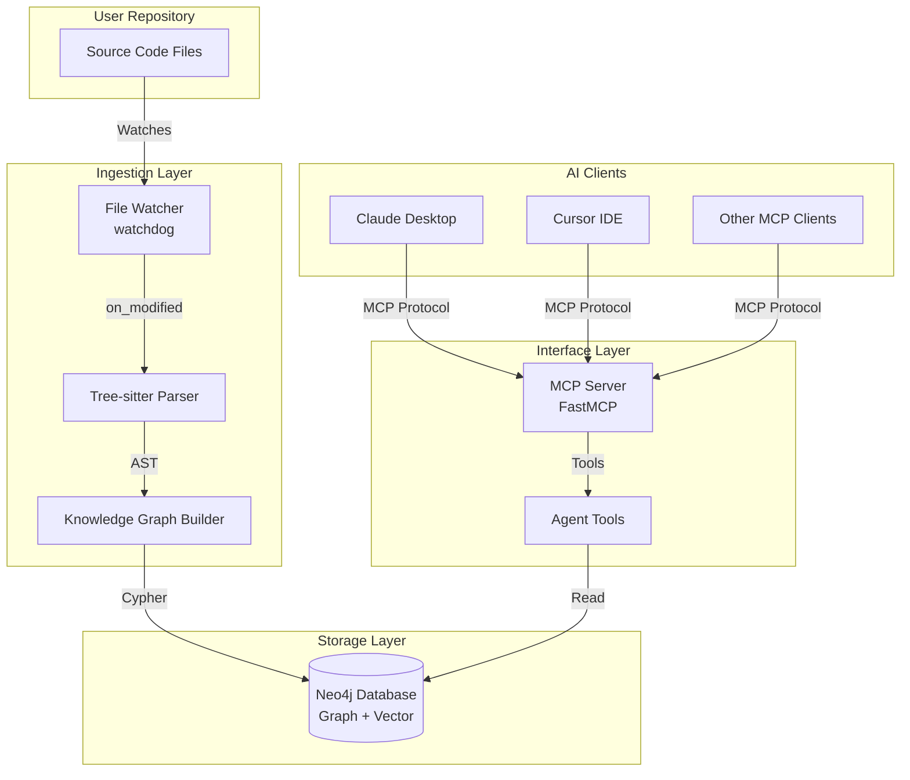
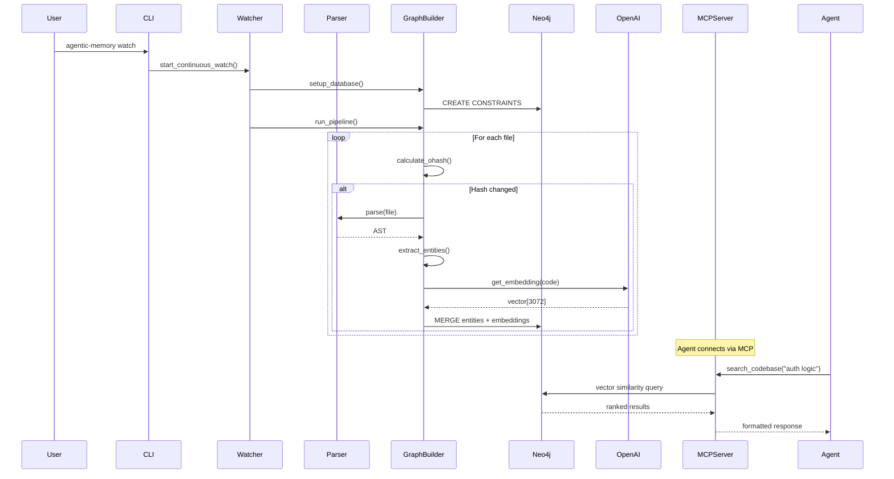
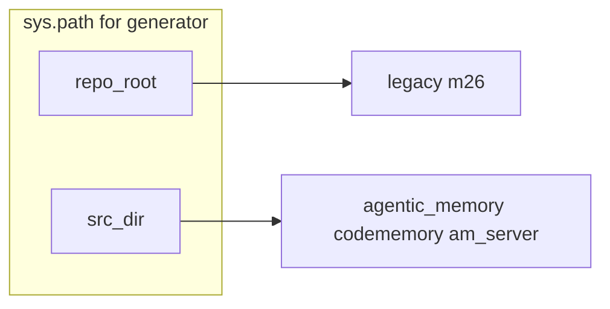

# Agentic Memory: Full Stack Context for NotebookLM

This document is auto-generated by `scripts/generate_notebooklm_docs.py`.
It covers the full agentic-memory stack: static project docs, Python
backend packages, and TypeScript worker packages.

## Table of Contents

### Static Documentation

- README.md
- docs/*.md (all Markdown documentation files)

### Python Backend Packages

- `agentic_memory`
- `codememory`
- `am_server`
- `am_proxy` *(optional — present in this environment)*

### Frontend TypeScript Packages

- `am-temporal-kg`
- `am-sync-neo4j`
- `am-openclaw`
- `bench` *(TypeScript benchmark files)*

---

# Static Documentation

## `README.md`

# 🧠 Agentic Memory
https://github.com/jarmen423/agentic-memory

> **Active, Structural Memory System for AI Coding Agents**

Agentic Memory is not just "RAG" for code. It is an **active, structural memory layer** that understands code relationships (dependencies, imports, inheritance), not just text similarity.

**Core Value Prop:** *"Don't let your Agent code blind. Give it a map."*

---

## ✨ Features

| Feature | Description |
|---------|-------------|
| **📊 Structural Graph** | Understands imports, dependencies, call graphs - not just text similarity |
| **🔍 Semantic Search** | Vector embeddings with contextual prefixing for accurate results |
| **⚡ Real-time Sync** | File watcher automatically updates the graph as you code |
| **🧬 Git Graph (Opt-in)** | Adds commit/author/file-version history in the same Neo4j DB with separate labels |
| **🤖 MCP Protocol** | Drop-in integration with Claude, Cursor, Windsurf, and any MCP-compatible AI |
| **💥 Impact Analysis** | See the blast radius of changes before you make them |

---

## 🚀 Quick Start (One Command Setup)

### 1. Install globally

```bash
# Recommended: Use pipx for isolated global installation
pipx install agentic-memory

# Or with uv tooling
uv tool install agentic-memory
uvx agentic-memory --help

# Or use pip in a virtualenv
pip install agentic-memory
```

`codememory` remains available as a compatibility alias, but `agentic-memory` is the primary name.

### 2. Initialize in any repository

```bash
cd /path/to/your/repo
agentic-memory init
```

The interactive wizard will guide you through:
- Neo4j setup (local Docker, Aura cloud, or custom)
- OpenAI API key (for semantic search)
- File extensions to index

That's it! Your repository is now indexed and ready for AI agents.

---

## 📖 Usage

### In any initialized repository:

```bash
# Show repository status and statistics
agentic-memory status

# One-time full index (e.g., after major changes)
agentic-memory index

# Watch for changes and continuously update
agentic-memory watch

# Start MCP server for AI agents
agentic-memory serve

# Test semantic search
agentic-memory search "where is the auth logic?"

# Git graph (rollout build)
agentic-memory git-init --repo /absolute/path/to/repo --mode local --full-history
agentic-memory git-sync --repo /absolute/path/to/repo --incremental
agentic-memory git-status --repo /absolute/path/to/repo --json
```

Git graph command details and rollout notes: [docs/GIT_GRAPH.md](docs/GIT_GRAPH.md)

---

## 🧾 Tool-Use Annotation (Research)

Agentic Memory now supports SQLite telemetry for MCP tool calls plus manual post-response labeling as `prompted` or `unprompted`.

```bash
agentic-memory --prompted "check our auth"
agentic-memory --unprompted "check our auth"
```

Full workflow and options: [docs/TOOL_USE_ANNOTATION.md](docs/TOOL_USE_ANNOTATION.md)

---

## 🏗️ Architecture

```
┌─────────────────┐     Watches      ┌──────────────────┐
│  User Repository│ ───────────────> │ Ingestion Service│
│                 │                  │ (Observer)       │
└─────────────────┘                  └────────┬─────────┘
                                              │ Writes
                                              ▼
                                       ┌──────────────┐
                                       │  Neo4j       │
                                       │  Cortex      │
                                       └──────┬───────┘
                                              │ Reads
                                              ▼
┌─────────────────┐     MCP Protocol  ┌──────────────────┐
│   AI Agent /    │ <───────────────> │  MCP Server      │
│   Claude        │                   │  (Interface)     │
└─────────────────┘                   └──────────────────┘
```

### Components

| Component | Role | Description |
|-----------|------|-------------|
| **Observer** (`watcher.py`) | The "Writer" | Watches filesystem changes and keeps the graph in sync |
| **Graph Builder** (`graph.py`) | The "Mapper" | Parses code with Tree-sitter, builds Neo4j graph with embeddings |
| **MCP Server** (`app.py`) | The "Interface" | Exposes high-level skills to AI agents via MCP protocol |

---

## ⏱️ Experimental Temporal GraphRAG

Phase 8 adds a shadow-mode temporal maintenance layer alongside the existing Neo4j graph:

- `packages/am-temporal-kg/` — SpacetimeDB TypeScript module for temporal edge ingest, scheduled maintenance, and deterministic temporal retrieval
- `packages/am-sync-neo4j/` — subscription worker that mirrors curated temporal rows back into Neo4j

This layer is additive in the current branch. Existing retrieval paths remain unchanged until the later retrieval cutover phase.

## Full-Stack Local Flow

Phase 10 adds a unified search surface across code, research, and conversation memory:

- MCP: `search_all_memory(...)`
- REST: `GET /search/all`

The next packaging layer adds a local product control plane for install and dogfood
loops:

- CLI: `agentic-memory product-status`, `agentic-memory product-repo-add`, `agentic-memory product-integration-set`, `agentic-memory product-component-set`, `agentic-memory product-event-record`
- REST: `GET /product/status`, `POST /product/repos`, `POST /product/integrations`, `POST /product/components/{component}`, `POST /product/events`, `POST /product/onboarding`
- Workflow: [docs/PRODUCT_DOGFOODING.md](docs/PRODUCT_DOGFOODING.md)

The first desktop-facing shell is a lightweight local FastAPI app in `desktop_shell/`. It
proxies the `am-server` product API and gives a browser-based control plane without
committing to a native desktop framework yet.

- Run `python -m am_server.server`
- Then run `python -m desktop_shell --backend-url http://127.0.0.1:8765`

Use these docs for the current local operator flow:

- [docs/SETUP_FULL_STACK.md](docs/SETUP_FULL_STACK.md)
- [docs/MCP_TOOL_REFERENCE.md](docs/MCP_TOOL_REFERENCE.md)
- [docs/PROVIDER_CONFIGURATION.md](docs/PROVIDER_CONFIGURATION.md)
- [docs/SPACETIMEDB_OPERATIONS.md](docs/SPACETIMEDB_OPERATIONS.md)
- [docs/PRODUCT_DOGFOODING.md](docs/PRODUCT_DOGFOODING.md)

---

## 🔌 MCP Tools Available to AI Agents

| Tool | Description |
|------|-------------|
| `search_codebase(query, limit=5, domain="code")` | Semantic search for code, git, or hybrid domain routing |
| `get_file_dependencies(file_path, domain="code")` | Returns imports and dependents for a file |
| `identify_impact(file_path, max_depth=3, domain="code")` | Blast radius analysis for changes |
| `get_file_info(file_path, domain="code")` | File structure overview (classes, functions) |
| `get_git_file_history(file_path, limit=20, domain="git")` | File-level commit history and ownership signals (git rollout) |
| `get_commit_context(sha, include_diff_stats=true)` | Commit metadata and change statistics (git rollout) |
| `find_recent_risky_changes(path_or_symbol, window_days, domain="hybrid")` | Recent high-risk changes using hybrid signals (git rollout) |

> Note: `domain` routing and git-domain tools are part of the git graph rollout. If they are missing in your installed build, use code-domain tools only and upgrade to a git-enabled release.

---

## ✅ Integration Recommendation Policy (PR7)

Current recommendation policy is explicit:

1. **Recommended default:** `mcp_native` integration for production reliability.
2. **Optional path:** `skill_adapter` workflow for shell/script-driven operators.
3. **Promotion rule:** `skill_adapter` becomes first-class only after parity evidence
   is captured versus `mcp_native` across success rate, latency, token cost, retries,
   and operator steps.

Reference docs and evaluation artifacts:

- [docs/evaluation-decision.md](docs/evaluation-decision.md)
- [evaluation/README.md](evaluation/README.md)
- [evaluation/tasks/benchmark_tasks.json](evaluation/tasks/benchmark_tasks.json)
- [evaluation/schemas/benchmark_results.schema.json](evaluation/schemas/benchmark_results.schema.json)
- [evaluation/skills/skill-adapter-workflow.md](evaluation/skills/skill-adapter-workflow.md)

---

## 🐳 Docker Setup (Neo4j)

### Quick Start

```bash
# Start Neo4j
docker-compose up -d neo4j

# Neo4j will be available at:
# HTTP: http://localhost:7474
# Bolt: bolt://localhost:7687
# Username: neo4j
# Password: password (change this in production!)
```

### Neo4j Aura (Cloud)

Get a free instance at [neo4j.com/cloud/aura/](https://neo4j.com/cloud/aura/)

---

## 📁 Configuration

Per-repository configuration is stored in `.codememory/config.json`:

```json
{
  "neo4j": {
    "uri": "bolt://localhost:7687",
    "user": "neo4j",
    "password": "password"
  },
  "openai": {
    "api_key": "sk-..."  // Optional - can use OPENAI_API_KEY env var
  },
  "indexing": {
    "ignore_dirs": ["node_modules", "__pycache__", ".git"],
    "extensions": [".py", ".js", ".ts", ".tsx", ".jsx"]
  }
}
```

**Note:** `.codememory/` is gitignored by default to prevent committing API keys.

---

## 🔧 Installation from Source

```bash
# Clone the repository
git clone https://github.com/jarmen423/agentic-memory.git
cd agentic-memory

# Install in editable mode
pip install -e .

# Run the init wizard in any repo
agentic-memory init
```

---

## 🧪 Development

```bash
# Install in editable mode
pip install -e .

# Run type checking (when mypy is configured)
mypy src/agentic_memory

# Run tests (when added)
pytest
```

---

## 📊 What Gets Indexed?

| Entity | Description | Relationships |
|--------|-------------|---------------|
| **Files** | Source code files | `[:DEFINES]`→ Functions/Classes, `[:IMPORTS]`→ Files |
| **Functions** | Function definitions | `[:CALLS]`→ Functions, `[:HAS_METHOD]`← Classes |
| **Classes** | Class definitions | `[:HAS_METHOD]`→ Methods |
| **Chunks** | Semantic embeddings | `[:DESCRIBES]`→ Functions/Classes |

---

## 🔌 MCP Integration

### Claude Desktop

```json
{
  "mcpServers": {
    "agentic-memory": {
      "command": "agentic-memory",
      "args": ["serve", "--repo", "/absolute/path/to/your/project"]
    }
  }
}
```

### Cursor IDE

```json
{
  "mcpServers": {
    "agentic-memory": {
      "command": "agentic-memory",
      "args": ["serve", "--repo", "/absolute/path/to/your/project", "--port", "8000"]
    }
  }
}
```

### Windsurf

Add to your MCP configuration file.

> Note: `--repo` requires the upcoming release that adds explicit repo targeting for `serve`.
> If your installed version does not support `--repo`, use your client's `cwd` setting
> (if supported) or launch via a wrapper script that runs `cd /absolute/path/to/project && agentic-memory serve`.

---

## 📝 License

MIT License - see LICENSE file for details.

---

## 🤝 Contributing

Contributions welcome! Please see TODO.md for the roadmap.

---

## 🙏 Acknowledgments

- **Neo4j** - Graph database with vector search
- **Tree-sitter** - Incremental parsing for code
- **OpenAI** - Embeddings for semantic search
- **MCP (Model Context Protocol)** - Standard interface for AI tools


---

## `docs\API.md`

# API Reference

Complete reference for Agentic Memory's CLI commands, MCP tools, configuration options, and Python API.

## Table of Contents

- [CLI Commands](#cli-commands)
- [MCP Tools](#mcp-tools)
- [Configuration Options](#configuration-options)
- [Python API](#python-api)
- [Error Codes](#error-codes)

---

## CLI Commands

### `agentic-memory init`

Initialize Agentic Memory in the current repository with an interactive wizard.

**Usage:**
```bash
agentic-memory init
```

**What it does:**
1. Creates `.codememory/` directory
2. Generates `config.json` with your settings
3. Offers to run initial indexing
4. Tests Neo4j connection

**Interactive prompts:**
```
━━━━━━━━━━━━━━━━━━━━━━━━━━━━━━━━━━━━━━━━━━━━━━━━━━━━━━━━━━━━━━━
Step 1: Neo4j Database Configuration
━━━━━━━━━━━━━━━━━━━━━━━━━━━━━━━━━━━━━━━━━━━━━━━━━━━━━━━━━━━━━━━

Options:
  1. Local Neo4j (Docker)
  2. Neo4j Aura (Cloud)
  3. Custom URL
  4. Use environment variables

Choose Neo4j setup [1-4] (default: 1):
```

**Output files:**
- `.codememory/config.json` - Repository configuration
- `.codememory/` - Added to `.gitignore`

**Example:**
```bash
$ cd /path/to/my/project
$ agentic-memory init

🚀 Initializing Agentic Memory in: /path/to/my/project

[Follow prompts...]

✅ Agentic Memory initialized successfully!
Config file: /path/to/my/project/.codememory/config.json

Next steps:
  • agentic-memory status    - Show repository status
  • agentic-memory watch     - Start continuous monitoring
  • agentic-memory serve     - Start MCP server for AI agents
```

**Exit codes:**
- `0` - Success
- `1` - Already initialized (use --force to override)

---

### `agentic-memory status`

Display statistics about the indexed repository.

**Usage:**
```bash
agentic-memory status
```

**Output:**
```
📊 Agentic Memory Status
━━━━━━━━━━━━━━━━━━━━━━━━━━━━━━━━━━━━━━━━━━━━━━━━━━━━━━━━━━━━━━━
Repository: /path/to/project
Config:     /path/to/project/.codememory/config.json

📈 Graph Statistics:
   Files:     142
   Functions: 856
   Classes:   67
   Chunks:    923
   Last sync: 2025-02-09 14:32:15
```

**Error cases:**
- Not initialized: Suggests running `agentic-memory init`
- Neo4j unavailable: Shows connection error

---

### `agentic-memory index`

Run a one-time full ingestion pipeline.

**Usage:**
```bash
agentic-memory index [options]
```

**Options:**
- `--quiet`, `-q` - Suppress progress output

**What it does:**
1. Pass 0: Setup database constraints
2. Pass 1: Scan files and detect changes
3. Pass 2: Parse entities and create embeddings
4. Pass 3: Build import graph
5. Pass 4: Construct call graph

**Example:**
```bash
$ agentic-memory index

============================================================
🚀 Starting Hybrid GraphRAG Ingestion
============================================================

📂 [Pass 1] Scanning Directory Structure...
✅ [Pass 1] Processed 15 new/modified files.

🧠 [Pass 2] Extracting Entities & Creating Chunks...
[1/15] 🧠 Processing: src/auth.py...
...
✅ [Pass 2] Entities and Semantic Chunks created.

🕸️ [Pass 3] Linking Files via Imports...
✅ [Pass 3] Import graph built.

📞 [Pass 4] Constructing Call Graph...
[1/15] 📞 Processing calls in: src/auth.py...
...
✅ [Pass 4] Call Graph approximation complete. Processed 15 files.

============================================================
📊 COST SUMMARY
============================================================
⏱️  Total Time: 45.23 seconds
🔢 Embedding API Calls: 142
📝 Total Tokens Used: 85,234
💰 Estimated Cost: $0.0111 USD
📦 Model: text-embedding-3-large
============================================================
✅ Graph is ready for Agent retrieval.
============================================================
```

**When to use:**
- After cloning a new repository
- After major code changes
- If watch mode missed updates

**Exit codes:**
- `0` - Success
- `1` - Not initialized
- `2` - Neo4j connection failed
- `3` - OpenAI API error

---

### `agentic-memory watch`

Start continuous file monitoring and incremental updates.

**Usage:**
```bash
agentic-memory watch [options]
```

**Options:**
- `--no-scan` - Skip initial full scan (start watching immediately)

**What it does:**
1. Optionally runs full pipeline first
2. Watches filesystem for changes
3. Incrementally updates only changed files
4. Runs until interrupted (Ctrl+C)

**Example:**
```bash
$ agentic-memory watch

👀 Starting Observer on: /path/to/project
🛠️  Setting up Database Indexes...
🚀 Running initial full pipeline...
[Full pipeline runs...]
✅ Initial scan complete. Watching for changes...
👀 Watching /path/to/project for changes. Press Ctrl+C to stop.

♻️  Change detected: src/auth.py
✅ Updated graph for: src/auth.py

➕ New file detected: src/utils/helpers.py
✅ Indexed new file: src/utils/helpers.py

🗑️  File deleted: src/legacy.py
✅ Removed from graph: src/legacy.py
```

**Events handled:**
- `on_modified` - File content changed
- `on_created` - New file added
- `on_deleted` - File removed

**Debouncing:**
- Ignores events within 1 second of last event per file
- Prevents redundant processing during save operations

**Limitations:**
- Does not update call graph (requires full scan)
- Only processes supported file extensions (.py, .js, .ts, .tsx, .jsx)

**Exit codes:**
- `0` - Graceful shutdown (Ctrl+C)
- `1` - Configuration error
- `130` - Interrupted by SIGINT

---

### `agentic-memory serve`

Start the MCP server for AI agent integration.

**Usage:**
```bash
agentic-memory serve [options]
```

**Options:**
- `--port` <port> - Port to listen on (default: 8000)

**Example:**
```bash
$ agentic-memory serve

📂 Using config from: /path/to/project/.codememory/config.json
✅ Connected to Neo4j at bolt://localhost:7687
🧠 Starting MCP Interface on port 8000
```

**Server behavior:**
- Runs until interrupted (Ctrl+C)
- Exposes 4 MCP tools (see [MCP Tools](#mcp-tools))
- Uses local config or environment variables
- Graceful shutdown on SIGTERM/SIGINT

**Configuration priority:**
1. `.codememory/config.json`
2. Environment variables (NEO4J_URI, OPENAI_API_KEY, etc.)
3. Defaults

**Testing the server:**
```bash
# In another terminal
curl http://localhost:8000/tools/search_codebase \
  -X POST \
  -H "Content-Type: application/json" \
  -d '{"query": "authentication", "limit": 3}'
```

**Exit codes:**
- `0` - Graceful shutdown
- `1` - Port already in use
- `2` - Neo4j connection failed

---

### `agentic-memory search`

Test semantic search from the command line (for debugging/testing).

**Usage:**
```bash
agentic-memory search <query> [options]
```

**Arguments:**
- `query` - Natural language search query (required)

**Options:**
- `--limit`, `-l` <number> - Maximum results to return (default: 5)

**Example:**
```bash
$ agentic-memory search "JWT token validation" --limit 3

Found 3 result(s):

1. **verify_token** [`src/auth/tokens.py:verify_token`] - Score: 0.94
   ```
   def verify_token(token: str) -> bool:
       """Verify JWT signature and expiration"""
       try:
           decoded = jwt.decode(token, SECRET, algorithms=["HS256"])
           return decoded.get("exp", 0) > time.time()
       except JWTError:
           return False
   ```

2. **decode_jwt** [`src/auth/utils.py:decode_jwt`] - Score: 0.87
   ```
   def decode_jwt(encoded: str) -> dict:
       """Decode JWT payload without verification"""
       return jwt.decode(encoded, options={"verify_signature": False})
   ```

3. **refresh_access** [`src/auth/session.py:refresh_access`] - Score: 0.81
   ```
   async def refresh_access(refresh_token: str) -> str:
       """Generate new access token from refresh token"""
       user = await verify_refresh_token(refresh_token)
       return create_access_token(user.id)
   ```

```

**When to use:**
- Verify embeddings are working
- Test search query quality
- Debug search results
- Quick lookup without AI agent

**Exit codes:**
- `0` - Success
- `1` - Not initialized
- `2` - OpenAI API key not configured
- `3` - No results found

---

## MCP Tools

### Tool: `search_codebase`

Semantically search the codebase for functionality.

**Signature:**
```python
def search_codebase(query: str, limit: int = 5) -> str
```

**Parameters:**
| Parameter | Type | Required | Default | Description |
|-----------|------|----------|---------|-------------|
| `query` | string | Yes | - | Natural language search query |
| `limit` | integer | No | 5 | Maximum number of results |

**Returns:**
Formatted Markdown string with search results.

**Example output:**
```markdown
Found 3 relevant code result(s):

1. **authenticate** (`src/auth.py:authenticate`) [Score: 0.92]
   ```
   def authenticate(username, password):
       """Verify user credentials and return session token"""
       if not verify_password(username, password):
           raise AuthenticationError("Invalid credentials")
       return create_session(username)
   ```

2. **login** (`src/controllers/user.py:login`) [Score: 0.87]
   ```
   async def login(request):
       """Handle user login requests"""
       data = await request.json()
       user = authenticate(data["username"], data["password"])
       return json_response({"token": user.token})
   ```
```

**Use cases:**
- Finding implementation of specific features
- Locating bug-prone code areas
- Understanding codebase organization

**Error cases:**
- Graph not initialized: Returns "❌ Graph not initialized"
- OpenAI key missing: Returns "❌ OpenAI API key not configured"
- No results: Returns "No relevant code found"

---

### Tool: `get_file_dependencies`

Returns files that this file IMPORTS and files that IMPORT this file.

**Signature:**
```python
def get_file_dependencies(file_path: str) -> str
```

**Parameters:**
| Parameter | Type | Required | Description |
|-----------|------|----------|-------------|
| `file_path` | string | Yes | Relative path to file (e.g., "src/services/auth.py") |

**Returns:**
Formatted Markdown string with bidirectional dependencies.

**Example output:**
```markdown
## Dependencies for `src/services/auth.py`

### 📥 Imports (this file depends on):
- `src/models/user.py`
- `src/database/connection.py`
- `src/utils/hash.py`

### 📤 Imported By (files that depend on this):
- `src/api/routes/users.py`
- `src/api/routes/auth.py`
- `src/scripts/migrate_users.py`
```

**Use cases:**
- Understanding module dependencies
- Refactoring without breaking imports
- Identifying tightly coupled code

**Error cases:**
- File not found: Returns "❌ File `{path}` not found in the graph"
- Invalid path: Returns "❌ Invalid file path format"

---

### Tool: `identify_impact`

Identify the blast radius of changes to a file (transitive dependents).

**Signature:**
```python
def identify_impact(file_path: str, max_depth: int = 3) -> str
```

**Parameters:**
| Parameter | Type | Required | Default | Description |
|-----------|------|----------|---------|-------------|
| `file_path` | string | Yes | - | Relative path to file |
| `max_depth` | integer | No | 3 | Maximum depth for transitive deps |

**Returns:**
Formatted Markdown string with affected files organized by depth.

**Example output:**
```markdown
## Impact Analysis for `src/models/user.py`

**Total affected files:** 8

### Depth 1 (direct dependents): 3 files
- `src/services/user.py`
- `src/api/routes/users.py`
- `src/api/routes/auth.py`

### Depth 2 (2-hop transitive dependents): 5 files
- `src/api/routes/admin.py`
- `src/tests/test_users.py`
- `src/tests/test_auth.py`
- `src/scripts/init_db.py`
- `src/controllers/user_controller.py`
```

**Use cases:**
- Assessing risk before refactoring
- Pre-commit impact checks
- Planning incremental changes

**Error cases:**
- File not found: Returns "❌ File not found in the graph"
- No dependents: Returns "No files depend on this file. Changes are isolated."

---

### Tool: `get_file_info`

Get detailed information about a file including its entities and relationships.

**Signature:**
```python
def get_file_info(file_path: str) -> str
```

**Parameters:**
| Parameter | Type | Required | Description |
|-----------|------|----------|-------------|
| `file_path` | string | Yes | Relative path to file |

**Returns:**
Formatted Markdown string with file structure.

**Example output:**
```markdown
## File: `user.py`

**Path:** `src/services/user.py`
**Last Updated:** 2025-02-09 14:32:15

### 📦 Classes (2)
- `UserService`
- `UserProfile`

### ⚡ Functions (5)
- `create_user()`
- `get_user_by_id()`
- `update_user()`
- `delete_user()`
- `list_users()`

### 📥 Imports (3)
- `src/models/user.py`
- `src/database/connection.py`
- `src/utils/hash.py`
```

**Use cases:**
- Quick file overview
- Understanding file organization
- Navigating large codebases

**Error cases:**
- File not found: Returns "❌ File `{path}` not found in the graph"
- Not yet indexed: Returns "*No entities found. File may not be parsed yet.*"

---

## Configuration Options

### Configuration File Structure

**Location:** `.codememory/config.json`

**Schema:**
```json
{
  "neo4j": {
    "uri": "bolt://localhost:7687",
    "user": "neo4j",
    "password": "password"
  },
  "openai": {
    "api_key": null
  },
  "indexing": {
    "ignore_dirs": [
      "node_modules",
      "__pycache__",
      ".git",
      "dist",
      "build",
      ".venv",
      "venv",
      ".pytest_cache",
      ".mypy_cache",
      "target",
      "bin",
      "obj"
    ],
    "ignore_files": [],
    "extensions": [".py", ".js", ".ts", ".tsx", ".jsx"]
  }
}
```

### Configuration Options Reference

#### `neo4j.uri`

**Type:** string
**Default:** `"bolt://localhost:7687"`
**Environment variable:** `NEO4J_URI`

Neo4j connection URI.

**Examples:**
- Local Docker: `bolt://localhost:7687`
- Neo4j Aura: `neo4j+s://instance.databases.neo4j.io`
- Remote server: `bolt://neo4j.example.com:7687`

---

#### `neo4j.user`

**Type:** string
**Default:** `"neo4j"`
**Environment variable:** `NEO4J_USER`

Neo4j username.

---

#### `neo4j.password`

**Type:** string
**Default:** `"password"`
**Environment variable:** `NEO4J_PASSWORD`

Neo4j password.

**Security:** Avoid committing to version control. Use environment variables in production.

---

#### `openai.api_key`

**Type:** string or null
**Default:** `null`
**Environment variable:** `OPENAI_API_KEY`

OpenAI API key for embeddings.

**Examples:**
- In config: `"sk-..."`
- Use env var: `null` (recommended)
- No key: `null` (semantic search disabled)

**Get API key:** https://platform.openai.com/api-keys

---

#### `indexing.ignore_dirs`

**Type:** array of strings
**Default:** `["node_modules", "__pycache__", ".git", ...]`

Directories to skip during indexing.

**Patterns:** Simple name matching (not regex).

**Examples:**
```json
{
  "ignore_dirs": [
    "node_modules",
    "__pycache__",
    "tests",
    "migrations",
    "vendor"
  ]
}
```

---

#### `indexing.ignore_files`

**Type:** array of strings
**Default:** `[]`

Specific files to skip during indexing.

**Examples:**
```json
{
  "ignore_files": [
    "setup.py",
    "__init__.py"
  ]
}
```

---

#### `indexing.extensions`

**Type:** array of strings
**Default:** `[".py", ".js", ".ts", ".tsx", ".jsx"]`

File extensions to index.

**Supported:**
- `.py` - Python
- `.js`, `.jsx` - JavaScript
- `.ts`, `.tsx` - TypeScript

**Examples:**
```json
{
  "extensions": [".py"]  // Only Python files
}
```

---

### Environment Variables

**Priority:** Environment variables override config file values.

| Variable | Purpose | Example |
|----------|---------|---------|
| `NEO4J_URI` | Neo4j connection URI | `bolt://localhost:7687` |
| `NEO4J_USER` | Neo4j username | `neo4j` |
| `NEO4J_PASSWORD` | Neo4j password | `your_password` |
| `OPENAI_API_KEY` | OpenAI API key | `sk-...` |
| `LOG_LEVEL` | Logging verbosity | `DEBUG`, `INFO`, `WARNING` |

**Example `.env` file:**
```bash
# Neo4j Configuration
NEO4J_URI=bolt://localhost:7687
NEO4J_USER=neo4j
NEO4J_PASSWORD=secure_password

# OpenAI Configuration
OPENAI_API_KEY=sk-your-api-key-here

# Optional
LOG_LEVEL=INFO
```

---

## Python API

### KnowledgeGraphBuilder

Main class for graph operations.

**Location:** `src/agentic_memory/ingestion/graph.py`

#### Constructor

```python
def __init__(
    uri: str,
    user: str,
    password: str,
    openai_key: str,
    repo_root: Optional[Path] = None,
    ignore_dirs: Optional[Set[str]] = None,
    ignore_files: Optional[Set[str]] = None
)
```

**Parameters:**
- `uri` - Neo4j connection URI
- `user` - Neo4j username
- `password` - Neo4j password
- `openai_key` - OpenAI API key
- `repo_root` - Repository path (optional)
- `ignore_dirs` - Directories to ignore (optional)
- `ignore_files` - Files to ignore (optional)

**Example:**
```python
from agentic_memory.ingestion.graph import KnowledgeGraphBuilder
from pathlib import Path

builder = KnowledgeGraphBuilder(
    uri="bolt://localhost:7687",
    user="neo4j",
    password="password",
    openai_key="sk-...",
    repo_root=Path("/path/to/repo")
)
```

---

#### Methods

##### `setup_database()`

Create database constraints and indexes.

```python
def setup_database(self) -> None
```

**Example:**
```python
builder.setup_database()
# Creates:
# - Uniqueness constraints
# - Vector index
# - Fulltext index
```

---

##### `run_pipeline()`

Execute the full 4-pass ingestion pipeline.

```python
def run_pipeline(self, repo_path: Optional[Path] = None) -> Dict
```

**Returns:**
```python
{
    "elapsed_seconds": 45.23,
    "embedding_calls": 142,
    "tokens_used": 85234,
    "cost_usd": 0.0111
}
```

**Example:**
```python
metrics = builder.run_pipeline(Path("/path/to/repo"))
print(f"Cost: ${metrics['cost_usd']:.4f}")
```

---

##### `semantic_search()`

Perform vector similarity search.

```python
def semantic_search(self, query: str, limit: int = 5) -> List[Dict]
```

**Returns:**
```python
[
    {
        "name": "authenticate",
        "sig": "src/auth.py:authenticate",
        "score": 0.92,
        "text": "def authenticate(username, password):..."
    },
    ...
]
```

**Example:**
```python
results = builder.semantic_search("JWT validation", limit=3)
for r in results:
    print(f"{r['name']} - Score: {r['score']:.2f}")
```

---

##### `get_file_dependencies()`

Get bidirectional file dependencies.

```python
def get_file_dependencies(self, file_path: str) -> Dict[str, List[str]]
```

**Returns:**
```python
{
    "imports": ["src/models/user.py", "src/utils/hash.py"],
    "imported_by": ["src/api/routes/users.py"]
}
```

**Example:**
```python
deps = builder.get_file_dependencies("src/services/auth.py")
print(f"Imports: {deps['imports']}")
print(f"Imported by: {deps['imported_by']}")
```

---

##### `identify_impact()`

Analyze transitive dependents of a file.

```python
def identify_impact(
    self,
    file_path: str,
    max_depth: int = 3
) -> Dict[str, List[Dict]]
```

**Returns:**
```python
{
    "affected_files": [
        {"path": "src/api/users.py", "depth": 1, "impact_type": "dependents"},
        {"path": "src/controllers/user.py", "depth": 2, "impact_type": "dependents"}
    ],
    "total_count": 2
}
```

**Example:**
```python
impact = builder.identify_impact("src/models/user.py", max_depth=2)
print(f"Total affected: {impact['total_count']}")
for f in impact['affected_files']:
    print(f"  {f['path']} (depth {f['depth']})")
```

---

##### `close()`

Close database connection.

```python
def close(self) -> None
```

**Example:**
```python
builder.close()
```

---

### Config

Configuration management class.

**Location:** `src/agentic_memory/config.py`

#### Constructor

```python
def __init__(self, repo_root: Path)
```

**Example:**
```python
from agentic_memory.config import Config
from pathlib import Path

config = Config(Path("/path/to/repo"))
```

---

#### Methods

##### `exists()`

Check if configuration exists.

```python
def exists(self) -> bool
```

---

##### `load()`

Load configuration from file.

```python
def load(self) -> Dict[str, Any]
```

---

##### `save()`

Save configuration to file.

```python
def save(self, config: Dict[str, Any]) -> None
```

---

##### `get_neo4j_config()`

Get Neo4j configuration with env var fallback.

```python
def get_neo4j_config(self) -> Dict[str, str]
```

**Returns:**
```python
{
    "uri": "bolt://localhost:7687",
    "user": "neo4j",
    "password": "password"
}
```

---

##### `get_openai_key()`

Get OpenAI API key with env var fallback.

```python
def get_openai_key(self) -> Optional[str]
```

---

##### `get_indexing_config()`

Get indexing configuration.

```python
def get_indexing_config(self) -> Dict[str, Any]
```

---

## Error Codes

### CLI Exit Codes

| Code | Meaning | Common Causes |
|------|---------|---------------|
| 0 | Success | - |
| 1 | General error | Not initialized, invalid config |
| 2 | Connection failed | Neo4j unavailable, wrong credentials |
| 3 | API error | OpenAI key invalid, rate limit |
| 130 | Interrupted | Ctrl+C pressed |

### MCP Tool Errors

| Error | Message | Resolution |
|-------|---------|------------|
| Graph not initialized | "❌ Graph not initialized" | Run `agentic-memory index` |
| File not found | "❌ File not found in the graph" | Check file path, run indexing |
| OpenAI key missing | "❌ OpenAI API key not configured" | Set `OPENAI_API_KEY` |
| No results | "No relevant code found" | Try different query |
| Connection failed | "❌ Failed to connect to Neo4j" | Check Neo4j is running |

### Exception Types

**Python exceptions raised:**

| Exception | When | How to handle |
|-----------|------|---------------|
| `RuntimeError` | Config file corrupted | Re-run `agentic-memory init` |
| `neo4j.ServiceUnavailable` | Neo4j not running | Start Neo4j |
| `openai.AuthenticationError` | Invalid API key | Check `OPENAI_API_KEY` |
| `openai.RateLimitError` | API rate limit | Wait and retry |
| `FileNotFoundError` | Repository not found | Check path is correct |

---

## Type Definitions

### FileNode

```python
{
    "path": str,              # Unique identifier
    "name": str,              # Filename
    "ohash": str,             # MD5 hash
    "last_updated": datetime  # Timestamp
}
```

### FunctionNode

```python
{
    "signature": str,         # Unique identifier
    "name": str,              # Function name
    "code": str,              # Full source
    "docstring": str | None,  # Docstring
    "parameters": str | None, # Parameters
    "return_type": str | None # Return type
}
```

### ClassNode

```python
{
    "qualified_name": str,    # Unique identifier
    "name": str,              # Class name
    "code": str               # Full source
}
```

### ChunkNode

```python
{
    "id": str,                # UUID
    "text": str,              # Code snippet
    "embedding": List[float], # 3072-dim vector
    "created_at": datetime    # Timestamp
}
```

### SearchResult

```python
{
    "name": str,              # Entity name
    "sig": str,               # Entity signature
    "score": float,           # Similarity (0-1)
    "text": str               # Code snippet
}
```

### ImpactResult

```python
{
    "path": str,              # File path
    "depth": int,             # Distance from source
    "impact_type": str        # "dependents"
}
```

---

**API Version:** 1.0.0
**Last Updated:** 2025-02-09


---

## `docs\ARCHITECTURE.md`

# Architecture Documentation

This document provides a comprehensive technical overview of Agentic Memory's architecture, design decisions, and implementation details.

## Table of Contents

- [System Overview](#system-overview)
- [Graph Schema](#graph-schema)
- [4-Pass Ingestion Pipeline](#4-pass-ingestion-pipeline)
- [Tree-sitter Parsing Strategy](#tree-sitter-parsing-strategy)
- [Vector Embeddings](#vector-embeddings)
- [Cypher Query Patterns](#cypher-query-patterns)
- [Component Architecture](#component-architecture)
- [Performance Considerations](#performance-considerations)

---

## System Overview

Agentic Memory is a **hybrid GraphRAG** system that combines:

1. **Structural Graph:** Captures code relationships (imports, calls, containment)
2. **Semantic Embeddings:** Vector search for natural language queries
3. **Real-time Sync:** File watcher keeps graph updated

### High-Level Architecture



### Design Principles

| Principle | Implementation |
|-----------|----------------|
| **Structure over Similarity** | Graph relationships first, vectors second |
| **Incremental Updates** | Only process changed files (oHash-based) |
| **Contextual Embeddings** | Prefix chunks with file/class/function context |
| **Decoupled Components** | Ingestion, storage, and interface are independent |
| **MCP-First** | All agent access via MCP protocol (no raw DB access) |

---

## Graph Schema

### Node Types

#### File Node

Represents a source code file.

```cypher
(:File {
  path: string,          // Unique: "src/services/auth.py"
  name: string,          // "auth.py"
  ohash: string,         // MD5 hash for change detection
  last_updated: datetime // Timestamp of last update
})
```

**Constraints:**
```cypher
CREATE CONSTRAINT file_path_unique
FOR (f:File) REQUIRE f.path IS UNIQUE
```

#### Function Node

Represents a function or method definition.

```cypher
(:Function {
  signature: string,     // Unique: "src/auth.py:authenticate"
  name: string,          // "authenticate"
  code: string,          // Full source code
  docstring: string?,    // Extracted docstring
  parameters: string?,   // Comma-separated parameter names
  return_type: string?   // Return type annotation
})
```

**Constraints:**
```cypher
CREATE CONSTRAINT function_sig_unique
FOR (f:Function) REQUIRE f.signature IS UNIQUE
```

#### Class Node

Represents a class definition.

```cypher
(:Class {
  qualified_name: string, // Unique: "src/models/user.py:User"
  name: string,          // "User"
  code: string           // Full source code
})
```

**Constraints:**
```cypher
CREATE CONSTRAINT class_name_unique
FOR (c:Class) REQUIRE c.qualified_name IS UNIQUE
```

#### Chunk Node

Contains semantic embeddings for natural language search.

```cypher
(:Chunk {
  id: string,            // UUID
  text: string,          // Code snippet
  embedding: vector[3072], // OpenAI text-embedding-3-large
  created_at: datetime
})
```

**Vector Index:**
```cypher
CREATE VECTOR INDEX code_embeddings
FOR (c:Chunk) ON (c.embedding)
OPTIONS {
  indexConfig: {
    `vector.dimensions`: 3072,
    `vector.similarity_function`: 'cosine'
  }
}
```

### Relationship Types

#### DEFINES

`(File:File)-[:DEFINES]->(Entity:Function|Class)`

Represents containment. A file defines functions and classes.

**Example:**
```cypher
(src/auth.py:File)-[:DEFINES]->(authenticate:Function)
(src/auth.py:File)-[:DEFINES]->(AuthService:Class)
```

#### IMPORTS

`(File:File)-[:IMPORTS]->(Target:File)`

Represents module dependencies.

**Example:**
```cypher
(src/routes/users.py:File)-[:IMPORTS]->(src/models/user.py:File)
(src/services/auth.py:File)-[:IMPORTS]->(src/utils/hash.py:File)
```

#### CALLS

`(Caller:Function)-[:CALLS]->(Callee:Function)`

Represents function call graph.

**Example:**
```cypher
(login:Function)-[:CALLS]->(verify_password:Function)
(login:Function)-[:CALLS]->(create_session:Function)
```

#### HAS_METHOD

`(Class:Class)-[:HAS_METHOD]->(Method:Function)`

Represents class membership.

**Example:**
```cypher
(User:Class)-[:HAS_METHOD]->(save:Function)
(User:Class)-[:HAS_METHOD]->(delete:Function)
```

#### DESCRIBES

`(Chunk:Chunk)-[:DESCRIBES]->(Entity:Function|Class)`

Links semantic embeddings to code entities.

**Example:**
```cypher
(chunk_abc123:Chunk)-[:DESCRIBES]->(authenticate:Function)
```

### Fulltext Index

For keyword-based search:

```cypher
CREATE FULLTEXT INDEX entity_text_search
FOR (n:Function|Class|File) ON EACH [n.name, n.docstring, n.path]
```

---

## 4-Pass Ingestion Pipeline

The ingestion pipeline processes code in 4 sequential passes to build the complete graph.

### Pass 0: Pre-flight (Database Setup)

**File:** `src/agentic_memory/ingestion/graph.py:setup_database()`

**Purpose:** Create constraints and indexes before ingestion.

**Operations:**
1. Create uniqueness constraints (File.path, Function.signature, Class.qualified_name)
2. Create vector index on Chunk.embeddings
3. Create fulltext index for keyword search

**Why:** Constraints enable efficient `MERGE` operations and prevent duplicates.

```cypher
-- Enable fast lookups and upserts
CREATE CONSTRAINT file_path_unique IF NOT EXISTS
FOR (f:File) REQUIRE f.path IS UNIQUE;

-- Enable vector similarity search
CREATE VECTOR INDEX code_embeddings IF NOT EXISTS
FOR (c:Chunk) ON (c.embedding)
OPTIONS {
  indexConfig: {
    `vector.dimensions`: 3072,
    `vector.similarity_function`: 'cosine'
  }
};
```

---

### Pass 1: Structure Scan & Change Detection

**File:** `src/agentic_memory/ingestion/graph.py:pass_1_structure_scan()`

**Purpose:** Discover files and detect changes using MD5 hashes.

**Algorithm:**
1. Walk directory tree (recursively)
2. Calculate MD5 hash for each file (`_calculate_ohash()`)
3. Check if file exists in graph with matching hash
4. Only create/update if hash differs

**Change Detection:**
```python
# Pseudocode
for file in files:
    current_hash = md5(file.read_bytes())

    existing = query("MATCH (f:File {path: $path}) RETURN f.ohash", path=file.path)

    if existing["hash"] == current_hash:
        continue  # Skip, no changes

    # Create or update File node
    merge("(:File {path: $path, ohash: $current_hash})")
```

**Benefits:**
- Incremental updates (only process changed files)
- Idempotent (safe to re-run)
- Fast for large repos (most files unchanged)

**Output:** File nodes with up-to-date hashes.

---

### Pass 2: Entity Definition & Chunking

**File:** `src/agentic_memory/ingestion/graph.py:pass_2_entity_definition()`

**Purpose:** Extract functions/classes and create semantic chunks.

**Algorithm:**
1. Fetch all File nodes from Pass 1
2. Parse each file with Tree-sitter
3. Extract function/class definitions
4. Create Function/Class nodes
5. Generate embeddings with **contextual prefixing**

#### Tree-sitter Queries

**Python:**
```scheme
(class_definition
  name: (identifier) @name
  body: (block) @body) @class

(function_definition
  name: (identifier) @name
  body: (block) @body) @function
```

**JavaScript/TypeScript:**
```scheme
(class_declaration name: (identifier) @name) @class
(function_declaration name: (identifier) @name) @function
```

#### Contextual Prefixing

**The Secret Sauce:** Prepend context to code before embedding.

**Example:**
```python
# Raw code
def authenticate(username, password):
    """Verify user credentials"""
    return check_password(username, password)

# Contextual prefix
enriched_text = """Context: File src/auth.py > Method: authenticate

def authenticate(username, password):
    \"\"\"Verify user credentials\"\"\"
    return check_password(username, password)"""
```

**Why?**
- Embeddings capture hierarchical context
- Search results include file/class path
- Disambiguates同名 functions (e.g., `parse()` in different modules)

**Output:**
- Function nodes with full code
- Class nodes with full code
- Chunk nodes with 3072-dim embeddings

---

### Pass 3: Import Resolution

**File:** `src/agentic_memory/ingestion/graph.py:pass_3_imports()`

**Purpose:** Build dependency graph by analyzing import statements.

**Algorithm:**
1. Fetch all `.py` files from graph
2. Parse with Tree-sitter to find import statements
3. Convert module names to file paths (heuristic)
4. Create `[:IMPORTS]` relationships

#### Tree-sitter Query

```scheme
(import_statement name: (dotted_name) @module)
(import_from_statement module_name: (dotted_name) @module)
```

#### Path Resolution Heuristic

```python
# Example import
import command_service.app

# Convert to potential file path
module_name.replace(".", "/")  # → "command_service/app"

# Fuzzy match in graph
MATCH (source:File {path: "src/routes/users.py"})
MATCH (target:File)
WHERE target.path CONTAINS "command_service/app"
MERGE (source)-[:IMPORTS]->(target)
```

**Limitations:**
- May create false positives (e.g., `http.server` vs local `http/server.py`)
- Doesn't handle dynamic imports
- Doesn't resolve aliased imports (`from x import y as z`)

**Future Improvements:**
- AST-based resolution
- Python module path resolution
- Configuration for custom import mappings

**Output:** `[:IMPORTS]` relationships between File nodes.

---

### Pass 4: Call Graph Construction

**File:** `src/agentic_memory/ingestion/graph.py:pass_4_call_graph()`

**Purpose:** Build function call graph for dependency analysis.

**Algorithm:**
1. Fetch all Function nodes grouped by file
2. Parse each file with Tree-sitter
3. Extract all function calls
4. Match calls to Function nodes by name
5. Create `[:CALLS]` relationships

#### Tree-sitter Query

```scheme
(call function: (identifier) @name)
```

#### Optimized Batch Processing

**Old approach (slow):** Process each function separately
```python
for func in functions:
    calls = parse_calls(file)
    for call in calls:
        create_relationship(caller=func, callee=call)
```

**New approach (fast):** Process all calls in file, then batch
```python
# Parse file once
all_calls_in_file = parse_all_calls(file)

# Batch create relationships
UNWIND $calls as called_name
MATCH (caller:Function {signature: $caller_sig})
MATCH (callee:Function {name: called_name})
WHERE caller <> callee
MERGE (caller)-[:CALLS]->(callee)
```

**Benefits:**
- 10-50x faster (fewer Cypher queries)
- Single pass per file
- Batching reduces Neo4j round-trips

**Limitations:**
- Doesn't resolve method calls on objects (`obj.method()`)
- Doesn't handle indirect calls (callbacks, decorators)
- May create false matches (same-named functions in different modules)

**Output:** `[:CALLS]` relationships between Function nodes.

---

## Tree-sitter Parsing Strategy

### Why Tree-sitter?

| Feature | Tree-sitter | Regex | AST (ast module) |
|---------|-------------|-------|------------------|
| Language-agnostic | ✅ | ❌ | ❌ |
| Error recovery | ✅ | ❌ | ❌ |
| Incremental parsing | ✅ | ❌ | ❌ |
| Captures line numbers | ✅ | Partial | ✅ |
| Handles syntax errors | ✅ | ❌ | ❌ |

### Language Support

**Currently Supported:**
- Python (`.py`)
- JavaScript (`.js`, `.jsx`)
- TypeScript (`.ts`, `.tsx`)

**Adding New Languages:**

```python
# 1. Install tree-sitter language binding
pip install tree-sitter-go

# 2. Add to _init_parsers()
go_lang = Language(tree_sitter_go.language())
parsers[".go"] = Parser(go_lang)

# 3. Add language-specific queries
if extension == ".go":
    query_scm = """
    (function_declaration name: (identifier) @name) @function
    (type_declaration name: (identifier) @name) @class
    """
```

### Query Cursor Pattern

**Standard pattern for executing Tree-sitter queries:**

```python
from tree_sitter import Language, Query, QueryCursor

# 1. Get language object
lang = Language(tree_sitter_python.language())

# 2. Compile query
query = Query(lang, query_scm)

# 3. Create cursor and execute
cursor = QueryCursor(query)
captures = cursor.captures(tree.root_node)

# 4. Process captures
for tag, nodes in captures.items():
    for node in nodes:
        # Extract text from node
        text = code[node.start_byte:node.end_byte]
```

### Navigating AST

```python
# Find parent class
current = node.parent
while current:
    if current.type == "class_definition":
        # Found parent class
        break
    current = current.parent

# Find children
for child in node.children:
    if child.type == "identifier":
        name = code[child.start_byte:child.end_byte]
```

---

## Vector Embeddings

### Embedding Model

**Model:** OpenAI `text-embedding-3-large`
- **Dimensions:** 3072
- **Cost:** $0.13 per 1M tokens
- **Max Input:** 8191 tokens (~24,000 chars)

### Contextual Prefixing Strategy

**Problem:** Naive embeddings lose hierarchical context.

**Solution:** Prepend hierarchical path to code snippet.

```
┌─────────────────────────────────────────────────────────┐
│ Context: File src/auth.py > Class AuthService > Method login │
├─────────────────────────────────────────────────────────┤
│                                                          │
│ async def login(username, password):                    │
│     """Authenticate user and return session token"""    │
│     user = await db.get_user(username)                  │
│     if not verify_password(password, user.hash):        │
│         raise AuthenticationError()                     │
│     return create_session(user.id)                      │
│                                                          │
└─────────────────────────────────────────────────────────┘
```

**Benefits:**
- Disambiguates同名 functions
- Search results include full path
- Improves semantic similarity
- Helps LLMs understand context

### Token Management

**Truncation:**
```python
MAX_CHARS = 24000  # Safety margin for 8191 tokens

if len(text) > MAX_CHARS:
    text = text[:MAX_CHARS] + "...[TRUNCATED]"
```

**Cost Tracking:**
```python
self.token_usage = {
    "embedding_tokens": 0,
    "embedding_calls": 0,
    "total_cost_usd": 0.0
}

# After each embedding
cost = (tokens / 1_000_000) * 0.13
self.token_usage["total_cost_usd"] += cost
```

### Vector Search

**Cypher Query:**
```cypher
CALL db.index.vector.queryNodes('code_embeddings', $limit, $vec)
YIELD node, score
MATCH (node)-[:DESCRIBES]->(target)
RETURN target.name, target.signature, score, node.text
ORDER BY score DESC
```

**How it works:**
1. Convert query text to embedding
2. Find nearest chunks (cosine similarity)
3. Traverse to described entities
4. Return ranked results

---

## Cypher Query Patterns

### Pattern 1: File Dependencies

**Get what a file imports:**
```cypher
MATCH (f:File {path: $path})-[:IMPORTS]->(dep)
RETURN dep.path
```

**Get what imports a file:**
```cypher
MATCH (f:File {path: $path})<-[:IMPORTS]-(caller)
RETURN caller.path
```

**Combined (bidirectional):**
```cypher
MATCH (f:File {path: $path})
OPTIONAL MATCH (f)-[:IMPORTS]->(imported)
OPTIONAL MATCH (dependent)-[:IMPORTS]->(f)
RETURN
  collect(DISTINCT imported.path) as imports,
  collect(DISTINCT dependent.path) as imported_by
```

---

### Pattern 2: Transitive Dependencies (Impact Analysis)

**Find all files that transitively depend on a file:**
```cypher
MATCH path = (f:File {path: $path})<-[:IMPORTS*1..3]-(dependent)
RETURN DISTINCT
  dependent.path,
  length(path) as depth
ORDER BY depth, path
```

**Explanation:**
- `<-[:IMPORTS*1..3]` - Reverse traversal, 1 to 3 hops
- `length(path)` - Distance from source
- `DISTINCT` - Deduplicate multiple paths

---

### Pattern 3: Call Graph

**Find what a function calls:**
```cypher
MATCH (fn:Function {signature: $sig})-[:CALLS]->(callee)
RETURN callee.name, callee.signature
```

**Find what calls a function:**
```cypher
MATCH (fn:Function {signature: $sig})<-[:CALLS]-(caller)
RETURN caller.name, caller.signature
```

---

### Pattern 4: File Structure

**Get all entities in a file:**
```cypher
MATCH (f:File {path: $path})
OPTIONAL MATCH (f)-[:DEFINES]->(fn:Function)
OPTIONAL MATCH (f)-[:DEFINES]->(c:Class)
OPTIONAL MATCH (f)-[:IMPORTS]->(imp:File)
RETURN
  f.name,
  collect(DISTINCT fn.name) as functions,
  collect(DISTINCT c.name) as classes,
  collect(DISTINCT imp.path) as imports
```

---

### Pattern 5: Hybrid Search (Vector + Graph)

**Find relevant code and its dependencies:**
```cypher
// Vector search
CALL db.index.vector.queryNodes('code_embeddings', 5, $vec)
YIELD node, score
MATCH (node)-[:DESCRIBES]->(target)

// Get file context
OPTIONAL MATCH (target)<-[:DEFINES]-(f:File)

// Return with dependencies
RETURN
  target.name,
  target.signature,
  score,
  f.path as file_path,
  [(f)-[:IMPORTS]->(dep) | dep.path] as dependencies
ORDER BY score DESC
```

---

### Pattern 6: Change Detection

**Files modified since last scan:**
```cypher
MATCH (f:File)
WHERE f.last_updated < datetime() - duration('P1D')
RETURN f.path, f.last_updated
ORDER BY f.last_updated DESC
```

**Orphaned nodes (file deleted from disk):**
```cypher
// After Pass 1, mark files not found during scan
MATCH (f:File)
WHERE f.scanned = false
DETACH DELETE f
```

---

## Component Architecture

### 1. CLI Layer (`cli.py`)

**Responsibilities:**
- Argument parsing (argparse)
- Command dispatch
- User interaction (init wizard)

**Commands:**
```python
agentic-memory init      # Interactive setup
agentic-memory status    # Show statistics
agentic-memory index     # One-time ingestion
agentic-memory watch     # Continuous monitoring
agentic-memory serve     # MCP server
agentic-memory search    # Test semantic search
```

---

### 2. Config Layer (`config.py`)

**Responsibilities:**
- Load/save `.codememory/config.json`
- Environment variable fallback
- Find repository root

**Priority:**
1. Command-line arguments
2. `.codememory/config.json`
3. Environment variables
4. Defaults

---

### 3. Ingestion Layer (`ingestion/`)

#### Graph Builder (`graph.py`)

**Class:** `KnowledgeGraphBuilder`

**Core Methods:**
- `setup_database()` - Create constraints/indexes
- `run_pipeline()` - Execute all 4 passes
- `pass_1_structure_scan()` - File discovery
- `pass_2_entity_definition()` - Parse and embed
- `pass_3_imports()` - Build import graph
- `pass_4_call_graph()` - Build call graph
- `semantic_search()` - Vector similarity search
- `get_file_dependencies()` - Dependency analysis
- `identify_impact()` - Blast radius analysis

**State:**
```python
self.driver: neo4j.Driver           # Database connection
self.openai_client: OpenAI          # Embedding client
self.parsers: Dict[str, Parser]     # Tree-sitter parsers
self.token_usage: Dict              # Cost tracking
self.repo_root: Path                # Repository path
```

#### File Watcher (`watcher.py`)

**Class:** `CodeChangeHandler`

**Event Handlers:**
- `on_modified()` - File changed (debounced)
- `on_created()` - New file added
- `on_deleted()` - File removed

**Debouncing:**
```python
# Ignore events within 1 second of last event
if now - last_time < 1.0:
    return
```

**Incremental Updates:**
1. Delete old entities for file
2. Re-parse file
3. Re-create embeddings
4. Update imports

**Does NOT update call graph** (requires full repo scan).

---

### 4. Server Layer (`server/`)

#### MCP Server (`app.py`)

**Framework:** FastMCP

**Tools:**
- `search_codebase()`
- `get_file_dependencies()`
- `identify_impact()`
- `get_file_info()`

**Initialization:**
```python
def init_graph():
    # Try local config first
    config = Config(repo_root)
    if config.exists():
        neo4j_cfg = config.get_neo4j_config()
    else:
        # Fall back to environment variables
        neo4j_cfg = {
            "uri": os.getenv("NEO4J_URI"),
            "user": os.getenv("NEO4J_USER"),
            "password": os.getenv("NEO4J_PASSWORD")
        }

    graph = KnowledgeGraphBuilder(**neo4j_cfg)
    return graph
```

#### Toolkit (`tools.py`)

**Class:** `Toolkit`

**Purpose:** Business logic separated from server protocol.

**Methods:**
- `semantic_search()` - Format results for LLM
- `get_file_dependencies()` - Query and format deps

**Why separate?** Testable without MCP server.

---

## Performance Considerations

### Bottlenecks

1. **Embedding API Calls** (largest bottleneck)
   - ~100ms per call (network latency)
   - Batch processing doesn't help (OpenAI limitation)
   - Solution: Only embed changed files

2. **Cypher Query Execution**
   - CALLS relationship creation is expensive
   - Solution: Batch processing with UNWIND

3. **Tree-sitter Parsing**
   - Fast for most files
   - Slow for very large files (>10K LOC)
   - Solution: Skip vendor directories

### Optimization Strategies

#### 1. Incremental Updates

```python
# Only process files with changed hashes
if current_hash == stored_hash:
    continue  # Skip
```

#### 2. Batch Cypher Operations

```python
# Instead of N queries:
for call in calls:
    session.run("MATCH ... MERGE (caller)-[:CALLS]->(callee)")

# Use UNWIND:
session.run("""
UNWIND $calls as called_name
MATCH (caller:Function {signature: $sig})
MATCH (callee:Function {name: called_name})
MERGE (caller)-[:CALLS]->(callee)
""", calls=calls, sig=caller_sig)
```

#### 3. Index Utilization

```cypher
// Ensure queries use indexes
PROFILE MATCH (f:File {path: $path}) RETURN f

// Look for:
// - "NodeIndexSeek" (good)
// - "NodeByLabelScan" (bad - needs index)
```

#### 4. Memory Management

```python
# Process files in batches to avoid memory spikes
BATCH_SIZE = 100

for i in range(0, len(files), BATCH_SIZE):
    batch = files[i:i+BATCH_SIZE]
    process_batch(batch)
```

### Performance Benchmarks

**Test Repository:** 50K LOC Python project

| Operation | Time | Cost |
|-----------|------|------|
| Pass 1 (Scan) | 2s | $0.00 |
| Pass 2 (Parse + Embed) | 45s | $0.82 |
| Pass 3 (Imports) | 8s | $0.00 |
| Pass 4 (Call Graph) | 12s | $0.00 |
| **Total (Initial)** | **67s** | **$0.82** |
| **Incremental (1 file)** | **3s** | **$0.01** |

---

## Data Flow Diagram



---

## Future Enhancements

### Planned Features

1. **Additional Languages**
   - Go, Rust, Java, C/C++
   - Community-contributed parsers

2. **Advanced Relationships**
   - `[:INHERITS]` - Class inheritance
   - `[:IMPLEMENTS]` - Interface implementation
   - `[:DECORATES]` - Python decorators

3. **Hybrid Search**
   - Combine vector + keyword + graph traversal
   - Reranking with graph context

4. **Multi-Repository Support**
   - Namespace isolation
   - Cross-repo dependencies

5. **Caching Layer**
   - Redis for frequently accessed queries
   - Materialized views for common patterns

### Contribution Opportunities

See [CONTRIBUTING.md](../CONTRIBUTING.md) for:
- Adding language support
- Optimizing Cypher queries
- Improving parser accuracy
- Extending MCP tools

---

## References

- **Neo4j Cypher Manual:** https://neo4j.com/docs/cypher-manual/
- **Tree-sitter Documentation:** https://tree-sitter.github.io/tree-sitter/
- **OpenAI Embeddings:** https://platform.openai.com/docs/guides/embeddings
- **MCP Protocol:** https://modelcontextprotocol.io/

---

**Document Version:** 1.0.0
**Last Updated:** 2025-02-09
**Maintainer:** Agentic Memory Contributors


---

## `docs\evaluation-decision.md`

# Integration Decision Memo (PR6/PR7)

## Status

- Date: 2026-02-24
- Decision state: Interim (no fresh benchmark run completed yet)
- Recommended default: `mcp_native`
- Optional path: `skill_adapter` (pending parity evidence)

## Decision

Until benchmark parity evidence exists, Agentic Memory documentation should
recommend **MCP-native integration by default**. The skill-adapter workflow is
documented as an optional path for teams that prefer shell/script-driven
operations, but it is not first-class yet.

## Evidence Available Today

No new benchmark execution results were produced in this PR. This PR adds the
evaluation harness required to run that comparison and record a decision.

- Benchmark task set: [evaluation/tasks/benchmark_tasks.json](../evaluation/tasks/benchmark_tasks.json)
- Metrics schema: [evaluation/schemas/benchmark_results.schema.json](../evaluation/schemas/benchmark_results.schema.json)
- Run scaffold script: [evaluation/scripts/create_run_scaffold.py](../evaluation/scripts/create_run_scaffold.py)
- Summary script: [evaluation/scripts/summarize_results.py](../evaluation/scripts/summarize_results.py)
- Decision template: [evaluation/templates/decision_memo_template.md](../evaluation/templates/decision_memo_template.md)
- Skill-adapter workflow doc: [evaluation/skills/skill-adapter-workflow.md](../evaluation/skills/skill-adapter-workflow.md)

## Promotion Criteria

Promote `skill_adapter` to first-class only after benchmark runs show parity
against `mcp_native` on:

1. Success rate
2. Latency
3. Token cost
4. Retries
5. Operator steps

If parity is not met, keep `mcp_native` as recommended default and keep
`skill_adapter` optional.


---

## `docs\FIELD_TEST_RESULTS_2026-02-24.md`

# Field Test Results (2026-02-24)

## Context

- Environment: cloned repo `radiology-ai-video-v2`
- Package source: TestPyPI install in local venv
- Neo4j: local Docker instance
- MCP startup path: wrapper script (old version, pre-`--repo` support)

Wrapper used during test:

```bash
#!/usr/bin/env bash
set -euo pipefail
cd "$(dirname "$0")"
set -a
source .env
set +a
exec codememory serve --port 8090
```

## Results

### 1. Semantic Retrieval Quality

- Query: `HeyGen video generation` (limit 3)
- Top results included relevant backend and frontend entities:
  - `HeyGenService` (score ~0.76)
  - `generate_avatar_clip` (score ~0.74)
  - `VideoBrain` (score ~0.70)
- Outcome: strong relevance for cross-stack lookup.

### 2. End-to-End Tooling Flow

- Query flow: semantic search -> file dependency inspection -> impact analysis
- Representative frontend target: `frontend/src/components/XRayIngestion.tsx`
- Observed outcomes:
  - file info extraction worked
  - impact analysis worked (reported isolated impact in this case)
  - dependency extraction for TSX was weak at test time (`No imports found`)

## Findings

- Core retrieval and graph traversal are functioning end-to-end.
- A dependency-parsing gap was identified for JS/TS/TSX import edges.

## Follow-up Implemented After This Test

- Added JS/TS/TSX import extraction and linking in `pass_3_imports`.
- Added per-file rebuild of `IMPORTS` edges during full index to avoid stale relationships.
- Added unit coverage for JS/TS import extraction and TSX relative-path candidate resolution.

## Re-Validation Plan

1. Re-run `codememory index` on the same repo.
2. Re-run `get_file_dependencies` on `frontend/src/components/XRayIngestion.tsx`.
3. Confirm non-empty `imports` for files with known TSX imports.
4. Spot-check additional TS/TSX files for false positives/negatives.

---

## Validation Run (User Reported, 2026-02-24)

### Environment/State Fix

- During indexing, authentication initially failed with Neo4j auth/rate-limit style errors.
- Root cause: `.codememory/config.json` password mismatch (`"1"` vs expected `"radiology-app"` from `.env`).
- After correcting config, indexing resumed successfully.

### Graph Size Snapshot

- Node count: `649`
- Relationship count: `1384`

### Test Outcomes

1. Python dependency accuracy: **PASS**
   - Semantic search surfaced `new-backend/app/.../job_store.py` for DB-related logic.
   - `get_file_dependencies` returned meaningful importers/imports for that file.
   - `identify_impact` reported broad downstream impact (`22` affected files, depth up to `3`).

2. Prune behavior regression: **PASS**
   - Added `frontend/_archive/` to `.codememory/.graphignore`.
   - Re-indexed and verified:
   - `MATCH (f:File) WHERE f.path CONTAINS "frontend/_archive" RETURN count(f);` -> `0`

3. Reindex dedupe behavior: **PASS**
   - Re-running `codememory index` with no source changes produced:
   - Embedding API Calls: `0`
   - Tokens Used: `0`
   - Estimated Cost: `$0.0000`
   - Processed entities: `0`

4. Graph health checks: **PASS**
   - Orphan chunks: `0`
   - Duplicate function signatures: none
   - `IMPORTS` edges: `169`
   - `CALLS` edges: `506`

### Summary

- Ingestion, prune/deletion, dedupe, and core graph integrity checks all passed.
- The graph appears healthy for continued MCP/tool validation.

---

## Validation Run (User Reported, v0.1.3, 2026-02-24)

### 1. TS/JSX Dependency Extraction: **PASS**

- Target file: `frontend/src/components/XRayIngestion.tsx`
- Prior issue (`No imports found`) is resolved.
- `get_file_dependencies` returned:
  - Imports: `ParticleBrain.tsx`, `trustStore.ts`, `config.ts`, `types/index.ts`, `mockData.ts`
  - Imported by: `App.tsx`

### 2. Tool Quality Flow (MCP): **PASS**

- Query: `HeyGen video generation`
  - Top hit: `new-backend/app/services/heygen_service.py:HeyGenService` (score `0.76`)
  - Relevance: excellent for external API service location.
  - `get_file_info`: class signature + 4 functions detected (including `generate_avatar_clip`).
  - `get_file_dependencies`: detected `app/core/config.py` import.
  - `identify_impact` (depth 3): `9` affected files, including `pipeline_service.py` and unit tests.

- Query: `PDF parsing`
  - Top hits:
    - `new-backend/app/services/pdf_service.py` (score `0.70`)
    - `frontend/.../PDFViewer.tsx` (score `0.69`)
  - Relevance: strong cross-language retrieval (backend parser + frontend parsing path).
  - `get_file_info` (`PDFViewer.tsx`): found `HighlightedText()`, `ExtractedTextView()`, `parseReportSections()`.
  - `get_file_dependencies`: mapped `Skeleton.tsx` imports.
  - `identify_impact`: mapped dependency from `LaserLinkWorkspace.tsx`.

### 3. Prune Behavior Regression: **PASS**

- `.codememory/.graphignore` included `frontend/_archive/`.
- Verification query:
  - `MATCH (f:File) WHERE f.path CONTAINS "frontend/_archive" RETURN count(f);`
  - Result: `0`

### 4. Reindex Dedupe / Cost Regression: **PASS**

- Re-ran `codememory index` with no local changes.
- Result:
  - Embedding API Calls: `0`
  - Tokens: `0`
  - Cost: `$0.0000 USD`
  - Processed entities: `0`

### 5. Graph Health Checks: **PASS**

- Orphan chunks: `0`
- Duplicate signatures (`count > 1`): empty
- `IMPORTS` edges: `224` (up from `169` in prior run, consistent with TS import extraction fix)
- `CALLS` edges: `506`

### v0.1.3 Conclusion

- Regression checks for TS/JSX imports, pruning, dedupe, and graph integrity all passed.
- MCP retrieval quality remained strong across backend/frontend and Python/TypeScript contexts.


---

## `docs\FIELD_TEST_TEMPLATE.md`

# Field Test Template (Re-Run Validation)

Use this template when re-running validation in a user test repository (for example, `radiology-ai-video-v2`).

## Metadata

- Date:
- Operator:
- Repository:
- Branch/commit under test:
- `agentic-memory` version (`agentic-memory --version`):
- Neo4j version:
- Python version:
- Test mode: `local` or `local+github`

## Preflight

- [ ] Neo4j is running and credentials are valid.
- [ ] Repository has a clean/known git state.
- [ ] `.codememory/config.json` matches expected environment values.
- [ ] `agentic-memory --help` includes `git-init`, `git-sync`, `git-status` (if validating git graph CLI).

## Commands Executed

```bash
# 1) Code graph baseline
agentic-memory index
agentic-memory status --json

# 2) Git graph setup + sync
agentic-memory git-init --repo /absolute/path/to/repo --mode local --full-history
agentic-memory git-sync --repo /absolute/path/to/repo --incremental
agentic-memory git-status --repo /absolute/path/to/repo --json

# 3) Optional MCP checks (domain routing)
# search_codebase(query="...", domain="code")
# get_git_file_history(file_path="...", domain="git")
# find_recent_risky_changes(path_or_symbol="...", window_days=30, domain="hybrid")
```

## Metrics Capture

Record exact values from command output.

### Code Graph

- Files indexed:
- Functions indexed:
- Classes indexed:
- Chunks indexed:
- Last code sync timestamp:

### Git Graph

- Commits indexed:
- Authors indexed:
- File versions indexed:
- Last synced SHA:
- Partial history flag (`true/false`):
- GitHub enrichment state (`disabled|ok|stale|error`):

### Performance

- `agentic-memory index` elapsed time:
- `agentic-memory git-sync --incremental` elapsed time:
- Embedding calls:
- Token usage:
- Estimated cost:

## PASS / FAIL Checklist

- [ ] PASS / FAIL: `git-init` succeeds with expected repo metadata.
- [ ] PASS / FAIL: first `git-sync` ingests history and sets checkpoint.
- [ ] PASS / FAIL: second `git-sync --incremental` with no new commits reports zero new commits.
- [ ] PASS / FAIL: `git-status --json` returns stable envelope (`ok`, `error`, `data`, `metrics`).
- [ ] PASS / FAIL: code graph queries still work with git graph enabled.
- [ ] PASS / FAIL: `domain="code"` queries return expected code entities.
- [ ] PASS / FAIL: `domain="git"` queries return commit/file history signals.
- [ ] PASS / FAIL: `domain="hybrid"` queries combine code + git context without duplicates.
- [ ] PASS / FAIL: failures in GitHub enrichment do not block local-only ingestion.

## Evidence

- Console output snippets:
- Cypher verification queries and results:
- Screenshots/log paths:

## Issues Found

- Issue 1:
  - Severity:
  - Repro steps:
  - Expected:
  - Actual:

## Final Verdict

- Overall status: PASS / FAIL
- Recommended next action:


---

## `docs\GIT_GRAPH.md`

# Git Graph Integration

This document defines the git graph integration for Agentic Memory and how to run it in practice.

## Status and Scope

- Code graph behavior remains the default path.
- Git graph is an opt-in domain in the same Neo4j database.
- Local git ingestion is the baseline.
- GitHub enrichment is optional and non-blocking.

If your installed `agentic-memory` build does not yet expose `git-init`, `git-sync`, or `git-status`, update to a build that includes the git graph rollout.

## Architecture: Separate Labels in the Same Database

The git graph uses separate labels and relationships so code queries remain stable and predictable.

Code-domain labels (existing):
- `File`
- `Function`
- `Class`
- `Chunk`

Git-domain labels (new):
- `GitRepo`
- `GitCommit`
- `GitAuthor`
- `GitFileVersion`
- `GitRef`

Optional enrichment labels:
- `GitPullRequest`
- `GitIssue`

Bridge edge between domains:
- `(:GitFileVersion)-[:VERSION_OF]->(:File)`

The bridge edge links commit/file history to current code files without mixing code-domain nodes into git ingestion paths.

## Query Domains

Use explicit domain routing in MCP tool calls:

- `domain=code`: code graph only.
- `domain=git`: git graph only.
- `domain=hybrid`: merges code + git signals.

## CLI Commands

### `agentic-memory git-init`

Initialize git graph metadata and checkpoint state for a repository.

```bash
agentic-memory git-init \
  --repo /absolute/path/to/repo \
  --mode local \
  --full-history
```

Common options:
- `--repo PATH`
- `--mode local|local+github`
- `--full-history`
- `--since <rev>`

Expected output (human-readable):

```text
✅ Git graph initialized
Repository: /absolute/path/to/repo
Mode: local
Checkpoint: <HEAD_SHA>
```

### `agentic-memory git-sync`

Sync commits from git history into the git graph.

```bash
agentic-memory git-sync --repo /absolute/path/to/repo --incremental
```

Common options:
- `--repo PATH`
- `--incremental`
- `--full`
- `--from-ref <ref>`

Expected output (human-readable):

```text
✅ Git sync complete
Mode: incremental
New commits: 3
Updated checkpoint: <NEW_HEAD_SHA>
```

Expected output when no new commits:

```text
✅ Git sync complete
Mode: incremental
New commits: 0
Checkpoint unchanged: <HEAD_SHA>
```

### `agentic-memory git-status`

Show git graph ingestion status for the current repository.

```bash
agentic-memory git-status --repo /absolute/path/to/repo --json
```

Expected JSON envelope:

```json
{
  "ok": true,
  "error": null,
  "data": {
    "repo": "/absolute/path/to/repo",
    "mode": "local",
    "last_synced_sha": "<HEAD_SHA>",
    "commits_indexed": 1240,
    "partial_history": false,
    "github_enrichment": {
      "enabled": false,
      "state": "disabled"
    }
  },
  "metrics": {}
}
```

## Local-Only Baseline and GitHub Enrichment Roadmap

### Baseline (required)

- Ingest local commit graph: commit metadata, parent links, author links, touched files.
- Maintain checkpoint-based incremental sync.
- Keep ingestion idempotent by `(repo_id, sha)`.

### Optional enrichment (roadmap / feature flag)

- Attach PR metadata (`GitPullRequest`) and issue metadata (`GitIssue`) when enabled.
- Continue local ingestion even when enrichment fails.
- Mark enrichment status as stale/disabled in `git-status` rather than failing sync.

## Validation and Expected Results

Quick validation sequence:

```bash
agentic-memory git-init --repo /absolute/path/to/repo --mode local --full-history
agentic-memory git-sync --repo /absolute/path/to/repo --incremental
agentic-memory git-status --repo /absolute/path/to/repo --json
```

Expected behavior:
- `git-init` creates git repo/checkpoint state.
- `git-sync` ingests unseen commits only on repeated runs.
- `git-status` reports checkpoint and ingestion counts.

## Troubleshooting

### `invalid choice: 'git-init'`

Your installed package does not include the git graph CLI yet.

Action:
- Upgrade to a build/release that includes git graph commands.
- Verify with `agentic-memory --help`.

### `Not a git repository`

`--repo` does not point to a valid git working tree.

Action:
- Confirm `.git/` exists under the provided path.
- Re-run with absolute path to the repo root.

### `partial_history: true` in status

Repository is shallow or history is incomplete.

Action:

```bash
git fetch --unshallow
agentic-memory git-sync --full
```

### Diverged/rewritten history after force push

Checkpoint no longer matches reachable history.

Action:

```bash
agentic-memory git-sync --full
```

If reconcile support is enabled in your build, use the reconcile flag documented by `agentic-memory git-sync --help`.

### GitHub enrichment fails (auth/rate limit)

Local ingestion should continue; enrichment should be marked stale/failed in status.

Action:
- Verify token and provider settings.
- Re-run sync later; do not block local-only ingestion.


---

## `docs\INSTALLATION.md`

# Installation Guide

This guide covers installing and configuring Agentic Memory for local development or production use.

## Table of Contents

- [Prerequisites](#prerequisites)
- [Installation Methods](#installation-methods)
- [Neo4j Setup](#neo4j-setup)
- [Environment Configuration](#environment-configuration)
- [Initial Setup](#initial-setup)
- [Troubleshooting](#troubleshooting)

---

## Prerequisites

### Required Software

| Software | Minimum Version | Recommended | Purpose |
|----------|----------------|-------------|---------|
| **Python** | 3.10 | 3.11+ | Runtime environment |
| **Neo4j** | 5.18 | 5.25+ | Graph database with vector search |
| **OpenAI API Key** | - | - | For semantic embeddings |
| **Git** | 2.0+ | Latest | For version control (optional) |

### System Requirements

- **RAM:** 4GB minimum (8GB recommended for larger codebases)
- **Disk Space:** 500MB for Neo4j + additional space for graph data
- **OS:** Linux, macOS, or Windows 10+

### API Keys Required

- **OpenAI API Key** - Required for semantic search (embeddings)
  - Get yours at: https://platform.openai.com/api-keys
  - Pricing: ~$0.13 per 1M tokens (text-embedding-3-large)
  - Typical cost: $0.50-2.00 for a medium codebase (10K-50K LOC)

---

## Installation Methods

### Method 1: pipx (Recommended for Global Installation)

**pipx** installs packages in isolated environments, ideal for CLI tools:

```bash
# Install pipx (if not already installed)
python -m pip install --user pipx

# Add pipx to PATH (Linux/macOS)
# Add this to your ~/.bashrc or ~/.zshrc:
export PATH="$PATH:$HOME/.local/bin"

# Install Agentic Memory
pipx install agentic-memory

# Verify installation
agentic-memory --version
```

**Advantages:**
- Isolated from system Python
- No dependency conflicts
- Easy to uninstall: `pipx uninstall agentic-memory`

### Method 2: uv / uvx (Global Tooling)

```bash
# Install globally as a Python tool
uv tool install agentic-memory

# Run without installing globally
uvx agentic-memory --help
```

**Advantages:**
- Fast dependency resolution and installs
- Great for ephemeral tool usage via `uvx`

### Method 3: pip (System-wide Installation)

```bash
# Install directly
pip install agentic-memory

# Or with user-only installation
pip install --user agentic-memory
```

**Note:** This may conflict with other packages requiring different versions of dependencies.

### Method 4: From Source (For Developers)

```bash
# Clone the repository
git clone https://github.com/jarmen423/agentic-memory.git
cd agentic-memory

# Create virtual environment
python -m venv .venv
source .venv/bin/activate  # Windows: .venv\Scripts\activate

# Install in editable mode
pip install -e .

# Verify installation
agentic-memory --help
```

**Advantages:**
- Can modify source code directly
- Changes take effect immediately
- Ideal for contributors

---

## Neo4j Setup

Agentic Memory requires Neo4j 5.18+ with vector search support. Choose one of the following methods:

### Option 1: Docker (Recommended for Local Development)

#### Quick Start with Docker Compose

```bash
# Using the project's docker-compose.yml
docker-compose up -d neo4j

# Check logs
docker-compose logs -f neo4j

# Stop when done
docker-compose down
```

This starts Neo4j with:
- **HTTP UI:** http://localhost:7474
- **Bolt Protocol:** bolt://localhost:7687
- **Default credentials:** neo4j / password

#### Manual Docker Run

```bash
docker run -d \
  --name agentic-memory-neo4j \
  -p 7474:7474 \
  -p 7687:7687 \
  -e NEO4J_AUTH=neo4j/your_secure_password \
  -e NEO4J_dbms_memory_heap_max__size=2G \
  -e NEO4J_dbms_memory_pagecache_size=1G \
  -v neo4j_data:/data \
  neo4j:5.25-community
```

**Environment Variables:**
- `NEO4J_AUTH` - Set username/password (format: `username/password`)
- `NEO4J_dbms_memory_heap_max__size` - Max JVM heap size
- `NEO4J_dbms_memory_pagecache_size` - Page cache for graph data

#### Security Note for Production

Change the default password:

```bash
# Connect to Neo4j container
docker exec -it agentic-memory-neo4j cypher-shell -u neo4j -p password

# Change password
CALL dbms.security.changePassword('new_secure_password');
```

### Option 2: Neo4j Aura (Free Cloud Instance)

Neo4j offers a free AuraDB instance (limited to 200K nodes):

1. **Sign up:** https://neo4j.com/cloud/aura/
2. **Create free instance:**
   - Select "AuraDB Free"
   - Choose a region closest to you
3. **Get connection details:**
   - Copy the connection URL (format: `neo4j+s://...`)
   - Save the password

**Limitations:**
- 200K nodes limit
- No data persistence after 3 days of inactivity
- May be slow for large codebases

**Use case:** Great for testing, small projects, or quick demos.

### Option 3: Manual Installation

#### Linux

```bash
# Import Neo4j GPG key
wget -O - https://debian.neo4j.com/neotechnology.gpg.key | sudo apt-key add -

# Add Neo4j repository
echo 'deb https://debian.neo4j.com stable latest' | sudo tee /etc/apt/sources.list.d/neo4j.list

# Install
sudo apt update
sudo apt install neo4j

# Start service
sudo systemctl start neo4j
sudo systemctl enable neo4j
```

#### macOS

```bash
# Using Homebrew
brew install neo4j

# Start service
brew services start neo4j

# Or run manually
neo4j start
```

#### Windows

1. Download from: https://neo4j.com/download/
2. Extract to a directory (e.g., `C:\neo4j`)
3. Run as Administrator: `bin\neo4j.bat install-service`
4. Start: `bin\neo4j.bat start`

### Verify Neo4j Installation

```bash
# Check if Neo4j is running
curl http://localhost:7474

# Or using cypher-shell
cypher-shell -u neo4j -p password "RETURN 1"

# Expected output:
# 1
```

---

## Environment Configuration

### Option 1: Interactive Setup (Recommended)

Run the init wizard in your project directory:

```bash
cd /path/to/your/project
agentic-memory init
```

The wizard will guide you through:
1. Neo4j connection setup
2. OpenAI API key configuration
3. File extension selection
4. Initial indexing

### Option 2: Manual Configuration

#### Create `.env` File

Create a `.env` file in your project root:

```bash
# Neo4j Configuration
NEO4J_URI=bolt://localhost:7687
NEO4J_USER=neo4j
NEO4J_PASSWORD=password

# OpenAI Configuration
OPENAI_API_KEY=sk-your-api-key-here

# Optional: Logging
LOG_LEVEL=INFO
```

**Security:** Never commit `.env` to version control. Add `.env` to your `.gitignore`:

```bash
echo ".env" >> .gitignore
```

#### Configuration File (`.codememory/config.json`)

The init wizard creates `.codememory/config.json`:

```json
{
  "neo4j": {
    "uri": "bolt://localhost:7687",
    "user": "neo4j",
    "password": "password"
  },
  "openai": {
    "api_key": null
  },
  "indexing": {
    "ignore_dirs": [
      "node_modules",
      "__pycache__",
      ".git",
      "dist",
      "build",
      ".venv",
      "venv",
      ".pytest_cache",
      ".mypy_cache",
      "target",
      "bin",
      "obj"
    ],
    "ignore_files": [],
    "extensions": [".py", ".js", ".ts", ".tsx", ".jsx"]
  }
}
```

**Note:** `.codememory/` is automatically gitignored to prevent committing API keys.

---

## Initial Setup

### Step 1: Initialize in Your Repository

```bash
cd /path/to/your/repository
agentic-memory init
```

Follow the interactive prompts:
1. Choose Neo4j setup (Docker, Aura, or custom)
2. Enter OpenAI API key (or use environment variable)
3. Select file extensions to index
4. Run initial indexing

### Step 2: Verify Installation

```bash
# Check status
agentic-memory status

# Expected output:
# 📊 Agentic Memory Status
# ━━━━━━━━━━━━━━━━━━━━━━━━━━━━━━━━━━━━━━━━━━━━━━━━━━━━━━━━━━━━━━━
# Repository: /path/to/your/repo
# Config:     /path/to/your/repo/.codememory/config.json
#
# 📈 Graph Statistics:
#    Files:     42
#    Functions: 156
#    Classes:   23
#    Chunks:    179
#    Last sync: 2025-02-09 14:32:15
```

### Step 3: Test Semantic Search

```bash
agentic-memory search "where is the auth logic?"

# Expected output:
# Found 3 result(s):
#
# 1. **authenticate** [`src/auth.py:authenticate`] - Score: 0.89
#    def authenticate(username, password):
#         """Verify user credentials and return session token"""...
#
# 2. **login** [`src/controllers/user.py:login`] - Score: 0.82
#    async def login(request):
#         """Handle user login requests"""...
```

### Step 4: Start MCP Server (Optional)

```bash
agentic-memory serve

# Output: 🧠 Starting MCP Interface on port 8000
```

See [MCP_INTEGRATION.md](MCP_INTEGRATION.md) for client configuration.

---

## Troubleshooting

### Issue: "Module not found" Errors

**Symptom:**
```
ModuleNotFoundError: No module named 'agentic_memory'
```

**Solution:**
```bash
# Reinstall the package
pip install --force-reinstall agentic-memory

# Or if installing from source
pip install -e .
```

### Issue: Neo4j Connection Refused

**Symptom:**
```
ServiceUnavailable: Unable to connect to bolt://localhost:7687
```

**Solutions:**

1. **Check if Neo4j is running:**
```bash
# Docker
docker ps | grep neo4j

# System service
systemctl status neo4j  # Linux
brew services list      # macOS
```

2. **Start Neo4j:**
```bash
# Docker
docker-compose up -d neo4j

# Manual
docker start agentic-memory-neo4j
```

3. **Verify ports:**
```bash
# Check if port 7687 is listening
netstat -an | grep 7687  # Linux/macOS
netstat -an | findstr 7687  # Windows
```

4. **Check firewall:**
- Ensure port 7687 (Bolt) and 7474 (HTTP) are not blocked

### Issue: OpenAI API Errors

**Symptom:**
```
Error: The OPENAI_API_KEY environment variable is not set
```

**Solutions:**

1. **Set environment variable:**
```bash
# Linux/macOS
export OPENAI_API_KEY="sk-your-key-here"

# Windows (Command Prompt)
set OPENAI_API_KEY=sk-your-key-here

# Windows (PowerShell)
$env:OPENAI_API_KEY="sk-your-key-here"
```

2. **Add to `.env` file:**
```bash
echo "OPENAI_API_KEY=sk-your-key-here" >> .env
```

3. **Verify API key is valid:**
```bash
curl https://api.openai.com/v1/models \
  -H "Authorization: Bearer $OPENAI_API_KEY"
```

### Issue: "Out of Memory" During Indexing

**Symptom:**
```
Java heap space error during Neo4j operations
```

**Solutions:**

1. **Increase Neo4j heap size:**
```bash
# Docker: Add to docker-compose.yml
environment:
  - NEO4J_dbms_memory_heap_max__size=4G

# Manual: Edit conf/neo4j.conf
dbms.memory.heap.max_size=4G
```

2. **Index in batches:**
```bash
# Use --watch for incremental indexing instead of full re-index
agentic-memory watch
```

### Issue: Parser Errors for Unsupported Languages

**Symptom:**
```
No parser found for .go files
```

**Current Support:**
- Python (.py)
- JavaScript (.js, .jsx)
- TypeScript (.ts, .tsx)

**Solutions:**
- Only index supported file types (configure in `.codememory/config.json`)
- Contribute language support (see [CONTRIBUTING.md](../CONTRIBUTING.md))

### Issue: Slow Indexing Performance

**Symptoms:**
- Indexing takes >10 minutes
- High CPU/memory usage

**Solutions:**

1. **Reduce file extensions:**
```json
{
  "indexing": {
    "extensions": [".py"]  // Only Python files
  }
}
```

2. **Increase ignore_dirs:**
```json
{
  "indexing": {
    "ignore_dirs": [
      "node_modules",
      "__pycache__",
      ".git",
      "dist",
      "build",
      ".venv",
      "venv",
      "tests",  // Add test directories
      "migrations"  // Add migration files
    ]
  }
}
```

3. **Use incremental updates:**
```bash
# Instead of full re-index
agentic-memory watch  # Only processes changed files
```

### Issue: Docker Volume Permission Errors

**Symptom:**
```
Permission denied: /data/neo4j
```

**Solution:**
```bash
# Fix volume permissions
sudo chown -R 7474:7474 /var/lib/docker/volumes/neo4j_data

# Or recreate volumes
docker-compose down -v
docker-compose up -d
```

### Issue: MCP Server Not Found by Clients

**Symptom:**
Claude Desktop/Cursor can't connect to the MCP server.

**Solutions:**

1. **Check server is running:**
```bash
agentic-memory serve

# Should see: 🧠 Starting MCP Interface on port 8000
```

2. **Verify port is not in use:**
```bash
# Linux/macOS
lsof -i :8000

# Windows
netstat -an | findstr 8000
```

3. **Check client configuration:**
- See [MCP_INTEGRATION.md](MCP_INTEGRATION.md) for proper setup

### Getting Help

If none of these solutions work:

1. **Check logs:**
```bash
# Neo4j logs
docker-compose logs neo4j

# Agentic Memory logs
agentic-memory --verbose
```

2. **Enable debug logging:**
```bash
export LOG_LEVEL=DEBUG
agentic-memory index
```

3. **Report issues:**
- GitHub Issues: https://github.com/jarmen423/agentic-memory/issues
- Include: OS, Python version, Neo4j version, error messages

---

## Next Steps

After successful installation:

1. **Read [MCP_INTEGRATION.md](MCP_INTEGRATION.md)** - Connect to AI clients
2. **Read [ARCHITECTURE.md](ARCHITECTURE.md)** - Understand the system design
3. **See [examples/](../examples/)** - Usage examples and prompts
4. **Join the community** - Share feedback and contribute

---

## Quick Reference

```bash
# Install
pipx install agentic-memory

# Initialize
agentic-memory init

# Status
agentic-memory status

# Index
agentic-memory index

# Watch
agentic-memory watch

# Search
agentic-memory search "query"

# MCP Server
agentic-memory serve
```

For CLI command details, see [API.md](API.md#cli-commands).


---

## `docs\MCP_INTEGRATION.md`

# MCP Integration Guide

This guide explains how to integrate Agentic Memory with AI clients using the Model Context Protocol (MCP).

## Table of Contents

- [What is MCP?](#what-is-mcp)
- [Integration Recommendation Policy (PR7)](#integration-recommendation-policy-pr7)
- [Starting the MCP Server](#starting-the-mcp-server)
- [Client Configuration](#client-configuration)
- [Available Tools](#available-tools)
- [Usage Examples](#usage-examples)
- [Troubleshooting](#troubleshooting)

---

## What is MCP?

The **Model Context Protocol (MCP)** is a standardized protocol for connecting AI assistants to external tools and data sources. With MCP, Agentic Memory exposes high-level "skills" to AI agents, allowing them to:

- Search your codebase semantically
- Understand file dependencies
- Analyze the impact of changes
- Navigate complex code relationships

**Benefits:**
- No raw database access required
- Structured, LLM-friendly responses
- Works across multiple AI platforms
- Secure and controlled

---

## Integration Recommendation Policy (PR7)

Current recommendation policy (as of 2026-02-24):

1. **Default recommendation:** use `mcp_native` integration.
2. **Optional path:** use the `skill_adapter` workflow when you specifically want shell/script-driven operations.
3. **Promotion criteria:** promote `skill_adapter` to first-class only after benchmark parity evidence is recorded.

No new benchmark execution results are included in this PR, so the default remains `mcp_native`.

Evaluation references:

- [Evaluation decision memo](evaluation-decision.md)
- [Benchmark tasks](../evaluation/tasks/benchmark_tasks.json)
- [Metrics schema](../evaluation/schemas/benchmark_results.schema.json)
- [Run scaffold script](../evaluation/scripts/create_run_scaffold.py)
- [Summary script](../evaluation/scripts/summarize_results.py)
- [Skill-adapter workflow doc](../evaluation/skills/skill-adapter-workflow.md)

---

## Starting the MCP Server

### Prerequisites

1. **Agentic Memory installed:** See [INSTALLATION.md](INSTALLATION.md)
2. **Repository initialized:** Run `agentic-memory init` in your project
3. **Neo4j running:** The server requires a live connection

### Start the Server

```bash
# In your project directory
cd /path/to/your/project

# Start MCP server (default port 8000)
agentic-memory serve

# Custom port
agentic-memory serve --port 3000
```

**Expected Output:**
```
📂 Using config from: /path/to/project/.codememory/config.json
✅ Connected to Neo4j at bolt://localhost:7687
🚀 Starting Agentic Memory MCP server on port 8000
```

**Note:** The server must remain running while you use AI clients. Keep it in a separate terminal.

### Environment Variables (Optional)

If you don't have a local `.codememory/config.json`, the server will use environment variables:

```bash
export NEO4J_URI="bolt://localhost:7687"
export NEO4J_USER="neo4j"
export NEO4J_PASSWORD="password"
export OPENAI_API_KEY="sk-..."

agentic-memory serve
```

---

## Client Configuration

### Claude Desktop

**Claude Desktop** is the most popular MCP client. Configuration depends on your OS.

#### macOS

1. **Open config directory:**
```bash
open ~/Library/Application\ Support/Claude
```

2. **Edit `claude_desktop_config.json`:**
```json
{
  "mcpServers": {
    "agentic-memory": {
      "command": "agentic-memory",
      "args": ["serve", "--repo", "/absolute/path/to/your/project"],
      "env": {
        "NEO4J_URI": "bolt://localhost:7687",
        "NEO4J_USER": "neo4j",
        "NEO4J_PASSWORD": "password",
        "OPENAI_API_KEY": "sk-your-api-key-here"
      }
    }
  }
}
```

3. **Restart Claude Desktop**

#### Windows

1. **Open config directory:**
```powershell
notepad "%APPDATA%\Claude\claude_desktop_config.json"
```

2. **Edit config:**
```json
{
  "mcpServers": {
    "agentic-memory": {
      "command": "agentic-memory",
      "args": ["serve", "--repo", "/absolute/path/to/your/project"],
      "env": {
        "NEO4J_URI": "bolt://localhost:7687",
        "NEO4J_USER": "neo4j",
        "NEO4J_PASSWORD": "password",
        "OPENAI_API_KEY": "sk-your-api-key-here"
      }
    }
  }
}
```

3. **Restart Claude Desktop**

#### Linux

1. **Config location:** `~/.config/Claude/claude_desktop_config.json`

2. **Edit config** (same as macOS above)

**Version note:** `--repo` requires the release that adds explicit repo targeting to `agentic-memory serve`.
If your installed version does not support `--repo`, use `cwd` if your client supports it,
or a wrapper script that runs:
```bash
cd /absolute/path/to/your/project && agentic-memory serve
```

#### Verify Claude Desktop Integration

1. Open Claude Desktop
2. Click the "Attachments" or "Tools" icon
3. You should see "agentic-memory" listed
4. Start chatting!

**Example prompts:**
- "Use agentic-memory to find the authentication logic"
- "What files import from `src/utils/helpers.py`?"
- "Show me the impact of changing `User` model"

---

### Cursor IDE

Cursor is a code-focused AI editor with built-in MCP support.

#### Configuration

1. **Open Cursor Settings:**
   - Press `Ctrl+,` (Windows/Linux) or `Cmd+,` (macOS)
   - Or: File > Preferences > Settings

2. **Navigate to MCP settings:**
   - Search for "MCP" in settings
   - Or: Settings > Features > MCP Servers

3. **Add Agentic Memory:**
```json
{
  "mcpServers": {
    "agentic-memory": {
      "command": "agentic-memory",
      "args": ["serve", "--repo", "/absolute/path/to/your/project", "--port", "8000"]
    }
  }
}
```

**Fallback for older versions:** if `--repo` is unavailable in your installed `agentic-memory`, use:
```json
{
  "mcpServers": {
    "agentic-memory": {
      "command": "agentic-memory",
      "args": ["serve", "--port", "8000"],
      "cwd": "/absolute/path/to/your/project"
    }
  }
}
```

#### Usage in Cursor

1. **Inline Chat:** Press `Ctrl+K` (Windows/Linux) or `Cmd+K` (macOS)
2. **Prompt examples:**
   ```
   Use agentic-memory to find all files that use the Database class
   ```
   ```
   What would break if I modify src/api/routes.py?
   ```

3. **Sidebar Panel:**
   - Open the AI sidebar
   - Agentic Memory tools appear as available actions
   - Click to run tools directly

#### Keyboard Shortcuts (Custom)

Create custom keybindings in `keybindings.json`:

```json
[
  {
    "key": "ctrl+shift+s",
    "command": "agentic-memory.search",
    "when": "editorTextFocus"
  }
]
```

---

### Windsurf

Windsurf is another AI-powered IDE with MCP support.

#### Configuration

1. **Config location:** `~/.windsurf/mcp_config.json`

2. **Add server:**
```json
{
  "servers": {
    "agentic-memory": {
      "command": "agentic-memory",
      "args": ["serve", "--repo", "/absolute/path/to/your/project"],
      "env": {
        "NEO4J_URI": "bolt://localhost:7687"
      }
    }
  }
}
```

#### Usage

1. **AI Chat Panel:** Use the built-in chat interface
2. **Code Context:** Right-click code > "Ask AI with Context"
3. **Tool Integration:** Agentic Memory appears in the tools menu

---

### Generic MCP Clients

For custom MCP clients or HTTP-based integrations:

#### HTTP Endpoint

The MCP server runs on `http://localhost:8000` (default).

#### Example with Python

```python
import requests

# Call search_codebase tool
response = requests.post("http://localhost:8000/tools/search_codebase", json={
    "query": "authentication logic",
    "limit": 5,
    "domain": "code"
})

results = response.json()
print(results)
```

#### Example with JavaScript/TypeScript

```typescript
const response = await fetch('http://localhost:8000/tools/search_codebase', {
  method: 'POST',
  headers: {
    'Content-Type': 'application/json',
  },
  body: JSON.stringify({
    query: 'authentication logic',
    limit: 5,
    domain: 'code'
  })
});

const results = await response.json();
console.log(results);
```

#### MCP SDK Integration

For building custom MCP clients:

```python
from mcp import Client

# Connect to server
client = Client()
await client.connect("stdio", command="agentic-memory", args=["serve"])

# Call tools
result = await client.call_tool("search_codebase", {
    "query": "find user authentication",
    "limit": 5,
    "domain": "code"
})

print(result.content)
```

---

## Available Tools

Agentic Memory supports explicit query routing:
- `domain="code"`: code graph only (default behavior).
- `domain="git"`: git history graph only.
- `domain="hybrid"`: merged code + git signals.

> Compatibility note: some installed builds may not yet include `domain` parameters or git-domain tools.
> If unavailable, continue with code-domain tools and update to a git-enabled release.

### Tool Matrix

| Tool | Domain | Status |
|------|--------|--------|
| `search_codebase(query, limit=5, domain="code")` | code/git/hybrid | code: available, git/hybrid: rollout |
| `get_file_dependencies(file_path, domain="code")` | code/git/hybrid | code: available, git/hybrid: rollout |
| `identify_impact(file_path, max_depth=3, domain="code")` | code/git/hybrid | code: available, git/hybrid: rollout |
| `get_file_info(file_path, domain="code")` | code/git/hybrid | code: available, git/hybrid: rollout |
| `get_git_file_history(file_path, limit=20, domain="git")` | git | rollout |
| `get_commit_context(sha, include_diff_stats=true)` | git | rollout |
| `find_recent_risky_changes(path_or_symbol, window_days, domain="hybrid")` | hybrid | rollout |

### Domain Selection Guide

| If your question is about... | Use |
|------------------------------|-----|
| Current implementation and structure | `domain="code"` |
| Ownership, recency, commit provenance | `domain="git"` |
| Refactoring risk + historical churn | `domain="hybrid"` |

### Core Tool Examples

#### 1. Code-domain semantic search

```python
search_codebase(
    query="Where is the JWT token validation logic?",
    limit=3,
    domain="code",
)
```

#### 2. Git-domain file history (rollout)

```python
get_git_file_history(
    file_path="src/auth/tokens.py",
    limit=10,
    domain="git",
)
```

#### 3. Git-domain commit context (rollout)

```python
get_commit_context(
    sha="9b31ce0",
    include_diff_stats=True,
)
```

#### 4. Hybrid risk scan (rollout)

```python
find_recent_risky_changes(
    path_or_symbol="src/database/connection.py",
    window_days=30,
    domain="hybrid",
)
```

#### 5. Impact analysis with explicit domain

```python
identify_impact(
    file_path="src/models/user.py",
    max_depth=2,
    domain="code",
)
```

## Usage Examples

### Example 1: Code-Only Root Cause Analysis

**Prompt to Claude:**
```
Use agentic-memory with domain=code to find where JWT validation failures are handled.
```

**What happens:**
1. Claude calls `search_codebase(query=..., domain="code")`.
2. Claude follows up with `get_file_dependencies(file_path=..., domain="code")`.
3. You get concrete implementation context and callers/importers.

---

### Example 2: Ownership and Commit Provenance (Git Domain)

**Prompt to Cursor:**
```
Use domain=git to show who changed src/services/payment.py most recently and summarize the commit context.
```

**What happens:**
1. Cursor calls `get_git_file_history(file_path="src/services/payment.py", domain="git")`.
2. Cursor selects a commit SHA from results.
3. Cursor calls `get_commit_context(sha=...)` for message and diff stats.

---

### Example 3: Hybrid Refactor Risk Check

**Prompt to Claude:**
```
Before I refactor src/database/connection.py, run a hybrid risk check over the last 30 days.
```

**What happens:**
1. Claude calls `identify_impact(..., domain="code")` for blast radius.
2. Claude calls `find_recent_risky_changes(..., domain="hybrid")` for churn and recency.
3. You get an ordered risk view before changing critical infrastructure.

---

### Example 4: Codebase Onboarding with Domain Routing

**Prompt to Claude:**
```
Give me a tour of authentication. Start with domain=code, then use domain=git for recent changes.
```

**What happens:**
1. Claude maps structure with `search_codebase(..., domain="code")` and `get_file_info(..., domain="code")`.
2. Claude pivots to `get_git_file_history(..., domain="git")` to show recent ownership/activity.
3. You get both architecture context and change history.

---

### Example 5: Backward-Compatible Fallback

If your build does not support `domain` yet:
1. Call `search_codebase`, `get_file_dependencies`, `identify_impact`, and `get_file_info` without `domain`.
2. Keep workflows code-only.
3. Upgrade to a git-enabled build to use git/hybrid routing.

---

## Troubleshooting

### Issue: "Server not found" or Connection Refused

**Symptoms:**
- Client can't connect to MCP server
- "Connection refused" errors
- Tools appear but fail when called

**Solutions:**

1. **Verify server is running:**
```bash
agentic-memory serve

# Should see:
# 🚀 Starting Agentic Memory MCP server on port 8000
```

2. **Check port conflicts:**
```bash
# Check if port 8000 is in use
lsof -i :8000  # Linux/macOS
netstat -an | findstr 8000  # Windows

# Use different port if needed
agentic-memory serve --port 3000
```

3. **Test with HTTP client:**
```bash
curl http://localhost:8000/tools/search_codebase \
  -X POST \
  -H "Content-Type: application/json" \
  -d '{"query": "test", "limit": 1}'
```

---

### Issue: Tools Return Empty Results

**Symptoms:**
- `search_codebase` returns "No relevant code found"
- `get_file_dependencies` returns "File not found"

**Solutions:**

1. **Check if repository is indexed:**
```bash
agentic-memory status

# Look for:
# Files:     0  ← This means nothing is indexed!
```

2. **Run initial indexing:**
```bash
agentic-memory index
```

3. **Verify file path format:**
```bash
# Must be relative to project root
get_file_info("src/auth.py")  ✅ Correct
get_file_info("/absolute/path/auth.py")  ❌ Wrong
```

---

### Issue: "Graph not initialized" Error

**Symptoms:**
```
❌ Graph not initialized. Check Neo4j connection.
```

**Solutions:**

1. **Check Neo4j is running:**
```bash
# Docker
docker ps | grep neo4j

# System service
systemctl status neo4j
```

2. **Test Neo4j connection:**
```bash
cypher-shell -u neo4j -p password "RETURN 1"

# Expected: 1
```

3. **Check configuration:**
```bash
cat .codememory/config.json

# Verify NEO4J_URI matches your setup
```

4. **Restart MCP server:**
```bash
# Stop server (Ctrl+C)
# Start again
agentic-memory serve
```

---

### Issue: Semantic Search Returns Poor Results

**Symptoms:**
- Search results don't match query
- Low similarity scores (< 0.5)
- Returns random code

**Solutions:**

1. **Check OpenAI API key:**
```bash
echo $OPENAI_API_KEY

# Should start with: sk-
```

2. **Verify embeddings were created:**
```bash
# Connect to Neo4j
cypher-shell -u neo4j -p password

# Run query
MATCH (ch:Chunk) RETURN count(ch) as total_chunks;

# Should be > 0
```

3. **Re-index if needed:**
```bash
agentic-memory index --force
```

---

### Issue: Claude Desktop Shows "Disconnected"

**Symptoms:**
- Claude Desktop shows "agentic-memory" with red icon
- Hover shows "Disconnected" status

**Solutions:**

1. **Check Claude Desktop logs:**
```bash
# macOS
tail -f ~/Library/Logs/Claude/claude-desktop.log

# Windows
notepad %APPDATA%\Claude\logs\claude-desktop.log
```

2. **Verify config syntax:**
```bash
# Validate JSON
cat ~/Library/Application\ Support/Claude/claude_desktop_config.json | jq .

# Should not have syntax errors
```

3. **Check `agentic-memory` is in PATH:**
```bash
which agentic-memory

# Should return: /usr/local/bin/agentic-memory (or similar)
```

4. **Restart Claude Desktop completely:**
```bash
# Quit Claude Desktop (not just close window)
# Kill any remaining processes
pkill Claude

# Restart from Applications
```

---

### Issue: Cursor Can't Find `.codememory/config.json`

**Symptoms:**
```
Warning: No local config found, using environment variables
```

**Solutions:**

1. **Verify config exists:**
```bash
ls -la .codememory/config.json
```

2. **Preferred: set explicit repo in args (newer versions):**
```json
{
  "mcpServers": {
    "agentic-memory": {
      "command": "agentic-memory",
      "args": ["serve", "--repo", "/absolute/path/to/your/project"]
    }
  }
}
```

3. **Fallback for older versions: set `cwd` in client config:**
```json
{
  "mcpServers": {
    "agentic-memory": {
      "command": "agentic-memory",
      "args": ["serve"],
      "cwd": "/absolute/path/to/your/project"
    }
  }
}
```

4. **Or use environment variables:**
```json
{
  "mcpServers": {
    "agentic-memory": {
      "command": "agentic-memory",
      "args": ["serve"],
      "env": {
        "NEO4J_URI": "bolt://localhost:7687",
        "NEO4J_USER": "neo4j",
        "NEO4J_PASSWORD": "password",
        "OPENAI_API_KEY": "sk-..."
      }
    }
  }
}
```

---

## Best Practices

### 1. Run Server Continuously

Keep `agentic-memory serve` running in a dedicated terminal while working. This ensures:
- Instant tool responses
- Real-time graph updates
- No startup latency

### 2. Use Specific Queries

Better: "Find JWT token validation in authentication middleware"
Worse: "Show me auth stuff"

### 3. Combine Tools

Use multiple tools together:
1. `search_codebase(..., domain="code")` to find relevant files
2. `get_file_dependencies(..., domain="code")` to understand context
3. `identify_impact(..., domain="code")` for blast radius
4. `get_git_file_history(..., domain="git")` when ownership/history is needed
5. `find_recent_risky_changes(..., domain="hybrid")` for recent churn risk

### 4. Verify Before Major Changes

Before refactoring:
```bash
agentic-memory search "function_name"
agentic-memory impact path/to/file.py
# Optional git graph sync (git-enabled builds)
agentic-memory git-sync --repo /absolute/path/to/repo --incremental
```

### 5. Keep Index Updated

After significant changes:
```bash
agentic-memory index

# Or use watch mode
agentic-memory watch
```

---

## Advanced Configuration

### Custom Tool Aliases

Create aliases for complex queries in your AI client settings:

```json
{
  "aliases": {
    "find-deps": "get_file_dependencies",
    "blast-radius": "identify_impact"
  }
}
```

### Rate Limiting

To prevent abuse, configure rate limits in `.codememory/config.json`:

```json
{
  "mcp": {
    "rate_limit": {
      "requests_per_minute": 60,
      "burst_size": 10
    }
  }
}
```

### Custom Logging

Enable debug logging for troubleshooting:

```bash
export LOG_LEVEL=DEBUG
agentic-memory serve
```

Logs will show:
- Incoming tool calls
- Cypher queries executed
- Timing information
- Error details

---

## Next Steps

- Explore [examples/mcp_prompt_examples.md](../examples/mcp_prompt_examples.md) for more prompts
- Read [ARCHITECTURE.md](ARCHITECTURE.md) to understand graph structure
- See [API.md](API.md#mcp-tools) for complete tool reference

---

## Quick Reference

| Tool | Purpose | Example |
|------|---------|---------|
| `search_codebase` | Semantic retrieval with domain routing | `search_codebase(query="auth", domain="code")` |
| `get_file_dependencies` | Dependency graph lookup | `get_file_dependencies(file_path="src/auth.py", domain="code")` |
| `identify_impact` | Transitive blast radius | `identify_impact(file_path="src/models/user.py", domain="code")` |
| `get_file_info` | File structure overview | `get_file_info(file_path="src/app.py", domain="code")` |
| `get_git_file_history` | File commit history and ownership | `get_git_file_history(file_path="src/app.py", domain="git")` |
| `get_commit_context` | Commit message + diff stats | `get_commit_context(sha="9b31ce0")` |
| `find_recent_risky_changes` | Hybrid churn + structural risk | `find_recent_risky_changes(path_or_symbol="src/db.py", domain="hybrid")` |


---

## `docs\MCP_TOOL_REFERENCE.md`

# MCP Tool Reference

This document describes the primary MCP surfaces exposed by the current server implementation.

## Core code-memory tools

- `search_codebase(query, limit=5, domain="code")`
  Searches code or git-aware memory depending on `domain`.

- `get_file_dependencies(file_path, domain="code")`
  Returns imports and dependents for a file.

- `identify_impact(file_path, max_depth=3, domain="code")`
  Returns transitive impact information for a file.

- `get_file_info(file_path, domain="code")`
  Returns structure and metadata for a file.

## Research-memory tools

- `memory_ingest_research(...)`
  Stores research reports or findings into research memory.

- `search_web_memory(query, limit=5, as_of=None)`
  Searches research memory. Uses temporal retrieval when the bridge is available and seeded; otherwise falls back to the baseline path.

- `brave_search(query, count=5, freshness=None)`
  Executes Brave Search without ingesting by default.

## Conversation-memory tools

- `search_conversations(query, project_id=None, role=None, limit=10, as_of=None)`
  Searches conversation memory with temporal-first behavior and deterministic fallback.

- `get_conversation_context(session_id, turn_index, as_of=None)`
  Returns the local context window around a turn.

- `add_message(...)`
  Ingests a conversation turn directly through the MCP layer.

## Unified Phase 10 tool

- `search_all_memory(query, limit=10, project_id=None, as_of=None, modules=None)`
  Runs unified cross-module retrieval across:
  - code
  - web research
  - conversation

### Normal behavior

- code results come from the existing code graph search
- web and conversation results keep their temporal-first behavior
- one module can fail without suppressing healthy modules

### `modules` filter

Optional comma-separated subset:

- `code`
- `web`
- `conversation`

Examples:

- `modules="code,web"`
- `modules="conversation"`

### Fallback behavior

- if the temporal bridge is unavailable, baseline results are still returned
- if temporal retrieval fails, the API contract stays stable and results fall back deterministically
- partial failures are returned as warnings or `errors`, not as a global hard failure

## REST parity

Phase 10 added REST parity for unified search:

- `GET /search/all`

This endpoint mirrors the unified normalized result contract used by `search_all_memory`.

## Request correlation

`am-server` now emits an `X-Request-ID` header. That request id is also propagated into structured fallback logs for the REST path.


---

## `docs\NEO4J_BROWSER_VISUALIZATION.md`

# Neo4j Browser Visualization Queries

Use these queries in Neo4j Browser at `http://localhost:7474/browser` to inspect the CodeMemory graph.

## Connect

- URI: `bolt://localhost:7687`
- Username: `neo4j`
- Password: your configured Neo4j password

After each query, switch the result panel to **Graph** view.

## Quick Visual Checks

```cypher
MATCH (n)
RETURN n
LIMIT 25;
```

```cypher
MATCH p=()-[r]->()
RETURN p
LIMIT 50;
```

## Focused Structural Views

```cypher
MATCH p=(f:File)-[:DEFINES]->(e)
RETURN p
LIMIT 100;
```

```cypher
MATCH p=(f:File)-[:IMPORTS]->(g:File)
RETURN p
LIMIT 100;
```

## Broader Sample (Safer Than Full-Graph Render)

```cypher
MATCH p=()-[r]->()
RETURN p
LIMIT 500;
```

```cypher
MATCH (f:File)
WITH f ORDER BY rand() LIMIT 100
MATCH p=(f)-[r*1..2]-()
RETURN p
LIMIT 1000;
```

## Graph Size / Health Checks (Table-Friendly)

```cypher
MATCH (n)
RETURN count(n) AS nodes;
```

```cypher
MATCH ()-[r]->()
RETURN count(r) AS rels;
```

```cypher
MATCH (n)
RETURN labels(n), count(*)
ORDER BY count(*) DESC;
```

```cypher
MATCH ()-[r]->()
RETURN type(r), count(*)
ORDER BY count(*) DESC;
```

## Notes

- Avoid trying to render every node and edge at once on larger graphs; Browser can become slow or unresponsive.
- Use `LIMIT` and label-scoped patterns (`File`, `Function`, `Class`, `Chunk`) to keep exploration responsive.


---

## `docs\PLAN-openclaw-integration.md`

# OpenClaw Magic Integration Plan

## Summary

- Build a first-class OpenClaw package that ships both:
  - an `Agentic Memory` native memory plugin
  - an optional `Agentic Memory` context-engine plugin
- Default product behavior:
  - memory plugin `on`
  - context engine `off` by default
  - docs and setup position context-engine mode as an upgrade path when users do not already prefer another engine
- Shared memory scope is `per user workspace`, not per device. Devices can connect however they want; the backend treats them as one memory workspace with device-aware metadata.
- Keep all existing integrations intact. OpenClaw is an additive package and onboarding path, not a replacement for MCP, extension, proxy, or desktop-shell surfaces.
- This plan assumes OpenClaw’s current plugin model with separate `memory` and `contextEngine` slots and a built-in `legacy` context engine. Sources: [Plugins](https://docs.openclaw.ai/plugins), [Context Engine](https://docs.openclaw.ai/context-engine), [Context](https://docs.openclaw.ai/context/).

## Progress Snapshot

### Status as of 2026-04-07

- `Implemented`
  - OpenClaw backend routes and shared-memory identity contract
  - `chat_openclaw` conversation source plumbing
  - cross-device OpenClaw stress harness and tests
  - desktop shell OpenClaw setup/verify flow against real `/openclaw/*` routes
  - Python setup command: `agentic-memory openclaw-setup`
  - OpenClaw-native setup command: `openclaw agentic-memory setup`
  - native `packages/am-openclaw/` runtime package with real memory/context wiring
- `In progress`
  - live host validation inside a real OpenClaw install
  - canonical read support for non-conversation memory hits
- `Not started`
  - performance/failure benchmarking beyond targeted tests

### Implemented Commits

- `7a2b692` `feat: add openclaw shared memory wave`
  - added backend routes, identity fields, source registration, and OpenClaw stress tests
- `d558e4e` `feat: add openclaw setup shell and package scaffold`
  - added shell proxy routes, `openclaw-setup`, and the initial `am-openclaw` workspace package
- `pending in worktree`
  - real `am-openclaw` runtime implementation, native plugin manifest, and OpenClaw-native setup config output
  - OpenClaw-native plugin CLI setup command and config patch path

### Where Progress Has Been Tracked

- This plan file:
  - `C:\Users\jfrie\Documents\DEVDRIVE\code\agentic-memory\docs\PLAN-openclaw-integration.md`
- Commit history:
  - `C:\Users\jfrie\Documents\DEVDRIVE\code\agentic-memory` via `git log --oneline`
- The implementation surface itself:
  - `C:\Users\jfrie\Documents\DEVDRIVE\code\agentic-memory\src\am_server\routes\openclaw.py`
  - `C:\Users\jfrie\Documents\DEVDRIVE\code\agentic-memory\src\agentic_memory\cli.py`
  - `C:\Users\jfrie\Documents\DEVDRIVE\code\agentic-memory\desktop_shell\app.py`
  - `C:\Users\jfrie\Documents\DEVDRIVE\code\agentic-memory\packages\am-openclaw\src\index.ts`

## Key Changes

### 1. OpenClaw package

- Add a new package: `packages/am-openclaw/`
- `Status`
  - `Done:` package scaffold, workspace registration, native plugin manifest, README, typed bootstrap/config surface, real memory runtime, optional context-engine runtime
  - `Next:` validate against a live OpenClaw host install and close remaining read-path gaps
- Ship three deliverables from that package:
  - `memory` plugin for retrieval and memory persistence
  - `context-engine` plugin for assembly/compaction integration
  - `setup` CLI for “magic install” and config wiring
- Plugin package behavior:
  - installs as a normal OpenClaw plugin package
  - registers both plugin kinds in one package
  - exposes config flags so users can enable memory only or memory + context engine without reinstalling
- Default generated OpenClaw config:
  - `plugins.slots.memory = "agentic-memory"`
  - `plugins.slots.contextEngine` remains `legacy`
  - plugin entry includes backend URL, API key, workspace ID, device ID, and optional project mapping

### 2. Backend/API additions

- Extend conversation ingest to support OpenClaw as a first-class source:
  - add `chat_openclaw` source key
- Extend conversation ingest/search payloads to carry shared-workspace identity:
  - `workspace_id`
  - `device_id`
  - `agent_id`
  - optional `project_id` remains supported
- Add OpenClaw-specific API routes in `am-server`:
  - `POST /openclaw/memory/search`
    - input: query, workspace_id, device_id, agent_id, optional project_id, session_id, limit
    - output: ranked memory hits with provenance
  - `POST /openclaw/context/resolve`
    - input: current turn, workspace_id, device_id, agent_id, session_id, optional project_id, token budget hints
    - output: ordered context blocks plus optional `system_prompt_addition`
  - `POST /openclaw/session/register`
    - records device/workspace/session metadata and updates product-state integration health
- Keep existing generic routes intact. OpenClaw routes are thin adapters over current search/ingest primitives.
- `Status`
  - `Done:` all items in this section are implemented
  - backend routes live at:
    - `C:\Users\jfrie\Documents\DEVDRIVE\code\agentic-memory\src\am_server\routes\openclaw.py`

### 3. Memory and context behavior

- Memory plugin behavior:
  - writes new turns to Agentic Memory using `chat_openclaw`
  - retrieves from shared workspace memory across devices
  - boosts same-project and same-session results, but never hides cross-device workspace memory
- Context-engine behavior:
  - uses Agentic Memory retrieval during `assemble`
  - returns ordered context blocks and optional prompt guidance
  - delegates compaction to OpenClaw runtime in v1 unless memory-specific compaction is clearly needed
- Shipping behavior:
  - package both plugins together
  - recommend users start in memory-only mode
  - allow one config switch to turn the Agentic Memory context engine on for evaluation
- `Status`
  - `Done:` backend context resolution contract and shared-memory search contract
  - `Done:` desktop shell and CLI can configure memory-only vs context-engine mode
  - `Done:` the native OpenClaw runtime now calls `/openclaw/session/register`, `/openclaw/memory/search`, `/openclaw/context/resolve`, and `/ingest/conversation`
  - `Done:` conversation-turn canonical reads now flow through `/openclaw/memory/read`
  - `Partial:` non-conversation reads still fall back to cached search snippets

### 4. Product and onboarding

- Add a dedicated OpenClaw setup command on the Python side:
  - `agentic-memory openclaw-setup`
- Add a dedicated OpenClaw-native setup command:
  - `openclaw agentic-memory setup`
- That command should:
  - verify `am-server` reachability
  - generate or patch OpenClaw plugin config
  - register `openclaw_memory` and `openclaw_context_engine` integration records in product state
  - emit a single “next command” or “done” experience for power users
- Extend desktop shell with an OpenClaw integration card:
  - status for memory plugin
  - status for context engine
  - workspace/device diagnostics
  - copyable setup commands
- Instrument product events:
  - `openclaw_setup_started`
  - `openclaw_setup_completed`
  - `openclaw_memory_connected`
  - `openclaw_context_enabled`
  - `openclaw_cross_device_recall_verified`
- `Status`
  - `Done:`
    - shell OpenClaw setup card
    - shell verification flow hitting `/openclaw/context/resolve`
    - `agentic-memory openclaw-setup`
    - `openclaw agentic-memory setup` now writes the live OpenClaw plugin config in-place
    - `openclaw_setup_completed` event recording
  - `Partial:`
    - the Python setup command still writes a deterministic config artifact for non-OpenClaw flows
    - live OpenClaw host validation is still incomplete because the host CLI has been hanging in this environment
  - `Next:`
    - prove the native setup command end-to-end inside a responsive real OpenClaw host session

## Test Plan

### 1. Functional plugin tests

- Memory plugin can install, register, and retrieve memory from `am-server`
- Context-engine plugin can install and resolve context while `legacy` remains available as fallback config
- Setup command produces valid OpenClaw config for:
  - memory-only
  - memory + context engine
- `Status`
  - `Done:` setup command config generation test coverage
  - `Done:` native plugin package build/typecheck passes
  - `Done:` backend search and canonical conversation-read tests
  - `Partial:` runtime code exists and is wired to the backend, but host-installed end-to-end plugin tests are still missing

### 2. Cross-device hardening tests

- Simulate one workspace across at least:
  - 2 devices
  - 3 agents/sessions
- Verify:
  - memory written on device A is retrievable on device B
  - project-local recall beats unrelated workspace recall
  - same-session recall beats older cross-device recall when both are relevant
  - device metadata is preserved in provenance/debug output
- `Status`
  - `Done:` simulated workspace/device/agent harness and shared-memory tests
  - test files:
    - `C:\Users\jfrie\Documents\DEVDRIVE\code\agentic-memory\tests\openclaw_harness.py`
    - `C:\Users\jfrie\Documents\DEVDRIVE\code\agentic-memory\tests\test_openclaw_shared_memory.py`

### 3. Performance and failure scenarios

- Compare `memory only` vs `memory + context engine` on:
  - retrieval usefulness
  - latency
  - token impact
  - failure behavior under missing backend or API auth
- Validate context-engine safety:
  - if Agentic Memory context engine is selected but backend is unhealthy, diagnostics are explicit
  - setup docs tell users how to switch back to `legacy`
- `Status`
  - `Partial:` shell proxy layer now translates unreachable backend errors cleanly
  - `Not done:` formal latency/token/failure comparison matrix

### 4. Regression checks

- No regressions to:
  - MCP tool flow
  - browser extension ingestion
  - proxy ingestion
  - desktop shell product-status flow
- Existing chat ingest/search tests gain OpenClaw source coverage without changing old source behavior.
- `Status`
  - `Done:` OpenClaw source coverage added to conversation pipeline tests
  - `Done:` focused regression runs passed for product state, shell, API, and conversation pipeline

## Assumptions and Defaults

- OpenClaw integration is additive and must not weaken existing integrations.
- Shared memory identity is `workspace_id`; `device_id` is diagnostic/ranking metadata, not the ownership boundary.
- v1 context-engine mode is shipped in the same package, but not enabled by default.
- v1 compaction remains runtime-delegated unless implementation proves that custom compaction is required for acceptable results.
- GTM positioning is:
  - “best memory layer for OpenClaw power users”
  - “context-engine support included if you want deeper integration”

## Next Wave

- Validate the runtime package inside a real OpenClaw host install:
  - `C:\Users\jfrie\Documents\DEVDRIVE\code\agentic-memory\packages\am-openclaw\src\index.ts`
- Highest-value follow-up:
  - extend canonical read support beyond conversation turns
  - add host-level install and runtime tests instead of relying only on package build/typecheck
  - benchmark `memory only` vs `memory + context engine` latency and usefulness
- Keep the default shipping posture:
  - memory plugin on
  - context engine optional


---

## `docs\plans\notebooklm_agentic-memory_handoff_4b45f1ce.plan.md`

---
name: NotebookLM agentic-memory handoff
overview: "A handoff for an agent working in `d:\\code\\agentic-memory`: first improve repo documentation (docstrings and narrative docs) where it matters for NotebookLM, then add and configure a NotebookLM Markdown generator derived from m26's `generate_notebooklm_docs.py`, with critical `src/` layout and multi-language path fixes."
todos:
  - id: inventory-docs
    content: Inventory src/ and docs/; list modules needing module-level docstrings and public APIs
    status: pending
  - id: add-docstrings
    content: Add concise module + public API docstrings (and optional docs/ARCHITECTURE.md)
    status: pending
  - id: add-generator
    content: Add scripts/generate_notebooklm_docs.py with REPO_ROOT/src on sys.path, PACKAGES, TS roots, static README/docs includes
    status: pending
  - id: harden-generator
    content: "Optional: emit source without docstrings; exclude patterns; verify no secrets"
    status: pending
  - id: verify-run
    content: Run generator + pytest; confirm notebooklm_context.md structure and size
    status: pending
isProject: false
---

# Handoff: Agentic Memory documentation + NotebookLM generator

## Context for the receiving agent

**Repository:** [`d:\code\agentic-memory`](d:\code\agentic-memory) (GitHub: `jarmen423/agentic-memory`).

**Goal:** (1) Add documentation so AI-readable context is strong. (2) Add an adapted `generate_notebooklm_docs.py` that emits `docs/notebooklm_context.md` for NotebookLM.

**Upstream reference** (source to copy ideas or code from): [mutdb-mobile-apps/scripts/generate_notebooklm_docs.py](c:\Users\jfrie\Documents\DEVDRIVE\code\mutdb-mobile-apps\scripts\generate_notebooklm_docs.py) — the receiving repo does **not** use the same layout; see "Critical differences" below.

---

## Critical differences from the m26 script

| Topic | m26 (mutdb-mobile-apps) | agentic-memory |
|--------|-------------------------|----------------|
| Python layout | Packages at **repo root** (`command_service`, …) | **Hatch src layout**: packages live under [`src/`](d:\code\agentic-memory\src) — see [`pyproject.toml`](d:\code\agentic-memory\pyproject.toml) `[tool.hatch.build.targets.wheel]` |
| Importable package names | Root-level names | **`agentic_memory`**, **`codememory`**, **`am_server`** (three wheel packages) |
| Frontend | Single `mutdashboard-tauri` | **npm workspaces** in root [`package.json`](d:\code\agentic-memory\package.json): `packages/am-temporal-kg`, `packages/am-sync-neo4j`, `packages/am-openclaw`; plus TS under [`bench/`](d:\code\agentic-memory\bench), optional other dirs |
| Monitoring | `monitoring/*.yml` | **None assumed** — use empty list or only if files exist |
| Extra Python | — | Optional nested project [`packages/am-proxy`](d:\code\agentic-memory\packages\am-proxy) with its **own** [`pyproject.toml`](d:\code\agentic-memory\packages\am-proxy\pyproject.toml) (`am_proxy` under `packages/am-proxy/src`) — treat as **optional** second pass |

**Blocking fix for imports:** The stock script does `sys.path.insert(0, REPO_ROOT)`. For Hatch `src/` layout, imports like `import agentic_memory` require **`sys.path.insert(0, REPO_ROOT / "src")`** (or run only after `pip install -e .` with the environment that exposes those packages). The adapted script should insert **`src`** explicitly so `python scripts/generate_notebooklm_docs.py` works from a clean venv without relying on editable install.



---

## Phase 1: Documentation (what to add, in what order)

### 1.1 Understand current doc surface

- Root [`README.md`](d:\code\agentic-memory\README.md) is already strong for humans; NotebookLM still benefits from **in-repo architecture** and **API-level docstrings**.
- Scan [`src/agentic_memory`](d:\code\agentic-memory\src\agentic_memory), [`src/codememory`](d:\code\agentic-memory\src\codememory), [`src/am_server`](d:\code\agentic-memory\src\am_server) for modules with no module docstring and public classes/functions with no docstrings.

### 1.2 Docstring strategy (aligned with how the m26 generator behaves)

The generator uses `inspect.getdoc()` and, in the original script:

- **Classes** are only emitted in full if at least one **method has a non-empty docstring** (otherwise the class section can be skipped).
- **Functions** get a header; docstring + **source** are gated on having a docstring in the original.

**Recommendation:** Prefer **short, accurate module docstrings** (1–3 sentences) on every package submodule that matters, plus docstrings on **public** functions and class `__init__` / main methods. **Style:** Google/NumPy/Plain all work; pick one (repo may already use Ruff; check `ruff` pydocstyle rules if any).

**Optional efficiency:** In Phase 2, **relax the generator** to always append `inspect.getsource` for functions/methods when source is available, even if docstring is empty — then Phase 1 docstrings can be **thinner** while NotebookLM still gets code text.

### 1.3 Narrative docs (optional but high value)

Add or extend under [`docs/`](d:\code\agentic-memory\docs):

- **`docs/ARCHITECTURE.md`** (or similar): data flow among Neo4j, MCP, ingestion, `codememory` vs `agentic_memory` naming, when to use `am_server`.
- Link from root README if appropriate (user may want minimal diff — follow repo conventions).

Do **not** duplicate the entire README; focus on **diagrams-level** relationships and boundaries.

### 1.4 Include narrative in NotebookLM output

Either:

- **Ingest `docs/*.md`** in the generator (new section: glob `docs/**/*.md` excluding huge files), or  
- Rely on docstrings + TS source only.

Recommend **explicitly listing** `docs/ARCHITECTURE.md` and `README.md` in the generator as **static includes** at the top of the Markdown output so NotebookLM sees them first.

---

## Phase 2: Adapt the NotebookLM generator

### 2.1 Placement and invocation

- Add [`scripts/generate_notebooklm_docs.py`](d:\code\agentic-memory\scripts\generate_notebooklm_docs.py) (create `scripts/` at repo root if missing).
- Set `REPO_ROOT = Path(__file__).resolve().parents[1]`.
- Insert `src` on `sys.path`: `sys.path.insert(0, str(REPO_ROOT / "src"))` (and keep repo root if any imports need it).

### 2.2 Configuration constants

- **`PACKAGES`:** `["agentic_memory", "codememory", "am_server"]`.
- **`FRONTEND_PROJECTS`:** e.g. `packages/am-temporal-kg`, `packages/am-sync-neo4j`, `packages/am-openclaw`, and optionally `bench` if TS benchmarks matter — **exclude `node_modules` and `dist`** (existing `document_frontend` logic already skips `node_modules` in path segments; verify `dist/` under packages).
- **`FRONTEND_EXTENSIONS`:** extend beyond `.ts`, `.tsx`, `.css` if the repo uses `.mts`, `.js` in `src/` — align with actual tree.
- **`MONITORING_CONFIGS`:** `[]` unless the repo adds Prometheus later.
- **Title / TOC / section blurbs:** Replace "M26 Pipeline" / Tauri copy with Agentic Memory stack (FastAPI `am_server`, Neo4j, MCP, TS worker packages).

### 2.3 Optional: `am-proxy`

If included: add `packages/am-proxy/src` to `sys.path` **or** run a second pass with `PACKAGES = ["am_proxy"]` and path injection for that subdirectory only. Prefer **not** blocking the main task on this.

### 2.4 Hardening (recommended)

- **`document_module` improvements:** Emit **source** for module-level functions and methods even when docstring is missing (fixes sparse output without mandating a full docstring sweep).
- **Size guard:** Log total output size or file count; optionally `--max-files` / exclude patterns for `codememory` hot paths if the Markdown exceeds practical NotebookLM limits.
- **Secrets:** Add a short comment in the script header: do not upload generated files if they might contain `.env` patterns; the generator should **never** read `.env` files (current script does not — keep it that way).

### 2.5 Verification checklist

- From repo root, with dev deps installed:  
  `python scripts/generate_notebooklm_docs.py` (or `python -m scripts.generate_notebooklm_docs` if packaged — only if `scripts` is a package; simplest is direct script path).
- Confirm `docs/notebooklm_context.md` exists and contains sections for all three Python packages and selected TS roots.
- Run **`pytest`** (or targeted tests) after large docstring edits to ensure no accidental syntax issues.

---

## Deliverables summary

| Deliverable | Description |
|-------------|-------------|
| Docstrings / small `docs/` architecture file | Targeted coverage across `src/` public surfaces |
| [`scripts/generate_notebooklm_docs.py`](d:\code\agentic-memory\scripts\generate_notebooklm_docs.py) | Adapted generator with `src/` path, correct `PACKAGES`, TS roots, optional README/docs includes |
| [`docs/notebooklm_context.md`](d:\code\agentic-memory\docs\notebooklm_context.md) | Generated artifact (gitignore decision: **user choice** — often committed for reproducibility or gitignored if huge) |

---

## Out of scope / risks

- **NotebookLM token limits:** Full monorepo + `node_modules` accidentally included would balloon the file — double-check walks.
- **Import failures:** If optional deps are missing in the environment, `importlib.import_module` may fail for some submodules — catch and log (existing pattern), and document `uv sync` / `pip install -e ".[dev]"` as the supported run environment.


---

## `docs\PRODUCT_DOGFOODING.md`

# Product Dogfooding Loop

This document turns the packaging/UI/UX plan into a repeatable local validation loop.

## Goal

Validate Agentic Memory in the same shape future users should run it:

- local app / local services
- optional cloud account later
- one-click or guided integrations
- repeated install, uninstall, patch, repair, and reconnect cycles

The target is not just "the repo works." The target is:

- setup is easy
- integrations are legible
- failures are recoverable
- first useful value happens quickly

## Core Artifacts

- Local product state:
  - `agentic-memory product-status --json`
  - `GET /product/status`
- Repo registration:
  - `agentic-memory product-repo-add`
  - `POST /product/repos`
- Integration registration:
  - `agentic-memory product-integration-set`
  - `POST /product/integrations`
- Runtime component health:
  - `agentic-memory product-component-set`
  - `POST /product/components/{component}`
- Dogfood event capture:
  - `agentic-memory product-event-record`
  - `POST /product/events`
- Desktop shell:
  - `python -m am_server.server`
  - `python -m desktop_shell --backend-url http://127.0.0.1:8765`

## Required Journeys

Run these as the primary UI/UX validation suite for packaging work:

1. Fresh install
2. First-run onboarding
3. Add first repo
4. Connect first MCP client
5. Connect first browser extension surface
6. Connect first proxy/ACP surface
7. Break local runtime and repair it
8. Uninstall and reinstall cleanly
9. Upgrade over an existing install

## Metrics To Capture

For every journey, record:

- completion status
- elapsed time
- number of manual steps
- number of retries
- terminal interventions required
- docs lookups required
- failure point
- repair success

## Suggested CLI Flow During Dogfooding

```bash
# Inspect the local control-plane state
agentic-memory product-status --json

# Register a repo under test
agentic-memory product-repo-add C:\path\to\repo --label "Dogfood Repo" --json

# Mark an integration as configured
agentic-memory product-integration-set ^
  --surface mcp ^
  --target claude_desktop ^
  --status configured ^
  --config-json "{\"command\":\"agentic-memory\"}" ^
  --json

# Mark runtime health
agentic-memory product-component-set ^
  --component server ^
  --status healthy ^
  --details-json "{\"endpoint\":\"http://localhost:8000\"}" ^
  --json

# Record friction or success
agentic-memory product-event-record ^
  --event install_completed ^
  --status ok ^
  --actor dogfood ^
  --details-json "{\"journey\":\"fresh_install\"}" ^
  --json
```

## Release Gate

Do not call a packaging/UI release ready unless all of these pass:

- fresh install completes without manual config editing
- first repo can be added and indexed
- at least one MCP integration works
- at least one passive capture surface works
- server downtime and config drift are recoverable
- uninstall/reinstall leaves the system usable without manual cleanup
- the browser-based `desktop_shell` view can load the local product status endpoint


---

## `docs\PROVIDER_CONFIGURATION.md`

# Provider Configuration

Agentic Memory now treats embedding-provider selection and extraction-provider selection as separate concerns.

## Two independent provider paths

Embedding providers are used by module retrieval and ingestion:

- `code`
- `web`
- `chat`

Extraction providers are used by:

- entity extraction
- claim extraction
- scheduler variable filling

Do not assume changing one changes the other.

## Embedding provider resolution

Live web and chat runtime factories now resolve embedding configuration from:

1. module-specific env vars
2. generic embedding env vars
3. repo config in `.codememory/config.json`
4. provider defaults

## Supported embedding providers

- `openai`
- `gemini`
- `nemotron`

## Useful embedding env vars

Global:

- `EMBEDDING_PROVIDER`
- `EMBEDDING_MODEL`
- `EMBEDDING_DIMENSIONS`
- `EMBEDDING_BASE_URL`
- `EMBEDDING_API_KEY`

Module-specific:

- `WEB_EMBEDDING_PROVIDER`
- `WEB_EMBEDDING_MODEL`
- `WEB_EMBEDDING_DIMENSIONS`
- `WEB_EMBEDDING_BASE_URL`
- `WEB_EMBEDDING_API_KEY`
- `CHAT_EMBEDDING_PROVIDER`
- `CHAT_EMBEDDING_MODEL`
- `CHAT_EMBEDDING_DIMENSIONS`
- `CHAT_EMBEDDING_BASE_URL`
- `CHAT_EMBEDDING_API_KEY`
- `CODE_EMBEDDING_PROVIDER`
- `CODE_EMBEDDING_MODEL`
- `CODE_EMBEDDING_DIMENSIONS`
- `CODE_EMBEDDING_BASE_URL`
- `CODE_EMBEDDING_API_KEY`

Provider-specific auth fallbacks:

- OpenAI: `OPENAI_API_KEY`
- Gemini: `GEMINI_API_KEY` or `GOOGLE_API_KEY`
- Nemotron: `NVIDIA_API_KEY` or `NEMOTRON_API_KEY`

## Extraction provider env vars

- `EXTRACTION_LLM_PROVIDER`
- `EXTRACTION_LLM_MODEL`
- `EXTRACTION_LLM_API_KEY`
- `EXTRACTION_LLM_BASE_URL`

Supported extraction providers:

- `groq`
- `cerebras`
- `openai`
- `gemini`

## Example: keep Groq for extraction, switch web embeddings to Nemotron

```powershell
$env:WEB_EMBEDDING_PROVIDER="nemotron"
$env:WEB_EMBEDDING_MODEL="nvidia/nv-embedqa-e5-v5"
$env:NVIDIA_API_KEY="..."
$env:EXTRACTION_LLM_PROVIDER="groq"
$env:GROQ_API_KEY="..."
```

That changes the web embedder only. Extraction stays on Groq.

## Example: switch chat embeddings to OpenAI

```powershell
$env:CHAT_EMBEDDING_PROVIDER="openai"
$env:CHAT_EMBEDDING_MODEL="text-embedding-3-large"
$env:OPENAI_API_KEY="..."
```

## Repo config example

`.codememory/config.json`:

```json
{
  "modules": {
    "code": {
      "embedding_provider": "openai",
      "embedding_model": "text-embedding-3-large",
      "embedding_dimensions": 3072
    },
    "web": {
      "embedding_provider": "gemini",
      "embedding_model": "gemini-embedding-2-preview",
      "embedding_dimensions": 3072
    },
    "chat": {
      "embedding_provider": "gemini",
      "embedding_model": "gemini-embedding-2-preview",
      "embedding_dimensions": 3072
    }
  }
}
```

## Notes

- Gemini supports non-default output dimensionality.
- OpenAI and Nemotron are treated as fixed-dimension providers in config validation.
- Nemotron support is now live in runtime factories and CLI paths, not just the base abstraction.


---

## `docs\SETUP_FULL_STACK.md`

# Full-Stack Local Setup

This runbook starts the full local stack used by the current Phase 10 implementation:

1. Neo4j
2. SpacetimeDB
3. `am-temporal-kg` publish and bindings generation when needed
4. `am-sync-neo4j` when you want Neo4j shadow sync from SpacetimeDB
5. `am-server`
6. REST or MCP search verification
7. Product control-plane smoke tests for packaging and dogfooding

## Prerequisites

- Docker running locally
- SpacetimeDB CLI installed
- Python environment available at `.venv-agentic-memory`
- Node dependencies installed with `npm install`
- Python package installed in editable mode (run once after cloning or after adding new modules):
  ```powershell
  .\.venv-agentic-memory\Scripts\pip.exe install -e .
  ```
- A populated `.env` file for Neo4j, auth, and provider credentials

## 1. Start Neo4j

From the repo root:

```powershell
docker compose up -d neo4j
```

Expected endpoints:

- Browser: `http://127.0.0.1:7474`
- Bolt: `bolt://127.0.0.1:7687`

## 2. Start SpacetimeDB

Default repo examples assume port `3000`:

```bash
spacetime start
```

If you prefer a custom port such as `3333`, start it explicitly:

```bash
spacetime start --listen-addr 127.0.0.1:3333
```

If you use a custom port, keep `STDB_URI` aligned with it for every later command.

## 3. Publish `am-temporal-kg` when needed

Republish when:

- you started a fresh SpacetimeDB instance
- the temporal module changed
- generated bindings are missing or stale

From the repo root:

```bash
npm run publish:local --workspace am-temporal-kg
npm run generate:bindings --workspace am-temporal-kg
```

If you are using a non-default SpacetimeDB server, use the direct CLI form instead:

```bash
cd packages/am-temporal-kg
spacetime publish --server http://127.0.0.1:3333 --yes --delete-data --module-path . agentic-memory-temporal
spacetime generate agentic-memory-temporal --server http://127.0.0.1:3333 --lang typescript --out-dir ./generated-bindings --module-path .
```

## 4. Start `am-sync-neo4j` when the scenario needs shadow sync

Set:

- `STDB_URI`
- `STDB_MODULE_NAME`
- `STDB_BINDINGS_MODULE`
- `NEO4J_URI`
- `NEO4J_USER`
- `NEO4J_PASSWORD`

Example:

```powershell
$env:STDB_URI="http://127.0.0.1:3000"
$env:STDB_MODULE_NAME="agentic-memory-temporal"
$env:STDB_BINDINGS_MODULE="D:\code\agentic-memory\packages\am-temporal-kg\generated-bindings\index.ts"
npm run start --workspace am-sync-neo4j
```

This worker is still shadow-mode. It mirrors temporal rows into Neo4j but does not replace the existing ingestion flows.

## 5. Start `am-server`

From the repo root:

```powershell
.\.venv-agentic-memory\Scripts\dotenv.exe -f .env run -- .\.venv-agentic-memory\Scripts\python.exe -m am_server.server
```

Expected base URL:

- `http://127.0.0.1:8765`

## 6. Verify the app surface

Health:

```powershell
curl.exe "http://127.0.0.1:8765/health"
```

Unified search:

```powershell
curl.exe -H "Authorization: Bearer dev-key" "http://127.0.0.1:8765/search/all?q=phase%208&project_id=proj-smoke"
```

Conversation search:

```powershell
curl.exe -H "Authorization: Bearer dev-key" "http://127.0.0.1:8765/search/conversations?q=phase%208&project_id=proj-smoke"
```

## 7. Verify the product control plane

Use these endpoints and commands when validating the packaging layer and
repeatable install loops:

```powershell
curl.exe -H "Authorization: Bearer dev-key" "http://127.0.0.1:8765/product/status"
```

```powershell
agentic-memory product-status --json
agentic-memory product-event-record --event install_completed --actor dogfood --json
```

If you want to validate the browser-based desktop shell, start it against the same backend:

```powershell
python -m desktop_shell --backend-url http://127.0.0.1:8765
```

For the full dogfooding checklist and release gate, see:
[docs/PRODUCT_DOGFOODING.md](PRODUCT_DOGFOODING.md)

## Minimal smoke sequence after a reboot

Use this order:

1. `docker compose up -d neo4j`
2. `spacetime start`
3. republish and regenerate bindings if SpacetimeDB is fresh
4. start `am-sync-neo4j` only if you need the shadow sync path
5. start `am-server`
6. hit `/health`, then `/search/all`

## Common failures

- `Couldn't connect to 127.0.0.1:7687`
  Neo4j is not up yet, or Bolt is not bound.

- `{"results":[]}` on a conversation query
  Check `project_id`, `as_of`, and whether the turn was ingested under a valid conversation `source_key`.

- provider auth failures on ingest
  Check the embedding provider key for the module and the extraction provider key separately.

- temporal data not appearing
  Check `STDB_URI`, module publish state, generated bindings, and whether `am-sync-neo4j` is running for the scenario you are testing.


---

## `docs\skill-adapter-security.md`

# Skill Adapter Security

This document defines secret-handling rules for the skill-adapter workflow.

## Security Rules

1. Never hardcode API keys or passwords directly in MCP client JSON.
2. Prefer repo-scoped `.env` files or shell environment variables.
3. Keep secrets out of logs, terminal captures, screenshots, and issue comments.
4. Use explicit repo targeting (`--repo`) to reduce accidental cross-repo leakage.

## No Secrets In MCP JSON

### Avoid

```json
{
  "mcpServers": {
    "agentic-memory": {
      "command": "agentic-memory",
      "args": ["serve", "--repo", "/abs/path/repo"],
      "env": {
        "OPENAI_API_KEY": "sk-live-plaintext",
        "NEO4J_PASSWORD": "plaintext-password"
      }
    }
  }
}
```

### Prefer

```json
{
  "mcpServers": {
    "agentic-memory": {
      "command": "agentic-memory",
      "args": [
        "serve",
        "--repo", "/abs/path/repo",
        "--env-file", "/abs/path/repo/.env"
      ]
    }
  }
}
```

The `.env` file stays local, gitignored, and can be permission-restricted.

## Secret Loading Patterns

### Pattern A: Repo `.env` (recommended default)

```bash
cat > /abs/path/repo/.env <<'EOF'
OPENAI_API_KEY=sk-...
NEO4J_URI=bolt://localhost:7687
NEO4J_USER=neo4j
NEO4J_PASSWORD=...
EOF
chmod 600 /abs/path/repo/.env
```

Then run:

```bash
agentic-memory serve --repo /abs/path/repo --env-file /abs/path/repo/.env --port 8000
```

### Pattern B: Shell Environment

```bash
export OPENAI_API_KEY='sk-...'
export NEO4J_URI='bolt://localhost:7687'
export NEO4J_USER='neo4j'
export NEO4J_PASSWORD='...'
agentic-memory serve --repo /abs/path/repo --port 8000
```

Use for ephemeral sessions. Clear when done:

```bash
unset OPENAI_API_KEY NEO4J_URI NEO4J_USER NEO4J_PASSWORD
```

### Pattern C: macOS Keychain -> Shell Export

Store once:

```bash
security add-generic-password -a "$USER" -s agentic-memory-openai -w '<openai-key>'
security add-generic-password -a "$USER" -s agentic-memory-neo4j-password -w '<neo4j-password>'
```

Load per session:

```bash
export OPENAI_API_KEY="$(security find-generic-password -a "$USER" -s agentic-memory-openai -w)"
export NEO4J_PASSWORD="$(security find-generic-password -a "$USER" -s agentic-memory-neo4j-password -w)"
```

## Redaction Guidance

Before sharing logs:

```bash
sed -E \
  -e 's/sk-[A-Za-z0-9_-]+/[REDACTED_OPENAI_KEY]/g' \
  -e 's/(OPENAI_API_KEY=).*/\1[REDACTED]/g' \
  -e 's/(NEO4J_PASSWORD=).*/\1[REDACTED]/g' \
  input.log > redacted.log
```

Before sharing screenshots:

1. Hide terminal history lines that contain exports/keys.
2. Hide `.env` editors and credential dialogs.
3. Crop status bars/tabs that may include hostnames or usernames if sensitive.
4. Prefer text snippets from `redacted.log` instead of full-screen captures.

## Incident Response (If a Secret Leaks)

1. Rotate exposed keys/passwords immediately.
2. Invalidate/revoke leaked credentials at provider level.
3. Replace local `.env` and shell exports with new values.
4. Re-run health checks to confirm restored access.
5. Remove leaked values from commit history/log artifacts when applicable.


---

## `docs\skill-adapter-workflows.md`

# Skill Adapter Workflows

This document covers operator workflows for the `agentic-memory-adapter` skill.
It is shell-first for deterministic execution and escalates to MCP tools for
graph analysis steps (`deps`, `impact`).

## Prerequisites

- `agentic-memory` CLI installed and available on `PATH`
- Repo initialized (`.codememory/config.json` exists) when running indexing/search
- Neo4j reachable from the machine running commands
- Optional for semantic search: `OPENAI_API_KEY`

Helper scripts used below:
- `skills/agentic-memory-adapter/scripts/run_codememory.sh`
- `skills/agentic-memory-adapter/scripts/health_check.sh`

## Copy-Paste Setup Snippets

### Linux

```bash
REPO="/home/$USER/code/my-repo"
ADAPTER="./skills/agentic-memory-adapter/scripts/run_codememory.sh"
HEALTH="./skills/agentic-memory-adapter/scripts/health_check.sh"
"$ADAPTER" --repo "$REPO" -- status
```

### macOS

```bash
REPO="/Users/$USER/code/my-repo"
ADAPTER="./skills/agentic-memory-adapter/scripts/run_codememory.sh"
HEALTH="./skills/agentic-memory-adapter/scripts/health_check.sh"
"$ADAPTER" --repo "$REPO" -- status
```

### WSL

```bash
REPO="/mnt/c/Users/<you>/code/my-repo"
ADAPTER="./skills/agentic-memory-adapter/scripts/run_codememory.sh"
HEALTH="./skills/agentic-memory-adapter/scripts/health_check.sh"
"$ADAPTER" --repo "$REPO" -- status
```

## Workflow 1: Index + Prune

`agentic-memory index` runs the ingestion pipeline and pass-1 pruning logic for
excluded/stale files. Use this after large file moves/deletes or ignore-rule
changes.

```bash
REPO="/abs/path/to/repo"
./skills/agentic-memory-adapter/scripts/run_codememory.sh \
  --repo "$REPO" \
  --timeout 180 \
  --retries 1 \
  -- index

./skills/agentic-memory-adapter/scripts/run_codememory.sh --repo "$REPO" -- status
```

## Workflow 2: Search + Deps

1. Run quick semantic search via CLI:

```bash
REPO="/abs/path/to/repo"
./skills/agentic-memory-adapter/scripts/run_codememory.sh \
  --repo "$REPO" \
  -- search "where is auth token validation?" --limit 5
```

2. Escalate to MCP dependency analysis:

```bash
REPO="/abs/path/to/repo"
agentic-memory serve --repo "$REPO" --env-file "$REPO/.env" --port 8000
```

3. In MCP client:
- `search_codebase(query="auth token validation", limit=5)`
- `get_file_dependencies(file_path="src/agentic_memory/cli.py")`

## Workflow 3: Impact Before Refactor

Use this before changing shared files.

1. Ensure MCP server is running for the target repo:

```bash
REPO="/abs/path/to/repo"
agentic-memory serve --repo "$REPO" --env-file "$REPO/.env" --port 8000
```

2. In MCP client:
- `identify_impact(file_path="src/agentic_memory/ingestion/graph.py", max_depth=3)`
- Optional follow-up: `get_file_dependencies(...)` for top impacted files

3. Decide refactor scope:
- High fan-out impact: split change into smaller commits and add validation checkpoints
- Low fan-out impact: proceed with focused refactor

## Workflow 4: Health Checks

```bash
REPO="/abs/path/to/repo"
./skills/agentic-memory-adapter/scripts/health_check.sh --repo "$REPO"
```

Optional semantic check:

```bash
./skills/agentic-memory-adapter/scripts/health_check.sh \
  --repo "$REPO" \
  --search-query "entrypoint"
```

## Troubleshooting Matrix

| Symptom | Likely Cause | Remediation | Verify |
|---|---|---|---|
| `Could not connect to Neo4j` or endpoint unreachable | Neo4j not running or wrong URI | Start Neo4j, confirm `NEO4J_URI` host/port | `health_check.sh --repo "$REPO"` |
| Neo4j auth error | Wrong `NEO4J_USER` / `NEO4J_PASSWORD` | Update shell env or repo config, then retry | `run_codememory.sh --repo "$REPO" -- status` |
| `OpenAI API key not configured` on search | Missing key in env or `.env` | Set `OPENAI_API_KEY` in shell or repo `.env` | `run_codememory.sh --repo "$REPO" -- search "test"` |
| Search/deps results look outdated | Stale graph after file moves/deletes | Re-run `index` to refresh and prune stale nodes | `status` plus a targeted `search`/MCP tool call |

## Notes

- Keep `REPO` explicit to avoid accidental operations in the wrong directory.
- Use CLI adapter for fast checks; use MCP tools for dependency and impact reasoning.


---

## `docs\SPACETIMEDB_OPERATIONS.md`

# SpacetimeDB Operations

This document covers the local operational path for the temporal sidecar used by Phase 8 and Phase 9, and still relevant to Phase 10 fallback and unified-search verification.

## Components

- `packages/am-temporal-kg`
  SpacetimeDB module for temporal ingest, maintenance, and retrieval

- `packages/am-sync-neo4j`
  Shadow sync worker that mirrors curated temporal rows into Neo4j

## Standard local environment

Required:

- `STDB_URI`
- `STDB_MODULE_NAME`
- `STDB_BINDINGS_MODULE`

Common values:

```text
STDB_URI=http://127.0.0.1:3000
STDB_MODULE_NAME=agentic-memory-temporal
STDB_BINDINGS_MODULE=D:\code\agentic-memory\packages\am-temporal-kg\generated-bindings\index.ts
```

If you start SpacetimeDB on `3333`, set `STDB_URI=http://127.0.0.1:3333` everywhere.

## Start the server

Default:

```bash
spacetime start
```

Custom port:

```bash
spacetime start --listen-addr 127.0.0.1:3333
```

## Publish the module

Default local server:

```bash
npm run publish:local --workspace am-temporal-kg
```

Custom server:

```bash
cd packages/am-temporal-kg
spacetime publish --server http://127.0.0.1:3333 --yes --delete-data --module-path . agentic-memory-temporal
```

## Generate bindings

Default:

```bash
npm run generate:bindings --workspace am-temporal-kg
```

Custom server:

```bash
cd packages/am-temporal-kg
spacetime generate agentic-memory-temporal --server http://127.0.0.1:3333 --lang typescript --out-dir ./generated-bindings --module-path .
```

## Run the sync worker

From the repo root:

```powershell
$env:STDB_URI="http://127.0.0.1:3000"
$env:STDB_MODULE_NAME="agentic-memory-temporal"
$env:STDB_BINDINGS_MODULE="D:\code\agentic-memory\packages\am-temporal-kg\generated-bindings\index.ts"
npm run start --workspace am-sync-neo4j
```

## Troubleshooting

- `module not found` or binding import failures
  Regenerate bindings and verify `STDB_BINDINGS_MODULE`.

- retrieval or sync appears stale
  Republish the module and restart the worker.

- server reachable on the wrong port
  Align `STDB_URI` with the port used by `spacetime start`.

- Neo4j does not reflect temporal rows
  Confirm `am-sync-neo4j` is running and its Neo4j credentials are valid.

## Relationship to current retrieval

- research and conversation search can use the temporal bridge directly
- Neo4j shadow sync is still useful for inspection and some fallback-oriented verification
- the temporal sidecar remains additive; baseline retrieval still matters and is still tested


---

## `docs\TOOL_USE_ANNOTATION.md`

# Tool-Use Telemetry and Manual Annotation

This document describes the SQLite telemetry and manual annotation workflow for classifying MCP tool usage as `prompted` or `unprompted`.

## What This Feature Does

When the MCP server runs, each MCP tool call is logged to a local SQLite database with timing and status metadata.  
You can then run a separate CLI command to manually tag a response's tool-use burst as:

- `prompted`: tool usage was explicitly requested by your prompt.
- `unprompted`: tool usage happened without explicit prompt request.

This is designed for personal research workflows and post-hoc labeling.

## Storage

Default DB path:

- `<repo>/.codememory/telemetry.sqlite3`

Override with:

- `CODEMEMORY_TELEMETRY_DB=/absolute/path/to/telemetry.sqlite3`

Disable telemetry capture:

- `CODEMEMORY_TELEMETRY_ENABLED=0`

## Captured Tool-Call Fields

`tool_calls` rows include:

- `id` (auto-increment integer)
- `ts_utc`, `epoch_ms`
- `tool_name`
- `duration_ms`
- `success` (0/1)
- `error_type` (if failed)
- `client_id` (from `CODEMEMORY_CLIENT`, default `unknown`)
- `repo_root`
- `annotation_id`, `annotation_mode`, `prompt_prefix` (filled when labeled)

## CLI Annotation Commands

Basic usage:

```bash
agentic-memory --prompted "check our auth"
agentic-memory --unprompted "check our auth"
```

### Matching Behavior

The annotation command:

1. Creates a pending annotation entry.
2. Waits for the latest unannotated tool-use burst to become idle.
3. Applies annotation to matching tool calls.
4. Removes pending annotation if no matching tool calls are found.

This enables your workflow of running the annotation command right after an agent response finishes.

### Useful Flags

```bash
# Label specific IDs directly
agentic-memory --unprompted "check our auth" --tool-call-id 101 --tool-call-id 102

# Optional custom annotation ID
agentic-memory --unprompted "check our auth" --annotation-id auth-run-1

# Tune matching windows
agentic-memory --unprompted "check our auth" \
  --wait-seconds 60 \
  --idle-seconds 4 \
  --lookback-seconds 240 \
  --recent-seconds 120

# Scope to one client stream
agentic-memory --unprompted "check our auth" --client opencode
```

## Multi-Client Recommendation

Set `CODEMEMORY_CLIENT` differently per tool/runtime (for example `opencode`, `kilocode`, `codex`) to improve burst matching and analysis quality when multiple clients are active.

## Example Research Query (SQLite)

```sql
SELECT annotation_mode, tool_name, COUNT(*) AS calls
FROM tool_calls
WHERE annotation_mode IS NOT NULL
GROUP BY annotation_mode, tool_name
ORDER BY calls DESC;
```


---

## `docs\TROUBLESHOOTING.md`

# Troubleshooting

Common issues and solutions when using Agentic Memory.

---

## Table of Contents

- [Installation Issues](#installation-issues)
- [Neo4j Connection Issues](#neo4j-connection-issues)
- [Indexing Issues](#indexing-issues)
- [MCP Server Issues](#mcp-server-issues)
- [Git Graph Issues](#git-graph-issues)
- [Integration Path Policy](#integration-path-policy)
- [Performance Issues](#performance-issues)

---

## Installation Issues

### `pip install` fails with build errors

**Symptom:** Error during installation, especially with tree-sitter packages.

**Solution:**
```bash
# Make sure you have Python 3.10+
python --version

# Install build tools
# On Ubuntu/Debian:
sudo apt-get install python3-dev build-essential

# On macOS:
xcode-select --install

# Use a virtual environment
python -m venv venv
source venv/bin/activate  # On Windows: venv\Scripts\activate
pip install agentic-memory
```

### `agentic-memory: command not found`

**Symptom:** Command not found after installation.

**Solution:**
```bash
# If using pip, ensure ~/.local/bin is in your PATH
export PATH="$HOME/.local/bin:$PATH"

# Or use pipx for isolated installation (recommended)
pipx install agentic-memory
```

---

## Neo4j Connection Issues

### "Failed to connect to Neo4j"

**Symptom:** `Connection refused` or `Failed to establish connection` error.

**Solutions:**

1. **Check Neo4j is running:**
```bash
# Using Docker:
docker ps | grep neo4j

# Start if not running:
docker-compose up -d neo4j
# or
docker run -p 7474:7474 -p 7687:7687 neo4j:5.25
```

2. **Verify connection details:**
```bash
# Check your config
cat .codememory/config.json

# Test connection manually
curl http://localhost:7474
```

3. **Neo4j Aura users:** Make sure your Aura instance is running and you have the correct connection string (`neo4j+s://...`).

### "Authentication failed"

**Symptom:** `Unauthorized` or authentication error.

**Solution:**
```bash
# For local Neo4j, default password is "password" (change this!)
# Reset password via Neo4j browser at http://localhost:7474

# For Aura, copy password from Aura console
# Update config:
agentic-memory init
```

### "Vector index not found"

**Symptom:** Error about missing `code_embeddings` index.

**Solution:**
```bash
# Re-run indexing to recreate indexes
agentic-memory index

# Or manually in Neo4j Browser:
CALL db.index.vector.drop('code_embeddings');
# Then re-run: agentic-memory index
```

---

## Indexing Issues

### "OpenAI API key not found"

**Symptom:** Semantic search doesn't work, errors about missing API key.

**Solution:**
```bash
# Option 1: Set environment variable
export OPENAI_API_KEY="sk-..."

# Option 2: Add to config
agentic-memory init
# Choose option 1 to enter API key

# Verify:
agentic-memory search "test"
```

### "No files indexed"

**Symptom:** `agentic-memory status` shows 0 files.

**Solutions:**

1. **Check file extensions:**
```bash
# Verify your repo has supported files
find . -name "*.py" -o -name "*.js" -o -name "*.ts"

# Check config
cat .codememory/config.json | grep extensions
```

2. **Check ignore patterns:**
```bash
# You might be ignoring too much
cat .codememory/config.json | grep ignore_dirs
```

3. **Re-run indexing:**
```bash
agentic-memory index
```

### Indexing is very slow

**Symptom:** Indexing takes hours for large codebases.

**Solutions:**

1. **Reduce extensions** - Only index what you need:
```json
{
  "indexing": {
    "extensions": [".py"]
  }
}
```

2. **Check OpenAI rate limits:** You may be hitting rate limits. The code automatically retries, but it slows things down.

3. **Use a smaller repository for testing:**
```bash
agentic-memory init
# Only point to a subdirectory during init
```

---

## MCP Server Issues

### "MCP server not responding"

**Symptom:** AI agent can't connect to MCP server.

**Solutions:**

1. **Check server is running:**
```bash
agentic-memory serve
# Should see: "🧠 Starting MCP Interface"
```

2. **Verify port:**
```bash
# Check if port 8000 is in use
netstat -an | grep 8000  # Linux/macOS
netstat -an | findstr 8000  # Windows

# Use different port:
agentic-memory serve --port 8001
```

3. **Check MCP configuration:**

   **Claude Desktop:**
   ```json
   {
     "mcpServers": {
       "agentic-memory": {
         "command": "agentic-memory",
         "args": ["serve", "--repo", "/absolute/path/to/your/project"]
       }
     }
   }
   ```

   If `--repo` is not recognized, update to a release that includes explicit repo targeting,
   or temporarily run from repo root / use client `cwd`.

   Make sure `codememory` is in your PATH.

### "Tools not available in agent"

**Symptom:** Agent doesn't show Agentic Memory tools.

**Solutions:**

1. **Restart the AI agent** after starting MCP server.

2. **Check server logs:**
```bash
agentic-memory serve
# Look for: "✅ Connected to Neo4j"
```

3. **Verify config is found:**
```bash
# Run from your repo directory
cd /path/to/your/repo
agentic-memory serve

# Should see: "📂 Using config from: .codememory/config.json"
```

---

## Git Graph Issues

### `invalid choice: 'git-init'` (or `git-sync`, `git-status`)

**Symptom:** CLI does not recognize git graph commands.

**Cause:** Installed package version does not include git graph command surfaces yet.

**Solution:**
```bash
agentic-memory --help
# Verify git-init/git-sync/git-status appear under commands
```

If missing, upgrade to a git graph-enabled release/build.

### `Not a git repository`

**Symptom:** `git-init` or `git-sync` fails because repo metadata cannot be found.

**Solution:**
```bash
agentic-memory git-init --repo /absolute/path/to/repo --mode local --full-history
# Confirm /absolute/path/to/repo contains a .git directory
```

### `git-sync` runs but reports zero work

**Symptom:** Sync completes with no new commits.

**Expected when no history delta:**
```text
✅ Git sync complete
Mode: incremental
New commits: 0
```

**Action:** create or fetch new commits, then re-run incremental sync.

### `partial_history: true` in `git-status`

**Symptom:** status indicates incomplete history coverage.

**Cause:** shallow clone or detached history.

**Solution:**
```bash
git fetch --unshallow
agentic-memory git-sync --repo /absolute/path/to/repo --full
```

### Sync errors after force push / rewritten history

**Symptom:** checkpoint no longer matches reachable commit graph.

**Solution:**
```bash
agentic-memory git-sync --repo /absolute/path/to/repo --full
```

If your build exposes reconcile flags, use `agentic-memory git-sync --help` and run the documented reconcile mode.

### GitHub enrichment fails, local ingestion should still proceed

**Symptom:** GitHub API auth/rate-limit errors during `local+github` mode.

**Expected behavior:** local git ingestion still succeeds; enrichment is marked stale/disabled in status.

**Action:**
- Verify provider token and repository mapping.
- Re-run `git-sync` later; do not block local-only ingestion.

---

## Integration Path Policy

### Should I use `mcp_native` or `skill_adapter`?

Use `mcp_native` as the recommended default.

Use `skill_adapter` only when you need script-driven/operator workflow control.
It remains optional until benchmark parity is demonstrated.

Policy and benchmark references:

- [Integration decision memo](evaluation-decision.md)
- [Evaluation harness overview](../evaluation/README.md)
- [Benchmark tasks](../evaluation/tasks/benchmark_tasks.json)
- [Metrics schema](../evaluation/schemas/benchmark_results.schema.json)
- [Skill-adapter workflow doc](../evaluation/skills/skill-adapter-workflow.md)

If both workflows eventually meet parity targets, documentation can promote them
as first-class options. Until then, keep `mcp_native` as default.

---

## Performance Issues

### High OpenAI costs

**Symptom:** Embedding costs add up quickly.

**Solutions:**

1. **Only index what changes:** Use `agentic-memory watch` instead of full re-indexes.

2. **Check cost after indexing:**
```bash
agentic-memory index
# Look for: "💰 Estimated Cost: $X.XX USD"
```

3. **Skip semantic search:** You can still use structural queries (dependencies, impact) without embeddings.

### Slow semantic search

**Symptom:** `agentic-memory search` takes more than a few seconds.

**Solutions:**

1. **Check Neo4j performance:**
```bash
# Open Neo4j Browser: http://localhost:7474
# Run: CALL db.index.vector.list()
# Should show: code_embeddings
```

2. **Reduce result limit:**
```bash
agentic-memory search "query" --limit 3
```

3. **Neo4j might need more RAM:**
```yaml
# docker-compose.yml:
services:
  neo4j:
    environment:
      NEO4J_dbms_memory_heap_max__size: 4G  # Increase from 2G
```

---

## Getting More Help

If you're still stuck:

1. **Check logs:**
```bash
# Enable verbose logging
agentic-memory index 2>&1 | tee debug.log
```

2. **Verify your setup:**
```bash
agentic-memory status
```

3. **Report issues:**
   - GitHub: https://github.com/jarmen423/agentic-memory/issues
   - Include: OS, Python version, error message, config file (redacted)

4. **Community:**
   - Check existing issues
   - Discussions tab on GitHub

---

## Common Error Messages

| Error | Cause | Solution |
|-------|-------|----------|
| `ModuleNotFoundError: No module named 'agentic_memory'` | Not installed or in wrong venv | `pip install agentic-memory` |
| `Neo4j timeout` | Neo4j not responding | Restart Neo4j: `docker-compose restart neo4j` |
| `OpenAI rate limit` | Too many embedding requests | Wait 60s, re-run; costs should still be low |
| `File not found in graph` | File not indexed yet | Run `agentic-memory index` |
| `Path not found` | Wrong working directory | Run from repo root where `.codememory/` exists |


---


# Package: `agentic_memory`


## Module: `agentic_memory`

Public agentic_memory namespace.


## Module: `agentic_memory.__main__`

Module entrypoint for `python -m agentic_memory`.


## Module: `agentic_memory.chat`

Agent Conversation Memory module.

Exposes ConversationIngestionPipeline and triggers source registry
registration for all four chat ingest paths (chat_mcp, chat_proxy,
chat_ext, chat_cli).


## Module: `agentic_memory.chat.pipeline`

Conversation ingestion pipeline — turn-by-turn chat memory path.

ConversationIngestionPipeline subclasses BaseIngestionPipeline to ingest
conversation turns as :Memory:Conversation:Turn nodes. Each turn is one
atomic ingest call — no chunking. Session grouping is handled by the
companion :Memory:Conversation:Session node written per-turn.

### Class: `ConversationIngestionPipeline`

Concrete pipeline for conversation turn ingestion.

Each call to ingest() handles one turn. Session grouping nodes are
written automatically. Only user and assistant turns are embedded;
system and tool turns are stored as metadata without embeddings.

Args:
    connection_manager: Neo4j ConnectionManager instance.
    embedding_service: EmbeddingService configured for Gemini.
    entity_extractor: EntityExtractionService for named entity extraction.

#### Method: `__init__`

```
Initialize the conversation ingestion pipeline.

Args:
    connection_manager: Configured ConnectionManager instance.
    embedding_service: Configured EmbeddingService (Gemini provider).
    entity_extractor: Configured EntityExtractionService (Groq).
```

**Source:**

```python
    def __init__(
        self,
        connection_manager: ConnectionManager,
        embedding_service: EmbeddingService,
        entity_extractor: EntityExtractionService,
        temporal_bridge: TemporalBridge | None = None,
    ) -> None:
        """Initialize the conversation ingestion pipeline.

        Args:
            connection_manager: Configured ConnectionManager instance.
            embedding_service: Configured EmbeddingService (Gemini provider).
            entity_extractor: Configured EntityExtractionService (Groq).
        """
        super().__init__(connection_manager)
        self._embedder = embedding_service
        self._extractor = entity_extractor
        self._writer = GraphWriter(connection_manager)
        self._temporal_bridge = temporal_bridge

```

#### Method: `ingest`

```
Ingest a single conversation turn into the memory graph.

Validates required fields, conditionally embeds (user/assistant only),
extracts entities, writes the Turn node and Session node, then wires
all relationships.

Args:
    source: Dict matching the turn schema. Required keys:
        role, content, session_id, project_id, turn_index.
        Optional identity fields: workspace_id, device_id, agent_id.
        Optional: source_agent, model, tool_name, tool_call_id,
        tokens_input, tokens_output, timestamp, ingestion_mode,
        source_key.

Returns:
    Summary dict: {role, session_id, turn_index, content_hash,
        embedded, entities_count, project_id}.

Raises:
    ValueError: If required fields are missing or role is not one of
        ["user", "assistant", "system", "tool"].
```

**Source:**

```python
    def ingest(self, source: dict[str, Any]) -> dict[str, Any]:
        """Ingest a single conversation turn into the memory graph.

        Validates required fields, conditionally embeds (user/assistant only),
        extracts entities, writes the Turn node and Session node, then wires
        all relationships.

        Args:
            source: Dict matching the turn schema. Required keys:
                role, content, session_id, project_id, turn_index.
                Optional identity fields: workspace_id, device_id, agent_id.
                Optional: source_agent, model, tool_name, tool_call_id,
                tokens_input, tokens_output, timestamp, ingestion_mode,
                source_key.

        Returns:
            Summary dict: {role, session_id, turn_index, content_hash,
                embedded, entities_count, project_id}.

        Raises:
            ValueError: If required fields are missing or role is not one of
                ["user", "assistant", "system", "tool"].
        """
        # 1. Validate required fields
        for field in ("role", "content", "session_id", "project_id", "turn_index"):
            if field not in source or source[field] is None:
                raise ValueError(f"Missing required turn field: {field!r}")

        role = source["role"]
        if role not in VALID_ROLES:
            raise ValueError(
                f"Invalid role {role!r}. Must be one of: {sorted(VALID_ROLES)}"
            )
        source_key = source.get("source_key", "chat_mcp")
        if source_key not in VALID_SOURCE_KEYS:
            raise ValueError(
                f"Invalid source_key {source_key!r}. Must be one of: "
                f"{sorted(VALID_SOURCE_KEYS)}"
            )

        return self._ingest_turn(source)

```

#### Method: `node_labels`

```
Get node labels from source registry, with fallback.

Resolves the label tier for the given source_key from SOURCE_REGISTRY.
Falls back to ["Memory", DOMAIN_LABEL] if source_key is not registered.

Args:
    source_key: Unique identifier for the ingestion source.

Returns:
    List of Neo4j node labels for this source.
```

**Source:**

```python
    def node_labels(self, source_key: str) -> list[str]:
        """Get node labels from source registry, with fallback.

        Resolves the label tier for the given source_key from SOURCE_REGISTRY.
        Falls back to ["Memory", DOMAIN_LABEL] if source_key is not registered.

        Args:
            source_key: Unique identifier for the ingestion source.

        Returns:
            List of Neo4j node labels for this source.
        """
        return SOURCE_REGISTRY.get(source_key, ["Memory", self.DOMAIN_LABEL])

```


## Module: `agentic_memory.cli`

CLI entry point for the agentic_memory package.

Provides the ``agentic-memory`` (and legacy ``codememory``) command-line interface
that operators, developers, and automation scripts use to configure, index, and
serve the Agentic Memory system.

Extended:
    All user-facing operations that don't require an AI agent are surfaced here:
    initializing the system in a repository, running one-time or continuous code
    indexing, querying the Neo4j knowledge graph, managing git-graph sync, ingesting
    conversation turns, scheduling web research, and annotating MCP tool-call
    telemetry for prompted/unprompted labeling.

    The MCP server itself is started via ``cmd_serve``, which delegates to
    ``agentic_memory.server.app``.

Role:
    User-facing control plane — not imported by any server or library code.
    All commands read configuration from ``.codememory/config.json`` (or environment
    variables as fallback) and talk directly to Neo4j and OpenAI.

Dependencies:
    - Neo4j 5.18+ (graph + vector index storage)
    - OpenAI (embeddings for semantic search)
    - agentic_memory.config (Config, find_repo_root)
    - agentic_memory.ingestion.graph (KnowledgeGraphBuilder)
    - agentic_memory.ingestion.git_graph (GitGraphIngestor)
    - agentic_memory.ingestion.watcher (continuous file watch)
    - agentic_memory.product.state (ProductStateStore)
    - agentic_memory.telemetry (TelemetryStore)

Key Technologies:
    argparse (subcommand routing), python-dotenv (.env loading),
    Neo4j Python driver, tree-sitter (via ingestion pipeline).

### Function: `_coerce_extraction_llm_config`

```
Accept both the new config object and the legacy raw API-key string.
```

**Source:**

```python
def _coerce_extraction_llm_config(value: Any) -> Any:
    """Accept both the new config object and the legacy raw API-key string."""
    if hasattr(value, "api_key") and hasattr(value, "model"):
        return value

    from agentic_memory.core.extraction_llm import resolve_extraction_llm_config  # noqa: PLC0415

    if isinstance(value, str):
        return resolve_extraction_llm_config(api_key=value)
    return resolve_extraction_llm_config()

```

### Function: `_command_example`

```
Build a human-facing command example with the preferred CLI name.
```

**Source:**

```python
def _command_example(*parts: str) -> str:
    """Build a human-facing command example with the preferred CLI name."""
    return " ".join([PRIMARY_CLI_NAME, *parts]).strip()

```

### Function: `_emit_json`

```
Emit the standardized command envelope.
```

**Source:**

```python
def _emit_json(
    ok: bool,
    *,
    error: Optional[str] = None,
    data: Any = None,
    metrics: Optional[dict[str, Any]] = None,
) -> None:
    """Emit the standardized command envelope."""
    print(
        json.dumps(
            {
                "ok": ok,
                "error": error,
                "data": data,
                "metrics": metrics or {},
            },
            default=str,
        )
    )

```

### Function: `_emit_success`

```
Emit success JSON if requested. Returns True when JSON output was emitted.
```

**Source:**

```python
def _emit_success(
    args: argparse.Namespace, *, data: Any, metrics: Optional[dict[str, Any]] = None
) -> bool:
    """Emit success JSON if requested. Returns True when JSON output was emitted."""
    if not _is_json_mode(args):
        return False
    _emit_json(ok=True, error=None, data=data, metrics=metrics or {})
    return True

```

### Function: `_exit_with_error`

```
Emit a standardized failure payload and exit non-zero.
```

**Source:**

```python
def _exit_with_error(
    args: argparse.Namespace,
    *,
    error: str,
    human_lines: Optional[list[str]] = None,
    exit_code: int = 1,
) -> None:
    """Emit a standardized failure payload and exit non-zero."""
    if _is_json_mode(args):
        _emit_json(ok=False, error=error, data=None, metrics={})
    else:
        for line in human_lines or [f"❌ {error}"]:
            print(line)
    raise SystemExit(exit_code)

```

### Function: `_is_json_mode`

```
Return whether the current command should emit machine-readable JSON.
```

**Source:**

```python
def _is_json_mode(args: argparse.Namespace) -> bool:
    """Return whether the current command should emit machine-readable JSON."""
    return bool(getattr(args, "json", False))

```

### Function: `_load_repo_env`

```
Load an explicit env file or the repository-local .env if present.
```

**Source:**

```python
def _load_repo_env(repo_root: Optional[Path], env_file_arg: Optional[str] = None) -> None:
    """Load an explicit env file or the repository-local .env if present."""
    if env_file_arg:
        env_file = Path(env_file_arg).expanduser().resolve()
        if not env_file.exists():
            print(f"❌ Invalid --env-file path: {env_file}")
            sys.exit(1)
        load_dotenv(dotenv_path=env_file, override=False)
        return

    if repo_root:
        repo_env = repo_root / ".env"
        if repo_env.exists():
            load_dotenv(dotenv_path=repo_env, override=False)

```

### Function: `_parse_json_arg`

```
Parse an optional JSON object argument.
```

**Source:**

```python
def _parse_json_arg(
    args: argparse.Namespace,
    raw_value: Optional[str],
    flag_name: str,
) -> dict[str, Any]:
    """Parse an optional JSON object argument."""
    if not raw_value:
        return {}

    try:
        parsed = json.loads(raw_value)
    except json.JSONDecodeError as exc:
        _exit_with_error(
            args,
            error=f"Invalid JSON for {flag_name}: {exc}",
            human_lines=[f"❌ Invalid JSON for {flag_name}: {exc}"],
        )
        raise AssertionError("unreachable")

    if not isinstance(parsed, dict):
        _exit_with_error(
            args,
            error=f"{flag_name} must decode to a JSON object",
            human_lines=[f"❌ {flag_name} must decode to a JSON object"],
        )
        raise AssertionError("unreachable")

    return parsed

```

### Function: `_resolve_repo_and_config`

```
Resolve repository root and config object from optional --repo arg.
```

**Source:**

```python
def _resolve_repo_and_config(
    args: argparse.Namespace,
    *,
    require_initialized: bool = True,
) -> tuple[Path, Config]:
    """Resolve repository root and config object from optional --repo arg."""
    if getattr(args, "repo", None):
        repo_root = Path(args.repo).expanduser().resolve()
        if not repo_root.exists() or not repo_root.is_dir():
            _exit_with_error(
                args,
                error=f"Invalid repository path: {repo_root}",
                human_lines=[f"❌ Invalid repository path: {repo_root}"],
            )
    else:
        repo_root = find_repo_root()

    _load_repo_env(repo_root, getattr(args, "env_file", None) or os.getenv("CODEMEMORY_ENV_FILE"))

    config = Config(repo_root)
    if require_initialized and not config.exists():
            _exit_with_error(
                args,
                error="Agentic Memory is not initialized in this repository.",
                human_lines=[
                    "❌ Agentic Memory is not initialized in this repository.",
                    f"   Run '{_command_example('init')}' to get started.",
                ],
            )

    return repo_root, config

```

### Function: `_resolve_scheduler_dependencies`

```
Build the shared dependencies required by research scheduler commands.
```

**Source:**

```python
def _resolve_scheduler_dependencies() -> tuple[Any, Any, str]:
    """Build the shared dependencies required by research scheduler commands."""
    from agentic_memory.core.extraction_llm import resolve_extraction_llm_config  # noqa: PLC0415
    from agentic_memory.core.runtime_embedding import build_embedding_service  # noqa: PLC0415

    extraction_llm = resolve_extraction_llm_config()
    brave_api_key = os.getenv("BRAVE_SEARCH_API_KEY") or os.getenv("BRAVE_API_KEY")
    if not extraction_llm.api_key:
        print("web-schedule: extraction LLM API key environment variable required.")
        sys.exit(1)
    if not brave_api_key:
        print("web-schedule: BRAVE_SEARCH_API_KEY or BRAVE_API_KEY environment variable required.")
        sys.exit(1)

    neo4j_uri = os.getenv("NEO4J_URI", "bolt://localhost:7687")
    neo4j_user = os.getenv("NEO4J_USER") or os.getenv("NEO4J_USERNAME", "neo4j")
    password = os.getenv("NEO4J_PASSWORD", "password")

    from agentic_memory.core.connection import ConnectionManager  # noqa: PLC0415
    from agentic_memory.core.entity_extraction import EntityExtractionService  # noqa: PLC0415
    from agentic_memory.web.pipeline import ResearchIngestionPipeline  # noqa: PLC0415

    conn = ConnectionManager(neo4j_uri, neo4j_user, password)
    try:
        embedder = build_embedding_service("web")
    except ValueError as exc:
        print(f"web-schedule: {exc}")
        sys.exit(1)
    extractor = EntityExtractionService(
        api_key=extraction_llm.api_key,
        model=extraction_llm.model,
        provider=extraction_llm.provider,
        base_url=extraction_llm.base_url,
    )
    pipeline = ResearchIngestionPipeline(conn, embedder, extractor)
    return pipeline, extraction_llm, brave_api_key

```

### Function: `_temporal_backfill_statements`

```
Return ordered temporal backfill Cypher statements.

The migration is idempotent because every statement guards on
`WHERE r.valid_from IS NULL`.
```

**Source:**

```python
def _temporal_backfill_statements() -> list[tuple[str, str, dict[str, Any]]]:
    """Return ordered temporal backfill Cypher statements.

    The migration is idempotent because every statement guards on
    `WHERE r.valid_from IS NULL`.
    """
    legacy_timestamp = "2026-01-01T00:00:00+00:00"
    migration_timestamp = "2026-03-25T00:00:00+00:00"
    memory_tail = (
        "SET r.valid_from = coalesce(m.ingested_at, $legacy_timestamp),\n"
        "    r.valid_to = null,\n"
        "    r.confidence = 0.5,\n"
        "    r.support_count = 1,\n"
        "    r.contradiction_count = 0"
    )
    return [
        (
            "ABOUT",
            "MATCH (m)-[r:ABOUT]->()\n"
            "WHERE r.valid_from IS NULL\n"
            f"{memory_tail}",
            {"legacy_timestamp": legacy_timestamp},
        ),
        (
            "MENTIONS",
            "MATCH (m)-[r:MENTIONS]->()\n"
            "WHERE r.valid_from IS NULL\n"
            f"{memory_tail}",
            {"legacy_timestamp": legacy_timestamp},
        ),
        (
            "BELONGS_TO",
            "MATCH (m)-[r:BELONGS_TO]->()\n"
            "WHERE r.valid_from IS NULL\n"
            f"{memory_tail}",
            {"legacy_timestamp": legacy_timestamp},
        ),
        (
            "HAS_CHUNK",
            "MATCH (m:Memory:Research:Report)-[r:HAS_CHUNK]->()\n"
            "WHERE r.valid_from IS NULL\n"
            f"{memory_tail}",
            {"legacy_timestamp": legacy_timestamp},
        ),
        (
            "PART_OF_RESEARCH",
            "MATCH (m:Memory:Research:Chunk)-[r:PART_OF]->(:Memory:Research:Report)\n"
            "WHERE r.valid_from IS NULL\n"
            f"{memory_tail}",
            {"legacy_timestamp": legacy_timestamp},
        ),
        (
            "PART_OF_CONVERSATION",
            "MATCH (m:Memory:Conversation:Turn)-[r:PART_OF]->(:Memory:Conversation:Session)\n"
            "WHERE r.valid_from IS NULL\n"
            f"{memory_tail}",
            {"legacy_timestamp": legacy_timestamp},
        ),
        (
            "HAS_TURN",
            "MATCH (m:Memory:Conversation:Session)-[r:HAS_TURN]->()\n"
            "WHERE r.valid_from IS NULL\n"
            "SET r.valid_from = coalesce(m.started_at, m.ingested_at, $legacy_timestamp),\n"
            "    r.valid_to = null,\n"
            "    r.confidence = 0.5,\n"
            "    r.support_count = 1,\n"
            "    r.contradiction_count = 0",
            {"legacy_timestamp": legacy_timestamp},
        ),
        (
            "CITES",
            "MATCH (m:Memory:Research:Finding)-[r:CITES]->()\n"
            "WHERE r.valid_from IS NULL\n"
            f"{memory_tail}",
            {"legacy_timestamp": legacy_timestamp},
        ),
        (
            "DEFINES",
            "MATCH ()-[r:DEFINES]->()\n"
            "WHERE r.valid_from IS NULL\n"
            "SET r.valid_from = $migration_timestamp,\n"
            "    r.valid_to = null,\n"
            "    r.confidence = 0.5,\n"
            "    r.support_count = 1,\n"
            "    r.contradiction_count = 0",
            {"migration_timestamp": migration_timestamp},
        ),
        (
            "HAS_METHOD",
            "MATCH ()-[r:HAS_METHOD]->()\n"
            "WHERE r.valid_from IS NULL\n"
            "SET r.valid_from = $migration_timestamp,\n"
            "    r.valid_to = null,\n"
            "    r.confidence = 0.5,\n"
            "    r.support_count = 1,\n"
            "    r.contradiction_count = 0",
            {"migration_timestamp": migration_timestamp},
        ),
        (
            "DESCRIBES",
            "MATCH ()-[r:DESCRIBES]->()\n"
            "WHERE r.valid_from IS NULL\n"
            "SET r.valid_from = $migration_timestamp,\n"
            "    r.valid_to = null,\n"
            "    r.confidence = 0.5,\n"
            "    r.support_count = 1,\n"
            "    r.contradiction_count = 0",
            {"migration_timestamp": migration_timestamp},
        ),
        (
            "IMPORTS",
            "MATCH ()-[r:IMPORTS]->()\n"
            "WHERE r.valid_from IS NULL\n"
            "SET r.valid_from = $migration_timestamp,\n"
            "    r.valid_to = null,\n"
            "    r.confidence = 0.5,\n"
            "    r.support_count = 1,\n"
            "    r.contradiction_count = 0",
            {"migration_timestamp": migration_timestamp},
        ),
        (
            "CALLS",
            "MATCH ()-[r:CALLS]->()\n"
            "WHERE r.valid_from IS NULL\n"
            "SET r.valid_from = $migration_timestamp,\n"
            "    r.valid_to = null,\n"
            "    r.confidence = 0.5,\n"
            "    r.support_count = 1,\n"
            "    r.contradiction_count = 0",
            {"migration_timestamp": migration_timestamp},
        ),
        (
            "PART_OF_PR",
            "MATCH ()-[r:PART_OF_PR]->()\n"
            "WHERE r.valid_from IS NULL\n"
            "SET r.valid_from = $migration_timestamp,\n"
            "    r.valid_to = null,\n"
            "    r.confidence = 0.5,\n"
            "    r.support_count = 1,\n"
            "    r.contradiction_count = 0",
            {"migration_timestamp": migration_timestamp},
        ),
    ]

```

### Function: `cmd_annotate_interaction`

```
Manually annotate the latest MCP tool-use burst as prompted/unprompted.

This is intentionally user-driven: you run it after an agent response to label
whether the tool usage was explicitly prompted by you.
```

**Source:**

```python
def cmd_annotate_interaction(
    args: argparse.Namespace,
    *,
    annotation_mode: str,
    prompt_prefix: str,
) -> None:
    """
    Manually annotate the latest MCP tool-use burst as prompted/unprompted.

    This is intentionally user-driven: you run it after an agent response to label
    whether the tool usage was explicitly prompted by you.
    """
    if annotation_mode not in {"prompted", "unprompted"}:
        _exit_with_error(
            args,
            error=f"Invalid annotation mode: {annotation_mode}",
            human_lines=[f"❌ Invalid annotation mode: {annotation_mode}"],
        )

    cleaned_prefix = prompt_prefix.strip()
    if not cleaned_prefix:
        _exit_with_error(
            args,
            error="Prompt prefix is required.",
            human_lines=["❌ Prompt prefix is required."],
        )

    repo_root = find_repo_root()
    db_path = resolve_telemetry_db_path(repo_root)
    store = TelemetryStore(db_path)

    wait_seconds = max(0, int(getattr(args, "wait_seconds", 45)))
    idle_seconds = max(1, int(getattr(args, "idle_seconds", 3)))
    lookback_seconds = max(15, int(getattr(args, "lookback_seconds", 180)))
    recent_seconds = max(5, int(getattr(args, "recent_seconds", 90)))
    client_filter = getattr(args, "client", None) or os.getenv("CODEMEMORY_CLIENT")
    specific_call_ids = getattr(args, "tool_call_id", None) or []

    annotation_id = (
        getattr(args, "annotation_id", None) or TelemetryStore.new_annotation_id()
    )
    store.create_pending_annotation(
        annotation_id=annotation_id,
        prompt_prefix=cleaned_prefix,
        annotation_mode=annotation_mode,
        client_id=client_filter,
    )

    if specific_call_ids:
        updated = store.apply_annotation_to_calls(
            annotation_id=annotation_id,
            prompt_prefix=cleaned_prefix,
            annotation_mode=annotation_mode,
            call_ids=[int(x) for x in specific_call_ids],
        )
        if updated == 0:
            store.delete_pending_annotation(annotation_id)
            print(
                "ℹ️ No matching tool-call IDs found. Pending annotation entry was removed."
            )
            return

        print(f"✅ Annotated {updated} tool call(s) as `{annotation_mode}`.")
        print(f"   Annotation ID: {annotation_id}")
        print(f"   Prompt Prefix: {cleaned_prefix}")
        print(f"   Tool Call IDs: {', '.join(str(x) for x in specific_call_ids)}")
        return

    print(
        f"🧾 Waiting up to {wait_seconds}s for latest tool-use burst to settle "
        f"(idle={idle_seconds}s)..."
    )
    if client_filter:
        print(f"   Client filter: {client_filter}")

    deadline = time.time() + wait_seconds
    matched_burst = []
    while True:
        burst = store.get_latest_unannotated_burst(
            lookback_seconds=lookback_seconds,
            idle_seconds=idle_seconds,
            client_id=client_filter,
        )

        if burst:
            newest_epoch = int(burst[-1]["epoch_ms"])
            now_epoch = int(time.time() * 1000)
            is_recent = now_epoch - newest_epoch <= (recent_seconds * 1000)
            is_idle = now_epoch - newest_epoch >= (idle_seconds * 1000)

            if is_recent and is_idle:
                matched_burst = burst
                break

        if time.time() >= deadline:
            break
        time.sleep(0.75)

    if not matched_burst:
        store.delete_pending_annotation(annotation_id)
        print("ℹ️ No tool usage matched this prompt window.")
        print("   Pending annotation entry was removed (no-op).")
        return

    call_ids = [int(row["id"]) for row in matched_burst]
    updated = store.apply_annotation_to_calls(
        annotation_id=annotation_id,
        prompt_prefix=cleaned_prefix,
        annotation_mode=annotation_mode,
        call_ids=call_ids,
    )
    if updated == 0:
        store.delete_pending_annotation(annotation_id)
        print(
            "ℹ️ Tool usage was detected but changed before annotation. "
            "Pending entry removed."
        )
        return

    first_id = call_ids[0]
    last_id = call_ids[-1]
    print(f"✅ Annotated {updated} tool call(s) as `{annotation_mode}`.")
    print(f"   Annotation ID: {annotation_id}")
    print(f"   Prompt Prefix: {cleaned_prefix}")
    print(f"   Tool Call ID Range: {first_id}..{last_id}")

```

### Function: `cmd_chat_ingest`

```
Ingest conversation turns from a JSONL/JSON file or stdin.

Reads turns from args.source (file path), or stdin if args.source is '-'
or None. Applies --project-id, --session-id, --source-agent as defaults.
Calls setup_database() automatically before ingesting.

Input formats:
    JSONL: one turn object per line.
    JSON: a JSON array of turn objects.

Each turn must have at minimum: role, content.
turn_index is auto-assigned (0-based line position) if absent.
session_id comes from --session-id flag if not in turn data.
project_id comes from --project-id flag if not in turn data.
```

**Source:**

```python
def cmd_chat_ingest(args: argparse.Namespace) -> None:
    """Ingest conversation turns from a JSONL/JSON file or stdin.

    Reads turns from args.source (file path), or stdin if args.source is '-'
    or None. Applies --project-id, --session-id, --source-agent as defaults.
    Calls setup_database() automatically before ingesting.

    Input formats:
        JSONL: one turn object per line.
        JSON: a JSON array of turn objects.

    Each turn must have at minimum: role, content.
    turn_index is auto-assigned (0-based line position) if absent.
    session_id comes from --session-id flag if not in turn data.
    project_id comes from --project-id flag if not in turn data.
    """
    import json  # noqa: PLC0415
    import sys  # noqa: PLC0415
    import time  # noqa: PLC0415

    from dotenv import load_dotenv  # noqa: PLC0415

    load_dotenv()

    neo4j_uri = os.environ.get("NEO4J_URI", "bolt://localhost:7687")
    neo4j_user = os.environ.get("NEO4J_USER", "neo4j")
    password = os.environ.get("NEO4J_PASSWORD", "")
    from agentic_memory.core.extraction_llm import resolve_extraction_llm_config  # noqa: PLC0415
    from agentic_memory.core.runtime_embedding import build_embedding_service  # noqa: PLC0415

    extraction_llm = resolve_extraction_llm_config()

    from agentic_memory.core.connection import ConnectionManager  # noqa: PLC0415
    from agentic_memory.core.entity_extraction import EntityExtractionService  # noqa: PLC0415
    from agentic_memory.chat.pipeline import ConversationIngestionPipeline  # noqa: PLC0415

    # Auto-initialize indexes (setup_database is idempotent, IF NOT EXISTS)
    conn = ConnectionManager(neo4j_uri, neo4j_user, password)
    conn.setup_database()

    embedder = build_embedding_service("chat")
    extractor = EntityExtractionService(
        api_key=extraction_llm.api_key or "",
        model=extraction_llm.model,
        provider=extraction_llm.provider,
        base_url=extraction_llm.base_url,
    )
    pipeline = ConversationIngestionPipeline(conn, embedder, extractor)

    # Determine input source
    source_path = getattr(args, "source", None)
    if source_path and source_path != "-":
        try:
            with open(source_path, encoding="utf-8") as f:
                raw = f.read().strip()
        except OSError as e:
            print(f"chat-ingest: Cannot open {source_path}: {e}", file=sys.stderr)
            sys.exit(1)

        # Detect JSON array vs JSONL
        if raw.startswith("["):
            try:
                turns_raw = json.loads(raw)
            except json.JSONDecodeError as e:
                print(f"chat-ingest: Invalid JSON: {e}", file=sys.stderr)
                sys.exit(1)
        else:
            turns_raw = []
            for line_num, line in enumerate(raw.splitlines(), start=1):
                line = line.strip()
                if not line:
                    continue
                try:
                    turns_raw.append(json.loads(line))
                except json.JSONDecodeError as e:
                    print(
                        f"chat-ingest: Invalid JSON on line {line_num}: {e}",
                        file=sys.stderr,
                    )
                    sys.exit(1)
    else:
        # Stdin JSONL
        turns_raw = []
        for line_num, line in enumerate(sys.stdin, start=1):
            line = line.strip()
            if not line:
                continue
            try:
                turns_raw.append(json.loads(line))
            except json.JSONDecodeError as e:
                print(
                    f"chat-ingest: Invalid JSON on stdin line {line_num}: {e}",
                    file=sys.stderr,
                )
                sys.exit(1)

    if not turns_raw:
        print("chat-ingest: No turns found in input.")
        conn.driver.close()
        return

    project_id_flag = getattr(args, "project_id", None)
    session_id_flag = getattr(args, "session_id", None)
    source_agent_flag = getattr(args, "source_agent", None)

    turns_ingested = 0
    turns_skipped = 0
    total_entities = 0
    start_time = time.monotonic()

    print(f"chat-ingest: Processing {len(turns_raw)} turn(s)...")

    for auto_index, turn_raw in enumerate(turns_raw):
        # Apply flag defaults where turn data is absent
        turn: dict = dict(turn_raw)
        turn.setdefault("project_id", project_id_flag or "cli")
        # --session-id flag OVERRIDES per-turn session_id if provided
        if session_id_flag:
            turn["session_id"] = session_id_flag
        elif "session_id" not in turn:
            turn["session_id"] = f"chat-ingest-{auto_index}"
        if source_agent_flag:
            turn.setdefault("source_agent", source_agent_flag)
        # Auto-assign turn_index if absent
        if "turn_index" not in turn:
            turn["turn_index"] = auto_index
        turn.setdefault("source_key", "chat_cli")
        turn.setdefault("ingestion_mode", "manual")

        try:
            result = pipeline.ingest(turn)
            turns_ingested += 1
            total_entities += result.get("entities_count", 0)
            print(
                f"  [{auto_index + 1}/{len(turns_raw)}] "
                f"turn_index={result['turn_index']} role={result['role']} "
                f"entities={result['entities_count']} embedded={result['embedded']}"
            )
        except ValueError as e:
            print(f"  [{auto_index + 1}] SKIPPED: {e}", file=sys.stderr)
            turns_skipped += 1
        except Exception as e:
            print(f"  [{auto_index + 1}] ERROR: {e}", file=sys.stderr)
            turns_skipped += 1

    duration_s = time.monotonic() - start_time
    conn.driver.close()

    print(
        f"\nchat-ingest: Done. "
        f"turns_ingested={turns_ingested} "
        f"turns_skipped={turns_skipped} "
        f"entities_extracted={total_entities} "
        f"duration_s={duration_s:.1f}"
    )

```

### Function: `cmd_chat_init`

```
Initialize conversation memory: create vector indexes at correct dimensions.

Calls setup_database() to create indexes (if absent), then
fix_vector_index_dimensions() to drop-and-recreate research_embeddings
and chat_embeddings at 768d in case they exist at the wrong 3072d.
```

**Source:**

```python
def cmd_chat_init(args: argparse.Namespace) -> None:
    """Initialize conversation memory: create vector indexes at correct dimensions.

    Calls setup_database() to create indexes (if absent), then
    fix_vector_index_dimensions() to drop-and-recreate research_embeddings
    and chat_embeddings at 768d in case they exist at the wrong 3072d.
    """
    from dotenv import load_dotenv  # noqa: PLC0415

    load_dotenv()

    neo4j_uri = os.environ.get("NEO4J_URI", "bolt://localhost:7687")
    neo4j_user = os.environ.get("NEO4J_USER", "neo4j")
    password = os.environ.get("NEO4J_PASSWORD", "")

    from agentic_memory.core.connection import ConnectionManager  # noqa: PLC0415

    conn = ConnectionManager(neo4j_uri, neo4j_user, password)
    try:
        conn.setup_database()
        print("chat-init: Vector indexes and constraints created (or already exist).")
        conn.fix_vector_index_dimensions()
        print(
            "chat-init: research_embeddings and chat_embeddings reset to 768d. Done."
        )
    finally:
        conn.driver.close()

```

### Function: `cmd_chat_search`

```
Search conversation memory by semantic similarity.

Embeds the query via Gemini then queries the chat_embeddings vector index.
Outputs results as a formatted table to stdout.

Args:
    args: Parsed arguments with query, project_id, limit, role.
```

**Source:**

```python
def cmd_chat_search(args: argparse.Namespace) -> None:
    """Search conversation memory by semantic similarity.

    Embeds the query via Gemini then queries the chat_embeddings vector index.
    Outputs results as a formatted table to stdout.

    Args:
        args: Parsed arguments with query, project_id, limit, role.
    """
    import json as _json  # noqa: PLC0415
    import sys  # noqa: PLC0415

    from dotenv import load_dotenv  # noqa: PLC0415

    load_dotenv()

    neo4j_uri = os.environ.get("NEO4J_URI", "bolt://localhost:7687")
    neo4j_user = os.environ.get("NEO4J_USER", "neo4j")
    password = os.environ.get("NEO4J_PASSWORD", "")
    from agentic_memory.core.connection import ConnectionManager  # noqa: PLC0415
    from agentic_memory.core.runtime_embedding import build_embedding_service  # noqa: PLC0415

    query = args.query
    project_id = getattr(args, "project_id", None)
    role_filter = getattr(args, "role", None)
    limit = getattr(args, "limit", 10)
    output_json = getattr(args, "json", False)

    conn = ConnectionManager(neo4j_uri, neo4j_user, password)
    embedder = build_embedding_service("chat")

    try:
        query_embedding = embedder.embed(query)

        with conn.session() as session:
            cypher = (
                "CALL db.index.vector.queryNodes("
                "  'chat_embeddings', $limit, $embedding"
                ") YIELD node, score "
                "WHERE ($project_id IS NULL OR node.project_id = $project_id)"
                "  AND ($role IS NULL OR node.role = $role) "
                "RETURN "
                "    node.session_id     AS session_id, "
                "    node.turn_index     AS turn_index, "
                "    node.role           AS role, "
                "    node.content        AS content, "
                "    node.source_agent   AS source_agent, "
                "    node.timestamp      AS timestamp, "
                "    score "
                "ORDER BY score DESC "
                "LIMIT $limit"
            )
            result = session.run(
                cypher,
                embedding=query_embedding,
                project_id=project_id,
                role=role_filter,
                limit=limit,
            )
            rows = [dict(r) for r in result]

        if output_json:
            print(_json.dumps(rows, indent=2, default=str))
        else:
            if not rows:
                print(f"chat-search: No results for query: {query!r}")
            else:
                print(f"chat-search: {len(rows)} result(s) for {query!r}\n")
                for i, row in enumerate(rows, start=1):
                    session_id = row.get("session_id", "?")
                    turn_index = row.get("turn_index", "?")
                    role = row.get("role", "?")
                    content = str(row.get("content", ""))
                    # Truncate long content for display
                    display_content = content[:120] + "..." if len(content) > 120 else content
                    score = row.get("score", 0.0)
                    print(
                        f"  {i}. [{role}] session={session_id} turn={turn_index} "
                        f"score={score:.4f}"
                    )
                    print(f"     {display_content}")
                    print()

    except Exception as e:
        print(f"chat-search: Error: {e}", file=sys.stderr)
        sys.exit(1)
    finally:
        conn.driver.close()

```

### Function: `cmd_deps`

```
Show direct dependency relationships for a file.
```

**Source:**

```python
def cmd_deps(args):
    """Show direct dependency relationships for a file."""
    repo_root, config = _resolve_repo_and_config(args, require_initialized=True)

    neo4j_cfg = config.get_neo4j_config()
    openai_key = config.get_openai_key()
    builder = KnowledgeGraphBuilder(
        uri=neo4j_cfg["uri"],
        user=neo4j_cfg["user"],
        password=neo4j_cfg["password"],
        openai_key=openai_key,
    )

    try:
        deps = builder.get_file_dependencies(args.path)
        imports = deps.get("imports", [])
        imported_by = deps.get("imported_by", [])

        if _emit_success(
            args,
            data={
                "path": args.path,
                "imports": imports,
                "imported_by": imported_by,
            },
            metrics={
                "imports_count": len(imports),
                "imported_by_count": len(imported_by),
            },
        ):
            return

        print(f"## Dependencies for `{args.path}`\n")
        if imports:
            print("### Imports")
            for imp in imports:
                print(f"- {imp}")
        else:
            print("### Imports")
            print("No imports found.")

        print()
        if imported_by:
            print("### Imported By")
            for dep in imported_by:
                print(f"- {dep}")
        else:
            print("### Imported By")
            print("No dependents found.")
    except Exception as e:
        _exit_with_error(
            args,
            error=f"Dependency analysis failed: {e}",
            human_lines=[f"❌ Dependency analysis failed: {e}"],
        )
    finally:
        builder.close()

```

### Function: `cmd_git_init`

```
Enable git graph config and initialize GitRepo metadata/constraints.
```

**Source:**

```python
def cmd_git_init(args):
    """Enable git graph config and initialize GitRepo metadata/constraints."""
    repo_root, config = _resolve_repo_and_config(args, require_initialized=True)
    git_cfg = config.get_git_config()
    if not git_cfg.get("enabled"):
        config.save_git_config({"enabled": True})

    neo4j_cfg = config.get_neo4j_config()
    ingestor = GitGraphIngestor(
        uri=neo4j_cfg["uri"],
        user=neo4j_cfg["user"],
        password=neo4j_cfg["password"],
        repo_root=repo_root,
        config=config,
    )

    try:
        repo_meta = ingestor.initialize()
        refreshed_git_cfg = config.get_git_config()
        data = {
            "repository": str(repo_root),
            "git": {
                "enabled": bool(refreshed_git_cfg.get("enabled")),
                "auto_incremental": bool(refreshed_git_cfg.get("auto_incremental", True)),
                "sync_trigger": refreshed_git_cfg.get("sync_trigger", "commit"),
                "checkpoint": refreshed_git_cfg.get("checkpoint", {}),
            },
            "graph": repo_meta,
        }
        if _emit_success(args, data=data, metrics={}):
            return

        print(f"✅ Git graph initialized for repository: {repo_root}")
    except Exception as e:
        _exit_with_error(
            args,
            error=f"Git init failed: {e}",
            human_lines=[f"❌ Git init failed: {e}"],
        )
    finally:
        ingestor.close()

```

### Function: `cmd_git_status`

```
Show git graph sync status for a repository.
```

**Source:**

```python
def cmd_git_status(args):
    """Show git graph sync status for a repository."""
    repo_root, config = _resolve_repo_and_config(args, require_initialized=True)
    git_cfg = config.get_git_config()
    if not git_cfg.get("enabled"):
        _exit_with_error(
            args,
            error="Git graph is not initialized for this repository.",
            human_lines=[
                "❌ Git graph is not initialized for this repository.",
                f"   Run '{_command_example('git-init')}' first.",
            ],
        )

    neo4j_cfg = config.get_neo4j_config()
    ingestor = GitGraphIngestor(
        uri=neo4j_cfg["uri"],
        user=neo4j_cfg["user"],
        password=neo4j_cfg["password"],
        repo_root=repo_root,
        config=config,
    )

    try:
        status = ingestor.status()
        if _emit_success(
            args,
            data={"repository": str(repo_root), "status": status},
            metrics={"pending_commits": status["pending_commits"]},
        ):
            return

        print(f"📌 Git checkpoint: {status['checkpoint_sha'] or 'none'}")
        print(f"🧾 Pending commits: {status['pending_commits']}")
    except Exception as e:
        _exit_with_error(
            args,
            error=f"Git status failed: {e}",
            human_lines=[f"❌ Git status failed: {e}"],
        )
    finally:
        ingestor.close()

```

### Function: `cmd_git_sync`

```
Sync git history into Neo4j as full or incremental run.
```

**Source:**

```python
def cmd_git_sync(args):
    """Sync git history into Neo4j as full or incremental run."""
    repo_root, config = _resolve_repo_and_config(args, require_initialized=True)
    git_cfg = config.get_git_config()
    if not git_cfg.get("enabled"):
        _exit_with_error(
            args,
            error="Git graph is not initialized for this repository.",
            human_lines=[
                "❌ Git graph is not initialized for this repository.",
                f"   Run '{_command_example('git-init')}' first.",
            ],
        )

    neo4j_cfg = config.get_neo4j_config()
    ingestor = GitGraphIngestor(
        uri=neo4j_cfg["uri"],
        user=neo4j_cfg["user"],
        password=neo4j_cfg["password"],
        repo_root=repo_root,
        config=config,
    )

    try:
        result = ingestor.sync(full=args.full)
        if _emit_success(
            args,
            data={"repository": str(repo_root), "sync": result},
            metrics={
                "commits_seen": result["commits_seen"],
                "commits_synced": result["commits_synced"],
                "checkpoint_reset": result["checkpoint_reset"],
            },
        ):
            return

        print(f"✅ Git sync complete: {result['commits_synced']} commit(s) ingested")
    except Exception as e:
        _exit_with_error(
            args,
            error=f"Git sync failed: {e}",
            human_lines=[f"❌ Git sync failed: {e}"],
        )
    finally:
        ingestor.close()

```

### Function: `cmd_impact`

```
Show transitive impact analysis for a file.
```

**Source:**

```python
def cmd_impact(args):
    """Show transitive impact analysis for a file."""
    repo_root, config = _resolve_repo_and_config(args, require_initialized=True)

    neo4j_cfg = config.get_neo4j_config()
    openai_key = config.get_openai_key()
    builder = KnowledgeGraphBuilder(
        uri=neo4j_cfg["uri"],
        user=neo4j_cfg["user"],
        password=neo4j_cfg["password"],
        openai_key=openai_key,
    )

    try:
        result = builder.identify_impact(args.path, max_depth=args.max_depth)
        affected_files = result.get("affected_files", [])
        total_count = result.get("total_count", len(affected_files))

        if _emit_success(
            args,
            data={
                "path": args.path,
                "max_depth": args.max_depth,
                "affected_files": affected_files,
            },
            metrics={"total_count": total_count, "max_depth": args.max_depth},
        ):
            return

        print(f"## Impact Analysis for `{args.path}`\n")
        if total_count == 0:
            print("No files depend on this file. Changes are isolated.")
            return

        print(f"Total affected files: {total_count}\n")
        for entry in affected_files:
            print(f"- {entry.get('path')} (depth={entry.get('depth')})")
    except Exception as e:
        _exit_with_error(
            args,
            error=f"Impact analysis failed: {e}",
            human_lines=[f"❌ Impact analysis failed: {e}"],
        )
    finally:
        builder.close()

```

### Function: `cmd_index`

```
Run a one-time full pipeline ingestion.
```

**Source:**

```python
def cmd_index(args):
    """Run a one-time full pipeline ingestion."""
    repo_root, config = _resolve_repo_and_config(args, require_initialized=True)

    if not args.quiet and not _is_json_mode(args):
        print(f"📂 Indexing repository: {repo_root}")

    neo4j_cfg = config.get_neo4j_config()
    openai_key = config.get_openai_key()
    indexing_cfg = config.get_indexing_config()
    ignore_dirs = set(indexing_cfg.get("ignore_dirs", []))
    ignore_files = set(indexing_cfg.get("ignore_files", []))
    extensions = set(indexing_cfg.get("extensions", []))
    graphignore_patterns = set(config.get_graphignore_patterns())

    builder = KnowledgeGraphBuilder(
        uri=neo4j_cfg["uri"],
        user=neo4j_cfg["user"],
        password=neo4j_cfg["password"],
        openai_key=openai_key,
        repo_root=repo_root,
        ignore_dirs=ignore_dirs,
        ignore_files=ignore_files,
        ignore_patterns=graphignore_patterns,
    )

    try:
        metrics = builder.run_pipeline(repo_root, supported_extensions=extensions)
        if _emit_success(
            args,
            data={"repository": str(repo_root)},
            metrics=metrics,
        ):
            return
        if not args.quiet:
            print(f"\n✅ Indexing complete!")
            print(f"   Processed {metrics['embedding_calls']} entities")
            print(f"   Cost: ${metrics['cost_usd']:.4f} USD")
    except Exception as e:
        _exit_with_error(
            args,
            error=f"Indexing failed: {e}",
            human_lines=[f"❌ Indexing failed: {e}"],
        )
    finally:
        builder.close()

```

### Function: `cmd_init`

```
Initialize Agentic Memory in the current repository.
```

**Source:**

```python
def cmd_init(args):
    """Initialize Agentic Memory in the current repository."""
    repo_root = Path.cwd()

    # Check if already initialized
    config = Config(repo_root)
    if config.exists():
        print(f"⚠️  This repository is already initialized with Agentic Memory.")
        print(f"    Config location: {config.config_file}")
        print(
            f"\n   To reconfigure, edit the config file or delete .codememory/ and run init again."
        )
        return

    print_banner()
    print(f"🚀 Initializing Agentic Memory in: {repo_root}\n")

    # ============================================================
    # Step 1: Neo4j Configuration
    # ============================================================
    print("━━━━━━━━━━━━━━━━━━━━━━━━━━━━━━━━━━━━━━━━━━━━━━━━━━━━━━━━━━━━━━━")
    print("Step 1: Neo4j Database Configuration")
    print("━━━━━━━━━━━━━━━━━━━━━━━━━━━━━━━━━━━━━━━━━━━━━━━━━━━━━━━━━━━━━━━\n")

    print("Agentic Memory requires Neo4j 5.18+ with vector search support.")
    print("\nOptions:")
    print("  1. Local Neo4j (Docker)")
    print("  2. Neo4j Aura (Cloud)")
    print("  3. Custom URL")
    print("  4. Use environment variables (NEO4J_URI, NEO4J_USER, NEO4J_PASSWORD)")

    neo_choice = input("\nChoose Neo4j setup [1-4] (default: 1): ").strip() or "1"

    neo4j_config = DEFAULT_CONFIG["neo4j"].copy()

    if neo_choice == "1":
        print("\n📦 Using local Neo4j (Docker)")
        print("   We'll use: bolt://localhost:7687")
        print("   Start with: docker run -p 7474:7474 -p 7687:7687 neo4j:5.25")
        neo4j_config["uri"] = "bolt://localhost:7687"
        neo4j_config["user"] = "neo4j"
        neo4j_config["password"] = (
            input("   Enter Neo4j password (default: password): ").strip() or "password"
        )

    elif neo_choice == "2":
        print("\n☁️  Using Neo4j Aura (Cloud)")
        print("   Get your free instance at: https://neo4j.com/cloud/aura/")
        neo4j_config["uri"] = input("   Enter Aura connection URL (neo4j+s://...): ").strip()
        neo4j_config["user"] = "neo4j"
        neo4j_config["password"] = input("   Enter Aura password: ").strip()

    elif neo_choice == "3":
        print("\n🔗 Custom Neo4j URL")
        neo4j_config["uri"] = input("   Enter Neo4j URI: ").strip()
        neo4j_config["user"] = (
            input("   Enter Neo4j username (default: neo4j): ").strip() or "neo4j"
        )
        neo4j_config["password"] = input("   Enter Neo4j password: ").strip()

    else:  # choice == "4"
        print("\n🔐 Using environment variables")
        print("   Set NEO4J_URI, NEO4J_USER, NEO4J_PASSWORD in your environment")
        print("   (These will override config file values)")

    # ============================================================
    # Step 2: OpenAI Configuration
    # ============================================================
    print("\n━━━━━━━━━━━━━━━━━━━━━━━━━━━━━━━━━━━━━━━━━━━━━━━━━━━━━━━━━━━━━━━")
    print("Step 2: OpenAI API Configuration")
    print("━━━━━━━━━━━━━━━━━━━━━━━━━━━━━━━━━━━━━━━━━━━━━━━━━━━━━━━━━━━━━━━\n")

    print("OpenAI API is used for semantic search (embeddings).")
    print("Without it, you can still use structural queries (dependencies, impact).")
    print("\nOptions:")
    print("  1. Enter API key now (will be stored in .codememory/config.json)")
    print("  2. Use environment variable OPENAI_API_KEY")
    print("  3. Skip for now (semantic search won't work)")

    openai_choice = input("\nChoose option [1-3] (default: 2): ").strip() or "2"

    openai_config = DEFAULT_CONFIG["openai"].copy()

    if openai_choice == "1":
        api_key = input("   Enter OpenAI API key (sk-...): ").strip()
        openai_config["api_key"] = api_key
    elif openai_choice == "2":
        print("   ✅ Will use OPENAI_API_KEY environment variable")
    else:
        print("   ⚠️  Semantic search will be disabled")

    # ============================================================
    # Step 3: Indexing Options
    # ============================================================
    print("\n━━━━━━━━━━━━━━━━━━━━━━━━━━━━━━━━━━━━━━━━━━━━━━━━━━━━━━━━━━━━━━━")
    print("Step 3: Indexing Options")
    print("━━━━━━━━━━━━━━━━━━━━━━━━━━━━━━━━━━━━━━━━━━━━━━━━━━━━━━━━━━━━━━━\n")

    print("Supported file extensions (default: .py, .js, .ts, .tsx, .jsx)")
    extensions_input = input(
        "   Enter extensions (comma-separated, or press Enter for defaults): "
    ).strip()
    if extensions_input:
        indexing_config = DEFAULT_CONFIG["indexing"].copy()
        indexing_config["extensions"] = [
            e.strip() if e.strip().startswith(".") else f".{e.strip()}"
            for e in extensions_input.split(",")
        ]
    else:
        indexing_config = DEFAULT_CONFIG["indexing"].copy()

    # ============================================================
    # Step 4: Save Config
    # ============================================================
    print("\n━━━━━━━━━━━━━━━━━━━━━━━━━━━━━━━━━━━━━━━━━━━━━━━━━━━━━━━━━━━━━━━")
    print("Step 4: Save Configuration")
    print("━━━━━━━━━━━━━━━━━━━━━━━━━━━━━━━━━━━━━━━━━━━━━━━━━━━━━━━━━━━━━━━\n")

    final_config = {
        "neo4j": neo4j_config,
        "openai": openai_config,
        "indexing": indexing_config,
    }

    config.save(final_config)
    config.ensure_graphignore(indexing_config.get("ignore_dirs", []))

    print(f"✅ Configuration saved to: {config.config_file}")
    print(f"✅ Ignore patterns saved to: {config.graphignore_file}")

    # ============================================================
    # Step 5: Test Connection & Initial Index
    # ============================================================
    print("\n━━━━━━━━━━━━━━━━━━━━━━━━━━━━━━━━━━━━━━━━━━━━━━━━━━━━━━━━━━━━━━━")
    print("Step 5: Test Connection & Initial Index")
    print("━━━━━━━━━━━━━━━━━━━━━━━━━━━━━━━━━━━━━━━━━━━━━━━━━━━━━━━━━━━━━━━\n")

    do_index = input("Run initial indexing now? [Y/n]: ").strip().lower()
    if do_index != "n":
        try:
            neo4j_cfg = config.get_neo4j_config()
            openai_key = config.get_openai_key()
            indexing_cfg = config.get_indexing_config()
            ignore_dirs = set(indexing_cfg.get("ignore_dirs", []))
            ignore_files = set(indexing_cfg.get("ignore_files", []))
            extensions = set(indexing_cfg.get("extensions", []))
            graphignore_patterns = set(config.get_graphignore_patterns())

            print("\n🔍 Testing Neo4j connection...")
            builder = KnowledgeGraphBuilder(
                uri=neo4j_cfg["uri"],
                user=neo4j_cfg["user"],
                password=neo4j_cfg["password"],
                openai_key=openai_key,
                repo_root=repo_root,
                ignore_dirs=ignore_dirs,
                ignore_files=ignore_files,
                ignore_patterns=graphignore_patterns,
            )

            # Test connection
            builder.setup_database()
            print("✅ Neo4j connection successful!\n")

            builder.close()

            print("📂 Starting initial indexing...")
            builder = KnowledgeGraphBuilder(
                uri=neo4j_cfg["uri"],
                user=neo4j_cfg["user"],
                password=neo4j_cfg["password"],
                openai_key=openai_key,
                repo_root=repo_root,
                ignore_dirs=ignore_dirs,
                ignore_files=ignore_files,
                ignore_patterns=graphignore_patterns,
            )

            metrics = builder.run_pipeline(repo_root, supported_extensions=extensions)
            builder.close()

            print(f"\n✅ Indexing complete!")
            print(f"   Processed {metrics['embedding_calls']} entities")
            print(f"   Cost: ${metrics['cost_usd']:.4f} USD")

        except (OSError, IOError) as e:
            print(f"\n❌ Error during indexing: {e}")
            print(f"   Your config has been saved. You can index later with:")
            print(f"   {_command_example('index')}")

    # ============================================================
    # Done!
    # ============================================================
    print("\n" + "━" * 67)
    print("✅ Agentic Memory initialized successfully!")
    print("━" * 67)
    print(f"\nConfig file: {config.config_file}")
    print(f"\nNext steps:")
    print(f"  • {_command_example('status')}    - Show repository status")
    print(f"  • {_command_example('watch')}     - Start continuous monitoring")
    print(f"  • {_command_example('serve')}     - Start MCP server for AI agents")
    print(f"  • {_command_example('search')}    - Test semantic search")
    print()

```

### Function: `cmd_migrate_temporal`

```
Backfill temporal fields on existing graph relationships.
```

**Source:**

```python
def cmd_migrate_temporal(args: argparse.Namespace) -> None:
    """Backfill temporal fields on existing graph relationships."""
    from agentic_memory.core.connection import ConnectionManager  # noqa: PLC0415

    uri = os.getenv("NEO4J_URI", "bolt://localhost:7687")
    user = os.getenv("NEO4J_USER") or os.getenv("NEO4J_USERNAME", "neo4j")
    password = os.getenv("NEO4J_PASSWORD", "password")

    conn = ConnectionManager(uri, user, password)
    try:
        with conn.session() as session:
            for rel_name, cypher, params in _temporal_backfill_statements():
                result = session.run(cypher, **params)
                summary = result.consume()
                properties_set = summary.counters.properties_set
                print(
                    f"migrate-temporal: {rel_name} backfill complete "
                    f"({properties_set} properties set)."
                )
        print(
            "migrate-temporal: backfill complete. "
            f"{len(_temporal_backfill_statements())} relationship types processed."
        )
    except neo4j.exceptions.ServiceUnavailable:
        print("migrate-temporal: Neo4j unavailable — is Docker running?")
        sys.exit(1)
    finally:
        conn.driver.close()

```

### Function: `cmd_openclaw_setup`

```
Generate a local OpenClaw config artifact and register product state.

This command is the first "magic install" path for OpenClaw power users.
It does not try to mutate a live OpenClaw installation directly yet.
Instead it creates a deterministic config file that the OpenClaw plugin
package can consume directly, while also updating Agentic Memory's local
control plane so the desktop shell and dogfood loops can observe setup
progress.

The important detail is that this file now follows OpenClaw's native plugin
configuration shape:

- `plugins.slots.*` selects which plugin IDs OpenClaw should mount.
- `plugins.entries.agentic-memory.config` stores the runtime settings that
  the `am-openclaw` package reads through the official plugin SDK.

Keeping this file OpenClaw-native avoids a second translation layer later
when we package the "magic install" flow into the desktop shell.
```

**Source:**

```python
def cmd_openclaw_setup(args: argparse.Namespace) -> None:
    """Generate a local OpenClaw config artifact and register product state.

    This command is the first "magic install" path for OpenClaw power users.
    It does not try to mutate a live OpenClaw installation directly yet.
    Instead it creates a deterministic config file that the OpenClaw plugin
    package can consume directly, while also updating Agentic Memory's local
    control plane so the desktop shell and dogfood loops can observe setup
    progress.

    The important detail is that this file now follows OpenClaw's native plugin
    configuration shape:

    - `plugins.slots.*` selects which plugin IDs OpenClaw should mount.
    - `plugins.entries.agentic-memory.config` stores the runtime settings that
      the `am-openclaw` package reads through the official plugin SDK.

    Keeping this file OpenClaw-native avoids a second translation layer later
    when we package the "magic install" flow into the desktop shell.
    """
    store = ProductStateStore()
    config_path = Path(args.config_path).expanduser().resolve()
    config_path.parent.mkdir(parents=True, exist_ok=True)

    session_id = (
        args.session_id
        or f"{args.workspace_id}:{args.device_id}:{args.agent_id}:bootstrap"
    )
    context_engine_slot = "agentic-memory" if args.enable_context_engine else "legacy"

    # Write the same config shape the OpenClaw runtime expects to load. This
    # lets operators test the generated file immediately instead of relying on a
    # future installer-specific adapter.
    openclaw_config = {
        "generated_by": PRIMARY_CLI_NAME,
        "generated_at": time.strftime("%Y-%m-%dT%H:%M:%SZ", time.gmtime()),
        "plugins": {
            "slots": {
                "memory": "agentic-memory",
                "contextEngine": context_engine_slot,
            },
            "entries": {
                "agentic-memory": {
                    "enabled": True,
                    "config": {
                        "backendUrl": args.backend_url,
                        "apiKey": f"${{{args.api_key_env}}}",
                        "workspaceId": args.workspace_id,
                        "deviceId": args.device_id,
                        "agentId": args.agent_id,
                        "projectId": args.project_id,
                        "contextEngineId": "agentic-memory",
                    },
                },
            },
        },
    }
    config_path.write_text(f"{json.dumps(openclaw_config, indent=2)}\n", encoding="utf-8")

    memory_integration = store.upsert_integration(
        surface="openclaw_memory",
        target="workspace",
        status="configured",
        config={
            "workspace_id": args.workspace_id,
            "device_id": args.device_id,
            "agent_id": args.agent_id,
            "session_id": session_id,
            "backend_url": args.backend_url,
            "config_path": str(config_path),
        },
    )
    memory_component = store.set_component_status(
        "openclaw_memory",
        status="healthy",
        details={
            "workspace_id": args.workspace_id,
            "device_id": args.device_id,
            "agent_id": args.agent_id,
            "config_path": str(config_path),
        },
    )

    context_integration = None
    context_component = None
    if args.enable_context_engine:
        context_integration = store.upsert_integration(
            surface="openclaw_context_engine",
            target="workspace",
            status="configured",
            config={
                "workspace_id": args.workspace_id,
                "device_id": args.device_id,
                "agent_id": args.agent_id,
                "session_id": session_id,
                "backend_url": args.backend_url,
                "config_path": str(config_path),
            },
        )
        context_component = store.set_component_status(
            "openclaw_context_engine",
            status="healthy",
            details={
                "workspace_id": args.workspace_id,
                "device_id": args.device_id,
                "agent_id": args.agent_id,
                "config_path": str(config_path),
            },
        )

    event = store.record_event(
        event_type="openclaw_setup_completed",
        actor=PRIMARY_CLI_NAME,
        status="ok",
        details={
            "workspace_id": args.workspace_id,
            "device_id": args.device_id,
            "agent_id": args.agent_id,
            "session_id": session_id,
            "backend_url": args.backend_url,
            "config_path": str(config_path),
            "context_engine_enabled": args.enable_context_engine,
        },
    )

    payload = {
        "config_path": str(config_path),
        "session_id": session_id,
        "backend_url": args.backend_url,
        "config": openclaw_config,
        "memory_integration": memory_integration,
        "memory_component": memory_component,
        "context_integration": context_integration,
        "context_component": context_component,
        "event": event,
    }
    if _emit_success(
        args,
        data=payload,
        metrics={
            "context_engine_enabled": args.enable_context_engine,
            "config_written": True,
        },
    ):
        return

    print(f"🪄 OpenClaw setup written: {config_path}")
    print(f"🔗 Backend URL: {args.backend_url}")
    print(f"🧠 Memory slot: agentic-memory")
    print(f"🧩 Context engine slot: {context_engine_slot}")
    print(f"🪪 Session bootstrap: {session_id}")

```

### Function: `cmd_product_component_set`

```
Update component health in product state.
```

**Source:**

```python
def cmd_product_component_set(args: argparse.Namespace) -> None:
    """Update component health in product state."""
    store = ProductStateStore()
    details = _parse_json_arg(args, getattr(args, "details_json", None), "--details-json")

    try:
        record = store.set_component_status(args.component, status=args.status, details=details)
    except ValueError as exc:
        _exit_with_error(args, error=str(exc), human_lines=[f"❌ {exc}"])
        return

    if _emit_success(
        args,
        data={"component": args.component, "record": record, "state_path": str(store.state_path)},
        metrics={},
    ):
        return

    print(f"✅ Component updated: {args.component}")
    print(f"   Status: {record['status']}")

```

### Function: `cmd_product_event_record`

```
Record a product event for install/integration dogfooding.
```

**Source:**

```python
def cmd_product_event_record(args: argparse.Namespace) -> None:
    """Record a product event for install/integration dogfooding."""
    store = ProductStateStore()
    details = _parse_json_arg(args, getattr(args, "details_json", None), "--details-json")
    event = store.record_event(
        event_type=args.event,
        status=args.status,
        actor=args.actor,
        details=details,
    )

    if _emit_success(
        args,
        data={"event": event, "state_path": str(store.state_path)},
        metrics={"event_count": len(store.load().get("events", []))},
    ):
        return

    print(f"✅ Event recorded: {event['event_type']}")
    print(f"   Actor: {event['actor']}")
    print(f"   Status: {event['status']}")

```

### Function: `cmd_product_integration_set`

```
Create or update an integration record in product state.
```

**Source:**

```python
def cmd_product_integration_set(args: argparse.Namespace) -> None:
    """Create or update an integration record in product state."""
    store = ProductStateStore()
    config = _parse_json_arg(args, getattr(args, "config_json", None), "--config-json")

    try:
        integration = store.upsert_integration(
            surface=args.surface,
            target=args.target,
            status=args.status,
            config=config,
            last_error=args.last_error,
        )
    except ValueError as exc:
        _exit_with_error(args, error=str(exc), human_lines=[f"❌ {exc}"])
        return

    if _emit_success(
        args,
        data={"integration": integration, "state_path": str(store.state_path)},
        metrics={"integration_count": len(store.load().get("integrations", []))},
    ):
        return

    print(f"✅ Integration updated: {integration['surface']} -> {integration['target']}")
    print(f"   Status: {integration['status']}")

```

### Function: `cmd_product_onboarding_step`

```
Update onboarding progress in product state.
```

**Source:**

```python
def cmd_product_onboarding_step(args: argparse.Namespace) -> None:
    """Update onboarding progress in product state."""
    store = ProductStateStore()
    onboarding = store.update_onboarding_step(args.step, completed=not args.pending)

    if _emit_success(
        args,
        data={"onboarding": onboarding, "state_path": str(store.state_path)},
        metrics={"completed_steps": len(onboarding.get("completed_steps", []))},
    ):
        return

    print(f"✅ Onboarding updated: {args.step}")
    print(f"   Completed: {not args.pending}")

```

### Function: `cmd_product_repo_add`

```
Create or update a tracked repository record in product state.
```

**Source:**

```python
def cmd_product_repo_add(args: argparse.Namespace) -> None:
    """Create or update a tracked repository record in product state."""
    store = ProductStateStore()
    metadata = _parse_json_arg(args, getattr(args, "metadata_json", None), "--metadata-json")
    repo = store.upsert_repo(args.path, label=args.label, metadata=metadata)

    if _emit_success(
        args,
        data={"repo": repo, "state_path": str(store.state_path)},
        metrics={"repo_count": len(store.load().get("repos", []))},
    ):
        return

    print(f"✅ Tracked repository: {repo['path']}")
    print(f"   Label: {repo['label']}")
    print(f"   Initialized: {repo['initialized']}")

```

### Function: `cmd_product_status`

```
Return local product-state summary for desktop and dogfood loops.
```

**Source:**

```python
def cmd_product_status(args: argparse.Namespace) -> None:
    """Return local product-state summary for desktop and dogfood loops."""
    store = ProductStateStore()
    repo_root = Path(args.repo).expanduser().resolve() if getattr(args, "repo", None) else None
    payload = store.status_payload(repo_root=repo_root)

    if _emit_success(
        args,
        data=payload,
        metrics=payload["summary"],
    ):
        return

    print(f"🧭 Product state: {payload['state_path']}")
    print(f"📦 Repositories tracked: {payload['summary']['repo_count']}")
    print(f"🔌 Integrations tracked: {payload['summary']['integration_count']}")
    print(f"🧪 Recorded events: {payload['summary']['event_count']}")
    print(f"✅ Onboarding complete: {payload['summary']['onboarding_completed']}")
    if payload.get("repo"):
        print(f"📁 Repo initialized: {payload['repo']['initialized']}")
        print(f"📁 Repo tracked: {payload['repo']['tracked']}")

```

### Function: `cmd_search`

```
Run a semantic search query (for testing).
```

**Source:**

```python
def cmd_search(args):
    """Run a semantic search query (for testing)."""
    repo_root, config = _resolve_repo_and_config(args, require_initialized=True)

    neo4j_cfg = config.get_neo4j_config()
    openai_key = config.get_openai_key()

    if not openai_key:
        _exit_with_error(
            args,
            error="OpenAI API key not configured.",
            human_lines=[
                "❌ OpenAI API key not configured.",
                "   Set OPENAI_API_KEY environment variable or add it to .codememory/config.json",
            ],
        )

    builder = KnowledgeGraphBuilder(
        uri=neo4j_cfg["uri"],
        user=neo4j_cfg["user"],
        password=neo4j_cfg["password"],
        openai_key=openai_key,
    )

    try:
        results = builder.semantic_search(args.query, limit=args.limit)
        if _emit_success(
            args,
            data={
                "query": args.query,
                "limit": args.limit,
                "results": results,
            },
            metrics={"result_count": len(results)},
        ):
            return

        if not results:
            print("No relevant code found.")
            return

        print(f"\nFound {len(results)} result(s):\n")
        for i, r in enumerate(results, 1):
            name = r.get("name", "Unknown")
            score = r.get("score", 0)
            text = r.get("text", "")[:300]
            sig = r.get("sig", "")

            print(f"{i}. **{name}** [`{sig}`] - Score: {score:.2f}")
            print(f"   {text}...\n")
    except Exception as e:
        _exit_with_error(
            args,
            error=f"Search failed: {e}",
            human_lines=[f"❌ Search failed: {e}"],
        )
    finally:
        builder.close()

```

### Function: `cmd_serve`

```
Start the MCP server.
```

**Source:**

```python
def cmd_serve(args):
    """Start the MCP server."""
    from agentic_memory.server.app import run_server

    repo_root = None
    if args.repo:
        repo_root = Path(args.repo).expanduser().resolve()
        if not repo_root.exists() or not repo_root.is_dir():
            print(f"❌ Invalid --repo path: {repo_root}")
            sys.exit(1)

    _load_repo_env(repo_root, args.env_file or os.getenv("CODEMEMORY_ENV_FILE"))

    if repo_root:
        config = Config(repo_root)
        if not config.exists():
            print(
                f"⚠️  No .codememory/config.json found in {repo_root}, using environment variables"
            )
    else:
        auto_root = find_repo_root()
        config = Config(auto_root)
        if not config.exists():
            print(f"⚠️  No local config found, using environment variables")

    print(f"🧠 Starting MCP Interface on port {args.port}")
    if repo_root:
        print(f"📂 Using repository root: {repo_root}")
    run_server(port=args.port, repo_root=repo_root)

```

### Function: `cmd_status`

```
Show status of Agentic Memory for the current repository.
```

**Source:**

```python
def cmd_status(args):
    """Show status of Agentic Memory for the current repository."""
    repo_root, config = _resolve_repo_and_config(args, require_initialized=True)

    if not _is_json_mode(args):
        print(f"📊 Agentic Memory Status")
        print(f"━━━━━━━━━━━━━━━━━━━━━━━━━━━━━━━━━━━━━━━━━━━━━━━━━━━━━━━━━━━━━━━")
        print(f"Repository: {repo_root}")
        print(f"Config:     {config.config_file}")

    # Try to connect and get stats
    builder = None
    try:
        neo4j_cfg = config.get_neo4j_config()
        openai_key = config.get_openai_key()

        builder = KnowledgeGraphBuilder(
            uri=neo4j_cfg["uri"],
            user=neo4j_cfg["user"],
            password=neo4j_cfg["password"],
            openai_key=openai_key,
            repo_root=repo_root,
        )

        with builder.driver.session() as session:
            # Get stats
            files = session.run("MATCH (f:File) RETURN count(f) as count").single()["count"]
            functions = session.run("MATCH (fn:Function) RETURN count(fn) as count").single()[
                "count"
            ]
            classes = session.run("MATCH (c:Class) RETURN count(c) as count").single()["count"]
            chunks = session.run("MATCH (ch:Chunk) RETURN count(ch) as count").single()["count"]

            # Get last update
            last_update = session.run("""
                MATCH (f:File)
                RETURN max(f.last_updated) as last_updated
            """).single()["last_updated"]

            stats = {
                "files": files,
                "functions": functions,
                "classes": classes,
                "chunks": chunks,
                "last_sync": last_update,
            }
            if _emit_success(
                args,
                data={
                    "repository": str(repo_root),
                    "config": str(config.config_file),
                    "stats": stats,
                },
                metrics={},
            ):
                return

            print(f"\n📈 Graph Statistics:")
            print(f"   Files:     {files:,}")
            print(f"   Functions: {functions:,}")
            print(f"   Classes:   {classes:,}")
            print(f"   Chunks:    {chunks:,}")
            if last_update:
                print(f"   Last sync: {last_update}")

    except (neo4j.exceptions.DatabaseError, neo4j.exceptions.ServiceUnavailable) as e:
        _exit_with_error(
            args,
            error=f"Could not connect to Neo4j: {e}",
            human_lines=[
                f"\n⚠️  Could not connect to Neo4j: {e}",
                "   Make sure Neo4j is running and check your config.",
            ],
        )
    finally:
        if builder is not None:
            builder.close()

```

### Function: `cmd_watch`

```
Start continuous file watching and ingestion.
```

**Source:**

```python
def cmd_watch(args):
    """Start continuous file watching and ingestion."""
    repo_root, config = _resolve_repo_and_config(args, require_initialized=True)

    print(f"👀 Starting Observer on: {repo_root}")

    neo4j_cfg = config.get_neo4j_config()
    openai_key = config.get_openai_key()
    indexing_cfg = config.get_indexing_config()
    graphignore_patterns = set(config.get_graphignore_patterns())

    start_continuous_watch(
        repo_path=repo_root,
        neo4j_uri=neo4j_cfg["uri"],
        neo4j_user=neo4j_cfg["user"],
        neo4j_password=neo4j_cfg["password"],
        openai_key=openai_key,
        ignore_dirs=set(indexing_cfg.get("ignore_dirs", [])),
        ignore_files=set(indexing_cfg.get("ignore_files", [])),
        ignore_patterns=graphignore_patterns,
        supported_extensions=set(indexing_cfg.get("extensions", [])),
        initial_scan=not args.no_scan,
    )

```

### Function: `cmd_web_ingest`

```
Ingest a web URL or local PDF into research memory.
```

**Source:**

```python
def cmd_web_ingest(args: argparse.Namespace) -> None:
    """Ingest a web URL or local PDF into research memory."""
    import asyncio
    url = args.url
    if not url:
        print("web-ingest: URL argument required.")
        sys.exit(1)

    from agentic_memory.core.extraction_llm import resolve_extraction_llm_config  # noqa: PLC0415
    from agentic_memory.core.runtime_embedding import build_embedding_service  # noqa: PLC0415

    extraction_llm = resolve_extraction_llm_config()
    if not extraction_llm.api_key:
        print("web-ingest: extraction LLM API key environment variable required.")
        sys.exit(1)

    neo4j_uri = os.getenv("NEO4J_URI", "bolt://localhost:7687")
    neo4j_user = os.getenv("NEO4J_USER") or os.getenv("NEO4J_USERNAME", "neo4j")
    password = os.getenv("NEO4J_PASSWORD", "password")

    try:
        from agentic_memory.web.crawler import crawl_url
        from agentic_memory.web.pipeline import ResearchIngestionPipeline
        from agentic_memory.core.connection import ConnectionManager
        from agentic_memory.core.entity_extraction import EntityExtractionService

        # Detect format: PDF files (local or URL ending in .pdf) skip crawling
        is_pdf = url.lower().endswith(".pdf")
        is_local_file = os.path.isfile(url)

        if is_pdf or is_local_file:
            fmt = "pdf"
            if is_local_file:
                content_path = url
                content_text = ""
                print(f"web-ingest: Processing PDF {content_path}...")
            else:
                # Remote PDF URL — download first
                import httpx
                import tempfile
                print(f"web-ingest: Downloading PDF {url}...")
                resp = httpx.get(url, follow_redirects=True, timeout=60.0)
                resp.raise_for_status()
                with tempfile.NamedTemporaryFile(suffix=".pdf", delete=False) as f:
                    f.write(resp.content)
                    content_path = f.name
                content_text = ""
                print(f"web-ingest: Processing PDF {content_path}...")
        else:
            # Web URL — crawl via Crawl4AI
            fmt = "markdown"
            content_path = None
            print(f"web-ingest: Crawling {url}...")
            content_text = asyncio.run(crawl_url(url))
            print(f"web-ingest: Got {len(content_text)} chars of markdown.")

        conn = ConnectionManager(neo4j_uri, neo4j_user, password)
        embedder = build_embedding_service("web")
        extractor = EntityExtractionService(
            api_key=extraction_llm.api_key,
            model=extraction_llm.model,
            provider=extraction_llm.provider,
            base_url=extraction_llm.base_url,
        )
        pipeline = ResearchIngestionPipeline(conn, embedder, extractor)

        source: dict = {
            "type": "report",
            "content": content_text,
            "project_id": "cli",
            "session_id": f"web-ingest-{url}",
            "source_agent": "user",
            "title": url,
            "research_question": None,
            "findings": [],
            "citations": [{"url": url, "title": url, "snippet": ""}],
            "ingestion_mode": "manual",
            "format": fmt,
        }
        if is_pdf or is_local_file:
            source["path"] = content_path if is_local_file else content_path

        result = pipeline.ingest(source)
        print(f"web-ingest: Done. {result.get('chunks', 0)} chunks ingested.")
        conn.driver.close()
    except Exception as e:
        print(f"web-ingest failed: {e}")
        sys.exit(1)

```

### Function: `cmd_web_init`

```
Initialize web research vector indexes and constraints.
```

**Source:**

```python
def cmd_web_init(args: argparse.Namespace) -> None:
    """Initialize web research vector indexes and constraints."""
    uri = os.getenv("NEO4J_URI", "bolt://localhost:7687")
    user = os.getenv("NEO4J_USER") or os.getenv("NEO4J_USERNAME", "neo4j")
    password = os.getenv("NEO4J_PASSWORD", "password")

    try:
        from agentic_memory.core.connection import ConnectionManager
        conn = ConnectionManager(uri, user, password)
        conn.setup_database()
        conn.driver.close()
        print("web-init: research_embeddings vector index ready.")
    except Exception as e:
        print(f"web-init failed: {e}")
        sys.exit(1)

```

### Function: `cmd_web_run_research`

```
Run a scheduled or ad hoc research session immediately.
```

**Source:**

```python
def cmd_web_run_research(args: argparse.Namespace) -> None:
    """Run a scheduled or ad hoc research session immediately."""
    from agentic_memory.core.scheduler import ResearchScheduler  # noqa: PLC0415

    if not args.schedule_id and not (args.project_id and args.template):
        print(
            "web-run-research: provide --schedule-id or "
            "(--project-id and --template, optionally --variables)."
        )
        sys.exit(1)

    pipeline, extraction_llm, brave_api_key = _resolve_scheduler_dependencies()
    extraction_llm = _coerce_extraction_llm_config(extraction_llm)
    scheduler = ResearchScheduler(
        connection_manager=pipeline._conn,  # type: ignore[attr-defined]
        extraction_llm_api_key=extraction_llm.api_key,
        extraction_llm_model=extraction_llm.model,
        extraction_llm_provider=extraction_llm.provider,
        extraction_llm_base_url=extraction_llm.base_url,
        brave_api_key=brave_api_key,
        pipeline=pipeline,
        start_scheduler=False,
    )
    try:
        result = scheduler.run_research_session(
            schedule_id=args.schedule_id,
            ad_hoc_template=args.template,
            ad_hoc_variables=args.variables,
            project_id=args.project_id,
        )
        print(f"web-run-research: {json.dumps(result)}")
    except Exception as e:
        print(f"web-run-research failed: {e}")
        sys.exit(1)
    finally:
        scheduler.close()

```

### Function: `cmd_web_schedule`

```
Create a recurring research schedule.
```

**Source:**

```python
def cmd_web_schedule(args: argparse.Namespace) -> None:
    """Create a recurring research schedule."""
    from agentic_memory.core.scheduler import ResearchScheduler  # noqa: PLC0415

    pipeline, extraction_llm, brave_api_key = _resolve_scheduler_dependencies()
    extraction_llm = _coerce_extraction_llm_config(extraction_llm)
    scheduler = ResearchScheduler(
        connection_manager=pipeline._conn,  # type: ignore[attr-defined]
        extraction_llm_api_key=extraction_llm.api_key,
        extraction_llm_model=extraction_llm.model,
        extraction_llm_provider=extraction_llm.provider,
        extraction_llm_base_url=extraction_llm.base_url,
        brave_api_key=brave_api_key,
        pipeline=pipeline,
    )
    try:
        schedule_id = scheduler.create_schedule(
            template=args.template,
            variables=args.variables,
            cron_expr=args.cron_expr,
            project_id=args.project_id,
            max_runs_per_day=args.max_runs_per_day,
        )
        print(f"web-schedule: created schedule {schedule_id}")
    except Exception as e:
        print(f"web-schedule failed: {e}")
        sys.exit(1)
    finally:
        scheduler.close()

```

### Function: `cmd_web_search`

```
Search web research memory (not yet implemented).
```

**Source:**

```python
def cmd_web_search(args: argparse.Namespace) -> None:
    """Search web research memory (not yet implemented)."""
    print("web-search: Not yet implemented.")
    sys.exit(0)

```

### Function: `main`

```
Parse CLI arguments and dispatch to the appropriate command handler.

This is the setuptools entry point registered as ``agentic-memory`` (and the
legacy alias ``codememory``) in ``pyproject.toml``.  It builds the full
argparse tree — global flags plus every subcommand — then routes to the
matching ``cmd_*`` function.

Top-level global flags (``--prompted``, ``--unprompted``, etc.) support
telemetry annotation workflows that run *outside* of a subcommand context.
All subcommands accept ``--repo`` and ``--env-file`` to override the default
repository root and .env file discovery.

Typical invocations:
    ``agentic-memory init``            — interactive setup wizard
    ``agentic-memory serve --port 8080`` — start MCP server
    ``agentic-memory index --quiet``   — one-shot indexing (CI-friendly)
    ``agentic-memory search "auth flow"`` — ad hoc semantic query

Side effects:
    Calls sys.exit() on unrecoverable errors via _exit_with_error().
    Prints human-readable or JSON output to stdout depending on ``--json``.
```

**Source:**

```python
def main():
    """Parse CLI arguments and dispatch to the appropriate command handler.

    This is the setuptools entry point registered as ``agentic-memory`` (and the
    legacy alias ``codememory``) in ``pyproject.toml``.  It builds the full
    argparse tree — global flags plus every subcommand — then routes to the
    matching ``cmd_*`` function.

    Top-level global flags (``--prompted``, ``--unprompted``, etc.) support
    telemetry annotation workflows that run *outside* of a subcommand context.
    All subcommands accept ``--repo`` and ``--env-file`` to override the default
    repository root and .env file discovery.

    Typical invocations:
        ``agentic-memory init``            — interactive setup wizard
        ``agentic-memory serve --port 8080`` — start MCP server
        ``agentic-memory index --quiet``   — one-shot indexing (CI-friendly)
        ``agentic-memory search "auth flow"`` — ad hoc semantic query

    Side effects:
        Calls sys.exit() on unrecoverable errors via _exit_with_error().
        Prints human-readable or JSON output to stdout depending on ``--json``.
    """
    primary_name = PRIMARY_CLI_NAME
    parser = argparse.ArgumentParser(
        description="Agentic Memory: Structural Memory Layer for AI agents",
        formatter_class=argparse.RawDescriptionHelpFormatter,
        epilog=f"""
Quick Start:
  {primary_name} init              # Initialize in current repo (interactive wizard)
  {primary_name} status            # Show repository status

Commands:
  {primary_name} index             # One-time full index
  {primary_name} watch             # Continuous monitoring
  {primary_name} serve             # Start MCP server
  {primary_name} search <query>    # Test semantic search
  {primary_name} git-init          # Enable git graph integration
  {primary_name} git-sync          # Sync local git history into Neo4j
  {primary_name} git-status        # Show git graph sync status

Legacy alias still supported: codememory
For more information, visit: https://github.com/jarmen423/agentic-memory
        """,
    )

    parser.add_argument(
        "--prompted",
        metavar="PROMPT_PREFIX",
        help=(
            "Annotate the latest tool-use burst as prompted. "
            "Example: --prompted \"check our auth\""
        ),
    )
    parser.add_argument(
        "--unprompted",
        metavar="PROMPT_PREFIX",
        help=(
            "Annotate the latest tool-use burst as unprompted. "
            "Example: --unprompted \"check our auth\""
        ),
    )
    parser.add_argument(
        "--annotation-id",
        type=str,
        help="Optional custom annotation identifier.",
    )
    parser.add_argument(
        "--tool-call-id",
        type=int,
        action="append",
        help="Annotate specific tool call ID(s) directly (repeatable).",
    )
    parser.add_argument(
        "--client",
        type=str,
        help="Optional client filter (matches CODEMEMORY_CLIENT recorded in telemetry).",
    )
    parser.add_argument(
        "--wait-seconds",
        type=int,
        default=45,
        help="How long to wait for a response burst to settle before giving up.",
    )
    parser.add_argument(
        "--idle-seconds",
        type=int,
        default=3,
        help="Silence window used to consider a response burst complete.",
    )
    parser.add_argument(
        "--lookback-seconds",
        type=int,
        default=180,
        help="How far back to search for unannotated tool calls.",
    )
    parser.add_argument(
        "--recent-seconds",
        type=int,
        default=90,
        help="Maximum age of last tool call for matching a response burst.",
    )

    subparsers = parser.add_subparsers(dest="command", help="Available commands")

    # Command: init (interactive setup wizard)
    init_parser = subparsers.add_parser(
        "init", help="Initialize Agentic Memory in current repository (interactive wizard)"
    )

    # Command: status
    status_parser = subparsers.add_parser("status", help="Show repository status and statistics")
    status_parser.add_argument(
        "--json",
        action="store_true",
        help="Emit machine-readable JSON output",
    )

    # Command: index (one-time full pipeline)
    index_parser = subparsers.add_parser("index", help="Run a one-time full pipeline ingestion")
    index_parser.add_argument("--quiet", "-q", action="store_true", help="Suppress progress output")
    index_parser.add_argument(
        "--json",
        action="store_true",
        help="Emit machine-readable JSON output",
    )

    # Command: watch (continuous monitoring)
    watch_parser = subparsers.add_parser("watch", help="Start continuous ingestion and monitoring")
    watch_parser.add_argument(
        "--no-scan",
        action="store_true",
        help="Skip initial full scan (start watching immediately)",
    )
    watch_parser.add_argument(
        "--env-file",
        type=str,
        help="Optional .env file to load before starting the watcher",
    )

    # Command: serve (MCP server)
    serve_parser = subparsers.add_parser("serve", help="Start the MCP server")
    serve_parser.add_argument("--port", type=int, default=8000, help="Port to listen on")
    serve_parser.add_argument(
        "--repo",
        type=str,
        help="Repository root to use for .codememory/config.json resolution",
    )
    serve_parser.add_argument(
        "--env-file",
        type=str,
        help="Optional .env file to load before starting the server",
    )

    # Command: search (test semantic search)
    search_parser = subparsers.add_parser(
        "search", help="Test semantic search (requires OpenAI API key)"
    )
    search_parser.add_argument("query", help="Natural language search query")
    search_parser.add_argument(
        "--limit", "-l", type=int, default=5, help="Maximum results to return"
    )
    search_parser.add_argument(
        "--json",
        action="store_true",
        help="Emit machine-readable JSON output",
    )

    # Command: deps (file dependency checks)
    deps_parser = subparsers.add_parser(
        "deps", help="Show direct dependency relationships for a file"
    )
    deps_parser.add_argument("path", help="Relative path to a file in the graph")
    deps_parser.add_argument(
        "--json",
        action="store_true",
        help="Emit machine-readable JSON output",
    )

    # Command: impact (transitive dependency impact)
    impact_parser = subparsers.add_parser(
        "impact", help="Analyze transitive impact of changing a file"
    )
    impact_parser.add_argument("path", help="Relative path to a file in the graph")
    impact_parser.add_argument(
        "--max-depth",
        type=int,
        default=3,
        help="Maximum dependency depth to traverse",
    )
    impact_parser.add_argument(
        "--json",
        action="store_true",
        help="Emit machine-readable JSON output",
    )

    # Command: git-init
    git_init_parser = subparsers.add_parser(
        "git-init", help="Enable git graph configuration and create repo metadata nodes"
    )
    git_init_parser.add_argument(
        "--repo",
        type=str,
        help="Repository root path (defaults to detected current repository)",
    )
    git_init_parser.add_argument(
        "--json",
        action="store_true",
        help="Emit machine-readable JSON output",
    )

    # Command: git-sync
    git_sync_parser = subparsers.add_parser(
        "git-sync", help="Sync local git commit history into Git* graph labels"
    )
    git_sync_parser.add_argument(
        "--repo",
        type=str,
        help="Repository root path (defaults to detected current repository)",
    )
    git_sync_parser.add_argument(
        "--full",
        action="store_true",
        help="Run full history sync instead of incremental checkpoint sync",
    )
    git_sync_parser.add_argument(
        "--json",
        action="store_true",
        help="Emit machine-readable JSON output",
    )

    # Command: git-status
    git_status_parser = subparsers.add_parser(
        "git-status", help="Show git graph setup and sync checkpoint status"
    )
    git_status_parser.add_argument(
        "--repo",
        type=str,
        help="Repository root path (defaults to detected current repository)",
    )
    git_status_parser.add_argument(
        "--json",
        action="store_true",
        help="Emit machine-readable JSON output",
    )

    # Product control-plane commands
    product_status_parser = subparsers.add_parser(
        "product-status",
        help="Show local product-state summary for desktop and install loops",
    )
    product_status_parser.add_argument(
        "--repo",
        type=str,
        help="Optional repository path to summarize against product state",
    )
    product_status_parser.add_argument(
        "--json",
        action="store_true",
        help="Emit machine-readable JSON output",
    )

    product_repo_add_parser = subparsers.add_parser(
        "product-repo-add",
        help="Track a repository in the local product state",
    )
    product_repo_add_parser.add_argument("path", help="Repository path to track")
    product_repo_add_parser.add_argument("--label", type=str, help="Optional display label")
    product_repo_add_parser.add_argument(
        "--metadata-json",
        type=str,
        help="Optional JSON object with additional repo metadata",
    )
    product_repo_add_parser.add_argument(
        "--json",
        action="store_true",
        help="Emit machine-readable JSON output",
    )

    product_integration_set_parser = subparsers.add_parser(
        "product-integration-set",
        help="Create or update an integration record in local product state",
    )
    product_integration_set_parser.add_argument("--surface", required=True, help="Integration surface")
    product_integration_set_parser.add_argument("--target", required=True, help="Integration target")
    product_integration_set_parser.add_argument("--status", required=True, help="Integration status")
    product_integration_set_parser.add_argument(
        "--config-json",
        type=str,
        help="Optional JSON object with integration config details",
    )
    product_integration_set_parser.add_argument(
        "--last-error",
        type=str,
        help="Optional last error string",
    )
    product_integration_set_parser.add_argument(
        "--json",
        action="store_true",
        help="Emit machine-readable JSON output",
    )

    product_component_set_parser = subparsers.add_parser(
        "product-component-set",
        help="Update local runtime component health",
    )
    product_component_set_parser.add_argument("--component", required=True, help="Component name")
    product_component_set_parser.add_argument("--status", required=True, help="Component status")
    product_component_set_parser.add_argument(
        "--details-json",
        type=str,
        help="Optional JSON object with component details",
    )
    product_component_set_parser.add_argument(
        "--json",
        action="store_true",
        help="Emit machine-readable JSON output",
    )

    product_event_record_parser = subparsers.add_parser(
        "product-event-record",
        help="Record a product event for install and integration loops",
    )
    product_event_record_parser.add_argument("--event", required=True, help="Event type name")
    product_event_record_parser.add_argument(
        "--status",
        default="ok",
        help="Event status (default: ok)",
    )
    product_event_record_parser.add_argument(
        "--actor",
        default="cli",
        help="Actor responsible for the event (default: cli)",
    )
    product_event_record_parser.add_argument(
        "--details-json",
        type=str,
        help="Optional JSON object with event details",
    )
    product_event_record_parser.add_argument(
        "--json",
        action="store_true",
        help="Emit machine-readable JSON output",
    )

    product_onboarding_parser = subparsers.add_parser(
        "product-onboarding-step",
        help="Update onboarding progress in local product state",
    )
    product_onboarding_parser.add_argument("--step", required=True, help="Onboarding step name")
    product_onboarding_parser.add_argument(
        "--pending",
        action="store_true",
        help="Mark the step as pending instead of completed",
    )
    product_onboarding_parser.add_argument(
        "--json",
        action="store_true",
        help="Emit machine-readable JSON output",
    )

    openclaw_setup_parser = subparsers.add_parser(
        "openclaw-setup",
        help="Generate OpenClaw config and register local product state",
    )
    openclaw_setup_parser.add_argument("--workspace-id", required=True, help="Shared OpenClaw workspace identifier")
    openclaw_setup_parser.add_argument("--device-id", required=True, help="Current device identifier")
    openclaw_setup_parser.add_argument("--agent-id", required=True, help="OpenClaw agent identifier")
    openclaw_setup_parser.add_argument(
        "--session-id",
        type=str,
        help="Optional setup session identifier. Defaults to a deterministic bootstrap id.",
    )
    openclaw_setup_parser.add_argument(
        "--project-id",
        type=str,
        help="Optional project identifier used to bias shared-memory retrieval",
    )
    openclaw_setup_parser.add_argument(
        "--backend-url",
        type=str,
        default="http://127.0.0.1:8765",
        help="Agentic Memory backend URL for the OpenClaw plugin package",
    )
    openclaw_setup_parser.add_argument(
        "--api-key-env",
        type=str,
        default="AGENTIC_MEMORY_API_KEY",
        help="Environment variable name to interpolate into the generated apiKey field",
    )
    openclaw_setup_parser.add_argument(
        "--config-path",
        type=str,
        default=str(Path.home() / ".openclaw" / "agentic-memory.json"),
        help="Where to write the generated OpenClaw config artifact",
    )
    openclaw_setup_parser.add_argument(
        "--enable-context-engine",
        action="store_true",
        help="Configure Agentic Memory as the OpenClaw context engine instead of leaving legacy enabled",
    )
    openclaw_setup_parser.add_argument(
        "--json",
        action="store_true",
        help="Emit machine-readable JSON output",
    )

    # Web Research commands (Phase 2 stubs)
    subparsers.add_parser("web-init", help="Initialize web research module")
    web_ingest_parser = subparsers.add_parser("web-ingest", help="Ingest a web URL")
    web_ingest_parser.add_argument("url", nargs="?", help="URL to ingest")
    web_search_parser = subparsers.add_parser("web-search", help="Search web research memory")
    web_search_parser.add_argument("query", nargs="?", help="Search query")
    web_schedule_parser = subparsers.add_parser(
        "web-schedule",
        help="Create a recurring research schedule",
    )
    web_schedule_parser.add_argument(
        "--template",
        required=True,
        help="Research query template with {variable} placeholders",
    )
    web_schedule_parser.add_argument(
        "--variables",
        nargs="+",
        required=True,
        help="Variable names to fill via the scheduler LLM",
    )
    web_schedule_parser.add_argument(
        "--cron",
        dest="cron_expr",
        required=True,
        help="Cron expression, for example '0 9 * * 1'",
    )
    web_schedule_parser.add_argument(
        "--project-id",
        required=True,
        help="Project identifier for the schedule",
    )
    web_schedule_parser.add_argument(
        "--max-runs-per-day",
        type=int,
        default=5,
        help="Maximum number of successful runs allowed for this schedule",
    )
    web_run_research_parser = subparsers.add_parser(
        "web-run-research",
        help="Trigger a research run (scheduled or ad hoc)",
    )
    web_run_research_parser.add_argument(
        "--schedule-id",
        help="Existing schedule UUID to run immediately",
    )
    web_run_research_parser.add_argument(
        "--project-id",
        help="Project ID for an ad hoc research run",
    )
    web_run_research_parser.add_argument(
        "--template",
        help="Ad hoc research query template",
    )
    web_run_research_parser.add_argument(
        "--variables",
        nargs="+",
        help="Variable names to fill for an ad hoc research run",
    )
    subparsers.add_parser(
        "migrate-temporal",
        help="Backfill temporal fields on all existing relationships (safe to re-run)",
    )

    # Conversation Memory commands (Phase 4)
    subparsers.add_parser("chat-init", help="Initialize conversation memory module")
    chat_ingest_parser = subparsers.add_parser("chat-ingest", help="Ingest conversation logs")
    chat_ingest_parser.add_argument("source", nargs="?", help="Path to conversation log (or '-' for stdin)")
    chat_ingest_parser.add_argument(
        "--project-id",
        type=str,
        dest="project_id",
        required=True,
        help="Project ID to apply to all turns in the input",
    )
    chat_ingest_parser.add_argument(
        "--session-id",
        type=str,
        dest="session_id",
        help="Session ID to apply to all turns (overrides per-turn session_id)",
    )
    chat_ingest_parser.add_argument(
        "--source-agent",
        type=str,
        dest="source_agent",
        help="Source agent name (e.g. 'claude') applied if not in turn data",
    )

    # Command: chat-search
    chat_search_parser = subparsers.add_parser(
        "chat-search",
        help="Search conversation memory by semantic similarity",
    )
    chat_search_parser.add_argument("query", help="Natural language search query")
    chat_search_parser.add_argument(
        "--project-id",
        type=str,
        dest="project_id",
        help="Filter results to a specific project",
    )
    chat_search_parser.add_argument(
        "--role",
        type=str,
        choices=["user", "assistant"],
        help="Filter results by role (user or assistant)",
    )
    chat_search_parser.add_argument(
        "--limit",
        "-l",
        type=int,
        default=10,
        help="Maximum number of results to return (default: 10)",
    )
    chat_search_parser.add_argument(
        "--json",
        action="store_true",
        help="Emit machine-readable JSON output",
    )

    args = parser.parse_args()

    if args.prompted and args.unprompted:
        _exit_with_error(
            args,
            error="Use either --prompted or --unprompted, not both.",
            human_lines=["❌ Use either --prompted or --unprompted, not both."],
        )

    if args.prompted or args.unprompted:
        if args.command:
            _exit_with_error(
                args,
                error="Annotation flags cannot be combined with subcommands.",
                human_lines=[
                    "❌ Annotation flags cannot be combined with subcommands.",
                    f"   Use: {_command_example('--unprompted', '\"check our auth\"')}",
                ],
            )

        mode = "prompted" if args.prompted else "unprompted"
        prompt_prefix = args.prompted or args.unprompted or ""
        cmd_annotate_interaction(
            args,
            annotation_mode=mode,
            prompt_prefix=prompt_prefix,
        )
        return

    # Dispatch to command handlers
    if args.command == "init":
        cmd_init(args)
    elif args.command == "status":
        cmd_status(args)
    elif args.command == "index":
        cmd_index(args)
    elif args.command == "watch":
        cmd_watch(args)
    elif args.command == "serve":
        cmd_serve(args)
    elif args.command == "search":
        cmd_search(args)
    elif args.command == "deps":
        cmd_deps(args)
    elif args.command == "impact":
        cmd_impact(args)
    elif args.command == "git-init":
        cmd_git_init(args)
    elif args.command == "git-sync":
        cmd_git_sync(args)
    elif args.command == "git-status":
        cmd_git_status(args)
    elif args.command == "product-status":
        cmd_product_status(args)
    elif args.command == "product-repo-add":
        cmd_product_repo_add(args)
    elif args.command == "product-integration-set":
        cmd_product_integration_set(args)
    elif args.command == "product-component-set":
        cmd_product_component_set(args)
    elif args.command == "product-event-record":
        cmd_product_event_record(args)
    elif args.command == "product-onboarding-step":
        cmd_product_onboarding_step(args)
    elif args.command == "openclaw-setup":
        cmd_openclaw_setup(args)
    elif args.command == "web-init":
        cmd_web_init(args)
    elif args.command == "web-ingest":
        cmd_web_ingest(args)
    elif args.command == "web-search":
        cmd_web_search(args)
    elif args.command == "web-schedule":
        cmd_web_schedule(args)
    elif args.command == "web-run-research":
        cmd_web_run_research(args)
    elif args.command == "migrate-temporal":
        cmd_migrate_temporal(args)
    elif args.command == "chat-init":
        cmd_chat_init(args)
    elif args.command == "chat-ingest":
        cmd_chat_ingest(args)
    elif args.command == "chat-search":
        cmd_chat_search(args)
    else:
        parser.print_help()

```

### Function: `print_banner`

```
Print the Agentic Memory banner.
```

**Source:**

```python
def print_banner():
    """Print the Agentic Memory banner."""
    print(r"""
    ╔═══════════════════════════════════════════════════════════════╗
    ║                                                               ║
    ║   ███╗   ██╗███████╗██╗  ██╗██╗   ██╗███████╗                 ║
    ║   ████╗  ██║██╔════╝╚██╗██╔╝██║   ██║██╔════╝                 ║
    ║   ██╔██╗ ██║█████╗   ╚███╔╝ ██║   ██║███████╗                 ║
    ║   ██║╚██╗██║██╔══╝   ██╔██╗ ██║   ██║╚════██║                 ║
    ║   ██║ ╚████║███████╗██╔╝ ██╗╚██████╔╝███████║                 ║
    ║   ╚═╝  ╚═══╝╚══════╝╚═╝  ╚═╝ ╚═════╝ ╚══════╝                 ║
    ║                                                               ║
    ║            Structural Code Graph with Neo4j & MCP              ║
    ║                                                               ║
    ╚═══════════════════════════════════════════════════════════════╝
    """)

```


## Module: `agentic_memory.config`

Configuration management for Agentic Memory.

Handles per-repository configuration stored in .codememory/ directory.

### Class: `Config`

Manages Agentic Memory configuration for a repository.

#### Method: `__init__`

```
Initialize config for a repository.

Args:
    repo_root: Path to the repository root
```

**Source:**

```python
    def __init__(self, repo_root: Path):
        """
        Initialize config for a repository.

        Args:
            repo_root: Path to the repository root
        """
        self.repo_root = repo_root
        self.config_dir = repo_root / ".codememory"
        self.config_file = self.config_dir / "config.json"
        self.graphignore_file = self.config_dir / ".graphignore"

```

#### Method: `ensure_graphignore`

```
Create .graphignore with sensible defaults if it does not exist.
```

**Source:**

```python
    def ensure_graphignore(self, ignore_dirs: Optional[list[str]] = None) -> None:
        """Create .graphignore with sensible defaults if it does not exist."""
        if self.graphignore_file.exists():
            return

        ignore_dirs = ignore_dirs or self.load().get("indexing", {}).get("ignore_dirs", [])
        lines = [
            "# Patterns to exclude from codememory indexing",
            "# Supports simple glob-style patterns.",
            "# Examples: .venv*/, node_modules/, *.min.js",
            "",
        ]
        for d in ignore_dirs:
            # Directory-style ignore
            lines.append(f"{d}/")
        lines.extend(
            [
                ".venv*/",
                "venv*/",
                "__pypackages__/",
                ".env",
                ".env.*",
                "*.env",
            ]
        )
        with open(self.graphignore_file, "w") as f:
            f.write("\n".join(lines).rstrip() + "\n")

```

#### Method: `exists`

```
Check if config exists for this repo.
```

**Source:**

```python
    def exists(self) -> bool:
        """Check if config exists for this repo."""
        return self.config_file.exists()

```

#### Method: `get_embedding_provider_config`

```
Get provider-level embedding config such as API keys and base URLs.
```

**Source:**

```python
    def get_embedding_provider_config(self, provider_name: str) -> Dict[str, Any]:
        """Get provider-level embedding config such as API keys and base URLs."""
        provider = provider_name.strip().lower()
        config = self.load()
        if provider == "openai":
            return dict(config.get("openai", {}))
        if provider == "gemini":
            return dict(config.get("gemini", {}))
        if provider == "nemotron":
            return dict(config.get("nemotron", {}))
        return {}

```

#### Method: `get_entity_types`

```
Get the list of supported entity types from config.

Returns:
    List of entity type strings (e.g. ["project", "person", ...]).
```

**Source:**

```python
    def get_entity_types(self) -> list[str]:
        """Get the list of supported entity types from config.

        Returns:
            List of entity type strings (e.g. ["project", "person", ...]).
        """
        return list(self.load()["entity_types"])

```

#### Method: `get_extraction_llm_config`

```
Get entity extraction LLM config with env var fallback for api_key.

Returns:
    Extraction LLM configuration dict with api_key resolved.
```

**Source:**

```python
    def get_extraction_llm_config(self) -> Dict[str, Any]:
        """Get entity extraction LLM config with env var fallback for api_key.

        Returns:
            Extraction LLM configuration dict with api_key resolved.
        """
        config = self.load()
        extraction = dict(config["extraction_llm"])
        extraction["provider"] = os.getenv(
            "EXTRACTION_LLM_PROVIDER",
            extraction.get("provider") or "groq",
        )
        extraction["model"] = os.getenv(
            "EXTRACTION_LLM_MODEL",
            extraction.get("model")
            or (
                os.getenv("GROQ_MODEL")
                if extraction["provider"] == "groq"
                else ""
            ),
        )
        extraction["base_url"] = os.getenv(
            "EXTRACTION_LLM_BASE_URL",
            extraction.get("base_url") or "",
        )
        if not extraction.get("api_key"):
            extraction["api_key"] = os.getenv("EXTRACTION_LLM_API_KEY", "")
        if extraction.get("api_key"):
            return extraction

        provider = extraction["provider"]
        if provider == "gemini":
            extraction["api_key"] = os.getenv("GEMINI_API_KEY") or os.getenv("GOOGLE_API_KEY", "")
        elif provider == "cerebras":
            extraction["api_key"] = os.getenv("CEREBRAS_API_KEY", "")
        elif provider == "openai":
            extraction["api_key"] = os.getenv("OPENAI_API_KEY", "")
        else:
            extraction["api_key"] = os.getenv("GROQ_API_KEY", "")
        return extraction

```

#### Method: `get_gemini_key`

```
Get Gemini API key from config, falling back to GEMINI_API_KEY env var.

Returns:
    Gemini API key string, or None if not configured.
```

**Source:**

```python
    def get_gemini_key(self) -> Optional[str]:
        """Get Gemini API key from config, falling back to GEMINI_API_KEY env var.

        Returns:
            Gemini API key string, or None if not configured.
        """
        config = self.load()
        key = config.get("gemini", {}).get("api_key")
        if key:
            return key
        return os.getenv("GEMINI_API_KEY")

```

#### Method: `get_git_config`

```
Get git graph configuration.
```

**Source:**

```python
    def get_git_config(self) -> Dict[str, Any]:
        """Get git graph configuration."""
        return self.load()["git"]

```

#### Method: `get_graphignore_patterns`

```
Load non-empty, non-comment patterns from .graphignore.
```

**Source:**

```python
    def get_graphignore_patterns(self) -> list[str]:
        """Load non-empty, non-comment patterns from .graphignore."""
        if not self.graphignore_file.exists():
            return []
        patterns: list[str] = []
        with open(self.graphignore_file, "r") as f:
            for raw in f:
                line = raw.strip()
                if not line or line.startswith("#"):
                    continue
                patterns.append(line)
        return patterns

```

#### Method: `get_indexing_config`

```
Get indexing configuration.
```

**Source:**

```python
    def get_indexing_config(self) -> Dict[str, Any]:
        """Get indexing configuration."""
        return self.load()["indexing"]

```

#### Method: `get_module_config`

```
Get per-module configuration (embedding provider, model, dimensions).

Args:
    module_name: Module name key (e.g. "code", "web", "chat").

Returns:
    Configuration dict for the requested module.
```

**Source:**

```python
    def get_module_config(self, module_name: str) -> Dict[str, Any]:
        """Get per-module configuration (embedding provider, model, dimensions).

        Args:
            module_name: Module name key (e.g. "code", "web", "chat").

        Returns:
            Configuration dict for the requested module.
        """
        return self.load()["modules"][module_name]

```

#### Method: `get_neo4j_config`

```
Get Neo4j connection config, with env var fallbacks.
```

**Source:**

```python
    def get_neo4j_config(self) -> Dict[str, str]:
        """Get Neo4j connection config, with env var fallbacks."""
        config = self.load()
        neo4j = config["neo4j"]
        neo4j_user = os.getenv("NEO4J_USER") or os.getenv("NEO4J_USERNAME")
        return {
            "uri": os.getenv("NEO4J_URI", neo4j["uri"]),
            "user": neo4j_user or neo4j["user"],
            "password": os.getenv("NEO4J_PASSWORD", neo4j["password"]),
        }

```

#### Method: `get_openai_key`

```
Get OpenAI API key, with env var fallback.
```

**Source:**

```python
    def get_openai_key(self) -> Optional[str]:
        """Get OpenAI API key, with env var fallback."""
        config = self.load()
        # Priority: config file > env var
        key = config["openai"].get("api_key")
        if key:
            return key
        return os.getenv("OPENAI_API_KEY")

```

#### Method: `load`

```
Load config from file, or return defaults if not exists.
```

**Source:**

```python
    def load(self) -> Dict[str, Any]:
        """Load config from file, or return defaults if not exists."""
        if not self.exists():
            return copy.deepcopy(DEFAULT_CONFIG)

        try:
            with open(self.config_file, "r") as f:
                config = json.load(f)
                # Merge with defaults to handle missing keys
                return self._merge_defaults(config)
        except (json.JSONDecodeError, IOError) as e:
            raise RuntimeError(f"Failed to load config from {self.config_file}: {e}")

```

#### Method: `save`

```
Save config to file.
```

**Source:**

```python
    def save(self, config: Dict[str, Any]) -> None:
        """Save config to file."""
        self.config_dir.mkdir(exist_ok=True)
        payload = copy.deepcopy(config)

        # Don't save empty api_key - let it fall back to env var
        if payload.get("openai", {}).get("api_key") == "":
            payload["openai"]["api_key"] = None

        with open(self.config_file, "w") as f:
            json.dump(payload, f, indent=2)

```

#### Method: `save_git_config`

```
Merge and persist git graph configuration.
```

**Source:**

```python
    def save_git_config(self, git_config: Dict[str, Any]) -> None:
        """Merge and persist git graph configuration."""
        config = self.load()
        merged_git = self._deep_merge_dicts(
            copy.deepcopy(DEFAULT_CONFIG["git"]),
            config.get("git", {}),
        )
        config["git"] = self._deep_merge_dicts(merged_git, git_config)
        self.save(config)

```

### Function: `find_repo_root`

```
Find the repository root by looking for .codememory directory.

Args:
    start_path: Path to start searching from (defaults to cwd)

Returns:
    Path to repo root, or None if not found
```

**Source:**

```python
def find_repo_root(start_path: Path = None) -> Optional[Path]:
    """
    Find the repository root by looking for .codememory directory.

    Args:
        start_path: Path to start searching from (defaults to cwd)

    Returns:
        Path to repo root, or None if not found
    """
    start_path = start_path or Path.cwd()
    current = start_path.resolve()

    # Walk up directories looking for .codememory
    while current != current.parent:
        codememory_dir = current / ".codememory"
        if codememory_dir.exists():
            return current
        current = current.parent

    # Not found, check if current dir is a git repo
    current = start_path.resolve()
    while current != current.parent:
        if (current / ".git").exists():
            return current
        current = current.parent

    # Fallback to current directory
    return start_path.resolve()

```

### Function: `load_config_for_current_dir`

```
Load config for the current directory.

Returns:
    Config object, or None if not in a codememory-initialized repo
```

**Source:**

```python
def load_config_for_current_dir() -> Optional[Config]:
    """
    Load config for the current directory.

    Returns:
        Config object, or None if not in a codememory-initialized repo
    """
    repo_root = find_repo_root()
    codememory_dir = repo_root / ".codememory"

    if not codememory_dir.exists():
        return None

    return Config(repo_root)

```


## Module: `agentic_memory.core`

Shared infrastructure for all memory modules.

Exports the complete public API of the codememory.core package.
Import from here instead of individual modules:

    from agentic_memory.core import BaseIngestionPipeline, GraphWriter, ConnectionManager


## Module: `agentic_memory.core.base`

Base ingestion pipeline ABC for Agentic Memory.

All memory ingestion modules (code, web, chat) subclass BaseIngestionPipeline.
The base class provides:
- Connection access via self._conn (ConnectionManager)
- Label resolution via node_labels() from SOURCE_REGISTRY
- Abstract contract via ingest() that subclasses must implement

### Class: `BaseIngestionPipeline`

Base class for all memory ingestion pipelines.

Subclasses MUST declare:
    DOMAIN_LABEL: str  — "Code", "Research", or "Conversation"

Subclasses MUST implement:
    ingest(source) — domain-specific ingestion logic

#### Method: `__init__`

```
Initialize the pipeline with a Neo4j connection manager.

Args:
    connection_manager: Configured ConnectionManager instance.
```

**Source:**

```python
    def __init__(self, connection_manager: ConnectionManager) -> None:
        """Initialize the pipeline with a Neo4j connection manager.

        Args:
            connection_manager: Configured ConnectionManager instance.
        """
        self._conn = connection_manager

```

#### Method: `ingest`

```
Ingest a source document. Returns ingestion summary dict.

Args:
    source: Domain-specific source object (file path, URL, message, etc.)

Returns:
    Dict summarizing the ingestion result (nodes created, entities found, etc.)
```

**Source:**

```python
    @abc.abstractmethod
    def ingest(self, source: Any) -> dict[str, Any]:
        """Ingest a source document. Returns ingestion summary dict.

        Args:
            source: Domain-specific source object (file path, URL, message, etc.)

        Returns:
            Dict summarizing the ingestion result (nodes created, entities found, etc.)
        """

```

#### Method: `node_labels`

```
Get node labels from source registry, with fallback.

Resolves the label tier for the given source_key from SOURCE_REGISTRY.
Falls back to ["Memory", DOMAIN_LABEL] if source_key is not registered.

Args:
    source_key: Unique identifier for the ingestion source.

Returns:
    List of Neo4j node labels for this source.
```

**Source:**

```python
    def node_labels(self, source_key: str) -> list[str]:
        """Get node labels from source registry, with fallback.

        Resolves the label tier for the given source_key from SOURCE_REGISTRY.
        Falls back to ["Memory", DOMAIN_LABEL] if source_key is not registered.

        Args:
            source_key: Unique identifier for the ingestion source.

        Returns:
            List of Neo4j node labels for this source.
        """
        return SOURCE_REGISTRY.get(source_key, ["Memory", self.DOMAIN_LABEL])

```


## Module: `agentic_memory.core.claim_extraction`

Structured claim extraction for Subject-Predicate-Object triples.

### Class: `ClaimExtractionService`

LLM-based claim extraction using an OpenAI-compatible JSON mode client.

#### Method: `__init__`

```
Initialize the claim extraction service.

Args:
    api_key: Provider API key.
    model: Provider model name for claim extraction.
    provider: Provider name.
    base_url: Optional OpenAI-compatible base URL override.
    predicates: Optional closed predicate catalog.
```

**Source:**

```python
    def __init__(
        self,
        api_key: str,
        model: str = "llama-3.3-70b-versatile",
        provider: str = "groq",
        base_url: str | None = None,
        predicates: list[str] | None = None,
    ) -> None:
        """Initialize the claim extraction service.

        Args:
            api_key: Provider API key.
            model: Provider model name for claim extraction.
            provider: Provider name.
            base_url: Optional OpenAI-compatible base URL override.
            predicates: Optional closed predicate catalog.
        """
        resolved = resolve_extraction_llm_config(
            provider=provider,
            model=model,
            api_key=api_key,
            base_url=base_url,
        )
        self._client = build_extraction_openai_client(resolved)
        self.api_key = resolved.api_key or api_key
        self.provider = resolved.provider
        self.model = resolved.model
        self.base_url = resolved.base_url
        self.predicates = predicates or DEFAULT_PREDICATES.copy()

```

#### Method: `extract`

```
Extract structured claims from a document.

Args:
    document_text: The document text to process. Truncated to 8000 chars.

Returns:
    A list of normalized claim dicts with subject, predicate, object,
    valid_from, valid_to, and confidence keys.

Raises:
    RuntimeError: If the extraction request fails or returns invalid JSON.
```

**Source:**

```python
    def extract(self, document_text: str) -> list[dict[str, Any]]:
        """Extract structured claims from a document.

        Args:
            document_text: The document text to process. Truncated to 8000 chars.

        Returns:
            A list of normalized claim dicts with subject, predicate, object,
            valid_from, valid_to, and confidence keys.

        Raises:
            RuntimeError: If the extraction request fails or returns invalid JSON.
        """
        prompt = CLAIM_EXTRACTION_PROMPT.format(
            predicates=", ".join(self.predicates)
        )
        truncated_text = document_text[:8000]

        try:
            response = self._client.chat.completions.create(
                model=self.model,
                messages=[
                    {"role": "system", "content": prompt},
                    {"role": "user", "content": truncated_text},
                ],
                response_format={"type": "json_object"},
                temperature=0.0,
            )
            data: dict[str, Any] = json.loads(response.choices[0].message.content)
        except Exception as exc:
            logger.error("Claim extraction failed: %s", exc)
            raise RuntimeError(f"Claim extraction failed: {exc}") from exc

        raw_claims = data.get("claims", [])
        if not isinstance(raw_claims, list):
            return []

        normalized: list[dict[str, Any]] = []
        for claim in raw_claims:
            if not isinstance(claim, dict):
                continue

            subject = claim.get("subject")
            predicate = claim.get("predicate") or "REFERENCES"
            object_name = claim.get("object")
            if not subject or not object_name:
                continue

            if predicate not in self.predicates:
                predicate = "REFERENCES"

            normalized.append(
                {
                    "subject": subject,
                    "predicate": predicate,
                    "object": object_name,
                    "valid_from": claim.get("valid_from"),
                    "valid_to": claim.get("valid_to"),
                    "confidence": claim.get("confidence", 1.0),
                }
            )

        logger.debug(
            "Extracted %d claims from document (%d chars)",
            len(normalized),
            len(truncated_text),
        )
        return normalized

```

#### Method: `from_env`

```
Build a claim extractor from env-driven extraction LLM settings.
```

**Source:**

```python
    @classmethod
    def from_env(
        cls,
        *,
        predicates: list[str] | None = None,
    ) -> "ClaimExtractionService":
        """Build a claim extractor from env-driven extraction LLM settings."""
        resolved = resolve_extraction_llm_config()
        return cls(
            api_key=resolved.api_key or "",
            model=resolved.model,
            provider=resolved.provider,
            base_url=resolved.base_url,
            predicates=predicates,
        )

```


## Module: `agentic_memory.core.config_validator`

Config validator for Agentic Memory embedding configuration.

Catches embedding dimension mismatches between module config and the expected
vector index dimensions at startup, before any costly ingestion runs.

### Function: `validate_embedding_config`

```
Validate embedding provider/dimensions configuration against expected index dims.

Raises ValueError for:
- Unknown provider names (not in EmbeddingService.PROVIDERS)
- OpenAI or Nemotron dimension mismatches (these providers use fixed dimensions)

Allows (with a warning):
- Gemini modules with non-default dimensions (Gemini MRL supports any output_dimensionality)

No-ops:
- Config without a "modules" key
- Modules without an "embedding_dimensions" key

Args:
    config: Full application config dict (may or may not contain "modules").

Raises:
    ValueError: If an unknown provider is specified or a fixed-dimension
        provider is configured with mismatched dimensions.
```

**Source:**

```python
def validate_embedding_config(config: dict[str, Any]) -> None:
    """Validate embedding provider/dimensions configuration against expected index dims.

    Raises ValueError for:
    - Unknown provider names (not in EmbeddingService.PROVIDERS)
    - OpenAI or Nemotron dimension mismatches (these providers use fixed dimensions)

    Allows (with a warning):
    - Gemini modules with non-default dimensions (Gemini MRL supports any output_dimensionality)

    No-ops:
    - Config without a "modules" key
    - Modules without an "embedding_dimensions" key

    Args:
        config: Full application config dict (may or may not contain "modules").

    Raises:
        ValueError: If an unknown provider is specified or a fixed-dimension
            provider is configured with mismatched dimensions.
    """
    if "modules" not in config:
        return

    modules = config["modules"]

    for module_name, module_cfg in modules.items():
        provider = module_cfg.get("embedding_provider", "")

        if not provider:
            continue

        # Validate provider is known
        if provider not in EmbeddingService.PROVIDERS:
            raise ValueError(
                f"Unknown embedding provider '{provider}' for module '{module_name}'. "
                f"Valid providers: {list(EmbeddingService.PROVIDERS.keys())}"
            )

        configured_dims = module_cfg.get("embedding_dimensions")
        if configured_dims is None:
            # No dimension configured — nothing to validate
            continue

        provider_default_dims: int = EmbeddingService.PROVIDERS[provider]["dimensions"]

        if provider in _MRL_PROVIDERS:
            # Gemini MRL supports output_dimensionality override — any value is valid.
            # Log a warning so callers know they're using dimension reduction.
            if configured_dims != provider_default_dims:
                logger.warning(
                    "Module '%s' uses Gemini MRL dimension reduction: %dd (provider default: %dd). "
                    "Ensure Neo4j vector index matches configured dimensions.",
                    module_name,
                    configured_dims,
                    provider_default_dims,
                )
        else:
            # OpenAI and Nemotron use fixed dimensions — any mismatch is a hard error.
            if configured_dims != provider_default_dims:
                raise ValueError(
                    f"Module '{module_name}' configured with {configured_dims}d but "
                    f"provider '{provider}' requires {provider_default_dims}d. "
                    f"Dimension mismatch will cause Neo4j vector index errors."
                )

    module_count = len(modules)
    logger.info("Embedding config validated for %d module(s)", module_count)

```


## Module: `agentic_memory.core.connection`

Neo4j connection manager for Agentic Memory.

Provides a single ConnectionManager that wraps the Neo4j driver with
pool settings, a session context manager, database setup (vector indexes
and uniqueness constraints), and a config-dict factory method.

### Class: `ConnectionManager`

Manages a single Neo4j driver instance with pool configuration.

#### Method: `__init__`

```
Create a Neo4j driver with standard pool settings.

Args:
    uri: Bolt URI for the Neo4j instance.
    user: Neo4j username.
    password: Neo4j password.
```

**Source:**

```python
    def __init__(self, uri: str, user: str, password: str) -> None:
        """Create a Neo4j driver with standard pool settings.

        Args:
            uri: Bolt URI for the Neo4j instance.
            user: Neo4j username.
            password: Neo4j password.
        """
        self.driver = neo4j.GraphDatabase.driver(
            uri,
            auth=(user, password),
            max_connection_pool_size=50,
            connection_acquisition_timeout=60,
            connection_timeout=30,
            max_transaction_retry_time=30.0,
        )
        logger.debug("Neo4j driver created for %s", uri)

```

#### Method: `close`

```
Close the underlying Neo4j driver.
```

**Source:**

```python
    def close(self) -> None:
        """Close the underlying Neo4j driver."""
        self.driver.close()
        logger.debug("Neo4j driver closed.")

```

#### Method: `fix_vector_index_dimensions`

```
Drop and recreate research_embeddings and chat_embeddings at correct 768d dimensions.

Needed for databases that already ran setup_database() with the old 3072d DDL.
IF NOT EXISTS prevents setup_database() from correcting an already-existing index,
so this method drops first then creates unconditionally.

Safe to call on fresh databases (DROP IF EXISTS is a no-op when index absent).
```

**Source:**

```python
    def fix_vector_index_dimensions(self) -> None:
        """Drop and recreate research_embeddings and chat_embeddings at correct 768d dimensions.

        Needed for databases that already ran setup_database() with the old 3072d DDL.
        IF NOT EXISTS prevents setup_database() from correcting an already-existing index,
        so this method drops first then creates unconditionally.

        Safe to call on fresh databases (DROP IF EXISTS is a no-op when index absent).
        """
        drop_statements = [
            "DROP INDEX research_embeddings IF EXISTS",
            "DROP INDEX chat_embeddings IF EXISTS",
        ]
        create_statements = [
            (
                "CREATE VECTOR INDEX research_embeddings "
                "FOR (n:Memory:Research) ON n.embedding "
                "OPTIONS { indexConfig: { `vector.dimensions`: 768, `vector.similarity_function`: 'cosine' }}"
            ),
            (
                "CREATE VECTOR INDEX chat_embeddings "
                "FOR (n:Memory:Conversation) ON n.embedding "
                "OPTIONS { indexConfig: { `vector.dimensions`: 768, `vector.similarity_function`: 'cosine' }}"
            ),
        ]
        with self.session() as s:
            for stmt in drop_statements:
                s.run(stmt)
            for stmt in create_statements:
                s.run(stmt)
        logger.info(
            "Vector index migration complete: research_embeddings and chat_embeddings reset to 768d."
        )

```

#### Method: `from_config`

```
Build a ConnectionManager from a config dict with env var fallbacks.

Env var priority: NEO4J_URI, NEO4J_USER / NEO4J_USERNAME, NEO4J_PASSWORD
override the corresponding config values.

Args:
    config: Dict with a "neo4j" sub-dict containing uri, user, password.

Returns:
    Configured ConnectionManager instance.
```

**Source:**

```python
    @classmethod
    def from_config(cls, config: dict[str, Any]) -> "ConnectionManager":
        """Build a ConnectionManager from a config dict with env var fallbacks.

        Env var priority: NEO4J_URI, NEO4J_USER / NEO4J_USERNAME, NEO4J_PASSWORD
        override the corresponding config values.

        Args:
            config: Dict with a "neo4j" sub-dict containing uri, user, password.

        Returns:
            Configured ConnectionManager instance.
        """
        neo4j_cfg = config["neo4j"]
        uri = os.getenv("NEO4J_URI", neo4j_cfg["uri"])
        user = os.getenv("NEO4J_USER") or os.getenv("NEO4J_USERNAME") or neo4j_cfg["user"]
        password = os.getenv("NEO4J_PASSWORD", neo4j_cfg["password"])
        return cls(uri, user, password)

```

#### Method: `session`

```
Yield a Neo4j session as a context manager.

Yields:
    An open neo4j.Session.
```

**Source:**

```python
    @contextmanager
    def session(self) -> Generator[neo4j.Session, None, None]:
        """Yield a Neo4j session as a context manager.

        Yields:
            An open neo4j.Session.
        """
        with self.driver.session() as s:
            yield s

```

#### Method: `setup_database`

```
Create vector indexes and entity uniqueness constraint if they don't exist.

Runs all four Cypher DDL statements in a single session:
- code_embeddings vector index (Memory:Code nodes)
- research_embeddings vector index (Memory:Research nodes)
- chat_embeddings vector index (Memory:Conversation nodes)
- entity_unique uniqueness constraint (Entity nodes)
```

**Source:**

```python
    def setup_database(self) -> None:
        """Create vector indexes and entity uniqueness constraint if they don't exist.

        Runs all four Cypher DDL statements in a single session:
        - code_embeddings vector index (Memory:Code nodes)
        - research_embeddings vector index (Memory:Research nodes)
        - chat_embeddings vector index (Memory:Conversation nodes)
        - entity_unique uniqueness constraint (Entity nodes)
        """
        statements = [
            (
                "CREATE VECTOR INDEX code_embeddings IF NOT EXISTS "
                "FOR (n:Memory:Code) ON n.embedding "
                "OPTIONS { indexConfig: { `vector.dimensions`: 3072, `vector.similarity_function`: 'cosine' }}"
            ),
            (
                "CREATE VECTOR INDEX research_embeddings IF NOT EXISTS "
                "FOR (n:Memory:Research) ON n.embedding "
                "OPTIONS { indexConfig: { `vector.dimensions`: 768, `vector.similarity_function`: 'cosine' }}"
            ),
            (
                "CREATE VECTOR INDEX chat_embeddings IF NOT EXISTS "
                "FOR (n:Memory:Conversation) ON n.embedding "
                "OPTIONS { indexConfig: { `vector.dimensions`: 768, `vector.similarity_function`: 'cosine' }}"
            ),
            (
                "CREATE CONSTRAINT entity_unique IF NOT EXISTS "
                "FOR (e:Entity) REQUIRE (e.name, e.type) IS UNIQUE"
            ),
        ]
        with self.session() as s:
            for stmt in statements:
                s.run(stmt)
        logger.info("Database setup complete: indexes and constraints created (if not existing).")

```


## Module: `agentic_memory.core.embedding`

Provider-dispatching embedding service.

Wraps OpenAI, Gemini, and Nemotron behind a single .embed() interface.
Each ingestion module instantiates its own EmbeddingService with the right provider.

### Class: `EmbeddingService`

Provider-dispatching embedding service.

Wraps OpenAI, Gemini, and Nemotron behind a single .embed() interface.
Each ingestion module instantiates its own EmbeddingService with the right provider.

Args:
    provider: One of 'openai', 'gemini', 'nemotron'.
    api_key: API key for the selected provider.
    base_url: Optional base URL override (used for Nemotron custom endpoints).
    output_dimensions: Optional dimension override. Defaults to provider's standard.

Raises:
    ValueError: If provider is not one of the supported providers.

#### Method: `__init__`

```
Initialize the embedding service for the given provider.

Args:
    provider: One of 'openai', 'gemini', 'nemotron'.
    api_key: API key for the selected provider.
    model: Optional model override for the selected provider.
    base_url: Optional base URL override (for Nemotron custom endpoints).
    output_dimensions: Optional dimension override. Defaults to provider standard.

Raises:
    ValueError: If provider is not supported.
```

**Source:**

```python
    def __init__(
        self,
        provider: str,
        api_key: str,
        model: str | None = None,
        base_url: str | None = None,
        output_dimensions: int | None = None,
    ) -> None:
        """Initialize the embedding service for the given provider.

        Args:
            provider: One of 'openai', 'gemini', 'nemotron'.
            api_key: API key for the selected provider.
            model: Optional model override for the selected provider.
            base_url: Optional base URL override (for Nemotron custom endpoints).
            output_dimensions: Optional dimension override. Defaults to provider standard.

        Raises:
            ValueError: If provider is not supported.
        """
        if provider not in self.PROVIDERS:
            supported = ", ".join(self.PROVIDERS.keys())
            raise ValueError(
                f"Unsupported provider '{provider}'. Must be one of: {supported}"
            )

        self.provider = provider
        self.model: str = model or self.PROVIDERS[provider]["model"]
        self.dimensions: int = output_dimensions or self.PROVIDERS[provider]["dimensions"]

        if provider == "gemini":
            self._client = genai.Client(api_key=api_key)
        elif provider == "nemotron":
            self._client = OpenAI(
                api_key=api_key,
                base_url=base_url or "https://integrate.api.nvidia.com/v1",
            )
        else:
            # openai
            self._client = OpenAI(api_key=api_key)

        logger.debug(
            "EmbeddingService initialized: provider=%s model=%s dimensions=%d",
            self.provider,
            self.model,
            self.dimensions,
        )

```

#### Method: `embed`

```
Generate embedding vector for a single text string.

Args:
    text: Input text to embed.

Returns:
    Embedding vector as a list of floats.
```

**Source:**

```python
    def embed(self, text: str) -> list[float]:
        """Generate embedding vector for a single text string.

        Args:
            text: Input text to embed.

        Returns:
            Embedding vector as a list of floats.
        """
        if self.provider == "gemini":
            # CRITICAL: Always pass output_dimensionality explicitly.
            # Gemini default is 3072d but we may need 768d for web/chat indexes.
            # Pitfall 2 from RESEARCH.md: never rely on the API default.
            result = self._client.models.embed_content(
                model=self.model,
                contents=text,
                config={"output_dimensionality": self.dimensions},
            )
            return list(result.embeddings[0].values)
        else:
            response = self._client.embeddings.create(
                model=self.model,
                input=text,
                dimensions=self.dimensions,
            )
            return response.data[0].embedding

```

#### Method: `embed_batch`

```
Generate embedding vectors for a batch of texts.

For Gemini, calls embed() individually (SDK does not support native batch).
For OpenAI/Nemotron, uses a single batched API call.

Args:
    texts: List of input texts to embed.

Returns:
    List of embedding vectors (one per input text).
```

**Source:**

```python
    def embed_batch(self, texts: list[str]) -> list[list[float]]:
        """Generate embedding vectors for a batch of texts.

        For Gemini, calls embed() individually (SDK does not support native batch).
        For OpenAI/Nemotron, uses a single batched API call.

        Args:
            texts: List of input texts to embed.

        Returns:
            List of embedding vectors (one per input text).
        """
        if self.provider == "gemini":
            # Gemini SDK does not support batch embedding natively
            return [self.embed(text) for text in texts]
        else:
            response = self._client.embeddings.create(
                model=self.model,
                input=texts,
                dimensions=self.dimensions,
            )
            return [d.embedding for d in response.data]

```


## Module: `agentic_memory.core.entity_extraction`

Entity extraction service using provider-configurable JSON mode.

Provides EntityExtractionService for extracting named entities from document text,
and build_embed_text for prepending entity context to chunk text before embedding.

### Class: `EntityExtractionService`

LLM-based entity extraction using an OpenAI-compatible JSON mode client.

Makes one extraction call per document (not per chunk). Uses
response_format={"type": "json_object"} and temperature=0.0 for
deterministic structured output.

Args:
    api_key: Provider API key.
    model: Model name to use for extraction.
    provider: Extraction provider name.
    base_url: Optional OpenAI-compatible base URL override.
    allowed_types: Entity types to extract. Defaults to core taxonomy.

#### Method: `__init__`

```
Initialize the entity extraction service.

Args:
    api_key: Provider API key.
    model: Provider model name. Defaults to 'llama-3.3-70b-versatile'.
    provider: Provider name. Defaults to 'groq'.
    base_url: Optional OpenAI-compatible base URL override.
    allowed_types: List of entity type strings to constrain extraction.
        Defaults to ['project', 'person', 'business', 'technology', 'concept'].
```

**Source:**

```python
    def __init__(
        self,
        api_key: str,
        model: str = "llama-3.3-70b-versatile",
        provider: str = "groq",
        base_url: str | None = None,
        allowed_types: list[str] | None = None,
    ) -> None:
        """Initialize the entity extraction service.

        Args:
            api_key: Provider API key.
            model: Provider model name. Defaults to 'llama-3.3-70b-versatile'.
            provider: Provider name. Defaults to 'groq'.
            base_url: Optional OpenAI-compatible base URL override.
            allowed_types: List of entity type strings to constrain extraction.
                Defaults to ['project', 'person', 'business', 'technology', 'concept'].
        """
        resolved = resolve_extraction_llm_config(
            provider=provider,
            model=model,
            api_key=api_key,
            base_url=base_url,
        )
        self._client = build_extraction_openai_client(resolved)
        self.api_key = resolved.api_key or api_key
        self.provider = resolved.provider
        self.model = resolved.model
        self.base_url = resolved.base_url
        self.allowed_types = allowed_types or [
            "project",
            "person",
            "business",
            "technology",
            "concept",
        ]

```

#### Method: `extract`

```
Extract named entities from a document.

Makes one LLM call using JSON mode. Truncates input to 8000 chars
as a budget guard. Filters entities whose type is not in allowed_types.
Falls back to first list value if JSON key is not "entities" (Pitfall 4).

Args:
    document_text: The document to extract entities from. Truncated to 8000 chars.

Returns:
    List of entity dicts, each with 'name' and 'type' keys.
```

**Source:**

```python
    def extract(self, document_text: str) -> list[dict[str, str]]:
        """Extract named entities from a document.

        Makes one LLM call using JSON mode. Truncates input to 8000 chars
        as a budget guard. Filters entities whose type is not in allowed_types.
        Falls back to first list value if JSON key is not "entities" (Pitfall 4).

        Args:
            document_text: The document to extract entities from. Truncated to 8000 chars.

        Returns:
            List of entity dicts, each with 'name' and 'type' keys.
        """
        prompt = ENTITY_EXTRACTION_PROMPT.format(
            allowed_types=", ".join(self.allowed_types)
        )
        # Budget guard: truncate to first 8000 characters (per RESEARCH.md)
        truncated_text = document_text[:8000]

        response = self._client.chat.completions.create(
            model=self.model,
            messages=[
                {"role": "system", "content": prompt},
                {"role": "user", "content": truncated_text},
            ],
            response_format={"type": "json_object"},
            temperature=0.0,
        )

        data: dict[str, Any] = json.loads(response.choices[0].message.content)

        # Primary key lookup — if missing, scan values for first list (Pitfall 4 fallback)
        entities = data.get("entities")
        if entities is None:
            entities = next(
                (v for v in data.values() if isinstance(v, list)),
                [],
            )

        # Filter to only allowed entity types for consistency
        filtered: list[dict[str, str]] = [
            {"name": e["name"], "type": e["type"]}
            for e in entities
            if isinstance(e, dict) and e.get("type") in self.allowed_types
        ]

        logger.debug(
            "Extracted %d entities from document (%d chars)",
            len(filtered),
            len(truncated_text),
        )
        return filtered

```

#### Method: `from_env`

```
Build an extractor from the env-driven extraction LLM configuration.
```

**Source:**

```python
    @classmethod
    def from_env(
        cls,
        *,
        allowed_types: list[str] | None = None,
    ) -> "EntityExtractionService":
        """Build an extractor from the env-driven extraction LLM configuration."""
        resolved = resolve_extraction_llm_config()
        return cls(
            api_key=resolved.api_key or "",
            model=resolved.model,
            provider=resolved.provider,
            base_url=resolved.base_url,
            allowed_types=allowed_types,
        )

```

### Function: `build_embed_text`

```
Prepend entity context to chunk text before embedding.

Entity-enriched embedding makes semantically related chunks cluster in
vector space even when wording differs (per CONTEXT.md locked decision).

Args:
    chunk_text: The text chunk to embed.
    entities: List of entity dicts with 'name' and 'type' keys.

Returns:
    If entities is empty, returns chunk_text unchanged.
    Otherwise returns 'Context: {entity_str}\n\n{chunk_text}'.
```

**Source:**

```python
def build_embed_text(chunk_text: str, entities: list[dict[str, str]]) -> str:
    """Prepend entity context to chunk text before embedding.

    Entity-enriched embedding makes semantically related chunks cluster in
    vector space even when wording differs (per CONTEXT.md locked decision).

    Args:
        chunk_text: The text chunk to embed.
        entities: List of entity dicts with 'name' and 'type' keys.

    Returns:
        If entities is empty, returns chunk_text unchanged.
        Otherwise returns 'Context: {entity_str}\\n\\n{chunk_text}'.
    """
    if not entities:
        return chunk_text
    entity_str = ", ".join(f"{e['name']} ({e['type']})" for e in entities)
    return f"Context: {entity_str}\n\n{chunk_text}"

```


## Module: `agentic_memory.core.extraction_llm`

Shared configuration and client helpers for extraction-oriented LLM calls.

### Class: `ExtractionLLMConfig`

Resolved provider settings for entity/claim extraction workloads.

#### Method: `__init__`

```
Initialize self.  See help(type(self)) for accurate signature.
```

### Function: `build_extraction_openai_client`

```
Build an OpenAI-compatible client for the resolved extraction provider.
```

**Source:**

```python
def build_extraction_openai_client(config: ExtractionLLMConfig) -> OpenAI:
    """Build an OpenAI-compatible client for the resolved extraction provider."""

    if not config.api_key:
        raise ValueError(
            "No API key resolved for extraction LLM provider "
            f"'{config.provider}'. Set EXTRACTION_LLM_API_KEY or the "
            "provider-specific API key env var."
        )
    if config.base_url:
        return OpenAI(api_key=config.api_key, base_url=config.base_url)
    return OpenAI(api_key=config.api_key)

```

### Function: `resolve_extraction_llm_config`

```
Resolve extraction LLM settings from explicit values plus env fallbacks.
```

**Source:**

```python
def resolve_extraction_llm_config(
    *,
    provider: str | None = None,
    model: str | None = None,
    api_key: str | None = None,
    base_url: str | None = None,
) -> ExtractionLLMConfig:
    """Resolve extraction LLM settings from explicit values plus env fallbacks."""

    resolved_provider = (
        provider
        or os.getenv("EXTRACTION_LLM_PROVIDER")
        or "groq"
    ).strip().lower()
    if resolved_provider not in _PROVIDER_DEFAULTS:
        supported = ", ".join(sorted(_PROVIDER_DEFAULTS))
        raise ValueError(
            f"Unsupported extraction LLM provider '{resolved_provider}'. "
            f"Must be one of: {supported}"
        )

    defaults = _PROVIDER_DEFAULTS[resolved_provider]

    resolved_model = (
        model
        or os.getenv("EXTRACTION_LLM_MODEL")
        or (
            os.getenv("GROQ_MODEL")
            if resolved_provider == "groq"
            else None
        )
        or str(defaults["model"])
    )
    resolved_base_url = (
        base_url
        or os.getenv("EXTRACTION_LLM_BASE_URL")
        or (str(defaults["base_url"]) if defaults["base_url"] else None)
    )

    resolved_api_key = api_key or os.getenv("EXTRACTION_LLM_API_KEY")
    if not resolved_api_key:
        for env_name in defaults["api_envs"] or ():
            candidate = os.getenv(str(env_name))
            if candidate:
                resolved_api_key = candidate
                break

    return ExtractionLLMConfig(
        provider=resolved_provider,
        model=resolved_model,
        api_key=resolved_api_key,
        base_url=resolved_base_url,
    )

```


## Module: `agentic_memory.core.graph_writer`

Shared Neo4j write patterns for Memory and Entity nodes.

All writes use MERGE for idempotency — re-ingesting the same content produces
the same node (composite key: source_key + content_hash for Memory nodes,
name + type for Entity nodes).

### Class: `GraphWriter`

Shared Neo4j write patterns for Memory and Entity nodes.

All writes use MERGE for idempotency (re-ingest same content = same node).
Uses composite key (source_key, content_hash) per CONTEXT.md guidance.

#### Method: `__init__`

```
Initialize GraphWriter with a Neo4j connection manager.

Args:
    connection_manager: Configured ConnectionManager instance.
```

**Source:**

```python
    def __init__(self, connection_manager: ConnectionManager) -> None:
        """Initialize GraphWriter with a Neo4j connection manager.

        Args:
            connection_manager: Configured ConnectionManager instance.
        """
        self._conn = connection_manager

```

#### Method: `increment_contradiction`

```
Increment contradiction_count on an existing relationship.

Args:
    source_key: source_key of the Memory node.
    content_hash: content_hash of the Memory node.
    entity_name: name of the Entity node.
    entity_type: type of the Entity node.
    rel_type: Relationship type to update.
```

**Source:**

```python
    def increment_contradiction(
        self,
        source_key: str,
        content_hash: str,
        entity_name: str,
        entity_type: str,
        rel_type: str,
    ) -> None:
        """Increment contradiction_count on an existing relationship.

        Args:
            source_key: source_key of the Memory node.
            content_hash: content_hash of the Memory node.
            entity_name: name of the Entity node.
            entity_type: type of the Entity node.
            rel_type: Relationship type to update.
        """
        cypher = (
            "MATCH (m {source_key: $source_key, content_hash: $content_hash})\n"
            "MATCH (e {name: $entity_name, type: $entity_type})\n"
            f"MATCH (m)-[r:{rel_type}]->(e)\n"
            "SET r.contradiction_count = coalesce(r.contradiction_count, 0) + 1"
        )
        with self._conn.session() as session:
            session.run(
                cypher,
                source_key=source_key,
                content_hash=content_hash,
                entity_name=entity_name,
                entity_type=entity_type,
            )

```

#### Method: `update_relationship_validity`

```
Set the validity end timestamp on an existing relationship.

Args:
    source_key: source_key of the Memory node.
    content_hash: content_hash of the Memory node.
    entity_name: name of the Entity node.
    entity_type: type of the Entity node.
    rel_type: Relationship type to update.
    valid_to: ISO-8601 validity end timestamp.
```

**Source:**

```python
    def update_relationship_validity(
        self,
        source_key: str,
        content_hash: str,
        entity_name: str,
        entity_type: str,
        rel_type: str,
        valid_to: str,
    ) -> None:
        """Set the validity end timestamp on an existing relationship.

        Args:
            source_key: source_key of the Memory node.
            content_hash: content_hash of the Memory node.
            entity_name: name of the Entity node.
            entity_type: type of the Entity node.
            rel_type: Relationship type to update.
            valid_to: ISO-8601 validity end timestamp.
        """
        cypher = (
            "MATCH (m {source_key: $source_key, content_hash: $content_hash})\n"
            "MATCH (e {name: $entity_name, type: $entity_type})\n"
            f"MATCH (m)-[r:{rel_type}]->(e)\n"
            "SET r.valid_to = $valid_to"
        )
        with self._conn.session() as session:
            session.run(
                cypher,
                source_key=source_key,
                content_hash=content_hash,
                entity_name=entity_name,
                entity_type=entity_type,
                valid_to=valid_to,
            )

```

#### Method: `upsert_entity`

```
Upsert an Entity node using MERGE on composite key (name, type).

Applies labels :Entity:{entity_type.capitalize()} to the node.

Args:
    name: Entity name (e.g. "FastAPI", "John Doe").
    entity_type: Entity type (e.g. "technology", "person").
```

**Source:**

```python
    def upsert_entity(self, name: str, entity_type: str) -> None:
        """Upsert an Entity node using MERGE on composite key (name, type).

        Applies labels :Entity:{entity_type.capitalize()} to the node.

        Args:
            name: Entity name (e.g. "FastAPI", "John Doe").
            entity_type: Entity type (e.g. "technology", "person").
        """
        type_label = entity_type.capitalize()
        cypher = (
            f"MERGE (e:Entity:{type_label} {{name: $name, type: $type}})"
        )
        with self._conn.session() as session:
            session.run(cypher, name=name, type=entity_type)

        logger.debug("Entity upserted: name=%s type=%s", name, entity_type)

```

#### Method: `write_cites_relationship`

```
Write :CITES relationship from Finding to Entity:Source.

Args:
    finding_source_key: source_key of the Finding node.
    finding_content_hash: content_hash of the Finding node.
    source_url: url of the Entity:Source node.
    rel_props: Relationship properties (url, title, snippet, accessed_at, source_agent).
    valid_from: ISO-8601 validity start. Defaults to current UTC time.
    confidence: Confidence score between 0.0 and 1.0.
```

**Source:**

```python
    def write_cites_relationship(
        self,
        finding_source_key: str,
        finding_content_hash: str,
        source_url: str,
        rel_props: dict[str, Any],
        valid_from: str | None = None,
        confidence: float = 1.0,
    ) -> None:
        """Write :CITES relationship from Finding to Entity:Source.

        Args:
            finding_source_key: source_key of the Finding node.
            finding_content_hash: content_hash of the Finding node.
            source_url: url of the Entity:Source node.
            rel_props: Relationship properties (url, title, snippet, accessed_at, source_agent).
            valid_from: ISO-8601 validity start. Defaults to current UTC time.
            confidence: Confidence score between 0.0 and 1.0.
        """
        resolved_valid_from = self._resolve_valid_from(valid_from)
        temporal_rel_props = {
            **rel_props,
            "valid_from": resolved_valid_from,
            "valid_to": None,
            "confidence": confidence,
            "support_count": 1,
            "contradiction_count": 0,
        }
        cypher = (
            "MATCH (f {source_key: $source_key, content_hash: $content_hash})\n"
            "MATCH (s:Entity:Source {url: $source_url})\n"
            "MERGE (f)-[r:CITES]->(s)\n"
            "ON CREATE SET r += $rel_props\n"
            "ON MATCH SET r.snippet = $rel_props.snippet,\n"
            "              r.accessed_at = $rel_props.accessed_at,\n"
            "              r.support_count = r.support_count + 1,\n"
            "              r.confidence = CASE WHEN $confidence > r.confidence\n"
            "                                  THEN $confidence\n"
            "                                  ELSE r.confidence END"
        )
        with self._conn.session() as session:
            session.run(
                cypher,
                source_key=finding_source_key,
                content_hash=finding_content_hash,
                source_url=source_url,
                rel_props=temporal_rel_props,
                confidence=confidence,
            )
        logger.debug(
            "CITES relationship written: Finding(%s/%s) -> Source(%s)",
            finding_source_key,
            finding_content_hash,
            source_url,
        )

```

#### Method: `write_has_chunk_relationship`

```
Write :HAS_CHUNK relationship from Report to Chunk with order property.

Args:
    report_project_id: project_id of the Report node.
    report_session_id: session_id of the Report node.
    chunk_source_key: source_key of the Chunk node.
    chunk_content_hash: content_hash of the Chunk node.
    order: Chunk index for ordered reconstruction.
    valid_from: ISO-8601 validity start. Defaults to current UTC time.
    confidence: Confidence score between 0.0 and 1.0.
```

**Source:**

```python
    def write_has_chunk_relationship(
        self,
        report_project_id: str,
        report_session_id: str,
        chunk_source_key: str,
        chunk_content_hash: str,
        order: int,
        valid_from: str | None = None,
        confidence: float = 1.0,
    ) -> None:
        """Write :HAS_CHUNK relationship from Report to Chunk with order property.

        Args:
            report_project_id: project_id of the Report node.
            report_session_id: session_id of the Report node.
            chunk_source_key: source_key of the Chunk node.
            chunk_content_hash: content_hash of the Chunk node.
            order: Chunk index for ordered reconstruction.
            valid_from: ISO-8601 validity start. Defaults to current UTC time.
            confidence: Confidence score between 0.0 and 1.0.
        """
        resolved_valid_from = self._resolve_valid_from(valid_from)
        cypher = (
            "MATCH (r:Memory:Research:Report {project_id: $project_id, session_id: $session_id})\n"
            "MATCH (c {source_key: $source_key, content_hash: $content_hash})\n"
            "MERGE (r)-[rel:HAS_CHUNK {order: $order}]->(c)\n"
            "ON CREATE SET rel.valid_from = $valid_from,\n"
            "              rel.valid_to = null,\n"
            "              rel.confidence = $confidence,\n"
            "              rel.support_count = 1,\n"
            "              rel.contradiction_count = 0\n"
            "ON MATCH SET  rel.support_count = rel.support_count + 1,\n"
            "              rel.confidence = CASE WHEN $confidence > rel.confidence\n"
            "                                    THEN $confidence\n"
            "                                    ELSE rel.confidence END"
        )
        with self._conn.session() as session:
            session.run(
                cypher,
                project_id=report_project_id,
                session_id=report_session_id,
                source_key=chunk_source_key,
                content_hash=chunk_content_hash,
                order=order,
                valid_from=resolved_valid_from,
                confidence=confidence,
            )
        logger.debug(
            "HAS_CHUNK relationship written: Report(%s/%s) -> Chunk(%s/%s) order=%d",
            report_project_id,
            report_session_id,
            chunk_source_key,
            chunk_content_hash,
            order,
        )

```

#### Method: `write_has_turn_relationship`

```
Write :HAS_TURN relationship from Session to Turn with order property.

Mirrors write_has_chunk_relationship for the conversation topology.
Session is matched by session_id; Turn is matched by (source_key, content_hash).

Args:
    session_id: session_id of the Session node.
    turn_source_key: source_key of the Turn node (e.g. "chat_mcp").
    turn_content_hash: content_hash of the Turn node (sha256 of session_id:turn_index).
    order: Turn index for ordered reconstruction (same value as turn_index).
    valid_from: ISO-8601 validity start. Defaults to current UTC time.
    confidence: Confidence score between 0.0 and 1.0.
```

**Source:**

```python
    def write_has_turn_relationship(
        self,
        session_id: str,
        turn_source_key: str,
        turn_content_hash: str,
        order: int,
        valid_from: str | None = None,
        confidence: float = 1.0,
    ) -> None:
        """Write :HAS_TURN relationship from Session to Turn with order property.

        Mirrors write_has_chunk_relationship for the conversation topology.
        Session is matched by session_id; Turn is matched by (source_key, content_hash).

        Args:
            session_id: session_id of the Session node.
            turn_source_key: source_key of the Turn node (e.g. "chat_mcp").
            turn_content_hash: content_hash of the Turn node (sha256 of session_id:turn_index).
            order: Turn index for ordered reconstruction (same value as turn_index).
            valid_from: ISO-8601 validity start. Defaults to current UTC time.
            confidence: Confidence score between 0.0 and 1.0.
        """
        resolved_valid_from = self._resolve_valid_from(valid_from)
        cypher = (
            "MATCH (s:Memory:Conversation:Session {session_id: $session_id})\n"
            "MATCH (t {source_key: $source_key, content_hash: $content_hash})\n"
            "MERGE (s)-[rel:HAS_TURN {order: $order}]->(t)\n"
            "ON CREATE SET rel.valid_from = $valid_from,\n"
            "              rel.valid_to = null,\n"
            "              rel.confidence = $confidence,\n"
            "              rel.support_count = 1,\n"
            "              rel.contradiction_count = 0\n"
            "ON MATCH SET  rel.support_count = rel.support_count + 1,\n"
            "              rel.confidence = CASE WHEN $confidence > rel.confidence\n"
            "                                    THEN $confidence\n"
            "                                    ELSE rel.confidence END"
        )
        with self._conn.session() as session:
            session.run(
                cypher,
                session_id=session_id,
                source_key=turn_source_key,
                content_hash=turn_content_hash,
                order=order,
                valid_from=resolved_valid_from,
                confidence=confidence,
            )
        logger.debug(
            "HAS_TURN relationship written: Session(%s) -> Turn(%s/%s) order=%d",
            session_id,
            turn_source_key,
            turn_content_hash,
            order,
        )

```

#### Method: `write_memory_node`

```
Write (upsert) a Memory node using MERGE on composite key.

Uses MERGE on (source_key, content_hash) so re-ingesting identical
content updates the ingested_at timestamp but preserves the node.

All required metadata fields must be present in properties:
    source_key, content_hash, session_id, source_type, ingested_at,
    ingestion_mode, embedding_model, project_id, entities, entity_types,
    embedding, text

Args:
    labels: Neo4j node labels, e.g. ["Memory", "Code", "Chunk"].
    properties: Dict with all required metadata fields.
    namespace: Optional organizational scope (e.g. "professional",
        "personal"). When provided, stored as namespace property.
        When omitted, namespace is not written to the node.
```

**Source:**

```python
    def write_memory_node(
        self,
        labels: list[str],
        properties: dict[str, Any],
        namespace: str | None = None,
    ) -> None:
        """Write (upsert) a Memory node using MERGE on composite key.

        Uses MERGE on (source_key, content_hash) so re-ingesting identical
        content updates the ingested_at timestamp but preserves the node.

        All required metadata fields must be present in properties:
            source_key, content_hash, session_id, source_type, ingested_at,
            ingestion_mode, embedding_model, project_id, entities, entity_types,
            embedding, text

        Args:
            labels: Neo4j node labels, e.g. ["Memory", "Code", "Chunk"].
            properties: Dict with all required metadata fields.
            namespace: Optional organizational scope (e.g. "professional",
                "personal"). When provided, stored as namespace property.
                When omitted, namespace is not written to the node.
        """
        labels_str = ":".join(labels)

        if namespace is not None:
            cypher = (
                f"MERGE (m:{labels_str} {{source_key: $source_key, content_hash: $content_hash}})\n"
                "ON CREATE SET m += $props, m.namespace = $namespace\n"
                "ON MATCH SET m.ingested_at = $ingested_at"
            )
            with self._conn.session() as session:
                session.run(
                    cypher,
                    source_key=properties["source_key"],
                    content_hash=properties["content_hash"],
                    props=properties,
                    ingested_at=properties["ingested_at"],
                    namespace=namespace,
                )
        else:
            cypher = (
                f"MERGE (m:{labels_str} {{source_key: $source_key, content_hash: $content_hash}})\n"
                "ON CREATE SET m += $props\n"
                "ON MATCH SET m.ingested_at = $ingested_at"
            )
            with self._conn.session() as session:
                session.run(
                    cypher,
                    source_key=properties["source_key"],
                    content_hash=properties["content_hash"],
                    props=properties,
                    ingested_at=properties["ingested_at"],
                )

        logger.debug(
            "Memory node upserted: source_key=%s content_hash=%s labels=%s",
            properties.get("source_key"),
            properties.get("content_hash"),
            labels_str,
        )

```

#### Method: `write_part_of_relationship`

```
Write :PART_OF relationship from Chunk back to Report.

This is the reverse of :HAS_CHUNK per CONTEXT.md schema:
(:Memory:Research:Chunk)-[:PART_OF]->(:Memory:Research:Report)

Args:
    chunk_source_key: source_key of the Chunk node.
    chunk_content_hash: content_hash of the Chunk node.
    report_project_id: project_id of the Report node.
    report_session_id: session_id of the Report node.
    valid_from: ISO-8601 validity start. Defaults to current UTC time.
    confidence: Confidence score between 0.0 and 1.0.
```

**Source:**

```python
    def write_part_of_relationship(
        self,
        chunk_source_key: str,
        chunk_content_hash: str,
        report_project_id: str,
        report_session_id: str,
        valid_from: str | None = None,
        confidence: float = 1.0,
    ) -> None:
        """Write :PART_OF relationship from Chunk back to Report.

        This is the reverse of :HAS_CHUNK per CONTEXT.md schema:
        (:Memory:Research:Chunk)-[:PART_OF]->(:Memory:Research:Report)

        Args:
            chunk_source_key: source_key of the Chunk node.
            chunk_content_hash: content_hash of the Chunk node.
            report_project_id: project_id of the Report node.
            report_session_id: session_id of the Report node.
            valid_from: ISO-8601 validity start. Defaults to current UTC time.
            confidence: Confidence score between 0.0 and 1.0.
        """
        resolved_valid_from = self._resolve_valid_from(valid_from)
        cypher = (
            "MATCH (c {source_key: $source_key, content_hash: $content_hash})\n"
            "MATCH (r:Memory:Research:Report {project_id: $project_id, session_id: $session_id})\n"
            "MERGE (c)-[rel:PART_OF]->(r)\n"
            "ON CREATE SET rel.valid_from = $valid_from,\n"
            "              rel.valid_to = null,\n"
            "              rel.confidence = $confidence,\n"
            "              rel.support_count = 1,\n"
            "              rel.contradiction_count = 0\n"
            "ON MATCH SET  rel.support_count = rel.support_count + 1,\n"
            "              rel.confidence = CASE WHEN $confidence > rel.confidence\n"
            "                                    THEN $confidence\n"
            "                                    ELSE rel.confidence END"
        )
        with self._conn.session() as session:
            session.run(
                cypher,
                source_key=chunk_source_key,
                content_hash=chunk_content_hash,
                project_id=report_project_id,
                session_id=report_session_id,
                valid_from=resolved_valid_from,
                confidence=confidence,
            )
        logger.debug(
            "PART_OF relationship written: Chunk(%s/%s) -> Report(%s/%s)",
            chunk_source_key,
            chunk_content_hash,
            report_project_id,
            report_session_id,
        )

```

#### Method: `write_part_of_turn_relationship`

```
Write :PART_OF relationship from Turn back to Session.

Reverse arc of HAS_TURN per CONTEXT.md schema:
(:Memory:Conversation:Turn)-[:PART_OF]->(:Memory:Conversation:Session)

Args:
    turn_source_key: source_key of the Turn node.
    turn_content_hash: content_hash of the Turn node.
    session_id: session_id of the Session node.
    valid_from: ISO-8601 validity start. Defaults to current UTC time.
    confidence: Confidence score between 0.0 and 1.0.
```

**Source:**

```python
    def write_part_of_turn_relationship(
        self,
        turn_source_key: str,
        turn_content_hash: str,
        session_id: str,
        valid_from: str | None = None,
        confidence: float = 1.0,
    ) -> None:
        """Write :PART_OF relationship from Turn back to Session.

        Reverse arc of HAS_TURN per CONTEXT.md schema:
        (:Memory:Conversation:Turn)-[:PART_OF]->(:Memory:Conversation:Session)

        Args:
            turn_source_key: source_key of the Turn node.
            turn_content_hash: content_hash of the Turn node.
            session_id: session_id of the Session node.
            valid_from: ISO-8601 validity start. Defaults to current UTC time.
            confidence: Confidence score between 0.0 and 1.0.
        """
        resolved_valid_from = self._resolve_valid_from(valid_from)
        cypher = (
            "MATCH (t {source_key: $source_key, content_hash: $content_hash})\n"
            "MATCH (s:Memory:Conversation:Session {session_id: $session_id})\n"
            "MERGE (t)-[rel:PART_OF]->(s)\n"
            "ON CREATE SET rel.valid_from = $valid_from,\n"
            "              rel.valid_to = null,\n"
            "              rel.confidence = $confidence,\n"
            "              rel.support_count = 1,\n"
            "              rel.contradiction_count = 0\n"
            "ON MATCH SET  rel.support_count = rel.support_count + 1,\n"
            "              rel.confidence = CASE WHEN $confidence > rel.confidence\n"
            "                                    THEN $confidence\n"
            "                                    ELSE rel.confidence END"
        )
        with self._conn.session() as session:
            session.run(
                cypher,
                source_key=turn_source_key,
                content_hash=turn_content_hash,
                session_id=session_id,
                valid_from=resolved_valid_from,
                confidence=confidence,
            )
        logger.debug(
            "PART_OF relationship written: Turn(%s/%s) -> Session(%s)",
            turn_source_key,
            turn_content_hash,
            session_id,
        )

```

#### Method: `write_relationship`

```
Write a relationship from a Memory node to an Entity node.

Uses MATCH to find both nodes then MERGE the relationship for
idempotency. Supports ABOUT, MENTIONS, and BELONGS_TO relationship types.

Args:
    source_key: source_key of the Memory node.
    content_hash: content_hash of the Memory node.
    entity_name: name of the Entity node.
    entity_type: type of the Entity node.
    rel_type: Relationship type. Defaults to "ABOUT".
        Valid values: "ABOUT", "MENTIONS", "BELONGS_TO".
```

**Source:**

```python
    def write_relationship(
        self,
        source_key: str,
        content_hash: str,
        entity_name: str,
        entity_type: str,
        rel_type: str = "ABOUT",
    ) -> None:
        """Write a relationship from a Memory node to an Entity node.

        Uses MATCH to find both nodes then MERGE the relationship for
        idempotency. Supports ABOUT, MENTIONS, and BELONGS_TO relationship types.

        Args:
            source_key: source_key of the Memory node.
            content_hash: content_hash of the Memory node.
            entity_name: name of the Entity node.
            entity_type: type of the Entity node.
            rel_type: Relationship type. Defaults to "ABOUT".
                Valid values: "ABOUT", "MENTIONS", "BELONGS_TO".
        """
        cypher = (
            "MATCH (m {source_key: $source_key, content_hash: $content_hash})\n"
            "MATCH (e {name: $entity_name, type: $entity_type})\n"
            f"MERGE (m)-[:{rel_type}]->(e)"
        )
        with self._conn.session() as session:
            session.run(
                cypher,
                source_key=source_key,
                content_hash=content_hash,
                entity_name=entity_name,
                entity_type=entity_type,
            )

        logger.debug(
            "Relationship written: Memory(%s/%s) -[:%s]-> Entity(%s)",
            source_key,
            content_hash,
            rel_type,
            entity_name,
        )

```

#### Method: `write_report_node`

```
Write (upsert) a Report parent node using MERGE on (project_id, session_id).

Report nodes have NO text and NO embedding. They are metadata-only parents.

Args:
    properties: Dict with project_id, session_id, title, source_agent,
        source_key, source_type, ingested_at, research_question,
        ingestion_mode, embedding_model (null), entities, entity_types.
```

**Source:**

```python
    def write_report_node(self, properties: dict[str, Any]) -> None:
        """Write (upsert) a Report parent node using MERGE on (project_id, session_id).

        Report nodes have NO text and NO embedding. They are metadata-only parents.

        Args:
            properties: Dict with project_id, session_id, title, source_agent,
                source_key, source_type, ingested_at, research_question,
                ingestion_mode, embedding_model (null), entities, entity_types.
        """
        cypher = (
            "MERGE (m:Memory:Research:Report {project_id: $project_id, session_id: $session_id})\n"
            "ON CREATE SET m += $props\n"
            "ON MATCH SET m.ingested_at = $ingested_at, m.title = $props.title, "
            "m.entities = $props.entities, m.entity_types = $props.entity_types"
        )
        with self._conn.session() as session:
            session.run(
                cypher,
                project_id=properties["project_id"],
                session_id=properties["session_id"],
                props=properties,
                ingested_at=properties["ingested_at"],
            )
        logger.debug(
            "Report node upserted: project_id=%s session_id=%s",
            properties.get("project_id"),
            properties.get("session_id"),
        )

```

#### Method: `write_session_node`

```
Write (upsert) a Session grouping node using MERGE on session_id.

On first write: sets started_at, turn_count=1, last_turn_index=turn_index.
On subsequent writes: increments turn_count, updates last_turn_index to max
of existing and new turn_index.

Args:
    props: Full session property dict including session_id, project_id,
        source_agent. Must contain 'session_id'.
    turn_index: The turn_index of the turn being ingested (used in
        CASE expression to track max last_turn_index).
    started_at: ISO-8601 UTC string for the session start timestamp
        (only written ON CREATE).
```

**Source:**

```python
    def write_session_node(
        self,
        props: dict[str, Any],
        turn_index: int,
        started_at: str,
    ) -> None:
        """Write (upsert) a Session grouping node using MERGE on session_id.

        On first write: sets started_at, turn_count=1, last_turn_index=turn_index.
        On subsequent writes: increments turn_count, updates last_turn_index to max
        of existing and new turn_index.

        Args:
            props: Full session property dict including session_id, project_id,
                source_agent. Must contain 'session_id'.
            turn_index: The turn_index of the turn being ingested (used in
                CASE expression to track max last_turn_index).
            started_at: ISO-8601 UTC string for the session start timestamp
                (only written ON CREATE).
        """
        cypher = (
            "MERGE (s:Memory:Conversation:Session {session_id: $session_id})\n"
            "ON CREATE SET\n"
            "    s += $props,\n"
            "    s.started_at = $started_at,\n"
            "    s.turn_count = 1,\n"
            "    s.last_turn_index = $turn_index\n"
            "ON MATCH SET\n"
            "    s.last_turn_index = CASE\n"
            "        WHEN s.last_turn_index < $turn_index THEN $turn_index\n"
            "        ELSE s.last_turn_index\n"
            "    END,\n"
            "    s.turn_count = s.turn_count + 1,\n"
            "    s.source_agent = $props.source_agent"
        )
        with self._conn.session() as session:
            session.run(
                cypher,
                session_id=props["session_id"],
                props=props,
                started_at=started_at,
                turn_index=turn_index,
            )
        logger.debug(
            "Session node upserted: session_id=%s turn_index=%d",
            props.get("session_id"),
            turn_index,
        )

```

#### Method: `write_source_node`

```
Write (upsert) an Entity:Source node using MERGE on url.

Source nodes are reference-only — no embedding.

Args:
    url: Source URL (unique key).
    title: Optional human-readable title for the source.
```

**Source:**

```python
    def write_source_node(self, url: str, title: str | None = None) -> None:
        """Write (upsert) an Entity:Source node using MERGE on url.

        Source nodes are reference-only — no embedding.

        Args:
            url: Source URL (unique key).
            title: Optional human-readable title for the source.
        """
        cypher = (
            "MERGE (s:Entity:Source {url: $url})\n"
            "ON CREATE SET s.title = $title\n"
            "ON MATCH SET s.title = $title"
        )
        with self._conn.session() as session:
            session.run(cypher, url=url, title=title)
        logger.debug("Source node upserted: url=%s", url)

```

#### Method: `write_temporal_relationship`

```
Write a temporal relationship from a Memory node to an Entity node.

Uses a MERGE pattern keyed only by the relationship type and endpoint
identity, then sets temporal metadata in ON CREATE/ON MATCH branches.

Args:
    source_key: source_key of the Memory node.
    content_hash: content_hash of the Memory node.
    entity_name: name of the Entity node.
    entity_type: type of the Entity node.
    rel_type: Relationship type to write.
    valid_from: ISO-8601 validity start. Defaults to current UTC time.
    valid_to: Optional ISO-8601 validity end.
    confidence: Confidence score between 0.0 and 1.0.
    support_count: Initial support count for a new relationship.
    contradiction_count: Initial contradiction count for a new relationship.
```

**Source:**

```python
    def write_temporal_relationship(
        self,
        source_key: str,
        content_hash: str,
        entity_name: str,
        entity_type: str,
        rel_type: str = "ABOUT",
        valid_from: str | None = None,
        valid_to: str | None = None,
        confidence: float = 1.0,
        support_count: int = 1,
        contradiction_count: int = 0,
    ) -> None:
        """Write a temporal relationship from a Memory node to an Entity node.

        Uses a MERGE pattern keyed only by the relationship type and endpoint
        identity, then sets temporal metadata in ON CREATE/ON MATCH branches.

        Args:
            source_key: source_key of the Memory node.
            content_hash: content_hash of the Memory node.
            entity_name: name of the Entity node.
            entity_type: type of the Entity node.
            rel_type: Relationship type to write.
            valid_from: ISO-8601 validity start. Defaults to current UTC time.
            valid_to: Optional ISO-8601 validity end.
            confidence: Confidence score between 0.0 and 1.0.
            support_count: Initial support count for a new relationship.
            contradiction_count: Initial contradiction count for a new relationship.
        """
        resolved_valid_from = self._resolve_valid_from(valid_from)
        cypher = (
            "MATCH (m {source_key: $source_key, content_hash: $content_hash})\n"
            "MATCH (e {name: $entity_name, type: $entity_type})\n"
            f"MERGE (m)-[r:{rel_type}]->(e)\n"
            "ON CREATE SET r.valid_from = $valid_from,\n"
            "              r.valid_to = $valid_to,\n"
            "              r.confidence = $confidence,\n"
            "              r.support_count = $support_count,\n"
            "              r.contradiction_count = $contradiction_count\n"
            "ON MATCH SET  r.support_count = r.support_count + 1,\n"
            "              r.confidence = CASE WHEN $confidence > r.confidence\n"
            "                                  THEN $confidence\n"
            "                                  ELSE r.confidence END"
        )
        with self._conn.session() as session:
            session.run(
                cypher,
                source_key=source_key,
                content_hash=content_hash,
                entity_name=entity_name,
                entity_type=entity_type,
                valid_from=resolved_valid_from,
                valid_to=valid_to,
                confidence=confidence,
                support_count=support_count,
                contradiction_count=contradiction_count,
            )
        logger.debug(
            "Temporal relationship written: Memory(%s/%s) -[:%s]-> Entity(%s)",
            source_key,
            content_hash,
            rel_type,
            entity_name,
        )

```


## Module: `agentic_memory.core.registry`

Source registry for Agentic Memory ingestion pipelines.

Maps source keys to Neo4j label tiers. This is a LEAF module — it imports
nothing from codememory. All other modules that need label resolution import
from here.

### Function: `register_source`

```
Register an ingestion source's label tier.

Args:
    source_key: Unique identifier for the ingestion source (e.g. "code_treesitter").
    labels: Ordered list of Neo4j node labels assigned to this source's nodes.
```

**Source:**

```python
def register_source(source_key: str, labels: list[str]) -> None:
    """Register an ingestion source's label tier.

    Args:
        source_key: Unique identifier for the ingestion source (e.g. "code_treesitter").
        labels: Ordered list of Neo4j node labels assigned to this source's nodes.
    """
    SOURCE_REGISTRY[source_key] = labels

```


## Module: `agentic_memory.core.request_context`

Request-scoped context helpers shared across app layers.

### Function: `get_request_id`

```
Return the current request-scoped correlation id, if any.
```

**Source:**

```python
def get_request_id() -> str | None:
    """Return the current request-scoped correlation id, if any."""
    return _request_id.get()

```

### Function: `reset_request_id`

```
Reset the request id context to the previous value.
```

**Source:**

```python
def reset_request_id(token: object) -> None:
    """Reset the request id context to the previous value."""
    _request_id.reset(token)

```

### Function: `set_request_id`

```
Store the current request id and return the reset token.
```

**Source:**

```python
def set_request_id(request_id: str | None) -> object:
    """Store the current request id and return the reset token."""
    return _request_id.set(request_id)

```


## Module: `agentic_memory.core.retry`

Shared retry helpers for transient provider and network failures.

### Function: `is_transient_provider_error`

```
Return whether an exception is likely transient and safe to retry.
```

**Source:**

```python
def is_transient_provider_error(exc: Exception) -> bool:
    """Return whether an exception is likely transient and safe to retry."""
    if isinstance(
        exc,
        (
            TimeoutError,
            OSError,
            httpx.TimeoutException,
            httpx.NetworkError,
            APITimeoutError,
            APIConnectionError,
            InternalServerError,
            RateLimitError,
        ),
    ):
        return True
    return False

```

### Function: `retry_transient`

```
Retry one callable only when the thrown exception is transient.
```

**Source:**

```python
def retry_transient(
    operation: Callable[[], T],
    *,
    attempts: int = 2,
    delay_seconds: float = 0.0,
) -> T:
    """Retry one callable only when the thrown exception is transient."""
    if attempts < 1:
        raise ValueError("attempts must be >= 1")

    last_error: Exception | None = None
    for attempt in range(1, attempts + 1):
        try:
            return operation()
        except Exception as exc:  # noqa: BLE001
            last_error = exc
            if attempt >= attempts or not is_transient_provider_error(exc):
                raise
            if delay_seconds > 0:
                time.sleep(delay_seconds)

    assert last_error is not None
    raise last_error

```


## Module: `agentic_memory.core.runtime_embedding`

Runtime resolution helpers for module embedding providers.

### Class: `EmbeddingRuntimeConfig`

Resolved runtime settings for a module embedding service.

#### Method: `__init__`

```
Initialize self.  See help(type(self)) for accurate signature.
```

### Function: `_env_override`

```
Resolve module-specific env vars before global embedding env vars.
```

**Source:**

```python
def _env_override(module_name: str, suffix: str) -> str | None:
    """Resolve module-specific env vars before global embedding env vars."""
    module_prefix = module_name.strip().upper()
    return os.getenv(f"{module_prefix}_EMBEDDING_{suffix}") or os.getenv(
        f"EMBEDDING_{suffix}"
    )

```

### Function: `_provider_api_key`

```
Resolve provider API key from config or provider-specific env vars.
```

**Source:**

```python
def _provider_api_key(provider: str, config: Config) -> str | None:
    """Resolve provider API key from config or provider-specific env vars."""
    provider_cfg = config.get_embedding_provider_config(provider)
    configured_key = provider_cfg.get("api_key")
    if configured_key:
        return str(configured_key)

    for env_name in _PROVIDER_DEFAULTS[provider]["api_envs"] or ():
        candidate = os.getenv(str(env_name))
        if candidate:
            return candidate
    return None

```

### Function: `_repo_config`

```
Return a config object using the explicit or detected repository root.
```

**Source:**

```python
def _repo_config(config: Config | None = None, repo_root: Path | None = None) -> Config:
    """Return a config object using the explicit or detected repository root."""
    if config is not None:
        return config
    resolved_root = repo_root or find_repo_root() or Path.cwd()
    return Config(resolved_root)

```

### Function: `build_embedding_service`

```
Build an EmbeddingService using the shared runtime resolver.
```

**Source:**

```python
def build_embedding_service(
    module_name: str,
    *,
    config: Config | None = None,
    repo_root: Path | None = None,
    provider: str | None = None,
    model: str | None = None,
    api_key: str | None = None,
    base_url: str | None = None,
    output_dimensions: int | None = None,
) -> EmbeddingService:
    """Build an EmbeddingService using the shared runtime resolver."""
    runtime = resolve_embedding_runtime(
        module_name,
        config=config,
        repo_root=repo_root,
        provider=provider,
        model=model,
        api_key=api_key,
        base_url=base_url,
        output_dimensions=output_dimensions,
    )
    if not runtime.api_key:
        raise ValueError(
            f"No API key resolved for embedding provider '{runtime.provider}' "
            f"for module '{module_name}'."
        )
    return EmbeddingService(
        provider=runtime.provider,
        api_key=runtime.api_key,
        model=runtime.model,
        base_url=runtime.base_url,
        output_dimensions=runtime.dimensions,
    )

```

### Function: `resolve_embedding_runtime`

```
Resolve embedding provider settings for one module from config and env.
```

**Source:**

```python
def resolve_embedding_runtime(
    module_name: str,
    *,
    config: Config | None = None,
    repo_root: Path | None = None,
    provider: str | None = None,
    model: str | None = None,
    api_key: str | None = None,
    base_url: str | None = None,
    output_dimensions: int | None = None,
) -> EmbeddingRuntimeConfig:
    """Resolve embedding provider settings for one module from config and env."""
    cfg = _repo_config(config=config, repo_root=repo_root)
    module_cfg = cfg.get_module_config(module_name)

    resolved_provider = (
        provider
        or _env_override(module_name, "PROVIDER")
        or module_cfg.get("embedding_provider")
        or "gemini"
    ).strip().lower()
    if resolved_provider not in _PROVIDER_DEFAULTS:
        supported = ", ".join(sorted(_PROVIDER_DEFAULTS))
        raise ValueError(
            f"Unsupported embedding provider '{resolved_provider}'. "
            f"Must be one of: {supported}"
        )

    provider_defaults = _PROVIDER_DEFAULTS[resolved_provider]
    resolved_model = (
        model
        or _env_override(module_name, "MODEL")
        or module_cfg.get("embedding_model")
        or str(provider_defaults["model"])
    )
    resolved_dimensions = output_dimensions
    if resolved_dimensions is None:
        env_dimensions = _env_override(module_name, "DIMENSIONS")
        if env_dimensions:
            resolved_dimensions = int(env_dimensions)
        else:
            resolved_dimensions = int(
                module_cfg.get("embedding_dimensions") or provider_defaults["dimensions"]
            )

    resolved_base_url = (
        base_url
        or _env_override(module_name, "BASE_URL")
        or cfg.get_embedding_provider_config(resolved_provider).get("base_url")
        or provider_defaults["base_url"]
    )
    resolved_api_key = (
        api_key
        or _env_override(module_name, "API_KEY")
        or _provider_api_key(resolved_provider, cfg)
    )

    return EmbeddingRuntimeConfig(
        module_name=module_name,
        provider=resolved_provider,
        api_key=resolved_api_key,
        model=str(resolved_model),
        dimensions=int(resolved_dimensions),
        base_url=str(resolved_base_url) if resolved_base_url else None,
    )

```


## Module: `agentic_memory.core.scheduler`

Recurring research scheduler for temporal web-memory ingestion.

Uses APScheduler with a persistent SQLite job store to drive recurring
Brave Search runs, then ingests the resulting findings into Neo4j.

### Class: `ResearchScheduler`

Persistent recurring research scheduler backed by APScheduler and Neo4j.

#### Method: `__init__`

```
Initialize a scheduler instance.

Args:
    connection_manager: Neo4j connection manager for schedule reads/writes.
    extraction_llm_api_key: Provider API key for variable filling.
    extraction_llm_model: Provider model name used for variable filling.
    extraction_llm_provider: Provider used for variable filling.
    extraction_llm_base_url: Optional OpenAI-compatible base URL override.
    brave_api_key: Brave Search API key.
    pipeline: ResearchIngestionPipeline used to ingest search results.
    start_scheduler: When True, starts the APScheduler background worker.
```

**Source:**

```python
    def __init__(
        self,
        connection_manager: ConnectionManager,
        extraction_llm_api_key: str | None,
        extraction_llm_model: str,
        brave_api_key: str | None,
        pipeline: Any,
        extraction_llm_provider: str = "groq",
        extraction_llm_base_url: str | None = None,
        *,
        start_scheduler: bool = True,
    ) -> None:
        """Initialize a scheduler instance.

        Args:
            connection_manager: Neo4j connection manager for schedule reads/writes.
            extraction_llm_api_key: Provider API key for variable filling.
            extraction_llm_model: Provider model name used for variable filling.
            extraction_llm_provider: Provider used for variable filling.
            extraction_llm_base_url: Optional OpenAI-compatible base URL override.
            brave_api_key: Brave Search API key.
            pipeline: ResearchIngestionPipeline used to ingest search results.
            start_scheduler: When True, starts the APScheduler background worker.
        """
        self._conn = connection_manager
        self._pipeline = pipeline
        self._extraction_llm_model = extraction_llm_model
        self._extraction_llm_api_key = extraction_llm_api_key
        self._extraction_llm_provider = extraction_llm_provider
        self._extraction_llm_base_url = extraction_llm_base_url
        self._brave_api_key = brave_api_key
        self._client: OpenAI | None = None
        if extraction_llm_api_key:
            self._client = build_extraction_openai_client(
                resolve_extraction_llm_config(
                    provider=extraction_llm_provider,
                    model=extraction_llm_model,
                    api_key=extraction_llm_api_key,
                    base_url=extraction_llm_base_url,
                )
            )
        self._scheduler: BackgroundScheduler | None = None
        self._brave_breaker = CircuitBreaker(
            failure_threshold=BRAVE_FAILURE_THRESHOLD,
            recovery_timeout=BRAVE_CIRCUIT_RESET_SECONDS,
        )
        self._brave_failures = 0
        self._brave_circuit_open_until = 0.0

        if start_scheduler:
            SCHEDULES_DB.parent.mkdir(parents=True, exist_ok=True)
            jobstores = {"default": SQLAlchemyJobStore(url=f"sqlite:///{SCHEDULES_DB}")}
            self._scheduler = BackgroundScheduler(jobstores=jobstores, daemon=True)
            self._scheduler.start()

```

#### Method: `close`

```
Release scheduler and Neo4j resources owned by this instance.
```

**Source:**

```python
    def close(self) -> None:
        """Release scheduler and Neo4j resources owned by this instance."""
        if self._scheduler is not None:
            try:
                self._scheduler.shutdown(wait=False)
            except Exception:
                logger.debug("Scheduler shutdown skipped during close.", exc_info=True)
        self._conn.close()

```

#### Method: `create_schedule`

```
Persist and register a recurring research schedule.

Args:
    template: Query template containing ``{variable}`` placeholders.
    variables: Variable names to fill via the LLM.
    cron_expr: Standard 5-field cron expression.
    project_id: Project identifier used for schedule scoping.
    max_runs_per_day: Maximum number of runs to allow before skipping.

Returns:
    The generated schedule UUID.
```

**Source:**

```python
    def create_schedule(
        self,
        template: str,
        variables: Sequence[str],
        cron_expr: str,
        project_id: str,
        max_runs_per_day: int = MAX_RUNS_PER_DAY_DEFAULT,
    ) -> str:
        """Persist and register a recurring research schedule.

        Args:
            template: Query template containing ``{variable}`` placeholders.
            variables: Variable names to fill via the LLM.
            cron_expr: Standard 5-field cron expression.
            project_id: Project identifier used for schedule scoping.
            max_runs_per_day: Maximum number of runs to allow before skipping.

        Returns:
            The generated schedule UUID.
        """
        if self._scheduler is None:
            raise RuntimeError("Background scheduler is disabled for this instance.")

        schedule_id = str(uuid.uuid4())
        normalized_variables = _normalize_variables(variables)
        created_at = _utc_now()

        with self._conn.session() as session:
            session.run(
                """
                MERGE (s:Schedule {schedule_id: $schedule_id})
                SET s.template = $template,
                    s.variables = $variables,
                    s.cron_expr = $cron_expr,
                    s.project_id = $project_id,
                    s.created_at = $created_at,
                    s.last_run_at = null,
                    s.run_count = 0,
                    s.max_runs_per_day = $max_runs_per_day
                """,
                schedule_id=schedule_id,
                template=template,
                variables=normalized_variables,
                cron_expr=cron_expr,
                project_id=project_id,
                created_at=created_at,
                max_runs_per_day=max_runs_per_day,
            )

        self._scheduler.add_job(
            func=_sync_run_research_job,
            trigger=CronTrigger.from_crontab(cron_expr),
            id=schedule_id,
            replace_existing=True,
            kwargs={"schedule_id": schedule_id},
        )
        return schedule_id

```

#### Method: `list_schedules`

```
List all schedules for a given project.
```

**Source:**

```python
    def list_schedules(self, project_id: str) -> list[dict[str, Any]]:
        """List all schedules for a given project."""
        with self._conn.session() as session:
            results = session.run(
                """
                MATCH (s:Schedule {project_id: $project_id})
                RETURN s{.*} AS schedule
                ORDER BY s.created_at ASC
                """,
                project_id=project_id,
            ).data()
        return [row["schedule"] for row in results]

```

#### Method: `run_research_session`

```
Run a scheduled or ad hoc research session synchronously.

Args:
    schedule_id: Optional persisted schedule identifier.
    ad_hoc_template: Template used for ad hoc execution.
    ad_hoc_variables: Variable names for ad hoc execution.
    project_id: Project ID for ad hoc execution.

Returns:
    Dict containing run status, result count, and the final query.
```

**Source:**

```python
    def run_research_session(
        self,
        schedule_id: str | None = None,
        ad_hoc_template: str | None = None,
        ad_hoc_variables: Sequence[str] | None = None,
        project_id: str | None = None,
    ) -> dict[str, Any]:
        """Run a scheduled or ad hoc research session synchronously.

        Args:
            schedule_id: Optional persisted schedule identifier.
            ad_hoc_template: Template used for ad hoc execution.
            ad_hoc_variables: Variable names for ad hoc execution.
            project_id: Project ID for ad hoc execution.

        Returns:
            Dict containing run status, result count, and the final query.
        """
        schedule: dict[str, Any] | None = None
        if schedule_id:
            schedule = self._load_schedule(schedule_id)
            if not schedule:
                return {"status": "error", "error": f"Schedule not found: {schedule_id}"}
        elif ad_hoc_template and project_id:
            schedule = {
                "schedule_id": None,
                "template": ad_hoc_template,
                "variables": _normalize_variables(ad_hoc_variables or []),
                "project_id": project_id,
                "run_count": 0,
                "max_runs_per_day": MAX_RUNS_PER_DAY_DEFAULT,
            }
        else:
            return {
                "status": "error",
                "error": "Provide schedule_id or (project_id + ad_hoc_template).",
            }

        schedule_project_id = str(schedule["project_id"])
        if schedule_id and int(schedule.get("run_count", 0)) >= int(
            schedule.get("max_runs_per_day", MAX_RUNS_PER_DAY_DEFAULT)
        ):
            logger.warning("Skipping schedule %s: max_runs_per_day reached.", schedule_id)
            return {"status": "skipped", "reason": "max_runs_per_day"}

        if time.time() < self._brave_circuit_open_until:
            logger.warning("Skipping schedule %s: Brave circuit is open.", schedule_id)
            return {"status": "skipped", "reason": "brave_circuit_open"}

        filled_values = self._fill_variable_values(
            template=str(schedule["template"]),
            variables=schedule.get("variables") or [],
            project_id=schedule_project_id,
        )
        filled_query = _apply_template(str(schedule["template"]), filled_values)
        if not filled_query.strip():
            return {"status": "skipped", "reason": "empty_query"}

        search_payload = self._brave_search(filled_query)
        if search_payload.get("status") != "ok":
            return search_payload

        results = search_payload["results"]
        run_started_at = _utc_now()
        ingested = 0
        for index, result in enumerate(results):
            text = result.get("description") or result.get("title") or filled_query
            citation = {
                "url": result.get("url"),
                "title": result.get("title"),
                "snippet": result.get("description"),
            }
            self._pipeline.ingest(
                {
                    "type": "finding",
                    "content": text,
                    "project_id": schedule_project_id,
                    "session_id": (
                        f"scheduled:{schedule_id or 'adhoc'}:{run_started_at}:{index}"
                    ),
                    "source_agent": "scheduler",
                    "research_question": filled_query,
                    "confidence": "medium",
                    "citations": [citation] if citation["url"] else [],
                    "ingestion_mode": "scheduled",
                }
            )
            ingested += 1

        self._record_researched_topic(
            project_id=schedule_project_id,
            topic=filled_values.get("topic") or filled_query,
            valid_from=run_started_at,
        )

        if schedule_id:
            with self._conn.session() as session:
                session.run(
                    """
                    MATCH (s:Schedule {schedule_id: $schedule_id})
                    SET s.last_run_at = $last_run_at,
                        s.run_count = coalesce(s.run_count, 0) + 1
                    """,
                    schedule_id=schedule_id,
                    last_run_at=run_started_at,
                )

        return {"status": "ok", "results": ingested, "query": filled_query}

```

### Function: `_apply_template`

```
Apply variable values to a template without raising on missing keys.
```

**Source:**

```python
def _apply_template(template: str, values: dict[str, str]) -> str:
    """Apply variable values to a template without raising on missing keys."""
    rendered = template
    for key, value in values.items():
        rendered = rendered.replace(f"{{{key}}}", value)
    return rendered

```

### Function: `_build_connection_from_env`

```
Create a Neo4j connection manager from environment variables.
```

**Source:**

```python
def _build_connection_from_env() -> ConnectionManager:
    """Create a Neo4j connection manager from environment variables."""
    uri = os.getenv("NEO4J_URI", "bolt://localhost:7687")
    user = os.getenv("NEO4J_USER") or os.getenv("NEO4J_USERNAME", "neo4j")
    password = os.getenv("NEO4J_PASSWORD", "password")
    return ConnectionManager(uri, user, password)

```

### Function: `_build_pipeline_from_env`

```
Create a ResearchIngestionPipeline from environment variables.
```

**Source:**

```python
def _build_pipeline_from_env(connection_manager: ConnectionManager | None = None) -> Any:
    """Create a ResearchIngestionPipeline from environment variables."""
    extraction_llm = resolve_extraction_llm_config()
    if not extraction_llm.api_key:
        raise RuntimeError(
            "Embedding provider credentials and extraction LLM API credentials are "
            "required for the research scheduler."
        )

    from agentic_memory.core.entity_extraction import EntityExtractionService  # noqa: PLC0415
    from agentic_memory.core.runtime_embedding import build_embedding_service  # noqa: PLC0415
    from agentic_memory.web.pipeline import ResearchIngestionPipeline  # noqa: PLC0415

    conn = connection_manager or _build_connection_from_env()
    embedder = build_embedding_service("web")
    extractor = EntityExtractionService(
        api_key=extraction_llm.api_key,
        model=extraction_llm.model,
        provider=extraction_llm.provider,
        base_url=extraction_llm.base_url,
    )
    return ResearchIngestionPipeline(conn, embedder, extractor)

```

### Function: `_normalize_variables`

```
Normalize placeholder names by trimming whitespace and braces.
```

**Source:**

```python
def _normalize_variables(variables: Sequence[str]) -> list[str]:
    """Normalize placeholder names by trimming whitespace and braces."""
    normalized: list[str] = []
    for variable in variables:
        clean = variable.strip()
        if clean.startswith("{") and clean.endswith("}"):
            clean = clean[1:-1].strip()
        if clean:
            normalized.append(clean)
    return normalized

```

### Function: `_resolve_brave_api_key`

```
Resolve Brave Search API key from explicit input or environment.
```

**Source:**

```python
def _resolve_brave_api_key(explicit_key: str | None = None) -> str | None:
    """Resolve Brave Search API key from explicit input or environment."""
    return explicit_key or os.getenv("BRAVE_SEARCH_API_KEY") or os.getenv("BRAVE_API_KEY")

```

### Function: `_sync_run_research_job`

```
Run a persisted schedule job from APScheduler's background thread.
```

**Source:**

```python
def _sync_run_research_job(schedule_id: str) -> None:
    """Run a persisted schedule job from APScheduler's background thread."""
    scheduler = build_scheduler_from_env(start_scheduler=False)
    try:
        scheduler.run_research_session(schedule_id=schedule_id)
    finally:
        scheduler.close()

```

### Function: `_utc_now`

```
Return the current UTC timestamp in ISO-8601 format.
```

**Source:**

```python
def _utc_now() -> str:
    """Return the current UTC timestamp in ISO-8601 format."""
    return datetime.now(timezone.utc).isoformat()

```

### Function: `build_scheduler_from_env`

```
Create a scheduler instance from environment-backed dependencies.
```

**Source:**

```python
def build_scheduler_from_env(
    *,
    start_scheduler: bool = True,
    connection_manager: ConnectionManager | None = None,
    pipeline: Any = None,
    groq_api_key: str | None = None,
    brave_api_key: str | None = None,
    groq_model: str | None = None,
    extraction_llm_provider: str | None = None,
    extraction_llm_base_url: str | None = None,
) -> "ResearchScheduler":
    """Create a scheduler instance from environment-backed dependencies."""
    conn = connection_manager or _build_connection_from_env()
    resolved_pipeline = pipeline or _build_pipeline_from_env(conn)
    extraction_llm = resolve_extraction_llm_config(
        provider=extraction_llm_provider,
        model=groq_model,
        api_key=groq_api_key,
        base_url=extraction_llm_base_url,
    )
    return ResearchScheduler(
        connection_manager=conn,
        extraction_llm_api_key=extraction_llm.api_key,
        extraction_llm_model=extraction_llm.model,
        extraction_llm_provider=extraction_llm.provider,
        extraction_llm_base_url=extraction_llm.base_url,
        brave_api_key=_resolve_brave_api_key(brave_api_key),
        pipeline=resolved_pipeline,
        start_scheduler=start_scheduler,
    )

```


## Module: `agentic_memory.ingestion`

Ingestion module exports.


## Module: `agentic_memory.ingestion.git_graph`

Git history ingestion into Neo4j for optional provenance graph support.

### Class: `GitCommitRecord`

Commit metadata and touched files parsed from local git history.

#### Method: `__init__`

```
Initialize self.  See help(type(self)) for accurate signature.
```

### Class: `GitFileChange`

A file touched in a commit with basic diff stats.

#### Method: `__init__`

```
Initialize self.  See help(type(self)) for accurate signature.
```

### Class: `GitGraphIngestor`

Sync local git history into dedicated Git* labels in Neo4j.

#### Method: `__init__`

```
Initialize self.  See help(type(self)) for accurate signature.
```

**Source:**

```python
    def __init__(
        self,
        *,
        uri: str,
        user: str,
        password: str,
        repo_root: Path,
        config: Config,
    ):
        self.repo_root = repo_root.resolve()
        self.repo_id = str(self.repo_root)
        self.config = config
        self.driver = neo4j.GraphDatabase.driver(uri, auth=(user, password))

```

#### Method: `close`

```
Close database connection.
```

**Source:**

```python
    def close(self) -> None:
        """Close database connection."""
        self.driver.close()

```

#### Method: `initialize`

```
Ensure schema and create/update GitRepo node for the current repository.
```

**Source:**

```python
    def initialize(self) -> dict[str, Any]:
        """Ensure schema and create/update GitRepo node for the current repository."""
        self._ensure_git_repo()
        self._ensure_constraints()
        repo_meta = self._repo_metadata()
        self._ensure_repo_node(repo_meta)
        return repo_meta

```

#### Method: `status`

```
Return sync checkpoint and graph presence status for this repository.
```

**Source:**

```python
    def status(self) -> dict[str, Any]:
        """Return sync checkpoint and graph presence status for this repository."""
        self._ensure_git_repo()
        git_cfg = self.config.get_git_config()
        checkpoint_sha = git_cfg.get("checkpoint", {}).get("last_sha")
        head_sha = self._head_sha()

        pending_commits = 0
        if head_sha:
            if (
                checkpoint_sha
                and self._commit_exists(checkpoint_sha)
                and self._is_ancestor(checkpoint_sha)
            ):
                pending_commits = len(self._rev_list(f"{checkpoint_sha}..HEAD"))
            else:
                pending_commits = len(self._rev_list())

        with self.driver.session() as session:
            repo_count = session.run(
                "MATCH (r:GitRepo {repo_id: $repo_id}) RETURN count(r) AS count",
                repo_id=self.repo_id,
            ).single()["count"]
            commit_count = session.run(
                "MATCH (c:GitCommit {repo_id: $repo_id}) RETURN count(c) AS count",
                repo_id=self.repo_id,
            ).single()["count"]
            author_count = session.run(
                "MATCH (a:GitAuthor {repo_id: $repo_id}) RETURN count(a) AS count",
                repo_id=self.repo_id,
            ).single()["count"]
            file_version_count = session.run(
                "MATCH (fv:GitFileVersion {repo_id: $repo_id}) RETURN count(fv) AS count",
                repo_id=self.repo_id,
            ).single()["count"]

        return {
            "repo_id": self.repo_id,
            "repo_path": str(self.repo_root),
            "enabled": bool(git_cfg.get("enabled")),
            "checkpoint_sha": checkpoint_sha,
            "head_sha": head_sha,
            "pending_commits": pending_commits,
            "graph": {
                "repo_node_exists": bool(repo_count),
                "commit_count": commit_count,
                "author_count": author_count,
                "file_version_count": file_version_count,
            },
        }

```

#### Method: `sync`

```
Run full or incremental commit sync and update checkpoint.
```

**Source:**

```python
    def sync(self, *, full: bool = False) -> dict[str, Any]:
        """Run full or incremental commit sync and update checkpoint."""
        self._ensure_git_repo()
        self._ensure_constraints()
        repo_meta = self._repo_metadata()
        self._ensure_repo_node(repo_meta)

        git_cfg = self.config.get_git_config()
        checkpoint_before = git_cfg.get("checkpoint", {}).get("last_sha")
        commit_shas, head_sha, checkpoint_reset = self._resolve_commit_range(
            full=full,
            checkpoint_sha=checkpoint_before,
        )

        commits_synced = 0
        for sha in commit_shas:
            commit = self._read_commit(sha)
            self._upsert_commit(repo_meta, commit)
            self._maybe_github_enrich(commit)
            commits_synced += 1

        checkpoint_after = checkpoint_before
        if full:
            checkpoint_after = head_sha
        elif commit_shas:
            checkpoint_after = commit_shas[-1]
        elif checkpoint_before is None and head_sha:
            checkpoint_after = head_sha

        if checkpoint_after != checkpoint_before:
            self.config.save_git_config({"checkpoint": {"last_sha": checkpoint_after}})

        return {
            "repo_id": self.repo_id,
            "head_sha": head_sha,
            "checkpoint_before": checkpoint_before,
            "checkpoint_after": checkpoint_after,
            "full": full,
            "checkpoint_reset": checkpoint_reset,
            "commits_seen": len(commit_shas),
            "commits_synced": commits_synced,
        }

```

### Function: `parse_name_status_output`

```
Parse `git show --name-status` output into (change_type, path).
```

**Source:**

```python
def parse_name_status_output(output: str) -> list[tuple[str, str]]:
    """Parse `git show --name-status` output into (change_type, path)."""
    rows: list[tuple[str, str]] = []
    for raw_line in output.splitlines():
        if not raw_line.strip():
            continue
        parts = raw_line.split("\t")
        if len(parts) < 2:
            continue
        status_token = parts[0].strip()
        change_type = status_token[:1] if status_token else "M"
        if change_type in {"R", "C"} and len(parts) >= 3:
            path = parts[2].strip()
        else:
            path = parts[1].strip()
        if not path:
            continue
        rows.append((change_type, path.replace("\\", "/")))
    return rows

```

### Function: `parse_numstat_output`

```
Parse `git show --numstat` output into path -> (additions, deletions).
```

**Source:**

```python
def parse_numstat_output(output: str) -> dict[str, tuple[int, int]]:
    """Parse `git show --numstat` output into path -> (additions, deletions)."""
    stats: dict[str, tuple[int, int]] = {}
    for raw_line in output.splitlines():
        if not raw_line.strip():
            continue
        parts = raw_line.split("\t")
        if len(parts) < 3:
            continue
        additions_raw, deletions_raw = parts[0], parts[1]
        path = parts[-1].strip()
        if not path:
            continue
        additions = int(additions_raw) if additions_raw.isdigit() else 0
        deletions = int(deletions_raw) if deletions_raw.isdigit() else 0
        stats[path.replace("\\", "/")] = (additions, deletions)
    return stats

```


## Module: `agentic_memory.ingestion.graph`

Knowledge Graph Builder for Agentic Memory.

Ported from legacy 4_pass_ingestion_with_prep_hybridgraphRAG.py
This module orchestrates the creation of a hybrid GraphRAG system in Neo4j.

### Class: `CircuitBreaker`

Circuit breaker pattern for handling repeated Neo4j connection failures.

After a threshold of failures, the circuit opens and subsequent calls
fail fast until a timeout period passes.

#### Method: `__init__`

```
Initialize self.  See help(type(self)) for accurate signature.
```

**Source:**

```python
    def __init__(self, failure_threshold=5, recovery_timeout=30):
        self.failure_threshold = failure_threshold
        self.recovery_timeout = recovery_timeout
        self.failure_count = 0
        self.last_failure_time = None
        self.state = "CLOSED"  # CLOSED, OPEN, HALF_OPEN

```

#### Method: `call`

```
Execute function with circuit breaker protection.
```

**Source:**

```python
    def call(self, func, *args, **kwargs):
        """Execute function with circuit breaker protection."""
        if self.state == "OPEN":
            if time.time() - self.last_failure_time > self.recovery_timeout:
                self.state = "HALF_OPEN"
                logger.info("Circuit breaker entering HALF_OPEN state")
            else:
                raise neo4j.exceptions.ServiceUnavailable(
                    "Circuit breaker is OPEN - Neo4j connection temporarily disabled"
                )
        
        try:
            result = func(*args, **kwargs)
            if self.state == "HALF_OPEN":
                self.state = "CLOSED"
                self.failure_count = 0
                logger.info("Circuit breaker reset to CLOSED")
            return result
        except neo4j.exceptions.ServiceUnavailable as e:
            self._record_failure()
            raise e

```

### Class: `KnowledgeGraphBuilder`

Orchestrates the creation of the Hybrid GraphRAG system.

Attributes:
    driver (neo4j.Driver): Database connection.
    openai_client (OpenAI): Embedding client.
    parsers (Dict): Tree-sitter parsers for supported languages.
    repo_root (Path): Root path of the repository being indexed.
    token_usage (Dict): Tracks OpenAI API token usage and costs.

#### Method: `__init__`

```
Initialize the KnowledgeGraphBuilder.

Args:
    uri: Neo4j connection URI (e.g., "bolt://localhost:7687")
    user: Neo4j username
    password: Neo4j password
    openai_key: OpenAI API key for embeddings (optional; semantic search degrades without it)
    repo_root: Root path of repository to index (optional, can be set per-method)
    ignore_dirs: Set of directory names to ignore during indexing
    ignore_files: Set of file patterns to ignore during indexing
    ignore_patterns: Set of .graphignore-style path/file patterns to skip
```

**Source:**

```python
    def __init__(
        self,
        uri: str,
        user: str,
        password: str,
        openai_key: Optional[str],
        repo_root: Optional[Path] = None,
        ignore_dirs: Optional[Set[str]] = None,
        ignore_files: Optional[Set[str]] = None,
        ignore_patterns: Optional[Set[str]] = None,
    ):
        """
        Initialize the KnowledgeGraphBuilder.

        Args:
            uri: Neo4j connection URI (e.g., "bolt://localhost:7687")
            user: Neo4j username
            password: Neo4j password
            openai_key: OpenAI API key for embeddings (optional; semantic search degrades without it)
            repo_root: Root path of repository to index (optional, can be set per-method)
            ignore_dirs: Set of directory names to ignore during indexing
            ignore_files: Set of file patterns to ignore during indexing
            ignore_patterns: Set of .graphignore-style path/file patterns to skip
        """
        # Create ConnectionManager internally — preserves existing caller interface
        conn = ConnectionManager(uri=uri, user=user, password=password)
        super().__init__(conn)

        # Keep existing driver reference for backward compat with internal methods
        self.driver = self._conn.driver
        
        # Circuit breaker for Neo4j connection failures
        self.circuit_breaker = CircuitBreaker(failure_threshold=5, recovery_timeout=30)
        self.openai_client = OpenAI(api_key=openai_key) if openai_key else None
        self.parsers = self._init_parsers()
        self.repo_root = repo_root
        self.token_usage = {
            "embedding_tokens": 0,
            "embedding_calls": 0,
            "total_cost_usd": 0.0,
        }

        # Default ignore patterns
        self.ignore_dirs = ignore_dirs or {
            "node_modules",
            "__pycache__",
            ".git",
            "dist",
            "build",
            ".venv",
            "venv",
            ".pytest_cache",
            ".mypy_cache",
            "target",
            "bin",
            "obj",
        }
        self.ignore_files = ignore_files or set()
        self.ignore_patterns = ignore_patterns or set()

```

#### Method: `close`

```
Closes database connection.
```

**Source:**

```python
    def close(self):
        """Closes database connection."""
        self.driver.close()

```

#### Method: `get_commit_context`

```
Return detailed metadata for a commit.

Args:
    sha: Commit SHA
    include_diff_stats: Whether to include changed file and line-change data

Returns:
    Dict with commit metadata and optional diff stats, or None if missing
```

**Source:**

```python
    def get_commit_context(
        self, sha: str, include_diff_stats: bool = True
    ) -> Optional[Dict[str, Any]]:
        """
        Return detailed metadata for a commit.

        Args:
            sha: Commit SHA
            include_diff_stats: Whether to include changed file and line-change data

        Returns:
            Dict with commit metadata and optional diff stats, or None if missing
        """
        def _execute_commit_context_query() -> Optional[Dict[str, Any]]:
            commit_cypher = """
            MATCH (c:GitCommit {sha: $sha})
            OPTIONAL MATCH (c)-[:AUTHORED_BY]->(a:GitAuthor)
            OPTIONAL MATCH (c)-[:PARENT]->(p:GitCommit)
            OPTIONAL MATCH (c)-[:PART_OF_PR]->(pr:GitPullRequest)
            OPTIONAL MATCH (c)-[:REFERENCES_ISSUE]->(issue:GitIssue)
            RETURN
                c.sha as sha,
                c.repo_id as repo_id,
                c.authored_at as authored_at,
                c.committed_at as committed_at,
                c.message_subject as message_subject,
                c.message_body as message_body,
                coalesce(c.parent_count, 0) as parent_count,
                coalesce(c.is_merge, false) as is_merge,
                a.name_latest as author_name,
                a.email_norm as author_email,
                collect(DISTINCT p.sha) as parent_shas,
                collect(DISTINCT CASE
                    WHEN pr IS NULL THEN NULL
                    ELSE {
                        number: pr.number,
                        title: pr.title,
                        state: pr.state,
                        url: pr.url
                    }
                END) as pull_requests,
                collect(DISTINCT CASE
                    WHEN issue IS NULL THEN NULL
                    ELSE {
                        number: issue.number,
                        title: issue.title,
                        state: issue.state,
                        url: issue.url
                    }
                END) as issues
            """

            with self.driver.session() as session:
                commit_result = session.run(commit_cypher, sha=sha).single()
                if not commit_result:
                    return None

                context: Dict[str, Any] = dict(commit_result)
                context["parent_shas"] = [
                    parent_sha for parent_sha in (context.get("parent_shas") or []) if parent_sha
                ]
                context["pull_requests"] = [
                    pr for pr in (context.get("pull_requests") or []) if pr is not None
                ]
                context["issues"] = [
                    issue for issue in (context.get("issues") or []) if issue is not None
                ]

                if not include_diff_stats:
                    context["files"] = []
                    context["stats"] = {"files_changed": 0, "additions": 0, "deletions": 0}
                    return context

                files_cypher = """
                MATCH (c:GitCommit {sha: $sha})-[:TOUCHES]->(fv:GitFileVersion)
                RETURN
                    fv.path as path,
                    fv.change_type as change_type,
                    coalesce(fv.additions, 0) as additions,
                    coalesce(fv.deletions, 0) as deletions
                ORDER BY fv.path
                """
                files_result = session.run(files_cypher, sha=sha)
                files = [dict(record) for record in files_result]
                additions = sum(int(file_info.get("additions", 0) or 0) for file_info in files)
                deletions = sum(int(file_info.get("deletions", 0) or 0) for file_info in files)

                context["files"] = files
                context["stats"] = {
                    "files_changed": len(files),
                    "additions": additions,
                    "deletions": deletions,
                }
                return context

        return self.circuit_breaker.call(_execute_commit_context_query)

```

#### Method: `get_embedding`

```
Generates embedding using OpenAI text-embedding-3-large with token tracking and truncation.

Args:
    text: The text to embed

Returns:
    List of floats representing the embedding vector
```

**Source:**

```python
    @retry_on_openai_error(max_retries=3, delay=1.0)
    def get_embedding(self, text: str) -> List[float]:
        """
        Generates embedding using OpenAI text-embedding-3-large with token tracking and truncation.

        Args:
            text: The text to embed

        Returns:
            List of floats representing the embedding vector
        """
        if self.openai_client is None:
            logger.warning("OPENAI_API_KEY not configured; returning zero-vector embedding.")
            return [0.0] * self.VECTOR_DIMENSIONS

        # Truncate text to avoid OpenAI 400 Bad Request (Limit is 8192 tokens)
        # Using 24000 chars as safety margin for most code files.
        MAX_CHARS = 24000

        if len(text) > MAX_CHARS:
            logger.warning(
                f"⚠️ Truncating text chunk of size {len(text)} to {MAX_CHARS} chars."
            )
            text = text[:MAX_CHARS] + "...[TRUNCATED]"

        text = text.replace("\n", " ")

        try:
            response = self.openai_client.embeddings.create(
                input=[text], model=self.EMBEDDING_MODEL
            )

            # Track token usage
            tokens_used = response.usage.total_tokens
            self.token_usage["embedding_tokens"] += tokens_used
            self.token_usage["embedding_calls"] += 1
            self.token_usage["total_cost_usd"] = (
                self.token_usage["embedding_tokens"] / 1_000_000
            ) * self.COST_PER_1M_TOKENS

            return response.data[0].embedding
        except (openai.APIError, openai.RateLimitError, openai.APIConnectionError) as e:
            logger.error(f"❌ OpenAI Embedding Error: {e}")
            # Return zero-vector on failure to allow pipeline to continue
            return [0.0] * self.VECTOR_DIMENSIONS

```

#### Method: `get_file_dependencies`

```
Get files that this file imports, and files that import this file.

Args:
    file_path: Relative path to the file

Returns:
    Dict with 'imports' and 'imported_by' lists
```

**Source:**

```python
    def get_file_dependencies(self, file_path: str) -> Dict[str, List[str]]:
        """
        Get files that this file imports, and files that import this file.

        Args:
            file_path: Relative path to the file

        Returns:
            Dict with 'imports' and 'imported_by' lists
        """
        cypher = """
        MATCH (f:File {path: $path})
        OPTIONAL MATCH (f)-[:IMPORTS]->(imported)
        OPTIONAL MATCH (dependent)-[:IMPORTS]->(f)
        RETURN
            collect(DISTINCT imported.path) as imports,
            collect(DISTINCT dependent.path) as imported_by
        """
        with self.driver.session() as session:
            result = session.run(cypher, path=file_path).single()
            if result:
                return {
                    "imports": result["imports"] or [],
                    "imported_by": result["imported_by"] or [],
                }
            return {"imports": [], "imported_by": []}

```

#### Method: `get_git_file_history`

```
Return commit history touching a specific file.

Args:
    file_path: Relative repository file path
    limit: Maximum number of commits to return

Returns:
    List of commit metadata records sorted by commit time descending
```

**Source:**

```python
    def get_git_file_history(self, file_path: str, limit: int = 20) -> List[Dict[str, Any]]:
        """
        Return commit history touching a specific file.

        Args:
            file_path: Relative repository file path
            limit: Maximum number of commits to return

        Returns:
            List of commit metadata records sorted by commit time descending
        """
        def _execute_history_query() -> List[Dict[str, Any]]:
            safe_limit = max(1, int(limit))
            cypher = """
            MATCH (c:GitCommit)-[:TOUCHES]->(fv:GitFileVersion {path: $path})
            OPTIONAL MATCH (c)-[:AUTHORED_BY]->(a:GitAuthor)
            RETURN
                c.sha as sha,
                c.committed_at as committed_at,
                c.message_subject as message_subject,
                c.message_body as message_body,
                a.name_latest as author_name,
                a.email_norm as author_email,
                fv.change_type as change_type,
                coalesce(fv.additions, 0) as additions,
                coalesce(fv.deletions, 0) as deletions
            ORDER BY c.committed_at DESC
            LIMIT $limit
            """
            with self.driver.session() as session:
                result = session.run(cypher, path=file_path, limit=safe_limit)
                return [dict(record) for record in result]

        return self.circuit_breaker.call(_execute_history_query)

```

#### Method: `has_git_graph_data`

```
Return True if at least one GitCommit node exists.
```

**Source:**

```python
    def has_git_graph_data(self) -> bool:
        """Return True if at least one GitCommit node exists."""
        def _execute_check() -> bool:
            cypher = "MATCH (c:GitCommit) RETURN count(c) > 0 as has_data"
            with self.driver.session() as session:
                result = session.run(cypher).single()
                return bool(result["has_data"]) if result else False

        return self.circuit_breaker.call(_execute_check)

```

#### Method: `identify_impact`

```
Identify the blast radius of changes to a file.
Returns all files that transitively depend on this file.

Args:
    file_path: Relative path to the file
    max_depth: Maximum depth to traverse for transitive dependencies

Returns:
    Dict with 'affected_files' list containing path, depth, and impact_type
```

**Source:**

```python
    def identify_impact(
        self, file_path: str, max_depth: int = 3
    ) -> Dict[str, List[Dict]]:
        """
        Identify the blast radius of changes to a file.
        Returns all files that transitively depend on this file.

        Args:
            file_path: Relative path to the file
            max_depth: Maximum depth to traverse for transitive dependencies

        Returns:
            Dict with 'affected_files' list containing path, depth, and impact_type
        """
        def _execute_impact_analysis():
            depth = max(1, int(max_depth))
            cypher = f"""
            MATCH path = (f:File {{path: $path}})<-[:IMPORTS*1..{depth}]-(dependent)
            RETURN DISTINCT
                dependent.path as path,
                length(path) as depth,
                'dependents' as impact_type
            ORDER BY depth, path
            """
            with self.driver.session() as session:
                result = session.run(cypher, path=file_path)
                affected_files = [
                    {"path": r["path"], "depth": r["depth"], "impact_type": r["impact_type"]}
                    for r in result
                ]
                return {"affected_files": affected_files, "total_count": len(affected_files)}
        
        return self.circuit_breaker.call(_execute_impact_analysis)

```

#### Method: `ingest`

```
Ingest a repository directory. Wraps the existing multi-pass pipeline.

Implements the BaseIngestionPipeline ABC contract.

Args:
    source: Path to the repository root (str or Path).

Returns:
    Dict summarizing the ingestion result.
```

**Source:**

```python
    def ingest(self, source: Any) -> dict[str, Any]:
        """Ingest a repository directory. Wraps the existing multi-pass pipeline.

        Implements the BaseIngestionPipeline ABC contract.

        Args:
            source: Path to the repository root (str or Path).

        Returns:
            Dict summarizing the ingestion result.
        """
        repo_path = Path(source) if isinstance(source, str) else source
        self.repo_root = repo_path
        self.run_pipeline(repo_path)
        return {"status": "complete", "domain": self.DOMAIN_LABEL}

```

#### Method: `node_labels`

```
Get node labels from source registry, with fallback.

Resolves the label tier for the given source_key from SOURCE_REGISTRY.
Falls back to ["Memory", DOMAIN_LABEL] if source_key is not registered.

Args:
    source_key: Unique identifier for the ingestion source.

Returns:
    List of Neo4j node labels for this source.
```

**Source:**

```python
    def node_labels(self, source_key: str) -> list[str]:
        """Get node labels from source registry, with fallback.

        Resolves the label tier for the given source_key from SOURCE_REGISTRY.
        Falls back to ["Memory", DOMAIN_LABEL] if source_key is not registered.

        Args:
            source_key: Unique identifier for the ingestion source.

        Returns:
            List of Neo4j node labels for this source.
        """
        return SOURCE_REGISTRY.get(source_key, ["Memory", self.DOMAIN_LABEL])

```

#### Method: `pass_1_structure_scan`

```
Scans the directory structure.
Creates File nodes if they are new or modified. Skips if oHash matches.

Args:
    repo_path: Path to repository root (defaults to self.repo_root)
    supported_extensions: Set of file extensions to process
```

**Source:**

```python
    def pass_1_structure_scan(
        self, repo_path: Optional[Path] = None, supported_extensions: Optional[Set[str]] = None
    ):
        """
        Scans the directory structure.
        Creates File nodes if they are new or modified. Skips if oHash matches.

        Args:
            repo_path: Path to repository root (defaults to self.repo_root)
            supported_extensions: Set of file extensions to process
        """
        repo_path = repo_path or self.repo_root
        if not repo_path:
            raise ValueError("repo_path must be provided either in __init__ or as parameter")

        supported_extensions = supported_extensions or {".py", ".js", ".ts", ".tsx", ".jsx"}

        logger.info("📂 [Pass 1] Scanning Directory Structure...")

        count = 0
        pruned_count = 0
        with self.driver.session() as session:
            for root, dirs, files in os.walk(repo_path):
                # Filter directories
                dirs[:] = [d for d in dirs if not self._should_ignore_dir(d)]

                for file_name in files:
                    if file_name in self.ignore_files:
                        continue
                    file_path = Path(root) / file_name
                    if file_path.suffix not in supported_extensions:
                        continue

                    rel_path = str(file_path.relative_to(repo_path))
                    if self._should_ignore_path(rel_path):
                        continue
                    current_ohash = self._calculate_ohash(file_path)

                    # Check if file exists and hash matches (Change Detection)
                    result = session.run(
                        "MATCH (f:File {path: $path}) RETURN f.ohash as hash", path=rel_path
                    ).single()

                    if result and result["hash"] == current_ohash:
                        # Skip processing, but mark as visited if needed
                        continue

                    # Create/Update File Node
                    session.run(
                        """
                        MERGE (f:File {path: $path})
                        SET f.name = $name,
                            f.ohash = $ohash,
                            f.last_updated = datetime()
                    """,
                        path=rel_path,
                        name=file_name,
                        ohash=current_ohash,
                    )
                    count += 1

            # Prune File nodes that are no longer indexable under current rules.
            existing_paths = [
                record["path"]
                for record in session.run("MATCH (f:File) RETURN f.path as path")
            ]
            for rel_path in existing_paths:
                if self._should_prune_file(rel_path, repo_path, supported_extensions):
                    self._delete_file_subgraph(session, rel_path)
                    pruned_count += 1

        logger.info(f"✅ [Pass 1] Processed {count} new/modified files.")
        if pruned_count:
            logger.info(f"🧹 [Pass 1] Pruned {pruned_count} excluded/stale files from graph.")

```

#### Method: `pass_2_entity_definition`

```
Parses files using Tree-sitter.
1. Extracts Classes/Functions.
2. Creates 'Chunk' nodes with "Contextual Prefixing".

Args:
    repo_path: Path to repository root (defaults to self.repo_root)
```

**Source:**

```python
    def pass_2_entity_definition(self, repo_path: Optional[Path] = None):
        """
        Parses files using Tree-sitter.
        1. Extracts Classes/Functions.
        2. Creates 'Chunk' nodes with "Contextual Prefixing".

        Args:
            repo_path: Path to repository root (defaults to self.repo_root)
        """
        repo_path = repo_path or self.repo_root
        if not repo_path:
            raise ValueError("repo_path must be provided either in __init__ or as parameter")

        logger.info("🧠 [Pass 2] Extracting Entities & Creating Chunks...")

        with self.driver.session() as session:
            # Fetch all files that need indexing
            result = session.run("MATCH (f:File) RETURN f.path as path")
            files_to_process = [record["path"] for record in result]

            for i, rel_path in enumerate(files_to_process):
                print(f"[{i+1}/{len(files_to_process)}] 🧠 Processing: {rel_path}...", end="\r")

                full_path = repo_path / rel_path
                if not full_path.exists():
                    continue

                code_content = full_path.read_text(errors="ignore")
                extension = full_path.suffix
                parser = self.parsers.get(extension)
                if not parser:
                    continue

                tree = parser.parse(bytes(code_content, "utf8"))

                # Language-specific query to find definitions
                if extension == ".py":
                    query_scm = """
                    (class_definition
                        name: (identifier) @name
                        body: (block) @body) @class
                    (function_definition
                        name: (identifier) @name
                        body: (block) @body) @function
                    """
                else:  # Simple JS/TS fallback
                    query_scm = """
                    (class_declaration name: (identifier) @name) @class
                    (function_declaration name: (identifier) @name) @function
                    """

                # Use updated querycursor for executing queries
                lang = (
                    Language(tree_sitter_python.language())
                    if extension == ".py"
                    else Language(tree_sitter_javascript.language())
                )

                query = Query(lang, query_scm)
                cursor = QueryCursor(query)
                captures = cursor.captures(tree.root_node)

                # Process captures
                for tag, nodes in captures.items():
                    for node in nodes:
                        node_text = code_content[node.start_byte:node.end_byte]
                        name = ""

                        # Try to extract name from identifier child
                        for child in node.children:
                            if child.type == "identifier":
                                name = code_content[child.start_byte:child.end_byte]
                                break

                        if not name:
                            continue

                        signature = f"{rel_path}:{name}"

                        if tag == "class":
                            # 1. Create Class Node
                            session.run(
                                """
                                MATCH (f:File {path: $path})
                                MERGE (c:Class {qualified_name: $sig})
                                SET c.name = $name, c.code = $code
                                MERGE (f)-[:DEFINES]->(c)
                            """,
                                path=rel_path,
                                sig=signature,
                                name=name,
                                code=node_text,
                            )

                            # 2. Hybrid Chunking: Class Context
                            # Skip if chunk already exists (avoid re-embedding)
                            existing = session.run(
                                """
                                MATCH (c:Class {qualified_name: $sig})
                                OPTIONAL MATCH (ch:Chunk)-[:DESCRIBES]->(c)
                                RETURN ch.id as chunk_id LIMIT 1
                            """,
                                sig=signature,
                            ).single()

                            if not existing or not existing["chunk_id"]:
                                # Prepend context to the vector
                                enriched_text = f"Context: File {rel_path} > Class {name}\n\n{node_text}"
                                embedding = self.get_embedding(enriched_text)

                                session.run(
                                    """
                                    MATCH (c:Class {qualified_name: $sig})
                                    CREATE (ch:Chunk {id: randomUUID()})
                                    SET ch.text = $text,
                                        ch.embedding = $embedding,
                                        ch.created_at = datetime()
                                    MERGE (ch)-[:DESCRIBES]->(c)
                                """,
                                    sig=signature,
                                    text=node_text,
                                    embedding=embedding,
                                )

                        elif tag == "function":
                            # Check parent for Class context
                            parent_class = ""
                            current = node.parent
                            while current:
                                if current.type == "class_definition":
                                    for child in current.children:
                                        if child.type == "identifier":
                                            parent_class = code_content[
                                                child.start_byte:child.end_byte
                                            ]
                                            break
                                current = current.parent

                            qual_name = f"{parent_class}.{name}" if parent_class else name
                            full_sig = f"{rel_path}:{qual_name}"

                            # 1. Create Function Node
                            session.run(
                                """
                                MATCH (f:File {path: $path})
                                MERGE (fn:Function {signature: $sig})
                                SET fn.name = $name, fn.code = $code
                                MERGE (f)-[:DEFINES]->(fn)
                            """,
                                path=rel_path,
                                sig=full_sig,
                                name=name,
                                code=node_text,
                            )

                            # Link to parent class if exists
                            if parent_class:
                                class_sig = f"{rel_path}:{parent_class}"
                                session.run(
                                    """
                                    MATCH (c:Class {qualified_name: $csig})
                                    MATCH (fn:Function {signature: $fsig})
                                    MERGE (c)-[:HAS_METHOD]->(fn)
                                """,
                                    csig=class_sig,
                                    fsig=full_sig,
                                )

                            # 2. Hybrid Chunking: Function Context
                            # Skip if chunk already exists (avoid re-embedding)
                            existing = session.run(
                                """
                                MATCH (fn:Function {signature: $sig})
                                OPTIONAL MATCH (ch:Chunk)-[:DESCRIBES]->(fn)
                                RETURN ch.id as chunk_id LIMIT 1
                            """,
                                sig=full_sig,
                            ).single()

                            if not existing or not existing["chunk_id"]:
                                # The secret sauce: "Contextual Prefixing"
                                context_prefix = f"File: {rel_path}"
                                if parent_class:
                                    context_prefix += f" > Class: {parent_class}"

                                enriched_text = (
                                    f"Context: {context_prefix} > Method: {name}\n\n{node_text}"
                                )
                                embedding = self.get_embedding(enriched_text)

                                session.run(
                                    """
                                    MATCH (fn:Function {signature: $sig})
                                    CREATE (ch:Chunk {id: randomUUID()})
                                    SET ch.text = $text,
                                        ch.embedding = $embedding,
                                        ch.created_at = datetime()
                                    MERGE (ch)-[:DESCRIBES]->(fn)
                                """,
                                    sig=full_sig,
                                    text=node_text,
                                    embedding=embedding,
                                )

        logger.info("✅ [Pass 2] Entities and Semantic Chunks created.")

```

#### Method: `pass_3_imports`

```
Analyzes import statements to link File nodes.
Supports Python and JS/TS import patterns.

Args:
    repo_path: Path to repository root (defaults to self.repo_root)
```

**Source:**

```python
    def pass_3_imports(self, repo_path: Optional[Path] = None):
        """
        Analyzes import statements to link File nodes.
        Supports Python and JS/TS import patterns.

        Args:
            repo_path: Path to repository root (defaults to self.repo_root)
        """
        repo_path = repo_path or self.repo_root
        if not repo_path:
            raise ValueError("repo_path must be provided either in __init__ or as parameter")

        logger.info("🕸️ [Pass 3] Linking Files via Imports...")
        supported_exts = {".py", ".js", ".jsx", ".ts", ".tsx"}

        with self.driver.session() as session:
            result = session.run("MATCH (f:File) RETURN f.path as path")
            all_paths = [r["path"] for r in result]
            path_set = set(all_paths)
            files = [path for path in all_paths if Path(path).suffix in supported_exts]

            for rel_path in files:
                full_path = repo_path / rel_path
                source_ext = full_path.suffix

                if not full_path.exists():
                    logger.warning(
                        f"⚠️ File found in graph but missing on disk (Stale): {rel_path}. Deleting node."
                    )
                    session.run("MATCH (f:File {path: $path}) DETACH DELETE f", path=rel_path)
                    continue

                code = full_path.read_text(errors="ignore")
                if source_ext == ".py":
                    modules = self._extract_python_import_modules(code)
                else:
                    modules = self._extract_js_ts_import_modules(code)

                # Rebuild imports for this source file to avoid stale edges.
                session.run(
                    """
                    MATCH (source:File {path: $src})-[r:IMPORTS]->()
                    DELETE r
                    """,
                    src=rel_path,
                )

                exact_targets: Set[str] = set()
                fuzzy_parts: Set[str] = set()
                for module_name in modules:
                    candidates = self._resolve_import_candidates(rel_path, module_name, source_ext)
                    matched = {candidate for candidate in candidates if candidate in path_set}
                    if matched:
                        exact_targets.update(matched)
                        continue

                    fuzzy_part = self._module_to_fuzzy_part(module_name, source_ext)
                    if fuzzy_part:
                        fuzzy_parts.add(fuzzy_part)

                if exact_targets:
                    session.run(
                        """
                        MATCH (source:File {path: $src})
                        UNWIND $targets as target_path
                        MATCH (target:File {path: target_path})
                        MERGE (source)-[:IMPORTS]->(target)
                        """,
                        src=rel_path,
                        targets=sorted(exact_targets),
                    )

                for mod_part in sorted(fuzzy_parts):
                    session.run(
                        """
                        MATCH (source:File {path: $src})
                        MATCH (target:File)
                        WHERE target.path CONTAINS $mod_part
                        MERGE (source)-[:IMPORTS]->(target)
                        """,
                        src=rel_path,
                        mod_part=mod_part,
                    )

            logger.info("✅ [Pass 3] Import graph built.")

```

#### Method: `pass_4_call_graph`

```
Links functions based on calls.
Optimized to parse each file once, then process all functions within it.

Args:
    repo_path: Path to repository root (defaults to self.repo_root)
```

**Source:**

```python
    def pass_4_call_graph(self, repo_path: Optional[Path] = None):
        """
        Links functions based on calls.
        Optimized to parse each file once, then process all functions within it.

        Args:
            repo_path: Path to repository root (defaults to self.repo_root)
        """
        repo_path = repo_path or self.repo_root
        if not repo_path:
            raise ValueError("repo_path must be provided either in __init__ or as parameter")

        logger.info("📞 [Pass 4] Constructing Call Graph...")

        query_scm = """(call function: (identifier) @name)"""

        with self.driver.session() as session:
            # Get all function definitions ordered by file
            result = session.run(
                """
                MATCH (f:File)-[:DEFINES]->(fn:Function)
                RETURN f.path as path, collect({name: fn.name, sig: fn.signature}) as funcs
            """
            )
            file_records = list(result)
            total_files = len(file_records)

            for i, record in enumerate(file_records):
                rel_path = record["path"]
                funcs_in_file = record["funcs"]
                full_path = repo_path / rel_path

                # Progress logging
                print(f"[{i+1}/{total_files}] 📞 Processing calls in: {rel_path}...", end="\r")

                if not full_path.exists():
                    continue

                try:
                    code = full_path.read_text(errors="ignore")
                    tree = self.parsers[".py"].parse(bytes(code, "utf8"))

                    lang = Language(tree_sitter_python.language())
                    query = Query(lang, query_scm)
                    cursor = QueryCursor(query)
                    captures = cursor.captures(tree.root_node)

                    # Extract all calls in the file once
                    calls_in_file = []
                    for tag, nodes in captures.items():
                        for node in nodes:
                            called_name = code[node.start_byte:node.end_byte]
                            calls_in_file.append(called_name)

                    if not calls_in_file:
                        continue

                    # Batch the creation of relationships for performance
                    for func in funcs_in_file:
                        caller_sig = func["sig"]

                        # Create relationships for found calls
                        session.run(
                            """
                            UNWIND $calls as called_name
                            MATCH (caller:Function {signature: $caller_sig})
                            MATCH (callee:Function {name: called_name})
                            WHERE caller <> callee
                            MERGE (caller)-[:CALLS]->(callee)
                        """,
                            caller_sig=caller_sig,
                            calls=calls_in_file,
                        )

                except (neo4j.exceptions.DatabaseError, neo4j.exceptions.ClientError) as e:
                    logger.warning(f"⚠️ Failed to process calls in {rel_path}: {e}")

            print(f"\n✅ [Pass 4] Call Graph approximation complete. Processed {total_files} files.")

```

#### Method: `run_pipeline`

```
Executes the full 4-pass pipeline with cost tracking.

Args:
    repo_path: Path to repository root (defaults to self.repo_root)
    supported_extensions: Set of file extensions to process in Pass 1

Returns:
    Dict with pipeline execution metrics
```

**Source:**

```python
    def run_pipeline(
        self,
        repo_path: Optional[Path] = None,
        supported_extensions: Optional[Set[str]] = None,
    ) -> Dict:
        """
        Executes the full 4-pass pipeline with cost tracking.

        Args:
            repo_path: Path to repository root (defaults to self.repo_root)
            supported_extensions: Set of file extensions to process in Pass 1

        Returns:
            Dict with pipeline execution metrics
        """
        repo_path = repo_path or self.repo_root
        if not repo_path:
            raise ValueError("repo_path must be provided either in __init__ or as parameter")

        start_time = time.time()
        print("=" * 60)
        print("🚀 Starting Hybrid GraphRAG Ingestion")
        print("=" * 60)

        self.setup_database()
        self.pass_1_structure_scan(repo_path, supported_extensions=supported_extensions)
        self.pass_2_entity_definition(repo_path)
        self.pass_3_imports(repo_path)
        self.pass_4_call_graph(repo_path)

        elapsed = time.time() - start_time

        # Print cost summary
        print("\n" + "=" * 60)
        print("📊 COST SUMMARY")
        print("=" * 60)
        print(f"⏱️  Total Time: {elapsed:.2f} seconds")
        print(f"🔢 Embedding API Calls: {self.token_usage['embedding_calls']:,}")
        print(f"📝 Total Tokens Used: {self.token_usage['embedding_tokens']:,}")
        print(f"💰 Estimated Cost: ${self.token_usage['total_cost_usd']:.4f} USD")
        print(f"📦 Model: {self.EMBEDDING_MODEL}")
        print("=" * 60)
        print("✅ Graph is ready for Agent retrieval.")
        print("=" * 60)

        return {
            "elapsed_seconds": elapsed,
            "embedding_calls": self.token_usage["embedding_calls"],
            "tokens_used": self.token_usage["embedding_tokens"],
            "cost_usd": self.token_usage["total_cost_usd"],
        }

```

#### Method: `semantic_search`

```
Hybrid Search for the Agent using vector similarity.

Args:
    query: Natural language query
    limit: Maximum number of results to return

Returns:
    List of dicts with name, signature, score, and text
```

**Source:**

```python
    def semantic_search(self, query: str, limit: int = 5) -> List[Dict]:
        """
        Hybrid Search for the Agent using vector similarity.

        Args:
            query: Natural language query
            limit: Maximum number of results to return

        Returns:
            List of dicts with name, signature, score, and text
        """
        def _is_valid_vector(vec: List[float]) -> bool:
            if not vec:
                return False
            norm_sq = 0.0
            for v in vec:
                if not isinstance(v, (int, float)) or not math.isfinite(v):
                    return False
                norm_sq += float(v) * float(v)
            return math.isfinite(norm_sq) and norm_sq > 0.0

        def _fallback_fulltext_search() -> List[Dict]:
            cypher = """
            CALL db.index.fulltext.queryNodes('entity_text_search', $search_query)
            YIELD node, score
            OPTIONAL MATCH (ch:Chunk)-[:DESCRIBES]->(node)
            RETURN
                coalesce(node.name, node.path, 'Unknown') as name,
                coalesce(node.signature, node.qualified_name, '') as sig,
                score,
                coalesce(ch.text, node.docstring, node.path, '') as text
            ORDER BY score DESC
            LIMIT $limit
            """
            with self.driver.session() as session:
                res = session.run(cypher, search_query=query, limit=limit)
                return [dict(r) for r in res]

        def _execute_search():
            vector = self.get_embedding(query)
            if not _is_valid_vector(vector):
                logger.warning(
                    "Semantic query vector invalid (likely missing OpenAI key or zero-vector); "
                    "falling back to full-text search."
                )
                return _fallback_fulltext_search()

            cypher = """
            CALL db.index.vector.queryNodes('code_embeddings', $limit, $vec)
            YIELD node, score
            MATCH (node)-[:DESCRIBES]->(target)
            RETURN target.name as name, target.signature as sig, score, node.text as text
            ORDER BY score DESC
            """
            with self.driver.session() as session:
                res = session.run(cypher, limit=limit, vec=vector)
                return [dict(r) for r in res]
        
        return self.circuit_breaker.call(_execute_search)

```

#### Method: `setup_database`

```
Pass 0: Pre-flight Configuration.
Creates constraints and vector indexes to optimize ingestion and retrieval.
```

**Source:**

```python
    def setup_database(self):
        """
        Pass 0: Pre-flight Configuration.
        Creates constraints and vector indexes to optimize ingestion and retrieval.
        """
        logger.info("🚀 [Pass 0] Configuring Database Constraints & Indexes...")

        queries = [
            # 1. Uniqueness Constraints (Critical for Merge performance)
            "CREATE CONSTRAINT file_path_unique IF NOT EXISTS FOR (f:File) REQUIRE f.path IS UNIQUE",
            "CREATE CONSTRAINT function_sig_unique IF NOT EXISTS FOR (f:Function) REQUIRE f.signature IS UNIQUE",
            "CREATE CONSTRAINT class_name_unique IF NOT EXISTS FOR (c:Class) REQUIRE c.qualified_name IS UNIQUE",
            # 2. Vector Index for Hybrid Search
            f"""
            CREATE VECTOR INDEX code_embeddings IF NOT EXISTS
            FOR (c:Chunk) ON (c.embedding)
            OPTIONS {{indexConfig: {{
             `vector.dimensions`: {self.VECTOR_DIMENSIONS},
             `vector.similarity_function`: 'cosine'
            }} }}
            """,
            # 3. Fulltext Index for Keyword Search
            """
            CREATE FULLTEXT INDEX entity_text_search IF NOT EXISTS
            FOR (n:Function|Class|File) ON EACH [n.name, n.docstring, n.path]
            """,
        ]

        with self.driver.session() as session:
            for q in queries:
                try:
                    session.run(q)
                except (neo4j.exceptions.DatabaseError, neo4j.exceptions.ClientError) as e:
                    logger.warning(f"Constraint/Index check: {e}")
        logger.info("✅ Database configured.")

```

### Function: `retry_on_openai_error`

```
Decorator factory that retries OpenAI API calls on transient errors.

Wraps embedding and completion calls inside ``KnowledgeGraphBuilder`` to
handle rate limits and transient connectivity failures without surfacing them
to callers.  Uses exponential backoff: each retry waits ``delay * 2^attempt``
seconds.  After ``max_retries`` exhausted attempts, the last exception is
re-raised so the caller can decide how to handle the failure.

Applied to: any method that calls OpenAI APIs (embeddings, completions).
Not applied to: Neo4j calls — those use the ``CircuitBreaker`` instead.

Args:
    max_retries: Maximum number of retry attempts before re-raising.
    delay: Base delay in seconds between retries (doubles each attempt).

Returns:
    A decorator that wraps the target function with retry logic.

Example:
    @retry_on_openai_error(max_retries=5, delay=0.5)
    def embed(self, text: str) -> list[float]: ...
```

**Source:**

```python
def retry_on_openai_error(max_retries=3, delay=1.0):
    """Decorator factory that retries OpenAI API calls on transient errors.

    Wraps embedding and completion calls inside ``KnowledgeGraphBuilder`` to
    handle rate limits and transient connectivity failures without surfacing them
    to callers.  Uses exponential backoff: each retry waits ``delay * 2^attempt``
    seconds.  After ``max_retries`` exhausted attempts, the last exception is
    re-raised so the caller can decide how to handle the failure.

    Applied to: any method that calls OpenAI APIs (embeddings, completions).
    Not applied to: Neo4j calls — those use the ``CircuitBreaker`` instead.

    Args:
        max_retries: Maximum number of retry attempts before re-raising.
        delay: Base delay in seconds between retries (doubles each attempt).

    Returns:
        A decorator that wraps the target function with retry logic.

    Example:
        @retry_on_openai_error(max_retries=5, delay=0.5)
        def embed(self, text: str) -> list[float]: ...
    """
    def decorator(func):
        @wraps(func)
        def wrapper(*args, **kwargs):
            last_exception = None
            for attempt in range(max_retries):
                try:
                    return func(*args, **kwargs)
                except (openai.RateLimitError, openai.APIConnectionError, openai.APITimeoutError) as e:
                    last_exception = e
                    if attempt < max_retries - 1:
                        wait_time = delay * (2 ** attempt)  # Exponential backoff
                        logger.warning(f"OpenAI API error (attempt {attempt + 1}/{max_retries}): {e}. Retrying in {wait_time:.1f}s...")
                        time.sleep(wait_time)
                    else:
                        logger.error(f"OpenAI API failed after {max_retries} attempts: {e}")
                        raise
            raise last_exception
        return wrapper
    return decorator

```


## Module: `agentic_memory.ingestion.parser`

Tree-sitter-based source code parser for the Agentic Memory ingestion pipeline.

Extracts structural elements from Python and JavaScript/TypeScript source files —
classes, functions, imports, function calls, and environment variable references —
using the tree-sitter incremental parsing library.  Results feed the Neo4j
knowledge graph via ``KnowledgeGraphBuilder``.

Extended:
    The parser is language-aware: Python and JS/TS use different tree-sitter
    grammars and query patterns.  Unsupported extensions are handled gracefully
    (empty result dict returned with a warning log rather than raising).

    Extracted data flows:
    - ``classes`` and ``functions`` → ``Class`` and ``Function`` Neo4j nodes
    - ``imports`` → ``IMPORTS`` relationships between ``File`` nodes
    - ``calls`` → ``CALLS`` relationships between ``Function`` nodes
    - ``env_vars`` → ``EnvVar`` nodes (documents runtime configuration surface)

Role:
    Instantiated once per ``KnowledgeGraphBuilder`` instance.  The ``parse_file``
    method is called for every source file encountered during indexing and
    incremental watch-mode updates.

Dependencies:
    - tree-sitter >= 0.22 (``Language``, ``Parser``, ``Query``, ``QueryCursor``)
    - tree-sitter-python (Python grammar)
    - tree-sitter-javascript (JS/TS grammar — used for .js, .jsx, .ts, .tsx)

Key Technologies:
    tree-sitter (incremental concrete syntax tree parsing), S-expression query DSL.

### Class: `CodeParser`

Tree-sitter parser that extracts structural code elements from source files.

Maintains one tree-sitter ``Parser`` and ``Language`` instance per supported
file extension.  Parsers are initialized once at construction time; subsequent
calls to ``parse_file`` reuse those instances for efficiency.

Supported extensions:
    - ``.py`` — Python (tree-sitter-python grammar)
    - ``.js``, ``.jsx``, ``.ts``, ``.tsx`` — JavaScript/TypeScript
      (tree-sitter-javascript grammar; TypeScript-specific syntax is parsed
      on a best-effort basis since a separate grammar is not loaded)

Note:
    This class is not thread-safe.  The ``KnowledgeGraphBuilder`` that owns
    it should not share an instance across threads.

#### Method: `__init__`

```
Initialize tree-sitter parsers for all supported languages.
```

**Source:**

```python
    def __init__(self):
        """Initialize tree-sitter parsers for all supported languages."""
        self.parsers = {}
        self.languages = {}
        self._init_parsers()

```


## Module: `agentic_memory.ingestion.watcher`

File Watcher for Agentic Memory.

Monitors a codebase for file changes and incrementally updates the knowledge graph.

### Class: `CodeChangeHandler`

Handles file system change events and updates the knowledge graph.

On file modification, performs incremental updates:
1. Updates file node with new hash
2. Re-parses entities (functions/classes)
3. Re-creates embeddings
4. Updates import relationships

#### Method: `__init__`

```
Initialize self.  See help(type(self)) for accurate signature.
```

**Source:**

```python
    def __init__(
        self,
        builder: KnowledgeGraphBuilder,
        repo_root: Path,
        supported_extensions: Optional[Set[str]] = None,
    ):
        self.builder = builder
        self.repo_root = repo_root
        self._debounce_cache: dict[str, float] = {}
        self.supported_extensions = supported_extensions or {".py", ".js", ".ts", ".tsx", ".jsx"}

```

#### Method: `dispatch`

```
Dispatches events to the appropriate methods.

:param event:
    The event object representing the file system event.
:type event:
    :class:`FileSystemEvent`
```

**Source:**

```python
    def dispatch(self, event: FileSystemEvent) -> None:
        """Dispatches events to the appropriate methods.

        :param event:
            The event object representing the file system event.
        :type event:
            :class:`FileSystemEvent`
        """
        self.on_any_event(event)
        getattr(self, f"on_{event.event_type}")(event)

```

#### Method: `on_any_event`

```
Catch-all event handler.

:param event:
    The event object representing the file system event.
:type event:
    :class:`FileSystemEvent`
```

**Source:**

```python
    def on_any_event(self, event: FileSystemEvent) -> None:
        """Catch-all event handler.

        :param event:
            The event object representing the file system event.
        :type event:
            :class:`FileSystemEvent`
        """

```

#### Method: `on_closed`

```
Called when a file opened for writing is closed.

:param event:
    Event representing file closing.
:type event:
    :class:`FileClosedEvent`
```

**Source:**

```python
    def on_closed(self, event: FileClosedEvent) -> None:
        """Called when a file opened for writing is closed.

        :param event:
            Event representing file closing.
        :type event:
            :class:`FileClosedEvent`
        """

```

#### Method: `on_closed_no_write`

```
Called when a file opened for reading is closed.

:param event:
    Event representing file closing.
:type event:
    :class:`FileClosedNoWriteEvent`
```

**Source:**

```python
    def on_closed_no_write(self, event: FileClosedNoWriteEvent) -> None:
        """Called when a file opened for reading is closed.

        :param event:
            Event representing file closing.
        :type event:
            :class:`FileClosedNoWriteEvent`
        """

```

#### Method: `on_created`

```
Handle file creation events.
```

**Source:**

```python
    def on_created(self, event):
        """Handle file creation events."""
        if event.is_directory:
            return

        path = Path(event.src_path)
        if path.suffix not in self.supported_extensions:
            return
        if self._is_ignored_path(path):
            return

        try:
            rel_path = str(path.relative_to(self.repo_root))
            logger.info(f"➕ New file detected: {rel_path}")

            self._process_single_file(path, rel_path)
            logger.info(f"✅ Indexed new file: {rel_path}")

        except (OSError, IOError, neo4j.exceptions.DatabaseError) as e:
            logger.error(f"❌ Failed to ingest new file {path.name}: {e}")

```

#### Method: `on_deleted`

```
Handle file deletion events.
```

**Source:**

```python
    def on_deleted(self, event):
        """Handle file deletion events."""
        if event.is_directory:
            return

        path = Path(event.src_path)
        if path.suffix not in self.supported_extensions:
            return
        if self._is_ignored_path(path):
            return

        try:
            rel_path = str(path.relative_to(self.repo_root))
            logger.info(f"🗑️  File deleted: {rel_path}")

            self._delete_file_entities(rel_path)

            # Also delete the file node
            with self.builder.driver.session() as session:
                session.run("MATCH (f:File {path: $path}) DETACH DELETE f", path=rel_path)

            logger.info(f"✅ Removed from graph: {rel_path}")

        except (OSError, neo4j.exceptions.DatabaseError) as e:
            logger.error(f"❌ Failed to delete {path.name} from graph: {e}")

```

#### Method: `on_modified`

```
Handle file modification events.
```

**Source:**

```python
    def on_modified(self, event):
        """Handle file modification events."""
        if event.is_directory:
            return

        path = Path(event.src_path)

        # Check file extension
        if path.suffix not in self.supported_extensions:
            return
        if self._is_ignored_path(path):
            return

        # Simple debounce (ignore events within 1 second of last event for this file)
        now = time.time()
        last_time = self._debounce_cache.get(str(path), 0)
        if now - last_time < 1.0:
            return
        self._debounce_cache[str(path)] = now

        try:
            rel_path = str(path.relative_to(self.repo_root))
            logger.info(f"♻️  Change detected: {rel_path}")

            # Delete old entities for this file
            self._delete_file_entities(rel_path)

            # Process the updated file
            self._process_single_file(path, rel_path)

            logger.info(f"✅ Updated graph for: {rel_path}")

        except (OSError, IOError, neo4j.exceptions.DatabaseError) as e:
            logger.error(f"❌ Failed to ingest {path.name}: {e}")

```

#### Method: `on_moved`

```
Called when a file or a directory is moved or renamed.

:param event:
    Event representing file/directory movement.
:type event:
    :class:`DirMovedEvent` or :class:`FileMovedEvent`
```

**Source:**

```python
    def on_moved(self, event: DirMovedEvent | FileMovedEvent) -> None:
        """Called when a file or a directory is moved or renamed.

        :param event:
            Event representing file/directory movement.
        :type event:
            :class:`DirMovedEvent` or :class:`FileMovedEvent`
        """

```

#### Method: `on_opened`

```
Called when a file is opened.

:param event:
    Event representing file opening.
:type event:
    :class:`FileOpenedEvent`
```

**Source:**

```python
    def on_opened(self, event: FileOpenedEvent) -> None:
        """Called when a file is opened.

        :param event:
            Event representing file opening.
        :type event:
            :class:`FileOpenedEvent`
        """

```

### Function: `start_continuous_watch`

```
Start continuous file watching for a repository.

Args:
    repo_path: Path to the repository to watch
    neo4j_uri: Neo4j connection URI
    neo4j_user: Neo4j username
    neo4j_password: Neo4j password
    openai_key: OpenAI key used for embeddings
    ignore_dirs: Directory names/patterns to ignore
    ignore_files: File names/patterns to ignore
    ignore_patterns: .graphignore-style patterns to ignore
    supported_extensions: File extensions to process
    initial_scan: Whether to run full pipeline before watching (default: True)
```

**Source:**

```python
def start_continuous_watch(
    repo_path: Path,
    neo4j_uri: str,
    neo4j_user: str,
    neo4j_password: str,
    openai_key: Optional[str] = None,
    ignore_dirs: Optional[Set[str]] = None,
    ignore_files: Optional[Set[str]] = None,
    ignore_patterns: Optional[Set[str]] = None,
    supported_extensions: Optional[Set[str]] = None,
    initial_scan: bool = True,
):
    """
    Start continuous file watching for a repository.

    Args:
        repo_path: Path to the repository to watch
        neo4j_uri: Neo4j connection URI
        neo4j_user: Neo4j username
        neo4j_password: Neo4j password
        openai_key: OpenAI key used for embeddings
        ignore_dirs: Directory names/patterns to ignore
        ignore_files: File names/patterns to ignore
        ignore_patterns: .graphignore-style patterns to ignore
        supported_extensions: File extensions to process
        initial_scan: Whether to run full pipeline before watching (default: True)
    """
    # Init Builder
    builder = KnowledgeGraphBuilder(
        uri=neo4j_uri,
        user=neo4j_user,
        password=neo4j_password,
        openai_key=openai_key,
        repo_root=repo_path,
        ignore_dirs=ignore_dirs,
        ignore_files=ignore_files,
        ignore_patterns=ignore_patterns,
    )

    # Run initial setup
    logger.info("🛠️  Setting up Database Indexes...")
    builder.setup_database()

    if initial_scan:
        logger.info("🚀 Running initial full pipeline...")
        builder.run_pipeline(repo_path, supported_extensions=supported_extensions)
        logger.info("✅ Initial scan complete. Watching for changes...")

    # Start Watcher
    event_handler = CodeChangeHandler(
        builder,
        repo_root=repo_path,
        supported_extensions=supported_extensions,
    )
    observer = Observer()
    observer.schedule(event_handler, str(repo_path), recursive=True)
    observer.start()

    logger.info(f"👀 Watching {repo_path} for changes. Press Ctrl+C to stop.")
    try:
        while True:
            time.sleep(1)
    except KeyboardInterrupt:
        observer.stop()
        builder.close()
        logger.info("👋 Shutting down...")
    observer.join()

```


## Module: `agentic_memory.product`

Product-state helpers for desktop, CLI, and install-loop workflows.


## Module: `agentic_memory.product.state`

Persistent local product-state store used by CLI and desktop control surfaces.

### Class: `ProductStateStore`

Manage the local persisted state for product-facing workflows.

#### Method: `__init__`

```
Initialize self.  See help(type(self)) for accurate signature.
```

**Source:**

```python
    def __init__(self, state_path: str | Path | None = None) -> None:
        self.state_path = Path(state_path or self._resolve_state_path()).expanduser().resolve()
        self.state_path.parent.mkdir(parents=True, exist_ok=True)

```

#### Method: `load`

**Source:**

```python
    def load(self) -> dict[str, Any]:
        if not self.state_path.exists():
            state = self._default_state()
            self._write(state)
            return state

        try:
            payload = json.loads(self.state_path.read_text(encoding="utf-8"))
        except json.JSONDecodeError:
            payload = self._default_state()

        return self._normalize(payload)

```

#### Method: `record_event`

**Source:**

```python
    def record_event(
        self,
        *,
        event_type: str,
        actor: str,
        status: str = "ok",
        details: dict[str, Any] | None = None,
    ) -> dict[str, Any]:
        event = {
            "event_type": event_type.strip(),
            "actor": actor.strip(),
            "status": status.strip(),
            "details": details or {},
            "timestamp": _utc_now(),
        }

        # Inner closure: append the event and trim the rolling buffer to DEFAULT_EVENT_CAP.
        def mutate(state: dict[str, Any]) -> dict[str, Any]:
            events = state["events"]
            events.append(event)
            if len(events) > DEFAULT_EVENT_CAP:
                del events[:-DEFAULT_EVENT_CAP]
            self._touch_state(state)
            return event

        return self._update(mutate)

```

#### Method: `set_component_status`

**Source:**

```python
    def set_component_status(
        self,
        component: str,
        *,
        status: str,
        details: dict[str, Any] | None = None,
    ) -> dict[str, Any]:
        component_name = component.strip()
        if component_name not in DEFAULT_COMPONENTS:
            raise ValueError(f"unsupported component: {component_name}")

        # Inner closure: overwrite the component entry under runtime.components.
        def mutate(state: dict[str, Any]) -> dict[str, Any]:
            components = state["runtime"]["components"]
            components[component_name] = {
                "status": status.strip(),
                "details": details or {},
                "updated_at": _utc_now(),
            }
            self._touch_state(state)
            return components[component_name]

        return self._update(mutate)

```

#### Method: `status_payload`

**Source:**

```python
    def status_payload(self, *, repo_root: Path | None = None) -> dict[str, Any]:
        state = self.touch()
        onboarding = state["app"]["onboarding"]
        required_steps = onboarding.get("required_steps", [])
        completed_steps = set(onboarding.get("completed_steps", []))

        payload = {
            "state_path": str(self.state_path),
            "schema_version": state["schema_version"],
            "app": state["app"],
            "repos": state["repos"],
            "integrations": state["integrations"],
            "events": state["events"],
            "runtime": state["runtime"],
            "summary": {
                "repo_count": len(state["repos"]),
                "integration_count": len(state["integrations"]),
                "event_count": len(state["events"]),
                "component_count": len(state["runtime"]["components"]),
                "onboarding_completed": bool(required_steps)
                and all(step in completed_steps for step in required_steps),
            },
        }
        if repo_root is not None:
            payload["repo"] = self._repo_status(state, repo_root)
        return payload

```

#### Method: `touch`

**Source:**

```python
    def touch(self) -> dict[str, Any]:
        return self._update(lambda state: self._touch_state(state))

```

#### Method: `update_onboarding_step`

**Source:**

```python
    def update_onboarding_step(self, step: str, *, completed: bool = True) -> dict[str, Any]:
        step_name = step.strip()
        if not step_name:
            raise ValueError("step is required")

        # Inner closure: add or remove the step from the completed_steps set.
        def mutate(state: dict[str, Any]) -> dict[str, Any]:
            onboarding = state["app"]["onboarding"]
            completed_steps = set(onboarding.get("completed_steps", []))
            if completed:
                completed_steps.add(step_name)
            else:
                completed_steps.discard(step_name)
            onboarding["completed_steps"] = sorted(completed_steps)
            onboarding["updated_at"] = _utc_now()
            self._touch_state(state)
            return onboarding

        return self._update(mutate)

```

#### Method: `upsert_integration`

**Source:**

```python
    def upsert_integration(
        self,
        *,
        surface: str,
        target: str,
        status: str,
        config: dict[str, Any] | None = None,
        last_error: str | None = None,
    ) -> dict[str, Any]:
        surface_name = surface.strip()
        target_name = target.strip()
        if not surface_name or not target_name:
            raise ValueError("surface and target are required")

        record = {
            "surface": surface_name,
            "target": target_name,
            "status": status.strip(),
            "config": config or {},
            "last_error": last_error,
            "updated_at": _utc_now(),
        }

        # Inner closure: upsert the integration record, keyed on (surface, target).
        def mutate(state: dict[str, Any]) -> dict[str, Any]:
            integrations = state["integrations"]
            for index, existing in enumerate(integrations):
                if existing["surface"] == surface_name and existing["target"] == target_name:
                    integrations[index] = {**existing, **record}
                    self._touch_state(state)
                    return integrations[index]

            integrations.append(record)
            integrations.sort(key=lambda item: (item["surface"], item["target"]))
            self._touch_state(state)
            return record

        return self._update(mutate)

```

#### Method: `upsert_repo`

**Source:**

```python
    def upsert_repo(
        self,
        repo_path: str | Path,
        *,
        label: str | None = None,
        metadata: dict[str, Any] | None = None,
    ) -> dict[str, Any]:
        resolved = Path(repo_path).expanduser().resolve()
        repo_record = {
            "path": str(resolved),
            "label": label or resolved.name,
            "initialized": self._repo_initialized(resolved),
            "metadata": metadata or {},
            "updated_at": _utc_now(),
        }

        # Inner closure: upsert the repo record into the state dict in-place.
        # _update() calls this with the current loaded state and then writes it back.
        def mutate(state: dict[str, Any]) -> dict[str, Any]:
            repos = state["repos"]
            for index, existing in enumerate(repos):
                if existing["path"] == repo_record["path"]:
                    repos[index] = {**existing, **repo_record}
                    self._touch_state(state)
                    return repos[index]

            repos.append(repo_record)
            repos.sort(key=lambda item: item["path"])
            self._touch_state(state)
            return repo_record

        return self._update(mutate)

```

### Function: `_utc_now`

```
Return an ISO8601 UTC timestamp.
```

**Source:**

```python
def _utc_now() -> str:
    """Return an ISO8601 UTC timestamp."""
    return datetime.now(timezone.utc).isoformat()

```


## Module: `agentic_memory.server`

MCP server package for agentic_memory.

Exposes the Agentic Memory knowledge graph to AI agents via the Model Context
Protocol (MCP), enabling agents to query code structure, conversation history,
git history, and web research without direct database access.

Extended:
    The server package is split into two main modules:
    - ``app.py``: FastMCP server lifecycle, tool registration, rate limiting,
      telemetry decoration, and the ``run_server()`` entry point.
    - ``tools.py``: The public MCP tool API surface — conversation ingestion/search
      (Phase 4), research scheduling tools, and the ``Toolkit`` class for
      structural code queries (semantic search, dependency analysis, git history).

    All tools in this package are async and run blocking Neo4j/OpenAI calls in
    a thread executor to avoid blocking the MCP event loop.

Role:
    Consumed by the ``agentic-memory serve`` CLI command (via ``app.run_server``)
    and by the ``am-openclaw`` browser plugin MCP bridge.

Dependencies:
    - fastmcp (MCP server framework)
    - agentic_memory.ingestion.graph (KnowledgeGraphBuilder)
    - agentic_memory.chat.pipeline (ConversationIngestionPipeline)
    - agentic_memory.web.pipeline (ResearchIngestionPipeline)
    - agentic_memory.core.scheduler (ResearchScheduler)
    - agentic_memory.temporal (temporal graph bridge)
    - Neo4j (via ConnectionManager)

Key Technologies:
    Model Context Protocol (MCP), FastMCP, asyncio, Neo4j vector search.


## Module: `agentic_memory.server.app`

MCP Server for Agentic Memory.

Exposes high-level skills to AI agents via the Model Context Protocol.

### Function: `_close_graph_on_exit`

```
Close graph connection on process exit if initialized.
```

**Source:**

```python
def _close_graph_on_exit():
    """Close graph connection on process exit if initialized."""
    if graph:
        graph.close()

```

### Function: `_dominant_project_id`

```
Choose the best project id for temporal replay from baseline results.
```

**Source:**

```python
def _dominant_project_id(rows: list[dict[str, Any]]) -> str | None:
    """Choose the best project id for temporal replay from baseline results."""
    project_scores: dict[str, float] = {}
    for row in rows:
        project_id = row.get("project_id")
        if not project_id:
            continue
        project_scores[project_id] = project_scores.get(project_id, 0.0) + float(
            row.get("score", 1.0) or 1.0
        )
    if not project_scores:
        return None
    return max(project_scores.items(), key=lambda item: item[1])[0]

```

### Function: `_filter_rows_as_of`

```
Apply the current ingested_at cutoff heuristic when provided.
```

**Source:**

```python
def _filter_rows_as_of(rows: list[dict[str, Any]], as_of: str | None) -> list[dict[str, Any]]:
    """Apply the current ingested_at cutoff heuristic when provided."""
    if as_of is None:
        return rows
    return [row for row in rows if (row.get("ingested_at") or "") <= as_of]

```

### Function: `_format_baseline_research_results`

```
Format baseline vector-search research rows for MCP output.
```

**Source:**

```python
def _format_baseline_research_results(results: list[dict[str, Any]]) -> str:
    """Format baseline vector-search research rows for MCP output."""
    output = f"Found {len(results)} relevant research result(s):\n\n"
    for i, row in enumerate(results, 1):
        text = (row.get("text") or "")[:300]
        score = row.get("score", 0)
        source_agent = row.get("source_agent", "unknown")
        labels = row.get("node_labels", [])
        node_type = "Finding" if "Finding" in labels else "Chunk" if "Chunk" in labels else "Research"
        question = row.get("research_question") or ""
        confidence = row.get("confidence") or ""

        output += f"{i}. [{node_type}] [Score: {score:.2f}] (by {source_agent})\n"
        if question:
            output += f"   Question: {question}\n"
        if confidence:
            output += f"   Confidence: {confidence}\n"
        output += f"   ```\n{text}...\n   ```\n\n"

    return output.strip()

```

### Function: `_format_code_results`

```
Format code semantic search results.
```

**Source:**

```python
def _format_code_results(results: List[Dict[str, Any]]) -> str:
    """Format code semantic search results."""
    output = f"Found {len(results)} relevant code result(s):\n\n"
    for i, r in enumerate(results, 1):
        name = r.get("name", "Unknown")
        score = r.get("score", 0)
        text = r.get("text", "")[:300]
        sig = r.get("sig", "")

        output += f"{i}. **{name}**"
        if sig:
            output += f" (`{sig}`)"
        output += f" [Score: {score:.2f}]\n"
        output += f"   ```\n{text}...\n   ```\n\n"

    return output.strip()

```

### Function: `_format_commit_context_output`

```
Format detailed commit context for LLM output.
```

**Source:**

```python
def _format_commit_context_output(context: Dict[str, Any], include_diff_stats: bool) -> str:
    """Format detailed commit context for LLM output."""
    sha = context.get("sha", "unknown")
    subject = context.get("message_subject", "(no subject)")
    body = context.get("message_body", "")
    committed_at = context.get("committed_at", "unknown")
    authored_at = context.get("authored_at", "unknown")
    is_merge = context.get("is_merge", False)
    parent_shas = context.get("parent_shas", [])
    author_name = context.get("author_name") or "unknown"
    author_email = context.get("author_email") or "unknown"
    pull_requests = context.get("pull_requests", [])
    issues = context.get("issues", [])

    output = f"## Commit `{sha}`\n\n"
    output += f"**Subject:** {subject}\n"
    output += f"**Author:** {author_name} <{author_email}>\n"
    output += f"**Authored At:** {authored_at}\n"
    output += f"**Committed At:** {committed_at}\n"
    output += f"**Merge Commit:** {is_merge}\n"
    if parent_shas:
        output += f"**Parents:** {', '.join(parent_shas)}\n"
    output += "\n"

    if body:
        output += f"### Message Body\n{body}\n\n"

    if pull_requests:
        output += "### Linked Pull Requests\n"
        for pr in pull_requests:
            number = pr.get("number", "?")
            title = pr.get("title", "(untitled)")
            state = pr.get("state", "unknown")
            output += f"- #{number}: {title} ({state})\n"
        output += "\n"

    if issues:
        output += "### Referenced Issues\n"
        for issue in issues:
            number = issue.get("number", "?")
            title = issue.get("title", "(untitled)")
            state = issue.get("state", "unknown")
            output += f"- #{number}: {title} ({state})\n"
        output += "\n"

    if include_diff_stats:
        stats = context.get("stats", {})
        files = context.get("files", [])
        output += "### Diff Stats\n"
        output += f"**Files Changed:** {stats.get('files_changed', 0)}\n"
        output += f"**Additions:** {stats.get('additions', 0)}\n"
        output += f"**Deletions:** {stats.get('deletions', 0)}\n\n"

        if files:
            output += "### Changed Files\n"
            for file_info in files:
                path = file_info.get("path", "unknown")
                change_type = file_info.get("change_type", "unknown")
                additions = file_info.get("additions", 0)
                deletions = file_info.get("deletions", 0)
                output += f"- `{path}` ({change_type}, +{additions}/-{deletions})\n"
            output += "\n"

    return output.strip()

```

### Function: `_format_git_file_history`

```
Format git file history records for LLM output.
```

**Source:**

```python
def _format_git_file_history(file_path: str, history: List[Dict[str, Any]]) -> str:
    """Format git file history records for LLM output."""
    output = f"## Git History for `{file_path}`\n\n"
    output += f"Found {len(history)} commit(s):\n\n"

    for i, entry in enumerate(history, 1):
        sha = entry.get("sha", "unknown")
        short_sha = sha[:12] if isinstance(sha, str) else "unknown"
        subject = entry.get("message_subject", "(no subject)")
        committed_at = entry.get("committed_at", "unknown")
        author = entry.get("author_name") or entry.get("author_email") or "unknown"
        change_type = entry.get("change_type", "unknown")
        additions = entry.get("additions", 0)
        deletions = entry.get("deletions", 0)

        output += f"{i}. `{short_sha}` {subject}\n"
        output += f"   - Author: {author}\n"
        output += f"   - Committed: {committed_at}\n"
        output += f"   - Change: {change_type} (+{additions}/-{deletions})\n\n"

    return output.strip()

```

### Function: `_format_temporal_research_results`

```
Format temporal retrieval rows while preserving the string-style MCP contract.
```

**Source:**

```python
def _format_temporal_research_results(results: list[dict[str, Any]]) -> str:
    """Format temporal retrieval rows while preserving the string-style MCP contract."""
    output = f"Found {len(results)} relevant research result(s):\n\n"
    for i, row in enumerate(results, 1):
        subject = (row.get("subject") or {}).get("name", "unknown")
        predicate = row.get("predicate", "RELATED_TO")
        obj = (row.get("object") or {}).get("name", "unknown")
        confidence = float(row.get("confidence", 0.0) or 0.0)
        relevance = float(row.get("relevance", 0.0) or 0.0)
        evidence = (row.get("evidence") or [{}])[0]
        source_kind = evidence.get("sourceKind", "unknown")
        snippet = (evidence.get("rawExcerpt") or "")[:300]

        output += (
            f"{i}. [Temporal] [Score: {(confidence * relevance):.2f}] "
            f"[{source_kind}] {subject} -[{predicate}]-> {obj}\n"
        )
        if snippet:
            output += f"   ```\n{snippet}...\n   ```\n\n"
        else:
            output += "\n"

    return output.strip()

```

### Function: `_format_unified_search_results`

```
Format normalized unified search hits for MCP output.
```

**Source:**

```python
def _format_unified_search_results(payload: dict[str, Any]) -> str:
    """Format normalized unified search hits for MCP output."""
    results = payload.get("results") or []
    errors = payload.get("errors") or []
    if not results:
        if errors:
            details = ", ".join(f"{err['module']}: {err['message']}" for err in errors)
            return f"No relevant memory found.\n\nWarnings: {details}"
        return "No relevant memory found."

    output = f"Found {len(results)} unified memory result(s):\n\n"
    for index, hit in enumerate(results, 1):
        module = hit.get("module", "unknown")
        title = hit.get("title") or hit.get("source_id") or "Untitled"
        score = float(hit.get("score", 0.0) or 0.0)
        source_kind = hit.get("source_kind", "unknown")
        temporal_tag = " temporal" if hit.get("temporal_applied") else ""
        excerpt = str(hit.get("excerpt") or "")[:300]
        output += (
            f"{index}. [{module}{temporal_tag}] {title} "
            f"[{source_kind}] [Score: {score:.2f}]\n"
        )
        if excerpt:
            output += f"   ```\n{excerpt}...\n   ```\n\n"
        else:
            output += "\n"

    if errors:
        output += "Warnings:\n"
        for error in errors:
            output += f"- {error['module']}: {error['message']}\n"

    return output.strip()

```

### Function: `_get_research_pipeline`

```
Lazily initialize the research ingestion pipeline.
```

**Source:**

```python
def _get_research_pipeline():
    """Lazily initialize the research ingestion pipeline."""
    global _research_pipeline
    if _research_pipeline is not None:
        return _research_pipeline

    extraction_llm = resolve_extraction_llm_config()
    neo4j_uri = os.getenv("NEO4J_URI", "bolt://localhost:7687")
    neo4j_user = os.getenv("NEO4J_USER") or os.getenv("NEO4J_USERNAME", "neo4j")
    neo4j_password = os.getenv("NEO4J_PASSWORD", "password")

    if not extraction_llm.api_key:
        logger.error("Extraction LLM API key not set — research pipeline unavailable")
        return None

    from agentic_memory.core.connection import ConnectionManager
    from agentic_memory.core.entity_extraction import EntityExtractionService
    from agentic_memory.core.runtime_embedding import build_embedding_service
    from agentic_memory.temporal.bridge import get_temporal_bridge
    from agentic_memory.web.pipeline import ResearchIngestionPipeline

    try:
        embedder = build_embedding_service("web")
    except ValueError as exc:
        logger.error("Embedding runtime unavailable — %s", exc)
        return None

    conn = ConnectionManager(neo4j_uri, neo4j_user, neo4j_password)
    extractor = EntityExtractionService(
        api_key=extraction_llm.api_key,
        model=extraction_llm.model,
        provider=extraction_llm.provider,
        base_url=extraction_llm.base_url,
    )
    _research_pipeline = ResearchIngestionPipeline(
        conn,
        embedder,
        extractor,
        temporal_bridge=get_temporal_bridge(),
    )
    return _research_pipeline

```

### Function: `_init_telemetry`

**Source:**

```python
def _init_telemetry(repo_root: Optional[Path]) -> None:
    global telemetry_store
    if not _is_telemetry_enabled():
        telemetry_store = None
        logger.info("🧾 Telemetry disabled (CODEMEMORY_TELEMETRY_ENABLED=0).")
        return

    db_path = resolve_telemetry_db_path(repo_root)
    telemetry_store = TelemetryStore(db_path)
    logger.info(f"🧾 Telemetry writing to {db_path}")

```

### Function: `_is_telemetry_enabled`

**Source:**

```python
def _is_telemetry_enabled() -> bool:
    raw = os.getenv("CODEMEMORY_TELEMETRY_ENABLED", "1").strip().lower()
    return raw not in {"0", "false", "no", "off"}

```

### Function: `_normalize_domain`

```
Normalize and validate search routing domain.
```

**Source:**

```python
def _normalize_domain(domain: str) -> Optional[str]:
    """Normalize and validate search routing domain."""
    if not isinstance(domain, str):
        return None
    normalized = domain.strip().lower()
    if normalized in VALID_DOMAINS:
        return normalized
    return None

```

### Function: `_validate_git_graph_data`

```
Ensure git graph data is available before running git-domain tools.
```

**Source:**

```python
def _validate_git_graph_data(current_graph: KnowledgeGraphBuilder) -> Optional[str]:
    """Ensure git graph data is available before running git-domain tools."""
    has_git_data_fn = getattr(current_graph, "has_git_graph_data", None)
    if not callable(has_git_data_fn):
        return GIT_GRAPH_MISSING_MESSAGE

    try:
        if not has_git_data_fn():
            return GIT_GRAPH_MISSING_MESSAGE
    except Exception as e:
        logger.error(f"Git graph availability check failed: {e}")
        return f"❌ Failed to validate git graph data: {str(e)}"

    return None

```

### Function: `brave_search`

```
Search the web for current information using Brave Search.

Returns top results with title, URL, and description. Results are
returned to you for analysis — they are NOT automatically ingested.
Use memory_ingest_research to save findings you want to persist.

Args:
    query: Search query string
    count: Number of results to return (default: 10, max: 20)

Returns:
    Formatted string with search results
```

**Source:**

```python
@mcp.tool()
@rate_limit
@log_tool_call
def brave_search(query: str, count: int = 10) -> str:
    """
    Search the web for current information using Brave Search.

    Returns top results with title, URL, and description. Results are
    returned to you for analysis — they are NOT automatically ingested.
    Use memory_ingest_research to save findings you want to persist.

    Args:
        query: Search query string
        count: Number of results to return (default: 10, max: 20)

    Returns:
        Formatted string with search results
    """
    api_key = os.getenv("BRAVE_SEARCH_API_KEY")
    if not api_key:
        return "Error: BRAVE_SEARCH_API_KEY environment variable not set."

    safe_count = max(1, min(int(count), 20))

    try:
        with httpx.Client(timeout=10.0) as client:
            resp = client.get(
                "https://api.search.brave.com/res/v1/web/search",
                headers={
                    "X-Subscription-Token": api_key,
                    "Accept": "application/json",
                },
                params={"q": query, "count": safe_count},
            )
            resp.raise_for_status()
            data = resp.json()

        results = data.get("web", {}).get("results", [])
        if not results:
            return f"No web results found for '{query}'."

        output = f"Found {len(results)} web result(s) for '{query}':\n\n"
        for i, r in enumerate(results, 1):
            title = r.get("title", "Untitled")
            url = r.get("url", "")
            description = r.get("description", "")[:200]
            output += f"{i}. **{title}**\n"
            output += f"   URL: {url}\n"
            output += f"   {description}\n\n"

        return validate_tool_output(output.strip())
    except httpx.HTTPStatusError as e:
        logger.error("Brave Search HTTP error: %s", e)
        return f"Error: Brave Search returned {e.response.status_code}"
    except Exception as e:
        logger.error("Brave Search failed: %s", e)
        return f"Error: Brave Search failed: {str(e)}"

```

### Function: `get_commit_context`

```
Return detailed context for a commit SHA from the git graph domain.

Args:
    sha: Full or short commit SHA
    include_diff_stats: Include changed files and line stats in response

Returns:
    Formatted commit metadata and optional diff stats
```

**Source:**

```python
@mcp.tool()
@rate_limit
@log_tool_call
def get_commit_context(sha: str, include_diff_stats: bool = True) -> str:
    """
    Return detailed context for a commit SHA from the git graph domain.

    Args:
        sha: Full or short commit SHA
        include_diff_stats: Include changed files and line stats in response

    Returns:
        Formatted commit metadata and optional diff stats
    """
    current_graph = get_graph()
    if not current_graph:
        return "❌ Graph not initialized. Check Neo4j connection."

    normalized_sha = sha.strip()
    if not normalized_sha:
        return "❌ `sha` is required."
    if not SHA_PATTERN.match(normalized_sha):
        return f"❌ Invalid commit SHA `{sha}`."

    try:
        git_graph_error = _validate_git_graph_data(current_graph)
        if git_graph_error:
            return git_graph_error

        context = current_graph.get_commit_context(
            normalized_sha, include_diff_stats=include_diff_stats
        )
        if not context:
            return f"No commit found for `{normalized_sha}`."

        return validate_tool_output(
            _format_commit_context_output(context, include_diff_stats=include_diff_stats)
        )
    except (neo4j.exceptions.DatabaseError, neo4j.exceptions.ClientError) as e:
        logger.error(f"Commit context error: {e}")
        return f"❌ Failed to get commit context: {str(e)}"
    except Exception as e:
        logger.error(f"Unexpected commit context error: {e}")
        return f"❌ Failed to get commit context: {str(e)}"

```

### Function: `get_file_dependencies`

```
Returns a list of files that this file IMPORTS and files that IMPORT this file.

Useful for understanding:
- What modules this file depends on
- What would break if this file is modified
- Upstream and downstream dependencies

Args:
    file_path: Relative path to the file (e.g., "src/services/auth.py")

Returns:
    Formatted string with import dependencies
```

**Source:**

```python
@mcp.tool()
@rate_limit
@log_tool_call
def get_file_dependencies(file_path: str) -> str:
    """
    Returns a list of files that this file IMPORTS and files that IMPORT this file.

    Useful for understanding:
    - What modules this file depends on
    - What would break if this file is modified
    - Upstream and downstream dependencies

    Args:
        file_path: Relative path to the file (e.g., "src/services/auth.py")

    Returns:
        Formatted string with import dependencies
    """
    current_graph = get_graph()
    if not current_graph:
        return "❌ Graph not initialized. Check Neo4j connection."

    try:
        deps = current_graph.get_file_dependencies(file_path)

        output = f"## Dependencies for `{file_path}`\n\n"

        if deps["imports"]:
            output += "### 📥 Imports (this file depends on):\n"
            for imp in deps["imports"]:
                output += f"- `{imp}`\n"
        else:
            output += "### 📥 Imports\nNo imports found.\n"

        output += "\n"

        if deps["imported_by"]:
            output += "### 📤 Imported By (files that depend on this):\n"
            for imp in deps["imported_by"]:
                output += f"- `{imp}`\n"
        else:
            output += "### 📤 Imported By\n files depend on this.\n"

        return validate_tool_output(output.strip())
    except (neo4j.exceptions.DatabaseError, neo4j.exceptions.ClientError) as e:
        logger.error(f"Dependencies error: {e}")
        return f"❌ Failed to get dependencies: {str(e)}"
    except Exception as e:
        logger.error(f"Unexpected dependencies error: {e}")
        return f"❌ Failed to get dependencies: {str(e)}"

```

### Function: `get_file_info`

```
Get detailed information about a file including its entities and relationships.

Returns:
- Functions defined in the file
- Classes defined in the file
- Direct import relationships

Args:
    file_path: Relative path to the file (e.g., "src/services/auth.py")

Returns:
    Formatted string with file structure information
```

**Source:**

```python
@mcp.tool()
@rate_limit
@log_tool_call
def get_file_info(file_path: str) -> str:
    """
    Get detailed information about a file including its entities and relationships.

    Returns:
    - Functions defined in the file
    - Classes defined in the file
    - Direct import relationships

    Args:
        file_path: Relative path to the file (e.g., "src/services/auth.py")

    Returns:
        Formatted string with file structure information
    """
    current_graph = get_graph()
    if not current_graph:
        return "❌ Graph not initialized. Check Neo4j connection."

    try:
        with current_graph.driver.session() as session:
            # Get file info
            result = session.run(
                """
                MATCH (f:File {path: $path})
                OPTIONAL MATCH (f)-[:DEFINES]->(fn:Function)
                OPTIONAL MATCH (f)-[:DEFINES]->(c:Class)
                OPTIONAL MATCH (f)-[:IMPORTS]->(imp:File)
                RETURN
                    f.name as name,
                    f.path as path,
                    f.last_updated as updated,
                    collect(DISTINCT fn.name) as functions,
                    collect(DISTINCT c.name) as classes,
                    collect(DISTINCT imp.path) as imports
            """,
                path=file_path,
            ).single()

            if not result:
                return f"❌ File `{file_path}` not found in the graph."

            name = result["name"]
            functions = result["functions"] or []
            classes = result["classes"] or []
            imports = result["imports"] or []
            updated = result["updated"]

            output = f"## File: `{name}`\n\n"
            output += f"**Path:** `{file_path}`\n"
            output += f"**Last Updated:** {updated}\n\n"

            if classes:
                output += f"### 📦 Classes ({len(classes)})\n"
                for cls in classes:
                    output += f"- `{cls}`\n"
                output += "\n"

            if functions:
                output += f"### ⚡ Functions ({len(functions)})\n"
                for fn in functions:
                    output += f"- `{fn}()`\n"
                output += "\n"

            if imports:
                output += f"### 📥 Imports ({len(imports)})\n"
                for imp in imports:
                    output += f"- `{imp}`\n"
                output += "\n"

            if not classes and not functions and not imports:
                output += "*No entities found. File may not be parsed yet.*\n"

            return validate_tool_output(output.strip())
    except (neo4j.exceptions.DatabaseError, neo4j.exceptions.ClientError) as e:
        logger.error(f"File info error: {e}")
        return f"❌ Failed to get file info: {str(e)}"
    except Exception as e:
        logger.error(f"Unexpected file info error: {e}")
        return f"❌ Failed to get file info: {str(e)}"

```

### Function: `get_git_file_history`

```
Return commit history for a file from the git graph domain.

Args:
    file_path: Relative repository file path
    limit: Maximum commits to return (default: 20)

Returns:
    Formatted commit history for the file
```

**Source:**

```python
@mcp.tool()
@rate_limit
@log_tool_call
def get_git_file_history(file_path: str, limit: int = 20) -> str:
    """
    Return commit history for a file from the git graph domain.

    Args:
        file_path: Relative repository file path
        limit: Maximum commits to return (default: 20)

    Returns:
        Formatted commit history for the file
    """
    current_graph = get_graph()
    if not current_graph:
        return "❌ Graph not initialized. Check Neo4j connection."

    normalized_path = file_path.strip()
    if not normalized_path:
        return "❌ `file_path` is required."

    safe_limit = max(1, int(limit))

    try:
        git_graph_error = _validate_git_graph_data(current_graph)
        if git_graph_error:
            return git_graph_error

        history = current_graph.get_git_file_history(normalized_path, limit=safe_limit)
        if not history:
            return f"No git history found for `{normalized_path}`."
        return validate_tool_output(_format_git_file_history(normalized_path, history))
    except (neo4j.exceptions.DatabaseError, neo4j.exceptions.ClientError) as e:
        logger.error(f"Git file history error: {e}")
        return f"❌ Failed to get git file history: {str(e)}"
    except Exception as e:
        logger.error(f"Unexpected git file history error: {e}")
        return f"❌ Failed to get git file history: {str(e)}"

```

### Function: `get_graph`

```
Lazily initialize and return the graph connection.
```

**Source:**

```python
def get_graph() -> Optional[KnowledgeGraphBuilder]:
    """Lazily initialize and return the graph connection."""
    global graph
    if graph is not None:
        return graph

    try:
        return init_graph()
    except Exception as e:
        logger.error(f"❌ Failed to initialize graph connection: {e}")
        return None

```

### Function: `identify_impact`

```
Identify the blast radius of changes to a file.

Returns all files that transitively depend on this file, organized by depth.
Useful for understanding the impact of changes before making them.

Args:
    file_path: Relative path to the file (e.g., "src/models/user.py")
    max_depth: Maximum depth to traverse (default: 3)

Returns:
    Formatted string with affected files organized by depth
```

**Source:**

```python
@mcp.tool()
@rate_limit
@log_tool_call
def identify_impact(file_path: str, max_depth: int = 3) -> str:
    """
    Identify the blast radius of changes to a file.

    Returns all files that transitively depend on this file, organized by depth.
    Useful for understanding the impact of changes before making them.

    Args:
        file_path: Relative path to the file (e.g., "src/models/user.py")
        max_depth: Maximum depth to traverse (default: 3)

    Returns:
        Formatted string with affected files organized by depth
    """
    current_graph = get_graph()
    if not current_graph:
        return "❌ Graph not initialized. Check Neo4j connection."

    try:
        result = current_graph.identify_impact(file_path, max_depth=max_depth)
        affected = result["affected_files"]
        total = result["total_count"]

        if total == 0:
            return f"## Impact Analysis for `{file_path}`\n\nNo files depend on this file. Changes are isolated."

        output = f"## Impact Analysis for `{file_path}`\n\n"
        output += f"**Total affected files:** {total}\n\n"

        # Group by depth
        by_depth: dict[int, list[str]] = {}
        for item in affected:
            depth = item["depth"]
            path = item["path"]
            if depth not in by_depth:
                by_depth[depth] = []
            by_depth[depth].append(path)

        # Output by depth level
        for depth in sorted(by_depth.keys()):
            files = by_depth[depth]
            depth_label = "direct" if depth == 1 else f"{depth}-hop transitive"
            output += f"### Depth {depth} ({depth_label} dependents): {len(files)} files\n"
            for path in files:
                output += f"- `{path}`\n"
            output += "\n"

        return validate_tool_output(output.strip())
    except (neo4j.exceptions.DatabaseError, neo4j.exceptions.ClientError) as e:
        logger.error(f"Impact analysis error: {e}")
        return f"❌ Failed to analyze impact: {str(e)}"
    except Exception as e:
        logger.error(f"Unexpected impact analysis error: {e}")
        return f"❌ Failed to analyze impact: {str(e)}"

```

### Function: `init_graph`

```
Initialize the global graph connection.
```

**Source:**

```python
def init_graph():
    """Initialize the global graph connection."""
    global graph

    # Try to load from local config first
    from agentic_memory.config import find_repo_root, Config

    repo_root_env = os.getenv("CODEMEMORY_REPO")
    if _repo_override:
        repo_root = _repo_override.resolve()
    elif repo_root_env:
        repo_root = Path(repo_root_env).expanduser().resolve()
    else:
        repo_root = find_repo_root()
    config = Config(repo_root) if repo_root else None

    if config and config.exists():
        # Use per-repo config
        neo4j_cfg = config.get_neo4j_config()
        uri = neo4j_cfg["uri"]
        user = neo4j_cfg["user"]
        password = neo4j_cfg["password"]
        openai_key = config.get_openai_key()
        logger.info(f"📂 Using config from: {config.config_file}")
    else:
        # Fall back to environment variables
        uri = os.getenv("NEO4J_URI", "bolt://localhost:7687")
        user = os.getenv("NEO4J_USER") or os.getenv("NEO4J_USERNAME", "neo4j")
        password = os.getenv("NEO4J_PASSWORD", "password")
        openai_key = os.getenv("OPENAI_API_KEY")
        logger.info("🔧 Using environment variables for configuration")

    if not openai_key:
        logger.warning("⚠️ OPENAI_API_KEY not set - semantic search will not work")

    graph = KnowledgeGraphBuilder(
        uri=uri,
        user=user,
        password=password,
        openai_key=openai_key,
    )
    logger.info(f"✅ Connected to Neo4j at {uri}")
    return graph

```

### Function: `log_tool_call`

```
Decorator that logs timing and records telemetry for every MCP tool call.

Applied to all ``@mcp.tool`` handler functions in ``app.py``.  On each
invocation the inner wrapper:
1. Records the wall-clock start time.
2. Calls the wrapped tool function.
3. On success: logs duration and writes a success row to ``TelemetryStore``
   (if telemetry is enabled via ``CODEMEMORY_TELEMETRY_ENABLED``).
4. On exception: logs the failure, writes a failure row with the exception
   class name as ``error_type``, then re-raises so the MCP framework can
   return an error response.

Telemetry writes are best-effort — a failure to write to SQLite is logged as
a warning but does not suppress the tool result.

The ``rate_limit`` decorator should be applied *outside* this decorator so
rate-limited rejections are not recorded as tool-call failures.

Args:
    func: The MCP tool function to wrap.

Returns:
    The wrapped function with identical signature.
```

**Source:**

```python
def log_tool_call(func):
    """Decorator that logs timing and records telemetry for every MCP tool call.

    Applied to all ``@mcp.tool`` handler functions in ``app.py``.  On each
    invocation the inner wrapper:
    1. Records the wall-clock start time.
    2. Calls the wrapped tool function.
    3. On success: logs duration and writes a success row to ``TelemetryStore``
       (if telemetry is enabled via ``CODEMEMORY_TELEMETRY_ENABLED``).
    4. On exception: logs the failure, writes a failure row with the exception
       class name as ``error_type``, then re-raises so the MCP framework can
       return an error response.

    Telemetry writes are best-effort — a failure to write to SQLite is logged as
    a warning but does not suppress the tool result.

    The ``rate_limit`` decorator should be applied *outside* this decorator so
    rate-limited rejections are not recorded as tool-call failures.

    Args:
        func: The MCP tool function to wrap.

    Returns:
        The wrapped function with identical signature.
    """
    @wraps(func)
    def wrapper(*args, **kwargs):
        start_time = time.time()
        tool_name = func.__name__
        client_id = os.getenv("CODEMEMORY_CLIENT", "unknown")
        repo_root = str(_repo_override) if _repo_override else None
        
        logger.info(f"🔧 Tool called: {tool_name}")
        logger.debug(f"   Args: {args}, Kwargs: {kwargs}")
        
        try:
            result = func(*args, **kwargs)
            duration = time.time() - start_time
            logger.info(f"✅ Tool {tool_name} completed in {duration:.2f}s")
            if telemetry_store:
                try:
                    telemetry_store.record_tool_call(
                        tool_name=tool_name,
                        duration_ms=duration * 1000.0,
                        success=True,
                        error_type=None,
                        client_id=client_id,
                        repo_root=repo_root,
                    )
                except Exception as telemetry_error:
                    logger.warning(f"⚠️ Telemetry write failed for {tool_name}: {telemetry_error}")
            return result
        except Exception as e:
            duration = time.time() - start_time
            logger.error(f"❌ Tool {tool_name} failed after {duration:.2f}s: {e}")
            if telemetry_store:
                try:
                    telemetry_store.record_tool_call(
                        tool_name=tool_name,
                        duration_ms=duration * 1000.0,
                        success=False,
                        error_type=e.__class__.__name__,
                        client_id=client_id,
                        repo_root=repo_root,
                    )
                except Exception as telemetry_error:
                    logger.warning(f"⚠️ Telemetry write failed for {tool_name}: {telemetry_error}")
            raise
    return wrapper

```

### Function: `memory_ingest_research`

```
ALWAYS call this tool when you complete any research task, analysis,
or produce a substantive report. This saves your work to persistent
memory so it's available in future sessions. Call this BEFORE
presenting results to the user.

Args:
    type: Content type — "report" for full reports, "finding" for atomic facts
    content: The text content to store
    project_id: Project identifier for entity anchoring
    session_id: Current agent session ID
    source_agent: AI that produced the content ("claude", "perplexity", etc.)
    title: Human-readable label (reports only)
    research_question: Original query that prompted this research
    confidence: Confidence level for findings ("high", "medium", "low")
    findings: List of finding dicts [{text, confidence, citations}] (reports only)
    citations: Top-level citations [{url, title, snippet}]

Returns:
    JSON string with ingestion result summary
```

**Source:**

```python
@mcp.tool()
@rate_limit
@log_tool_call
def memory_ingest_research(
    type: str,
    content: str,
    project_id: str,
    session_id: str,
    source_agent: str,
    title: str = None,
    research_question: str = None,
    confidence: str = None,
    findings: list = None,
    citations: list = None,
) -> str:
    """
    ALWAYS call this tool when you complete any research task, analysis,
    or produce a substantive report. This saves your work to persistent
    memory so it's available in future sessions. Call this BEFORE
    presenting results to the user.

    Args:
        type: Content type — "report" for full reports, "finding" for atomic facts
        content: The text content to store
        project_id: Project identifier for entity anchoring
        session_id: Current agent session ID
        source_agent: AI that produced the content ("claude", "perplexity", etc.)
        title: Human-readable label (reports only)
        research_question: Original query that prompted this research
        confidence: Confidence level for findings ("high", "medium", "low")
        findings: List of finding dicts [{text, confidence, citations}] (reports only)
        citations: Top-level citations [{url, title, snippet}]

    Returns:
        JSON string with ingestion result summary
    """
    pipeline = _get_research_pipeline()
    if pipeline is None:
        return (
            "Error: Research pipeline not available. Check the configured embedding provider and "
            "the configured extraction LLM API key environment variables."
        )

    source_dict = {
        "type": type,
        "content": content,
        "project_id": project_id,
        "session_id": session_id,
        "source_agent": source_agent,
        "title": title,
        "research_question": research_question,
        "confidence": confidence,
        "findings": findings,
        "citations": citations,
        "ingestion_mode": "active",
    }

    try:
        result = pipeline.ingest(source_dict)
        return validate_tool_output(json_module.dumps({"status": "ok", **result}))
    except Exception as e:
        logger.error("Research ingestion failed: %s", e)
        return f"Error: Research ingestion failed: {str(e)}"

```

### Function: `rate_limit`

```
Rate limiting decorator for MCP tools.
```

**Source:**

```python
def rate_limit(func):
    """Rate limiting decorator for MCP tools."""
    @wraps(func)
    def wrapper(*args, **kwargs):
        # Use function name as key
        key = func.__name__
        now = datetime.now()
        
        # Initialize or clean old requests
        if key not in _request_log:
            _request_log[key] = []
        
        # Remove requests outside the window
        window_start = now - timedelta(seconds=RATE_LIMIT_WINDOW)
        _request_log[key] = [t for t in _request_log[key] if t > window_start]
        
        # Check if rate limit exceeded
        if len(_request_log[key]) >= RATE_LIMIT_REQUESTS:
            logger.warning(f"Rate limit exceeded for {key}")
            return "❌ Rate limit exceeded. Please try again later."
        
        # Log this request
        _request_log[key].append(now)
        
        return func(*args, **kwargs)
    return wrapper

```

### Function: `run_server`

```
Start the MCP server.

Args:
    port: Port number to listen on
    repo_root: Optional explicit repository root for config resolution
```

**Source:**

```python
def run_server(port: int, repo_root: Optional[Path] = None):
    """
    Start the MCP server.

    Args:
        port: Port number to listen on
        repo_root: Optional explicit repository root for config resolution
    """
    global _repo_override
    _repo_override = repo_root.resolve() if repo_root else None
    logger.info(f"🚀 Starting Agentic Memory MCP server on port {port}")
    if _repo_override:
        logger.info(f"📂 Repository override set to {_repo_override}")
    _init_telemetry(_repo_override)
    if not get_graph():
        logger.warning("⚠️ Starting MCP server without active graph connection.")
    mcp.run()

```

### Function: `search_all_memory`

```
Search code, research, and conversation memory in one unified ranked response.
```

**Source:**

```python
@mcp.tool()
@rate_limit
@log_tool_call
def search_all_memory(
    query: str,
    limit: int = 10,
    project_id: str | None = None,
    as_of: str | None = None,
    modules: str | None = None,
) -> str:
    """Search code, research, and conversation memory in one unified ranked response."""
    current_graph = get_graph()
    research_pipeline = _get_research_pipeline()
    requested_modules = None
    if modules:
        requested_modules = [part.strip() for part in modules.split(",") if part.strip()]

    payload = search_all_memory_sync(
        query=query,
        limit=limit,
        project_id=project_id,
        as_of=as_of,
        modules=requested_modules,
        graph=current_graph,
        research_pipeline=research_pipeline,
        conversation_pipeline=_get_mcp_conversation_pipeline(),
    ).to_dict()
    return validate_tool_output(_format_unified_search_results(payload))

```

### Function: `search_codebase`

```
Semantically search the codebase for functionality.

Uses vector similarity to find relevant code entities (functions, classes)
based on natural language queries.

Args:
    query: Natural language query (e.g. "Where is the auth logic?")
    limit: Maximum number of results to return (default: 5)
    domain: Search domain route: code, git, or hybrid (default: code)

Returns:
    Formatted string with search results including scores and code snippets
```

**Source:**

```python
@mcp.tool()
@rate_limit
@log_tool_call
def search_codebase(query: str, limit: int = 5, domain: str = "code") -> str:
    """
    Semantically search the codebase for functionality.

    Uses vector similarity to find relevant code entities (functions, classes)
    based on natural language queries.

    Args:
        query: Natural language query (e.g. "Where is the auth logic?")
        limit: Maximum number of results to return (default: 5)
        domain: Search domain route: code, git, or hybrid (default: code)

    Returns:
        Formatted string with search results including scores and code snippets
    """
    domain_mode = _normalize_domain(domain)
    if not domain_mode:
        valid_domains = "|".join(sorted(VALID_DOMAINS))
        return f"❌ Invalid domain `{domain}`. Valid values: {valid_domains}"

    current_graph = get_graph()
    if not current_graph:
        return "❌ Graph not initialized. Check Neo4j connection."

    normalized_query = query.strip()
    safe_limit = max(1, int(limit))

    try:
        if domain_mode == "code":
            results = current_graph.semantic_search(normalized_query, limit=safe_limit)
            if not results:
                return "No relevant code found."
            return validate_tool_output(_format_code_results(results))

        git_graph_error = _validate_git_graph_data(current_graph)
        if git_graph_error:
            return git_graph_error

        if domain_mode == "git":
            if SHA_PATTERN.match(normalized_query):
                context = current_graph.get_commit_context(
                    normalized_query, include_diff_stats=False
                )
                if not context:
                    return f"No commit found for `{normalized_query}`."
                return validate_tool_output(
                    _format_commit_context_output(context, include_diff_stats=False)
                )

            history = current_graph.get_git_file_history(normalized_query, limit=safe_limit)
            if not history:
                return f"No relevant git history found for `{normalized_query}`."
            return validate_tool_output(_format_git_file_history(normalized_query, history))

        # hybrid: return both code results and git context (if query maps to file/sha)
        code_results = current_graph.semantic_search(normalized_query, limit=safe_limit)
        output = "## Hybrid Search Results\n\n"

        if code_results:
            output += "### Code Results\n"
            output += _format_code_results(code_results)
            output += "\n\n"
        else:
            output += "### Code Results\nNo relevant code found.\n\n"

        if SHA_PATTERN.match(normalized_query):
            context = current_graph.get_commit_context(normalized_query, include_diff_stats=False)
            if context:
                output += "### Git Commit Context\n"
                output += _format_commit_context_output(context, include_diff_stats=False)
            else:
                output += f"### Git Commit Context\nNo commit found for `{normalized_query}`."
        else:
            history = current_graph.get_git_file_history(normalized_query, limit=safe_limit)
            if history:
                output += "### Git File History\n"
                output += _format_git_file_history(normalized_query, history)
            else:
                output += f"### Git File History\nNo git history found for `{normalized_query}`."

        return validate_tool_output(output.strip())
    except (neo4j.exceptions.DatabaseError, neo4j.exceptions.ClientError) as e:
        logger.error(f"Search error: {e}")
        return f"❌ Search failed: {str(e)}"
    except Exception as e:
        logger.error(f"Unexpected search error: {e}")
        return f"❌ Search failed: {str(e)}"

```

### Function: `search_web_memory`

```
Search web research memory for relevant reports, findings, and research content.

Uses vector similarity to find semantically relevant research stored
by memory_ingest_research. Returns chunks and findings with scores.

Args:
    query: Natural language search query
    limit: Maximum number of results (default: 5)
    as_of: Optional ISO-8601 cutoff for temporal filtering

Returns:
    Formatted string with search results including text, source, and scores
```

**Source:**

```python
@mcp.tool()
@rate_limit
@log_tool_call
def search_web_memory(query: str, limit: int = 5, as_of: str | None = None) -> str:
    """
    Search web research memory for relevant reports, findings, and research content.

    Uses vector similarity to find semantically relevant research stored
    by memory_ingest_research. Returns chunks and findings with scores.

    Args:
        query: Natural language search query
        limit: Maximum number of results (default: 5)
        as_of: Optional ISO-8601 cutoff for temporal filtering

    Returns:
        Formatted string with search results including text, source, and scores
    """
    pipeline = _get_research_pipeline()
    if pipeline is None:
        return (
            "Error: Research pipeline not available. Check the configured embedding provider and "
            "the configured extraction LLM API key environment variables."
        )

    safe_limit = max(1, int(limit))

    try:
        embedding = pipeline._embedder.embed(query)
        with pipeline._conn.session() as session:
            baseline_results = session.run(
                """
                CALL db.index.vector.queryNodes('research_embeddings', $limit, $embedding)
                YIELD node, score
                RETURN
                    node.text AS text,
                    node.source_agent AS source_agent,
                    node.research_question AS research_question,
                    node.confidence AS confidence,
                    node.source_key AS source_key,
                    node.content_hash AS content_hash,
                    node.project_id AS project_id,
                    node.ingested_at AS ingested_at,
                    node.entities AS entities,
                    node.entity_types AS entity_types,
                    labels(node) AS node_labels,
                    score
                ORDER BY score DESC
                """,
                limit=safe_limit,
                embedding=embedding,
            ).data()
        baseline_results = _filter_rows_as_of(baseline_results, as_of)

        if not baseline_results:
            return "No relevant research found."

        bridge = pipeline.__dict__.get("_temporal_bridge") if hasattr(pipeline, "__dict__") else None
        project_id = _dominant_project_id(baseline_results)
        if bridge is not None and bridge.is_available() and project_id is not None:
            seeds = collect_seed_entities(baseline_results, limit=5)
            if not seeds:
                try:
                    seeds = extract_query_seed_entities(query, pipeline._extractor)  # type: ignore[attr-defined]
                except Exception as exc:
                    logger.warning("search_web_memory query seed extraction failed: %s", exc)
                    seeds = []

            if seeds:
                try:
                    temporal_payload = retry_transient(
                        lambda: bridge.retrieve(
                            project_id=project_id,
                            seed_entities=seeds,
                            as_of_us=parse_as_of_to_micros(as_of),
                            max_edges=max(safe_limit * 2, safe_limit),
                        )
                    )
                    temporal_results = temporal_payload.get("results") or []
                    if temporal_results:
                        return validate_tool_output(
                            _format_temporal_research_results(temporal_results)
                        )
                    logger.info(
                        "web_search_fallback",
                        extra={
                            "event": "temporal_fallback",
                            "request_id": get_request_id(),
                                "memory_module": "web",
                            "provider": getattr(pipeline._embedder, "provider", None),
                            "fallback": "empty_temporal_result",
                            "error_type": None,
                        },
                    )
                except Exception as exc:
                    logger.warning(
                        "web_search_fallback",
                        extra={
                            "event": "temporal_fallback",
                            "request_id": get_request_id(),
                                "memory_module": "web",
                            "provider": getattr(pipeline._embedder, "provider", None),
                            "fallback": "temporal_retrieve_failed",
                            "error_type": type(exc).__name__,
                        },
                    )
            else:
                logger.info(
                    "web_search_fallback",
                    extra={
                        "event": "temporal_fallback",
                        "request_id": get_request_id(),
                            "memory_module": "web",
                        "provider": getattr(pipeline._embedder, "provider", None),
                        "fallback": "temporal_bridge_unavailable",
                        "error_type": None,
                    },
                )

        return validate_tool_output(_format_baseline_research_results(baseline_results))
    except Exception as e:
        logger.error("Research search failed: %s", e)
        return f"Error: Research search failed: {str(e)}"

```

### Function: `validate_tool_output`

```
Validate and truncate tool output to ensure LLM-readable format.

Args:
    output: The raw output string
    max_length: Maximum length for LLM consumption
    
Returns:
    Validated and potentially truncated output
```

**Source:**

```python
def validate_tool_output(output: str, max_length: int = 8000) -> str:
    """
    Validate and truncate tool output to ensure LLM-readable format.
    
    Args:
        output: The raw output string
        max_length: Maximum length for LLM consumption
        
    Returns:
        Validated and potentially truncated output
    """
    if not output or not isinstance(output, str):
        return "❌ Tool returned invalid output"
    
    if len(output) > max_length:
        truncated = output[:max_length]
        truncated += f"\n\n... [Output truncated: {len(output) - max_length} chars omitted]"
        return truncated
    
    return output

```


## Module: `agentic_memory.server.result_types`

Shared result types for cross-module unified search.

### Class: `UnifiedMemoryHit`

Normalized cross-module search hit.

#### Method: `__init__`

```
Initialize self.  See help(type(self)) for accurate signature.
```

#### Method: `to_dict`

```
Serialize to a plain dictionary.
```

**Source:**

```python
    def to_dict(self) -> dict[str, Any]:
        """Serialize to a plain dictionary."""
        return asdict(self)

```

### Class: `UnifiedSearchResponse`

Structured response for unified cross-module search.

#### Method: `__init__`

```
Initialize self.  See help(type(self)) for accurate signature.
```

#### Method: `to_dict`

```
Serialize the full response to a plain dictionary.
```

**Source:**

```python
    def to_dict(self) -> dict[str, Any]:
        """Serialize the full response to a plain dictionary."""
        return {
            "results": [hit.to_dict() for hit in self.results],
            "errors": list(self.errors),
        }

```


## Module: `agentic_memory.server.tools`

MCP tool registration and the Toolkit class — the primary API surface of Agentic Memory.

Defines every capability that AI agents can invoke through the Model Context Protocol:
conversation memory search and ingestion, web research scheduling, and structural
code graph queries (semantic search, dependency analysis, git history).

Extended:
    This module is divided into three logical layers:

    1. **Private search helpers** (``_vector_conversation_search``,
       ``_text_conversation_search``, ``_fetch_conversation_*``, etc.):
       Low-level Neo4j query functions that implement the retrieval strategies
       (vector search → temporal graph → text fallback) used by the public tools.

    2. **MCP tool registration functions** (``register_conversation_tools``,
       ``register_schedule_tools``):
       Functions called once at server startup that attach async tool handlers to
       a FastMCP instance.  Each handler runs its blocking Neo4j/OpenAI work in a
       thread executor so the MCP event loop stays unblocked.

    3. **Toolkit class**:
       A synchronous, framework-agnostic class that wraps KnowledgeGraphBuilder
       methods into LLM-readable string reports.  Used by the MCP server tools and
       can also be instantiated directly in scripts or tests without a running MCP
       server.

Role:
    Imported by ``server/app.py`` which calls the ``register_*`` functions during
    server startup.  The ``Toolkit`` class is instantiated there with the shared
    ``KnowledgeGraphBuilder`` singleton.

Dependencies:
    - agentic_memory.chat.pipeline (ConversationIngestionPipeline)
    - agentic_memory.core.connection (ConnectionManager)
    - agentic_memory.core.embedding (EmbeddingService)
    - agentic_memory.core.entity_extraction (EntityExtractionService)
    - agentic_memory.core.scheduler (ResearchScheduler)
    - agentic_memory.temporal.bridge (TemporalBridge — optional, degrades gracefully)
    - Neo4j (vector index ``chat_embeddings``, label ``Memory:Conversation:Turn``)
    - OpenAI (embeddings via EmbeddingService)

Key Technologies:
    FastMCP tool decorator pattern, Neo4j vector search (``db.index.vector.queryNodes``),
    asyncio thread executor, lru_cache for singleton pipelines, temporal graph bridge.

### Class: `Toolkit`

Synchronous code-graph query layer for the MCP server and CLI scripts.

Wraps ``KnowledgeGraphBuilder`` methods to format results as LLM-readable
Markdown strings rather than raw Neo4j data.  This separation keeps the
server's tool handlers thin and makes Toolkit independently testable and
usable from scripts that don't need a running MCP server.

The Toolkit handles code-domain queries only (structural code graph, git
history).  Conversation-domain queries are handled by the async
``register_conversation_tools`` path via ``ConversationIngestionPipeline``.

Attributes:
    graph: The shared ``KnowledgeGraphBuilder`` instance that holds the live
        Neo4j driver and OpenAI client.

#### Method: `__init__`

```
Initialize Toolkit with a pre-connected graph builder.

Args:
    graph: An initialized ``KnowledgeGraphBuilder`` instance.  The caller
        is responsible for its lifecycle (``graph.close()`` on shutdown).
```

**Source:**

```python
    def __init__(self, graph: KnowledgeGraphBuilder):
        """Initialize Toolkit with a pre-connected graph builder.

        Args:
            graph: An initialized ``KnowledgeGraphBuilder`` instance.  The caller
                is responsible for its lifecycle (``graph.close()`` on shutdown).
        """
        self.graph = graph

```

#### Method: `get_commit_context`

```
Return metadata and optional diff stats for a commit.
```

**Source:**

```python
    def get_commit_context(self, sha: str, include_diff_stats: bool = True) -> str:
        """
        Return metadata and optional diff stats for a commit.
        """
        try:
            if not self.graph.has_git_graph_data():
                return "No git graph data found. Run git ingestion first."

            context: Optional[Dict[str, Any]] = self.graph.get_commit_context(
                sha, include_diff_stats=include_diff_stats
            )
            if not context:
                return f"No commit found for `{sha}`."

            report = f"### Commit `{context.get('sha', sha)}`\n"
            report += f"Subject: {context.get('message_subject', '(no subject)')}\n"
            report += f"Author: {context.get('author_name', 'unknown')}\n"
            report += f"Committed: {context.get('committed_at', 'unknown')}\n"

            if include_diff_stats:
                stats = context.get("stats", {})
                report += (
                    f"Files Changed: {stats.get('files_changed', 0)}, "
                    f"Additions: {stats.get('additions', 0)}, "
                    f"Deletions: {stats.get('deletions', 0)}\n"
                )

            return report
        except (neo4j.exceptions.DatabaseError, neo4j.exceptions.ClientError) as e:
            return f"Error getting commit context: {str(e)}"

```

#### Method: `get_file_dependencies`

```
Returns what this file imports and what calls it.
```

**Source:**

```python
    def get_file_dependencies(self, file_path: str) -> str:
        """
        Returns what this file imports and what calls it.
        """
        try:
            deps = self.graph.get_file_dependencies(file_path)
            dep_list = deps.get("imports", [])
            caller_list = deps.get("imported_by", [])

            return (
                f"### Dependency Report for `{file_path}`\n"
                f"**Imports (outgoing):** {dep_list if dep_list else 'None'}\n"
                f"**Used By (incoming):** {caller_list if caller_list else 'None'}"
            )
        except (neo4j.exceptions.DatabaseError, neo4j.exceptions.ClientError) as e:
            return f"Error analyzing dependencies: {str(e)}"

```

#### Method: `get_git_file_history`

```
Return git commit history for a specific file.
```

**Source:**

```python
    def get_git_file_history(self, file_path: str, limit: int = 20) -> str:
        """
        Return git commit history for a specific file.
        """
        try:
            if not self.graph.has_git_graph_data():
                return "No git graph data found. Run git ingestion first."

            history = self.graph.get_git_file_history(file_path, limit=limit)
            if not history:
                return f"No git history found for `{file_path}`."

            report = f"### Git History for `{file_path}`\n"
            report += f"Found {len(history)} commit(s):\n"
            for row in history:
                sha = row.get("sha", "unknown")
                short_sha = sha[:12] if isinstance(sha, str) else "unknown"
                subject = row.get("message_subject", "(no subject)")
                report += f"- `{short_sha}` {subject}\n"
            return report
        except (neo4j.exceptions.DatabaseError, neo4j.exceptions.ClientError) as e:
            return f"Error getting git file history: {str(e)}"

```

#### Method: `semantic_search`

```
Performs hybrid search and formats the result as a readable string for the Agent.
```

**Source:**

```python
    def semantic_search(self, query: str, limit: int = 5) -> str:
        """
        Performs hybrid search and formats the result as a readable string for the Agent.
        """
        try:
            results = self.graph.semantic_search(query, limit)
            if not results:
                return "No relevant code found in the graph."

            # Format for LLM consumption (Markdown)
            report = f"### Found {len(results)} relevant code snippets for '{query}':\n\n"
            for r in results:
                report += f"#### 📄 {r['name']} (Score: {r['score']:.2f})\n"
                report += f"**Signature:** `{r['sig']}`\n"
            return report
        except (neo4j.exceptions.DatabaseError, neo4j.exceptions.ClientError) as e:
            logger.error(f"search failed:{e}")
            return f"Error executing search: {str(e)}"

```

### Function: `_fetch_conversation_context_window`

```
Fetch the immediate surrounding turns for one matched turn.
```

**Source:**

```python
def _fetch_conversation_context_window(
    conn: ConnectionManager,
    *,
    session_id: str,
    turn_index: int,
    as_of: str | None,
) -> list[dict[str, Any]]:
    """Fetch the immediate surrounding turns for one matched turn."""
    with conn.session() as session:
        ctx_result = session.run(
            (
                "MATCH (t:Memory:Conversation:Turn {session_id: $session_id}) "
                "WHERE t.turn_index IN [$prev_index, $next_index] "
                "  AND t.turn_index <> $matched_turn_index "
                "RETURN "
                "    t.turn_index AS turn_index, "
                "    t.role AS role, "
                "    t.content AS content, "
                "    t.ingested_at AS ingested_at "
                "ORDER BY t.turn_index"
            ),
            session_id=session_id,
            prev_index=turn_index - 1,
            next_index=turn_index + 1,
            matched_turn_index=turn_index,
        )
        window = [dict(r) for r in ctx_result]
    return _filter_rows_as_of(window, as_of)

```

### Function: `_fetch_conversation_turn`

```
Hydrate one conversation turn by stable session/turn identity.
```

**Source:**

```python
def _fetch_conversation_turn(
    conn: ConnectionManager,
    *,
    session_id: str,
    turn_index: int,
) -> dict[str, Any] | None:
    """Hydrate one conversation turn by stable session/turn identity."""
    with conn.session() as session:
        result = session.run(
            (
                "MATCH (t:Memory:Conversation:Turn {session_id: $session_id, turn_index: $turn_index}) "
                "RETURN "
                "    t.session_id AS session_id, "
                "    t.turn_index AS turn_index, "
                "    t.role AS role, "
                "    t.content AS content, "
                "    t.source_agent AS source_agent, "
                "    t.timestamp AS timestamp, "
                "    t.ingested_at AS ingested_at, "
                "    t.entities AS entities"
            ),
            session_id=session_id,
            turn_index=turn_index,
        ).single()
    return dict(result) if result else None

```

### Function: `_filter_rows_as_of`

```
Apply the Phase 7 ingested_at cutoff when provided.
```

**Source:**

```python
def _filter_rows_as_of(rows: list[dict[str, Any]], as_of: str | None) -> list[dict[str, Any]]:
    """Apply the Phase 7 ingested_at cutoff when provided."""
    if as_of is None:
        return rows
    return [row for row in rows if (row.get("ingested_at") or "") <= as_of]

```

### Function: `_get_mcp_conversation_pipeline`

```
Cached ConversationIngestionPipeline for MCP tool layer.

Reads from environment variables. Separate singleton from am-server's
get_conversation_pipeline() — MCP server and am-server are distinct processes.
```

**Source:**

```python
@lru_cache(maxsize=1)
def _get_mcp_conversation_pipeline() -> ConversationIngestionPipeline:
    """Cached ConversationIngestionPipeline for MCP tool layer.

    Reads from environment variables. Separate singleton from am-server's
    get_conversation_pipeline() — MCP server and am-server are distinct processes.
    """
    conn = ConnectionManager(
        uri=os.getenv("NEO4J_URI", "bolt://localhost:7687"),
        user=os.getenv("NEO4J_USER") or os.getenv("NEO4J_USERNAME", "neo4j"),
        password=os.getenv("NEO4J_PASSWORD", "password"),
    )
    embedder = build_embedding_service("chat")
    extractor = EntityExtractionService.from_env()
    return ConversationIngestionPipeline(
        conn,
        embedder,
        extractor,
        temporal_bridge=get_temporal_bridge(),
    )

```

### Function: `_get_mcp_research_pipeline`

```
Cached ResearchIngestionPipeline for MCP tool registration.
```

**Source:**

```python
@lru_cache(maxsize=1)
def _get_mcp_research_pipeline() -> ResearchIngestionPipeline | None:
    """Cached ResearchIngestionPipeline for MCP tool registration."""
    extraction_llm = resolve_extraction_llm_config()
    try:
        embedder = build_embedding_service("web")
    except ValueError:
        embedder = None
    if embedder is None or not extraction_llm.api_key:
        logger.warning(
            "Research MCP pipeline unavailable: missing embedding or extraction LLM API key."
        )
        return None

    conn = ConnectionManager(
        uri=os.getenv("NEO4J_URI", "bolt://localhost:7687"),
        user=os.getenv("NEO4J_USER") or os.getenv("NEO4J_USERNAME", "neo4j"),
        password=os.getenv("NEO4J_PASSWORD", "password"),
    )
    extractor = EntityExtractionService(
        api_key=extraction_llm.api_key,
        model=extraction_llm.model,
        provider=extraction_llm.provider,
        base_url=extraction_llm.base_url,
    )
    return ResearchIngestionPipeline(
        conn,
        embedder,
        extractor,
        temporal_bridge=get_temporal_bridge(),
    )

```

### Function: `_get_mcp_research_scheduler`

```
Cached ResearchScheduler started alongside the MCP tool layer.
```

**Source:**

```python
@lru_cache(maxsize=1)
def _get_mcp_research_scheduler() -> ResearchScheduler | None:
    """Cached ResearchScheduler started alongside the MCP tool layer."""
    pipeline = _get_mcp_research_pipeline()
    extraction_llm = resolve_extraction_llm_config()
    brave_api_key = os.getenv("BRAVE_SEARCH_API_KEY") or os.getenv("BRAVE_API_KEY")
    if pipeline is None or not extraction_llm.api_key or not brave_api_key:
        logger.warning("Research scheduler unavailable: missing pipeline or API keys.")
        return None

    return ResearchScheduler(
        connection_manager=pipeline._conn,  # type: ignore[attr-defined]
        extraction_llm_api_key=extraction_llm.api_key,
        extraction_llm_model=extraction_llm.model,
        extraction_llm_provider=extraction_llm.provider,
        extraction_llm_base_url=extraction_llm.base_url,
        brave_api_key=brave_api_key,
        pipeline=pipeline,
    )

```

### Function: `_hydrate_temporal_conversation_results`

```
Resolve temporal evidence back to conversation turns.
```

**Source:**

```python
def _hydrate_temporal_conversation_results(
    conn: ConnectionManager,
    temporal_results: list[dict[str, Any]],
    *,
    limit: int,
    role: str | None,
    as_of: str | None,
) -> list[dict[str, Any]]:
    """Resolve temporal evidence back to conversation turns."""
    hydrated: list[dict[str, Any]] = []
    seen: set[tuple[str, int]] = set()

    for ranked in temporal_results:
        temporal_score = float(ranked.get("confidence", 0.0) or 0.0) * float(
            ranked.get("relevance", 1.0) or 1.0
        )
        for evidence in ranked.get("evidence") or []:
            if evidence.get("sourceKind") != "conversation_turn":
                continue
            try:
                session_id, turn_index = parse_conversation_source_id(
                    str(evidence.get("sourceId", ""))
                )
            except (ValueError, TypeError):
                continue
            key = (session_id, turn_index)
            if key in seen:
                continue
            turn = _fetch_conversation_turn(
                conn,
                session_id=session_id,
                turn_index=turn_index,
            )
            if turn is None:
                continue
            if role is not None and turn.get("role") != role:
                continue
            if as_of is not None and (turn.get("ingested_at") or "") > as_of:
                continue
            turn["score"] = temporal_score
            hydrated.append(turn)
            seen.add(key)
            if len(hydrated) >= limit:
                return hydrated

    return hydrated

```

### Function: `_text_conversation_search`

```
Existing deterministic text fallback for conversation search.
```

**Source:**

```python
def _text_conversation_search(
    conn: ConnectionManager,
    *,
    query: str,
    project_id: str | None,
    role: str | None,
    limit: int,
) -> list[dict[str, Any]]:
    """Existing deterministic text fallback for conversation search."""
    with conn.session() as session:
        text_cypher = (
            "MATCH (n:Memory:Conversation:Turn) "
            "WHERE toLower(n.content) CONTAINS toLower($q) "
            "  AND ($project_id IS NULL OR n.project_id = $project_id) "
            "  AND ($role IS NULL OR n.role = $role) "
            "RETURN "
            "    n.session_id    AS session_id, "
            "    n.turn_index    AS turn_index, "
            "    n.role          AS role, "
            "    n.content       AS content, "
            "    n.source_agent  AS source_agent, "
            "    n.timestamp     AS timestamp, "
            "    n.ingested_at   AS ingested_at, "
            "    n.entities      AS entities, "
            "    n.entity_types  AS entity_types, "
            "    1.0 AS score "
            "LIMIT $limit"
        )
        return [dict(record) for record in session.run(
            text_cypher,
            q=query,
            project_id=project_id,
            role=role,
            limit=limit,
        )]

```

### Function: `_vector_conversation_search`

```
Baseline conversation vector search with seed metadata.
```

**Source:**

```python
def _vector_conversation_search(
    conn: ConnectionManager,
    embedder: EmbeddingService,
    *,
    query: str,
    project_id: str | None,
    role: str | None,
    limit: int,
) -> list[dict[str, Any]]:
    """Baseline conversation vector search with seed metadata."""
    query_embedding = embedder.embed(query)
    with conn.session() as session:
        cypher = (
            "CALL db.index.vector.queryNodes("
            "  'chat_embeddings', $limit, $embedding"
            ") YIELD node, score "
            "WHERE ($project_id IS NULL OR node.project_id = $project_id)"
            "  AND ($role IS NULL OR node.role = $role) "
            "RETURN "
            "    node.session_id     AS session_id, "
            "    node.turn_index     AS turn_index, "
            "    node.role           AS role, "
            "    node.content        AS content, "
            "    node.source_agent   AS source_agent, "
            "    node.timestamp      AS timestamp, "
            "    node.ingested_at    AS ingested_at, "
            "    node.entities       AS entities, "
            "    node.entity_types   AS entity_types, "
            "    score "
            "ORDER BY score DESC "
            "LIMIT $limit"
        )
        return [dict(r) for r in session.run(
            cypher,
            embedding=query_embedding,
            project_id=project_id,
            role=role,
            limit=limit,
        )]

```

### Function: `register_conversation_tools`

```
Register Phase 4 conversation tools on the provided MCP instance.

Call this from the MCP server startup (codememory/server/app.py) after
the mcp instance is created.

Args:
    mcp: The FastMCP instance to register tools on.
```

**Source:**

```python
def register_conversation_tools(mcp: object) -> None:  # type: ignore[type-arg]
    """Register Phase 4 conversation tools on the provided MCP instance.

    Call this from the MCP server startup (codememory/server/app.py) after
    the mcp instance is created.

    Args:
        mcp: The FastMCP instance to register tools on.
    """

    @mcp.tool(  # type: ignore[attr-defined]
        description=(
            "Search past conversations for relevant exchanges. Use when you need to find "
            "prior context, check what was discussed about a topic, or retrieve conversation "
            "history by semantic similarity."
        )
    )
    async def search_conversations(
        query: str,
        project_id: str | None = None,
        role: str | None = None,
        limit: int = 10,
        as_of: str | None = None,
    ) -> list[dict]:
        """Semantic search over conversation turn embeddings.

        Args:
            query: Natural language search query.
            project_id: Optional project filter. Searches all projects if None.
            role: Optional role filter ("user" or "assistant"). All roles if None.
            limit: Maximum number of results to return (1-50).

        Returns:
            List of dicts: [{session_id, turn_index, role, content,
                source_agent, timestamp, ingested_at, entities, score}]
        """
        pipeline = _get_mcp_conversation_pipeline()
        conn = pipeline._conn  # type: ignore[attr-defined]
        embedder = pipeline._embedder  # type: ignore[attr-defined]

        loop = asyncio.get_event_loop()

        def _run() -> list[dict]:
            try:
                query_embedding = embedder.embed(query)
                with conn.session() as session:
                    cypher = (
                        "CALL db.index.vector.queryNodes("
                        "  'chat_embeddings', $limit, $embedding"
                        ") YIELD node, score "
                        "WHERE ($project_id IS NULL OR node.project_id = $project_id)"
                        "  AND ($role IS NULL OR node.role = $role) "
                        "RETURN "
                        "    node.session_id     AS session_id, "
                        "    node.turn_index     AS turn_index, "
                        "    node.role           AS role, "
                        "    node.content        AS content, "
                        "    node.source_agent   AS source_agent, "
                        "    node.timestamp      AS timestamp, "
                        "    node.ingested_at    AS ingested_at, "
                        "    node.entities       AS entities, "
                        "    score "
                        "ORDER BY score DESC "
                        "LIMIT $limit"
                    )
                    result = session.run(
                        cypher,
                        embedding=query_embedding,
                        project_id=project_id,
                        role=role,
                        limit=limit,
                    )
                    rows = [dict(r) for r in result]
                    if as_of is not None:
                        rows = [
                            row
                            for row in rows
                            if (row.get("ingested_at") or "") <= as_of
                        ]
                    return rows
            except Exception as exc:
                logger.error("search_conversations failed: %s", exc)
                return []

        return await loop.run_in_executor(None, _run)

    @mcp.tool(  # type: ignore[attr-defined]
        description=(
            "Retrieve the most relevant past conversation context for a given query or task. "
            "Returns a compact, structured bundle of prior exchanges ranked by relevance. "
            "Use this to ground responses in prior conversation history before answering a "
            "user's question."
        )
    )
    async def get_conversation_context(
        query: str,
        project_id: str,
        limit: int = 5,
        include_session_context: bool = True,
        as_of: str | None = None,
    ) -> dict:
        """Retrieve structured conversation context for LLM grounding.

        Performs vector search over chat_embeddings filtered to project_id.
        If include_session_context=True, fetches the previous and next turn
        from the same session for each matched turn to provide conversational
        framing.

        Args:
            query: Natural language query describing what context is needed.
            project_id: Project scope (required — context is always project-scoped).
            limit: Number of turns to return (keep small for context window, 1-10).
            include_session_context: If True, fetch +/-1 surrounding turns per match.

        Returns:
            Dict: {query, turns: [{session_id, turn_index, role, content, score,
                context_window: [{turn_index, role, content}]}]}
        """
        pipeline = _get_mcp_conversation_pipeline()
        conn = pipeline._conn  # type: ignore[attr-defined]

        loop = asyncio.get_event_loop()

        def _run() -> dict:
            try:
                matched_turns = search_conversation_turns_sync(
                    pipeline,
                    query=query,
                    project_id=project_id,
                    role=None,
                    limit=limit,
                    as_of=as_of,
                    log_prefix="get_conversation_context",
                )
                turns_with_context = []
                for turn in matched_turns:
                    turn_data = dict(turn)
                    context_window: list[dict] = []

                    if include_session_context:
                        context_window = _fetch_conversation_context_window(
                            conn,
                            session_id=turn["session_id"],
                            turn_index=turn["turn_index"],
                            as_of=as_of,
                        )

                    turn_data["context_window"] = context_window
                    turns_with_context.append(turn_data)

                return {"query": query, "turns": turns_with_context}

            except Exception as exc:
                logger.error("get_conversation_context failed: %s", exc)
                return {"query": query, "turns": []}

        return await loop.run_in_executor(None, _run)

    @mcp.tool(  # type: ignore[attr-defined]
        description=(
            "Explicitly save a conversation turn to memory. Use this when you want to ensure "
            "a specific message is persisted, or when passive capture is not configured. "
            "Provide turn_index=0 for single messages; use sequential indexes for multi-turn writes."
        )
    )
    async def add_message(
        role: str,
        content: str,
        session_id: str,
        project_id: str,
        turn_index: int = 0,
        source_agent: str | None = None,
        model: str | None = None,
        tool_name: str | None = None,
        tool_call_id: str | None = None,
        tokens_input: int | None = None,
        tokens_output: int | None = None,
        timestamp: str | None = None,
    ) -> dict:
        """Persist a single conversation turn to the memory graph.

        source_key is always 'chat_mcp' for this path (explicit agent write).
        ingestion_mode is always 'active'.

        Args:
            role: Turn role: "user" | "assistant" | "system" | "tool".
            content: Turn text content.
            session_id: Caller-owned session boundary identifier.
            project_id: Project this conversation belongs to.
            turn_index: 0-based position within the session (default 0).
            source_agent: AI that produced this turn (e.g. "claude").
            model: Specific model variant (e.g. "claude-opus-4-6").
            tool_name: For role="tool": the tool that was called.
            tool_call_id: For request/response pairing in tool turns.
            tokens_input: Input token count if known.
            tokens_output: Output token count if known.
            timestamp: ISO-8601 turn timestamp; uses ingested_at if not provided.

        Returns:
            Dict with ingestion result: {role, session_id, turn_index,
                content_hash, embedded, entities_count, project_id}.
        """
        pipeline = _get_mcp_conversation_pipeline()
        loop = asyncio.get_event_loop()

        turn = {
            "role": role,
            "content": content,
            "session_id": session_id,
            "project_id": project_id,
            "turn_index": turn_index,
            "source_agent": source_agent,
            "model": model,
            "tool_name": tool_name,
            "tool_call_id": tool_call_id,
            "tokens_input": tokens_input,
            "tokens_output": tokens_output,
            "timestamp": timestamp,
            "ingestion_mode": "active",
            "source_key": "chat_mcp",
        }

        try:
            result: dict = await loop.run_in_executor(None, pipeline.ingest, turn)
            return result
        except Exception as exc:
            logger.error("add_message failed: %s", exc)
            return {"error": str(exc)}

```

### Function: `register_schedule_tools`

```
Register recurring web-research scheduling tools on the MCP instance.

Registers three MCP tools: ``schedule_research``, ``run_research_session``,
and ``list_research_schedules``.  These allow AI agents to create persistent
research schedules backed by APScheduler and Neo4j, trigger ad hoc research
sessions, and inspect what schedules are active.

A lazy scheduler singleton is created on first tool invocation.  If the
caller provides explicit ``connection_manager``, ``groq_api_key``,
``brave_api_key``, and ``pipeline``, those are used; otherwise the function
falls back to ``_get_mcp_research_scheduler()`` which reads from environment
variables.  If either the embedding service or Brave Search API key is
unavailable, all three tools return an error string rather than raising.

Call this once during MCP server startup, after the FastMCP instance is created.

Args:
    mcp: The FastMCP instance to register tools on.
    connection_manager: Optional pre-built Neo4j ConnectionManager.
    groq_api_key: Optional Groq API key for the extraction LLM.
    brave_api_key: Optional Brave Search API key for web research.
    pipeline: Optional pre-built ResearchIngestionPipeline.
```

**Source:**

```python
def register_schedule_tools(
    mcp: object,  # type: ignore[type-arg]
    connection_manager: ConnectionManager | None = None,
    groq_api_key: str | None = None,
    brave_api_key: str | None = None,
    pipeline: ResearchIngestionPipeline | None = None,
) -> None:
    """Register recurring web-research scheduling tools on the MCP instance.

    Registers three MCP tools: ``schedule_research``, ``run_research_session``,
    and ``list_research_schedules``.  These allow AI agents to create persistent
    research schedules backed by APScheduler and Neo4j, trigger ad hoc research
    sessions, and inspect what schedules are active.

    A lazy scheduler singleton is created on first tool invocation.  If the
    caller provides explicit ``connection_manager``, ``groq_api_key``,
    ``brave_api_key``, and ``pipeline``, those are used; otherwise the function
    falls back to ``_get_mcp_research_scheduler()`` which reads from environment
    variables.  If either the embedding service or Brave Search API key is
    unavailable, all three tools return an error string rather than raising.

    Call this once during MCP server startup, after the FastMCP instance is created.

    Args:
        mcp: The FastMCP instance to register tools on.
        connection_manager: Optional pre-built Neo4j ConnectionManager.
        groq_api_key: Optional Groq API key for the extraction LLM.
        brave_api_key: Optional Brave Search API key for web research.
        pipeline: Optional pre-built ResearchIngestionPipeline.
    """

    scheduler_singleton: ResearchScheduler | None = None

    def _get_scheduler():
        nonlocal scheduler_singleton
        if scheduler_singleton is not None:
            return scheduler_singleton

        if connection_manager and pipeline and groq_api_key and brave_api_key:
            extraction_llm = resolve_extraction_llm_config(api_key=groq_api_key)
            scheduler_singleton = ResearchScheduler(
                connection_manager=connection_manager,
                extraction_llm_api_key=extraction_llm.api_key,
                extraction_llm_model=extraction_llm.model,
                extraction_llm_provider=extraction_llm.provider,
                extraction_llm_base_url=extraction_llm.base_url,
                brave_api_key=brave_api_key,
                pipeline=pipeline,
            )
            return scheduler_singleton

        scheduler_singleton = _get_mcp_research_scheduler()
        return scheduler_singleton

    _get_scheduler()

    @mcp.tool(  # type: ignore[attr-defined]
        description=(
            "Create a recurring research schedule backed by APScheduler and Neo4j. "
            "Use this when you want ongoing automated research for a project."
        )
    )
    async def schedule_research(
        template: str,
        variables: list[str],
        cron_expr: str,
        project_id: str,
        max_runs_per_day: int = 5,
    ) -> str:
        """Create and persist a recurring research schedule."""
        scheduler = _get_scheduler()
        if scheduler is None:
            return json.dumps(
                {"status": "error", "error": "Research scheduler is not configured."}
            )

        loop = asyncio.get_event_loop()

        def _run() -> str:
            return scheduler.create_schedule(
                template=template,
                variables=variables,
                cron_expr=cron_expr,
                project_id=project_id,
                max_runs_per_day=max_runs_per_day,
            )

        schedule_id = await loop.run_in_executor(None, _run)
        return json.dumps({"status": "ok", "schedule_id": schedule_id})

    @mcp.tool(  # type: ignore[attr-defined]
        description=(
            "Run a recurring research session now. Use an existing schedule_id or provide "
            "an ad hoc project/template/variables tuple."
        )
    )
    async def run_research_session(
        schedule_id: str | None = None,
        project_id: str | None = None,
        template: str | None = None,
        variables: list[str] | None = None,
    ) -> str:
        """Trigger one scheduled or ad hoc research session."""
        if not schedule_id and not (project_id and template):
            return json.dumps(
                {
                    "status": "error",
                    "error": "Provide schedule_id or (project_id + template).",
                }
            )

        scheduler = _get_scheduler()
        if scheduler is None:
            return json.dumps(
                {"status": "error", "error": "Research scheduler is not configured."}
            )

        loop = asyncio.get_event_loop()

        def _run() -> dict[str, Any]:
            return scheduler.run_research_session(
                schedule_id=schedule_id,
                ad_hoc_template=template,
                ad_hoc_variables=variables,
                project_id=project_id,
            )

        result = await loop.run_in_executor(None, _run)
        return json.dumps(result)

    @mcp.tool(  # type: ignore[attr-defined]
        description=(
            "List the stored recurring research schedules for a project."
        )
    )
    async def list_research_schedules(project_id: str) -> str:
        """List recurring research schedules for a project."""
        scheduler = _get_scheduler()
        if scheduler is None:
            return json.dumps(
                {"status": "error", "error": "Research scheduler is not configured."}
            )

        loop = asyncio.get_event_loop()
        schedules = await loop.run_in_executor(None, scheduler.list_schedules, project_id)
        return json.dumps({"status": "ok", "schedules": schedules})

```

### Function: `search_conversation_turns_sync`

```
Temporal-first conversation search with deterministic text fallback.

Implements a three-tier retrieval strategy:
1. Vector search via ``chat_embeddings`` Neo4j index.
2. Temporal graph enrichment via ``TemporalBridge`` (if available and
   ``project_id`` is provided), which resolves entity-relationship paths
   through the knowledge graph for more contextually relevant results.
3. Full-text keyword fallback if vector search fails completely.

The ``as_of`` cutoff is applied at each tier to support time-bounded
memory retrieval (e.g., "what did we know before this date?").

Args:
    pipeline: A ``ConversationIngestionPipeline`` instance that provides
        ``_conn`` (ConnectionManager), ``_embedder`` (EmbeddingService),
        and ``_extractor`` (EntityExtractionService) attributes.
    query: Natural language search string.
    project_id: If provided, restricts search to this project and enables
        temporal graph enrichment.  Pass ``None`` to search all projects
        (temporal enrichment is skipped when project_id is absent).
    role: Optional speaker role filter ("user" | "assistant").
    limit: Maximum number of turns to return.
    as_of: Optional ISO-8601 timestamp ceiling for ``ingested_at`` filtering.
    log_prefix: Label for log messages (caller identity, e.g. tool name).

Returns:
    List of conversation turn dicts ordered by relevance score descending.
    Each dict contains: session_id, turn_index, role, content, source_agent,
    timestamp, ingested_at, entities, score.
```

**Source:**

```python
def search_conversation_turns_sync(
    pipeline: ConversationIngestionPipeline,
    *,
    query: str,
    project_id: str | None,
    role: str | None,
    limit: int,
    as_of: str | None,
    log_prefix: str,
) -> list[dict[str, Any]]:
    """Temporal-first conversation search with deterministic text fallback.

    Implements a three-tier retrieval strategy:
    1. Vector search via ``chat_embeddings`` Neo4j index.
    2. Temporal graph enrichment via ``TemporalBridge`` (if available and
       ``project_id`` is provided), which resolves entity-relationship paths
       through the knowledge graph for more contextually relevant results.
    3. Full-text keyword fallback if vector search fails completely.

    The ``as_of`` cutoff is applied at each tier to support time-bounded
    memory retrieval (e.g., "what did we know before this date?").

    Args:
        pipeline: A ``ConversationIngestionPipeline`` instance that provides
            ``_conn`` (ConnectionManager), ``_embedder`` (EmbeddingService),
            and ``_extractor`` (EntityExtractionService) attributes.
        query: Natural language search string.
        project_id: If provided, restricts search to this project and enables
            temporal graph enrichment.  Pass ``None`` to search all projects
            (temporal enrichment is skipped when project_id is absent).
        role: Optional speaker role filter ("user" | "assistant").
        limit: Maximum number of turns to return.
        as_of: Optional ISO-8601 timestamp ceiling for ``ingested_at`` filtering.
        log_prefix: Label for log messages (caller identity, e.g. tool name).

    Returns:
        List of conversation turn dicts ordered by relevance score descending.
        Each dict contains: session_id, turn_index, role, content, source_agent,
        timestamp, ingested_at, entities, score.
    """
    conn = pipeline._conn  # type: ignore[attr-defined]
    embedder = pipeline._embedder  # type: ignore[attr-defined]
    extractor = pipeline._extractor  # type: ignore[attr-defined]
    bridge = pipeline.__dict__.get("_temporal_bridge") if hasattr(pipeline, "__dict__") else None

    try:
        baseline_rows = _vector_conversation_search(
            conn,
            embedder,
            query=query,
            project_id=project_id,
            role=role,
            limit=limit,
        )
    except Exception as exc:
        logger.warning(
            "conversation_search_fallback",
            extra={
                "event": "temporal_fallback",
                "request_id": get_request_id(),
                "memory_module": "conversation",
                "provider": getattr(embedder, "provider", None),
                "fallback": "text_search_after_vector_failure",
                "error_type": type(exc).__name__,
            },
        )
        return _filter_rows_as_of(
            _text_conversation_search(
                conn,
                query=query,
                project_id=project_id,
                role=role,
                limit=limit,
            ),
            as_of,
        )

    filtered_baseline = _filter_rows_as_of(baseline_rows, as_of)
    if project_id is None:
        return filtered_baseline
    if bridge is None or not bridge.is_available():
        logger.info(
            "conversation_search_fallback",
            extra={
                "event": "temporal_fallback",
                "request_id": get_request_id(),
                "memory_module": "conversation",
                "provider": getattr(embedder, "provider", None),
                "fallback": "temporal_bridge_unavailable",
                "error_type": None,
            },
        )
        return filtered_baseline

    seeds = collect_seed_entities(filtered_baseline, limit=5)
    if not seeds:
        try:
            seeds = extract_query_seed_entities(query, extractor)
        except Exception as exc:
            logger.warning("%s query seed extraction failed: %s", log_prefix, exc)
            seeds = []

    if not seeds:
        logger.info(
            "conversation_search_fallback",
            extra={
                "event": "temporal_fallback",
                "request_id": get_request_id(),
                "memory_module": "conversation",
                "provider": getattr(embedder, "provider", None),
                "fallback": "no_temporal_seeds",
                "error_type": None,
            },
        )
        return filtered_baseline

    try:
        temporal_payload = retry_transient(
            lambda: bridge.retrieve(
                project_id=project_id,
                seed_entities=seeds,
                as_of_us=parse_as_of_to_micros(as_of),
                max_edges=max(limit * 2, limit),
            )
        )
    except Exception as exc:
        logger.warning(
            "conversation_search_fallback",
            extra={
                "event": "temporal_fallback",
                "request_id": get_request_id(),
                "memory_module": "conversation",
                "provider": getattr(embedder, "provider", None),
                "fallback": "temporal_retrieve_failed",
                "error_type": type(exc).__name__,
            },
        )
        return filtered_baseline

    temporal_hits = _hydrate_temporal_conversation_results(
        conn,
        temporal_payload.get("results") or [],
        limit=limit,
        role=role,
        as_of=as_of,
    )
    if temporal_hits:
        return temporal_hits

    logger.info(
        "conversation_search_fallback",
        extra={
            "event": "temporal_fallback",
            "request_id": get_request_id(),
            "memory_module": "conversation",
            "provider": getattr(embedder, "provider", None),
            "fallback": "empty_temporal_result",
            "error_type": None,
        },
    )
    return filtered_baseline

```


## Module: `agentic_memory.server.unified_search`

Shared cross-module search service for MCP and REST surfaces.

### Function: `_clip_excerpt`

```
Return a compact excerpt for display.
```

**Source:**

```python
def _clip_excerpt(text: str | None, *, length: int = 300) -> str:
    """Return a compact excerpt for display."""
    return (text or "")[:length]

```

### Function: `_dominant_project_id`

```
Pick the project_id with the strongest cumulative baseline score.
```

**Source:**

```python
def _dominant_project_id(rows: list[dict[str, Any]]) -> str | None:
    """Pick the project_id with the strongest cumulative baseline score."""
    project_scores: dict[str, float] = {}
    for row in rows:
        project_id = row.get("project_id")
        if not project_id:
            continue
        project_scores[str(project_id)] = project_scores.get(str(project_id), 0.0) + float(
            row.get("score", 1.0) or 1.0
        )
    if not project_scores:
        return None
    return max(project_scores.items(), key=lambda item: item[1])[0]

```

### Function: `_filter_rows_as_of`

```
Apply current string-based ingested_at cutoff when present.
```

**Source:**

```python
def _filter_rows_as_of(rows: list[dict[str, Any]], as_of: str | None) -> list[dict[str, Any]]:
    """Apply current string-based ingested_at cutoff when present."""
    if as_of is None:
        return rows
    return [row for row in rows if (row.get("ingested_at") or "") <= as_of]

```

### Function: `_normalize_code_results`

```
Run code semantic search and normalize the result shape.
```

**Source:**

```python
def _normalize_code_results(
    graph: KnowledgeGraphBuilder,
    *,
    query: str,
    limit: int,
) -> list[UnifiedMemoryHit]:
    """Run code semantic search and normalize the result shape."""
    rows = graph.semantic_search(query, limit=limit)
    hits: list[UnifiedMemoryHit] = []
    for row in rows:
        score = float(row.get("score", 0.0) or 0.0)
        sig = str(row.get("sig") or row.get("name") or "")
        hits.append(
            UnifiedMemoryHit(
                module="code",
                source_kind="code_entity",
                source_id=sig,
                title=str(row.get("name") or sig or "Unknown"),
                excerpt=_clip_excerpt(str(row.get("text") or "")),
                score=score,
                baseline_score=score,
                temporal_applied=False,
                metadata={
                    "signature": row.get("sig"),
                    "name": row.get("name"),
                },
            )
        )
    return hits

```

### Function: `_normalize_conversation_results`

```
Normalize conversation rows into the unified shape.
```

**Source:**

```python
def _normalize_conversation_results(
    rows: list[dict[str, Any]],
    *,
    temporal_applied: bool,
) -> list[UnifiedMemoryHit]:
    """Normalize conversation rows into the unified shape."""
    hits: list[UnifiedMemoryHit] = []
    for row in rows:
        score = float(row.get("score", 0.0) or 0.0)
        session_id = str(row.get("session_id") or "")
        turn_index = int(row.get("turn_index") or 0)
        hits.append(
            UnifiedMemoryHit(
                module="conversation",
                source_kind="conversation_turn",
                source_id=f"{session_id}:{turn_index}",
                title=f"{row.get('role', 'unknown')} turn",
                excerpt=_clip_excerpt(str(row.get("content") or "")),
                score=score,
                baseline_score=None if temporal_applied else score,
                temporal_score=score if temporal_applied else None,
                temporal_applied=temporal_applied,
                metadata={
                    "session_id": session_id,
                    "turn_index": turn_index,
                    "role": row.get("role"),
                    "source_agent": row.get("source_agent"),
                    "timestamp": row.get("timestamp"),
                    "ingested_at": row.get("ingested_at"),
                    "entities": row.get("entities") or [],
                    "entity_types": row.get("entity_types") or [],
                },
            )
        )
    return hits

```

### Function: `_normalize_modules`

```
Normalize requested module filters.
```

**Source:**

```python
def _normalize_modules(modules: Iterable[str] | None) -> list[str]:
    """Normalize requested module filters."""
    if modules is None:
        return ["code", "web", "conversation"]
    normalized: list[str] = []
    for module in modules:
        lowered = module.strip().lower()
        if lowered in VALID_MODULES and lowered not in normalized:
            normalized.append(lowered)
    return normalized or ["code", "web", "conversation"]

```

### Function: `_normalize_research_baseline_results`

```
Normalize baseline research rows into the unified shape.
```

**Source:**

```python
def _normalize_research_baseline_results(
    rows: list[dict[str, Any]],
) -> list[UnifiedMemoryHit]:
    """Normalize baseline research rows into the unified shape."""
    hits: list[UnifiedMemoryHit] = []
    for row in rows:
        labels = row.get("node_labels", []) or []
        source_kind = (
            "research_finding" if "Finding" in labels else "research_chunk" if "Chunk" in labels else "research"
        )
        score = float(row.get("score", 0.0) or 0.0)
        source_id = str(row.get("content_hash") or row.get("text") or row.get("research_question") or "")
        hits.append(
            UnifiedMemoryHit(
                module="web",
                source_kind=source_kind,
                source_id=source_id,
                title=row.get("research_question"),
                excerpt=_clip_excerpt(str(row.get("text") or "")),
                score=score,
                baseline_score=score,
                temporal_applied=False,
                metadata={
                    "source_agent": row.get("source_agent"),
                    "confidence": row.get("confidence"),
                    "source_key": row.get("source_key"),
                    "project_id": row.get("project_id"),
                    "node_labels": labels,
                },
            )
        )
    return hits

```

### Function: `_normalize_research_temporal_results`

```
Normalize temporal research hits into the unified shape.
```

**Source:**

```python
def _normalize_research_temporal_results(
    rows: list[dict[str, Any]],
) -> list[UnifiedMemoryHit]:
    """Normalize temporal research hits into the unified shape."""
    hits: list[UnifiedMemoryHit] = []
    for row in rows:
        confidence = float(row.get("confidence", 0.0) or 0.0)
        relevance = float(row.get("relevance", 0.0) or 0.0)
        evidence = (row.get("evidence") or [{}])[0]
        subject = (row.get("subject") or {}).get("name", "unknown")
        predicate = row.get("predicate", "RELATED_TO")
        obj = (row.get("object") or {}).get("name", "unknown")
        hits.append(
            UnifiedMemoryHit(
                module="web",
                source_kind=str(evidence.get("sourceKind") or "research"),
                source_id=str(evidence.get("sourceId") or f"{subject}:{predicate}:{obj}"),
                title=f"{subject} -[{predicate}]-> {obj}",
                excerpt=_clip_excerpt(str(evidence.get("rawExcerpt") or "")),
                score=confidence * relevance,
                temporal_score=confidence * relevance,
                temporal_applied=True,
                metadata={
                    "subject": row.get("subject"),
                    "predicate": predicate,
                    "object": row.get("object"),
                    "confidence": confidence,
                    "relevance": relevance,
                    "evidence": row.get("evidence") or [],
                },
            )
        )
    return hits

```

### Function: `_search_conversation_structured`

```
Run structured conversation search and infer whether temporal reranking applied.
```

**Source:**

```python
def _search_conversation_structured(
    pipeline: ConversationIngestionPipeline,
    *,
    query: str,
    project_id: str | None,
    limit: int,
    as_of: str | None,
) -> list[UnifiedMemoryHit]:
    """Run structured conversation search and infer whether temporal reranking applied."""
    results = search_conversation_turns_sync(
        pipeline,
        query=query,
        project_id=project_id,
        role=None,
        limit=limit,
        as_of=as_of,
        log_prefix="search_all_memory.conversation",
    )
    bridge = pipeline.__dict__.get("_temporal_bridge") if hasattr(pipeline, "__dict__") else None
    temporal_applied = bool(project_id and bridge is not None and bridge.is_available())
    return _normalize_conversation_results(results, temporal_applied=temporal_applied)

```

### Function: `_search_research_structured`

```
Run structured research search with temporal-first fallback behavior.
```

**Source:**

```python
def _search_research_structured(
    pipeline: ResearchIngestionPipeline,
    *,
    query: str,
    limit: int,
    as_of: str | None,
) -> list[UnifiedMemoryHit]:
    """Run structured research search with temporal-first fallback behavior."""
    embedding = pipeline._embedder.embed(query)
    with pipeline._conn.session() as session:  # type: ignore[attr-defined]
        baseline_results = session.run(
            """
            CALL db.index.vector.queryNodes('research_embeddings', $limit, $embedding)
            YIELD node, score
            RETURN
                node.text AS text,
                node.source_agent AS source_agent,
                node.research_question AS research_question,
                node.confidence AS confidence,
                node.source_key AS source_key,
                node.content_hash AS content_hash,
                node.project_id AS project_id,
                node.ingested_at AS ingested_at,
                node.entities AS entities,
                node.entity_types AS entity_types,
                labels(node) AS node_labels,
                score
            ORDER BY score DESC
            """,
            limit=max(1, int(limit)),
            embedding=embedding,
        ).data()

    baseline_results = _filter_rows_as_of(baseline_results, as_of)
    if not baseline_results:
        return []

    bridge = pipeline.__dict__.get("_temporal_bridge") if hasattr(pipeline, "__dict__") else None
    project_id = _dominant_project_id(baseline_results)
    if bridge is not None and bridge.is_available() and project_id is not None:
        seeds = collect_seed_entities(baseline_results, limit=5)
        if not seeds:
            try:
                seeds = extract_query_seed_entities(query, pipeline._extractor)  # type: ignore[attr-defined]
            except Exception as exc:  # noqa: BLE001
                logger.warning("search_all_memory web query seed extraction failed: %s", exc)
                seeds = []
        if seeds:
            try:
                temporal_payload = bridge.retrieve(
                    project_id=project_id,
                    seed_entities=seeds,
                    as_of_us=parse_as_of_to_micros(as_of),
                    max_edges=max(limit * 2, limit),
                )
                temporal_results = temporal_payload.get("results") or []
                if temporal_results:
                    return _normalize_research_temporal_results(temporal_results)[:limit]
            except Exception as exc:  # noqa: BLE001
                logger.warning("search_all_memory web module falling back after temporal failure: %s", exc)

    return _normalize_research_baseline_results(baseline_results)[:limit]

```

### Function: `_sort_hits`

```
Sort normalized hits by score with stable module-aware tie-breaking.
```

**Source:**

```python
def _sort_hits(hits: list[UnifiedMemoryHit], limit: int) -> list[UnifiedMemoryHit]:
    """Sort normalized hits by score with stable module-aware tie-breaking."""
    ordered = sorted(
        hits,
        key=lambda hit: (
            -float(hit.score),
            0 if hit.temporal_applied else 1,
            hit.module,
            hit.source_id,
        ),
    )
    return ordered[:limit]

```

### Function: `search_all_memory_sync`

```
Search code, web, and conversation memory and return one normalized response.
```

**Source:**

```python
def search_all_memory_sync(
    *,
    query: str,
    limit: int = 10,
    project_id: str | None = None,
    as_of: str | None = None,
    modules: Iterable[str] | None = None,
    graph: KnowledgeGraphBuilder | None = None,
    research_pipeline: ResearchIngestionPipeline | None = None,
    conversation_pipeline: ConversationIngestionPipeline | None = None,
) -> UnifiedSearchResponse:
    """Search code, web, and conversation memory and return one normalized response."""
    safe_limit = max(1, int(limit))
    selected_modules = _normalize_modules(modules)
    hits: list[UnifiedMemoryHit] = []
    errors: list[dict[str, str]] = []

    if "code" in selected_modules and graph is not None:
        try:
            hits.extend(_normalize_code_results(graph, query=query, limit=safe_limit))
        except Exception as exc:  # noqa: BLE001
            logger.warning("search_all_memory code module failed: %s", exc)
            errors.append({"module": "code", "message": str(exc)})

    if "web" in selected_modules and research_pipeline is not None:
        try:
            hits.extend(
                _search_research_structured(
                    research_pipeline,
                    query=query,
                    limit=safe_limit,
                    as_of=as_of,
                )
            )
        except Exception as exc:  # noqa: BLE001
            logger.warning("search_all_memory web module failed: %s", exc)
            errors.append({"module": "web", "message": str(exc)})

    if "conversation" in selected_modules and conversation_pipeline is not None:
        try:
            hits.extend(
                _search_conversation_structured(
                    conversation_pipeline,
                    query=query,
                    project_id=project_id,
                    limit=safe_limit,
                    as_of=as_of,
                )
            )
        except Exception as exc:  # noqa: BLE001
            logger.warning("search_all_memory conversation module failed: %s", exc)
            errors.append({"module": "conversation", "message": str(exc)})

    return UnifiedSearchResponse(results=_sort_hits(hits, safe_limit), errors=errors)

```


## Module: `agentic_memory.telemetry`

SQLite-backed telemetry store for MCP tool-call tracking and manual annotation.

Provides lightweight, local observability for the Agentic Memory MCP server:
every tool invocation is recorded with timing, success/failure, and client
identity so usage can be audited and annotated for prompted/unprompted labeling.

Extended:
    Two SQLite tables power the telemetry system:
    - ``tool_calls``: One row per MCP tool invocation with duration, success flag,
      error type, and an optional back-reference to a ``manual_annotations`` row.
    - ``manual_annotations``: Records user-driven annotations that classify a burst
      of tool calls as "prompted" (user asked for it) or "unprompted" (agent acted
      autonomously).  Annotations move from status ``pending`` → ``applied`` once
      they are matched to actual call rows.

    The annotation workflow is:
    1. User runs ``agentic-memory --prompted "my prompt"`` immediately after an
       agent response.
    2. ``create_pending_annotation`` records the intent.
    3. ``get_latest_unannotated_burst`` identifies the contiguous block of recent
       tool calls that belong to this interaction.
    4. ``apply_annotation_to_calls`` back-fills the annotation onto those rows and
       marks the annotation as ``applied``.

Role:
    Used by ``server/app.py`` (``log_tool_call`` decorator) to record every tool
    invocation at runtime, and by ``cli.py`` (``cmd_annotate_interaction``) to
    apply manual annotations.

Dependencies:
    - sqlite3 (stdlib — no external database required)
    - CODEMEMORY_TELEMETRY_DB environment variable (optional path override)
    - CODEMEMORY_TELEMETRY_ENABLED (set to "0" to disable)

Key Technologies:
    SQLite with WAL journal mode, threading.Lock for write serialization.

### Class: `TelemetryStore`

Simple SQLite-backed telemetry store.

#### Method: `__init__`

```
Initialize self.  See help(type(self)) for accurate signature.
```

**Source:**

```python
    def __init__(self, db_path: Path):
        self.db_path = Path(db_path)
        self.db_path.parent.mkdir(parents=True, exist_ok=True)
        self._lock = threading.Lock()
        self._init_schema()

```

#### Method: `apply_annotation_to_calls`

```
Back-fill annotation fields onto matched tool-call rows (atomic).

Updates the ``tool_calls`` rows identified by ``call_ids`` with the
annotation identity and mode, then marks the corresponding
``manual_annotations`` row as ``status='applied'``.  Both updates run
in a single SQLite transaction under the write lock.

If none of the provided ``call_ids`` match existing rows (e.g., they were
already annotated or deleted), the pending annotation is cleaned up rather
than left in a dangling ``pending`` state.

Args:
    annotation_id: The identifier created by ``create_pending_annotation``.
    prompt_prefix: User's prompt text to persist alongside each call row.
    annotation_mode: ``"prompted"`` or ``"unprompted"``.
    call_ids: List of ``tool_calls.id`` primary keys to annotate.

Returns:
    Number of ``tool_calls`` rows actually updated.  Returns 0 if no
    rows matched (caller should handle the no-op case).
```

**Source:**

```python
    def apply_annotation_to_calls(
        self,
        *,
        annotation_id: str,
        prompt_prefix: str,
        annotation_mode: str,
        call_ids: List[int],
    ) -> int:
        """Back-fill annotation fields onto matched tool-call rows (atomic).

        Updates the ``tool_calls`` rows identified by ``call_ids`` with the
        annotation identity and mode, then marks the corresponding
        ``manual_annotations`` row as ``status='applied'``.  Both updates run
        in a single SQLite transaction under the write lock.

        If none of the provided ``call_ids`` match existing rows (e.g., they were
        already annotated or deleted), the pending annotation is cleaned up rather
        than left in a dangling ``pending`` state.

        Args:
            annotation_id: The identifier created by ``create_pending_annotation``.
            prompt_prefix: User's prompt text to persist alongside each call row.
            annotation_mode: ``"prompted"`` or ``"unprompted"``.
            call_ids: List of ``tool_calls.id`` primary keys to annotate.

        Returns:
            Number of ``tool_calls`` rows actually updated.  Returns 0 if no
            rows matched (caller should handle the no-op case).
        """
        if not call_ids:
            return 0

        placeholders = ",".join("?" for _ in call_ids)
        params: List[Any] = [annotation_id, annotation_mode, prompt_prefix, *call_ids]

        with self._lock:
            with self._connect() as conn:
                cur = conn.execute(
                    f"""
                    UPDATE tool_calls
                    SET
                        annotation_id = ?,
                        annotation_mode = ?,
                        prompt_prefix = ?
                    WHERE id IN ({placeholders})
                    """,
                    params,
                )
                updated = int(cur.rowcount or 0)
                if updated > 0:
                    conn.execute(
                        """
                        UPDATE manual_annotations
                        SET
                            status = 'applied',
                            matched_call_count = ?,
                            applied_ts_utc = ?,
                            applied_epoch_ms = ?
                        WHERE annotation_id = ?
                        """,
                        (
                            updated,
                            _utc_now_iso(),
                            _epoch_ms_now(),
                            annotation_id,
                        ),
                    )
                else:
                    conn.execute(
                        """
                        DELETE FROM manual_annotations
                        WHERE annotation_id = ? AND status = 'pending'
                        """,
                        (annotation_id,),
                    )
                return updated

```

#### Method: `create_pending_annotation`

```
Insert a pending annotation intent into ``manual_annotations``.

Called at the start of the annotation workflow (``cmd_annotate_interaction``
in cli.py) before the system waits for a tool-use burst to settle.  The
row starts in ``status='pending'`` and transitions to ``status='applied'``
via ``apply_annotation_to_calls``, or is deleted by
``delete_pending_annotation`` if no matching burst is found.

This two-phase design (create-then-match) ensures the annotation intent is
persisted even if the process is interrupted before the burst is matched.

Args:
    annotation_id: Unique identifier for this annotation (from
        ``new_annotation_id()`` or a user-supplied value).
    prompt_prefix: The start of the user's prompt text used to identify
        the interaction window being annotated.
    annotation_mode: ``"prompted"`` or ``"unprompted"``.
    client_id: Optional client filter to scope the burst search.
```

**Source:**

```python
    def create_pending_annotation(
        self,
        *,
        annotation_id: str,
        prompt_prefix: str,
        annotation_mode: str,
        client_id: Optional[str],
    ) -> None:
        """Insert a pending annotation intent into ``manual_annotations``.

        Called at the start of the annotation workflow (``cmd_annotate_interaction``
        in cli.py) before the system waits for a tool-use burst to settle.  The
        row starts in ``status='pending'`` and transitions to ``status='applied'``
        via ``apply_annotation_to_calls``, or is deleted by
        ``delete_pending_annotation`` if no matching burst is found.

        This two-phase design (create-then-match) ensures the annotation intent is
        persisted even if the process is interrupted before the burst is matched.

        Args:
            annotation_id: Unique identifier for this annotation (from
                ``new_annotation_id()`` or a user-supplied value).
            prompt_prefix: The start of the user's prompt text used to identify
                the interaction window being annotated.
            annotation_mode: ``"prompted"`` or ``"unprompted"``.
            client_id: Optional client filter to scope the burst search.
        """
        now_iso = _utc_now_iso()
        now_epoch = _epoch_ms_now()
        with self._lock:
            with self._connect() as conn:
                conn.execute(
                    """
                    INSERT INTO manual_annotations (
                        annotation_id, prompt_prefix, annotation_mode, client_id,
                        created_ts_utc, created_epoch_ms, status
                    )
                    VALUES (?, ?, ?, ?, ?, ?, 'pending')
                    """,
                    (
                        annotation_id,
                        prompt_prefix,
                        annotation_mode,
                        client_id,
                        now_iso,
                        now_epoch,
                    ),
                )

```

#### Method: `delete_pending_annotation`

```
Remove a pending annotation that could not be matched to any tool calls.

Called as a cleanup step when the annotation workflow times out without
finding a suitable burst, or when the burst changes between detection and
the final update attempt.  Only deletes rows with ``status='pending'`` to
avoid accidentally removing already-applied annotations.

Args:
    annotation_id: The identifier of the pending annotation to remove.
```

**Source:**

```python
    def delete_pending_annotation(self, annotation_id: str) -> None:
        """Remove a pending annotation that could not be matched to any tool calls.

        Called as a cleanup step when the annotation workflow times out without
        finding a suitable burst, or when the burst changes between detection and
        the final update attempt.  Only deletes rows with ``status='pending'`` to
        avoid accidentally removing already-applied annotations.

        Args:
            annotation_id: The identifier of the pending annotation to remove.
        """
        with self._lock:
            with self._connect() as conn:
                conn.execute(
                    """
                    DELETE FROM manual_annotations
                    WHERE annotation_id = ? AND status = 'pending'
                    """,
                    (annotation_id,),
                )

```

#### Method: `get_latest_unannotated_burst`

```
Return the newest unannotated burst of tool calls.

Burst logic: starting from the most recent call, include older calls
while each adjacent gap is <= idle_seconds.
```

**Source:**

```python
    def get_latest_unannotated_burst(
        self,
        *,
        lookback_seconds: int,
        idle_seconds: int,
        client_id: Optional[str],
    ) -> List[Dict[str, Any]]:
        """
        Return the newest unannotated burst of tool calls.

        Burst logic: starting from the most recent call, include older calls
        while each adjacent gap is <= idle_seconds.
        """
        rows_desc = self._recent_unannotated_calls(
            lookback_seconds=lookback_seconds,
            client_id=client_id,
        )
        if not rows_desc:
            return []

        idle_ms = max(1, int(idle_seconds)) * 1000
        burst_desc = [rows_desc[0]]
        previous_epoch = int(rows_desc[0]["epoch_ms"])

        for row in rows_desc[1:]:
            epoch = int(row["epoch_ms"])
            if previous_epoch - epoch <= idle_ms:
                burst_desc.append(row)
                previous_epoch = epoch
                continue
            break

        # Return in ascending order for readability and stable processing.
        burst = [dict(row) for row in reversed(burst_desc)]
        return burst

```

#### Method: `new_annotation_id`

```
Generate a short random annotation identifier.

Returns:
    A 12-character lowercase hex string derived from a UUID4, suitable
    as a human-readable but collision-resistant annotation key.
```

**Source:**

```python
    @staticmethod
    def new_annotation_id() -> str:
        """Generate a short random annotation identifier.

        Returns:
            A 12-character lowercase hex string derived from a UUID4, suitable
            as a human-readable but collision-resistant annotation key.
        """
        return uuid.uuid4().hex[:12]

```

#### Method: `record_tool_call`

```
Insert one tool-call record into the ``tool_calls`` table.

Called by the ``log_tool_call`` decorator in ``server/app.py`` on both
successful and failed tool invocations.  The inserted row starts with
``annotation_id = NULL``; it is back-filled later by
``apply_annotation_to_calls`` when a user runs the annotation workflow.

Args:
    tool_name: The MCP tool function name (e.g. ``"search_code"``).
    duration_ms: Wall-clock duration of the call in milliseconds.
    success: True if the tool returned normally; False if it raised.
    error_type: Exception class name on failure, or None on success.
    client_id: Value of the ``CODEMEMORY_CLIENT`` env var at call time,
        used to associate calls with a specific agent/session.
    repo_root: Absolute path of the repository root at call time, or None.

Returns:
    The SQLite rowid of the newly inserted row (useful for direct
    reference in ``apply_annotation_to_calls``).
```

**Source:**

```python
    def record_tool_call(
        self,
        *,
        tool_name: str,
        duration_ms: float,
        success: bool,
        error_type: Optional[str],
        client_id: str,
        repo_root: Optional[str],
    ) -> int:
        """Insert one tool-call record into the ``tool_calls`` table.

        Called by the ``log_tool_call`` decorator in ``server/app.py`` on both
        successful and failed tool invocations.  The inserted row starts with
        ``annotation_id = NULL``; it is back-filled later by
        ``apply_annotation_to_calls`` when a user runs the annotation workflow.

        Args:
            tool_name: The MCP tool function name (e.g. ``"search_code"``).
            duration_ms: Wall-clock duration of the call in milliseconds.
            success: True if the tool returned normally; False if it raised.
            error_type: Exception class name on failure, or None on success.
            client_id: Value of the ``CODEMEMORY_CLIENT`` env var at call time,
                used to associate calls with a specific agent/session.
            repo_root: Absolute path of the repository root at call time, or None.

        Returns:
            The SQLite rowid of the newly inserted row (useful for direct
            reference in ``apply_annotation_to_calls``).
        """
        with self._lock:
            with self._connect() as conn:
                cur = conn.execute(
                    """
                    INSERT INTO tool_calls (
                        ts_utc, epoch_ms, tool_name, duration_ms, success, error_type, client_id, repo_root
                    )
                    VALUES (?, ?, ?, ?, ?, ?, ?, ?)
                    """,
                    (
                        _utc_now_iso(),
                        _epoch_ms_now(),
                        tool_name,
                        float(duration_ms),
                        1 if success else 0,
                        error_type,
                        client_id,
                        repo_root,
                    ),
                )
                return int(cur.lastrowid)

```

### Function: `_epoch_ms_now`

**Source:**

```python
def _epoch_ms_now() -> int:
    return int(time.time() * 1000)

```

### Function: `_utc_now_iso`

**Source:**

```python
def _utc_now_iso() -> str:
    return datetime.now(timezone.utc).isoformat()

```

### Function: `resolve_telemetry_db_path`

```
Resolve telemetry database path.

Priority:
1) CODEMEMORY_TELEMETRY_DB
2) <repo_root>/.codememory/telemetry.sqlite3
3) <cwd>/.codememory/telemetry.sqlite3
```

**Source:**

```python
def resolve_telemetry_db_path(repo_root: Optional[Path] = None) -> Path:
    """
    Resolve telemetry database path.

    Priority:
    1) CODEMEMORY_TELEMETRY_DB
    2) <repo_root>/.codememory/telemetry.sqlite3
    3) <cwd>/.codememory/telemetry.sqlite3
    """
    env_path = os.getenv("CODEMEMORY_TELEMETRY_DB")
    if env_path:
        return Path(env_path).expanduser().resolve()

    base = repo_root.resolve() if repo_root else Path.cwd().resolve()
    return base / ".codememory" / "telemetry.sqlite3"

```


## Module: `agentic_memory.temporal`

Temporal bridge exports for the Phase 9 retrieval path.


## Module: `agentic_memory.temporal.bridge`

Python bridge for the SpacetimeDB temporal retrieval helper.

### Class: `TemporalBridge`

JSON-lines RPC client for the long-lived Node temporal helper.

#### Method: `__init__`

```
Initialize self.  See help(type(self)) for accurate signature.
```

**Source:**

```python
    def __init__(self, config: _BridgeConfig | None = None) -> None:
        self._config = config or self._build_config()
        self._process: subprocess.Popen[str] | None = None
        self._stderr_thread: threading.Thread | None = None
        self._lock = threading.Lock()

```

#### Method: `close`

```
Terminate the child helper process if it is running.
```

**Source:**

```python
    def close(self) -> None:
        """Terminate the child helper process if it is running."""
        with self._lock:
            if self._process is None:
                return
            process = self._process
            self._process = None

        if process.poll() is None:
            process.terminate()
            try:
                process.wait(timeout=2)
            except subprocess.TimeoutExpired:
                process.kill()
                process.wait(timeout=2)

```

#### Method: `from_env`

```
Construct a bridge from the current environment.
```

**Source:**

```python
    @classmethod
    def from_env(cls) -> "TemporalBridge":
        """Construct a bridge from the current environment."""
        return cls()

```

#### Method: `ingest_claim`

```
Write a subject-predicate-object claim to SpacetimeDB.
```

**Source:**

```python
    def ingest_claim(
        self,
        *,
        project_id: str,
        subject_name: str,
        predicate: str,
        object_name: str,
        evidence: dict[str, Any],
        subject_kind: str = "unknown",
        object_kind: str = "unknown",
        valid_from_us: int | None = None,
        valid_to_us: int | None = None,
        confidence: float = 1.0,
        now_us: int | None = None,
    ) -> dict[str, Any]:
        """Write a subject-predicate-object claim to SpacetimeDB."""
        payload: dict[str, Any] = {
            "op": "ingest_claim",
            "projectId": project_id,
            "subjectKind": subject_kind,
            "subjectName": subject_name,
            "predicate": predicate,
            "objectKind": object_kind,
            "objectName": object_name,
            "confidence": confidence,
            "evidence": evidence,
        }
        if valid_from_us is not None:
            payload["validFromUs"] = valid_from_us
        if valid_to_us is not None:
            payload["validToUs"] = valid_to_us
        if now_us is not None:
            payload["nowUs"] = now_us
        return self._request(payload)

```

#### Method: `ingest_relation`

```
Write a subject-object relation using deterministic node ids.
```

**Source:**

```python
    def ingest_relation(
        self,
        *,
        project_id: str,
        subject_kind: str,
        subject_name: str,
        predicate: str,
        object_kind: str,
        object_name: str,
        evidence: dict[str, Any],
        valid_from_us: int | None = None,
        valid_to_us: int | None = None,
        confidence: float = 1.0,
        now_us: int | None = None,
    ) -> dict[str, Any]:
        """Write a subject-object relation using deterministic node ids."""
        payload: dict[str, Any] = {
            "op": "ingest_relation",
            "projectId": project_id,
            "subjectKind": subject_kind,
            "subjectName": subject_name,
            "predicate": predicate,
            "objectKind": object_kind,
            "objectName": object_name,
            "confidence": confidence,
            "evidence": evidence,
        }
        if valid_from_us is not None:
            payload["validFromUs"] = valid_from_us
        if valid_to_us is not None:
            payload["validToUs"] = valid_to_us
        if now_us is not None:
            payload["nowUs"] = now_us
        return self._request(payload)

```

#### Method: `is_available`

```
Return True when the bridge is configured and can be started.
```

**Source:**

```python
    def is_available(self) -> bool:
        """Return True when the bridge is configured and can be started."""
        return self._config.disabled_reason is None

```

#### Method: `retrieve`

```
Run temporal retrieval against the warm helper process.
```

**Source:**

```python
    def retrieve(
        self,
        *,
        project_id: str,
        seed_entities: list[dict[str, Any]],
        as_of_us: int | None = None,
        max_edges: int = 10,
        max_hops: int = 2,
        alpha: float = 0.85,
        half_life_hours: float = 24.0,
        min_relevance: float = 0.05,
    ) -> dict[str, Any]:
        """Run temporal retrieval against the warm helper process."""
        payload: dict[str, Any] = {
            "op": "retrieve",
            "projectId": project_id,
            "seedEntities": seed_entities,
            "maxEdges": max_edges,
            "maxHops": max_hops,
            "alpha": alpha,
            "halfLifeHours": half_life_hours,
            "minRelevance": min_relevance,
        }
        if as_of_us is not None:
            payload["asOfUs"] = as_of_us
        return self._request(payload)

```

### Class: `TemporalBridgeError`

Base error raised for helper process failures.

#### Method: `__init__`

```
Initialize self.  See help(type(self)) for accurate signature.
```

#### Method: `add_note`

```
Exception.add_note(note) --
add a note to the exception
```

#### Method: `with_traceback`

```
Exception.with_traceback(tb) --
set self.__traceback__ to tb and return self.
```

### Class: `TemporalBridgeUnavailableError`

Raised when the bridge is disabled or not configured.

#### Method: `__init__`

```
Initialize self.  See help(type(self)) for accurate signature.
```

#### Method: `add_note`

```
Exception.add_note(note) --
add a note to the exception
```

#### Method: `with_traceback`

```
Exception.with_traceback(tb) --
set self.__traceback__ to tb and return self.
```

### Class: `_BridgeConfig`

_BridgeConfig(command: 'tuple[str, ...]', cwd: 'str', env: 'dict[str, str]', disabled_reason: 'str | None' = None)

#### Method: `__init__`

```
Initialize self.  See help(type(self)) for accurate signature.
```

### Function: `_close_cached_bridge`

**Source:**

```python
def _close_cached_bridge() -> None:
    global _BRIDGE_SINGLETON
    with _BRIDGE_SINGLETON_LOCK:
        bridge = _BRIDGE_SINGLETON
        _BRIDGE_SINGLETON = None
    if bridge is not None:
        bridge.close()

```

### Function: `get_temporal_bridge`

```
Return a cached TemporalBridge singleton.
```

**Source:**

```python
def get_temporal_bridge() -> TemporalBridge:
    """Return a cached TemporalBridge singleton."""
    global _BRIDGE_SINGLETON
    with _BRIDGE_SINGLETON_LOCK:
        if _BRIDGE_SINGLETON is None:
            _BRIDGE_SINGLETON = TemporalBridge.from_env()
        return _BRIDGE_SINGLETON

```


## Module: `agentic_memory.temporal.seeds`

Shared seed-discovery helpers for temporal retrieval.

### Function: `collect_seed_entities`

```
Collect deterministic entity-first seeds from vector-search rows.
```

**Source:**

```python
def collect_seed_entities(rows: list[dict[str, Any]], limit: int = 5) -> list[dict[str, Any]]:
    """Collect deterministic entity-first seeds from vector-search rows."""
    aggregates: dict[tuple[str, str], dict[str, Any]] = {}

    for row_index, row in enumerate(rows):
        entities = row.get("entities") or []
        entity_types = row.get("entity_types") or []
        row_score = float(row.get("score", 1.0) or 1.0)

        for entity_index, entity_name in enumerate(entities):
            if not entity_name:
                continue
            entity_type = (
                entity_types[entity_index]
                if entity_index < len(entity_types) and entity_types[entity_index]
                else "unknown"
            )
            key = (entity_name.strip().lower(), entity_type)
            weight = row_score / (entity_index + 1)
            current = aggregates.get(key)
            if current is None:
                aggregates[key] = {
                    "name": entity_name,
                    "kind": entity_type,
                    "score": weight,
                    "first_index": row_index,
                }
                continue
            current["score"] += weight
            current["first_index"] = min(current["first_index"], row_index)

    ranked = sorted(
        aggregates.values(),
        key=lambda item: (-float(item["score"]), int(item["first_index"]), str(item["name"]).lower()),
    )
    return [
        {"name": item["name"], "kind": item["kind"], "score": item["score"]}
        for item in ranked[:limit]
    ]

```

### Function: `extract_query_seed_entities`

```
Use query-time entity extraction as a secondary seed source.
```

**Source:**

```python
def extract_query_seed_entities(
    query: str,
    extractor: EntityExtractionService,
    limit: int = 5,
) -> list[dict[str, Any]]:
    """Use query-time entity extraction as a secondary seed source."""
    seen: set[tuple[str, str]] = set()
    ranked: list[dict[str, Any]] = []

    for entity in extractor.extract(query):
        name = entity.get("name")
        kind = entity.get("type", "unknown")
        if not name:
            continue
        key = (name.strip().lower(), kind)
        if key in seen:
            continue
        seen.add(key)
        ranked.append({"name": name, "kind": kind, "score": 1.0})
        if len(ranked) >= limit:
            break

    return ranked

```

### Function: `parse_as_of_to_micros`

```
Parse an ISO-8601 `as_of` string into UTC microseconds.
```

**Source:**

```python
def parse_as_of_to_micros(as_of: str | None) -> int | None:
    """Parse an ISO-8601 `as_of` string into UTC microseconds."""
    if not as_of:
        return None
    try:
        normalized = as_of.replace("Z", "+00:00")
        dt = datetime.fromisoformat(normalized)
        if dt.tzinfo is None:
            dt = dt.replace(tzinfo=timezone.utc)
        return int(dt.timestamp() * 1_000_000)
    except ValueError:
        return None

```

### Function: `parse_conversation_source_id`

```
Split the stable conversation evidence source id into session and turn index.
```

**Source:**

```python
def parse_conversation_source_id(source_id: str) -> tuple[str, int]:
    """Split the stable conversation evidence source id into session and turn index."""
    session_id, raw_turn_index = source_id.rsplit(":", 1)
    return session_id, int(raw_turn_index)

```


## Module: `agentic_memory.web`

Web Research Memory module.

Provides content normalization, chunking, web crawling, and the
ResearchIngestionPipeline for persisting research output to Neo4j.


## Module: `agentic_memory.web.chunker`

Content normalization and markdown chunking for web research.

Normalizes HTML, PDF, and text to markdown, then chunks by headers
with recursive fixed-size fallback. Per CONTEXT.md: 512 token max,
50 token overlap on recursive splits only.

### Class: `Chunk`

A text chunk with position metadata.

#### Method: `__init__`

```
Initialize self.  See help(type(self)) for accurate signature.
```

### Class: `RawContent`

Input content with format hint.

#### Method: `__init__`

```
Initialize self.  See help(type(self)) for accurate signature.
```

### Function: `_recursive_split`

```
Split text into chunks of max_tokens with overlap.

Uses word-boundary splitting with overlap between consecutive chunks.

Args:
    text: Text to split.
    max_tokens: Maximum tokens per chunk (default 512).
    overlap_tokens: Overlap tokens between chunks (default 50).

Returns:
    List of text chunks, each <= max_tokens.
```

**Source:**

```python
def _recursive_split(
    text: str, max_tokens: int = 512, overlap_tokens: int = 50
) -> list[str]:
    """Split text into chunks of max_tokens with overlap.

    Uses word-boundary splitting with overlap between consecutive chunks.

    Args:
        text: Text to split.
        max_tokens: Maximum tokens per chunk (default 512).
        overlap_tokens: Overlap tokens between chunks (default 50).

    Returns:
        List of text chunks, each <= max_tokens.
    """
    words = text.split()
    if not words:
        return []

    # Convert token limits to approximate word counts
    max_words = int(max_tokens / 1.3)
    overlap_words = int(overlap_tokens / 1.3)

    chunks: list[str] = []
    start = 0
    while start < len(words):
        end = min(start + max_words, len(words))
        chunk_text = " ".join(words[start:end])
        chunks.append(chunk_text)
        if end >= len(words):
            break
        start = end - overlap_words

    return chunks

```

### Function: `_split_on_headers`

```
Split markdown text on ## and ### headers.

Each split includes the header line with its content.

Args:
    markdown: Full markdown string.

Returns:
    List of section strings. If no headers found, returns [markdown].
```

**Source:**

```python
def _split_on_headers(markdown: str) -> list[str]:
    """Split markdown text on ## and ### headers.

    Each split includes the header line with its content.

    Args:
        markdown: Full markdown string.

    Returns:
        List of section strings. If no headers found, returns [markdown].
    """
    sections = re.split(r"(?=^#{2,3}\s)", markdown, flags=re.MULTILINE)
    sections = [s.strip() for s in sections if s.strip()]
    return sections if sections else [markdown]

```

### Function: `_to_markdown`

```
Normalize content to markdown string.

Dispatches by format:
- markdown: pass through
- html: markdownify with ATX headings
- pdf: pymupdf4llm page-aware extraction
- text: pass through

Args:
    content: RawContent with text, format, and optional path.

Returns:
    Markdown string.

Raises:
    ValueError: If format is pdf but path is None.
```

**Source:**

```python
def _to_markdown(content: RawContent) -> str:
    """Normalize content to markdown string.

    Dispatches by format:
    - markdown: pass through
    - html: markdownify with ATX headings
    - pdf: pymupdf4llm page-aware extraction
    - text: pass through

    Args:
        content: RawContent with text, format, and optional path.

    Returns:
        Markdown string.

    Raises:
        ValueError: If format is pdf but path is None.
    """
    if content.format == "markdown":
        return content.text
    elif content.format == "html":
        return markdownify(content.text, heading_style="ATX")  # type: ignore[misc]
    elif content.format == "pdf":
        if content.path is None:
            raise ValueError("PDF format requires a file path in content.path")
        return pymupdf4llm.to_markdown(content.path)  # type: ignore[union-attr]
    else:
        return content.text

```

### Function: `_token_count`

```
Fast token approximation: words * 1.3 (per CONTEXT.md decision).

Args:
    text: Text string to estimate token count for.

Returns:
    Approximate token count as integer.
```

**Source:**

```python
def _token_count(text: str) -> int:
    """Fast token approximation: words * 1.3 (per CONTEXT.md decision).

    Args:
        text: Text string to estimate token count for.

    Returns:
        Approximate token count as integer.
    """
    return int(len(text.split()) * 1.3)

```

### Function: `chunk_markdown`

```
Chunk markdown: split on headers, recursive fallback for oversize sections.

Args:
    markdown: Markdown text to chunk.
    max_tokens: Max tokens per chunk (default 512).
    overlap_tokens: Overlap for recursive splits (default 50).

Returns:
    List of Chunk objects with index and total set.
```

**Source:**

```python
def chunk_markdown(
    markdown: str, max_tokens: int = 512, overlap_tokens: int = 50
) -> list[Chunk]:
    """Chunk markdown: split on headers, recursive fallback for oversize sections.

    Args:
        markdown: Markdown text to chunk.
        max_tokens: Max tokens per chunk (default 512).
        overlap_tokens: Overlap for recursive splits (default 50).

    Returns:
        List of Chunk objects with index and total set.
    """
    header_sections = _split_on_headers(markdown)
    raw_chunks: list[str] = []

    for section in header_sections:
        if _token_count(section) <= max_tokens:
            raw_chunks.append(section)
        else:
            sub_chunks = _recursive_split(section, max_tokens, overlap_tokens)
            raw_chunks.extend(sub_chunks)

    total = len(raw_chunks)
    return [Chunk(text=text, index=i, total=total) for i, text in enumerate(raw_chunks)]

```


## Module: `agentic_memory.web.crawler`

Crawl4AI async web crawler wrapper for user-directed source ingestion.

Used by `codememory web-ingest <url>` CLI command. Fetches a URL and
returns clean markdown. Raises RuntimeError on crawl failure — Vercel
agent-browser fallback is deferred (hard error per CONTEXT.md).

### Function: `crawl_url`

```
Fetch URL via Crawl4AI and return markdown content.

Args:
    url: The URL to crawl.
    timeout_ms: Page timeout in milliseconds (default 30000).

Returns:
    Clean markdown string of the page content.

Raises:
    RuntimeError: If crawl fails or returns empty content.
```

**Source:**

```python
async def crawl_url(url: str, timeout_ms: int = 30000) -> str:
    """Fetch URL via Crawl4AI and return markdown content.

    Args:
        url: The URL to crawl.
        timeout_ms: Page timeout in milliseconds (default 30000).

    Returns:
        Clean markdown string of the page content.

    Raises:
        RuntimeError: If crawl fails or returns empty content.
    """
    config = CrawlerRunConfig(
        wait_until="networkidle",
        page_timeout=timeout_ms,
    )
    async with AsyncWebCrawler() as crawler:
        result = await crawler.arun(url=url, config=config)

    if not result.success:
        raise RuntimeError(f"Crawl failed for {url}: {result.error_message}")

    # result.markdown may be a MarkdownGenerationResult object or string
    markdown = result.markdown
    if hasattr(markdown, "raw_markdown"):
        markdown = markdown.raw_markdown

    if not markdown or not markdown.strip():
        raise RuntimeError(f"Crawl returned empty content for {url}")

    logger.info("Crawled %s: %d chars markdown", url, len(markdown))
    return markdown

```


## Module: `agentic_memory.web.pipeline`

Research ingestion pipeline — report and finding paths.

ResearchIngestionPipeline subclasses BaseIngestionPipeline to implement
two-branch ingest routing:
- type="report": Report parent (no embed) + Chunk children (embedded)
- type="finding": Single Finding node (embedded) + Source MERGE + CITES

### Class: `ResearchIngestionPipeline`

Concrete pipeline for web research ingestion.

Orchestrates report and finding ingestion using Phase 1 services:
EmbeddingService, EntityExtractionService, GraphWriter.

Args:
    connection_manager: Neo4j ConnectionManager instance.
    embedding_service: EmbeddingService configured for Gemini.
    entity_extractor: EntityExtractionService for named entity extraction.

#### Method: `__init__`

```
Initialize the research ingestion pipeline.

Args:
    connection_manager: Configured ConnectionManager instance.
    embedding_service: Configured EmbeddingService (Gemini provider).
    entity_extractor: Configured EntityExtractionService (Groq).
    claim_extractor: Optional ClaimExtractionService. If omitted,
        mirrors the configured entity extraction provider/model.
```

**Source:**

```python
    def __init__(
        self,
        connection_manager: ConnectionManager,
        embedding_service: EmbeddingService,
        entity_extractor: EntityExtractionService,
        claim_extractor: ClaimExtractionService | None = None,
        temporal_bridge: TemporalBridge | None = None,
    ) -> None:
        """Initialize the research ingestion pipeline.

        Args:
            connection_manager: Configured ConnectionManager instance.
            embedding_service: Configured EmbeddingService (Gemini provider).
            entity_extractor: Configured EntityExtractionService (Groq).
            claim_extractor: Optional ClaimExtractionService. If omitted,
                mirrors the configured entity extraction provider/model.
        """
        super().__init__(connection_manager)
        self._embedder = embedding_service
        self._extractor = entity_extractor
        self._claim_extractor = claim_extractor
        if self._claim_extractor is None:
            if getattr(entity_extractor, "api_key", None):
                self._claim_extractor = ClaimExtractionService(
                    api_key=entity_extractor.api_key,
                    model=getattr(entity_extractor, "model", "llama-3.3-70b-versatile"),
                    provider=getattr(entity_extractor, "provider", "groq"),
                    base_url=getattr(entity_extractor, "base_url", None),
                )
        self._writer = GraphWriter(connection_manager)
        self._temporal_bridge = temporal_bridge

```

#### Method: `ingest`

```
Route ingestion by content type.

Args:
    source: Dict with "type" key ("report" or "finding") plus content fields.

Returns:
    Summary dict with ingestion results.

Raises:
    ValueError: If source["type"] is not "report" or "finding".
```

**Source:**

```python
    def ingest(self, source: dict[str, Any]) -> dict[str, Any]:
        """Route ingestion by content type.

        Args:
            source: Dict with "type" key ("report" or "finding") plus content fields.

        Returns:
            Summary dict with ingestion results.

        Raises:
            ValueError: If source["type"] is not "report" or "finding".
        """
        content_type = source.get("type")
        if content_type == "report":
            return self._ingest_report(source)
        elif content_type == "finding":
            return self._ingest_finding(source)
        else:
            raise ValueError(f"Unknown content type: {content_type!r}")

```

#### Method: `node_labels`

```
Get node labels from source registry, with fallback.

Resolves the label tier for the given source_key from SOURCE_REGISTRY.
Falls back to ["Memory", DOMAIN_LABEL] if source_key is not registered.

Args:
    source_key: Unique identifier for the ingestion source.

Returns:
    List of Neo4j node labels for this source.
```

**Source:**

```python
    def node_labels(self, source_key: str) -> list[str]:
        """Get node labels from source registry, with fallback.

        Resolves the label tier for the given source_key from SOURCE_REGISTRY.
        Falls back to ["Memory", DOMAIN_LABEL] if source_key is not registered.

        Args:
            source_key: Unique identifier for the ingestion source.

        Returns:
            List of Neo4j node labels for this source.
        """
        return SOURCE_REGISTRY.get(source_key, ["Memory", self.DOMAIN_LABEL])

```


# Package: `codememory`


## Module: `codememory`

Top-level package for the codememory codebase-memory system.

Extended:
    codememory is an MCP (Model Context Protocol) server and ingestion pipeline
    that stores code, git history, conversations, and web research as a hybrid
    vector + graph database in Neo4j. Agents and IDE plugins talk to it via MCP
    tools; humans or CI pipelines feed it via CLI ingestion commands.

Role:
    This __init__.py is the Python package entry point. Because codememory is
    consumed as a library (imported by the MCP server and by CLI commands), this
    file intentionally stays minimal — all public API surfaces live in their
    respective submodules (server/, ingestion/, core/, etc.).

Dependencies:
    - Neo4j (graph + vector store)
    - OpenAI / configurable embedding providers
    - FastMCP (MCP server framework)
    - tree-sitter (AST-based code parsing)

Key Technologies:
    - Model Context Protocol (MCP) for agent-facing tool exposure
    - Neo4j vector indexes for semantic search
    - tree-sitter for language-agnostic AST parsing


## Module: `codememory.__main__`

Compatibility entrypoint for `python -m codememory`.


## Module: `codememory.chat`

Agent Conversation Memory module.

Exposes ConversationIngestionPipeline and triggers source registry
registration for all four chat ingest paths (chat_mcp, chat_proxy,
chat_ext, chat_cli).


## Module: `codememory.chat.pipeline`

Conversation ingestion pipeline — turn-by-turn chat memory path.

ConversationIngestionPipeline subclasses BaseIngestionPipeline to ingest
conversation turns as :Memory:Conversation:Turn nodes. Each turn is one
atomic ingest call — no chunking. Session grouping is handled by the
companion :Memory:Conversation:Session node written per-turn.

### Class: `ConversationIngestionPipeline`

Concrete pipeline for conversation turn ingestion.

Each call to ingest() handles one turn. Session grouping nodes are
written automatically. Only user and assistant turns are embedded;
system and tool turns are stored as metadata without embeddings.

Args:
    connection_manager: Neo4j ConnectionManager instance.
    embedding_service: EmbeddingService configured for Gemini.
    entity_extractor: EntityExtractionService for named entity extraction.

#### Method: `__init__`

```
Initialize the conversation ingestion pipeline.

Args:
    connection_manager: Configured ConnectionManager instance.
    embedding_service: Configured EmbeddingService (Gemini provider).
    entity_extractor: Configured EntityExtractionService (Groq).
```

**Source:**

```python
    def __init__(
        self,
        connection_manager: ConnectionManager,
        embedding_service: EmbeddingService,
        entity_extractor: EntityExtractionService,
        temporal_bridge: TemporalBridge | None = None,
    ) -> None:
        """Initialize the conversation ingestion pipeline.

        Args:
            connection_manager: Configured ConnectionManager instance.
            embedding_service: Configured EmbeddingService (Gemini provider).
            entity_extractor: Configured EntityExtractionService (Groq).
        """
        super().__init__(connection_manager)
        self._embedder = embedding_service
        self._extractor = entity_extractor
        self._writer = GraphWriter(connection_manager)
        self._temporal_bridge = temporal_bridge

```

#### Method: `ingest`

```
Ingest a single conversation turn into the memory graph.

Validates required fields, conditionally embeds (user/assistant only),
extracts entities, writes the Turn node and Session node, then wires
all relationships.

Args:
    source: Dict matching the turn schema. Required keys:
        role, content, session_id, project_id, turn_index.
        Optional: source_agent, model, tool_name, tool_call_id,
        tokens_input, tokens_output, timestamp, ingestion_mode,
        source_key.

Returns:
    Summary dict: {role, session_id, turn_index, content_hash,
        embedded, entities_count, project_id}.

Raises:
    ValueError: If required fields are missing or role is not one of
        ["user", "assistant", "system", "tool"].
```

**Source:**

```python
    def ingest(self, source: dict[str, Any]) -> dict[str, Any]:
        """Ingest a single conversation turn into the memory graph.

        Validates required fields, conditionally embeds (user/assistant only),
        extracts entities, writes the Turn node and Session node, then wires
        all relationships.

        Args:
            source: Dict matching the turn schema. Required keys:
                role, content, session_id, project_id, turn_index.
                Optional: source_agent, model, tool_name, tool_call_id,
                tokens_input, tokens_output, timestamp, ingestion_mode,
                source_key.

        Returns:
            Summary dict: {role, session_id, turn_index, content_hash,
                embedded, entities_count, project_id}.

        Raises:
            ValueError: If required fields are missing or role is not one of
                ["user", "assistant", "system", "tool"].
        """
        # 1. Validate required fields
        for field in ("role", "content", "session_id", "project_id", "turn_index"):
            if field not in source or source[field] is None:
                raise ValueError(f"Missing required turn field: {field!r}")

        role = source["role"]
        if role not in VALID_ROLES:
            raise ValueError(
                f"Invalid role {role!r}. Must be one of: {sorted(VALID_ROLES)}"
            )
        source_key = source.get("source_key", "chat_mcp")
        if source_key not in VALID_SOURCE_KEYS:
            raise ValueError(
                f"Invalid source_key {source_key!r}. Must be one of: "
                f"{sorted(VALID_SOURCE_KEYS)}"
            )

        return self._ingest_turn(source)

```

#### Method: `node_labels`

```
Get node labels from source registry, with fallback.

Resolves the label tier for the given source_key from SOURCE_REGISTRY.
Falls back to ["Memory", DOMAIN_LABEL] if source_key is not registered.

Args:
    source_key: Unique identifier for the ingestion source.

Returns:
    List of Neo4j node labels for this source.
```

**Source:**

```python
    def node_labels(self, source_key: str) -> list[str]:
        """Get node labels from source registry, with fallback.

        Resolves the label tier for the given source_key from SOURCE_REGISTRY.
        Falls back to ["Memory", DOMAIN_LABEL] if source_key is not registered.

        Args:
            source_key: Unique identifier for the ingestion source.

        Returns:
            List of Neo4j node labels for this source.
        """
        return SOURCE_REGISTRY.get(source_key, ["Memory", self.DOMAIN_LABEL])

```


## Module: `codememory.cli`

Compatibility wrapper for the legacy `codememory` CLI module.


## Module: `codememory.config`

Configuration management for Agentic Memory.

Handles per-repository configuration stored in .codememory/ directory.

### Class: `Config`

Manages Agentic Memory configuration for a repository.

#### Method: `__init__`

```
Initialize config for a repository.

Args:
    repo_root: Path to the repository root
```

**Source:**

```python
    def __init__(self, repo_root: Path):
        """
        Initialize config for a repository.

        Args:
            repo_root: Path to the repository root
        """
        self.repo_root = repo_root
        self.config_dir = repo_root / ".codememory"
        self.config_file = self.config_dir / "config.json"
        self.graphignore_file = self.config_dir / ".graphignore"

```

#### Method: `ensure_graphignore`

```
Create .graphignore with sensible defaults if it does not exist.
```

**Source:**

```python
    def ensure_graphignore(self, ignore_dirs: Optional[list[str]] = None) -> None:
        """Create .graphignore with sensible defaults if it does not exist."""
        if self.graphignore_file.exists():
            return

        ignore_dirs = ignore_dirs or self.load().get("indexing", {}).get("ignore_dirs", [])
        lines = [
            "# Patterns to exclude from codememory indexing",
            "# Supports simple glob-style patterns.",
            "# Examples: .venv*/, node_modules/, *.min.js",
            "",
        ]
        for d in ignore_dirs:
            # Directory-style ignore
            lines.append(f"{d}/")
        lines.extend(
            [
                ".venv*/",
                "venv*/",
                "__pypackages__/",
                ".env",
                ".env.*",
                "*.env",
            ]
        )
        with open(self.graphignore_file, "w") as f:
            f.write("\n".join(lines).rstrip() + "\n")

```

#### Method: `exists`

```
Check if config exists for this repo.
```

**Source:**

```python
    def exists(self) -> bool:
        """Check if config exists for this repo."""
        return self.config_file.exists()

```

#### Method: `get_embedding_provider_config`

```
Get provider-level embedding config such as API keys and base URLs.
```

**Source:**

```python
    def get_embedding_provider_config(self, provider_name: str) -> Dict[str, Any]:
        """Get provider-level embedding config such as API keys and base URLs."""
        provider = provider_name.strip().lower()
        config = self.load()
        if provider == "openai":
            return dict(config.get("openai", {}))
        if provider == "gemini":
            return dict(config.get("gemini", {}))
        if provider == "nemotron":
            return dict(config.get("nemotron", {}))
        return {}

```

#### Method: `get_entity_types`

```
Get the list of supported entity types from config.

Returns:
    List of entity type strings (e.g. ["project", "person", ...]).
```

**Source:**

```python
    def get_entity_types(self) -> list[str]:
        """Get the list of supported entity types from config.

        Returns:
            List of entity type strings (e.g. ["project", "person", ...]).
        """
        return list(self.load()["entity_types"])

```

#### Method: `get_extraction_llm_config`

```
Get entity extraction LLM config with env var fallback for api_key.

Returns:
    Extraction LLM configuration dict with api_key resolved.
```

**Source:**

```python
    def get_extraction_llm_config(self) -> Dict[str, Any]:
        """Get entity extraction LLM config with env var fallback for api_key.

        Returns:
            Extraction LLM configuration dict with api_key resolved.
        """
        config = self.load()
        extraction = dict(config["extraction_llm"])
        extraction["provider"] = os.getenv(
            "EXTRACTION_LLM_PROVIDER",
            extraction.get("provider") or "groq",
        )
        extraction["model"] = os.getenv(
            "EXTRACTION_LLM_MODEL",
            extraction.get("model")
            or (
                os.getenv("GROQ_MODEL")
                if extraction["provider"] == "groq"
                else ""
            ),
        )
        extraction["base_url"] = os.getenv(
            "EXTRACTION_LLM_BASE_URL",
            extraction.get("base_url") or "",
        )
        if not extraction.get("api_key"):
            extraction["api_key"] = os.getenv("EXTRACTION_LLM_API_KEY", "")
        if extraction.get("api_key"):
            return extraction

        provider = extraction["provider"]
        if provider == "gemini":
            extraction["api_key"] = os.getenv("GEMINI_API_KEY") or os.getenv("GOOGLE_API_KEY", "")
        elif provider == "cerebras":
            extraction["api_key"] = os.getenv("CEREBRAS_API_KEY", "")
        elif provider == "openai":
            extraction["api_key"] = os.getenv("OPENAI_API_KEY", "")
        else:
            extraction["api_key"] = os.getenv("GROQ_API_KEY", "")
        return extraction

```

#### Method: `get_gemini_key`

```
Get Gemini API key from config, falling back to GEMINI_API_KEY env var.

Returns:
    Gemini API key string, or None if not configured.
```

**Source:**

```python
    def get_gemini_key(self) -> Optional[str]:
        """Get Gemini API key from config, falling back to GEMINI_API_KEY env var.

        Returns:
            Gemini API key string, or None if not configured.
        """
        config = self.load()
        key = config.get("gemini", {}).get("api_key")
        if key:
            return key
        return os.getenv("GEMINI_API_KEY")

```

#### Method: `get_git_config`

```
Get git graph configuration.
```

**Source:**

```python
    def get_git_config(self) -> Dict[str, Any]:
        """Get git graph configuration."""
        return self.load()["git"]

```

#### Method: `get_graphignore_patterns`

```
Load non-empty, non-comment patterns from .graphignore.
```

**Source:**

```python
    def get_graphignore_patterns(self) -> list[str]:
        """Load non-empty, non-comment patterns from .graphignore."""
        if not self.graphignore_file.exists():
            return []
        patterns: list[str] = []
        with open(self.graphignore_file, "r") as f:
            for raw in f:
                line = raw.strip()
                if not line or line.startswith("#"):
                    continue
                patterns.append(line)
        return patterns

```

#### Method: `get_indexing_config`

```
Get indexing configuration.
```

**Source:**

```python
    def get_indexing_config(self) -> Dict[str, Any]:
        """Get indexing configuration."""
        return self.load()["indexing"]

```

#### Method: `get_module_config`

```
Get per-module configuration (embedding provider, model, dimensions).

Args:
    module_name: Module name key (e.g. "code", "web", "chat").

Returns:
    Configuration dict for the requested module.
```

**Source:**

```python
    def get_module_config(self, module_name: str) -> Dict[str, Any]:
        """Get per-module configuration (embedding provider, model, dimensions).

        Args:
            module_name: Module name key (e.g. "code", "web", "chat").

        Returns:
            Configuration dict for the requested module.
        """
        return self.load()["modules"][module_name]

```

#### Method: `get_neo4j_config`

```
Get Neo4j connection config, with env var fallbacks.
```

**Source:**

```python
    def get_neo4j_config(self) -> Dict[str, str]:
        """Get Neo4j connection config, with env var fallbacks."""
        config = self.load()
        neo4j = config["neo4j"]
        neo4j_user = os.getenv("NEO4J_USER") or os.getenv("NEO4J_USERNAME")
        return {
            "uri": os.getenv("NEO4J_URI", neo4j["uri"]),
            "user": neo4j_user or neo4j["user"],
            "password": os.getenv("NEO4J_PASSWORD", neo4j["password"]),
        }

```

#### Method: `get_openai_key`

```
Get OpenAI API key, with env var fallback.
```

**Source:**

```python
    def get_openai_key(self) -> Optional[str]:
        """Get OpenAI API key, with env var fallback."""
        config = self.load()
        # Priority: config file > env var
        key = config["openai"].get("api_key")
        if key:
            return key
        return os.getenv("OPENAI_API_KEY")

```

#### Method: `load`

```
Load config from file, or return defaults if not exists.
```

**Source:**

```python
    def load(self) -> Dict[str, Any]:
        """Load config from file, or return defaults if not exists."""
        if not self.exists():
            return copy.deepcopy(DEFAULT_CONFIG)

        try:
            with open(self.config_file, "r") as f:
                config = json.load(f)
                # Merge with defaults to handle missing keys
                return self._merge_defaults(config)
        except (json.JSONDecodeError, IOError) as e:
            raise RuntimeError(f"Failed to load config from {self.config_file}: {e}")

```

#### Method: `save`

```
Save config to file.
```

**Source:**

```python
    def save(self, config: Dict[str, Any]) -> None:
        """Save config to file."""
        self.config_dir.mkdir(exist_ok=True)
        payload = copy.deepcopy(config)

        # Don't save empty api_key - let it fall back to env var
        if payload.get("openai", {}).get("api_key") == "":
            payload["openai"]["api_key"] = None

        with open(self.config_file, "w") as f:
            json.dump(payload, f, indent=2)

```

#### Method: `save_git_config`

```
Merge and persist git graph configuration.
```

**Source:**

```python
    def save_git_config(self, git_config: Dict[str, Any]) -> None:
        """Merge and persist git graph configuration."""
        config = self.load()
        merged_git = self._deep_merge_dicts(
            copy.deepcopy(DEFAULT_CONFIG["git"]),
            config.get("git", {}),
        )
        config["git"] = self._deep_merge_dicts(merged_git, git_config)
        self.save(config)

```

### Function: `find_repo_root`

```
Find the repository root by looking for .codememory directory.

Args:
    start_path: Path to start searching from (defaults to cwd)

Returns:
    Path to repo root, or None if not found
```

**Source:**

```python
def find_repo_root(start_path: Path = None) -> Optional[Path]:
    """
    Find the repository root by looking for .codememory directory.

    Args:
        start_path: Path to start searching from (defaults to cwd)

    Returns:
        Path to repo root, or None if not found
    """
    start_path = start_path or Path.cwd()
    current = start_path.resolve()

    # Walk up directories looking for .codememory
    while current != current.parent:
        codememory_dir = current / ".codememory"
        if codememory_dir.exists():
            return current
        current = current.parent

    # Not found, check if current dir is a git repo
    current = start_path.resolve()
    while current != current.parent:
        if (current / ".git").exists():
            return current
        current = current.parent

    # Fallback to current directory
    return start_path.resolve()

```

### Function: `load_config_for_current_dir`

```
Load config for the current directory.

Returns:
    Config object, or None if not in a codememory-initialized repo
```

**Source:**

```python
def load_config_for_current_dir() -> Optional[Config]:
    """
    Load config for the current directory.

    Returns:
        Config object, or None if not in a codememory-initialized repo
    """
    repo_root = find_repo_root()
    codememory_dir = repo_root / ".codememory"

    if not codememory_dir.exists():
        return None

    return Config(repo_root)

```


## Module: `codememory.core`

Shared infrastructure for all memory modules.

Exports the complete public API of the codememory.core package.
Import from here instead of individual modules:

    from codememory.core import BaseIngestionPipeline, GraphWriter, ConnectionManager


## Module: `codememory.core.base`

Base ingestion pipeline ABC for Agentic Memory.

All memory ingestion modules (code, web, chat) subclass BaseIngestionPipeline.
The base class provides:
- Connection access via self._conn (ConnectionManager)
- Label resolution via node_labels() from SOURCE_REGISTRY
- Abstract contract via ingest() that subclasses must implement

### Class: `BaseIngestionPipeline`

Base class for all memory ingestion pipelines.

Subclasses MUST declare:
    DOMAIN_LABEL: str  — "Code", "Research", or "Conversation"

Subclasses MUST implement:
    ingest(source) — domain-specific ingestion logic

#### Method: `__init__`

```
Initialize the pipeline with a Neo4j connection manager.

Args:
    connection_manager: Configured ConnectionManager instance.
```

**Source:**

```python
    def __init__(self, connection_manager: ConnectionManager) -> None:
        """Initialize the pipeline with a Neo4j connection manager.

        Args:
            connection_manager: Configured ConnectionManager instance.
        """
        self._conn = connection_manager

```

#### Method: `ingest`

```
Ingest a source document. Returns ingestion summary dict.

Args:
    source: Domain-specific source object (file path, URL, message, etc.)

Returns:
    Dict summarizing the ingestion result (nodes created, entities found, etc.)
```

**Source:**

```python
    @abc.abstractmethod
    def ingest(self, source: Any) -> dict[str, Any]:
        """Ingest a source document. Returns ingestion summary dict.

        Args:
            source: Domain-specific source object (file path, URL, message, etc.)

        Returns:
            Dict summarizing the ingestion result (nodes created, entities found, etc.)
        """

```

#### Method: `node_labels`

```
Get node labels from source registry, with fallback.

Resolves the label tier for the given source_key from SOURCE_REGISTRY.
Falls back to ["Memory", DOMAIN_LABEL] if source_key is not registered.

Args:
    source_key: Unique identifier for the ingestion source.

Returns:
    List of Neo4j node labels for this source.
```

**Source:**

```python
    def node_labels(self, source_key: str) -> list[str]:
        """Get node labels from source registry, with fallback.

        Resolves the label tier for the given source_key from SOURCE_REGISTRY.
        Falls back to ["Memory", DOMAIN_LABEL] if source_key is not registered.

        Args:
            source_key: Unique identifier for the ingestion source.

        Returns:
            List of Neo4j node labels for this source.
        """
        return SOURCE_REGISTRY.get(source_key, ["Memory", self.DOMAIN_LABEL])

```


## Module: `codememory.core.claim_extraction`

Structured claim extraction for Subject-Predicate-Object triples.

### Class: `ClaimExtractionService`

LLM-based claim extraction using an OpenAI-compatible JSON mode client.

#### Method: `__init__`

```
Initialize the claim extraction service.

Args:
    api_key: Provider API key.
    model: Provider model name for claim extraction.
    provider: Provider name.
    base_url: Optional OpenAI-compatible base URL override.
    predicates: Optional closed predicate catalog.
```

**Source:**

```python
    def __init__(
        self,
        api_key: str,
        model: str = "llama-3.3-70b-versatile",
        provider: str = "groq",
        base_url: str | None = None,
        predicates: list[str] | None = None,
    ) -> None:
        """Initialize the claim extraction service.

        Args:
            api_key: Provider API key.
            model: Provider model name for claim extraction.
            provider: Provider name.
            base_url: Optional OpenAI-compatible base URL override.
            predicates: Optional closed predicate catalog.
        """
        resolved = resolve_extraction_llm_config(
            provider=provider,
            model=model,
            api_key=api_key,
            base_url=base_url,
        )
        self._client = build_extraction_openai_client(resolved)
        self.api_key = resolved.api_key or api_key
        self.provider = resolved.provider
        self.model = resolved.model
        self.base_url = resolved.base_url
        self.predicates = predicates or DEFAULT_PREDICATES.copy()

```

#### Method: `extract`

```
Extract structured claims from a document.

Args:
    document_text: The document text to process. Truncated to 8000 chars.

Returns:
    A list of normalized claim dicts with subject, predicate, object,
    valid_from, valid_to, and confidence keys.

Raises:
    RuntimeError: If the extraction request fails or returns invalid JSON.
```

**Source:**

```python
    def extract(self, document_text: str) -> list[dict[str, Any]]:
        """Extract structured claims from a document.

        Args:
            document_text: The document text to process. Truncated to 8000 chars.

        Returns:
            A list of normalized claim dicts with subject, predicate, object,
            valid_from, valid_to, and confidence keys.

        Raises:
            RuntimeError: If the extraction request fails or returns invalid JSON.
        """
        prompt = CLAIM_EXTRACTION_PROMPT.format(
            predicates=", ".join(self.predicates)
        )
        truncated_text = document_text[:8000]

        try:
            response = self._client.chat.completions.create(
                model=self.model,
                messages=[
                    {"role": "system", "content": prompt},
                    {"role": "user", "content": truncated_text},
                ],
                response_format={"type": "json_object"},
                temperature=0.0,
            )
            data: dict[str, Any] = json.loads(response.choices[0].message.content)
        except Exception as exc:
            logger.error("Claim extraction failed: %s", exc)
            raise RuntimeError(f"Claim extraction failed: {exc}") from exc

        raw_claims = data.get("claims", [])
        if not isinstance(raw_claims, list):
            return []

        normalized: list[dict[str, Any]] = []
        for claim in raw_claims:
            if not isinstance(claim, dict):
                continue

            subject = claim.get("subject")
            predicate = claim.get("predicate") or "REFERENCES"
            object_name = claim.get("object")
            if not subject or not object_name:
                continue

            if predicate not in self.predicates:
                predicate = "REFERENCES"

            normalized.append(
                {
                    "subject": subject,
                    "predicate": predicate,
                    "object": object_name,
                    "valid_from": claim.get("valid_from"),
                    "valid_to": claim.get("valid_to"),
                    "confidence": claim.get("confidence", 1.0),
                }
            )

        logger.debug(
            "Extracted %d claims from document (%d chars)",
            len(normalized),
            len(truncated_text),
        )
        return normalized

```

#### Method: `from_env`

```
Build a claim extractor from env-driven extraction LLM settings.
```

**Source:**

```python
    @classmethod
    def from_env(
        cls,
        *,
        predicates: list[str] | None = None,
    ) -> "ClaimExtractionService":
        """Build a claim extractor from env-driven extraction LLM settings."""
        resolved = resolve_extraction_llm_config()
        return cls(
            api_key=resolved.api_key or "",
            model=resolved.model,
            provider=resolved.provider,
            base_url=resolved.base_url,
            predicates=predicates,
        )

```


## Module: `codememory.core.config_validator`

Config validator for Agentic Memory embedding configuration.

Catches embedding dimension mismatches between module config and the expected
vector index dimensions at startup, before any costly ingestion runs.

### Function: `validate_embedding_config`

```
Validate embedding provider/dimensions configuration against expected index dims.

Raises ValueError for:
- Unknown provider names (not in EmbeddingService.PROVIDERS)
- OpenAI or Nemotron dimension mismatches (these providers use fixed dimensions)

Allows (with a warning):
- Gemini modules with non-default dimensions (Gemini MRL supports any output_dimensionality)

No-ops:
- Config without a "modules" key
- Modules without an "embedding_dimensions" key

Args:
    config: Full application config dict (may or may not contain "modules").

Raises:
    ValueError: If an unknown provider is specified or a fixed-dimension
        provider is configured with mismatched dimensions.
```

**Source:**

```python
def validate_embedding_config(config: dict[str, Any]) -> None:
    """Validate embedding provider/dimensions configuration against expected index dims.

    Raises ValueError for:
    - Unknown provider names (not in EmbeddingService.PROVIDERS)
    - OpenAI or Nemotron dimension mismatches (these providers use fixed dimensions)

    Allows (with a warning):
    - Gemini modules with non-default dimensions (Gemini MRL supports any output_dimensionality)

    No-ops:
    - Config without a "modules" key
    - Modules without an "embedding_dimensions" key

    Args:
        config: Full application config dict (may or may not contain "modules").

    Raises:
        ValueError: If an unknown provider is specified or a fixed-dimension
            provider is configured with mismatched dimensions.
    """
    if "modules" not in config:
        return

    modules = config["modules"]

    for module_name, module_cfg in modules.items():
        provider = module_cfg.get("embedding_provider", "")

        if not provider:
            continue

        # Validate provider is known
        if provider not in EmbeddingService.PROVIDERS:
            raise ValueError(
                f"Unknown embedding provider '{provider}' for module '{module_name}'. "
                f"Valid providers: {list(EmbeddingService.PROVIDERS.keys())}"
            )

        configured_dims = module_cfg.get("embedding_dimensions")
        if configured_dims is None:
            # No dimension configured — nothing to validate
            continue

        provider_default_dims: int = EmbeddingService.PROVIDERS[provider]["dimensions"]

        if provider in _MRL_PROVIDERS:
            # Gemini MRL supports output_dimensionality override — any value is valid.
            # Log a warning so callers know they're using dimension reduction.
            if configured_dims != provider_default_dims:
                logger.warning(
                    "Module '%s' uses Gemini MRL dimension reduction: %dd (provider default: %dd). "
                    "Ensure Neo4j vector index matches configured dimensions.",
                    module_name,
                    configured_dims,
                    provider_default_dims,
                )
        else:
            # OpenAI and Nemotron use fixed dimensions — any mismatch is a hard error.
            if configured_dims != provider_default_dims:
                raise ValueError(
                    f"Module '{module_name}' configured with {configured_dims}d but "
                    f"provider '{provider}' requires {provider_default_dims}d. "
                    f"Dimension mismatch will cause Neo4j vector index errors."
                )

    module_count = len(modules)
    logger.info("Embedding config validated for %d module(s)", module_count)

```


## Module: `codememory.core.connection`

Neo4j connection manager for Agentic Memory.

Provides a single ConnectionManager that wraps the Neo4j driver with
pool settings, a session context manager, database setup (vector indexes
and uniqueness constraints), and a config-dict factory method.

### Class: `ConnectionManager`

Manages a single Neo4j driver instance with pool configuration.

#### Method: `__init__`

```
Create a Neo4j driver with standard pool settings.

Args:
    uri: Bolt URI for the Neo4j instance.
    user: Neo4j username.
    password: Neo4j password.
```

**Source:**

```python
    def __init__(self, uri: str, user: str, password: str) -> None:
        """Create a Neo4j driver with standard pool settings.

        Args:
            uri: Bolt URI for the Neo4j instance.
            user: Neo4j username.
            password: Neo4j password.
        """
        self.driver = neo4j.GraphDatabase.driver(
            uri,
            auth=(user, password),
            max_connection_pool_size=50,
            connection_acquisition_timeout=60,
            connection_timeout=30,
            max_transaction_retry_time=30.0,
        )
        logger.debug("Neo4j driver created for %s", uri)

```

#### Method: `close`

```
Close the underlying Neo4j driver.
```

**Source:**

```python
    def close(self) -> None:
        """Close the underlying Neo4j driver."""
        self.driver.close()
        logger.debug("Neo4j driver closed.")

```

#### Method: `fix_vector_index_dimensions`

```
Drop and recreate research_embeddings and chat_embeddings at correct 768d dimensions.

Needed for databases that already ran setup_database() with the old 3072d DDL.
IF NOT EXISTS prevents setup_database() from correcting an already-existing index,
so this method drops first then creates unconditionally.

Safe to call on fresh databases (DROP IF EXISTS is a no-op when index absent).
```

**Source:**

```python
    def fix_vector_index_dimensions(self) -> None:
        """Drop and recreate research_embeddings and chat_embeddings at correct 768d dimensions.

        Needed for databases that already ran setup_database() with the old 3072d DDL.
        IF NOT EXISTS prevents setup_database() from correcting an already-existing index,
        so this method drops first then creates unconditionally.

        Safe to call on fresh databases (DROP IF EXISTS is a no-op when index absent).
        """
        drop_statements = [
            "DROP INDEX research_embeddings IF EXISTS",
            "DROP INDEX chat_embeddings IF EXISTS",
        ]
        create_statements = [
            (
                "CREATE VECTOR INDEX research_embeddings "
                "FOR (n:Memory:Research) ON n.embedding "
                "OPTIONS { indexConfig: { `vector.dimensions`: 768, `vector.similarity_function`: 'cosine' }}"
            ),
            (
                "CREATE VECTOR INDEX chat_embeddings "
                "FOR (n:Memory:Conversation) ON n.embedding "
                "OPTIONS { indexConfig: { `vector.dimensions`: 768, `vector.similarity_function`: 'cosine' }}"
            ),
        ]
        with self.session() as s:
            for stmt in drop_statements:
                s.run(stmt)
            for stmt in create_statements:
                s.run(stmt)
        logger.info(
            "Vector index migration complete: research_embeddings and chat_embeddings reset to 768d."
        )

```

#### Method: `from_config`

```
Build a ConnectionManager from a config dict with env var fallbacks.

Env var priority: NEO4J_URI, NEO4J_USER / NEO4J_USERNAME, NEO4J_PASSWORD
override the corresponding config values.

Args:
    config: Dict with a "neo4j" sub-dict containing uri, user, password.

Returns:
    Configured ConnectionManager instance.
```

**Source:**

```python
    @classmethod
    def from_config(cls, config: dict[str, Any]) -> "ConnectionManager":
        """Build a ConnectionManager from a config dict with env var fallbacks.

        Env var priority: NEO4J_URI, NEO4J_USER / NEO4J_USERNAME, NEO4J_PASSWORD
        override the corresponding config values.

        Args:
            config: Dict with a "neo4j" sub-dict containing uri, user, password.

        Returns:
            Configured ConnectionManager instance.
        """
        neo4j_cfg = config["neo4j"]
        uri = os.getenv("NEO4J_URI", neo4j_cfg["uri"])
        user = os.getenv("NEO4J_USER") or os.getenv("NEO4J_USERNAME") or neo4j_cfg["user"]
        password = os.getenv("NEO4J_PASSWORD", neo4j_cfg["password"])
        return cls(uri, user, password)

```

#### Method: `session`

```
Yield a Neo4j session as a context manager.

Yields:
    An open neo4j.Session.
```

**Source:**

```python
    @contextmanager
    def session(self) -> Generator[neo4j.Session, None, None]:
        """Yield a Neo4j session as a context manager.

        Yields:
            An open neo4j.Session.
        """
        with self.driver.session() as s:
            yield s

```

#### Method: `setup_database`

```
Create vector indexes and entity uniqueness constraint if they don't exist.

Runs all four Cypher DDL statements in a single session:
- code_embeddings vector index (Memory:Code nodes)
- research_embeddings vector index (Memory:Research nodes)
- chat_embeddings vector index (Memory:Conversation nodes)
- entity_unique uniqueness constraint (Entity nodes)
```

**Source:**

```python
    def setup_database(self) -> None:
        """Create vector indexes and entity uniqueness constraint if they don't exist.

        Runs all four Cypher DDL statements in a single session:
        - code_embeddings vector index (Memory:Code nodes)
        - research_embeddings vector index (Memory:Research nodes)
        - chat_embeddings vector index (Memory:Conversation nodes)
        - entity_unique uniqueness constraint (Entity nodes)
        """
        statements = [
            (
                "CREATE VECTOR INDEX code_embeddings IF NOT EXISTS "
                "FOR (n:Memory:Code) ON n.embedding "
                "OPTIONS { indexConfig: { `vector.dimensions`: 3072, `vector.similarity_function`: 'cosine' }}"
            ),
            (
                "CREATE VECTOR INDEX research_embeddings IF NOT EXISTS "
                "FOR (n:Memory:Research) ON n.embedding "
                "OPTIONS { indexConfig: { `vector.dimensions`: 768, `vector.similarity_function`: 'cosine' }}"
            ),
            (
                "CREATE VECTOR INDEX chat_embeddings IF NOT EXISTS "
                "FOR (n:Memory:Conversation) ON n.embedding "
                "OPTIONS { indexConfig: { `vector.dimensions`: 768, `vector.similarity_function`: 'cosine' }}"
            ),
            (
                "CREATE CONSTRAINT entity_unique IF NOT EXISTS "
                "FOR (e:Entity) REQUIRE (e.name, e.type) IS UNIQUE"
            ),
        ]
        with self.session() as s:
            for stmt in statements:
                s.run(stmt)
        logger.info("Database setup complete: indexes and constraints created (if not existing).")

```


## Module: `codememory.core.embedding`

Provider-dispatching embedding service.

Wraps OpenAI, Gemini, and Nemotron behind a single .embed() interface.
Each ingestion module instantiates its own EmbeddingService with the right provider.

### Class: `EmbeddingService`

Provider-dispatching embedding service.

Wraps OpenAI, Gemini, and Nemotron behind a single .embed() interface.
Each ingestion module instantiates its own EmbeddingService with the right provider.

Args:
    provider: One of 'openai', 'gemini', 'nemotron'.
    api_key: API key for the selected provider.
    base_url: Optional base URL override (used for Nemotron custom endpoints).
    output_dimensions: Optional dimension override. Defaults to provider's standard.

Raises:
    ValueError: If provider is not one of the supported providers.

#### Method: `__init__`

```
Initialize the embedding service for the given provider.

Args:
    provider: One of 'openai', 'gemini', 'nemotron'.
    api_key: API key for the selected provider.
    model: Optional model override for the selected provider.
    base_url: Optional base URL override (for Nemotron custom endpoints).
    output_dimensions: Optional dimension override. Defaults to provider standard.

Raises:
    ValueError: If provider is not supported.
```

**Source:**

```python
    def __init__(
        self,
        provider: str,
        api_key: str,
        model: str | None = None,
        base_url: str | None = None,
        output_dimensions: int | None = None,
    ) -> None:
        """Initialize the embedding service for the given provider.

        Args:
            provider: One of 'openai', 'gemini', 'nemotron'.
            api_key: API key for the selected provider.
            model: Optional model override for the selected provider.
            base_url: Optional base URL override (for Nemotron custom endpoints).
            output_dimensions: Optional dimension override. Defaults to provider standard.

        Raises:
            ValueError: If provider is not supported.
        """
        if provider not in self.PROVIDERS:
            supported = ", ".join(self.PROVIDERS.keys())
            raise ValueError(
                f"Unsupported provider '{provider}'. Must be one of: {supported}"
            )

        self.provider = provider
        self.model: str = model or self.PROVIDERS[provider]["model"]
        self.dimensions: int = output_dimensions or self.PROVIDERS[provider]["dimensions"]

        if provider == "gemini":
            self._client = genai.Client(api_key=api_key)
        elif provider == "nemotron":
            self._client = OpenAI(
                api_key=api_key,
                base_url=base_url or "https://integrate.api.nvidia.com/v1",
            )
        else:
            # openai
            self._client = OpenAI(api_key=api_key)

        logger.debug(
            "EmbeddingService initialized: provider=%s model=%s dimensions=%d",
            self.provider,
            self.model,
            self.dimensions,
        )

```

#### Method: `embed`

```
Generate embedding vector for a single text string.

Args:
    text: Input text to embed.

Returns:
    Embedding vector as a list of floats.
```

**Source:**

```python
    def embed(self, text: str) -> list[float]:
        """Generate embedding vector for a single text string.

        Args:
            text: Input text to embed.

        Returns:
            Embedding vector as a list of floats.
        """
        if self.provider == "gemini":
            # CRITICAL: Always pass output_dimensionality explicitly.
            # Gemini default is 3072d but we may need 768d for web/chat indexes.
            # Pitfall 2 from RESEARCH.md: never rely on the API default.
            result = self._client.models.embed_content(
                model=self.model,
                contents=text,
                config={"output_dimensionality": self.dimensions},
            )
            return list(result.embeddings[0].values)
        else:
            response = self._client.embeddings.create(
                model=self.model,
                input=text,
                dimensions=self.dimensions,
            )
            return response.data[0].embedding

```

#### Method: `embed_batch`

```
Generate embedding vectors for a batch of texts.

For Gemini, calls embed() individually (SDK does not support native batch).
For OpenAI/Nemotron, uses a single batched API call.

Args:
    texts: List of input texts to embed.

Returns:
    List of embedding vectors (one per input text).
```

**Source:**

```python
    def embed_batch(self, texts: list[str]) -> list[list[float]]:
        """Generate embedding vectors for a batch of texts.

        For Gemini, calls embed() individually (SDK does not support native batch).
        For OpenAI/Nemotron, uses a single batched API call.

        Args:
            texts: List of input texts to embed.

        Returns:
            List of embedding vectors (one per input text).
        """
        if self.provider == "gemini":
            # Gemini SDK does not support batch embedding natively
            return [self.embed(text) for text in texts]
        else:
            response = self._client.embeddings.create(
                model=self.model,
                input=texts,
                dimensions=self.dimensions,
            )
            return [d.embedding for d in response.data]

```


## Module: `codememory.core.entity_extraction`

Entity extraction service using provider-configurable JSON mode.

Provides EntityExtractionService for extracting named entities from document text,
and build_embed_text for prepending entity context to chunk text before embedding.

### Class: `EntityExtractionService`

LLM-based entity extraction using an OpenAI-compatible JSON mode client.

Makes one extraction call per document (not per chunk). Uses
response_format={"type": "json_object"} and temperature=0.0 for
deterministic structured output.

Args:
    api_key: Provider API key.
    model: Model name to use for extraction.
    provider: Extraction provider name.
    base_url: Optional OpenAI-compatible base URL override.
    allowed_types: Entity types to extract. Defaults to core taxonomy.

#### Method: `__init__`

```
Initialize the entity extraction service.

Args:
    api_key: Provider API key.
    model: Provider model name. Defaults to 'llama-3.3-70b-versatile'.
    provider: Provider name. Defaults to 'groq'.
    base_url: Optional OpenAI-compatible base URL override.
    allowed_types: List of entity type strings to constrain extraction.
        Defaults to ['project', 'person', 'business', 'technology', 'concept'].
```

**Source:**

```python
    def __init__(
        self,
        api_key: str,
        model: str = "llama-3.3-70b-versatile",
        provider: str = "groq",
        base_url: str | None = None,
        allowed_types: list[str] | None = None,
    ) -> None:
        """Initialize the entity extraction service.

        Args:
            api_key: Provider API key.
            model: Provider model name. Defaults to 'llama-3.3-70b-versatile'.
            provider: Provider name. Defaults to 'groq'.
            base_url: Optional OpenAI-compatible base URL override.
            allowed_types: List of entity type strings to constrain extraction.
                Defaults to ['project', 'person', 'business', 'technology', 'concept'].
        """
        resolved = resolve_extraction_llm_config(
            provider=provider,
            model=model,
            api_key=api_key,
            base_url=base_url,
        )
        self._client = build_extraction_openai_client(resolved)
        self.api_key = resolved.api_key or api_key
        self.provider = resolved.provider
        self.model = resolved.model
        self.base_url = resolved.base_url
        self.allowed_types = allowed_types or [
            "project",
            "person",
            "business",
            "technology",
            "concept",
        ]

```

#### Method: `extract`

```
Extract named entities from a document.

Makes one LLM call using JSON mode. Truncates input to 8000 chars
as a budget guard. Filters entities whose type is not in allowed_types.
Falls back to first list value if JSON key is not "entities" (Pitfall 4).

Args:
    document_text: The document to extract entities from. Truncated to 8000 chars.

Returns:
    List of entity dicts, each with 'name' and 'type' keys.
```

**Source:**

```python
    def extract(self, document_text: str) -> list[dict[str, str]]:
        """Extract named entities from a document.

        Makes one LLM call using JSON mode. Truncates input to 8000 chars
        as a budget guard. Filters entities whose type is not in allowed_types.
        Falls back to first list value if JSON key is not "entities" (Pitfall 4).

        Args:
            document_text: The document to extract entities from. Truncated to 8000 chars.

        Returns:
            List of entity dicts, each with 'name' and 'type' keys.
        """
        prompt = ENTITY_EXTRACTION_PROMPT.format(
            allowed_types=", ".join(self.allowed_types)
        )
        # Budget guard: truncate to first 8000 characters (per RESEARCH.md)
        truncated_text = document_text[:8000]

        response = self._client.chat.completions.create(
            model=self.model,
            messages=[
                {"role": "system", "content": prompt},
                {"role": "user", "content": truncated_text},
            ],
            response_format={"type": "json_object"},
            temperature=0.0,
        )

        data: dict[str, Any] = json.loads(response.choices[0].message.content)

        # Primary key lookup — if missing, scan values for first list (Pitfall 4 fallback)
        entities = data.get("entities")
        if entities is None:
            entities = next(
                (v for v in data.values() if isinstance(v, list)),
                [],
            )

        # Filter to only allowed entity types for consistency
        filtered: list[dict[str, str]] = [
            {"name": e["name"], "type": e["type"]}
            for e in entities
            if isinstance(e, dict) and e.get("type") in self.allowed_types
        ]

        logger.debug(
            "Extracted %d entities from document (%d chars)",
            len(filtered),
            len(truncated_text),
        )
        return filtered

```

#### Method: `from_env`

```
Build an extractor from the env-driven extraction LLM configuration.
```

**Source:**

```python
    @classmethod
    def from_env(
        cls,
        *,
        allowed_types: list[str] | None = None,
    ) -> "EntityExtractionService":
        """Build an extractor from the env-driven extraction LLM configuration."""
        resolved = resolve_extraction_llm_config()
        return cls(
            api_key=resolved.api_key or "",
            model=resolved.model,
            provider=resolved.provider,
            base_url=resolved.base_url,
            allowed_types=allowed_types,
        )

```

### Function: `build_embed_text`

```
Prepend entity context to chunk text before embedding.

Entity-enriched embedding makes semantically related chunks cluster in
vector space even when wording differs (per CONTEXT.md locked decision).

Args:
    chunk_text: The text chunk to embed.
    entities: List of entity dicts with 'name' and 'type' keys.

Returns:
    If entities is empty, returns chunk_text unchanged.
    Otherwise returns 'Context: {entity_str}\n\n{chunk_text}'.
```

**Source:**

```python
def build_embed_text(chunk_text: str, entities: list[dict[str, str]]) -> str:
    """Prepend entity context to chunk text before embedding.

    Entity-enriched embedding makes semantically related chunks cluster in
    vector space even when wording differs (per CONTEXT.md locked decision).

    Args:
        chunk_text: The text chunk to embed.
        entities: List of entity dicts with 'name' and 'type' keys.

    Returns:
        If entities is empty, returns chunk_text unchanged.
        Otherwise returns 'Context: {entity_str}\\n\\n{chunk_text}'.
    """
    if not entities:
        return chunk_text
    entity_str = ", ".join(f"{e['name']} ({e['type']})" for e in entities)
    return f"Context: {entity_str}\n\n{chunk_text}"

```


## Module: `codememory.core.extraction_llm`

Shared configuration and client helpers for extraction-oriented LLM calls.

### Class: `ExtractionLLMConfig`

Resolved provider settings for entity/claim extraction workloads.

#### Method: `__init__`

```
Initialize self.  See help(type(self)) for accurate signature.
```

### Function: `build_extraction_openai_client`

```
Build an OpenAI-compatible client for the resolved extraction provider.
```

**Source:**

```python
def build_extraction_openai_client(config: ExtractionLLMConfig) -> OpenAI:
    """Build an OpenAI-compatible client for the resolved extraction provider."""

    if not config.api_key:
        raise ValueError(
            "No API key resolved for extraction LLM provider "
            f"'{config.provider}'. Set EXTRACTION_LLM_API_KEY or the "
            "provider-specific API key env var."
        )
    if config.base_url:
        return OpenAI(api_key=config.api_key, base_url=config.base_url)
    return OpenAI(api_key=config.api_key)

```

### Function: `resolve_extraction_llm_config`

```
Resolve extraction LLM settings from explicit values plus env fallbacks.
```

**Source:**

```python
def resolve_extraction_llm_config(
    *,
    provider: str | None = None,
    model: str | None = None,
    api_key: str | None = None,
    base_url: str | None = None,
) -> ExtractionLLMConfig:
    """Resolve extraction LLM settings from explicit values plus env fallbacks."""

    resolved_provider = (
        provider
        or os.getenv("EXTRACTION_LLM_PROVIDER")
        or "groq"
    ).strip().lower()
    if resolved_provider not in _PROVIDER_DEFAULTS:
        supported = ", ".join(sorted(_PROVIDER_DEFAULTS))
        raise ValueError(
            f"Unsupported extraction LLM provider '{resolved_provider}'. "
            f"Must be one of: {supported}"
        )

    defaults = _PROVIDER_DEFAULTS[resolved_provider]

    resolved_model = (
        model
        or os.getenv("EXTRACTION_LLM_MODEL")
        or (
            os.getenv("GROQ_MODEL")
            if resolved_provider == "groq"
            else None
        )
        or str(defaults["model"])
    )
    resolved_base_url = (
        base_url
        or os.getenv("EXTRACTION_LLM_BASE_URL")
        or (str(defaults["base_url"]) if defaults["base_url"] else None)
    )

    resolved_api_key = api_key or os.getenv("EXTRACTION_LLM_API_KEY")
    if not resolved_api_key:
        for env_name in defaults["api_envs"] or ():
            candidate = os.getenv(str(env_name))
            if candidate:
                resolved_api_key = candidate
                break

    return ExtractionLLMConfig(
        provider=resolved_provider,
        model=resolved_model,
        api_key=resolved_api_key,
        base_url=resolved_base_url,
    )

```


## Module: `codememory.core.graph_writer`

Shared Neo4j write patterns for Memory and Entity nodes.

All writes use MERGE for idempotency — re-ingesting the same content produces
the same node (composite key: source_key + content_hash for Memory nodes,
name + type for Entity nodes).

### Class: `GraphWriter`

Shared Neo4j write patterns for Memory and Entity nodes.

All writes use MERGE for idempotency (re-ingest same content = same node).
Uses composite key (source_key, content_hash) per CONTEXT.md guidance.

#### Method: `__init__`

```
Initialize GraphWriter with a Neo4j connection manager.

Args:
    connection_manager: Configured ConnectionManager instance.
```

**Source:**

```python
    def __init__(self, connection_manager: ConnectionManager) -> None:
        """Initialize GraphWriter with a Neo4j connection manager.

        Args:
            connection_manager: Configured ConnectionManager instance.
        """
        self._conn = connection_manager

```

#### Method: `increment_contradiction`

```
Increment contradiction_count on an existing relationship.

Args:
    source_key: source_key of the Memory node.
    content_hash: content_hash of the Memory node.
    entity_name: name of the Entity node.
    entity_type: type of the Entity node.
    rel_type: Relationship type to update.
```

**Source:**

```python
    def increment_contradiction(
        self,
        source_key: str,
        content_hash: str,
        entity_name: str,
        entity_type: str,
        rel_type: str,
    ) -> None:
        """Increment contradiction_count on an existing relationship.

        Args:
            source_key: source_key of the Memory node.
            content_hash: content_hash of the Memory node.
            entity_name: name of the Entity node.
            entity_type: type of the Entity node.
            rel_type: Relationship type to update.
        """
        cypher = (
            "MATCH (m {source_key: $source_key, content_hash: $content_hash})\n"
            "MATCH (e {name: $entity_name, type: $entity_type})\n"
            f"MATCH (m)-[r:{rel_type}]->(e)\n"
            "SET r.contradiction_count = coalesce(r.contradiction_count, 0) + 1"
        )
        with self._conn.session() as session:
            session.run(
                cypher,
                source_key=source_key,
                content_hash=content_hash,
                entity_name=entity_name,
                entity_type=entity_type,
            )

```

#### Method: `update_relationship_validity`

```
Set the validity end timestamp on an existing relationship.

Args:
    source_key: source_key of the Memory node.
    content_hash: content_hash of the Memory node.
    entity_name: name of the Entity node.
    entity_type: type of the Entity node.
    rel_type: Relationship type to update.
    valid_to: ISO-8601 validity end timestamp.
```

**Source:**

```python
    def update_relationship_validity(
        self,
        source_key: str,
        content_hash: str,
        entity_name: str,
        entity_type: str,
        rel_type: str,
        valid_to: str,
    ) -> None:
        """Set the validity end timestamp on an existing relationship.

        Args:
            source_key: source_key of the Memory node.
            content_hash: content_hash of the Memory node.
            entity_name: name of the Entity node.
            entity_type: type of the Entity node.
            rel_type: Relationship type to update.
            valid_to: ISO-8601 validity end timestamp.
        """
        cypher = (
            "MATCH (m {source_key: $source_key, content_hash: $content_hash})\n"
            "MATCH (e {name: $entity_name, type: $entity_type})\n"
            f"MATCH (m)-[r:{rel_type}]->(e)\n"
            "SET r.valid_to = $valid_to"
        )
        with self._conn.session() as session:
            session.run(
                cypher,
                source_key=source_key,
                content_hash=content_hash,
                entity_name=entity_name,
                entity_type=entity_type,
                valid_to=valid_to,
            )

```

#### Method: `upsert_entity`

```
Upsert an Entity node using MERGE on composite key (name, type).

Applies labels :Entity:{entity_type.capitalize()} to the node.

Args:
    name: Entity name (e.g. "FastAPI", "John Doe").
    entity_type: Entity type (e.g. "technology", "person").
```

**Source:**

```python
    def upsert_entity(self, name: str, entity_type: str) -> None:
        """Upsert an Entity node using MERGE on composite key (name, type).

        Applies labels :Entity:{entity_type.capitalize()} to the node.

        Args:
            name: Entity name (e.g. "FastAPI", "John Doe").
            entity_type: Entity type (e.g. "technology", "person").
        """
        type_label = entity_type.capitalize()
        cypher = (
            f"MERGE (e:Entity:{type_label} {{name: $name, type: $type}})"
        )
        with self._conn.session() as session:
            session.run(cypher, name=name, type=entity_type)

        logger.debug("Entity upserted: name=%s type=%s", name, entity_type)

```

#### Method: `write_cites_relationship`

```
Write :CITES relationship from Finding to Entity:Source.

Args:
    finding_source_key: source_key of the Finding node.
    finding_content_hash: content_hash of the Finding node.
    source_url: url of the Entity:Source node.
    rel_props: Relationship properties (url, title, snippet, accessed_at, source_agent).
    valid_from: ISO-8601 validity start. Defaults to current UTC time.
    confidence: Confidence score between 0.0 and 1.0.
```

**Source:**

```python
    def write_cites_relationship(
        self,
        finding_source_key: str,
        finding_content_hash: str,
        source_url: str,
        rel_props: dict[str, Any],
        valid_from: str | None = None,
        confidence: float = 1.0,
    ) -> None:
        """Write :CITES relationship from Finding to Entity:Source.

        Args:
            finding_source_key: source_key of the Finding node.
            finding_content_hash: content_hash of the Finding node.
            source_url: url of the Entity:Source node.
            rel_props: Relationship properties (url, title, snippet, accessed_at, source_agent).
            valid_from: ISO-8601 validity start. Defaults to current UTC time.
            confidence: Confidence score between 0.0 and 1.0.
        """
        resolved_valid_from = self._resolve_valid_from(valid_from)
        temporal_rel_props = {
            **rel_props,
            "valid_from": resolved_valid_from,
            "valid_to": None,
            "confidence": confidence,
            "support_count": 1,
            "contradiction_count": 0,
        }
        cypher = (
            "MATCH (f {source_key: $source_key, content_hash: $content_hash})\n"
            "MATCH (s:Entity:Source {url: $source_url})\n"
            "MERGE (f)-[r:CITES]->(s)\n"
            "ON CREATE SET r += $rel_props\n"
            "ON MATCH SET r.snippet = $rel_props.snippet,\n"
            "              r.accessed_at = $rel_props.accessed_at,\n"
            "              r.support_count = r.support_count + 1,\n"
            "              r.confidence = CASE WHEN $confidence > r.confidence\n"
            "                                  THEN $confidence\n"
            "                                  ELSE r.confidence END"
        )
        with self._conn.session() as session:
            session.run(
                cypher,
                source_key=finding_source_key,
                content_hash=finding_content_hash,
                source_url=source_url,
                rel_props=temporal_rel_props,
                confidence=confidence,
            )
        logger.debug(
            "CITES relationship written: Finding(%s/%s) -> Source(%s)",
            finding_source_key,
            finding_content_hash,
            source_url,
        )

```

#### Method: `write_has_chunk_relationship`

```
Write :HAS_CHUNK relationship from Report to Chunk with order property.

Args:
    report_project_id: project_id of the Report node.
    report_session_id: session_id of the Report node.
    chunk_source_key: source_key of the Chunk node.
    chunk_content_hash: content_hash of the Chunk node.
    order: Chunk index for ordered reconstruction.
    valid_from: ISO-8601 validity start. Defaults to current UTC time.
    confidence: Confidence score between 0.0 and 1.0.
```

**Source:**

```python
    def write_has_chunk_relationship(
        self,
        report_project_id: str,
        report_session_id: str,
        chunk_source_key: str,
        chunk_content_hash: str,
        order: int,
        valid_from: str | None = None,
        confidence: float = 1.0,
    ) -> None:
        """Write :HAS_CHUNK relationship from Report to Chunk with order property.

        Args:
            report_project_id: project_id of the Report node.
            report_session_id: session_id of the Report node.
            chunk_source_key: source_key of the Chunk node.
            chunk_content_hash: content_hash of the Chunk node.
            order: Chunk index for ordered reconstruction.
            valid_from: ISO-8601 validity start. Defaults to current UTC time.
            confidence: Confidence score between 0.0 and 1.0.
        """
        resolved_valid_from = self._resolve_valid_from(valid_from)
        cypher = (
            "MATCH (r:Memory:Research:Report {project_id: $project_id, session_id: $session_id})\n"
            "MATCH (c {source_key: $source_key, content_hash: $content_hash})\n"
            "MERGE (r)-[rel:HAS_CHUNK {order: $order}]->(c)\n"
            "ON CREATE SET rel.valid_from = $valid_from,\n"
            "              rel.valid_to = null,\n"
            "              rel.confidence = $confidence,\n"
            "              rel.support_count = 1,\n"
            "              rel.contradiction_count = 0\n"
            "ON MATCH SET  rel.support_count = rel.support_count + 1,\n"
            "              rel.confidence = CASE WHEN $confidence > rel.confidence\n"
            "                                    THEN $confidence\n"
            "                                    ELSE rel.confidence END"
        )
        with self._conn.session() as session:
            session.run(
                cypher,
                project_id=report_project_id,
                session_id=report_session_id,
                source_key=chunk_source_key,
                content_hash=chunk_content_hash,
                order=order,
                valid_from=resolved_valid_from,
                confidence=confidence,
            )
        logger.debug(
            "HAS_CHUNK relationship written: Report(%s/%s) -> Chunk(%s/%s) order=%d",
            report_project_id,
            report_session_id,
            chunk_source_key,
            chunk_content_hash,
            order,
        )

```

#### Method: `write_has_turn_relationship`

```
Write :HAS_TURN relationship from Session to Turn with order property.

Mirrors write_has_chunk_relationship for the conversation topology.
Session is matched by session_id; Turn is matched by (source_key, content_hash).

Args:
    session_id: session_id of the Session node.
    turn_source_key: source_key of the Turn node (e.g. "chat_mcp").
    turn_content_hash: content_hash of the Turn node (sha256 of session_id:turn_index).
    order: Turn index for ordered reconstruction (same value as turn_index).
    valid_from: ISO-8601 validity start. Defaults to current UTC time.
    confidence: Confidence score between 0.0 and 1.0.
```

**Source:**

```python
    def write_has_turn_relationship(
        self,
        session_id: str,
        turn_source_key: str,
        turn_content_hash: str,
        order: int,
        valid_from: str | None = None,
        confidence: float = 1.0,
    ) -> None:
        """Write :HAS_TURN relationship from Session to Turn with order property.

        Mirrors write_has_chunk_relationship for the conversation topology.
        Session is matched by session_id; Turn is matched by (source_key, content_hash).

        Args:
            session_id: session_id of the Session node.
            turn_source_key: source_key of the Turn node (e.g. "chat_mcp").
            turn_content_hash: content_hash of the Turn node (sha256 of session_id:turn_index).
            order: Turn index for ordered reconstruction (same value as turn_index).
            valid_from: ISO-8601 validity start. Defaults to current UTC time.
            confidence: Confidence score between 0.0 and 1.0.
        """
        resolved_valid_from = self._resolve_valid_from(valid_from)
        cypher = (
            "MATCH (s:Memory:Conversation:Session {session_id: $session_id})\n"
            "MATCH (t {source_key: $source_key, content_hash: $content_hash})\n"
            "MERGE (s)-[rel:HAS_TURN {order: $order}]->(t)\n"
            "ON CREATE SET rel.valid_from = $valid_from,\n"
            "              rel.valid_to = null,\n"
            "              rel.confidence = $confidence,\n"
            "              rel.support_count = 1,\n"
            "              rel.contradiction_count = 0\n"
            "ON MATCH SET  rel.support_count = rel.support_count + 1,\n"
            "              rel.confidence = CASE WHEN $confidence > rel.confidence\n"
            "                                    THEN $confidence\n"
            "                                    ELSE rel.confidence END"
        )
        with self._conn.session() as session:
            session.run(
                cypher,
                session_id=session_id,
                source_key=turn_source_key,
                content_hash=turn_content_hash,
                order=order,
                valid_from=resolved_valid_from,
                confidence=confidence,
            )
        logger.debug(
            "HAS_TURN relationship written: Session(%s) -> Turn(%s/%s) order=%d",
            session_id,
            turn_source_key,
            turn_content_hash,
            order,
        )

```

#### Method: `write_memory_node`

```
Write (upsert) a Memory node using MERGE on composite key.

Uses MERGE on (source_key, content_hash) so re-ingesting identical
content updates the ingested_at timestamp but preserves the node.

All required metadata fields must be present in properties:
    source_key, content_hash, session_id, source_type, ingested_at,
    ingestion_mode, embedding_model, project_id, entities, entity_types,
    embedding, text

Args:
    labels: Neo4j node labels, e.g. ["Memory", "Code", "Chunk"].
    properties: Dict with all required metadata fields.
    namespace: Optional organizational scope (e.g. "professional",
        "personal"). When provided, stored as namespace property.
        When omitted, namespace is not written to the node.
```

**Source:**

```python
    def write_memory_node(
        self,
        labels: list[str],
        properties: dict[str, Any],
        namespace: str | None = None,
    ) -> None:
        """Write (upsert) a Memory node using MERGE on composite key.

        Uses MERGE on (source_key, content_hash) so re-ingesting identical
        content updates the ingested_at timestamp but preserves the node.

        All required metadata fields must be present in properties:
            source_key, content_hash, session_id, source_type, ingested_at,
            ingestion_mode, embedding_model, project_id, entities, entity_types,
            embedding, text

        Args:
            labels: Neo4j node labels, e.g. ["Memory", "Code", "Chunk"].
            properties: Dict with all required metadata fields.
            namespace: Optional organizational scope (e.g. "professional",
                "personal"). When provided, stored as namespace property.
                When omitted, namespace is not written to the node.
        """
        labels_str = ":".join(labels)

        if namespace is not None:
            cypher = (
                f"MERGE (m:{labels_str} {{source_key: $source_key, content_hash: $content_hash}})\n"
                "ON CREATE SET m += $props, m.namespace = $namespace\n"
                "ON MATCH SET m.ingested_at = $ingested_at"
            )
            with self._conn.session() as session:
                session.run(
                    cypher,
                    source_key=properties["source_key"],
                    content_hash=properties["content_hash"],
                    props=properties,
                    ingested_at=properties["ingested_at"],
                    namespace=namespace,
                )
        else:
            cypher = (
                f"MERGE (m:{labels_str} {{source_key: $source_key, content_hash: $content_hash}})\n"
                "ON CREATE SET m += $props\n"
                "ON MATCH SET m.ingested_at = $ingested_at"
            )
            with self._conn.session() as session:
                session.run(
                    cypher,
                    source_key=properties["source_key"],
                    content_hash=properties["content_hash"],
                    props=properties,
                    ingested_at=properties["ingested_at"],
                )

        logger.debug(
            "Memory node upserted: source_key=%s content_hash=%s labels=%s",
            properties.get("source_key"),
            properties.get("content_hash"),
            labels_str,
        )

```

#### Method: `write_part_of_relationship`

```
Write :PART_OF relationship from Chunk back to Report.

This is the reverse of :HAS_CHUNK per CONTEXT.md schema:
(:Memory:Research:Chunk)-[:PART_OF]->(:Memory:Research:Report)

Args:
    chunk_source_key: source_key of the Chunk node.
    chunk_content_hash: content_hash of the Chunk node.
    report_project_id: project_id of the Report node.
    report_session_id: session_id of the Report node.
    valid_from: ISO-8601 validity start. Defaults to current UTC time.
    confidence: Confidence score between 0.0 and 1.0.
```

**Source:**

```python
    def write_part_of_relationship(
        self,
        chunk_source_key: str,
        chunk_content_hash: str,
        report_project_id: str,
        report_session_id: str,
        valid_from: str | None = None,
        confidence: float = 1.0,
    ) -> None:
        """Write :PART_OF relationship from Chunk back to Report.

        This is the reverse of :HAS_CHUNK per CONTEXT.md schema:
        (:Memory:Research:Chunk)-[:PART_OF]->(:Memory:Research:Report)

        Args:
            chunk_source_key: source_key of the Chunk node.
            chunk_content_hash: content_hash of the Chunk node.
            report_project_id: project_id of the Report node.
            report_session_id: session_id of the Report node.
            valid_from: ISO-8601 validity start. Defaults to current UTC time.
            confidence: Confidence score between 0.0 and 1.0.
        """
        resolved_valid_from = self._resolve_valid_from(valid_from)
        cypher = (
            "MATCH (c {source_key: $source_key, content_hash: $content_hash})\n"
            "MATCH (r:Memory:Research:Report {project_id: $project_id, session_id: $session_id})\n"
            "MERGE (c)-[rel:PART_OF]->(r)\n"
            "ON CREATE SET rel.valid_from = $valid_from,\n"
            "              rel.valid_to = null,\n"
            "              rel.confidence = $confidence,\n"
            "              rel.support_count = 1,\n"
            "              rel.contradiction_count = 0\n"
            "ON MATCH SET  rel.support_count = rel.support_count + 1,\n"
            "              rel.confidence = CASE WHEN $confidence > rel.confidence\n"
            "                                    THEN $confidence\n"
            "                                    ELSE rel.confidence END"
        )
        with self._conn.session() as session:
            session.run(
                cypher,
                source_key=chunk_source_key,
                content_hash=chunk_content_hash,
                project_id=report_project_id,
                session_id=report_session_id,
                valid_from=resolved_valid_from,
                confidence=confidence,
            )
        logger.debug(
            "PART_OF relationship written: Chunk(%s/%s) -> Report(%s/%s)",
            chunk_source_key,
            chunk_content_hash,
            report_project_id,
            report_session_id,
        )

```

#### Method: `write_part_of_turn_relationship`

```
Write :PART_OF relationship from Turn back to Session.

Reverse arc of HAS_TURN per CONTEXT.md schema:
(:Memory:Conversation:Turn)-[:PART_OF]->(:Memory:Conversation:Session)

Args:
    turn_source_key: source_key of the Turn node.
    turn_content_hash: content_hash of the Turn node.
    session_id: session_id of the Session node.
    valid_from: ISO-8601 validity start. Defaults to current UTC time.
    confidence: Confidence score between 0.0 and 1.0.
```

**Source:**

```python
    def write_part_of_turn_relationship(
        self,
        turn_source_key: str,
        turn_content_hash: str,
        session_id: str,
        valid_from: str | None = None,
        confidence: float = 1.0,
    ) -> None:
        """Write :PART_OF relationship from Turn back to Session.

        Reverse arc of HAS_TURN per CONTEXT.md schema:
        (:Memory:Conversation:Turn)-[:PART_OF]->(:Memory:Conversation:Session)

        Args:
            turn_source_key: source_key of the Turn node.
            turn_content_hash: content_hash of the Turn node.
            session_id: session_id of the Session node.
            valid_from: ISO-8601 validity start. Defaults to current UTC time.
            confidence: Confidence score between 0.0 and 1.0.
        """
        resolved_valid_from = self._resolve_valid_from(valid_from)
        cypher = (
            "MATCH (t {source_key: $source_key, content_hash: $content_hash})\n"
            "MATCH (s:Memory:Conversation:Session {session_id: $session_id})\n"
            "MERGE (t)-[rel:PART_OF]->(s)\n"
            "ON CREATE SET rel.valid_from = $valid_from,\n"
            "              rel.valid_to = null,\n"
            "              rel.confidence = $confidence,\n"
            "              rel.support_count = 1,\n"
            "              rel.contradiction_count = 0\n"
            "ON MATCH SET  rel.support_count = rel.support_count + 1,\n"
            "              rel.confidence = CASE WHEN $confidence > rel.confidence\n"
            "                                    THEN $confidence\n"
            "                                    ELSE rel.confidence END"
        )
        with self._conn.session() as session:
            session.run(
                cypher,
                source_key=turn_source_key,
                content_hash=turn_content_hash,
                session_id=session_id,
                valid_from=resolved_valid_from,
                confidence=confidence,
            )
        logger.debug(
            "PART_OF relationship written: Turn(%s/%s) -> Session(%s)",
            turn_source_key,
            turn_content_hash,
            session_id,
        )

```

#### Method: `write_relationship`

```
Write a relationship from a Memory node to an Entity node.

Uses MATCH to find both nodes then MERGE the relationship for
idempotency. Supports ABOUT, MENTIONS, and BELONGS_TO relationship types.

Args:
    source_key: source_key of the Memory node.
    content_hash: content_hash of the Memory node.
    entity_name: name of the Entity node.
    entity_type: type of the Entity node.
    rel_type: Relationship type. Defaults to "ABOUT".
        Valid values: "ABOUT", "MENTIONS", "BELONGS_TO".
```

**Source:**

```python
    def write_relationship(
        self,
        source_key: str,
        content_hash: str,
        entity_name: str,
        entity_type: str,
        rel_type: str = "ABOUT",
    ) -> None:
        """Write a relationship from a Memory node to an Entity node.

        Uses MATCH to find both nodes then MERGE the relationship for
        idempotency. Supports ABOUT, MENTIONS, and BELONGS_TO relationship types.

        Args:
            source_key: source_key of the Memory node.
            content_hash: content_hash of the Memory node.
            entity_name: name of the Entity node.
            entity_type: type of the Entity node.
            rel_type: Relationship type. Defaults to "ABOUT".
                Valid values: "ABOUT", "MENTIONS", "BELONGS_TO".
        """
        cypher = (
            "MATCH (m {source_key: $source_key, content_hash: $content_hash})\n"
            "MATCH (e {name: $entity_name, type: $entity_type})\n"
            f"MERGE (m)-[:{rel_type}]->(e)"
        )
        with self._conn.session() as session:
            session.run(
                cypher,
                source_key=source_key,
                content_hash=content_hash,
                entity_name=entity_name,
                entity_type=entity_type,
            )

        logger.debug(
            "Relationship written: Memory(%s/%s) -[:%s]-> Entity(%s)",
            source_key,
            content_hash,
            rel_type,
            entity_name,
        )

```

#### Method: `write_report_node`

```
Write (upsert) a Report parent node using MERGE on (project_id, session_id).

Report nodes have NO text and NO embedding. They are metadata-only parents.

Args:
    properties: Dict with project_id, session_id, title, source_agent,
        source_key, source_type, ingested_at, research_question,
        ingestion_mode, embedding_model (null), entities, entity_types.
```

**Source:**

```python
    def write_report_node(self, properties: dict[str, Any]) -> None:
        """Write (upsert) a Report parent node using MERGE on (project_id, session_id).

        Report nodes have NO text and NO embedding. They are metadata-only parents.

        Args:
            properties: Dict with project_id, session_id, title, source_agent,
                source_key, source_type, ingested_at, research_question,
                ingestion_mode, embedding_model (null), entities, entity_types.
        """
        cypher = (
            "MERGE (m:Memory:Research:Report {project_id: $project_id, session_id: $session_id})\n"
            "ON CREATE SET m += $props\n"
            "ON MATCH SET m.ingested_at = $ingested_at, m.title = $props.title, "
            "m.entities = $props.entities, m.entity_types = $props.entity_types"
        )
        with self._conn.session() as session:
            session.run(
                cypher,
                project_id=properties["project_id"],
                session_id=properties["session_id"],
                props=properties,
                ingested_at=properties["ingested_at"],
            )
        logger.debug(
            "Report node upserted: project_id=%s session_id=%s",
            properties.get("project_id"),
            properties.get("session_id"),
        )

```

#### Method: `write_session_node`

```
Write (upsert) a Session grouping node using MERGE on session_id.

On first write: sets started_at, turn_count=1, last_turn_index=turn_index.
On subsequent writes: increments turn_count, updates last_turn_index to max
of existing and new turn_index.

Args:
    props: Full session property dict including session_id, project_id,
        source_agent. Must contain 'session_id'.
    turn_index: The turn_index of the turn being ingested (used in
        CASE expression to track max last_turn_index).
    started_at: ISO-8601 UTC string for the session start timestamp
        (only written ON CREATE).
```

**Source:**

```python
    def write_session_node(
        self,
        props: dict[str, Any],
        turn_index: int,
        started_at: str,
    ) -> None:
        """Write (upsert) a Session grouping node using MERGE on session_id.

        On first write: sets started_at, turn_count=1, last_turn_index=turn_index.
        On subsequent writes: increments turn_count, updates last_turn_index to max
        of existing and new turn_index.

        Args:
            props: Full session property dict including session_id, project_id,
                source_agent. Must contain 'session_id'.
            turn_index: The turn_index of the turn being ingested (used in
                CASE expression to track max last_turn_index).
            started_at: ISO-8601 UTC string for the session start timestamp
                (only written ON CREATE).
        """
        cypher = (
            "MERGE (s:Memory:Conversation:Session {session_id: $session_id})\n"
            "ON CREATE SET\n"
            "    s += $props,\n"
            "    s.started_at = $started_at,\n"
            "    s.turn_count = 1,\n"
            "    s.last_turn_index = $turn_index\n"
            "ON MATCH SET\n"
            "    s.last_turn_index = CASE\n"
            "        WHEN s.last_turn_index < $turn_index THEN $turn_index\n"
            "        ELSE s.last_turn_index\n"
            "    END,\n"
            "    s.turn_count = s.turn_count + 1,\n"
            "    s.source_agent = $props.source_agent"
        )
        with self._conn.session() as session:
            session.run(
                cypher,
                session_id=props["session_id"],
                props=props,
                started_at=started_at,
                turn_index=turn_index,
            )
        logger.debug(
            "Session node upserted: session_id=%s turn_index=%d",
            props.get("session_id"),
            turn_index,
        )

```

#### Method: `write_source_node`

```
Write (upsert) an Entity:Source node using MERGE on url.

Source nodes are reference-only — no embedding.

Args:
    url: Source URL (unique key).
    title: Optional human-readable title for the source.
```

**Source:**

```python
    def write_source_node(self, url: str, title: str | None = None) -> None:
        """Write (upsert) an Entity:Source node using MERGE on url.

        Source nodes are reference-only — no embedding.

        Args:
            url: Source URL (unique key).
            title: Optional human-readable title for the source.
        """
        cypher = (
            "MERGE (s:Entity:Source {url: $url})\n"
            "ON CREATE SET s.title = $title\n"
            "ON MATCH SET s.title = $title"
        )
        with self._conn.session() as session:
            session.run(cypher, url=url, title=title)
        logger.debug("Source node upserted: url=%s", url)

```

#### Method: `write_temporal_relationship`

```
Write a temporal relationship from a Memory node to an Entity node.

Uses a MERGE pattern keyed only by the relationship type and endpoint
identity, then sets temporal metadata in ON CREATE/ON MATCH branches.

Args:
    source_key: source_key of the Memory node.
    content_hash: content_hash of the Memory node.
    entity_name: name of the Entity node.
    entity_type: type of the Entity node.
    rel_type: Relationship type to write.
    valid_from: ISO-8601 validity start. Defaults to current UTC time.
    valid_to: Optional ISO-8601 validity end.
    confidence: Confidence score between 0.0 and 1.0.
    support_count: Initial support count for a new relationship.
    contradiction_count: Initial contradiction count for a new relationship.
```

**Source:**

```python
    def write_temporal_relationship(
        self,
        source_key: str,
        content_hash: str,
        entity_name: str,
        entity_type: str,
        rel_type: str = "ABOUT",
        valid_from: str | None = None,
        valid_to: str | None = None,
        confidence: float = 1.0,
        support_count: int = 1,
        contradiction_count: int = 0,
    ) -> None:
        """Write a temporal relationship from a Memory node to an Entity node.

        Uses a MERGE pattern keyed only by the relationship type and endpoint
        identity, then sets temporal metadata in ON CREATE/ON MATCH branches.

        Args:
            source_key: source_key of the Memory node.
            content_hash: content_hash of the Memory node.
            entity_name: name of the Entity node.
            entity_type: type of the Entity node.
            rel_type: Relationship type to write.
            valid_from: ISO-8601 validity start. Defaults to current UTC time.
            valid_to: Optional ISO-8601 validity end.
            confidence: Confidence score between 0.0 and 1.0.
            support_count: Initial support count for a new relationship.
            contradiction_count: Initial contradiction count for a new relationship.
        """
        resolved_valid_from = self._resolve_valid_from(valid_from)
        cypher = (
            "MATCH (m {source_key: $source_key, content_hash: $content_hash})\n"
            "MATCH (e {name: $entity_name, type: $entity_type})\n"
            f"MERGE (m)-[r:{rel_type}]->(e)\n"
            "ON CREATE SET r.valid_from = $valid_from,\n"
            "              r.valid_to = $valid_to,\n"
            "              r.confidence = $confidence,\n"
            "              r.support_count = $support_count,\n"
            "              r.contradiction_count = $contradiction_count\n"
            "ON MATCH SET  r.support_count = r.support_count + 1,\n"
            "              r.confidence = CASE WHEN $confidence > r.confidence\n"
            "                                  THEN $confidence\n"
            "                                  ELSE r.confidence END"
        )
        with self._conn.session() as session:
            session.run(
                cypher,
                source_key=source_key,
                content_hash=content_hash,
                entity_name=entity_name,
                entity_type=entity_type,
                valid_from=resolved_valid_from,
                valid_to=valid_to,
                confidence=confidence,
                support_count=support_count,
                contradiction_count=contradiction_count,
            )
        logger.debug(
            "Temporal relationship written: Memory(%s/%s) -[:%s]-> Entity(%s)",
            source_key,
            content_hash,
            rel_type,
            entity_name,
        )

```


## Module: `codememory.core.registry`

Source registry for Agentic Memory ingestion pipelines.

Maps source keys to Neo4j label tiers. This is a LEAF module — it imports
nothing from codememory. All other modules that need label resolution import
from here.

### Function: `register_source`

```
Register an ingestion source's label tier.

Args:
    source_key: Unique identifier for the ingestion source (e.g. "code_treesitter").
    labels: Ordered list of Neo4j node labels assigned to this source's nodes.
```

**Source:**

```python
def register_source(source_key: str, labels: list[str]) -> None:
    """Register an ingestion source's label tier.

    Args:
        source_key: Unique identifier for the ingestion source (e.g. "code_treesitter").
        labels: Ordered list of Neo4j node labels assigned to this source's nodes.
    """
    SOURCE_REGISTRY[source_key] = labels

```


## Module: `codememory.core.request_context`

Request-scoped context helpers shared across app layers.

### Function: `get_request_id`

```
Return the current request-scoped correlation id, if any.
```

**Source:**

```python
def get_request_id() -> str | None:
    """Return the current request-scoped correlation id, if any."""
    return _request_id.get()

```

### Function: `reset_request_id`

```
Reset the request id context to the previous value.
```

**Source:**

```python
def reset_request_id(token: object) -> None:
    """Reset the request id context to the previous value."""
    _request_id.reset(token)

```

### Function: `set_request_id`

```
Store the current request id and return the reset token.
```

**Source:**

```python
def set_request_id(request_id: str | None) -> object:
    """Store the current request id and return the reset token."""
    return _request_id.set(request_id)

```


## Module: `codememory.core.retry`

Shared retry helpers for transient provider and network failures.

### Function: `is_transient_provider_error`

```
Return whether an exception is likely transient and safe to retry.
```

**Source:**

```python
def is_transient_provider_error(exc: Exception) -> bool:
    """Return whether an exception is likely transient and safe to retry."""
    if isinstance(
        exc,
        (
            TimeoutError,
            OSError,
            httpx.TimeoutException,
            httpx.NetworkError,
            APITimeoutError,
            APIConnectionError,
            InternalServerError,
            RateLimitError,
        ),
    ):
        return True
    return False

```

### Function: `retry_transient`

```
Retry one callable only when the thrown exception is transient.
```

**Source:**

```python
def retry_transient(
    operation: Callable[[], T],
    *,
    attempts: int = 2,
    delay_seconds: float = 0.0,
) -> T:
    """Retry one callable only when the thrown exception is transient."""
    if attempts < 1:
        raise ValueError("attempts must be >= 1")

    last_error: Exception | None = None
    for attempt in range(1, attempts + 1):
        try:
            return operation()
        except Exception as exc:  # noqa: BLE001
            last_error = exc
            if attempt >= attempts or not is_transient_provider_error(exc):
                raise
            if delay_seconds > 0:
                time.sleep(delay_seconds)

    assert last_error is not None
    raise last_error

```


## Module: `codememory.core.runtime_embedding`

Runtime resolution helpers for module embedding providers.

### Class: `EmbeddingRuntimeConfig`

Resolved runtime settings for a module embedding service.

#### Method: `__init__`

```
Initialize self.  See help(type(self)) for accurate signature.
```

### Function: `_env_override`

```
Resolve module-specific env vars before global embedding env vars.
```

**Source:**

```python
def _env_override(module_name: str, suffix: str) -> str | None:
    """Resolve module-specific env vars before global embedding env vars."""
    module_prefix = module_name.strip().upper()
    return os.getenv(f"{module_prefix}_EMBEDDING_{suffix}") or os.getenv(
        f"EMBEDDING_{suffix}"
    )

```

### Function: `_provider_api_key`

```
Resolve provider API key from config or provider-specific env vars.
```

**Source:**

```python
def _provider_api_key(provider: str, config: Config) -> str | None:
    """Resolve provider API key from config or provider-specific env vars."""
    provider_cfg = config.get_embedding_provider_config(provider)
    configured_key = provider_cfg.get("api_key")
    if configured_key:
        return str(configured_key)

    for env_name in _PROVIDER_DEFAULTS[provider]["api_envs"] or ():
        candidate = os.getenv(str(env_name))
        if candidate:
            return candidate
    return None

```

### Function: `_repo_config`

```
Return a config object using the explicit or detected repository root.
```

**Source:**

```python
def _repo_config(config: Config | None = None, repo_root: Path | None = None) -> Config:
    """Return a config object using the explicit or detected repository root."""
    if config is not None:
        return config
    resolved_root = repo_root or find_repo_root() or Path.cwd()
    return Config(resolved_root)

```

### Function: `build_embedding_service`

```
Build an EmbeddingService using the shared runtime resolver.
```

**Source:**

```python
def build_embedding_service(
    module_name: str,
    *,
    config: Config | None = None,
    repo_root: Path | None = None,
    provider: str | None = None,
    model: str | None = None,
    api_key: str | None = None,
    base_url: str | None = None,
    output_dimensions: int | None = None,
) -> EmbeddingService:
    """Build an EmbeddingService using the shared runtime resolver."""
    runtime = resolve_embedding_runtime(
        module_name,
        config=config,
        repo_root=repo_root,
        provider=provider,
        model=model,
        api_key=api_key,
        base_url=base_url,
        output_dimensions=output_dimensions,
    )
    if not runtime.api_key:
        raise ValueError(
            f"No API key resolved for embedding provider '{runtime.provider}' "
            f"for module '{module_name}'."
        )
    return EmbeddingService(
        provider=runtime.provider,
        api_key=runtime.api_key,
        model=runtime.model,
        base_url=runtime.base_url,
        output_dimensions=runtime.dimensions,
    )

```

### Function: `resolve_embedding_runtime`

```
Resolve embedding provider settings for one module from config and env.
```

**Source:**

```python
def resolve_embedding_runtime(
    module_name: str,
    *,
    config: Config | None = None,
    repo_root: Path | None = None,
    provider: str | None = None,
    model: str | None = None,
    api_key: str | None = None,
    base_url: str | None = None,
    output_dimensions: int | None = None,
) -> EmbeddingRuntimeConfig:
    """Resolve embedding provider settings for one module from config and env."""
    cfg = _repo_config(config=config, repo_root=repo_root)
    module_cfg = cfg.get_module_config(module_name)

    resolved_provider = (
        provider
        or _env_override(module_name, "PROVIDER")
        or module_cfg.get("embedding_provider")
        or "gemini"
    ).strip().lower()
    if resolved_provider not in _PROVIDER_DEFAULTS:
        supported = ", ".join(sorted(_PROVIDER_DEFAULTS))
        raise ValueError(
            f"Unsupported embedding provider '{resolved_provider}'. "
            f"Must be one of: {supported}"
        )

    provider_defaults = _PROVIDER_DEFAULTS[resolved_provider]
    resolved_model = (
        model
        or _env_override(module_name, "MODEL")
        or module_cfg.get("embedding_model")
        or str(provider_defaults["model"])
    )
    resolved_dimensions = output_dimensions
    if resolved_dimensions is None:
        env_dimensions = _env_override(module_name, "DIMENSIONS")
        if env_dimensions:
            resolved_dimensions = int(env_dimensions)
        else:
            resolved_dimensions = int(
                module_cfg.get("embedding_dimensions") or provider_defaults["dimensions"]
            )

    resolved_base_url = (
        base_url
        or _env_override(module_name, "BASE_URL")
        or cfg.get_embedding_provider_config(resolved_provider).get("base_url")
        or provider_defaults["base_url"]
    )
    resolved_api_key = (
        api_key
        or _env_override(module_name, "API_KEY")
        or _provider_api_key(resolved_provider, cfg)
    )

    return EmbeddingRuntimeConfig(
        module_name=module_name,
        provider=resolved_provider,
        api_key=resolved_api_key,
        model=str(resolved_model),
        dimensions=int(resolved_dimensions),
        base_url=str(resolved_base_url) if resolved_base_url else None,
    )

```


## Module: `codememory.core.scheduler`

Recurring research scheduler for temporal web-memory ingestion.

Uses APScheduler with a persistent SQLite job store to drive recurring
Brave Search runs, then ingests the resulting findings into Neo4j.

### Class: `ResearchScheduler`

Persistent recurring research scheduler backed by APScheduler and Neo4j.

#### Method: `__init__`

```
Initialize a scheduler instance.

Args:
    connection_manager: Neo4j connection manager for schedule reads/writes.
    extraction_llm_api_key: Provider API key for variable filling.
    extraction_llm_model: Provider model name used for variable filling.
    extraction_llm_provider: Provider used for variable filling.
    extraction_llm_base_url: Optional OpenAI-compatible base URL override.
    brave_api_key: Brave Search API key.
    pipeline: ResearchIngestionPipeline used to ingest search results.
    start_scheduler: When True, starts the APScheduler background worker.
```

**Source:**

```python
    def __init__(
        self,
        connection_manager: ConnectionManager,
        extraction_llm_api_key: str | None,
        extraction_llm_model: str,
        brave_api_key: str | None,
        pipeline: Any,
        extraction_llm_provider: str = "groq",
        extraction_llm_base_url: str | None = None,
        *,
        start_scheduler: bool = True,
    ) -> None:
        """Initialize a scheduler instance.

        Args:
            connection_manager: Neo4j connection manager for schedule reads/writes.
            extraction_llm_api_key: Provider API key for variable filling.
            extraction_llm_model: Provider model name used for variable filling.
            extraction_llm_provider: Provider used for variable filling.
            extraction_llm_base_url: Optional OpenAI-compatible base URL override.
            brave_api_key: Brave Search API key.
            pipeline: ResearchIngestionPipeline used to ingest search results.
            start_scheduler: When True, starts the APScheduler background worker.
        """
        self._conn = connection_manager
        self._pipeline = pipeline
        self._extraction_llm_model = extraction_llm_model
        self._extraction_llm_api_key = extraction_llm_api_key
        self._extraction_llm_provider = extraction_llm_provider
        self._extraction_llm_base_url = extraction_llm_base_url
        self._brave_api_key = brave_api_key
        self._client: OpenAI | None = None
        if extraction_llm_api_key:
            self._client = build_extraction_openai_client(
                resolve_extraction_llm_config(
                    provider=extraction_llm_provider,
                    model=extraction_llm_model,
                    api_key=extraction_llm_api_key,
                    base_url=extraction_llm_base_url,
                )
            )
        self._scheduler: BackgroundScheduler | None = None
        self._brave_breaker = CircuitBreaker(
            failure_threshold=BRAVE_FAILURE_THRESHOLD,
            recovery_timeout=BRAVE_CIRCUIT_RESET_SECONDS,
        )
        self._brave_failures = 0
        self._brave_circuit_open_until = 0.0

        if start_scheduler:
            SCHEDULES_DB.parent.mkdir(parents=True, exist_ok=True)
            jobstores = {"default": SQLAlchemyJobStore(url=f"sqlite:///{SCHEDULES_DB}")}
            self._scheduler = BackgroundScheduler(jobstores=jobstores, daemon=True)
            self._scheduler.start()

```

#### Method: `close`

```
Release scheduler and Neo4j resources owned by this instance.
```

**Source:**

```python
    def close(self) -> None:
        """Release scheduler and Neo4j resources owned by this instance."""
        if self._scheduler is not None:
            try:
                self._scheduler.shutdown(wait=False)
            except Exception:
                logger.debug("Scheduler shutdown skipped during close.", exc_info=True)
        self._conn.close()

```

#### Method: `create_schedule`

```
Persist and register a recurring research schedule.

Args:
    template: Query template containing ``{variable}`` placeholders.
    variables: Variable names to fill via the LLM.
    cron_expr: Standard 5-field cron expression.
    project_id: Project identifier used for schedule scoping.
    max_runs_per_day: Maximum number of runs to allow before skipping.

Returns:
    The generated schedule UUID.
```

**Source:**

```python
    def create_schedule(
        self,
        template: str,
        variables: Sequence[str],
        cron_expr: str,
        project_id: str,
        max_runs_per_day: int = MAX_RUNS_PER_DAY_DEFAULT,
    ) -> str:
        """Persist and register a recurring research schedule.

        Args:
            template: Query template containing ``{variable}`` placeholders.
            variables: Variable names to fill via the LLM.
            cron_expr: Standard 5-field cron expression.
            project_id: Project identifier used for schedule scoping.
            max_runs_per_day: Maximum number of runs to allow before skipping.

        Returns:
            The generated schedule UUID.
        """
        if self._scheduler is None:
            raise RuntimeError("Background scheduler is disabled for this instance.")

        schedule_id = str(uuid.uuid4())
        normalized_variables = _normalize_variables(variables)
        created_at = _utc_now()

        with self._conn.session() as session:
            session.run(
                """
                MERGE (s:Schedule {schedule_id: $schedule_id})
                SET s.template = $template,
                    s.variables = $variables,
                    s.cron_expr = $cron_expr,
                    s.project_id = $project_id,
                    s.created_at = $created_at,
                    s.last_run_at = null,
                    s.run_count = 0,
                    s.max_runs_per_day = $max_runs_per_day
                """,
                schedule_id=schedule_id,
                template=template,
                variables=normalized_variables,
                cron_expr=cron_expr,
                project_id=project_id,
                created_at=created_at,
                max_runs_per_day=max_runs_per_day,
            )

        self._scheduler.add_job(
            func=_sync_run_research_job,
            trigger=CronTrigger.from_crontab(cron_expr),
            id=schedule_id,
            replace_existing=True,
            kwargs={"schedule_id": schedule_id},
        )
        return schedule_id

```

#### Method: `list_schedules`

```
List all schedules for a given project.
```

**Source:**

```python
    def list_schedules(self, project_id: str) -> list[dict[str, Any]]:
        """List all schedules for a given project."""
        with self._conn.session() as session:
            results = session.run(
                """
                MATCH (s:Schedule {project_id: $project_id})
                RETURN s{.*} AS schedule
                ORDER BY s.created_at ASC
                """,
                project_id=project_id,
            ).data()
        return [row["schedule"] for row in results]

```

#### Method: `run_research_session`

```
Run a scheduled or ad hoc research session synchronously.

Args:
    schedule_id: Optional persisted schedule identifier.
    ad_hoc_template: Template used for ad hoc execution.
    ad_hoc_variables: Variable names for ad hoc execution.
    project_id: Project ID for ad hoc execution.

Returns:
    Dict containing run status, result count, and the final query.
```

**Source:**

```python
    def run_research_session(
        self,
        schedule_id: str | None = None,
        ad_hoc_template: str | None = None,
        ad_hoc_variables: Sequence[str] | None = None,
        project_id: str | None = None,
    ) -> dict[str, Any]:
        """Run a scheduled or ad hoc research session synchronously.

        Args:
            schedule_id: Optional persisted schedule identifier.
            ad_hoc_template: Template used for ad hoc execution.
            ad_hoc_variables: Variable names for ad hoc execution.
            project_id: Project ID for ad hoc execution.

        Returns:
            Dict containing run status, result count, and the final query.
        """
        schedule: dict[str, Any] | None = None
        if schedule_id:
            schedule = self._load_schedule(schedule_id)
            if not schedule:
                return {"status": "error", "error": f"Schedule not found: {schedule_id}"}
        elif ad_hoc_template and project_id:
            schedule = {
                "schedule_id": None,
                "template": ad_hoc_template,
                "variables": _normalize_variables(ad_hoc_variables or []),
                "project_id": project_id,
                "run_count": 0,
                "max_runs_per_day": MAX_RUNS_PER_DAY_DEFAULT,
            }
        else:
            return {
                "status": "error",
                "error": "Provide schedule_id or (project_id + ad_hoc_template).",
            }

        schedule_project_id = str(schedule["project_id"])
        if schedule_id and int(schedule.get("run_count", 0)) >= int(
            schedule.get("max_runs_per_day", MAX_RUNS_PER_DAY_DEFAULT)
        ):
            logger.warning("Skipping schedule %s: max_runs_per_day reached.", schedule_id)
            return {"status": "skipped", "reason": "max_runs_per_day"}

        if time.time() < self._brave_circuit_open_until:
            logger.warning("Skipping schedule %s: Brave circuit is open.", schedule_id)
            return {"status": "skipped", "reason": "brave_circuit_open"}

        filled_values = self._fill_variable_values(
            template=str(schedule["template"]),
            variables=schedule.get("variables") or [],
            project_id=schedule_project_id,
        )
        filled_query = _apply_template(str(schedule["template"]), filled_values)
        if not filled_query.strip():
            return {"status": "skipped", "reason": "empty_query"}

        search_payload = self._brave_search(filled_query)
        if search_payload.get("status") != "ok":
            return search_payload

        results = search_payload["results"]
        run_started_at = _utc_now()
        ingested = 0
        for index, result in enumerate(results):
            text = result.get("description") or result.get("title") or filled_query
            citation = {
                "url": result.get("url"),
                "title": result.get("title"),
                "snippet": result.get("description"),
            }
            self._pipeline.ingest(
                {
                    "type": "finding",
                    "content": text,
                    "project_id": schedule_project_id,
                    "session_id": (
                        f"scheduled:{schedule_id or 'adhoc'}:{run_started_at}:{index}"
                    ),
                    "source_agent": "scheduler",
                    "research_question": filled_query,
                    "confidence": "medium",
                    "citations": [citation] if citation["url"] else [],
                    "ingestion_mode": "scheduled",
                }
            )
            ingested += 1

        self._record_researched_topic(
            project_id=schedule_project_id,
            topic=filled_values.get("topic") or filled_query,
            valid_from=run_started_at,
        )

        if schedule_id:
            with self._conn.session() as session:
                session.run(
                    """
                    MATCH (s:Schedule {schedule_id: $schedule_id})
                    SET s.last_run_at = $last_run_at,
                        s.run_count = coalesce(s.run_count, 0) + 1
                    """,
                    schedule_id=schedule_id,
                    last_run_at=run_started_at,
                )

        return {"status": "ok", "results": ingested, "query": filled_query}

```

### Function: `_apply_template`

```
Apply variable values to a template without raising on missing keys.
```

**Source:**

```python
def _apply_template(template: str, values: dict[str, str]) -> str:
    """Apply variable values to a template without raising on missing keys."""
    rendered = template
    for key, value in values.items():
        rendered = rendered.replace(f"{{{key}}}", value)
    return rendered

```

### Function: `_build_connection_from_env`

```
Create a Neo4j connection manager from environment variables.
```

**Source:**

```python
def _build_connection_from_env() -> ConnectionManager:
    """Create a Neo4j connection manager from environment variables."""
    uri = os.getenv("NEO4J_URI", "bolt://localhost:7687")
    user = os.getenv("NEO4J_USER") or os.getenv("NEO4J_USERNAME", "neo4j")
    password = os.getenv("NEO4J_PASSWORD", "password")
    return ConnectionManager(uri, user, password)

```

### Function: `_build_pipeline_from_env`

```
Create a ResearchIngestionPipeline from environment variables.
```

**Source:**

```python
def _build_pipeline_from_env(connection_manager: ConnectionManager | None = None) -> Any:
    """Create a ResearchIngestionPipeline from environment variables."""
    extraction_llm = resolve_extraction_llm_config()
    if not extraction_llm.api_key:
        raise RuntimeError(
            "Embedding provider credentials and extraction LLM API credentials are "
            "required for the research scheduler."
        )

    from codememory.core.entity_extraction import EntityExtractionService  # noqa: PLC0415
    from codememory.core.runtime_embedding import build_embedding_service  # noqa: PLC0415
    from codememory.web.pipeline import ResearchIngestionPipeline  # noqa: PLC0415

    conn = connection_manager or _build_connection_from_env()
    embedder = build_embedding_service("web")
    extractor = EntityExtractionService(
        api_key=extraction_llm.api_key,
        model=extraction_llm.model,
        provider=extraction_llm.provider,
        base_url=extraction_llm.base_url,
    )
    return ResearchIngestionPipeline(conn, embedder, extractor)

```

### Function: `_normalize_variables`

```
Normalize placeholder names by trimming whitespace and braces.
```

**Source:**

```python
def _normalize_variables(variables: Sequence[str]) -> list[str]:
    """Normalize placeholder names by trimming whitespace and braces."""
    normalized: list[str] = []
    for variable in variables:
        clean = variable.strip()
        if clean.startswith("{") and clean.endswith("}"):
            clean = clean[1:-1].strip()
        if clean:
            normalized.append(clean)
    return normalized

```

### Function: `_resolve_brave_api_key`

```
Resolve Brave Search API key from explicit input or environment.
```

**Source:**

```python
def _resolve_brave_api_key(explicit_key: str | None = None) -> str | None:
    """Resolve Brave Search API key from explicit input or environment."""
    return explicit_key or os.getenv("BRAVE_SEARCH_API_KEY") or os.getenv("BRAVE_API_KEY")

```

### Function: `_sync_run_research_job`

```
Run a persisted schedule job from APScheduler's background thread.
```

**Source:**

```python
def _sync_run_research_job(schedule_id: str) -> None:
    """Run a persisted schedule job from APScheduler's background thread."""
    scheduler = build_scheduler_from_env(start_scheduler=False)
    try:
        scheduler.run_research_session(schedule_id=schedule_id)
    finally:
        scheduler.close()

```

### Function: `_utc_now`

```
Return the current UTC timestamp in ISO-8601 format.
```

**Source:**

```python
def _utc_now() -> str:
    """Return the current UTC timestamp in ISO-8601 format."""
    return datetime.now(timezone.utc).isoformat()

```

### Function: `build_scheduler_from_env`

```
Create a scheduler instance from environment-backed dependencies.
```

**Source:**

```python
def build_scheduler_from_env(
    *,
    start_scheduler: bool = True,
    connection_manager: ConnectionManager | None = None,
    pipeline: Any = None,
    groq_api_key: str | None = None,
    brave_api_key: str | None = None,
    groq_model: str | None = None,
    extraction_llm_provider: str | None = None,
    extraction_llm_base_url: str | None = None,
) -> "ResearchScheduler":
    """Create a scheduler instance from environment-backed dependencies."""
    conn = connection_manager or _build_connection_from_env()
    resolved_pipeline = pipeline or _build_pipeline_from_env(conn)
    extraction_llm = resolve_extraction_llm_config(
        provider=extraction_llm_provider,
        model=groq_model,
        api_key=groq_api_key,
        base_url=extraction_llm_base_url,
    )
    return ResearchScheduler(
        connection_manager=conn,
        extraction_llm_api_key=extraction_llm.api_key,
        extraction_llm_model=extraction_llm.model,
        extraction_llm_provider=extraction_llm.provider,
        extraction_llm_base_url=extraction_llm.base_url,
        brave_api_key=_resolve_brave_api_key(brave_api_key),
        pipeline=resolved_pipeline,
        start_scheduler=start_scheduler,
    )

```


## Module: `codememory.ingestion`

Ingestion module exports.


## Module: `codememory.ingestion.git_graph`

Git history ingestion into Neo4j for optional provenance graph support.

### Class: `GitCommitRecord`

Commit metadata and touched files parsed from local git history.

#### Method: `__init__`

```
Initialize self.  See help(type(self)) for accurate signature.
```

### Class: `GitFileChange`

A file touched in a commit with basic diff stats.

#### Method: `__init__`

```
Initialize self.  See help(type(self)) for accurate signature.
```

### Class: `GitGraphIngestor`

Sync local git history into dedicated Git* labels in Neo4j.

#### Method: `__init__`

```
Initialize self.  See help(type(self)) for accurate signature.
```

**Source:**

```python
    def __init__(
        self,
        *,
        uri: str,
        user: str,
        password: str,
        repo_root: Path,
        config: Config,
    ):
        self.repo_root = repo_root.resolve()
        self.repo_id = str(self.repo_root)
        self.config = config
        self.driver = neo4j.GraphDatabase.driver(uri, auth=(user, password))

```

#### Method: `close`

```
Close database connection.
```

**Source:**

```python
    def close(self) -> None:
        """Close database connection."""
        self.driver.close()

```

#### Method: `initialize`

```
Ensure schema and create/update GitRepo node for the current repository.
```

**Source:**

```python
    def initialize(self) -> dict[str, Any]:
        """Ensure schema and create/update GitRepo node for the current repository."""
        self._ensure_git_repo()
        self._ensure_constraints()
        repo_meta = self._repo_metadata()
        self._ensure_repo_node(repo_meta)
        return repo_meta

```

#### Method: `status`

```
Return sync checkpoint and graph presence status for this repository.
```

**Source:**

```python
    def status(self) -> dict[str, Any]:
        """Return sync checkpoint and graph presence status for this repository."""
        self._ensure_git_repo()
        git_cfg = self.config.get_git_config()
        checkpoint_sha = git_cfg.get("checkpoint", {}).get("last_sha")
        head_sha = self._head_sha()

        pending_commits = 0
        if head_sha:
            if (
                checkpoint_sha
                and self._commit_exists(checkpoint_sha)
                and self._is_ancestor(checkpoint_sha)
            ):
                pending_commits = len(self._rev_list(f"{checkpoint_sha}..HEAD"))
            else:
                pending_commits = len(self._rev_list())

        with self.driver.session() as session:
            repo_count = session.run(
                "MATCH (r:GitRepo {repo_id: $repo_id}) RETURN count(r) AS count",
                repo_id=self.repo_id,
            ).single()["count"]
            commit_count = session.run(
                "MATCH (c:GitCommit {repo_id: $repo_id}) RETURN count(c) AS count",
                repo_id=self.repo_id,
            ).single()["count"]
            author_count = session.run(
                "MATCH (a:GitAuthor {repo_id: $repo_id}) RETURN count(a) AS count",
                repo_id=self.repo_id,
            ).single()["count"]
            file_version_count = session.run(
                "MATCH (fv:GitFileVersion {repo_id: $repo_id}) RETURN count(fv) AS count",
                repo_id=self.repo_id,
            ).single()["count"]

        return {
            "repo_id": self.repo_id,
            "repo_path": str(self.repo_root),
            "enabled": bool(git_cfg.get("enabled")),
            "checkpoint_sha": checkpoint_sha,
            "head_sha": head_sha,
            "pending_commits": pending_commits,
            "graph": {
                "repo_node_exists": bool(repo_count),
                "commit_count": commit_count,
                "author_count": author_count,
                "file_version_count": file_version_count,
            },
        }

```

#### Method: `sync`

```
Run full or incremental commit sync and update checkpoint.
```

**Source:**

```python
    def sync(self, *, full: bool = False) -> dict[str, Any]:
        """Run full or incremental commit sync and update checkpoint."""
        self._ensure_git_repo()
        self._ensure_constraints()
        repo_meta = self._repo_metadata()
        self._ensure_repo_node(repo_meta)

        git_cfg = self.config.get_git_config()
        checkpoint_before = git_cfg.get("checkpoint", {}).get("last_sha")
        commit_shas, head_sha, checkpoint_reset = self._resolve_commit_range(
            full=full,
            checkpoint_sha=checkpoint_before,
        )

        commits_synced = 0
        for sha in commit_shas:
            commit = self._read_commit(sha)
            self._upsert_commit(repo_meta, commit)
            self._maybe_github_enrich(commit)
            commits_synced += 1

        checkpoint_after = checkpoint_before
        if full:
            checkpoint_after = head_sha
        elif commit_shas:
            checkpoint_after = commit_shas[-1]
        elif checkpoint_before is None and head_sha:
            checkpoint_after = head_sha

        if checkpoint_after != checkpoint_before:
            self.config.save_git_config({"checkpoint": {"last_sha": checkpoint_after}})

        return {
            "repo_id": self.repo_id,
            "head_sha": head_sha,
            "checkpoint_before": checkpoint_before,
            "checkpoint_after": checkpoint_after,
            "full": full,
            "checkpoint_reset": checkpoint_reset,
            "commits_seen": len(commit_shas),
            "commits_synced": commits_synced,
        }

```

### Function: `parse_name_status_output`

```
Parse `git show --name-status` output into (change_type, path).
```

**Source:**

```python
def parse_name_status_output(output: str) -> list[tuple[str, str]]:
    """Parse `git show --name-status` output into (change_type, path)."""
    rows: list[tuple[str, str]] = []
    for raw_line in output.splitlines():
        if not raw_line.strip():
            continue
        parts = raw_line.split("\t")
        if len(parts) < 2:
            continue
        status_token = parts[0].strip()
        change_type = status_token[:1] if status_token else "M"
        if change_type in {"R", "C"} and len(parts) >= 3:
            path = parts[2].strip()
        else:
            path = parts[1].strip()
        if not path:
            continue
        rows.append((change_type, path.replace("\\", "/")))
    return rows

```

### Function: `parse_numstat_output`

```
Parse `git show --numstat` output into path -> (additions, deletions).
```

**Source:**

```python
def parse_numstat_output(output: str) -> dict[str, tuple[int, int]]:
    """Parse `git show --numstat` output into path -> (additions, deletions)."""
    stats: dict[str, tuple[int, int]] = {}
    for raw_line in output.splitlines():
        if not raw_line.strip():
            continue
        parts = raw_line.split("\t")
        if len(parts) < 3:
            continue
        additions_raw, deletions_raw = parts[0], parts[1]
        path = parts[-1].strip()
        if not path:
            continue
        additions = int(additions_raw) if additions_raw.isdigit() else 0
        deletions = int(deletions_raw) if deletions_raw.isdigit() else 0
        stats[path.replace("\\", "/")] = (additions, deletions)
    return stats

```


## Module: `codememory.ingestion.graph`

Knowledge Graph Builder for Agentic Memory.

Ported from legacy 4_pass_ingestion_with_prep_hybridgraphRAG.py
This module orchestrates the creation of a hybrid GraphRAG system in Neo4j.

### Class: `CircuitBreaker`

Circuit breaker pattern for handling repeated Neo4j connection failures.

After a threshold of failures, the circuit opens and subsequent calls
fail fast until a timeout period passes.

#### Method: `__init__`

```
Initialize self.  See help(type(self)) for accurate signature.
```

**Source:**

```python
    def __init__(self, failure_threshold=5, recovery_timeout=30):
        self.failure_threshold = failure_threshold
        self.recovery_timeout = recovery_timeout
        self.failure_count = 0
        self.last_failure_time = None
        self.state = "CLOSED"  # CLOSED, OPEN, HALF_OPEN

```

#### Method: `call`

```
Execute function with circuit breaker protection.
```

**Source:**

```python
    def call(self, func, *args, **kwargs):
        """Execute function with circuit breaker protection."""
        if self.state == "OPEN":
            if time.time() - self.last_failure_time > self.recovery_timeout:
                self.state = "HALF_OPEN"
                logger.info("Circuit breaker entering HALF_OPEN state")
            else:
                raise neo4j.exceptions.ServiceUnavailable(
                    "Circuit breaker is OPEN - Neo4j connection temporarily disabled"
                )
        
        try:
            result = func(*args, **kwargs)
            if self.state == "HALF_OPEN":
                self.state = "CLOSED"
                self.failure_count = 0
                logger.info("Circuit breaker reset to CLOSED")
            return result
        except neo4j.exceptions.ServiceUnavailable as e:
            self._record_failure()
            raise e

```

### Class: `KnowledgeGraphBuilder`

Orchestrates the creation of the Hybrid GraphRAG system.

Attributes:
    driver (neo4j.Driver): Database connection.
    openai_client (OpenAI): Embedding client.
    parsers (Dict): Tree-sitter parsers for supported languages.
    repo_root (Path): Root path of the repository being indexed.
    token_usage (Dict): Tracks OpenAI API token usage and costs.

#### Method: `__init__`

```
Initialize the KnowledgeGraphBuilder.

Args:
    uri: Neo4j connection URI (e.g., "bolt://localhost:7687")
    user: Neo4j username
    password: Neo4j password
    openai_key: OpenAI API key for embeddings (optional; semantic search degrades without it)
    repo_root: Root path of repository to index (optional, can be set per-method)
    ignore_dirs: Set of directory names to ignore during indexing
    ignore_files: Set of file patterns to ignore during indexing
    ignore_patterns: Set of .graphignore-style path/file patterns to skip
```

**Source:**

```python
    def __init__(
        self,
        uri: str,
        user: str,
        password: str,
        openai_key: Optional[str],
        repo_root: Optional[Path] = None,
        ignore_dirs: Optional[Set[str]] = None,
        ignore_files: Optional[Set[str]] = None,
        ignore_patterns: Optional[Set[str]] = None,
    ):
        """
        Initialize the KnowledgeGraphBuilder.

        Args:
            uri: Neo4j connection URI (e.g., "bolt://localhost:7687")
            user: Neo4j username
            password: Neo4j password
            openai_key: OpenAI API key for embeddings (optional; semantic search degrades without it)
            repo_root: Root path of repository to index (optional, can be set per-method)
            ignore_dirs: Set of directory names to ignore during indexing
            ignore_files: Set of file patterns to ignore during indexing
            ignore_patterns: Set of .graphignore-style path/file patterns to skip
        """
        # Create ConnectionManager internally — preserves existing caller interface
        conn = ConnectionManager(uri=uri, user=user, password=password)
        super().__init__(conn)

        # Keep existing driver reference for backward compat with internal methods
        self.driver = self._conn.driver
        
        # Circuit breaker for Neo4j connection failures
        self.circuit_breaker = CircuitBreaker(failure_threshold=5, recovery_timeout=30)
        self.openai_client = OpenAI(api_key=openai_key) if openai_key else None
        self.parsers = self._init_parsers()
        self.repo_root = repo_root
        self.token_usage = {
            "embedding_tokens": 0,
            "embedding_calls": 0,
            "total_cost_usd": 0.0,
        }

        # Default ignore patterns
        self.ignore_dirs = ignore_dirs or {
            "node_modules",
            "__pycache__",
            ".git",
            "dist",
            "build",
            ".venv",
            "venv",
            ".pytest_cache",
            ".mypy_cache",
            "target",
            "bin",
            "obj",
        }
        self.ignore_files = ignore_files or set()
        self.ignore_patterns = ignore_patterns or set()

```

#### Method: `close`

```
Closes database connection.
```

**Source:**

```python
    def close(self):
        """Closes database connection."""
        self.driver.close()

```

#### Method: `get_commit_context`

```
Return detailed metadata for a commit.

Args:
    sha: Commit SHA
    include_diff_stats: Whether to include changed file and line-change data

Returns:
    Dict with commit metadata and optional diff stats, or None if missing
```

**Source:**

```python
    def get_commit_context(
        self, sha: str, include_diff_stats: bool = True
    ) -> Optional[Dict[str, Any]]:
        """
        Return detailed metadata for a commit.

        Args:
            sha: Commit SHA
            include_diff_stats: Whether to include changed file and line-change data

        Returns:
            Dict with commit metadata and optional diff stats, or None if missing
        """
        def _execute_commit_context_query() -> Optional[Dict[str, Any]]:
            commit_cypher = """
            MATCH (c:GitCommit {sha: $sha})
            OPTIONAL MATCH (c)-[:AUTHORED_BY]->(a:GitAuthor)
            OPTIONAL MATCH (c)-[:PARENT]->(p:GitCommit)
            OPTIONAL MATCH (c)-[:PART_OF_PR]->(pr:GitPullRequest)
            OPTIONAL MATCH (c)-[:REFERENCES_ISSUE]->(issue:GitIssue)
            RETURN
                c.sha as sha,
                c.repo_id as repo_id,
                c.authored_at as authored_at,
                c.committed_at as committed_at,
                c.message_subject as message_subject,
                c.message_body as message_body,
                coalesce(c.parent_count, 0) as parent_count,
                coalesce(c.is_merge, false) as is_merge,
                a.name_latest as author_name,
                a.email_norm as author_email,
                collect(DISTINCT p.sha) as parent_shas,
                collect(DISTINCT CASE
                    WHEN pr IS NULL THEN NULL
                    ELSE {
                        number: pr.number,
                        title: pr.title,
                        state: pr.state,
                        url: pr.url
                    }
                END) as pull_requests,
                collect(DISTINCT CASE
                    WHEN issue IS NULL THEN NULL
                    ELSE {
                        number: issue.number,
                        title: issue.title,
                        state: issue.state,
                        url: issue.url
                    }
                END) as issues
            """

            with self.driver.session() as session:
                commit_result = session.run(commit_cypher, sha=sha).single()
                if not commit_result:
                    return None

                context: Dict[str, Any] = dict(commit_result)
                context["parent_shas"] = [
                    parent_sha for parent_sha in (context.get("parent_shas") or []) if parent_sha
                ]
                context["pull_requests"] = [
                    pr for pr in (context.get("pull_requests") or []) if pr is not None
                ]
                context["issues"] = [
                    issue for issue in (context.get("issues") or []) if issue is not None
                ]

                if not include_diff_stats:
                    context["files"] = []
                    context["stats"] = {"files_changed": 0, "additions": 0, "deletions": 0}
                    return context

                files_cypher = """
                MATCH (c:GitCommit {sha: $sha})-[:TOUCHES]->(fv:GitFileVersion)
                RETURN
                    fv.path as path,
                    fv.change_type as change_type,
                    coalesce(fv.additions, 0) as additions,
                    coalesce(fv.deletions, 0) as deletions
                ORDER BY fv.path
                """
                files_result = session.run(files_cypher, sha=sha)
                files = [dict(record) for record in files_result]
                additions = sum(int(file_info.get("additions", 0) or 0) for file_info in files)
                deletions = sum(int(file_info.get("deletions", 0) or 0) for file_info in files)

                context["files"] = files
                context["stats"] = {
                    "files_changed": len(files),
                    "additions": additions,
                    "deletions": deletions,
                }
                return context

        return self.circuit_breaker.call(_execute_commit_context_query)

```

#### Method: `get_embedding`

```
Generates embedding using OpenAI text-embedding-3-large with token tracking and truncation.

Args:
    text: The text to embed

Returns:
    List of floats representing the embedding vector
```

**Source:**

```python
    @retry_on_openai_error(max_retries=3, delay=1.0)
    def get_embedding(self, text: str) -> List[float]:
        """
        Generates embedding using OpenAI text-embedding-3-large with token tracking and truncation.

        Args:
            text: The text to embed

        Returns:
            List of floats representing the embedding vector
        """
        if self.openai_client is None:
            logger.warning("OPENAI_API_KEY not configured; returning zero-vector embedding.")
            return [0.0] * self.VECTOR_DIMENSIONS

        # Truncate text to avoid OpenAI 400 Bad Request (Limit is 8192 tokens)
        # Using 24000 chars as safety margin for most code files.
        MAX_CHARS = 24000

        if len(text) > MAX_CHARS:
            logger.warning(
                f"⚠️ Truncating text chunk of size {len(text)} to {MAX_CHARS} chars."
            )
            text = text[:MAX_CHARS] + "...[TRUNCATED]"

        text = text.replace("\n", " ")

        try:
            response = self.openai_client.embeddings.create(
                input=[text], model=self.EMBEDDING_MODEL
            )

            # Track token usage
            tokens_used = response.usage.total_tokens
            self.token_usage["embedding_tokens"] += tokens_used
            self.token_usage["embedding_calls"] += 1
            self.token_usage["total_cost_usd"] = (
                self.token_usage["embedding_tokens"] / 1_000_000
            ) * self.COST_PER_1M_TOKENS

            return response.data[0].embedding
        except (openai.APIError, openai.RateLimitError, openai.APIConnectionError) as e:
            logger.error(f"❌ OpenAI Embedding Error: {e}")
            # Return zero-vector on failure to allow pipeline to continue
            return [0.0] * self.VECTOR_DIMENSIONS

```

#### Method: `get_file_dependencies`

```
Get files that this file imports, and files that import this file.

Args:
    file_path: Relative path to the file

Returns:
    Dict with 'imports' and 'imported_by' lists
```

**Source:**

```python
    def get_file_dependencies(self, file_path: str) -> Dict[str, List[str]]:
        """
        Get files that this file imports, and files that import this file.

        Args:
            file_path: Relative path to the file

        Returns:
            Dict with 'imports' and 'imported_by' lists
        """
        cypher = """
        MATCH (f:File {path: $path})
        OPTIONAL MATCH (f)-[:IMPORTS]->(imported)
        OPTIONAL MATCH (dependent)-[:IMPORTS]->(f)
        RETURN
            collect(DISTINCT imported.path) as imports,
            collect(DISTINCT dependent.path) as imported_by
        """
        with self.driver.session() as session:
            result = session.run(cypher, path=file_path).single()
            if result:
                return {
                    "imports": result["imports"] or [],
                    "imported_by": result["imported_by"] or [],
                }
            return {"imports": [], "imported_by": []}

```

#### Method: `get_git_file_history`

```
Return commit history touching a specific file.

Args:
    file_path: Relative repository file path
    limit: Maximum number of commits to return

Returns:
    List of commit metadata records sorted by commit time descending
```

**Source:**

```python
    def get_git_file_history(self, file_path: str, limit: int = 20) -> List[Dict[str, Any]]:
        """
        Return commit history touching a specific file.

        Args:
            file_path: Relative repository file path
            limit: Maximum number of commits to return

        Returns:
            List of commit metadata records sorted by commit time descending
        """
        def _execute_history_query() -> List[Dict[str, Any]]:
            safe_limit = max(1, int(limit))
            cypher = """
            MATCH (c:GitCommit)-[:TOUCHES]->(fv:GitFileVersion {path: $path})
            OPTIONAL MATCH (c)-[:AUTHORED_BY]->(a:GitAuthor)
            RETURN
                c.sha as sha,
                c.committed_at as committed_at,
                c.message_subject as message_subject,
                c.message_body as message_body,
                a.name_latest as author_name,
                a.email_norm as author_email,
                fv.change_type as change_type,
                coalesce(fv.additions, 0) as additions,
                coalesce(fv.deletions, 0) as deletions
            ORDER BY c.committed_at DESC
            LIMIT $limit
            """
            with self.driver.session() as session:
                result = session.run(cypher, path=file_path, limit=safe_limit)
                return [dict(record) for record in result]

        return self.circuit_breaker.call(_execute_history_query)

```

#### Method: `has_git_graph_data`

```
Return True if at least one GitCommit node exists.
```

**Source:**

```python
    def has_git_graph_data(self) -> bool:
        """Return True if at least one GitCommit node exists."""
        def _execute_check() -> bool:
            cypher = "MATCH (c:GitCommit) RETURN count(c) > 0 as has_data"
            with self.driver.session() as session:
                result = session.run(cypher).single()
                return bool(result["has_data"]) if result else False

        return self.circuit_breaker.call(_execute_check)

```

#### Method: `identify_impact`

```
Identify the blast radius of changes to a file.
Returns all files that transitively depend on this file.

Args:
    file_path: Relative path to the file
    max_depth: Maximum depth to traverse for transitive dependencies

Returns:
    Dict with 'affected_files' list containing path, depth, and impact_type
```

**Source:**

```python
    def identify_impact(
        self, file_path: str, max_depth: int = 3
    ) -> Dict[str, List[Dict]]:
        """
        Identify the blast radius of changes to a file.
        Returns all files that transitively depend on this file.

        Args:
            file_path: Relative path to the file
            max_depth: Maximum depth to traverse for transitive dependencies

        Returns:
            Dict with 'affected_files' list containing path, depth, and impact_type
        """
        def _execute_impact_analysis():
            depth = max(1, int(max_depth))
            cypher = f"""
            MATCH path = (f:File {{path: $path}})<-[:IMPORTS*1..{depth}]-(dependent)
            RETURN DISTINCT
                dependent.path as path,
                length(path) as depth,
                'dependents' as impact_type
            ORDER BY depth, path
            """
            with self.driver.session() as session:
                result = session.run(cypher, path=file_path)
                affected_files = [
                    {"path": r["path"], "depth": r["depth"], "impact_type": r["impact_type"]}
                    for r in result
                ]
                return {"affected_files": affected_files, "total_count": len(affected_files)}
        
        return self.circuit_breaker.call(_execute_impact_analysis)

```

#### Method: `ingest`

```
Ingest a repository directory. Wraps the existing multi-pass pipeline.

Implements the BaseIngestionPipeline ABC contract.

Args:
    source: Path to the repository root (str or Path).

Returns:
    Dict summarizing the ingestion result.
```

**Source:**

```python
    def ingest(self, source: Any) -> dict[str, Any]:
        """Ingest a repository directory. Wraps the existing multi-pass pipeline.

        Implements the BaseIngestionPipeline ABC contract.

        Args:
            source: Path to the repository root (str or Path).

        Returns:
            Dict summarizing the ingestion result.
        """
        repo_path = Path(source) if isinstance(source, str) else source
        self.repo_root = repo_path
        self.run_pipeline(repo_path)
        return {"status": "complete", "domain": self.DOMAIN_LABEL}

```

#### Method: `node_labels`

```
Get node labels from source registry, with fallback.

Resolves the label tier for the given source_key from SOURCE_REGISTRY.
Falls back to ["Memory", DOMAIN_LABEL] if source_key is not registered.

Args:
    source_key: Unique identifier for the ingestion source.

Returns:
    List of Neo4j node labels for this source.
```

**Source:**

```python
    def node_labels(self, source_key: str) -> list[str]:
        """Get node labels from source registry, with fallback.

        Resolves the label tier for the given source_key from SOURCE_REGISTRY.
        Falls back to ["Memory", DOMAIN_LABEL] if source_key is not registered.

        Args:
            source_key: Unique identifier for the ingestion source.

        Returns:
            List of Neo4j node labels for this source.
        """
        return SOURCE_REGISTRY.get(source_key, ["Memory", self.DOMAIN_LABEL])

```

#### Method: `pass_1_structure_scan`

```
Scans the directory structure.
Creates File nodes if they are new or modified. Skips if oHash matches.

Args:
    repo_path: Path to repository root (defaults to self.repo_root)
    supported_extensions: Set of file extensions to process
```

**Source:**

```python
    def pass_1_structure_scan(
        self, repo_path: Optional[Path] = None, supported_extensions: Optional[Set[str]] = None
    ):
        """
        Scans the directory structure.
        Creates File nodes if they are new or modified. Skips if oHash matches.

        Args:
            repo_path: Path to repository root (defaults to self.repo_root)
            supported_extensions: Set of file extensions to process
        """
        repo_path = repo_path or self.repo_root
        if not repo_path:
            raise ValueError("repo_path must be provided either in __init__ or as parameter")

        supported_extensions = supported_extensions or {".py", ".js", ".ts", ".tsx", ".jsx"}

        logger.info("📂 [Pass 1] Scanning Directory Structure...")

        count = 0
        pruned_count = 0
        with self.driver.session() as session:
            for root, dirs, files in os.walk(repo_path):
                # Filter directories
                dirs[:] = [d for d in dirs if not self._should_ignore_dir(d)]

                for file_name in files:
                    if file_name in self.ignore_files:
                        continue
                    file_path = Path(root) / file_name
                    if file_path.suffix not in supported_extensions:
                        continue

                    rel_path = str(file_path.relative_to(repo_path))
                    if self._should_ignore_path(rel_path):
                        continue
                    current_ohash = self._calculate_ohash(file_path)

                    # Check if file exists and hash matches (Change Detection)
                    result = session.run(
                        "MATCH (f:File {path: $path}) RETURN f.ohash as hash", path=rel_path
                    ).single()

                    if result and result["hash"] == current_ohash:
                        # Skip processing, but mark as visited if needed
                        continue

                    # Create/Update File Node
                    session.run(
                        """
                        MERGE (f:File {path: $path})
                        SET f.name = $name,
                            f.ohash = $ohash,
                            f.last_updated = datetime()
                    """,
                        path=rel_path,
                        name=file_name,
                        ohash=current_ohash,
                    )
                    count += 1

            # Prune File nodes that are no longer indexable under current rules.
            existing_paths = [
                record["path"]
                for record in session.run("MATCH (f:File) RETURN f.path as path")
            ]
            for rel_path in existing_paths:
                if self._should_prune_file(rel_path, repo_path, supported_extensions):
                    self._delete_file_subgraph(session, rel_path)
                    pruned_count += 1

        logger.info(f"✅ [Pass 1] Processed {count} new/modified files.")
        if pruned_count:
            logger.info(f"🧹 [Pass 1] Pruned {pruned_count} excluded/stale files from graph.")

```

#### Method: `pass_2_entity_definition`

```
Parses files using Tree-sitter.
1. Extracts Classes/Functions.
2. Creates 'Chunk' nodes with "Contextual Prefixing".

Args:
    repo_path: Path to repository root (defaults to self.repo_root)
```

**Source:**

```python
    def pass_2_entity_definition(self, repo_path: Optional[Path] = None):
        """
        Parses files using Tree-sitter.
        1. Extracts Classes/Functions.
        2. Creates 'Chunk' nodes with "Contextual Prefixing".

        Args:
            repo_path: Path to repository root (defaults to self.repo_root)
        """
        repo_path = repo_path or self.repo_root
        if not repo_path:
            raise ValueError("repo_path must be provided either in __init__ or as parameter")

        logger.info("🧠 [Pass 2] Extracting Entities & Creating Chunks...")

        with self.driver.session() as session:
            # Fetch all files that need indexing
            result = session.run("MATCH (f:File) RETURN f.path as path")
            files_to_process = [record["path"] for record in result]

            for i, rel_path in enumerate(files_to_process):
                print(f"[{i+1}/{len(files_to_process)}] 🧠 Processing: {rel_path}...", end="\r")

                full_path = repo_path / rel_path
                if not full_path.exists():
                    continue

                code_content = full_path.read_text(errors="ignore")
                extension = full_path.suffix
                parser = self.parsers.get(extension)
                if not parser:
                    continue

                tree = parser.parse(bytes(code_content, "utf8"))

                # Language-specific query to find definitions
                if extension == ".py":
                    query_scm = """
                    (class_definition
                        name: (identifier) @name
                        body: (block) @body) @class
                    (function_definition
                        name: (identifier) @name
                        body: (block) @body) @function
                    """
                else:  # Simple JS/TS fallback
                    query_scm = """
                    (class_declaration name: (identifier) @name) @class
                    (function_declaration name: (identifier) @name) @function
                    """

                # Use updated querycursor for executing queries
                lang = (
                    Language(tree_sitter_python.language())
                    if extension == ".py"
                    else Language(tree_sitter_javascript.language())
                )

                query = Query(lang, query_scm)
                cursor = QueryCursor(query)
                captures = cursor.captures(tree.root_node)

                # Process captures
                for tag, nodes in captures.items():
                    for node in nodes:
                        node_text = code_content[node.start_byte:node.end_byte]
                        name = ""

                        # Try to extract name from identifier child
                        for child in node.children:
                            if child.type == "identifier":
                                name = code_content[child.start_byte:child.end_byte]
                                break

                        if not name:
                            continue

                        signature = f"{rel_path}:{name}"

                        if tag == "class":
                            # 1. Create Class Node
                            session.run(
                                """
                                MATCH (f:File {path: $path})
                                MERGE (c:Class {qualified_name: $sig})
                                SET c.name = $name, c.code = $code
                                MERGE (f)-[:DEFINES]->(c)
                            """,
                                path=rel_path,
                                sig=signature,
                                name=name,
                                code=node_text,
                            )

                            # 2. Hybrid Chunking: Class Context
                            # Skip if chunk already exists (avoid re-embedding)
                            existing = session.run(
                                """
                                MATCH (c:Class {qualified_name: $sig})
                                OPTIONAL MATCH (ch:Chunk)-[:DESCRIBES]->(c)
                                RETURN ch.id as chunk_id LIMIT 1
                            """,
                                sig=signature,
                            ).single()

                            if not existing or not existing["chunk_id"]:
                                # Prepend context to the vector
                                enriched_text = f"Context: File {rel_path} > Class {name}\n\n{node_text}"
                                embedding = self.get_embedding(enriched_text)

                                session.run(
                                    """
                                    MATCH (c:Class {qualified_name: $sig})
                                    CREATE (ch:Chunk {id: randomUUID()})
                                    SET ch.text = $text,
                                        ch.embedding = $embedding,
                                        ch.created_at = datetime()
                                    MERGE (ch)-[:DESCRIBES]->(c)
                                """,
                                    sig=signature,
                                    text=node_text,
                                    embedding=embedding,
                                )

                        elif tag == "function":
                            # Check parent for Class context
                            parent_class = ""
                            current = node.parent
                            while current:
                                if current.type == "class_definition":
                                    for child in current.children:
                                        if child.type == "identifier":
                                            parent_class = code_content[
                                                child.start_byte:child.end_byte
                                            ]
                                            break
                                current = current.parent

                            qual_name = f"{parent_class}.{name}" if parent_class else name
                            full_sig = f"{rel_path}:{qual_name}"

                            # 1. Create Function Node
                            session.run(
                                """
                                MATCH (f:File {path: $path})
                                MERGE (fn:Function {signature: $sig})
                                SET fn.name = $name, fn.code = $code
                                MERGE (f)-[:DEFINES]->(fn)
                            """,
                                path=rel_path,
                                sig=full_sig,
                                name=name,
                                code=node_text,
                            )

                            # Link to parent class if exists
                            if parent_class:
                                class_sig = f"{rel_path}:{parent_class}"
                                session.run(
                                    """
                                    MATCH (c:Class {qualified_name: $csig})
                                    MATCH (fn:Function {signature: $fsig})
                                    MERGE (c)-[:HAS_METHOD]->(fn)
                                """,
                                    csig=class_sig,
                                    fsig=full_sig,
                                )

                            # 2. Hybrid Chunking: Function Context
                            # Skip if chunk already exists (avoid re-embedding)
                            existing = session.run(
                                """
                                MATCH (fn:Function {signature: $sig})
                                OPTIONAL MATCH (ch:Chunk)-[:DESCRIBES]->(fn)
                                RETURN ch.id as chunk_id LIMIT 1
                            """,
                                sig=full_sig,
                            ).single()

                            if not existing or not existing["chunk_id"]:
                                # The secret sauce: "Contextual Prefixing"
                                context_prefix = f"File: {rel_path}"
                                if parent_class:
                                    context_prefix += f" > Class: {parent_class}"

                                enriched_text = (
                                    f"Context: {context_prefix} > Method: {name}\n\n{node_text}"
                                )
                                embedding = self.get_embedding(enriched_text)

                                session.run(
                                    """
                                    MATCH (fn:Function {signature: $sig})
                                    CREATE (ch:Chunk {id: randomUUID()})
                                    SET ch.text = $text,
                                        ch.embedding = $embedding,
                                        ch.created_at = datetime()
                                    MERGE (ch)-[:DESCRIBES]->(fn)
                                """,
                                    sig=full_sig,
                                    text=node_text,
                                    embedding=embedding,
                                )

        logger.info("✅ [Pass 2] Entities and Semantic Chunks created.")

```

#### Method: `pass_3_imports`

```
Analyzes import statements to link File nodes.
Supports Python and JS/TS import patterns.

Args:
    repo_path: Path to repository root (defaults to self.repo_root)
```

**Source:**

```python
    def pass_3_imports(self, repo_path: Optional[Path] = None):
        """
        Analyzes import statements to link File nodes.
        Supports Python and JS/TS import patterns.

        Args:
            repo_path: Path to repository root (defaults to self.repo_root)
        """
        repo_path = repo_path or self.repo_root
        if not repo_path:
            raise ValueError("repo_path must be provided either in __init__ or as parameter")

        logger.info("🕸️ [Pass 3] Linking Files via Imports...")
        supported_exts = {".py", ".js", ".jsx", ".ts", ".tsx"}

        with self.driver.session() as session:
            result = session.run("MATCH (f:File) RETURN f.path as path")
            all_paths = [r["path"] for r in result]
            path_set = set(all_paths)
            files = [path for path in all_paths if Path(path).suffix in supported_exts]

            for rel_path in files:
                full_path = repo_path / rel_path
                source_ext = full_path.suffix

                if not full_path.exists():
                    logger.warning(
                        f"⚠️ File found in graph but missing on disk (Stale): {rel_path}. Deleting node."
                    )
                    session.run("MATCH (f:File {path: $path}) DETACH DELETE f", path=rel_path)
                    continue

                code = full_path.read_text(errors="ignore")
                if source_ext == ".py":
                    modules = self._extract_python_import_modules(code)
                else:
                    modules = self._extract_js_ts_import_modules(code)

                # Rebuild imports for this source file to avoid stale edges.
                session.run(
                    """
                    MATCH (source:File {path: $src})-[r:IMPORTS]->()
                    DELETE r
                    """,
                    src=rel_path,
                )

                exact_targets: Set[str] = set()
                fuzzy_parts: Set[str] = set()
                for module_name in modules:
                    candidates = self._resolve_import_candidates(rel_path, module_name, source_ext)
                    matched = {candidate for candidate in candidates if candidate in path_set}
                    if matched:
                        exact_targets.update(matched)
                        continue

                    fuzzy_part = self._module_to_fuzzy_part(module_name, source_ext)
                    if fuzzy_part:
                        fuzzy_parts.add(fuzzy_part)

                if exact_targets:
                    session.run(
                        """
                        MATCH (source:File {path: $src})
                        UNWIND $targets as target_path
                        MATCH (target:File {path: target_path})
                        MERGE (source)-[:IMPORTS]->(target)
                        """,
                        src=rel_path,
                        targets=sorted(exact_targets),
                    )

                for mod_part in sorted(fuzzy_parts):
                    session.run(
                        """
                        MATCH (source:File {path: $src})
                        MATCH (target:File)
                        WHERE target.path CONTAINS $mod_part
                        MERGE (source)-[:IMPORTS]->(target)
                        """,
                        src=rel_path,
                        mod_part=mod_part,
                    )

            logger.info("✅ [Pass 3] Import graph built.")

```

#### Method: `pass_4_call_graph`

```
Links functions based on calls.
Optimized to parse each file once, then process all functions within it.

Args:
    repo_path: Path to repository root (defaults to self.repo_root)
```

**Source:**

```python
    def pass_4_call_graph(self, repo_path: Optional[Path] = None):
        """
        Links functions based on calls.
        Optimized to parse each file once, then process all functions within it.

        Args:
            repo_path: Path to repository root (defaults to self.repo_root)
        """
        repo_path = repo_path or self.repo_root
        if not repo_path:
            raise ValueError("repo_path must be provided either in __init__ or as parameter")

        logger.info("📞 [Pass 4] Constructing Call Graph...")

        query_scm = """(call function: (identifier) @name)"""

        with self.driver.session() as session:
            # Get all function definitions ordered by file
            result = session.run(
                """
                MATCH (f:File)-[:DEFINES]->(fn:Function)
                RETURN f.path as path, collect({name: fn.name, sig: fn.signature}) as funcs
            """
            )
            file_records = list(result)
            total_files = len(file_records)

            for i, record in enumerate(file_records):
                rel_path = record["path"]
                funcs_in_file = record["funcs"]
                full_path = repo_path / rel_path

                # Progress logging
                print(f"[{i+1}/{total_files}] 📞 Processing calls in: {rel_path}...", end="\r")

                if not full_path.exists():
                    continue

                try:
                    code = full_path.read_text(errors="ignore")
                    tree = self.parsers[".py"].parse(bytes(code, "utf8"))

                    lang = Language(tree_sitter_python.language())
                    query = Query(lang, query_scm)
                    cursor = QueryCursor(query)
                    captures = cursor.captures(tree.root_node)

                    # Extract all calls in the file once
                    calls_in_file = []
                    for tag, nodes in captures.items():
                        for node in nodes:
                            called_name = code[node.start_byte:node.end_byte]
                            calls_in_file.append(called_name)

                    if not calls_in_file:
                        continue

                    # Batch the creation of relationships for performance
                    for func in funcs_in_file:
                        caller_sig = func["sig"]

                        # Create relationships for found calls
                        session.run(
                            """
                            UNWIND $calls as called_name
                            MATCH (caller:Function {signature: $caller_sig})
                            MATCH (callee:Function {name: called_name})
                            WHERE caller <> callee
                            MERGE (caller)-[:CALLS]->(callee)
                        """,
                            caller_sig=caller_sig,
                            calls=calls_in_file,
                        )

                except (neo4j.exceptions.DatabaseError, neo4j.exceptions.ClientError) as e:
                    logger.warning(f"⚠️ Failed to process calls in {rel_path}: {e}")

            print(f"\n✅ [Pass 4] Call Graph approximation complete. Processed {total_files} files.")

```

#### Method: `run_pipeline`

```
Executes the full 4-pass pipeline with cost tracking.

Args:
    repo_path: Path to repository root (defaults to self.repo_root)
    supported_extensions: Set of file extensions to process in Pass 1

Returns:
    Dict with pipeline execution metrics
```

**Source:**

```python
    def run_pipeline(
        self,
        repo_path: Optional[Path] = None,
        supported_extensions: Optional[Set[str]] = None,
    ) -> Dict:
        """
        Executes the full 4-pass pipeline with cost tracking.

        Args:
            repo_path: Path to repository root (defaults to self.repo_root)
            supported_extensions: Set of file extensions to process in Pass 1

        Returns:
            Dict with pipeline execution metrics
        """
        repo_path = repo_path or self.repo_root
        if not repo_path:
            raise ValueError("repo_path must be provided either in __init__ or as parameter")

        start_time = time.time()
        print("=" * 60)
        print("🚀 Starting Hybrid GraphRAG Ingestion")
        print("=" * 60)

        self.setup_database()
        self.pass_1_structure_scan(repo_path, supported_extensions=supported_extensions)
        self.pass_2_entity_definition(repo_path)
        self.pass_3_imports(repo_path)
        self.pass_4_call_graph(repo_path)

        elapsed = time.time() - start_time

        # Print cost summary
        print("\n" + "=" * 60)
        print("📊 COST SUMMARY")
        print("=" * 60)
        print(f"⏱️  Total Time: {elapsed:.2f} seconds")
        print(f"🔢 Embedding API Calls: {self.token_usage['embedding_calls']:,}")
        print(f"📝 Total Tokens Used: {self.token_usage['embedding_tokens']:,}")
        print(f"💰 Estimated Cost: ${self.token_usage['total_cost_usd']:.4f} USD")
        print(f"📦 Model: {self.EMBEDDING_MODEL}")
        print("=" * 60)
        print("✅ Graph is ready for Agent retrieval.")
        print("=" * 60)

        return {
            "elapsed_seconds": elapsed,
            "embedding_calls": self.token_usage["embedding_calls"],
            "tokens_used": self.token_usage["embedding_tokens"],
            "cost_usd": self.token_usage["total_cost_usd"],
        }

```

#### Method: `semantic_search`

```
Hybrid Search for the Agent using vector similarity.

Args:
    query: Natural language query
    limit: Maximum number of results to return

Returns:
    List of dicts with name, signature, score, and text
```

**Source:**

```python
    def semantic_search(self, query: str, limit: int = 5) -> List[Dict]:
        """
        Hybrid Search for the Agent using vector similarity.

        Args:
            query: Natural language query
            limit: Maximum number of results to return

        Returns:
            List of dicts with name, signature, score, and text
        """
        def _is_valid_vector(vec: List[float]) -> bool:
            if not vec:
                return False
            norm_sq = 0.0
            for v in vec:
                if not isinstance(v, (int, float)) or not math.isfinite(v):
                    return False
                norm_sq += float(v) * float(v)
            return math.isfinite(norm_sq) and norm_sq > 0.0

        def _fallback_fulltext_search() -> List[Dict]:
            cypher = """
            CALL db.index.fulltext.queryNodes('entity_text_search', $query)
            YIELD node, score
            OPTIONAL MATCH (ch:Chunk)-[:DESCRIBES]->(node)
            RETURN
                coalesce(node.name, node.path, 'Unknown') as name,
                coalesce(node.signature, node.qualified_name, '') as sig,
                score,
                coalesce(ch.text, node.docstring, node.path, '') as text
            ORDER BY score DESC
            LIMIT $limit
            """
            with self.driver.session() as session:
                res = session.run(cypher, query=query, limit=limit)
                return [dict(r) for r in res]

        def _execute_search():
            vector = self.get_embedding(query)
            if not _is_valid_vector(vector):
                logger.warning(
                    "Semantic query vector invalid (likely missing OpenAI key or zero-vector); "
                    "falling back to full-text search."
                )
                return _fallback_fulltext_search()

            cypher = """
            CALL db.index.vector.queryNodes('code_embeddings', $limit, $vec)
            YIELD node, score
            MATCH (node)-[:DESCRIBES]->(target)
            RETURN target.name as name, target.signature as sig, score, node.text as text
            ORDER BY score DESC
            """
            with self.driver.session() as session:
                res = session.run(cypher, limit=limit, vec=vector)
                return [dict(r) for r in res]
        
        return self.circuit_breaker.call(_execute_search)

```

#### Method: `setup_database`

```
Pass 0: Pre-flight Configuration.
Creates constraints and vector indexes to optimize ingestion and retrieval.
```

**Source:**

```python
    def setup_database(self):
        """
        Pass 0: Pre-flight Configuration.
        Creates constraints and vector indexes to optimize ingestion and retrieval.
        """
        logger.info("🚀 [Pass 0] Configuring Database Constraints & Indexes...")

        queries = [
            # 1. Uniqueness Constraints (Critical for Merge performance)
            "CREATE CONSTRAINT file_path_unique IF NOT EXISTS FOR (f:File) REQUIRE f.path IS UNIQUE",
            "CREATE CONSTRAINT function_sig_unique IF NOT EXISTS FOR (f:Function) REQUIRE f.signature IS UNIQUE",
            "CREATE CONSTRAINT class_name_unique IF NOT EXISTS FOR (c:Class) REQUIRE c.qualified_name IS UNIQUE",
            # 2. Vector Index for Hybrid Search
            f"""
            CREATE VECTOR INDEX code_embeddings IF NOT EXISTS
            FOR (c:Chunk) ON (c.embedding)
            OPTIONS {{indexConfig: {{
             `vector.dimensions`: {self.VECTOR_DIMENSIONS},
             `vector.similarity_function`: 'cosine'
            }} }}
            """,
            # 3. Fulltext Index for Keyword Search
            """
            CREATE FULLTEXT INDEX entity_text_search IF NOT EXISTS
            FOR (n:Function|Class|File) ON EACH [n.name, n.docstring, n.path]
            """,
        ]

        with self.driver.session() as session:
            for q in queries:
                try:
                    session.run(q)
                except (neo4j.exceptions.DatabaseError, neo4j.exceptions.ClientError) as e:
                    logger.warning(f"Constraint/Index check: {e}")
        logger.info("✅ Database configured.")

```

### Function: `retry_on_openai_error`

```
Decorator factory that retries a function on transient OpenAI API errors.

Wraps the decorated function with exponential-backoff retry logic for the
three OpenAI error classes that indicate a transient condition: rate limits,
connection failures, and request timeouts. Non-retryable exceptions
(e.g., ``AuthenticationError``, ``InvalidRequestError``) propagate
immediately without retrying.

Implemented as a two-level closure:
  - ``decorator(func)`` — receives the function being decorated and returns
    ``wrapper``.
  - ``wrapper(*args, **kwargs)`` — the actual retry loop. On each attempt
    it calls the original function; if a transient error occurs and retries
    remain it sleeps ``delay * 2**attempt`` seconds before retrying.

Used by ``KnowledgeGraphBuilder`` to guard its embedding calls against
the OpenAI rate limiter when indexing large repos.

Args:
    max_retries: Maximum number of total attempts (including the first).
        Defaults to 3.
    delay: Base delay in seconds between attempts. Doubles on each retry
        (exponential backoff). Defaults to 1.0 s.

Returns:
    A decorator that, when applied to a function, adds retry behaviour for
    ``openai.RateLimitError``, ``openai.APIConnectionError``, and
    ``openai.APITimeoutError``.
```

**Source:**

```python
def retry_on_openai_error(max_retries=3, delay=1.0):
    """Decorator factory that retries a function on transient OpenAI API errors.

    Wraps the decorated function with exponential-backoff retry logic for the
    three OpenAI error classes that indicate a transient condition: rate limits,
    connection failures, and request timeouts. Non-retryable exceptions
    (e.g., ``AuthenticationError``, ``InvalidRequestError``) propagate
    immediately without retrying.

    Implemented as a two-level closure:
      - ``decorator(func)`` — receives the function being decorated and returns
        ``wrapper``.
      - ``wrapper(*args, **kwargs)`` — the actual retry loop. On each attempt
        it calls the original function; if a transient error occurs and retries
        remain it sleeps ``delay * 2**attempt`` seconds before retrying.

    Used by ``KnowledgeGraphBuilder`` to guard its embedding calls against
    the OpenAI rate limiter when indexing large repos.

    Args:
        max_retries: Maximum number of total attempts (including the first).
            Defaults to 3.
        delay: Base delay in seconds between attempts. Doubles on each retry
            (exponential backoff). Defaults to 1.0 s.

    Returns:
        A decorator that, when applied to a function, adds retry behaviour for
        ``openai.RateLimitError``, ``openai.APIConnectionError``, and
        ``openai.APITimeoutError``.
    """
    def decorator(func):
        @wraps(func)
        def wrapper(*args, **kwargs):
            last_exception = None
            for attempt in range(max_retries):
                try:
                    return func(*args, **kwargs)
                except (openai.RateLimitError, openai.APIConnectionError, openai.APITimeoutError) as e:
                    last_exception = e
                    if attempt < max_retries - 1:
                        wait_time = delay * (2 ** attempt)  # Exponential backoff
                        logger.warning(f"OpenAI API error (attempt {attempt + 1}/{max_retries}): {e}. Retrying in {wait_time:.1f}s...")
                        time.sleep(wait_time)
                    else:
                        logger.error(f"OpenAI API failed after {max_retries} attempts: {e}")
                        raise
            raise last_exception
        return wrapper
    return decorator

```


## Module: `codememory.ingestion.parser`

AST-based source code parser for the codememory ingestion pipeline.

Extended:
    This module provides ``CodeParser``, the first stage of the code ingestion
    pipeline. It uses tree-sitter to parse source files into concrete syntax
    trees and then extracts structured metadata — classes, functions, imports,
    function call sites, and environment variable reads — which are later
    written to Neo4j by ``KnowledgeGraphBuilder``.

    tree-sitter is chosen because it is language-agnostic, fault-tolerant
    (produces partial trees on syntax errors), and fast enough to process an
    entire repo in seconds. Language grammars are loaded from the
    ``tree_sitter_python`` and ``tree_sitter_javascript`` packages.

Role:
    Called by ``KnowledgeGraphBuilder._process_file`` during repo ingestion
    (``am index`` CLI command). The parser output dict is the contract between
    parsing and graph construction — each key maps to a Neo4j node type or
    relationship.

Dependencies:
    - tree-sitter (``pip install tree-sitter``)
    - tree-sitter-python (Python grammar bindings)
    - tree-sitter-javascript (JS/TS grammar bindings)

Key Technologies:
    - tree-sitter CST queries (S-expression pattern language)
    - Supported extensions: .py, .js, .jsx, .ts, .tsx
    - Import extraction: Python only (JS/TS imports not yet wired)
    - Env var extraction: Python only (os.getenv / os.environ.get)

### Class: `CodeParser`

tree-sitter-based parser that extracts structured metadata from source files.

Instantiate once per process (parsers are stateless after initialisation)
and call ``parse_file`` for each source file during ingestion. The returned
dict is consumed by ``KnowledgeGraphBuilder`` to create Neo4j nodes and
relationships for the code knowledge graph.

Supported file extensions: ``.py``, ``.js``, ``.jsx``, ``.ts``, ``.tsx``.
Files with unsupported extensions return the default empty-result dict so
that callers never need to branch on parser availability.

Attributes:
    parsers: Dict mapping file extension -> tree-sitter ``Parser`` instance.
    languages: Dict mapping file extension -> tree-sitter ``Language``
        grammar object (used to compile S-expression queries).

#### Method: `__init__`

```
Initialize self.  See help(type(self)) for accurate signature.
```

**Source:**

```python
    def __init__(self):
        self.parsers = {}
        self.languages = {}
        self._init_parsers()

```


## Module: `codememory.ingestion.watcher`

File Watcher for Agentic Memory.

Monitors a codebase for file changes and incrementally updates the knowledge graph.

### Class: `CodeChangeHandler`

Handles file system change events and updates the knowledge graph.

On file modification, performs incremental updates:
1. Updates file node with new hash
2. Re-parses entities (functions/classes)
3. Re-creates embeddings
4. Updates import relationships

#### Method: `__init__`

```
Initialize self.  See help(type(self)) for accurate signature.
```

**Source:**

```python
    def __init__(
        self,
        builder: KnowledgeGraphBuilder,
        repo_root: Path,
        supported_extensions: Optional[Set[str]] = None,
    ):
        self.builder = builder
        self.repo_root = repo_root
        self._debounce_cache: dict[str, float] = {}
        self.supported_extensions = supported_extensions or {".py", ".js", ".ts", ".tsx", ".jsx"}

```

#### Method: `dispatch`

```
Dispatches events to the appropriate methods.

:param event:
    The event object representing the file system event.
:type event:
    :class:`FileSystemEvent`
```

**Source:**

```python
    def dispatch(self, event: FileSystemEvent) -> None:
        """Dispatches events to the appropriate methods.

        :param event:
            The event object representing the file system event.
        :type event:
            :class:`FileSystemEvent`
        """
        self.on_any_event(event)
        getattr(self, f"on_{event.event_type}")(event)

```

#### Method: `on_any_event`

```
Catch-all event handler.

:param event:
    The event object representing the file system event.
:type event:
    :class:`FileSystemEvent`
```

**Source:**

```python
    def on_any_event(self, event: FileSystemEvent) -> None:
        """Catch-all event handler.

        :param event:
            The event object representing the file system event.
        :type event:
            :class:`FileSystemEvent`
        """

```

#### Method: `on_closed`

```
Called when a file opened for writing is closed.

:param event:
    Event representing file closing.
:type event:
    :class:`FileClosedEvent`
```

**Source:**

```python
    def on_closed(self, event: FileClosedEvent) -> None:
        """Called when a file opened for writing is closed.

        :param event:
            Event representing file closing.
        :type event:
            :class:`FileClosedEvent`
        """

```

#### Method: `on_closed_no_write`

```
Called when a file opened for reading is closed.

:param event:
    Event representing file closing.
:type event:
    :class:`FileClosedNoWriteEvent`
```

**Source:**

```python
    def on_closed_no_write(self, event: FileClosedNoWriteEvent) -> None:
        """Called when a file opened for reading is closed.

        :param event:
            Event representing file closing.
        :type event:
            :class:`FileClosedNoWriteEvent`
        """

```

#### Method: `on_created`

```
Handle file creation events.
```

**Source:**

```python
    def on_created(self, event):
        """Handle file creation events."""
        if event.is_directory:
            return

        path = Path(event.src_path)
        if path.suffix not in self.supported_extensions:
            return
        if self._is_ignored_path(path):
            return

        try:
            rel_path = str(path.relative_to(self.repo_root))
            logger.info(f"➕ New file detected: {rel_path}")

            self._process_single_file(path, rel_path)
            logger.info(f"✅ Indexed new file: {rel_path}")

        except (OSError, IOError, neo4j.exceptions.DatabaseError) as e:
            logger.error(f"❌ Failed to ingest new file {path.name}: {e}")

```

#### Method: `on_deleted`

```
Handle file deletion events.
```

**Source:**

```python
    def on_deleted(self, event):
        """Handle file deletion events."""
        if event.is_directory:
            return

        path = Path(event.src_path)
        if path.suffix not in self.supported_extensions:
            return
        if self._is_ignored_path(path):
            return

        try:
            rel_path = str(path.relative_to(self.repo_root))
            logger.info(f"🗑️  File deleted: {rel_path}")

            self._delete_file_entities(rel_path)

            # Also delete the file node
            with self.builder.driver.session() as session:
                session.run("MATCH (f:File {path: $path}) DETACH DELETE f", path=rel_path)

            logger.info(f"✅ Removed from graph: {rel_path}")

        except (OSError, neo4j.exceptions.DatabaseError) as e:
            logger.error(f"❌ Failed to delete {path.name} from graph: {e}")

```

#### Method: `on_modified`

```
Handle file modification events.
```

**Source:**

```python
    def on_modified(self, event):
        """Handle file modification events."""
        if event.is_directory:
            return

        path = Path(event.src_path)

        # Check file extension
        if path.suffix not in self.supported_extensions:
            return
        if self._is_ignored_path(path):
            return

        # Simple debounce (ignore events within 1 second of last event for this file)
        now = time.time()
        last_time = self._debounce_cache.get(str(path), 0)
        if now - last_time < 1.0:
            return
        self._debounce_cache[str(path)] = now

        try:
            rel_path = str(path.relative_to(self.repo_root))
            logger.info(f"♻️  Change detected: {rel_path}")

            # Delete old entities for this file
            self._delete_file_entities(rel_path)

            # Process the updated file
            self._process_single_file(path, rel_path)

            logger.info(f"✅ Updated graph for: {rel_path}")

        except (OSError, IOError, neo4j.exceptions.DatabaseError) as e:
            logger.error(f"❌ Failed to ingest {path.name}: {e}")

```

#### Method: `on_moved`

```
Called when a file or a directory is moved or renamed.

:param event:
    Event representing file/directory movement.
:type event:
    :class:`DirMovedEvent` or :class:`FileMovedEvent`
```

**Source:**

```python
    def on_moved(self, event: DirMovedEvent | FileMovedEvent) -> None:
        """Called when a file or a directory is moved or renamed.

        :param event:
            Event representing file/directory movement.
        :type event:
            :class:`DirMovedEvent` or :class:`FileMovedEvent`
        """

```

#### Method: `on_opened`

```
Called when a file is opened.

:param event:
    Event representing file opening.
:type event:
    :class:`FileOpenedEvent`
```

**Source:**

```python
    def on_opened(self, event: FileOpenedEvent) -> None:
        """Called when a file is opened.

        :param event:
            Event representing file opening.
        :type event:
            :class:`FileOpenedEvent`
        """

```

### Function: `start_continuous_watch`

```
Start continuous file watching for a repository.

Args:
    repo_path: Path to the repository to watch
    neo4j_uri: Neo4j connection URI
    neo4j_user: Neo4j username
    neo4j_password: Neo4j password
    openai_key: OpenAI key used for embeddings
    ignore_dirs: Directory names/patterns to ignore
    ignore_files: File names/patterns to ignore
    ignore_patterns: .graphignore-style patterns to ignore
    supported_extensions: File extensions to process
    initial_scan: Whether to run full pipeline before watching (default: True)
```

**Source:**

```python
def start_continuous_watch(
    repo_path: Path,
    neo4j_uri: str,
    neo4j_user: str,
    neo4j_password: str,
    openai_key: Optional[str] = None,
    ignore_dirs: Optional[Set[str]] = None,
    ignore_files: Optional[Set[str]] = None,
    ignore_patterns: Optional[Set[str]] = None,
    supported_extensions: Optional[Set[str]] = None,
    initial_scan: bool = True,
):
    """
    Start continuous file watching for a repository.

    Args:
        repo_path: Path to the repository to watch
        neo4j_uri: Neo4j connection URI
        neo4j_user: Neo4j username
        neo4j_password: Neo4j password
        openai_key: OpenAI key used for embeddings
        ignore_dirs: Directory names/patterns to ignore
        ignore_files: File names/patterns to ignore
        ignore_patterns: .graphignore-style patterns to ignore
        supported_extensions: File extensions to process
        initial_scan: Whether to run full pipeline before watching (default: True)
    """
    # Init Builder
    builder = KnowledgeGraphBuilder(
        uri=neo4j_uri,
        user=neo4j_user,
        password=neo4j_password,
        openai_key=openai_key,
        repo_root=repo_path,
        ignore_dirs=ignore_dirs,
        ignore_files=ignore_files,
        ignore_patterns=ignore_patterns,
    )

    # Run initial setup
    logger.info("🛠️  Setting up Database Indexes...")
    builder.setup_database()

    if initial_scan:
        logger.info("🚀 Running initial full pipeline...")
        builder.run_pipeline(repo_path, supported_extensions=supported_extensions)
        logger.info("✅ Initial scan complete. Watching for changes...")

    # Start Watcher
    event_handler = CodeChangeHandler(
        builder,
        repo_root=repo_path,
        supported_extensions=supported_extensions,
    )
    observer = Observer()
    observer.schedule(event_handler, str(repo_path), recursive=True)
    observer.start()

    logger.info(f"👀 Watching {repo_path} for changes. Press Ctrl+C to stop.")
    try:
        while True:
            time.sleep(1)
    except KeyboardInterrupt:
        observer.stop()
        builder.close()
        logger.info("👋 Shutting down...")
    observer.join()

```


## Module: `codememory.product`

Compatibility wrapper for product-state helpers under the legacy namespace.


## Module: `codememory.product.state`

Compatibility wrapper for the product-state store under the legacy namespace.


## Module: `codememory.server`

MCP server package for the codememory memory system.

Extended:
    This subpackage contains everything needed to run the MCP server that
    exposes memory tools to AI agents and IDE plugins. The server is built on
    FastMCP and registers tools for code search, conversation retrieval, web
    research scheduling, and telemetry-annotated tool tracing.

    The two primary entry points within this package are:
      - ``app.py``   — FastMCP server instance, tool registrations, and
                       graph/telemetry initialization logic.
      - ``tools.py`` — MCP tool implementations and the Toolkit helper class
                       that backs code-graph queries.

Role:
    Acts as the protocol boundary between the Neo4j-backed memory graph and
    AI agents. All agent-facing reads and writes flow through the tools defined
    here; direct Neo4j access is never exposed to agents.

Dependencies:
    - FastMCP (MCP server framework)
    - codememory.ingestion (graph and pipeline objects)
    - codememory.core (connection, embedding, entity extraction)
    - codememory.telemetry (SQLite tool-call telemetry)

Key Technologies:
    - Model Context Protocol (MCP)
    - Neo4j (graph + vector store)
    - APScheduler (recurring research schedules, via ResearchScheduler)


## Module: `codememory.server.app`

MCP server entry point for the codememory memory system.

Extended:
    This module is the main FastMCP server for codememory. It creates the
    ``mcp`` FastMCP instance, registers all MCP tools (code search, git
    queries, unified memory search, and conversation/research tools via
    ``tools.py``), and manages the global ``KnowledgeGraphBuilder`` singleton
    that backs all code and git queries.

    At startup the server:
      1. Calls ``init_graph()`` to connect to Neo4j (config file or env vars).
      2. Calls ``_init_telemetry()`` to open (or skip) the SQLite telemetry DB.
      3. Registers code/git tools directly on ``mcp`` using ``@mcp.tool``.
      4. Delegates conversation and research tool registration to
         ``register_conversation_tools`` and ``register_schedule_tools``
         from ``tools.py``.

    Tool decorators applied in this file:
      - ``@rate_limit`` — per-tool sliding-window request counter (in-memory).
      - ``@log_tool_call`` — structured timing log + SQLite telemetry write.

    The server process is launched by ``am server`` CLI (``codememory/cli.py``)
    or directly via ``python -m codememory.server.app``.

Role:
    This is the single process boundary between AI agents and the Neo4j memory
    graph. All agent reads and writes flow through the ``@mcp.tool`` functions
    defined here and in ``tools.py``.

Dependencies:
    - FastMCP (``mcp.server.fastmcp``)
    - codememory.ingestion.graph.KnowledgeGraphBuilder
    - codememory.telemetry.TelemetryStore
    - codememory.server.tools (conversation + research + schedule tools)
    - codememory.server.unified_search (cross-domain search)
    - Neo4j (bolt connection via KnowledgeGraphBuilder)
    - OpenAI API (embedding service inside KnowledgeGraphBuilder)

Key Technologies:
    - Model Context Protocol (MCP) via FastMCP
    - Neo4j vector index ``code_embeddings`` for semantic code search
    - SQLite telemetry store at ``.codememory/telemetry.sqlite3``
    - Sliding-window in-memory rate limiter (per tool, per process)

### Function: `_close_graph_on_exit`

```
Close graph connection on process exit if initialized.
```

**Source:**

```python
def _close_graph_on_exit():
    """Close graph connection on process exit if initialized."""
    if graph:
        graph.close()

```

### Function: `_dominant_project_id`

```
Choose the best project id for temporal replay from baseline results.
```

**Source:**

```python
def _dominant_project_id(rows: list[dict[str, Any]]) -> str | None:
    """Choose the best project id for temporal replay from baseline results."""
    project_scores: dict[str, float] = {}
    for row in rows:
        project_id = row.get("project_id")
        if not project_id:
            continue
        project_scores[project_id] = project_scores.get(project_id, 0.0) + float(
            row.get("score", 1.0) or 1.0
        )
    if not project_scores:
        return None
    return max(project_scores.items(), key=lambda item: item[1])[0]

```

### Function: `_filter_rows_as_of`

```
Apply the current ingested_at cutoff heuristic when provided.
```

**Source:**

```python
def _filter_rows_as_of(rows: list[dict[str, Any]], as_of: str | None) -> list[dict[str, Any]]:
    """Apply the current ingested_at cutoff heuristic when provided."""
    if as_of is None:
        return rows
    return [row for row in rows if (row.get("ingested_at") or "") <= as_of]

```

### Function: `_format_baseline_research_results`

```
Format baseline vector-search research rows for MCP output.
```

**Source:**

```python
def _format_baseline_research_results(results: list[dict[str, Any]]) -> str:
    """Format baseline vector-search research rows for MCP output."""
    output = f"Found {len(results)} relevant research result(s):\n\n"
    for i, row in enumerate(results, 1):
        text = (row.get("text") or "")[:300]
        score = row.get("score", 0)
        source_agent = row.get("source_agent", "unknown")
        labels = row.get("node_labels", [])
        node_type = "Finding" if "Finding" in labels else "Chunk" if "Chunk" in labels else "Research"
        question = row.get("research_question") or ""
        confidence = row.get("confidence") or ""

        output += f"{i}. [{node_type}] [Score: {score:.2f}] (by {source_agent})\n"
        if question:
            output += f"   Question: {question}\n"
        if confidence:
            output += f"   Confidence: {confidence}\n"
        output += f"   ```\n{text}...\n   ```\n\n"

    return output.strip()

```

### Function: `_format_code_results`

```
Format code semantic search results.
```

**Source:**

```python
def _format_code_results(results: List[Dict[str, Any]]) -> str:
    """Format code semantic search results."""
    output = f"Found {len(results)} relevant code result(s):\n\n"
    for i, r in enumerate(results, 1):
        name = r.get("name", "Unknown")
        score = r.get("score", 0)
        text = r.get("text", "")[:300]
        sig = r.get("sig", "")

        output += f"{i}. **{name}**"
        if sig:
            output += f" (`{sig}`)"
        output += f" [Score: {score:.2f}]\n"
        output += f"   ```\n{text}...\n   ```\n\n"

    return output.strip()

```

### Function: `_format_commit_context_output`

```
Format detailed commit context for LLM output.
```

**Source:**

```python
def _format_commit_context_output(context: Dict[str, Any], include_diff_stats: bool) -> str:
    """Format detailed commit context for LLM output."""
    sha = context.get("sha", "unknown")
    subject = context.get("message_subject", "(no subject)")
    body = context.get("message_body", "")
    committed_at = context.get("committed_at", "unknown")
    authored_at = context.get("authored_at", "unknown")
    is_merge = context.get("is_merge", False)
    parent_shas = context.get("parent_shas", [])
    author_name = context.get("author_name") or "unknown"
    author_email = context.get("author_email") or "unknown"
    pull_requests = context.get("pull_requests", [])
    issues = context.get("issues", [])

    output = f"## Commit `{sha}`\n\n"
    output += f"**Subject:** {subject}\n"
    output += f"**Author:** {author_name} <{author_email}>\n"
    output += f"**Authored At:** {authored_at}\n"
    output += f"**Committed At:** {committed_at}\n"
    output += f"**Merge Commit:** {is_merge}\n"
    if parent_shas:
        output += f"**Parents:** {', '.join(parent_shas)}\n"
    output += "\n"

    if body:
        output += f"### Message Body\n{body}\n\n"

    if pull_requests:
        output += "### Linked Pull Requests\n"
        for pr in pull_requests:
            number = pr.get("number", "?")
            title = pr.get("title", "(untitled)")
            state = pr.get("state", "unknown")
            output += f"- #{number}: {title} ({state})\n"
        output += "\n"

    if issues:
        output += "### Referenced Issues\n"
        for issue in issues:
            number = issue.get("number", "?")
            title = issue.get("title", "(untitled)")
            state = issue.get("state", "unknown")
            output += f"- #{number}: {title} ({state})\n"
        output += "\n"

    if include_diff_stats:
        stats = context.get("stats", {})
        files = context.get("files", [])
        output += "### Diff Stats\n"
        output += f"**Files Changed:** {stats.get('files_changed', 0)}\n"
        output += f"**Additions:** {stats.get('additions', 0)}\n"
        output += f"**Deletions:** {stats.get('deletions', 0)}\n\n"

        if files:
            output += "### Changed Files\n"
            for file_info in files:
                path = file_info.get("path", "unknown")
                change_type = file_info.get("change_type", "unknown")
                additions = file_info.get("additions", 0)
                deletions = file_info.get("deletions", 0)
                output += f"- `{path}` ({change_type}, +{additions}/-{deletions})\n"
            output += "\n"

    return output.strip()

```

### Function: `_format_git_file_history`

```
Format git file history records for LLM output.
```

**Source:**

```python
def _format_git_file_history(file_path: str, history: List[Dict[str, Any]]) -> str:
    """Format git file history records for LLM output."""
    output = f"## Git History for `{file_path}`\n\n"
    output += f"Found {len(history)} commit(s):\n\n"

    for i, entry in enumerate(history, 1):
        sha = entry.get("sha", "unknown")
        short_sha = sha[:12] if isinstance(sha, str) else "unknown"
        subject = entry.get("message_subject", "(no subject)")
        committed_at = entry.get("committed_at", "unknown")
        author = entry.get("author_name") or entry.get("author_email") or "unknown"
        change_type = entry.get("change_type", "unknown")
        additions = entry.get("additions", 0)
        deletions = entry.get("deletions", 0)

        output += f"{i}. `{short_sha}` {subject}\n"
        output += f"   - Author: {author}\n"
        output += f"   - Committed: {committed_at}\n"
        output += f"   - Change: {change_type} (+{additions}/-{deletions})\n\n"

    return output.strip()

```

### Function: `_format_temporal_research_results`

```
Format temporal retrieval rows while preserving the string-style MCP contract.
```

**Source:**

```python
def _format_temporal_research_results(results: list[dict[str, Any]]) -> str:
    """Format temporal retrieval rows while preserving the string-style MCP contract."""
    output = f"Found {len(results)} relevant research result(s):\n\n"
    for i, row in enumerate(results, 1):
        subject = (row.get("subject") or {}).get("name", "unknown")
        predicate = row.get("predicate", "RELATED_TO")
        obj = (row.get("object") or {}).get("name", "unknown")
        confidence = float(row.get("confidence", 0.0) or 0.0)
        relevance = float(row.get("relevance", 0.0) or 0.0)
        evidence = (row.get("evidence") or [{}])[0]
        source_kind = evidence.get("sourceKind", "unknown")
        snippet = (evidence.get("rawExcerpt") or "")[:300]

        output += (
            f"{i}. [Temporal] [Score: {(confidence * relevance):.2f}] "
            f"[{source_kind}] {subject} -[{predicate}]-> {obj}\n"
        )
        if snippet:
            output += f"   ```\n{snippet}...\n   ```\n\n"
        else:
            output += "\n"

    return output.strip()

```

### Function: `_format_unified_search_results`

```
Format normalized unified search hits for MCP output.
```

**Source:**

```python
def _format_unified_search_results(payload: dict[str, Any]) -> str:
    """Format normalized unified search hits for MCP output."""
    results = payload.get("results") or []
    errors = payload.get("errors") or []
    if not results:
        if errors:
            details = ", ".join(f"{err['module']}: {err['message']}" for err in errors)
            return f"No relevant memory found.\n\nWarnings: {details}"
        return "No relevant memory found."

    output = f"Found {len(results)} unified memory result(s):\n\n"
    for index, hit in enumerate(results, 1):
        module = hit.get("module", "unknown")
        title = hit.get("title") or hit.get("source_id") or "Untitled"
        score = float(hit.get("score", 0.0) or 0.0)
        source_kind = hit.get("source_kind", "unknown")
        temporal_tag = " temporal" if hit.get("temporal_applied") else ""
        excerpt = str(hit.get("excerpt") or "")[:300]
        output += (
            f"{index}. [{module}{temporal_tag}] {title} "
            f"[{source_kind}] [Score: {score:.2f}]\n"
        )
        if excerpt:
            output += f"   ```\n{excerpt}...\n   ```\n\n"
        else:
            output += "\n"

    if errors:
        output += "Warnings:\n"
        for error in errors:
            output += f"- {error['module']}: {error['message']}\n"

    return output.strip()

```

### Function: `_get_research_pipeline`

```
Lazily initialize the research ingestion pipeline.
```

**Source:**

```python
def _get_research_pipeline():
    """Lazily initialize the research ingestion pipeline."""
    global _research_pipeline
    if _research_pipeline is not None:
        return _research_pipeline

    extraction_llm = resolve_extraction_llm_config()
    neo4j_uri = os.getenv("NEO4J_URI", "bolt://localhost:7687")
    neo4j_user = os.getenv("NEO4J_USER") or os.getenv("NEO4J_USERNAME", "neo4j")
    neo4j_password = os.getenv("NEO4J_PASSWORD", "password")

    if not extraction_llm.api_key:
        logger.error("Extraction LLM API key not set — research pipeline unavailable")
        return None

    from codememory.core.connection import ConnectionManager
    from codememory.core.entity_extraction import EntityExtractionService
    from codememory.core.runtime_embedding import build_embedding_service
    from codememory.temporal.bridge import get_temporal_bridge
    from codememory.web.pipeline import ResearchIngestionPipeline

    try:
        embedder = build_embedding_service("web")
    except ValueError as exc:
        logger.error("Embedding runtime unavailable — %s", exc)
        return None

    conn = ConnectionManager(neo4j_uri, neo4j_user, neo4j_password)
    extractor = EntityExtractionService(
        api_key=extraction_llm.api_key,
        model=extraction_llm.model,
        provider=extraction_llm.provider,
        base_url=extraction_llm.base_url,
    )
    _research_pipeline = ResearchIngestionPipeline(
        conn,
        embedder,
        extractor,
        temporal_bridge=get_temporal_bridge(),
    )
    return _research_pipeline

```

### Function: `_init_telemetry`

**Source:**

```python
def _init_telemetry(repo_root: Optional[Path]) -> None:
    global telemetry_store
    if not _is_telemetry_enabled():
        telemetry_store = None
        logger.info("🧾 Telemetry disabled (CODEMEMORY_TELEMETRY_ENABLED=0).")
        return

    db_path = resolve_telemetry_db_path(repo_root)
    telemetry_store = TelemetryStore(db_path)
    logger.info(f"🧾 Telemetry writing to {db_path}")

```

### Function: `_is_telemetry_enabled`

**Source:**

```python
def _is_telemetry_enabled() -> bool:
    raw = os.getenv("CODEMEMORY_TELEMETRY_ENABLED", "1").strip().lower()
    return raw not in {"0", "false", "no", "off"}

```

### Function: `_normalize_domain`

```
Normalize and validate search routing domain.
```

**Source:**

```python
def _normalize_domain(domain: str) -> Optional[str]:
    """Normalize and validate search routing domain."""
    if not isinstance(domain, str):
        return None
    normalized = domain.strip().lower()
    if normalized in VALID_DOMAINS:
        return normalized
    return None

```

### Function: `_validate_git_graph_data`

```
Ensure git graph data is available before running git-domain tools.
```

**Source:**

```python
def _validate_git_graph_data(current_graph: KnowledgeGraphBuilder) -> Optional[str]:
    """Ensure git graph data is available before running git-domain tools."""
    has_git_data_fn = getattr(current_graph, "has_git_graph_data", None)
    if not callable(has_git_data_fn):
        return GIT_GRAPH_MISSING_MESSAGE

    try:
        if not has_git_data_fn():
            return GIT_GRAPH_MISSING_MESSAGE
    except Exception as e:
        logger.error(f"Git graph availability check failed: {e}")
        return f"❌ Failed to validate git graph data: {str(e)}"

    return None

```

### Function: `brave_search`

```
Search the web for current information using Brave Search.

Returns top results with title, URL, and description. Results are
returned to you for analysis — they are NOT automatically ingested.
Use memory_ingest_research to save findings you want to persist.

Args:
    query: Search query string
    count: Number of results to return (default: 10, max: 20)

Returns:
    Formatted string with search results
```

**Source:**

```python
@mcp.tool()
@rate_limit
@log_tool_call
def brave_search(query: str, count: int = 10) -> str:
    """
    Search the web for current information using Brave Search.

    Returns top results with title, URL, and description. Results are
    returned to you for analysis — they are NOT automatically ingested.
    Use memory_ingest_research to save findings you want to persist.

    Args:
        query: Search query string
        count: Number of results to return (default: 10, max: 20)

    Returns:
        Formatted string with search results
    """
    api_key = os.getenv("BRAVE_SEARCH_API_KEY")
    if not api_key:
        return "Error: BRAVE_SEARCH_API_KEY environment variable not set."

    safe_count = max(1, min(int(count), 20))

    try:
        with httpx.Client(timeout=10.0) as client:
            resp = client.get(
                "https://api.search.brave.com/res/v1/web/search",
                headers={
                    "X-Subscription-Token": api_key,
                    "Accept": "application/json",
                },
                params={"q": query, "count": safe_count},
            )
            resp.raise_for_status()
            data = resp.json()

        results = data.get("web", {}).get("results", [])
        if not results:
            return f"No web results found for '{query}'."

        output = f"Found {len(results)} web result(s) for '{query}':\n\n"
        for i, r in enumerate(results, 1):
            title = r.get("title", "Untitled")
            url = r.get("url", "")
            description = r.get("description", "")[:200]
            output += f"{i}. **{title}**\n"
            output += f"   URL: {url}\n"
            output += f"   {description}\n\n"

        return validate_tool_output(output.strip())
    except httpx.HTTPStatusError as e:
        logger.error("Brave Search HTTP error: %s", e)
        return f"Error: Brave Search returned {e.response.status_code}"
    except Exception as e:
        logger.error("Brave Search failed: %s", e)
        return f"Error: Brave Search failed: {str(e)}"

```

### Function: `get_commit_context`

```
Return detailed context for a commit SHA from the git graph domain.

Args:
    sha: Full or short commit SHA
    include_diff_stats: Include changed files and line stats in response

Returns:
    Formatted commit metadata and optional diff stats
```

**Source:**

```python
@mcp.tool()
@rate_limit
@log_tool_call
def get_commit_context(sha: str, include_diff_stats: bool = True) -> str:
    """
    Return detailed context for a commit SHA from the git graph domain.

    Args:
        sha: Full or short commit SHA
        include_diff_stats: Include changed files and line stats in response

    Returns:
        Formatted commit metadata and optional diff stats
    """
    current_graph = get_graph()
    if not current_graph:
        return "❌ Graph not initialized. Check Neo4j connection."

    normalized_sha = sha.strip()
    if not normalized_sha:
        return "❌ `sha` is required."
    if not SHA_PATTERN.match(normalized_sha):
        return f"❌ Invalid commit SHA `{sha}`."

    try:
        git_graph_error = _validate_git_graph_data(current_graph)
        if git_graph_error:
            return git_graph_error

        context = current_graph.get_commit_context(
            normalized_sha, include_diff_stats=include_diff_stats
        )
        if not context:
            return f"No commit found for `{normalized_sha}`."

        return validate_tool_output(
            _format_commit_context_output(context, include_diff_stats=include_diff_stats)
        )
    except (neo4j.exceptions.DatabaseError, neo4j.exceptions.ClientError) as e:
        logger.error(f"Commit context error: {e}")
        return f"❌ Failed to get commit context: {str(e)}"
    except Exception as e:
        logger.error(f"Unexpected commit context error: {e}")
        return f"❌ Failed to get commit context: {str(e)}"

```

### Function: `get_file_dependencies`

```
Returns a list of files that this file IMPORTS and files that IMPORT this file.

Useful for understanding:
- What modules this file depends on
- What would break if this file is modified
- Upstream and downstream dependencies

Args:
    file_path: Relative path to the file (e.g., "src/services/auth.py")

Returns:
    Formatted string with import dependencies
```

**Source:**

```python
@mcp.tool()
@rate_limit
@log_tool_call
def get_file_dependencies(file_path: str) -> str:
    """
    Returns a list of files that this file IMPORTS and files that IMPORT this file.

    Useful for understanding:
    - What modules this file depends on
    - What would break if this file is modified
    - Upstream and downstream dependencies

    Args:
        file_path: Relative path to the file (e.g., "src/services/auth.py")

    Returns:
        Formatted string with import dependencies
    """
    current_graph = get_graph()
    if not current_graph:
        return "❌ Graph not initialized. Check Neo4j connection."

    try:
        deps = current_graph.get_file_dependencies(file_path)

        output = f"## Dependencies for `{file_path}`\n\n"

        if deps["imports"]:
            output += "### 📥 Imports (this file depends on):\n"
            for imp in deps["imports"]:
                output += f"- `{imp}`\n"
        else:
            output += "### 📥 Imports\nNo imports found.\n"

        output += "\n"

        if deps["imported_by"]:
            output += "### 📤 Imported By (files that depend on this):\n"
            for imp in deps["imported_by"]:
                output += f"- `{imp}`\n"
        else:
            output += "### 📤 Imported By\n files depend on this.\n"

        return validate_tool_output(output.strip())
    except (neo4j.exceptions.DatabaseError, neo4j.exceptions.ClientError) as e:
        logger.error(f"Dependencies error: {e}")
        return f"❌ Failed to get dependencies: {str(e)}"
    except Exception as e:
        logger.error(f"Unexpected dependencies error: {e}")
        return f"❌ Failed to get dependencies: {str(e)}"

```

### Function: `get_file_info`

```
Get detailed information about a file including its entities and relationships.

Returns:
- Functions defined in the file
- Classes defined in the file
- Direct import relationships

Args:
    file_path: Relative path to the file (e.g., "src/services/auth.py")

Returns:
    Formatted string with file structure information
```

**Source:**

```python
@mcp.tool()
@rate_limit
@log_tool_call
def get_file_info(file_path: str) -> str:
    """
    Get detailed information about a file including its entities and relationships.

    Returns:
    - Functions defined in the file
    - Classes defined in the file
    - Direct import relationships

    Args:
        file_path: Relative path to the file (e.g., "src/services/auth.py")

    Returns:
        Formatted string with file structure information
    """
    current_graph = get_graph()
    if not current_graph:
        return "❌ Graph not initialized. Check Neo4j connection."

    try:
        with current_graph.driver.session() as session:
            # Get file info
            result = session.run(
                """
                MATCH (f:File {path: $path})
                OPTIONAL MATCH (f)-[:DEFINES]->(fn:Function)
                OPTIONAL MATCH (f)-[:DEFINES]->(c:Class)
                OPTIONAL MATCH (f)-[:IMPORTS]->(imp:File)
                RETURN
                    f.name as name,
                    f.path as path,
                    f.last_updated as updated,
                    collect(DISTINCT fn.name) as functions,
                    collect(DISTINCT c.name) as classes,
                    collect(DISTINCT imp.path) as imports
            """,
                path=file_path,
            ).single()

            if not result:
                return f"❌ File `{file_path}` not found in the graph."

            name = result["name"]
            functions = result["functions"] or []
            classes = result["classes"] or []
            imports = result["imports"] or []
            updated = result["updated"]

            output = f"## File: `{name}`\n\n"
            output += f"**Path:** `{file_path}`\n"
            output += f"**Last Updated:** {updated}\n\n"

            if classes:
                output += f"### 📦 Classes ({len(classes)})\n"
                for cls in classes:
                    output += f"- `{cls}`\n"
                output += "\n"

            if functions:
                output += f"### ⚡ Functions ({len(functions)})\n"
                for fn in functions:
                    output += f"- `{fn}()`\n"
                output += "\n"

            if imports:
                output += f"### 📥 Imports ({len(imports)})\n"
                for imp in imports:
                    output += f"- `{imp}`\n"
                output += "\n"

            if not classes and not functions and not imports:
                output += "*No entities found. File may not be parsed yet.*\n"

            return validate_tool_output(output.strip())
    except (neo4j.exceptions.DatabaseError, neo4j.exceptions.ClientError) as e:
        logger.error(f"File info error: {e}")
        return f"❌ Failed to get file info: {str(e)}"
    except Exception as e:
        logger.error(f"Unexpected file info error: {e}")
        return f"❌ Failed to get file info: {str(e)}"

```

### Function: `get_git_file_history`

```
Return commit history for a file from the git graph domain.

Args:
    file_path: Relative repository file path
    limit: Maximum commits to return (default: 20)

Returns:
    Formatted commit history for the file
```

**Source:**

```python
@mcp.tool()
@rate_limit
@log_tool_call
def get_git_file_history(file_path: str, limit: int = 20) -> str:
    """
    Return commit history for a file from the git graph domain.

    Args:
        file_path: Relative repository file path
        limit: Maximum commits to return (default: 20)

    Returns:
        Formatted commit history for the file
    """
    current_graph = get_graph()
    if not current_graph:
        return "❌ Graph not initialized. Check Neo4j connection."

    normalized_path = file_path.strip()
    if not normalized_path:
        return "❌ `file_path` is required."

    safe_limit = max(1, int(limit))

    try:
        git_graph_error = _validate_git_graph_data(current_graph)
        if git_graph_error:
            return git_graph_error

        history = current_graph.get_git_file_history(normalized_path, limit=safe_limit)
        if not history:
            return f"No git history found for `{normalized_path}`."
        return validate_tool_output(_format_git_file_history(normalized_path, history))
    except (neo4j.exceptions.DatabaseError, neo4j.exceptions.ClientError) as e:
        logger.error(f"Git file history error: {e}")
        return f"❌ Failed to get git file history: {str(e)}"
    except Exception as e:
        logger.error(f"Unexpected git file history error: {e}")
        return f"❌ Failed to get git file history: {str(e)}"

```

### Function: `get_graph`

```
Lazily initialize and return the graph connection.
```

**Source:**

```python
def get_graph() -> Optional[KnowledgeGraphBuilder]:
    """Lazily initialize and return the graph connection."""
    global graph
    if graph is not None:
        return graph

    try:
        return init_graph()
    except Exception as e:
        logger.error(f"❌ Failed to initialize graph connection: {e}")
        return None

```

### Function: `identify_impact`

```
Identify the blast radius of changes to a file.

Returns all files that transitively depend on this file, organized by depth.
Useful for understanding the impact of changes before making them.

Args:
    file_path: Relative path to the file (e.g., "src/models/user.py")
    max_depth: Maximum depth to traverse (default: 3)

Returns:
    Formatted string with affected files organized by depth
```

**Source:**

```python
@mcp.tool()
@rate_limit
@log_tool_call
def identify_impact(file_path: str, max_depth: int = 3) -> str:
    """
    Identify the blast radius of changes to a file.

    Returns all files that transitively depend on this file, organized by depth.
    Useful for understanding the impact of changes before making them.

    Args:
        file_path: Relative path to the file (e.g., "src/models/user.py")
        max_depth: Maximum depth to traverse (default: 3)

    Returns:
        Formatted string with affected files organized by depth
    """
    current_graph = get_graph()
    if not current_graph:
        return "❌ Graph not initialized. Check Neo4j connection."

    try:
        result = current_graph.identify_impact(file_path, max_depth=max_depth)
        affected = result["affected_files"]
        total = result["total_count"]

        if total == 0:
            return f"## Impact Analysis for `{file_path}`\n\nNo files depend on this file. Changes are isolated."

        output = f"## Impact Analysis for `{file_path}`\n\n"
        output += f"**Total affected files:** {total}\n\n"

        # Group by depth
        by_depth: dict[int, list[str]] = {}
        for item in affected:
            depth = item["depth"]
            path = item["path"]
            if depth not in by_depth:
                by_depth[depth] = []
            by_depth[depth].append(path)

        # Output by depth level
        for depth in sorted(by_depth.keys()):
            files = by_depth[depth]
            depth_label = "direct" if depth == 1 else f"{depth}-hop transitive"
            output += f"### Depth {depth} ({depth_label} dependents): {len(files)} files\n"
            for path in files:
                output += f"- `{path}`\n"
            output += "\n"

        return validate_tool_output(output.strip())
    except (neo4j.exceptions.DatabaseError, neo4j.exceptions.ClientError) as e:
        logger.error(f"Impact analysis error: {e}")
        return f"❌ Failed to analyze impact: {str(e)}"
    except Exception as e:
        logger.error(f"Unexpected impact analysis error: {e}")
        return f"❌ Failed to analyze impact: {str(e)}"

```

### Function: `init_graph`

```
Initialize the global graph connection.
```

**Source:**

```python
def init_graph():
    """Initialize the global graph connection."""
    global graph

    # Try to load from local config first
    from codememory.config import find_repo_root, Config

    repo_root_env = os.getenv("CODEMEMORY_REPO")
    if _repo_override:
        repo_root = _repo_override.resolve()
    elif repo_root_env:
        repo_root = Path(repo_root_env).expanduser().resolve()
    else:
        repo_root = find_repo_root()
    config = Config(repo_root) if repo_root else None

    if config and config.exists():
        # Use per-repo config
        neo4j_cfg = config.get_neo4j_config()
        uri = neo4j_cfg["uri"]
        user = neo4j_cfg["user"]
        password = neo4j_cfg["password"]
        openai_key = config.get_openai_key()
        logger.info(f"📂 Using config from: {config.config_file}")
    else:
        # Fall back to environment variables
        uri = os.getenv("NEO4J_URI", "bolt://localhost:7687")
        user = os.getenv("NEO4J_USER") or os.getenv("NEO4J_USERNAME", "neo4j")
        password = os.getenv("NEO4J_PASSWORD", "password")
        openai_key = os.getenv("OPENAI_API_KEY")
        logger.info("🔧 Using environment variables for configuration")

    if not openai_key:
        logger.warning("⚠️ OPENAI_API_KEY not set - semantic search will not work")

    graph = KnowledgeGraphBuilder(
        uri=uri,
        user=user,
        password=password,
        openai_key=openai_key,
    )
    logger.info(f"✅ Connected to Neo4j at {uri}")
    return graph

```

### Function: `log_tool_call`

```
Decorator that logs MCP tool calls and writes telemetry records.

Wraps an MCP tool function with structured timing and telemetry. The inner
``wrapper`` function:
  - Records the wall-clock start time.
  - Calls the original function, catching all exceptions.
  - On success: logs an INFO completion line and writes a success row via
    ``TelemetryStore.record_tool_call`` if telemetry is enabled.
  - On failure: logs an ERROR line, writes a failure row to telemetry
    (with ``error_type`` set to the exception class name), then re-raises
    so the MCP protocol layer can return the error to the client.

The ``client_id`` is read from the ``CODEMEMORY_CLIENT`` environment
variable at call time so it reflects the actual calling agent/IDE plugin.
The ``repo_root`` is read from the module-level ``_repo_override`` at call
time, which is set during server startup.

Telemetry writes are best-effort: failures to write to SQLite are logged
as warnings but never propagate to the caller.

Args:
    func: The MCP tool function to wrap.

Returns:
    Wrapped function with logging and telemetry applied.
```

**Source:**

```python
def log_tool_call(func):
    """Decorator that logs MCP tool calls and writes telemetry records.

    Wraps an MCP tool function with structured timing and telemetry. The inner
    ``wrapper`` function:
      - Records the wall-clock start time.
      - Calls the original function, catching all exceptions.
      - On success: logs an INFO completion line and writes a success row via
        ``TelemetryStore.record_tool_call`` if telemetry is enabled.
      - On failure: logs an ERROR line, writes a failure row to telemetry
        (with ``error_type`` set to the exception class name), then re-raises
        so the MCP protocol layer can return the error to the client.

    The ``client_id`` is read from the ``CODEMEMORY_CLIENT`` environment
    variable at call time so it reflects the actual calling agent/IDE plugin.
    The ``repo_root`` is read from the module-level ``_repo_override`` at call
    time, which is set during server startup.

    Telemetry writes are best-effort: failures to write to SQLite are logged
    as warnings but never propagate to the caller.

    Args:
        func: The MCP tool function to wrap.

    Returns:
        Wrapped function with logging and telemetry applied.
    """
    @wraps(func)
    def wrapper(*args, **kwargs):
        start_time = time.time()
        tool_name = func.__name__
        client_id = os.getenv("CODEMEMORY_CLIENT", "unknown")
        repo_root = str(_repo_override) if _repo_override else None
        
        logger.info(f"🔧 Tool called: {tool_name}")
        logger.debug(f"   Args: {args}, Kwargs: {kwargs}")
        
        try:
            result = func(*args, **kwargs)
            duration = time.time() - start_time
            logger.info(f"✅ Tool {tool_name} completed in {duration:.2f}s")
            if telemetry_store:
                try:
                    telemetry_store.record_tool_call(
                        tool_name=tool_name,
                        duration_ms=duration * 1000.0,
                        success=True,
                        error_type=None,
                        client_id=client_id,
                        repo_root=repo_root,
                    )
                except Exception as telemetry_error:
                    logger.warning(f"⚠️ Telemetry write failed for {tool_name}: {telemetry_error}")
            return result
        except Exception as e:
            duration = time.time() - start_time
            logger.error(f"❌ Tool {tool_name} failed after {duration:.2f}s: {e}")
            if telemetry_store:
                try:
                    telemetry_store.record_tool_call(
                        tool_name=tool_name,
                        duration_ms=duration * 1000.0,
                        success=False,
                        error_type=e.__class__.__name__,
                        client_id=client_id,
                        repo_root=repo_root,
                    )
                except Exception as telemetry_error:
                    logger.warning(f"⚠️ Telemetry write failed for {tool_name}: {telemetry_error}")
            raise
    return wrapper

```

### Function: `memory_ingest_research`

```
ALWAYS call this tool when you complete any research task, analysis,
or produce a substantive report. This saves your work to persistent
memory so it's available in future sessions. Call this BEFORE
presenting results to the user.

Args:
    type: Content type — "report" for full reports, "finding" for atomic facts
    content: The text content to store
    project_id: Project identifier for entity anchoring
    session_id: Current agent session ID
    source_agent: AI that produced the content ("claude", "perplexity", etc.)
    title: Human-readable label (reports only)
    research_question: Original query that prompted this research
    confidence: Confidence level for findings ("high", "medium", "low")
    findings: List of finding dicts [{text, confidence, citations}] (reports only)
    citations: Top-level citations [{url, title, snippet}]

Returns:
    JSON string with ingestion result summary
```

**Source:**

```python
@mcp.tool()
@rate_limit
@log_tool_call
def memory_ingest_research(
    type: str,
    content: str,
    project_id: str,
    session_id: str,
    source_agent: str,
    title: str = None,
    research_question: str = None,
    confidence: str = None,
    findings: list = None,
    citations: list = None,
) -> str:
    """
    ALWAYS call this tool when you complete any research task, analysis,
    or produce a substantive report. This saves your work to persistent
    memory so it's available in future sessions. Call this BEFORE
    presenting results to the user.

    Args:
        type: Content type — "report" for full reports, "finding" for atomic facts
        content: The text content to store
        project_id: Project identifier for entity anchoring
        session_id: Current agent session ID
        source_agent: AI that produced the content ("claude", "perplexity", etc.)
        title: Human-readable label (reports only)
        research_question: Original query that prompted this research
        confidence: Confidence level for findings ("high", "medium", "low")
        findings: List of finding dicts [{text, confidence, citations}] (reports only)
        citations: Top-level citations [{url, title, snippet}]

    Returns:
        JSON string with ingestion result summary
    """
    pipeline = _get_research_pipeline()
    if pipeline is None:
        return (
            "Error: Research pipeline not available. Check the configured embedding provider and "
            "the configured extraction LLM API key environment variables."
        )

    source_dict = {
        "type": type,
        "content": content,
        "project_id": project_id,
        "session_id": session_id,
        "source_agent": source_agent,
        "title": title,
        "research_question": research_question,
        "confidence": confidence,
        "findings": findings,
        "citations": citations,
        "ingestion_mode": "active",
    }

    try:
        result = pipeline.ingest(source_dict)
        return validate_tool_output(json_module.dumps({"status": "ok", **result}))
    except Exception as e:
        logger.error("Research ingestion failed: %s", e)
        return f"Error: Research ingestion failed: {str(e)}"

```

### Function: `rate_limit`

```
Decorator that enforces a per-tool sliding-window request rate limit.

Wraps the decorated MCP tool function with an in-memory sliding-window
counter stored in the module-level ``_request_log`` dict. Each tool name
gets its own counter, so limits are enforced independently per tool.

The inner ``wrapper`` function, on each call:
  1. Purges timestamps from ``_request_log[key]`` that fall outside the
     current ``RATE_LIMIT_WINDOW`` (default 60 s).
  2. Checks whether the remaining count has reached ``RATE_LIMIT_REQUESTS``
     (default 100). If so, returns an error string instead of calling the
     wrapped function — no exception is raised so MCP clients receive a
     readable message rather than a protocol error.
  3. Appends the current timestamp and calls through to the tool.

Note: This is a single-process in-memory counter and resets on server
restart. It is intended to protect against runaway agent loops, not as a
multi-tenant quota system.

Args:
    func: The MCP tool function to wrap.

Returns:
    Wrapped function with rate-limiting applied.
```

**Source:**

```python
def rate_limit(func):
    """Decorator that enforces a per-tool sliding-window request rate limit.

    Wraps the decorated MCP tool function with an in-memory sliding-window
    counter stored in the module-level ``_request_log`` dict. Each tool name
    gets its own counter, so limits are enforced independently per tool.

    The inner ``wrapper`` function, on each call:
      1. Purges timestamps from ``_request_log[key]`` that fall outside the
         current ``RATE_LIMIT_WINDOW`` (default 60 s).
      2. Checks whether the remaining count has reached ``RATE_LIMIT_REQUESTS``
         (default 100). If so, returns an error string instead of calling the
         wrapped function — no exception is raised so MCP clients receive a
         readable message rather than a protocol error.
      3. Appends the current timestamp and calls through to the tool.

    Note: This is a single-process in-memory counter and resets on server
    restart. It is intended to protect against runaway agent loops, not as a
    multi-tenant quota system.

    Args:
        func: The MCP tool function to wrap.

    Returns:
        Wrapped function with rate-limiting applied.
    """
    @wraps(func)
    def wrapper(*args, **kwargs):
        # Use function name as key
        key = func.__name__
        now = datetime.now()

        # Initialize or clean old requests
        if key not in _request_log:
            _request_log[key] = []

        # Remove requests outside the window
        window_start = now - timedelta(seconds=RATE_LIMIT_WINDOW)
        _request_log[key] = [t for t in _request_log[key] if t > window_start]

        # Check if rate limit exceeded
        if len(_request_log[key]) >= RATE_LIMIT_REQUESTS:
            logger.warning(f"Rate limit exceeded for {key}")
            return "❌ Rate limit exceeded. Please try again later."

        # Log this request
        _request_log[key].append(now)

        return func(*args, **kwargs)
    return wrapper

```

### Function: `run_server`

```
Start the MCP server.

Args:
    port: Port number to listen on
    repo_root: Optional explicit repository root for config resolution
```

**Source:**

```python
def run_server(port: int, repo_root: Optional[Path] = None):
    """
    Start the MCP server.

    Args:
        port: Port number to listen on
        repo_root: Optional explicit repository root for config resolution
    """
    global _repo_override
    _repo_override = repo_root.resolve() if repo_root else None
    logger.info(f"🚀 Starting Agentic Memory MCP server on port {port}")
    if _repo_override:
        logger.info(f"📂 Repository override set to {_repo_override}")
    _init_telemetry(_repo_override)
    if not get_graph():
        logger.warning("⚠️ Starting MCP server without active graph connection.")
    mcp.run()

```

### Function: `search_all_memory`

```
Search code, research, and conversation memory in one unified ranked response.
```

**Source:**

```python
@mcp.tool()
@rate_limit
@log_tool_call
def search_all_memory(
    query: str,
    limit: int = 10,
    project_id: str | None = None,
    as_of: str | None = None,
    modules: str | None = None,
) -> str:
    """Search code, research, and conversation memory in one unified ranked response."""
    current_graph = get_graph()
    research_pipeline = _get_research_pipeline()
    requested_modules = None
    if modules:
        requested_modules = [part.strip() for part in modules.split(",") if part.strip()]

    payload = search_all_memory_sync(
        query=query,
        limit=limit,
        project_id=project_id,
        as_of=as_of,
        modules=requested_modules,
        graph=current_graph,
        research_pipeline=research_pipeline,
        conversation_pipeline=_get_mcp_conversation_pipeline(),
    ).to_dict()
    return validate_tool_output(_format_unified_search_results(payload))

```

### Function: `search_codebase`

```
Semantically search the codebase for functionality.

Uses vector similarity to find relevant code entities (functions, classes)
based on natural language queries.

Args:
    query: Natural language query (e.g. "Where is the auth logic?")
    limit: Maximum number of results to return (default: 5)
    domain: Search domain route: code, git, or hybrid (default: code)

Returns:
    Formatted string with search results including scores and code snippets
```

**Source:**

```python
@mcp.tool()
@rate_limit
@log_tool_call
def search_codebase(query: str, limit: int = 5, domain: str = "code") -> str:
    """
    Semantically search the codebase for functionality.

    Uses vector similarity to find relevant code entities (functions, classes)
    based on natural language queries.

    Args:
        query: Natural language query (e.g. "Where is the auth logic?")
        limit: Maximum number of results to return (default: 5)
        domain: Search domain route: code, git, or hybrid (default: code)

    Returns:
        Formatted string with search results including scores and code snippets
    """
    domain_mode = _normalize_domain(domain)
    if not domain_mode:
        valid_domains = "|".join(sorted(VALID_DOMAINS))
        return f"❌ Invalid domain `{domain}`. Valid values: {valid_domains}"

    current_graph = get_graph()
    if not current_graph:
        return "❌ Graph not initialized. Check Neo4j connection."

    normalized_query = query.strip()
    safe_limit = max(1, int(limit))

    try:
        if domain_mode == "code":
            results = current_graph.semantic_search(normalized_query, limit=safe_limit)
            if not results:
                return "No relevant code found."
            return validate_tool_output(_format_code_results(results))

        git_graph_error = _validate_git_graph_data(current_graph)
        if git_graph_error:
            return git_graph_error

        if domain_mode == "git":
            if SHA_PATTERN.match(normalized_query):
                context = current_graph.get_commit_context(
                    normalized_query, include_diff_stats=False
                )
                if not context:
                    return f"No commit found for `{normalized_query}`."
                return validate_tool_output(
                    _format_commit_context_output(context, include_diff_stats=False)
                )

            history = current_graph.get_git_file_history(normalized_query, limit=safe_limit)
            if not history:
                return f"No relevant git history found for `{normalized_query}`."
            return validate_tool_output(_format_git_file_history(normalized_query, history))

        # hybrid: return both code results and git context (if query maps to file/sha)
        code_results = current_graph.semantic_search(normalized_query, limit=safe_limit)
        output = "## Hybrid Search Results\n\n"

        if code_results:
            output += "### Code Results\n"
            output += _format_code_results(code_results)
            output += "\n\n"
        else:
            output += "### Code Results\nNo relevant code found.\n\n"

        if SHA_PATTERN.match(normalized_query):
            context = current_graph.get_commit_context(normalized_query, include_diff_stats=False)
            if context:
                output += "### Git Commit Context\n"
                output += _format_commit_context_output(context, include_diff_stats=False)
            else:
                output += f"### Git Commit Context\nNo commit found for `{normalized_query}`."
        else:
            history = current_graph.get_git_file_history(normalized_query, limit=safe_limit)
            if history:
                output += "### Git File History\n"
                output += _format_git_file_history(normalized_query, history)
            else:
                output += f"### Git File History\nNo git history found for `{normalized_query}`."

        return validate_tool_output(output.strip())
    except (neo4j.exceptions.DatabaseError, neo4j.exceptions.ClientError) as e:
        logger.error(f"Search error: {e}")
        return f"❌ Search failed: {str(e)}"
    except Exception as e:
        logger.error(f"Unexpected search error: {e}")
        return f"❌ Search failed: {str(e)}"

```

### Function: `search_web_memory`

```
Search web research memory for relevant reports, findings, and research content.

Uses vector similarity to find semantically relevant research stored
by memory_ingest_research. Returns chunks and findings with scores.

Args:
    query: Natural language search query
    limit: Maximum number of results (default: 5)
    as_of: Optional ISO-8601 cutoff for temporal filtering

Returns:
    Formatted string with search results including text, source, and scores
```

**Source:**

```python
@mcp.tool()
@rate_limit
@log_tool_call
def search_web_memory(query: str, limit: int = 5, as_of: str | None = None) -> str:
    """
    Search web research memory for relevant reports, findings, and research content.

    Uses vector similarity to find semantically relevant research stored
    by memory_ingest_research. Returns chunks and findings with scores.

    Args:
        query: Natural language search query
        limit: Maximum number of results (default: 5)
        as_of: Optional ISO-8601 cutoff for temporal filtering

    Returns:
        Formatted string with search results including text, source, and scores
    """
    pipeline = _get_research_pipeline()
    if pipeline is None:
        return (
            "Error: Research pipeline not available. Check the configured embedding provider and "
            "the configured extraction LLM API key environment variables."
        )

    safe_limit = max(1, int(limit))

    try:
        embedding = pipeline._embedder.embed(query)
        with pipeline._conn.session() as session:
            baseline_results = session.run(
                """
                CALL db.index.vector.queryNodes('research_embeddings', $limit, $embedding)
                YIELD node, score
                RETURN
                    node.text AS text,
                    node.source_agent AS source_agent,
                    node.research_question AS research_question,
                    node.confidence AS confidence,
                    node.source_key AS source_key,
                    node.content_hash AS content_hash,
                    node.project_id AS project_id,
                    node.ingested_at AS ingested_at,
                    node.entities AS entities,
                    node.entity_types AS entity_types,
                    labels(node) AS node_labels,
                    score
                ORDER BY score DESC
                """,
                limit=safe_limit,
                embedding=embedding,
            ).data()
        baseline_results = _filter_rows_as_of(baseline_results, as_of)

        if not baseline_results:
            return "No relevant research found."

        bridge = pipeline.__dict__.get("_temporal_bridge") if hasattr(pipeline, "__dict__") else None
        project_id = _dominant_project_id(baseline_results)
        if bridge is not None and bridge.is_available() and project_id is not None:
            seeds = collect_seed_entities(baseline_results, limit=5)
            if not seeds:
                try:
                    seeds = extract_query_seed_entities(query, pipeline._extractor)  # type: ignore[attr-defined]
                except Exception as exc:
                    logger.warning("search_web_memory query seed extraction failed: %s", exc)
                    seeds = []

            if seeds:
                try:
                    temporal_payload = retry_transient(
                        lambda: bridge.retrieve(
                            project_id=project_id,
                            seed_entities=seeds,
                            as_of_us=parse_as_of_to_micros(as_of),
                            max_edges=max(safe_limit * 2, safe_limit),
                        )
                    )
                    temporal_results = temporal_payload.get("results") or []
                    if temporal_results:
                        return validate_tool_output(
                            _format_temporal_research_results(temporal_results)
                        )
                    logger.info(
                        "web_search_fallback",
                        extra={
                            "event": "temporal_fallback",
                            "request_id": get_request_id(),
                                "memory_module": "web",
                            "provider": getattr(pipeline._embedder, "provider", None),
                            "fallback": "empty_temporal_result",
                            "error_type": None,
                        },
                    )
                except Exception as exc:
                    logger.warning(
                        "web_search_fallback",
                        extra={
                            "event": "temporal_fallback",
                            "request_id": get_request_id(),
                                "memory_module": "web",
                            "provider": getattr(pipeline._embedder, "provider", None),
                            "fallback": "temporal_retrieve_failed",
                            "error_type": type(exc).__name__,
                        },
                    )
            else:
                logger.info(
                    "web_search_fallback",
                    extra={
                        "event": "temporal_fallback",
                        "request_id": get_request_id(),
                            "memory_module": "web",
                        "provider": getattr(pipeline._embedder, "provider", None),
                        "fallback": "temporal_bridge_unavailable",
                        "error_type": None,
                    },
                )

        return validate_tool_output(_format_baseline_research_results(baseline_results))
    except Exception as e:
        logger.error("Research search failed: %s", e)
        return f"Error: Research search failed: {str(e)}"

```

### Function: `validate_tool_output`

```
Validate and truncate tool output to ensure LLM-readable format.

Args:
    output: The raw output string
    max_length: Maximum length for LLM consumption
    
Returns:
    Validated and potentially truncated output
```

**Source:**

```python
def validate_tool_output(output: str, max_length: int = 8000) -> str:
    """
    Validate and truncate tool output to ensure LLM-readable format.
    
    Args:
        output: The raw output string
        max_length: Maximum length for LLM consumption
        
    Returns:
        Validated and potentially truncated output
    """
    if not output or not isinstance(output, str):
        return "❌ Tool returned invalid output"
    
    if len(output) > max_length:
        truncated = output[:max_length]
        truncated += f"\n\n... [Output truncated: {len(output) - max_length} chars omitted]"
        return truncated
    
    return output

```


## Module: `codememory.server.result_types`

Shared result types for cross-module unified search.

### Class: `UnifiedMemoryHit`

Normalized cross-module search hit.

#### Method: `__init__`

```
Initialize self.  See help(type(self)) for accurate signature.
```

#### Method: `to_dict`

```
Serialize to a plain dictionary.
```

**Source:**

```python
    def to_dict(self) -> dict[str, Any]:
        """Serialize to a plain dictionary."""
        return asdict(self)

```

### Class: `UnifiedSearchResponse`

Structured response for unified cross-module search.

#### Method: `__init__`

```
Initialize self.  See help(type(self)) for accurate signature.
```

#### Method: `to_dict`

```
Serialize the full response to a plain dictionary.
```

**Source:**

```python
    def to_dict(self) -> dict[str, Any]:
        """Serialize the full response to a plain dictionary."""
        return {
            "results": [hit.to_dict() for hit in self.results],
            "errors": list(self.errors),
        }

```


## Module: `codememory.server.tools`

MCP tool definitions and code-graph query logic for the codememory server.

Extended:
    This module defines the public API surface that AI agents see when they
    connect to the codememory MCP server. It contains two distinct layers:

    1. Toolkit class — A pure-Python helper that wraps KnowledgeGraphBuilder
       queries and formats results as human/LLM-readable Markdown strings.
       Used by app.py MCP tool registrations for code and git queries.

    2. register_* functions — Functions that register MCP tool handlers onto a
       FastMCP instance at server startup. Each decorated inner function becomes
       a callable tool visible to agents over the MCP protocol.

    Search strategy for conversation tools:
      - Primary path: vector search via Neo4j ``chat_embeddings`` index.
      - Temporal path: if a ``TemporalBridge`` is available and seed entities
        can be extracted, results are enriched via the temporal knowledge graph.
      - Fallback: deterministic ``toLower CONTAINS`` text search when embedding
        or the temporal layer is unavailable.

Role:
    This file IS the MCP tool contract. Any tool an agent can call is
    registered here or in app.py using the same pattern. Changes here directly
    affect what agents can do with memory.

Dependencies:
    - codememory.ingestion.graph.KnowledgeGraphBuilder (code/git graph ops)
    - codememory.chat.pipeline.ConversationIngestionPipeline (conversation R/W)
    - codememory.web.pipeline.ResearchIngestionPipeline (web research R/W)
    - codememory.core.scheduler.ResearchScheduler (APScheduler-backed cron jobs)
    - codememory.temporal.bridge.TemporalBridge (temporal knowledge graph)
    - Neo4j vector index ``chat_embeddings`` (conversation semantic search)
    - Environment variables: NEO4J_URI, NEO4J_USER/NEO4J_USERNAME,
      NEO4J_PASSWORD, BRAVE_SEARCH_API_KEY

Key Technologies:
    - Model Context Protocol (MCP) via FastMCP ``@mcp.tool`` decorator
    - Neo4j CALL db.index.vector.queryNodes for ANN vector search
    - lru_cache singletons for pipeline and scheduler instances (one per process)
    - asyncio + run_in_executor to make synchronous Neo4j calls non-blocking

### Class: `Toolkit`

Code and git query logic for the codememory MCP server.

Wraps ``KnowledgeGraphBuilder`` to provide MCP-friendly, formatted string
responses for code and git tools registered in ``app.py``. By keeping this
logic separate from the FastMCP tool decorators it can also be exercised
directly in tests or CLI scripts without starting the MCP server.

The class covers four query types:
  - Semantic code search (hybrid vector + graph traversal).
  - File dependency analysis (import graph edges in Neo4j).
  - Git file history (commit -> file MODIFIED edges).
  - Commit context (metadata + diff stats for a single commit SHA).

All methods return Markdown-formatted strings because the primary consumer
is an LLM reading tool output inside a context window.

Attributes:
    graph: The KnowledgeGraphBuilder instance connected to Neo4j.

#### Method: `__init__`

```
Initialize self.  See help(type(self)) for accurate signature.
```

**Source:**

```python
    def __init__(self, graph: KnowledgeGraphBuilder):
        self.graph = graph

```

#### Method: `get_commit_context`

```
Return metadata and optional diff stats for a commit as Markdown.

Looks up a ``Commit`` node in the Neo4j git graph by SHA (full or
abbreviated). Requires that git ingestion has been run first.

Args:
    sha: Full or short (7-40 char) commit SHA.
    include_diff_stats: If True, include a summary line showing
        files changed, lines added, and lines deleted (default True).

Returns:
    Markdown string with commit subject, author, timestamp, and
    optionally diff stats. Returns a descriptive message if the SHA
    is not found or git data is absent, and an error string on
    Neo4j failure.
```

**Source:**

```python
    def get_commit_context(self, sha: str, include_diff_stats: bool = True) -> str:
        """Return metadata and optional diff stats for a commit as Markdown.

        Looks up a ``Commit`` node in the Neo4j git graph by SHA (full or
        abbreviated). Requires that git ingestion has been run first.

        Args:
            sha: Full or short (7-40 char) commit SHA.
            include_diff_stats: If True, include a summary line showing
                files changed, lines added, and lines deleted (default True).

        Returns:
            Markdown string with commit subject, author, timestamp, and
            optionally diff stats. Returns a descriptive message if the SHA
            is not found or git data is absent, and an error string on
            Neo4j failure.
        """
        try:
            if not self.graph.has_git_graph_data():
                return "No git graph data found. Run git ingestion first."

            context: Optional[Dict[str, Any]] = self.graph.get_commit_context(
                sha, include_diff_stats=include_diff_stats
            )
            if not context:
                return f"No commit found for `{sha}`."

            report = f"### Commit `{context.get('sha', sha)}`\n"
            report += f"Subject: {context.get('message_subject', '(no subject)')}\n"
            report += f"Author: {context.get('author_name', 'unknown')}\n"
            report += f"Committed: {context.get('committed_at', 'unknown')}\n"

            if include_diff_stats:
                stats = context.get("stats", {})
                report += (
                    f"Files Changed: {stats.get('files_changed', 0)}, "
                    f"Additions: {stats.get('additions', 0)}, "
                    f"Deletions: {stats.get('deletions', 0)}\n"
                )

            return report
        except (neo4j.exceptions.DatabaseError, neo4j.exceptions.ClientError) as e:
            return f"Error getting commit context: {str(e)}"

```

#### Method: `get_file_dependencies`

```
Return import and reverse-import edges for a file as Markdown.

Queries the Neo4j code graph for ``IMPORTS`` edges originating from
``file_path`` (outgoing — what this file depends on) and ``IMPORTS``
edges pointing to it (incoming — what depends on this file). This
gives agents an instant picture of a file's coupling in the codebase.

Args:
    file_path: Repo-relative or absolute path to the file, matching
        the ``path`` property stored during code ingestion.

Returns:
    Markdown dependency report with two sections: "Imports (outgoing)"
    and "Used By (incoming)". Returns an error string on Neo4j failure.
```

**Source:**

```python
    def get_file_dependencies(self, file_path: str) -> str:
        """Return import and reverse-import edges for a file as Markdown.

        Queries the Neo4j code graph for ``IMPORTS`` edges originating from
        ``file_path`` (outgoing — what this file depends on) and ``IMPORTS``
        edges pointing to it (incoming — what depends on this file). This
        gives agents an instant picture of a file's coupling in the codebase.

        Args:
            file_path: Repo-relative or absolute path to the file, matching
                the ``path`` property stored during code ingestion.

        Returns:
            Markdown dependency report with two sections: "Imports (outgoing)"
            and "Used By (incoming)". Returns an error string on Neo4j failure.
        """
        try:
            deps = self.graph.get_file_dependencies(file_path)
            dep_list = deps.get("imports", [])
            caller_list = deps.get("imported_by", [])

            return (
                f"### Dependency Report for `{file_path}`\n"
                f"**Imports (outgoing):** {dep_list if dep_list else 'None'}\n"
                f"**Used By (incoming):** {caller_list if caller_list else 'None'}"
            )
        except (neo4j.exceptions.DatabaseError, neo4j.exceptions.ClientError) as e:
            return f"Error analyzing dependencies: {str(e)}"

```

#### Method: `get_git_file_history`

```
Return the git commit history for a specific file as Markdown.

Queries the Neo4j git graph for ``Commit`` nodes connected to
``file_path`` via ``MODIFIED`` relationships. Requires that git
ingestion has been run (i.e., ``has_git_graph_data()`` returns True).

Args:
    file_path: Repo-relative path to the file (e.g., "src/foo/bar.py").
        Must match the path stored during git ingestion.
    limit: Maximum number of commits to return (default 20, most
        recent first).

Returns:
    Markdown string listing commits as ``short_sha subject`` lines.
    Returns a descriptive message if git data is absent or no history
    is found, and an error string on Neo4j failure.
```

**Source:**

```python
    def get_git_file_history(self, file_path: str, limit: int = 20) -> str:
        """Return the git commit history for a specific file as Markdown.

        Queries the Neo4j git graph for ``Commit`` nodes connected to
        ``file_path`` via ``MODIFIED`` relationships. Requires that git
        ingestion has been run (i.e., ``has_git_graph_data()`` returns True).

        Args:
            file_path: Repo-relative path to the file (e.g., "src/foo/bar.py").
                Must match the path stored during git ingestion.
            limit: Maximum number of commits to return (default 20, most
                recent first).

        Returns:
            Markdown string listing commits as ``short_sha subject`` lines.
            Returns a descriptive message if git data is absent or no history
            is found, and an error string on Neo4j failure.
        """
        try:
            if not self.graph.has_git_graph_data():
                return "No git graph data found. Run git ingestion first."

            history = self.graph.get_git_file_history(file_path, limit=limit)
            if not history:
                return f"No git history found for `{file_path}`."

            report = f"### Git History for `{file_path}`\n"
            report += f"Found {len(history)} commit(s):\n"
            for row in history:
                sha = row.get("sha", "unknown")
                short_sha = sha[:12] if isinstance(sha, str) else "unknown"
                subject = row.get("message_subject", "(no subject)")
                report += f"- `{short_sha}` {subject}\n"
            return report
        except (neo4j.exceptions.DatabaseError, neo4j.exceptions.ClientError) as e:
            return f"Error getting git file history: {str(e)}"

```

#### Method: `semantic_search`

```
Hybrid semantic search over the code graph, returning Markdown.

Delegates to ``KnowledgeGraphBuilder.semantic_search``, which queries
the Neo4j ``code_embeddings`` vector index and then traverses the graph
to surface related nodes. Results are formatted as a Markdown report
suitable for direct injection into an LLM context window.

Args:
    query: Natural language description of the code being searched for
        (e.g., "function that handles OAuth token refresh").
    limit: Maximum number of code snippets to return (default 5).

Returns:
    Markdown string with a header and one section per result showing
    the node name, vector similarity score, and function signature.
    Returns a plain-text error or "not found" message on failure.
```

**Source:**

```python
    def semantic_search(self, query: str, limit: int = 5) -> str:
        """Hybrid semantic search over the code graph, returning Markdown.

        Delegates to ``KnowledgeGraphBuilder.semantic_search``, which queries
        the Neo4j ``code_embeddings`` vector index and then traverses the graph
        to surface related nodes. Results are formatted as a Markdown report
        suitable for direct injection into an LLM context window.

        Args:
            query: Natural language description of the code being searched for
                (e.g., "function that handles OAuth token refresh").
            limit: Maximum number of code snippets to return (default 5).

        Returns:
            Markdown string with a header and one section per result showing
            the node name, vector similarity score, and function signature.
            Returns a plain-text error or "not found" message on failure.
        """
        try:
            results = self.graph.semantic_search(query, limit)
            if not results:
                return "No relevant code found in the graph."

            # Format for LLM consumption (Markdown)
            report = f"### Found {len(results)} relevant code snippets for '{query}':\n\n"
            for r in results:
                report += f"#### 📄 {r['name']} (Score: {r['score']:.2f})\n"
                report += f"**Signature:** `{r['sig']}`\n"
            return report
        except (neo4j.exceptions.DatabaseError, neo4j.exceptions.ClientError) as e:
            logger.error(f"search failed:{e}")
            return f"Error executing search: {str(e)}"

```

### Function: `_fetch_conversation_context_window`

```
Fetch the immediate surrounding turns for one matched turn.
```

**Source:**

```python
def _fetch_conversation_context_window(
    conn: ConnectionManager,
    *,
    session_id: str,
    turn_index: int,
    as_of: str | None,
) -> list[dict[str, Any]]:
    """Fetch the immediate surrounding turns for one matched turn."""
    with conn.session() as session:
        ctx_result = session.run(
            (
                "MATCH (t:Memory:Conversation:Turn {session_id: $session_id}) "
                "WHERE t.turn_index IN [$prev_index, $next_index] "
                "  AND t.turn_index <> $matched_turn_index "
                "RETURN "
                "    t.turn_index AS turn_index, "
                "    t.role AS role, "
                "    t.content AS content, "
                "    t.ingested_at AS ingested_at "
                "ORDER BY t.turn_index"
            ),
            session_id=session_id,
            prev_index=turn_index - 1,
            next_index=turn_index + 1,
            matched_turn_index=turn_index,
        )
        window = [dict(r) for r in ctx_result]
    return _filter_rows_as_of(window, as_of)

```

### Function: `_fetch_conversation_turn`

```
Hydrate one conversation turn by stable session/turn identity.
```

**Source:**

```python
def _fetch_conversation_turn(
    conn: ConnectionManager,
    *,
    session_id: str,
    turn_index: int,
) -> dict[str, Any] | None:
    """Hydrate one conversation turn by stable session/turn identity."""
    with conn.session() as session:
        result = session.run(
            (
                "MATCH (t:Memory:Conversation:Turn {session_id: $session_id, turn_index: $turn_index}) "
                "RETURN "
                "    t.session_id AS session_id, "
                "    t.turn_index AS turn_index, "
                "    t.role AS role, "
                "    t.content AS content, "
                "    t.source_agent AS source_agent, "
                "    t.timestamp AS timestamp, "
                "    t.ingested_at AS ingested_at, "
                "    t.entities AS entities"
            ),
            session_id=session_id,
            turn_index=turn_index,
        ).single()
    return dict(result) if result else None

```

### Function: `_filter_rows_as_of`

```
Apply the Phase 7 ingested_at cutoff when provided.
```

**Source:**

```python
def _filter_rows_as_of(rows: list[dict[str, Any]], as_of: str | None) -> list[dict[str, Any]]:
    """Apply the Phase 7 ingested_at cutoff when provided."""
    if as_of is None:
        return rows
    return [row for row in rows if (row.get("ingested_at") or "") <= as_of]

```

### Function: `_get_mcp_conversation_pipeline`

```
Cached ConversationIngestionPipeline for MCP tool layer.

Reads from environment variables. Separate singleton from am-server's
get_conversation_pipeline() — MCP server and am-server are distinct processes.
```

**Source:**

```python
@lru_cache(maxsize=1)
def _get_mcp_conversation_pipeline() -> ConversationIngestionPipeline:
    """Cached ConversationIngestionPipeline for MCP tool layer.

    Reads from environment variables. Separate singleton from am-server's
    get_conversation_pipeline() — MCP server and am-server are distinct processes.
    """
    conn = ConnectionManager(
        uri=os.getenv("NEO4J_URI", "bolt://localhost:7687"),
        user=os.getenv("NEO4J_USER") or os.getenv("NEO4J_USERNAME", "neo4j"),
        password=os.getenv("NEO4J_PASSWORD", "password"),
    )
    embedder = build_embedding_service("chat")
    extractor = EntityExtractionService.from_env()
    return ConversationIngestionPipeline(
        conn,
        embedder,
        extractor,
        temporal_bridge=get_temporal_bridge(),
    )

```

### Function: `_get_mcp_research_pipeline`

```
Cached ResearchIngestionPipeline for MCP tool registration.
```

**Source:**

```python
@lru_cache(maxsize=1)
def _get_mcp_research_pipeline() -> ResearchIngestionPipeline | None:
    """Cached ResearchIngestionPipeline for MCP tool registration."""
    extraction_llm = resolve_extraction_llm_config()
    try:
        embedder = build_embedding_service("web")
    except ValueError:
        embedder = None
    if embedder is None or not extraction_llm.api_key:
        logger.warning(
            "Research MCP pipeline unavailable: missing embedding or extraction LLM API key."
        )
        return None

    conn = ConnectionManager(
        uri=os.getenv("NEO4J_URI", "bolt://localhost:7687"),
        user=os.getenv("NEO4J_USER") or os.getenv("NEO4J_USERNAME", "neo4j"),
        password=os.getenv("NEO4J_PASSWORD", "password"),
    )
    extractor = EntityExtractionService(
        api_key=extraction_llm.api_key,
        model=extraction_llm.model,
        provider=extraction_llm.provider,
        base_url=extraction_llm.base_url,
    )
    return ResearchIngestionPipeline(
        conn,
        embedder,
        extractor,
        temporal_bridge=get_temporal_bridge(),
    )

```

### Function: `_get_mcp_research_scheduler`

```
Cached ResearchScheduler started alongside the MCP tool layer.
```

**Source:**

```python
@lru_cache(maxsize=1)
def _get_mcp_research_scheduler() -> ResearchScheduler | None:
    """Cached ResearchScheduler started alongside the MCP tool layer."""
    pipeline = _get_mcp_research_pipeline()
    extraction_llm = resolve_extraction_llm_config()
    brave_api_key = os.getenv("BRAVE_SEARCH_API_KEY") or os.getenv("BRAVE_API_KEY")
    if pipeline is None or not extraction_llm.api_key or not brave_api_key:
        logger.warning("Research scheduler unavailable: missing pipeline or API keys.")
        return None

    return ResearchScheduler(
        connection_manager=pipeline._conn,  # type: ignore[attr-defined]
        extraction_llm_api_key=extraction_llm.api_key,
        extraction_llm_model=extraction_llm.model,
        extraction_llm_provider=extraction_llm.provider,
        extraction_llm_base_url=extraction_llm.base_url,
        brave_api_key=brave_api_key,
        pipeline=pipeline,
    )

```

### Function: `_hydrate_temporal_conversation_results`

```
Resolve temporal evidence back to conversation turns.
```

**Source:**

```python
def _hydrate_temporal_conversation_results(
    conn: ConnectionManager,
    temporal_results: list[dict[str, Any]],
    *,
    limit: int,
    role: str | None,
    as_of: str | None,
) -> list[dict[str, Any]]:
    """Resolve temporal evidence back to conversation turns."""
    hydrated: list[dict[str, Any]] = []
    seen: set[tuple[str, int]] = set()

    for ranked in temporal_results:
        temporal_score = float(ranked.get("confidence", 0.0) or 0.0) * float(
            ranked.get("relevance", 1.0) or 1.0
        )
        for evidence in ranked.get("evidence") or []:
            if evidence.get("sourceKind") != "conversation_turn":
                continue
            try:
                session_id, turn_index = parse_conversation_source_id(
                    str(evidence.get("sourceId", ""))
                )
            except (ValueError, TypeError):
                continue
            key = (session_id, turn_index)
            if key in seen:
                continue
            turn = _fetch_conversation_turn(
                conn,
                session_id=session_id,
                turn_index=turn_index,
            )
            if turn is None:
                continue
            if role is not None and turn.get("role") != role:
                continue
            if as_of is not None and (turn.get("ingested_at") or "") > as_of:
                continue
            turn["score"] = temporal_score
            hydrated.append(turn)
            seen.add(key)
            if len(hydrated) >= limit:
                return hydrated

    return hydrated

```

### Function: `_text_conversation_search`

```
Existing deterministic text fallback for conversation search.
```

**Source:**

```python
def _text_conversation_search(
    conn: ConnectionManager,
    *,
    query: str,
    project_id: str | None,
    role: str | None,
    limit: int,
) -> list[dict[str, Any]]:
    """Existing deterministic text fallback for conversation search."""
    with conn.session() as session:
        text_cypher = (
            "MATCH (n:Memory:Conversation:Turn) "
            "WHERE toLower(n.content) CONTAINS toLower($q) "
            "  AND ($project_id IS NULL OR n.project_id = $project_id) "
            "  AND ($role IS NULL OR n.role = $role) "
            "RETURN "
            "    n.session_id    AS session_id, "
            "    n.turn_index    AS turn_index, "
            "    n.role          AS role, "
            "    n.content       AS content, "
            "    n.source_agent  AS source_agent, "
            "    n.timestamp     AS timestamp, "
            "    n.ingested_at   AS ingested_at, "
            "    n.entities      AS entities, "
            "    n.entity_types  AS entity_types, "
            "    1.0 AS score "
            "LIMIT $limit"
        )
        return [dict(record) for record in session.run(
            text_cypher,
            q=query,
            project_id=project_id,
            role=role,
            limit=limit,
        )]

```

### Function: `_vector_conversation_search`

```
Baseline conversation vector search with seed metadata.
```

**Source:**

```python
def _vector_conversation_search(
    conn: ConnectionManager,
    embedder: EmbeddingService,
    *,
    query: str,
    project_id: str | None,
    role: str | None,
    limit: int,
) -> list[dict[str, Any]]:
    """Baseline conversation vector search with seed metadata."""
    query_embedding = embedder.embed(query)
    with conn.session() as session:
        cypher = (
            "CALL db.index.vector.queryNodes("
            "  'chat_embeddings', $limit, $embedding"
            ") YIELD node, score "
            "WHERE ($project_id IS NULL OR node.project_id = $project_id)"
            "  AND ($role IS NULL OR node.role = $role) "
            "RETURN "
            "    node.session_id     AS session_id, "
            "    node.turn_index     AS turn_index, "
            "    node.role           AS role, "
            "    node.content        AS content, "
            "    node.source_agent   AS source_agent, "
            "    node.timestamp      AS timestamp, "
            "    node.ingested_at    AS ingested_at, "
            "    node.entities       AS entities, "
            "    node.entity_types   AS entity_types, "
            "    score "
            "ORDER BY score DESC "
            "LIMIT $limit"
        )
        return [dict(r) for r in session.run(
            cypher,
            embedding=query_embedding,
            project_id=project_id,
            role=role,
            limit=limit,
        )]

```

### Function: `register_conversation_tools`

```
Register Phase 4 conversation tools on the provided MCP instance.

Call this from the MCP server startup (codememory/server/app.py) after
the mcp instance is created.

Args:
    mcp: The FastMCP instance to register tools on.
```

**Source:**

```python
def register_conversation_tools(mcp: object) -> None:  # type: ignore[type-arg]
    """Register Phase 4 conversation tools on the provided MCP instance.

    Call this from the MCP server startup (codememory/server/app.py) after
    the mcp instance is created.

    Args:
        mcp: The FastMCP instance to register tools on.
    """

    @mcp.tool(  # type: ignore[attr-defined]
        description=(
            "Search past conversations for relevant exchanges. Use when you need to find "
            "prior context, check what was discussed about a topic, or retrieve conversation "
            "history by semantic similarity."
        )
    )
    async def search_conversations(
        query: str,
        project_id: str | None = None,
        role: str | None = None,
        limit: int = 10,
        as_of: str | None = None,
    ) -> list[dict]:
        """Semantic search over conversation turn embeddings.

        Args:
            query: Natural language search query.
            project_id: Optional project filter. Searches all projects if None.
            role: Optional role filter ("user" or "assistant"). All roles if None.
            limit: Maximum number of results to return (1-50).

        Returns:
            List of dicts: [{session_id, turn_index, role, content,
                source_agent, timestamp, ingested_at, entities, score}]
        """
        pipeline = _get_mcp_conversation_pipeline()
        conn = pipeline._conn  # type: ignore[attr-defined]
        embedder = pipeline._embedder  # type: ignore[attr-defined]

        loop = asyncio.get_event_loop()

        def _run() -> list[dict]:
            try:
                query_embedding = embedder.embed(query)
                with conn.session() as session:
                    cypher = (
                        "CALL db.index.vector.queryNodes("
                        "  'chat_embeddings', $limit, $embedding"
                        ") YIELD node, score "
                        "WHERE ($project_id IS NULL OR node.project_id = $project_id)"
                        "  AND ($role IS NULL OR node.role = $role) "
                        "RETURN "
                        "    node.session_id     AS session_id, "
                        "    node.turn_index     AS turn_index, "
                        "    node.role           AS role, "
                        "    node.content        AS content, "
                        "    node.source_agent   AS source_agent, "
                        "    node.timestamp      AS timestamp, "
                        "    node.ingested_at    AS ingested_at, "
                        "    node.entities       AS entities, "
                        "    score "
                        "ORDER BY score DESC "
                        "LIMIT $limit"
                    )
                    result = session.run(
                        cypher,
                        embedding=query_embedding,
                        project_id=project_id,
                        role=role,
                        limit=limit,
                    )
                    rows = [dict(r) for r in result]
                    if as_of is not None:
                        rows = [
                            row
                            for row in rows
                            if (row.get("ingested_at") or "") <= as_of
                        ]
                    return rows
            except Exception as exc:
                logger.error("search_conversations failed: %s", exc)
                return []

        return await loop.run_in_executor(None, _run)

    @mcp.tool(  # type: ignore[attr-defined]
        description=(
            "Retrieve the most relevant past conversation context for a given query or task. "
            "Returns a compact, structured bundle of prior exchanges ranked by relevance. "
            "Use this to ground responses in prior conversation history before answering a "
            "user's question."
        )
    )
    async def get_conversation_context(
        query: str,
        project_id: str,
        limit: int = 5,
        include_session_context: bool = True,
        as_of: str | None = None,
    ) -> dict:
        """Retrieve structured conversation context for LLM grounding.

        Performs vector search over chat_embeddings filtered to project_id.
        If include_session_context=True, fetches the previous and next turn
        from the same session for each matched turn to provide conversational
        framing.

        Args:
            query: Natural language query describing what context is needed.
            project_id: Project scope (required — context is always project-scoped).
            limit: Number of turns to return (keep small for context window, 1-10).
            include_session_context: If True, fetch +/-1 surrounding turns per match.

        Returns:
            Dict: {query, turns: [{session_id, turn_index, role, content, score,
                context_window: [{turn_index, role, content}]}]}
        """
        pipeline = _get_mcp_conversation_pipeline()
        conn = pipeline._conn  # type: ignore[attr-defined]

        loop = asyncio.get_event_loop()

        def _run() -> dict:
            try:
                matched_turns = search_conversation_turns_sync(
                    pipeline,
                    query=query,
                    project_id=project_id,
                    role=None,
                    limit=limit,
                    as_of=as_of,
                    log_prefix="get_conversation_context",
                )
                turns_with_context = []
                for turn in matched_turns:
                    turn_data = dict(turn)
                    context_window: list[dict] = []

                    if include_session_context:
                        context_window = _fetch_conversation_context_window(
                            conn,
                            session_id=turn["session_id"],
                            turn_index=turn["turn_index"],
                            as_of=as_of,
                        )

                    turn_data["context_window"] = context_window
                    turns_with_context.append(turn_data)

                return {"query": query, "turns": turns_with_context}

            except Exception as exc:
                logger.error("get_conversation_context failed: %s", exc)
                return {"query": query, "turns": []}

        return await loop.run_in_executor(None, _run)

    @mcp.tool(  # type: ignore[attr-defined]
        description=(
            "Explicitly save a conversation turn to memory. Use this when you want to ensure "
            "a specific message is persisted, or when passive capture is not configured. "
            "Provide turn_index=0 for single messages; use sequential indexes for multi-turn writes."
        )
    )
    async def add_message(
        role: str,
        content: str,
        session_id: str,
        project_id: str,
        turn_index: int = 0,
        source_agent: str | None = None,
        model: str | None = None,
        tool_name: str | None = None,
        tool_call_id: str | None = None,
        tokens_input: int | None = None,
        tokens_output: int | None = None,
        timestamp: str | None = None,
    ) -> dict:
        """Persist a single conversation turn to the memory graph.

        source_key is always 'chat_mcp' for this path (explicit agent write).
        ingestion_mode is always 'active'.

        Args:
            role: Turn role: "user" | "assistant" | "system" | "tool".
            content: Turn text content.
            session_id: Caller-owned session boundary identifier.
            project_id: Project this conversation belongs to.
            turn_index: 0-based position within the session (default 0).
            source_agent: AI that produced this turn (e.g. "claude").
            model: Specific model variant (e.g. "claude-opus-4-6").
            tool_name: For role="tool": the tool that was called.
            tool_call_id: For request/response pairing in tool turns.
            tokens_input: Input token count if known.
            tokens_output: Output token count if known.
            timestamp: ISO-8601 turn timestamp; uses ingested_at if not provided.

        Returns:
            Dict with ingestion result: {role, session_id, turn_index,
                content_hash, embedded, entities_count, project_id}.
        """
        pipeline = _get_mcp_conversation_pipeline()
        loop = asyncio.get_event_loop()

        turn = {
            "role": role,
            "content": content,
            "session_id": session_id,
            "project_id": project_id,
            "turn_index": turn_index,
            "source_agent": source_agent,
            "model": model,
            "tool_name": tool_name,
            "tool_call_id": tool_call_id,
            "tokens_input": tokens_input,
            "tokens_output": tokens_output,
            "timestamp": timestamp,
            "ingestion_mode": "active",
            "source_key": "chat_mcp",
        }

        try:
            result: dict = await loop.run_in_executor(None, pipeline.ingest, turn)
            return result
        except Exception as exc:
            logger.error("add_message failed: %s", exc)
            return {"error": str(exc)}

```

### Function: `register_schedule_tools`

```
Register recurring research scheduling tools on the provided MCP instance.

Registers three MCP tools: ``schedule_research``, ``run_research_session``,
and ``list_research_schedules``. These tools allow agents to create and
trigger APScheduler-backed cron jobs that automatically fetch web research,
extract entities, and persist results to Neo4j.

Scheduler initialization uses a two-tier priority:
  1. Explicit arguments (``connection_manager``, ``pipeline``, API keys) —
     used when called from test harnesses or custom server startup code.
  2. MCP singleton fallback via ``_get_mcp_research_scheduler()`` — reads
     from environment variables (BRAVE_SEARCH_API_KEY, NEO4J_*, etc.) and
     is the normal production path.

If neither path can build a scheduler (missing keys or pipeline), all three
registered tools return a JSON error payload rather than raising.

Args:
    mcp: The FastMCP instance to register tools on. Must support the
        ``@mcp.tool(description=...)`` decorator pattern.
    connection_manager: Optional pre-built Neo4j ConnectionManager.
        When provided, takes precedence over environment variables.
    groq_api_key: Optional API key for the extraction LLM (Groq by default).
        When provided alongside ``connection_manager``, used directly.
    brave_api_key: Optional Brave Search API key for web research fetching.
    pipeline: Optional pre-built ResearchIngestionPipeline. When provided,
        the scheduler reuses it rather than constructing a new one.
```

**Source:**

```python
def register_schedule_tools(
    mcp: object,  # type: ignore[type-arg]
    connection_manager: ConnectionManager | None = None,
    groq_api_key: str | None = None,
    brave_api_key: str | None = None,
    pipeline: ResearchIngestionPipeline | None = None,
) -> None:
    """Register recurring research scheduling tools on the provided MCP instance.

    Registers three MCP tools: ``schedule_research``, ``run_research_session``,
    and ``list_research_schedules``. These tools allow agents to create and
    trigger APScheduler-backed cron jobs that automatically fetch web research,
    extract entities, and persist results to Neo4j.

    Scheduler initialization uses a two-tier priority:
      1. Explicit arguments (``connection_manager``, ``pipeline``, API keys) —
         used when called from test harnesses or custom server startup code.
      2. MCP singleton fallback via ``_get_mcp_research_scheduler()`` — reads
         from environment variables (BRAVE_SEARCH_API_KEY, NEO4J_*, etc.) and
         is the normal production path.

    If neither path can build a scheduler (missing keys or pipeline), all three
    registered tools return a JSON error payload rather than raising.

    Args:
        mcp: The FastMCP instance to register tools on. Must support the
            ``@mcp.tool(description=...)`` decorator pattern.
        connection_manager: Optional pre-built Neo4j ConnectionManager.
            When provided, takes precedence over environment variables.
        groq_api_key: Optional API key for the extraction LLM (Groq by default).
            When provided alongside ``connection_manager``, used directly.
        brave_api_key: Optional Brave Search API key for web research fetching.
        pipeline: Optional pre-built ResearchIngestionPipeline. When provided,
            the scheduler reuses it rather than constructing a new one.
    """

    scheduler_singleton: ResearchScheduler | None = None

    def _get_scheduler():
        nonlocal scheduler_singleton
        if scheduler_singleton is not None:
            return scheduler_singleton

        if connection_manager and pipeline and groq_api_key and brave_api_key:
            extraction_llm = resolve_extraction_llm_config(api_key=groq_api_key)
            scheduler_singleton = ResearchScheduler(
                connection_manager=connection_manager,
                extraction_llm_api_key=extraction_llm.api_key,
                extraction_llm_model=extraction_llm.model,
                extraction_llm_provider=extraction_llm.provider,
                extraction_llm_base_url=extraction_llm.base_url,
                brave_api_key=brave_api_key,
                pipeline=pipeline,
            )
            return scheduler_singleton

        scheduler_singleton = _get_mcp_research_scheduler()
        return scheduler_singleton

    _get_scheduler()

    @mcp.tool(  # type: ignore[attr-defined]
        description=(
            "Create a recurring research schedule backed by APScheduler and Neo4j. "
            "Use this when you want ongoing automated research for a project."
        )
    )
    async def schedule_research(
        template: str,
        variables: list[str],
        cron_expr: str,
        project_id: str,
        max_runs_per_day: int = 5,
    ) -> str:
        """Create and persist a recurring research schedule in Neo4j.

        Schedules an APScheduler cron job that periodically runs web research
        using the provided template and variable substitutions. The schedule is
        stored as a ``ResearchSchedule`` node in Neo4j so it survives server
        restarts.

        Args:
            template: Prompt template string for the research query, with
                ``{variable}`` placeholders (e.g., "Latest news on {topic}").
            variables: List of substitution values for template placeholders
                (e.g., ["machine learning", "LLM agents"]).
            cron_expr: Cron expression controlling run frequency
                (e.g., "0 9 * * 1-5" for weekdays at 9 AM).
            project_id: Project scope for persisted research results.
            max_runs_per_day: Safety cap on daily executions to prevent
                runaway API costs (default 5).

        Returns:
            JSON string: ``{"status": "ok", "schedule_id": "<id>"}`` on
            success, or ``{"status": "error", "error": "<message>"}`` if the
            scheduler is not configured.
        """
        scheduler = _get_scheduler()
        if scheduler is None:
            return json.dumps(
                {"status": "error", "error": "Research scheduler is not configured."}
            )

        loop = asyncio.get_event_loop()

        def _run() -> str:
            return scheduler.create_schedule(
                template=template,
                variables=variables,
                cron_expr=cron_expr,
                project_id=project_id,
                max_runs_per_day=max_runs_per_day,
            )

        schedule_id = await loop.run_in_executor(None, _run)
        return json.dumps({"status": "ok", "schedule_id": schedule_id})

    @mcp.tool(  # type: ignore[attr-defined]
        description=(
            "Run a recurring research session now. Use an existing schedule_id or provide "
            "an ad hoc project/template/variables tuple."
        )
    )
    async def run_research_session(
        schedule_id: str | None = None,
        project_id: str | None = None,
        template: str | None = None,
        variables: list[str] | None = None,
    ) -> str:
        """Trigger one scheduled or ad hoc research session immediately.

        Executes a research session right now, outside the normal cron schedule.
        Accepts either an existing ``schedule_id`` (to reuse a stored schedule's
        template/variables) or an ad hoc combination of ``project_id``,
        ``template``, and ``variables`` for a one-off run.

        Results are fetched via Brave Search, entity-extracted, embedded, and
        written to Neo4j as ``Memory:Web:Page`` nodes under the given project.

        Args:
            schedule_id: ID of an existing ``ResearchSchedule`` node to
                re-execute. If provided, ``project_id``/``template`` are
                optional overrides.
            project_id: Project scope for the research results. Required when
                ``schedule_id`` is not provided.
            template: Research prompt template. Required when ``schedule_id``
                is not provided.
            variables: Substitution values for template placeholders. Required
                when ``schedule_id`` is not provided.

        Returns:
            JSON string with session results from ``ResearchScheduler``, or
            a JSON error payload if arguments are missing or the scheduler is
            not configured.
        """
        if not schedule_id and not (project_id and template):
            return json.dumps(
                {
                    "status": "error",
                    "error": "Provide schedule_id or (project_id + template).",
                }
            )

        scheduler = _get_scheduler()
        if scheduler is None:
            return json.dumps(
                {"status": "error", "error": "Research scheduler is not configured."}
            )

        loop = asyncio.get_event_loop()

        def _run() -> dict[str, Any]:
            return scheduler.run_research_session(
                schedule_id=schedule_id,
                ad_hoc_template=template,
                ad_hoc_variables=variables,
                project_id=project_id,
            )

        result = await loop.run_in_executor(None, _run)
        return json.dumps(result)

    @mcp.tool(  # type: ignore[attr-defined]
        description=(
            "List the stored recurring research schedules for a project."
        )
    )
    async def list_research_schedules(project_id: str) -> str:
        """List all recurring research schedules stored for a project.

        Queries Neo4j for ``ResearchSchedule`` nodes associated with the given
        project and returns their metadata (schedule_id, template, cron_expr,
        max_runs_per_day, last_run, next_run, etc.).

        Args:
            project_id: Project whose schedules should be listed.

        Returns:
            JSON string: ``{"status": "ok", "schedules": [...]}`` where each
            entry is a dict of schedule metadata, or a JSON error payload if
            the scheduler is not configured.
        """
        scheduler = _get_scheduler()
        if scheduler is None:
            return json.dumps(
                {"status": "error", "error": "Research scheduler is not configured."}
            )

        loop = asyncio.get_event_loop()
        schedules = await loop.run_in_executor(None, scheduler.list_schedules, project_id)
        return json.dumps({"status": "ok", "schedules": schedules})

```

### Function: `search_conversation_turns_sync`

```
Temporal-first conversation search with deterministic fallback.

This is the core search logic shared by both ``search_conversations`` and
``get_conversation_context`` MCP tools. It implements a three-tier strategy:

1. Vector search via the ``chat_embeddings`` Neo4j index (primary).
2. Temporal enrichment: if project_id is set and a TemporalBridge is
   available, seed entities are extracted from vector results (or from the
   query itself) and passed to the temporal layer for relationship-aware
   re-ranking.
3. Text fallback: if the embedding call fails entirely, falls back to a
   case-insensitive ``CONTAINS`` substring match in Neo4j.

The ``as_of`` timestamp gates all returned rows — any turn with an
``ingested_at`` value later than ``as_of`` is excluded, supporting
point-in-time memory reads (Phase 7 feature).

Args:
    pipeline: Initialized ConversationIngestionPipeline supplying the
        Neo4j connection, embedder, and entity extractor.
    query: Natural language query string.
    project_id: Optional project scope. Required for temporal enrichment;
        when None, only the vector path runs (no temporal layer).
    role: Optional role filter — "user", "assistant", "system", or "tool".
    limit: Maximum number of turns to return.
    as_of: ISO-8601 timestamp upper bound for ``ingested_at`` filtering.
        Pass None to return all ingested turns regardless of time.
    log_prefix: String prepended to warning/info log lines for traceability.

Returns:
    List of conversation turn dicts, each containing at minimum:
    session_id, turn_index, role, content, source_agent, timestamp,
    ingested_at, entities, and a float ``score`` field.
```

**Source:**

```python
def search_conversation_turns_sync(
    pipeline: ConversationIngestionPipeline,
    *,
    query: str,
    project_id: str | None,
    role: str | None,
    limit: int,
    as_of: str | None,
    log_prefix: str,
) -> list[dict[str, Any]]:
    """Temporal-first conversation search with deterministic fallback.

    This is the core search logic shared by both ``search_conversations`` and
    ``get_conversation_context`` MCP tools. It implements a three-tier strategy:

    1. Vector search via the ``chat_embeddings`` Neo4j index (primary).
    2. Temporal enrichment: if project_id is set and a TemporalBridge is
       available, seed entities are extracted from vector results (or from the
       query itself) and passed to the temporal layer for relationship-aware
       re-ranking.
    3. Text fallback: if the embedding call fails entirely, falls back to a
       case-insensitive ``CONTAINS`` substring match in Neo4j.

    The ``as_of`` timestamp gates all returned rows — any turn with an
    ``ingested_at`` value later than ``as_of`` is excluded, supporting
    point-in-time memory reads (Phase 7 feature).

    Args:
        pipeline: Initialized ConversationIngestionPipeline supplying the
            Neo4j connection, embedder, and entity extractor.
        query: Natural language query string.
        project_id: Optional project scope. Required for temporal enrichment;
            when None, only the vector path runs (no temporal layer).
        role: Optional role filter — "user", "assistant", "system", or "tool".
        limit: Maximum number of turns to return.
        as_of: ISO-8601 timestamp upper bound for ``ingested_at`` filtering.
            Pass None to return all ingested turns regardless of time.
        log_prefix: String prepended to warning/info log lines for traceability.

    Returns:
        List of conversation turn dicts, each containing at minimum:
        session_id, turn_index, role, content, source_agent, timestamp,
        ingested_at, entities, and a float ``score`` field.
    """
    conn = pipeline._conn  # type: ignore[attr-defined]
    embedder = pipeline._embedder  # type: ignore[attr-defined]
    extractor = pipeline._extractor  # type: ignore[attr-defined]
    bridge = pipeline.__dict__.get("_temporal_bridge") if hasattr(pipeline, "__dict__") else None

    try:
        baseline_rows = _vector_conversation_search(
            conn,
            embedder,
            query=query,
            project_id=project_id,
            role=role,
            limit=limit,
        )
    except Exception as exc:
        logger.warning(
            "conversation_search_fallback",
            extra={
                "event": "temporal_fallback",
                "request_id": get_request_id(),
                "memory_module": "conversation",
                "provider": getattr(embedder, "provider", None),
                "fallback": "text_search_after_vector_failure",
                "error_type": type(exc).__name__,
            },
        )
        return _filter_rows_as_of(
            _text_conversation_search(
                conn,
                query=query,
                project_id=project_id,
                role=role,
                limit=limit,
            ),
            as_of,
        )

    filtered_baseline = _filter_rows_as_of(baseline_rows, as_of)
    if project_id is None:
        return filtered_baseline
    if bridge is None or not bridge.is_available():
        logger.info(
            "conversation_search_fallback",
            extra={
                "event": "temporal_fallback",
                "request_id": get_request_id(),
                "memory_module": "conversation",
                "provider": getattr(embedder, "provider", None),
                "fallback": "temporal_bridge_unavailable",
                "error_type": None,
            },
        )
        return filtered_baseline

    seeds = collect_seed_entities(filtered_baseline, limit=5)
    if not seeds:
        try:
            seeds = extract_query_seed_entities(query, extractor)
        except Exception as exc:
            logger.warning("%s query seed extraction failed: %s", log_prefix, exc)
            seeds = []

    if not seeds:
        logger.info(
            "conversation_search_fallback",
            extra={
                "event": "temporal_fallback",
                "request_id": get_request_id(),
                "memory_module": "conversation",
                "provider": getattr(embedder, "provider", None),
                "fallback": "no_temporal_seeds",
                "error_type": None,
            },
        )
        return filtered_baseline

    try:
        temporal_payload = retry_transient(
            lambda: bridge.retrieve(
                project_id=project_id,
                seed_entities=seeds,
                as_of_us=parse_as_of_to_micros(as_of),
                max_edges=max(limit * 2, limit),
            )
        )
    except Exception as exc:
        logger.warning(
            "conversation_search_fallback",
            extra={
                "event": "temporal_fallback",
                "request_id": get_request_id(),
                "memory_module": "conversation",
                "provider": getattr(embedder, "provider", None),
                "fallback": "temporal_retrieve_failed",
                "error_type": type(exc).__name__,
            },
        )
        return filtered_baseline

    temporal_hits = _hydrate_temporal_conversation_results(
        conn,
        temporal_payload.get("results") or [],
        limit=limit,
        role=role,
        as_of=as_of,
    )
    if temporal_hits:
        return temporal_hits

    logger.info(
        "conversation_search_fallback",
        extra={
            "event": "temporal_fallback",
            "request_id": get_request_id(),
            "memory_module": "conversation",
            "provider": getattr(embedder, "provider", None),
            "fallback": "empty_temporal_result",
            "error_type": None,
        },
    )
    return filtered_baseline

```


## Module: `codememory.server.unified_search`

Shared cross-module search service for MCP and REST surfaces.

### Function: `_clip_excerpt`

```
Return a compact excerpt for display.
```

**Source:**

```python
def _clip_excerpt(text: str | None, *, length: int = 300) -> str:
    """Return a compact excerpt for display."""
    return (text or "")[:length]

```

### Function: `_dominant_project_id`

```
Pick the project_id with the strongest cumulative baseline score.
```

**Source:**

```python
def _dominant_project_id(rows: list[dict[str, Any]]) -> str | None:
    """Pick the project_id with the strongest cumulative baseline score."""
    project_scores: dict[str, float] = {}
    for row in rows:
        project_id = row.get("project_id")
        if not project_id:
            continue
        project_scores[str(project_id)] = project_scores.get(str(project_id), 0.0) + float(
            row.get("score", 1.0) or 1.0
        )
    if not project_scores:
        return None
    return max(project_scores.items(), key=lambda item: item[1])[0]

```

### Function: `_filter_rows_as_of`

```
Apply current string-based ingested_at cutoff when present.
```

**Source:**

```python
def _filter_rows_as_of(rows: list[dict[str, Any]], as_of: str | None) -> list[dict[str, Any]]:
    """Apply current string-based ingested_at cutoff when present."""
    if as_of is None:
        return rows
    return [row for row in rows if (row.get("ingested_at") or "") <= as_of]

```

### Function: `_normalize_code_results`

```
Run code semantic search and normalize the result shape.
```

**Source:**

```python
def _normalize_code_results(
    graph: KnowledgeGraphBuilder,
    *,
    query: str,
    limit: int,
) -> list[UnifiedMemoryHit]:
    """Run code semantic search and normalize the result shape."""
    rows = graph.semantic_search(query, limit=limit)
    hits: list[UnifiedMemoryHit] = []
    for row in rows:
        score = float(row.get("score", 0.0) or 0.0)
        sig = str(row.get("sig") or row.get("name") or "")
        hits.append(
            UnifiedMemoryHit(
                module="code",
                source_kind="code_entity",
                source_id=sig,
                title=str(row.get("name") or sig or "Unknown"),
                excerpt=_clip_excerpt(str(row.get("text") or "")),
                score=score,
                baseline_score=score,
                temporal_applied=False,
                metadata={
                    "signature": row.get("sig"),
                    "name": row.get("name"),
                },
            )
        )
    return hits

```

### Function: `_normalize_conversation_results`

```
Normalize conversation rows into the unified shape.
```

**Source:**

```python
def _normalize_conversation_results(
    rows: list[dict[str, Any]],
    *,
    temporal_applied: bool,
) -> list[UnifiedMemoryHit]:
    """Normalize conversation rows into the unified shape."""
    hits: list[UnifiedMemoryHit] = []
    for row in rows:
        score = float(row.get("score", 0.0) or 0.0)
        session_id = str(row.get("session_id") or "")
        turn_index = int(row.get("turn_index") or 0)
        hits.append(
            UnifiedMemoryHit(
                module="conversation",
                source_kind="conversation_turn",
                source_id=f"{session_id}:{turn_index}",
                title=f"{row.get('role', 'unknown')} turn",
                excerpt=_clip_excerpt(str(row.get("content") or "")),
                score=score,
                baseline_score=None if temporal_applied else score,
                temporal_score=score if temporal_applied else None,
                temporal_applied=temporal_applied,
                metadata={
                    "session_id": session_id,
                    "turn_index": turn_index,
                    "role": row.get("role"),
                    "source_agent": row.get("source_agent"),
                    "timestamp": row.get("timestamp"),
                    "ingested_at": row.get("ingested_at"),
                    "entities": row.get("entities") or [],
                    "entity_types": row.get("entity_types") or [],
                },
            )
        )
    return hits

```

### Function: `_normalize_modules`

```
Normalize requested module filters.
```

**Source:**

```python
def _normalize_modules(modules: Iterable[str] | None) -> list[str]:
    """Normalize requested module filters."""
    if modules is None:
        return ["code", "web", "conversation"]
    normalized: list[str] = []
    for module in modules:
        lowered = module.strip().lower()
        if lowered in VALID_MODULES and lowered not in normalized:
            normalized.append(lowered)
    return normalized or ["code", "web", "conversation"]

```

### Function: `_normalize_research_baseline_results`

```
Normalize baseline research rows into the unified shape.
```

**Source:**

```python
def _normalize_research_baseline_results(
    rows: list[dict[str, Any]],
) -> list[UnifiedMemoryHit]:
    """Normalize baseline research rows into the unified shape."""
    hits: list[UnifiedMemoryHit] = []
    for row in rows:
        labels = row.get("node_labels", []) or []
        source_kind = (
            "research_finding" if "Finding" in labels else "research_chunk" if "Chunk" in labels else "research"
        )
        score = float(row.get("score", 0.0) or 0.0)
        source_id = str(row.get("content_hash") or row.get("text") or row.get("research_question") or "")
        hits.append(
            UnifiedMemoryHit(
                module="web",
                source_kind=source_kind,
                source_id=source_id,
                title=row.get("research_question"),
                excerpt=_clip_excerpt(str(row.get("text") or "")),
                score=score,
                baseline_score=score,
                temporal_applied=False,
                metadata={
                    "source_agent": row.get("source_agent"),
                    "confidence": row.get("confidence"),
                    "source_key": row.get("source_key"),
                    "project_id": row.get("project_id"),
                    "node_labels": labels,
                },
            )
        )
    return hits

```

### Function: `_normalize_research_temporal_results`

```
Normalize temporal research hits into the unified shape.
```

**Source:**

```python
def _normalize_research_temporal_results(
    rows: list[dict[str, Any]],
) -> list[UnifiedMemoryHit]:
    """Normalize temporal research hits into the unified shape."""
    hits: list[UnifiedMemoryHit] = []
    for row in rows:
        confidence = float(row.get("confidence", 0.0) or 0.0)
        relevance = float(row.get("relevance", 0.0) or 0.0)
        evidence = (row.get("evidence") or [{}])[0]
        subject = (row.get("subject") or {}).get("name", "unknown")
        predicate = row.get("predicate", "RELATED_TO")
        obj = (row.get("object") or {}).get("name", "unknown")
        hits.append(
            UnifiedMemoryHit(
                module="web",
                source_kind=str(evidence.get("sourceKind") or "research"),
                source_id=str(evidence.get("sourceId") or f"{subject}:{predicate}:{obj}"),
                title=f"{subject} -[{predicate}]-> {obj}",
                excerpt=_clip_excerpt(str(evidence.get("rawExcerpt") or "")),
                score=confidence * relevance,
                temporal_score=confidence * relevance,
                temporal_applied=True,
                metadata={
                    "subject": row.get("subject"),
                    "predicate": predicate,
                    "object": row.get("object"),
                    "confidence": confidence,
                    "relevance": relevance,
                    "evidence": row.get("evidence") or [],
                },
            )
        )
    return hits

```

### Function: `_search_conversation_structured`

```
Run structured conversation search and infer whether temporal reranking applied.
```

**Source:**

```python
def _search_conversation_structured(
    pipeline: ConversationIngestionPipeline,
    *,
    query: str,
    project_id: str | None,
    limit: int,
    as_of: str | None,
) -> list[UnifiedMemoryHit]:
    """Run structured conversation search and infer whether temporal reranking applied."""
    results = search_conversation_turns_sync(
        pipeline,
        query=query,
        project_id=project_id,
        role=None,
        limit=limit,
        as_of=as_of,
        log_prefix="search_all_memory.conversation",
    )
    bridge = pipeline.__dict__.get("_temporal_bridge") if hasattr(pipeline, "__dict__") else None
    temporal_applied = bool(project_id and bridge is not None and bridge.is_available())
    return _normalize_conversation_results(results, temporal_applied=temporal_applied)

```

### Function: `_search_research_structured`

```
Run structured research search with temporal-first fallback behavior.
```

**Source:**

```python
def _search_research_structured(
    pipeline: ResearchIngestionPipeline,
    *,
    query: str,
    limit: int,
    as_of: str | None,
) -> list[UnifiedMemoryHit]:
    """Run structured research search with temporal-first fallback behavior."""
    embedding = pipeline._embedder.embed(query)
    with pipeline._conn.session() as session:  # type: ignore[attr-defined]
        baseline_results = session.run(
            """
            CALL db.index.vector.queryNodes('research_embeddings', $limit, $embedding)
            YIELD node, score
            RETURN
                node.text AS text,
                node.source_agent AS source_agent,
                node.research_question AS research_question,
                node.confidence AS confidence,
                node.source_key AS source_key,
                node.content_hash AS content_hash,
                node.project_id AS project_id,
                node.ingested_at AS ingested_at,
                node.entities AS entities,
                node.entity_types AS entity_types,
                labels(node) AS node_labels,
                score
            ORDER BY score DESC
            """,
            limit=max(1, int(limit)),
            embedding=embedding,
        ).data()

    baseline_results = _filter_rows_as_of(baseline_results, as_of)
    if not baseline_results:
        return []

    bridge = pipeline.__dict__.get("_temporal_bridge") if hasattr(pipeline, "__dict__") else None
    project_id = _dominant_project_id(baseline_results)
    if bridge is not None and bridge.is_available() and project_id is not None:
        seeds = collect_seed_entities(baseline_results, limit=5)
        if not seeds:
            try:
                seeds = extract_query_seed_entities(query, pipeline._extractor)  # type: ignore[attr-defined]
            except Exception as exc:  # noqa: BLE001
                logger.warning("search_all_memory web query seed extraction failed: %s", exc)
                seeds = []
        if seeds:
            try:
                temporal_payload = bridge.retrieve(
                    project_id=project_id,
                    seed_entities=seeds,
                    as_of_us=parse_as_of_to_micros(as_of),
                    max_edges=max(limit * 2, limit),
                )
                temporal_results = temporal_payload.get("results") or []
                if temporal_results:
                    return _normalize_research_temporal_results(temporal_results)[:limit]
            except Exception as exc:  # noqa: BLE001
                logger.warning("search_all_memory web module falling back after temporal failure: %s", exc)

    return _normalize_research_baseline_results(baseline_results)[:limit]

```

### Function: `_sort_hits`

```
Sort normalized hits by score with stable module-aware tie-breaking.
```

**Source:**

```python
def _sort_hits(hits: list[UnifiedMemoryHit], limit: int) -> list[UnifiedMemoryHit]:
    """Sort normalized hits by score with stable module-aware tie-breaking."""
    ordered = sorted(
        hits,
        key=lambda hit: (
            -float(hit.score),
            0 if hit.temporal_applied else 1,
            hit.module,
            hit.source_id,
        ),
    )
    return ordered[:limit]

```

### Function: `search_all_memory_sync`

```
Search code, web, and conversation memory and return one normalized response.
```

**Source:**

```python
def search_all_memory_sync(
    *,
    query: str,
    limit: int = 10,
    project_id: str | None = None,
    as_of: str | None = None,
    modules: Iterable[str] | None = None,
    graph: KnowledgeGraphBuilder | None = None,
    research_pipeline: ResearchIngestionPipeline | None = None,
    conversation_pipeline: ConversationIngestionPipeline | None = None,
) -> UnifiedSearchResponse:
    """Search code, web, and conversation memory and return one normalized response."""
    safe_limit = max(1, int(limit))
    selected_modules = _normalize_modules(modules)
    hits: list[UnifiedMemoryHit] = []
    errors: list[dict[str, str]] = []

    if "code" in selected_modules and graph is not None:
        try:
            hits.extend(_normalize_code_results(graph, query=query, limit=safe_limit))
        except Exception as exc:  # noqa: BLE001
            logger.warning("search_all_memory code module failed: %s", exc)
            errors.append({"module": "code", "message": str(exc)})

    if "web" in selected_modules and research_pipeline is not None:
        try:
            hits.extend(
                _search_research_structured(
                    research_pipeline,
                    query=query,
                    limit=safe_limit,
                    as_of=as_of,
                )
            )
        except Exception as exc:  # noqa: BLE001
            logger.warning("search_all_memory web module failed: %s", exc)
            errors.append({"module": "web", "message": str(exc)})

    if "conversation" in selected_modules and conversation_pipeline is not None:
        try:
            hits.extend(
                _search_conversation_structured(
                    conversation_pipeline,
                    query=query,
                    project_id=project_id,
                    limit=safe_limit,
                    as_of=as_of,
                )
            )
        except Exception as exc:  # noqa: BLE001
            logger.warning("search_all_memory conversation module failed: %s", exc)
            errors.append({"module": "conversation", "message": str(exc)})

    return UnifiedSearchResponse(results=_sort_hits(hits, safe_limit), errors=errors)

```


## Module: `codememory.telemetry`

SQLite telemetry utilities for MCP tool-call tracking and manual annotation.

### Class: `TelemetryStore`

SQLite-backed store for MCP tool-call telemetry and manual annotations.

Records every MCP tool invocation (name, duration, success/failure, client
identity) in a local ``tool_calls`` table and supports an annotation
workflow where a caller can "tag" a burst of recent calls with a prompt
prefix and annotation mode after the fact.

Designed to run inside the MCP server process (same machine as the repo).
Uses WAL mode and a threading lock to be safe when multiple threads share
one store instance, as FastMCP may call tools concurrently.

The annotation workflow:
  1. Caller calls ``create_pending_annotation`` with a unique ID and
     descriptive metadata — this creates a ``pending`` row in
     ``manual_annotations``.
  2. Caller calls ``get_latest_unannotated_burst`` to find which tool_call
     IDs should receive the annotation.
  3. Caller calls ``apply_annotation_to_calls`` to stamp those rows and
     flip the annotation status to ``applied``.
  4. If no calls matched, the pending annotation is deleted automatically.

The DB path is resolved by ``resolve_telemetry_db_path`` and defaults to
``<repo_root>/.codememory/telemetry.sqlite3``.

Attributes:
    db_path: Resolved absolute path to the SQLite database file.

#### Method: `__init__`

```
Initialize self.  See help(type(self)) for accurate signature.
```

**Source:**

```python
    def __init__(self, db_path: Path):
        self.db_path = Path(db_path)
        self.db_path.parent.mkdir(parents=True, exist_ok=True)
        self._lock = threading.Lock()
        self._init_schema()

```

#### Method: `apply_annotation_to_calls`

```
Stamp a set of tool-call rows with an annotation and mark it applied.

Step 3 of the annotation workflow. Updates the ``annotation_id``,
``annotation_mode``, and ``prompt_prefix`` columns on the specified
``tool_calls`` rows, then flips the ``manual_annotations`` row to
``status='applied'`` with the matched count and timestamp.

If ``call_ids`` is empty, returns 0 immediately without touching the
database. If the UPDATE matches zero rows (e.g., all IDs were already
annotated), the pending annotation row is deleted instead of being
left in a ``pending`` state.

Args:
    annotation_id: The annotation ID created by
        ``create_pending_annotation``.
    prompt_prefix: Label/context string to stamp on each matched row
        (must match what was passed to ``create_pending_annotation``).
    annotation_mode: Mode tag to stamp on each matched row.
    call_ids: List of ``tool_calls.id`` integers to annotate.

Returns:
    Number of ``tool_calls`` rows actually updated. Returns 0 if no
    rows were updated or ``call_ids`` was empty.
```

**Source:**

```python
    def apply_annotation_to_calls(
        self,
        *,
        annotation_id: str,
        prompt_prefix: str,
        annotation_mode: str,
        call_ids: List[int],
    ) -> int:
        """Stamp a set of tool-call rows with an annotation and mark it applied.

        Step 3 of the annotation workflow. Updates the ``annotation_id``,
        ``annotation_mode``, and ``prompt_prefix`` columns on the specified
        ``tool_calls`` rows, then flips the ``manual_annotations`` row to
        ``status='applied'`` with the matched count and timestamp.

        If ``call_ids`` is empty, returns 0 immediately without touching the
        database. If the UPDATE matches zero rows (e.g., all IDs were already
        annotated), the pending annotation row is deleted instead of being
        left in a ``pending`` state.

        Args:
            annotation_id: The annotation ID created by
                ``create_pending_annotation``.
            prompt_prefix: Label/context string to stamp on each matched row
                (must match what was passed to ``create_pending_annotation``).
            annotation_mode: Mode tag to stamp on each matched row.
            call_ids: List of ``tool_calls.id`` integers to annotate.

        Returns:
            Number of ``tool_calls`` rows actually updated. Returns 0 if no
            rows were updated or ``call_ids`` was empty.
        """
        if not call_ids:
            return 0

        placeholders = ",".join("?" for _ in call_ids)
        params: List[Any] = [annotation_id, annotation_mode, prompt_prefix, *call_ids]

        with self._lock:
            with self._connect() as conn:
                cur = conn.execute(
                    f"""
                    UPDATE tool_calls
                    SET
                        annotation_id = ?,
                        annotation_mode = ?,
                        prompt_prefix = ?
                    WHERE id IN ({placeholders})
                    """,
                    params,
                )
                updated = int(cur.rowcount or 0)
                if updated > 0:
                    conn.execute(
                        """
                        UPDATE manual_annotations
                        SET
                            status = 'applied',
                            matched_call_count = ?,
                            applied_ts_utc = ?,
                            applied_epoch_ms = ?
                        WHERE annotation_id = ?
                        """,
                        (
                            updated,
                            _utc_now_iso(),
                            _epoch_ms_now(),
                            annotation_id,
                        ),
                    )
                else:
                    conn.execute(
                        """
                        DELETE FROM manual_annotations
                        WHERE annotation_id = ? AND status = 'pending'
                        """,
                        (annotation_id,),
                    )
                return updated

```

#### Method: `create_pending_annotation`

```
Create a pending annotation record in ``manual_annotations``.

Step 1 of the annotation workflow. The annotation starts in
``status='pending'`` and is later promoted to ``'applied'`` by
``apply_annotation_to_calls``, or deleted if no matching calls exist.

Args:
    annotation_id: Unique identifier for this annotation (use
        ``new_annotation_id()`` to generate one).
    prompt_prefix: Human-readable label or prompt fragment describing
        the context of the annotated tool calls.
    annotation_mode: Categorisation tag for the annotation type
        (e.g., "manual", "auto", "review").
    client_id: Optional identifier of the client creating the
        annotation; stored for filtering and audit purposes.
```

**Source:**

```python
    def create_pending_annotation(
        self,
        *,
        annotation_id: str,
        prompt_prefix: str,
        annotation_mode: str,
        client_id: Optional[str],
    ) -> None:
        """Create a pending annotation record in ``manual_annotations``.

        Step 1 of the annotation workflow. The annotation starts in
        ``status='pending'`` and is later promoted to ``'applied'`` by
        ``apply_annotation_to_calls``, or deleted if no matching calls exist.

        Args:
            annotation_id: Unique identifier for this annotation (use
                ``new_annotation_id()`` to generate one).
            prompt_prefix: Human-readable label or prompt fragment describing
                the context of the annotated tool calls.
            annotation_mode: Categorisation tag for the annotation type
                (e.g., "manual", "auto", "review").
            client_id: Optional identifier of the client creating the
                annotation; stored for filtering and audit purposes.
        """
        now_iso = _utc_now_iso()
        now_epoch = _epoch_ms_now()
        with self._lock:
            with self._connect() as conn:
                conn.execute(
                    """
                    INSERT INTO manual_annotations (
                        annotation_id, prompt_prefix, annotation_mode, client_id,
                        created_ts_utc, created_epoch_ms, status
                    )
                    VALUES (?, ?, ?, ?, ?, ?, 'pending')
                    """,
                    (
                        annotation_id,
                        prompt_prefix,
                        annotation_mode,
                        client_id,
                        now_iso,
                        now_epoch,
                    ),
                )

```

#### Method: `delete_pending_annotation`

```
Delete a pending annotation that was never applied.

Only deletes rows where ``status = 'pending'`` — applied annotations
are permanent and cannot be removed via this method. Used to clean up
when a caller aborts the annotation workflow before calling
``apply_annotation_to_calls``.

Args:
    annotation_id: The ID of the pending annotation to delete.
```

**Source:**

```python
    def delete_pending_annotation(self, annotation_id: str) -> None:
        """Delete a pending annotation that was never applied.

        Only deletes rows where ``status = 'pending'`` — applied annotations
        are permanent and cannot be removed via this method. Used to clean up
        when a caller aborts the annotation workflow before calling
        ``apply_annotation_to_calls``.

        Args:
            annotation_id: The ID of the pending annotation to delete.
        """
        with self._lock:
            with self._connect() as conn:
                conn.execute(
                    """
                    DELETE FROM manual_annotations
                    WHERE annotation_id = ? AND status = 'pending'
                    """,
                    (annotation_id,),
                )

```

#### Method: `get_latest_unannotated_burst`

```
Return the newest unannotated burst of tool calls.

Burst logic: starting from the most recent call, include older calls
while each adjacent gap is <= idle_seconds.
```

**Source:**

```python
    def get_latest_unannotated_burst(
        self,
        *,
        lookback_seconds: int,
        idle_seconds: int,
        client_id: Optional[str],
    ) -> List[Dict[str, Any]]:
        """
        Return the newest unannotated burst of tool calls.

        Burst logic: starting from the most recent call, include older calls
        while each adjacent gap is <= idle_seconds.
        """
        rows_desc = self._recent_unannotated_calls(
            lookback_seconds=lookback_seconds,
            client_id=client_id,
        )
        if not rows_desc:
            return []

        idle_ms = max(1, int(idle_seconds)) * 1000
        burst_desc = [rows_desc[0]]
        previous_epoch = int(rows_desc[0]["epoch_ms"])

        for row in rows_desc[1:]:
            epoch = int(row["epoch_ms"])
            if previous_epoch - epoch <= idle_ms:
                burst_desc.append(row)
                previous_epoch = epoch
                continue
            break

        # Return in ascending order for readability and stable processing.
        burst = [dict(row) for row in reversed(burst_desc)]
        return burst

```

#### Method: `new_annotation_id`

```
Generate a short, unique annotation ID.

Returns:
    A 12-character lowercase hex string derived from a UUID4, suitable
    for use as an ``annotation_id`` in ``manual_annotations``.
```

**Source:**

```python
    @staticmethod
    def new_annotation_id() -> str:
        """Generate a short, unique annotation ID.

        Returns:
            A 12-character lowercase hex string derived from a UUID4, suitable
            for use as an ``annotation_id`` in ``manual_annotations``.
        """
        return uuid.uuid4().hex[:12]

```

#### Method: `record_tool_call`

```
Insert one tool-call record into the ``tool_calls`` table.

Called by the ``log_tool_call`` decorator in ``server/app.py`` after
every MCP tool invocation, whether it succeeded or failed.

Args:
    tool_name: Name of the MCP tool function that was called.
    duration_ms: Wall-clock elapsed time for the call in milliseconds.
    success: True if the tool returned without raising an exception.
    error_type: ``type(exc).__name__`` when success=False, else None.
    client_id: Identifier of the calling agent/client, read from the
        ``CODEMEMORY_CLIENT`` environment variable.
    repo_root: Absolute path of the repository root at call time, or
        None when running outside a repo context.

Returns:
    The auto-incremented integer ``id`` of the newly inserted row.
```

**Source:**

```python
    def record_tool_call(
        self,
        *,
        tool_name: str,
        duration_ms: float,
        success: bool,
        error_type: Optional[str],
        client_id: str,
        repo_root: Optional[str],
    ) -> int:
        """Insert one tool-call record into the ``tool_calls`` table.

        Called by the ``log_tool_call`` decorator in ``server/app.py`` after
        every MCP tool invocation, whether it succeeded or failed.

        Args:
            tool_name: Name of the MCP tool function that was called.
            duration_ms: Wall-clock elapsed time for the call in milliseconds.
            success: True if the tool returned without raising an exception.
            error_type: ``type(exc).__name__`` when success=False, else None.
            client_id: Identifier of the calling agent/client, read from the
                ``CODEMEMORY_CLIENT`` environment variable.
            repo_root: Absolute path of the repository root at call time, or
                None when running outside a repo context.

        Returns:
            The auto-incremented integer ``id`` of the newly inserted row.
        """
        with self._lock:
            with self._connect() as conn:
                cur = conn.execute(
                    """
                    INSERT INTO tool_calls (
                        ts_utc, epoch_ms, tool_name, duration_ms, success, error_type, client_id, repo_root
                    )
                    VALUES (?, ?, ?, ?, ?, ?, ?, ?)
                    """,
                    (
                        _utc_now_iso(),
                        _epoch_ms_now(),
                        tool_name,
                        float(duration_ms),
                        1 if success else 0,
                        error_type,
                        client_id,
                        repo_root,
                    ),
                )
                return int(cur.lastrowid)

```

### Function: `_epoch_ms_now`

**Source:**

```python
def _epoch_ms_now() -> int:
    return int(time.time() * 1000)

```

### Function: `_utc_now_iso`

**Source:**

```python
def _utc_now_iso() -> str:
    return datetime.now(timezone.utc).isoformat()

```

### Function: `resolve_telemetry_db_path`

```
Resolve telemetry database path.

Priority:
1) CODEMEMORY_TELEMETRY_DB
2) <repo_root>/.codememory/telemetry.sqlite3
3) <cwd>/.codememory/telemetry.sqlite3
```

**Source:**

```python
def resolve_telemetry_db_path(repo_root: Optional[Path] = None) -> Path:
    """
    Resolve telemetry database path.

    Priority:
    1) CODEMEMORY_TELEMETRY_DB
    2) <repo_root>/.codememory/telemetry.sqlite3
    3) <cwd>/.codememory/telemetry.sqlite3
    """
    env_path = os.getenv("CODEMEMORY_TELEMETRY_DB")
    if env_path:
        return Path(env_path).expanduser().resolve()

    base = repo_root.resolve() if repo_root else Path.cwd().resolve()
    return base / ".codememory" / "telemetry.sqlite3"

```


## Module: `codememory.temporal`

Temporal bridge exports for the Phase 9 retrieval path.


## Module: `codememory.temporal.bridge`

Python bridge for the SpacetimeDB temporal retrieval helper.

### Class: `TemporalBridge`

JSON-lines RPC client for the long-lived Node temporal helper.

#### Method: `__init__`

```
Initialize self.  See help(type(self)) for accurate signature.
```

**Source:**

```python
    def __init__(self, config: _BridgeConfig | None = None) -> None:
        self._config = config or self._build_config()
        self._process: subprocess.Popen[str] | None = None
        self._stderr_thread: threading.Thread | None = None
        self._lock = threading.Lock()

```

#### Method: `close`

```
Terminate the child helper process if it is running.
```

**Source:**

```python
    def close(self) -> None:
        """Terminate the child helper process if it is running."""
        with self._lock:
            if self._process is None:
                return
            process = self._process
            self._process = None

        if process.poll() is None:
            process.terminate()
            try:
                process.wait(timeout=2)
            except subprocess.TimeoutExpired:
                process.kill()
                process.wait(timeout=2)

```

#### Method: `from_env`

```
Construct a bridge from the current environment.
```

**Source:**

```python
    @classmethod
    def from_env(cls) -> "TemporalBridge":
        """Construct a bridge from the current environment."""
        return cls()

```

#### Method: `ingest_claim`

```
Write a subject-predicate-object claim to SpacetimeDB.
```

**Source:**

```python
    def ingest_claim(
        self,
        *,
        project_id: str,
        subject_name: str,
        predicate: str,
        object_name: str,
        evidence: dict[str, Any],
        subject_kind: str = "unknown",
        object_kind: str = "unknown",
        valid_from_us: int | None = None,
        valid_to_us: int | None = None,
        confidence: float = 1.0,
        now_us: int | None = None,
    ) -> dict[str, Any]:
        """Write a subject-predicate-object claim to SpacetimeDB."""
        payload: dict[str, Any] = {
            "op": "ingest_claim",
            "projectId": project_id,
            "subjectKind": subject_kind,
            "subjectName": subject_name,
            "predicate": predicate,
            "objectKind": object_kind,
            "objectName": object_name,
            "confidence": confidence,
            "evidence": evidence,
        }
        if valid_from_us is not None:
            payload["validFromUs"] = valid_from_us
        if valid_to_us is not None:
            payload["validToUs"] = valid_to_us
        if now_us is not None:
            payload["nowUs"] = now_us
        return self._request(payload)

```

#### Method: `ingest_relation`

```
Write a subject-object relation using deterministic node ids.
```

**Source:**

```python
    def ingest_relation(
        self,
        *,
        project_id: str,
        subject_kind: str,
        subject_name: str,
        predicate: str,
        object_kind: str,
        object_name: str,
        evidence: dict[str, Any],
        valid_from_us: int | None = None,
        valid_to_us: int | None = None,
        confidence: float = 1.0,
        now_us: int | None = None,
    ) -> dict[str, Any]:
        """Write a subject-object relation using deterministic node ids."""
        payload: dict[str, Any] = {
            "op": "ingest_relation",
            "projectId": project_id,
            "subjectKind": subject_kind,
            "subjectName": subject_name,
            "predicate": predicate,
            "objectKind": object_kind,
            "objectName": object_name,
            "confidence": confidence,
            "evidence": evidence,
        }
        if valid_from_us is not None:
            payload["validFromUs"] = valid_from_us
        if valid_to_us is not None:
            payload["validToUs"] = valid_to_us
        if now_us is not None:
            payload["nowUs"] = now_us
        return self._request(payload)

```

#### Method: `is_available`

```
Return True when the bridge is configured and can be started.
```

**Source:**

```python
    def is_available(self) -> bool:
        """Return True when the bridge is configured and can be started."""
        return self._config.disabled_reason is None

```

#### Method: `retrieve`

```
Run temporal retrieval against the warm helper process.
```

**Source:**

```python
    def retrieve(
        self,
        *,
        project_id: str,
        seed_entities: list[dict[str, Any]],
        as_of_us: int | None = None,
        max_edges: int = 10,
        max_hops: int = 2,
        alpha: float = 0.85,
        half_life_hours: float = 24.0,
        min_relevance: float = 0.05,
    ) -> dict[str, Any]:
        """Run temporal retrieval against the warm helper process."""
        payload: dict[str, Any] = {
            "op": "retrieve",
            "projectId": project_id,
            "seedEntities": seed_entities,
            "maxEdges": max_edges,
            "maxHops": max_hops,
            "alpha": alpha,
            "halfLifeHours": half_life_hours,
            "minRelevance": min_relevance,
        }
        if as_of_us is not None:
            payload["asOfUs"] = as_of_us
        return self._request(payload)

```

### Class: `TemporalBridgeError`

Base error raised for helper process failures.

#### Method: `__init__`

```
Initialize self.  See help(type(self)) for accurate signature.
```

#### Method: `add_note`

```
Exception.add_note(note) --
add a note to the exception
```

#### Method: `with_traceback`

```
Exception.with_traceback(tb) --
set self.__traceback__ to tb and return self.
```

### Class: `TemporalBridgeUnavailableError`

Raised when the bridge is disabled or not configured.

#### Method: `__init__`

```
Initialize self.  See help(type(self)) for accurate signature.
```

#### Method: `add_note`

```
Exception.add_note(note) --
add a note to the exception
```

#### Method: `with_traceback`

```
Exception.with_traceback(tb) --
set self.__traceback__ to tb and return self.
```

### Class: `_BridgeConfig`

_BridgeConfig(command: 'tuple[str, ...]', cwd: 'str', env: 'dict[str, str]', disabled_reason: 'str | None' = None)

#### Method: `__init__`

```
Initialize self.  See help(type(self)) for accurate signature.
```

### Function: `_close_cached_bridge`

**Source:**

```python
def _close_cached_bridge() -> None:
    global _BRIDGE_SINGLETON
    with _BRIDGE_SINGLETON_LOCK:
        bridge = _BRIDGE_SINGLETON
        _BRIDGE_SINGLETON = None
    if bridge is not None:
        bridge.close()

```

### Function: `get_temporal_bridge`

```
Return a cached TemporalBridge singleton.
```

**Source:**

```python
def get_temporal_bridge() -> TemporalBridge:
    """Return a cached TemporalBridge singleton."""
    global _BRIDGE_SINGLETON
    with _BRIDGE_SINGLETON_LOCK:
        if _BRIDGE_SINGLETON is None:
            _BRIDGE_SINGLETON = TemporalBridge.from_env()
        return _BRIDGE_SINGLETON

```


## Module: `codememory.temporal.seeds`

Shared seed-discovery helpers for temporal retrieval.

### Function: `collect_seed_entities`

```
Collect deterministic entity-first seeds from vector-search rows.
```

**Source:**

```python
def collect_seed_entities(rows: list[dict[str, Any]], limit: int = 5) -> list[dict[str, Any]]:
    """Collect deterministic entity-first seeds from vector-search rows."""
    aggregates: dict[tuple[str, str], dict[str, Any]] = {}

    for row_index, row in enumerate(rows):
        entities = row.get("entities") or []
        entity_types = row.get("entity_types") or []
        row_score = float(row.get("score", 1.0) or 1.0)

        for entity_index, entity_name in enumerate(entities):
            if not entity_name:
                continue
            entity_type = (
                entity_types[entity_index]
                if entity_index < len(entity_types) and entity_types[entity_index]
                else "unknown"
            )
            key = (entity_name.strip().lower(), entity_type)
            weight = row_score / (entity_index + 1)
            current = aggregates.get(key)
            if current is None:
                aggregates[key] = {
                    "name": entity_name,
                    "kind": entity_type,
                    "score": weight,
                    "first_index": row_index,
                }
                continue
            current["score"] += weight
            current["first_index"] = min(current["first_index"], row_index)

    ranked = sorted(
        aggregates.values(),
        key=lambda item: (-float(item["score"]), int(item["first_index"]), str(item["name"]).lower()),
    )
    return [
        {"name": item["name"], "kind": item["kind"], "score": item["score"]}
        for item in ranked[:limit]
    ]

```

### Function: `extract_query_seed_entities`

```
Use query-time entity extraction as a secondary seed source.
```

**Source:**

```python
def extract_query_seed_entities(
    query: str,
    extractor: EntityExtractionService,
    limit: int = 5,
) -> list[dict[str, Any]]:
    """Use query-time entity extraction as a secondary seed source."""
    seen: set[tuple[str, str]] = set()
    ranked: list[dict[str, Any]] = []

    for entity in extractor.extract(query):
        name = entity.get("name")
        kind = entity.get("type", "unknown")
        if not name:
            continue
        key = (name.strip().lower(), kind)
        if key in seen:
            continue
        seen.add(key)
        ranked.append({"name": name, "kind": kind, "score": 1.0})
        if len(ranked) >= limit:
            break

    return ranked

```

### Function: `parse_as_of_to_micros`

```
Parse an ISO-8601 `as_of` string into UTC microseconds.
```

**Source:**

```python
def parse_as_of_to_micros(as_of: str | None) -> int | None:
    """Parse an ISO-8601 `as_of` string into UTC microseconds."""
    if not as_of:
        return None
    try:
        normalized = as_of.replace("Z", "+00:00")
        dt = datetime.fromisoformat(normalized)
        if dt.tzinfo is None:
            dt = dt.replace(tzinfo=timezone.utc)
        return int(dt.timestamp() * 1_000_000)
    except ValueError:
        return None

```

### Function: `parse_conversation_source_id`

```
Split the stable conversation evidence source id into session and turn index.
```

**Source:**

```python
def parse_conversation_source_id(source_id: str) -> tuple[str, int]:
    """Split the stable conversation evidence source id into session and turn index."""
    session_id, raw_turn_index = source_id.rsplit(":", 1)
    return session_id, int(raw_turn_index)

```


## Module: `codememory.web`

Web Research Memory module.

Provides content normalization, chunking, web crawling, and the
ResearchIngestionPipeline for persisting research output to Neo4j.


## Module: `codememory.web.chunker`

Content normalization and markdown chunking for web research.

Normalizes HTML, PDF, and text to markdown, then chunks by headers
with recursive fixed-size fallback. Per CONTEXT.md: 512 token max,
50 token overlap on recursive splits only.

### Class: `Chunk`

A text chunk with position metadata.

#### Method: `__init__`

```
Initialize self.  See help(type(self)) for accurate signature.
```

### Class: `RawContent`

Input content with format hint.

#### Method: `__init__`

```
Initialize self.  See help(type(self)) for accurate signature.
```

### Function: `_recursive_split`

```
Split text into chunks of max_tokens with overlap.

Uses word-boundary splitting with overlap between consecutive chunks.

Args:
    text: Text to split.
    max_tokens: Maximum tokens per chunk (default 512).
    overlap_tokens: Overlap tokens between chunks (default 50).

Returns:
    List of text chunks, each <= max_tokens.
```

**Source:**

```python
def _recursive_split(
    text: str, max_tokens: int = 512, overlap_tokens: int = 50
) -> list[str]:
    """Split text into chunks of max_tokens with overlap.

    Uses word-boundary splitting with overlap between consecutive chunks.

    Args:
        text: Text to split.
        max_tokens: Maximum tokens per chunk (default 512).
        overlap_tokens: Overlap tokens between chunks (default 50).

    Returns:
        List of text chunks, each <= max_tokens.
    """
    words = text.split()
    if not words:
        return []

    # Convert token limits to approximate word counts
    max_words = int(max_tokens / 1.3)
    overlap_words = int(overlap_tokens / 1.3)

    chunks: list[str] = []
    start = 0
    while start < len(words):
        end = min(start + max_words, len(words))
        chunk_text = " ".join(words[start:end])
        chunks.append(chunk_text)
        if end >= len(words):
            break
        start = end - overlap_words

    return chunks

```

### Function: `_split_on_headers`

```
Split markdown text on ## and ### headers.

Each split includes the header line with its content.

Args:
    markdown: Full markdown string.

Returns:
    List of section strings. If no headers found, returns [markdown].
```

**Source:**

```python
def _split_on_headers(markdown: str) -> list[str]:
    """Split markdown text on ## and ### headers.

    Each split includes the header line with its content.

    Args:
        markdown: Full markdown string.

    Returns:
        List of section strings. If no headers found, returns [markdown].
    """
    sections = re.split(r"(?=^#{2,3}\s)", markdown, flags=re.MULTILINE)
    sections = [s.strip() for s in sections if s.strip()]
    return sections if sections else [markdown]

```

### Function: `_to_markdown`

```
Normalize content to markdown string.

Dispatches by format:
- markdown: pass through
- html: markdownify with ATX headings
- pdf: pymupdf4llm page-aware extraction
- text: pass through

Args:
    content: RawContent with text, format, and optional path.

Returns:
    Markdown string.

Raises:
    ValueError: If format is pdf but path is None.
```

**Source:**

```python
def _to_markdown(content: RawContent) -> str:
    """Normalize content to markdown string.

    Dispatches by format:
    - markdown: pass through
    - html: markdownify with ATX headings
    - pdf: pymupdf4llm page-aware extraction
    - text: pass through

    Args:
        content: RawContent with text, format, and optional path.

    Returns:
        Markdown string.

    Raises:
        ValueError: If format is pdf but path is None.
    """
    if content.format == "markdown":
        return content.text
    elif content.format == "html":
        return markdownify(content.text, heading_style="ATX")  # type: ignore[misc]
    elif content.format == "pdf":
        if content.path is None:
            raise ValueError("PDF format requires a file path in content.path")
        return pymupdf4llm.to_markdown(content.path)  # type: ignore[union-attr]
    else:
        return content.text

```

### Function: `_token_count`

```
Fast token approximation: words * 1.3 (per CONTEXT.md decision).

Args:
    text: Text string to estimate token count for.

Returns:
    Approximate token count as integer.
```

**Source:**

```python
def _token_count(text: str) -> int:
    """Fast token approximation: words * 1.3 (per CONTEXT.md decision).

    Args:
        text: Text string to estimate token count for.

    Returns:
        Approximate token count as integer.
    """
    return int(len(text.split()) * 1.3)

```

### Function: `chunk_markdown`

```
Chunk markdown: split on headers, recursive fallback for oversize sections.

Args:
    markdown: Markdown text to chunk.
    max_tokens: Max tokens per chunk (default 512).
    overlap_tokens: Overlap for recursive splits (default 50).

Returns:
    List of Chunk objects with index and total set.
```

**Source:**

```python
def chunk_markdown(
    markdown: str, max_tokens: int = 512, overlap_tokens: int = 50
) -> list[Chunk]:
    """Chunk markdown: split on headers, recursive fallback for oversize sections.

    Args:
        markdown: Markdown text to chunk.
        max_tokens: Max tokens per chunk (default 512).
        overlap_tokens: Overlap for recursive splits (default 50).

    Returns:
        List of Chunk objects with index and total set.
    """
    header_sections = _split_on_headers(markdown)
    raw_chunks: list[str] = []

    for section in header_sections:
        if _token_count(section) <= max_tokens:
            raw_chunks.append(section)
        else:
            sub_chunks = _recursive_split(section, max_tokens, overlap_tokens)
            raw_chunks.extend(sub_chunks)

    total = len(raw_chunks)
    return [Chunk(text=text, index=i, total=total) for i, text in enumerate(raw_chunks)]

```


## Module: `codememory.web.crawler`

Crawl4AI async web crawler wrapper for user-directed source ingestion.

Used by `codememory web-ingest <url>` CLI command. Fetches a URL and
returns clean markdown. Raises RuntimeError on crawl failure — Vercel
agent-browser fallback is deferred (hard error per CONTEXT.md).

### Function: `crawl_url`

```
Fetch URL via Crawl4AI and return markdown content.

Args:
    url: The URL to crawl.
    timeout_ms: Page timeout in milliseconds (default 30000).

Returns:
    Clean markdown string of the page content.

Raises:
    RuntimeError: If crawl fails or returns empty content.
```

**Source:**

```python
async def crawl_url(url: str, timeout_ms: int = 30000) -> str:
    """Fetch URL via Crawl4AI and return markdown content.

    Args:
        url: The URL to crawl.
        timeout_ms: Page timeout in milliseconds (default 30000).

    Returns:
        Clean markdown string of the page content.

    Raises:
        RuntimeError: If crawl fails or returns empty content.
    """
    config = CrawlerRunConfig(
        wait_until="networkidle",
        page_timeout=timeout_ms,
    )
    async with AsyncWebCrawler() as crawler:
        result = await crawler.arun(url=url, config=config)

    if not result.success:
        raise RuntimeError(f"Crawl failed for {url}: {result.error_message}")

    # result.markdown may be a MarkdownGenerationResult object or string
    markdown = result.markdown
    if hasattr(markdown, "raw_markdown"):
        markdown = markdown.raw_markdown

    if not markdown or not markdown.strip():
        raise RuntimeError(f"Crawl returned empty content for {url}")

    logger.info("Crawled %s: %d chars markdown", url, len(markdown))
    return markdown

```


## Module: `codememory.web.pipeline`

Research ingestion pipeline — report and finding paths.

ResearchIngestionPipeline subclasses BaseIngestionPipeline to implement
two-branch ingest routing:
- type="report": Report parent (no embed) + Chunk children (embedded)
- type="finding": Single Finding node (embedded) + Source MERGE + CITES

### Class: `ResearchIngestionPipeline`

Concrete pipeline for web research ingestion.

Orchestrates report and finding ingestion using Phase 1 services:
EmbeddingService, EntityExtractionService, GraphWriter.

Args:
    connection_manager: Neo4j ConnectionManager instance.
    embedding_service: EmbeddingService configured for Gemini.
    entity_extractor: EntityExtractionService for named entity extraction.

#### Method: `__init__`

```
Initialize the research ingestion pipeline.

Args:
    connection_manager: Configured ConnectionManager instance.
    embedding_service: Configured EmbeddingService (Gemini provider).
    entity_extractor: Configured EntityExtractionService (Groq).
    claim_extractor: Optional ClaimExtractionService. If omitted,
        mirrors the configured entity extraction provider/model.
```

**Source:**

```python
    def __init__(
        self,
        connection_manager: ConnectionManager,
        embedding_service: EmbeddingService,
        entity_extractor: EntityExtractionService,
        claim_extractor: ClaimExtractionService | None = None,
        temporal_bridge: TemporalBridge | None = None,
    ) -> None:
        """Initialize the research ingestion pipeline.

        Args:
            connection_manager: Configured ConnectionManager instance.
            embedding_service: Configured EmbeddingService (Gemini provider).
            entity_extractor: Configured EntityExtractionService (Groq).
            claim_extractor: Optional ClaimExtractionService. If omitted,
                mirrors the configured entity extraction provider/model.
        """
        super().__init__(connection_manager)
        self._embedder = embedding_service
        self._extractor = entity_extractor
        self._claim_extractor = claim_extractor
        if self._claim_extractor is None:
            if getattr(entity_extractor, "api_key", None):
                self._claim_extractor = ClaimExtractionService(
                    api_key=entity_extractor.api_key,
                    model=getattr(entity_extractor, "model", "llama-3.3-70b-versatile"),
                    provider=getattr(entity_extractor, "provider", "groq"),
                    base_url=getattr(entity_extractor, "base_url", None),
                )
        self._writer = GraphWriter(connection_manager)
        self._temporal_bridge = temporal_bridge

```

#### Method: `ingest`

```
Route ingestion by content type.

Args:
    source: Dict with "type" key ("report" or "finding") plus content fields.

Returns:
    Summary dict with ingestion results.

Raises:
    ValueError: If source["type"] is not "report" or "finding".
```

**Source:**

```python
    def ingest(self, source: dict[str, Any]) -> dict[str, Any]:
        """Route ingestion by content type.

        Args:
            source: Dict with "type" key ("report" or "finding") plus content fields.

        Returns:
            Summary dict with ingestion results.

        Raises:
            ValueError: If source["type"] is not "report" or "finding".
        """
        content_type = source.get("type")
        if content_type == "report":
            return self._ingest_report(source)
        elif content_type == "finding":
            return self._ingest_finding(source)
        else:
            raise ValueError(f"Unknown content type: {content_type!r}")

```

#### Method: `node_labels`

```
Get node labels from source registry, with fallback.

Resolves the label tier for the given source_key from SOURCE_REGISTRY.
Falls back to ["Memory", DOMAIN_LABEL] if source_key is not registered.

Args:
    source_key: Unique identifier for the ingestion source.

Returns:
    List of Neo4j node labels for this source.
```

**Source:**

```python
    def node_labels(self, source_key: str) -> list[str]:
        """Get node labels from source registry, with fallback.

        Resolves the label tier for the given source_key from SOURCE_REGISTRY.
        Falls back to ["Memory", DOMAIN_LABEL] if source_key is not registered.

        Args:
            source_key: Unique identifier for the ingestion source.

        Returns:
            List of Neo4j node labels for this source.
        """
        return SOURCE_REGISTRY.get(source_key, ["Memory", self.DOMAIN_LABEL])

```


# Package: `am_server`


## Module: `am_server`

FastAPI HTTP server package that exposes the agentic-memory system as a REST API.

am_server is the network boundary for the agentic-memory stack. It receives HTTP
requests from clients (Claude Code plugins, the am-proxy gateway, browser extensions,
and external tools), translates them into calls on the underlying Python packages
(agentic_memory, codememory), and streams or returns structured JSON responses.

Role:
    - Entry point: ``am_server.server`` launches the Uvicorn process.
    - App factory: ``am_server.app.create_app`` builds and configures the FastAPI
      application, registers route routers, and attaches middleware.
    - Route modules live in ``am_server.routes`` (one module per logical domain:
      search, research, conversation, product, ext, openclaw, health).
    - Auth, dependency injection, and shared request/response models are in
      ``am_server.auth``, ``am_server.dependencies``, and ``am_server.models``.

Dependencies:
    - fastapi / uvicorn — ASGI framework and server.
    - agentic_memory — core graph + vector memory pipeline.
    - codememory — code-specific memory indexing.
    - am_server.middleware — request-ID injection and other cross-cutting concerns.


## Module: `am_server.app`

FastAPI application factory for am-server.

### Function: `create_app`

```
Create and configure the FastAPI application.

Mounts the FastMCP SSE app at /mcp and registers all routers.
```

**Source:**

```python
def create_app() -> FastAPI:
    """Create and configure the FastAPI application.

    Mounts the FastMCP SSE app at /mcp and registers all routers.
    """
    app = FastAPI(
        title="am-server",
        version="0.1.0",
        lifespan=lifespan,
    )
    app.middleware("http")(request_id_middleware)

    # Mount FastMCP ASGI app — import here to avoid circular imports at module level
    from agentic_memory.server.app import mcp  # noqa: PLC0415

    app.mount("/mcp", mcp.sse_app())

    # Register routers
    app.include_router(health.router)
    app.include_router(research.router)
    app.include_router(conversation.router)
    app.include_router(search.router)
    app.include_router(ext.router)
    app.include_router(openclaw.router)
    app.include_router(product.router)

    return app

```

### Function: `lifespan`

```
App lifespan: warm up pipeline singletons at startup.

Fault-tolerant: if warm-up fails (e.g., missing env vars during tests),
log a warning but do not crash — tests may patch the dependency.
```

**Source:**

```python
@asynccontextmanager
async def lifespan(app: FastAPI) -> AsyncGenerator[None, None]:
    """App lifespan: warm up pipeline singletons at startup.

    Fault-tolerant: if warm-up fails (e.g., missing env vars during tests),
    log a warning but do not crash — tests may patch the dependency.
    """
    try:
        get_pipeline()
        logger.info("am-server: research pipeline warmed up")
    except Exception as exc:  # noqa: BLE001
        logger.warning("am-server: research pipeline warm-up skipped: %s", exc)
    try:
        get_conversation_pipeline()
        logger.info("am-server: conversation pipeline warmed up")
    except Exception as exc:  # noqa: BLE001
        logger.warning("am-server: conversation pipeline warm-up skipped: %s", exc)
    yield

```


## Module: `am_server.auth`

Bearer token authentication dependency for am_server.

### Function: `require_auth`

```
Validate Bearer token against AM_SERVER_API_KEY env var.

Raises:
    HTTPException 503: If AM_SERVER_API_KEY is not configured.
    HTTPException 401: If the provided token does not match.
Returns:
    The valid credentials token string.
```

**Source:**

```python
def require_auth(
    credentials: HTTPAuthorizationCredentials = Security(_bearer),
) -> str:
    """Validate Bearer token against AM_SERVER_API_KEY env var.

    Raises:
        HTTPException 503: If AM_SERVER_API_KEY is not configured.
        HTTPException 401: If the provided token does not match.
    Returns:
        The valid credentials token string.
    """
    expected = os.environ.get("AM_SERVER_API_KEY", "")
    if not expected:
        raise HTTPException(
            status_code=503,
            detail="AM_SERVER_API_KEY not configured",
        )
    if credentials.credentials != expected:
        raise HTTPException(
            status_code=401,
            detail="Invalid API key",
            headers={"WWW-Authenticate": "Bearer"},
        )
    return credentials.credentials

```


## Module: `am_server.dependencies`

Dependency injection: singleton pipeline factory functions.

### Function: `get_conversation_pipeline`

```
Return a cached ConversationIngestionPipeline instance.

Reads Neo4j and API key env vars. Independent singleton from get_pipeline().
```

**Source:**

```python
@lru_cache(maxsize=1)
def get_conversation_pipeline() -> ConversationIngestionPipeline:
    """Return a cached ConversationIngestionPipeline instance.

    Reads Neo4j and API key env vars. Independent singleton from get_pipeline().
    """
    conn = ConnectionManager(
        uri=os.environ["NEO4J_URI"],
        user=os.environ["NEO4J_USER"],
        password=os.environ["NEO4J_PASSWORD"],
    )
    embedder = build_embedding_service("chat")
    extraction_llm = resolve_extraction_llm_config()
    extractor = EntityExtractionService(
        api_key=extraction_llm.api_key or "",
        model=extraction_llm.model,
        provider=extraction_llm.provider,
        base_url=extraction_llm.base_url,
    )
    return ConversationIngestionPipeline(
        conn,
        embedder,
        extractor,
        temporal_bridge=get_temporal_bridge(),
    )

```

### Function: `get_pipeline`

```
Return a cached ResearchIngestionPipeline instance.

Reads Neo4j and API key env vars. Called at app startup and by routes.
```

**Source:**

```python
@lru_cache(maxsize=1)
def get_pipeline() -> ResearchIngestionPipeline:
    """Return a cached ResearchIngestionPipeline instance.

    Reads Neo4j and API key env vars. Called at app startup and by routes.
    """
    conn = ConnectionManager(
        uri=os.environ["NEO4J_URI"],
        user=os.environ["NEO4J_USER"],
        password=os.environ["NEO4J_PASSWORD"],
    )
    embedder = build_embedding_service("web")
    extraction_llm = resolve_extraction_llm_config()
    extractor = EntityExtractionService(
        api_key=extraction_llm.api_key or "",
        model=extraction_llm.model,
        provider=extraction_llm.provider,
        base_url=extraction_llm.base_url,
    )
    return ResearchIngestionPipeline(
        conn,
        embedder,
        extractor,
        temporal_bridge=get_temporal_bridge(),
    )

```

### Function: `get_product_store`

```
Return the shared local product-state store.
```

**Source:**

```python
@lru_cache(maxsize=1)
def get_product_store() -> ProductStateStore:
    """Return the shared local product-state store."""
    return ProductStateStore()

```


## Module: `am_server.middleware`

FastAPI middleware for request correlation ids.

### Function: `request_id_middleware`

```
Attach a stable request id to request state, logs, and response headers.
```

**Source:**

```python
async def request_id_middleware(request: Request, call_next):
    """Attach a stable request id to request state, logs, and response headers."""
    request_id = request.headers.get(REQUEST_ID_HEADER) or str(uuid.uuid4())
    token = set_request_id(request_id)
    request.state.request_id = request_id
    try:
        response = await call_next(request)
    finally:
        reset_request_id(token)
    response.headers[REQUEST_ID_HEADER] = request_id
    return response

```


## Module: `am_server.models`

Pydantic request/response models for am_server endpoints.

### Class: `CitationModel`

A citation reference for a research finding.

#### Method: `__init__`

```
Create a new model by parsing and validating input data from keyword arguments.

Raises [`ValidationError`][pydantic_core.ValidationError] if the input data cannot be
validated to form a valid model.

`self` is explicitly positional-only to allow `self` as a field name.
```

**Source:**

```python
    def __init__(self, /, **data: Any) -> None:
        """Create a new model by parsing and validating input data from keyword arguments.

        Raises [`ValidationError`][pydantic_core.ValidationError] if the input data cannot be
        validated to form a valid model.

        `self` is explicitly positional-only to allow `self` as a field name.
        """
        # `__tracebackhide__` tells pytest and some other tools to omit this function from tracebacks
        __tracebackhide__ = True
        validated_self = self.__pydantic_validator__.validate_python(data, self_instance=self)
        if self is not validated_self:
            warnings.warn(
                'A custom validator is returning a value other than `self`.\n'
                "Returning anything other than `self` from a top level model validator isn't supported when validating via `__init__`.\n"
                'See the `model_validator` docs (https://docs.pydantic.dev/latest/concepts/validators/#model-validators) for more details.',
                stacklevel=2,
            )

```

#### Method: `from_orm`

**Source:**

```python
    @classmethod
    @typing_extensions.deprecated(
        'The `from_orm` method is deprecated; set '
        "`model_config['from_attributes']=True` and use `model_validate` instead.",
        category=None,
    )
    def from_orm(cls, obj: Any) -> Self:  # noqa: D102
        warnings.warn(
            'The `from_orm` method is deprecated; set '
            "`model_config['from_attributes']=True` and use `model_validate` instead.",
            category=PydanticDeprecatedSince20,
            stacklevel=2,
        )
        if not cls.model_config.get('from_attributes', None):
            raise PydanticUserError(
                'You must set the config attribute `from_attributes=True` to use from_orm', code=None
            )
        return cls.model_validate(obj)

```

#### Method: `model_parametrized_name`

```
Compute the class name for parametrizations of generic classes.

This method can be overridden to achieve a custom naming scheme for generic BaseModels.

Args:
    params: Tuple of types of the class. Given a generic class
        `Model` with 2 type variables and a concrete model `Model[str, int]`,
        the value `(str, int)` would be passed to `params`.

Returns:
    String representing the new class where `params` are passed to `cls` as type variables.

Raises:
    TypeError: Raised when trying to generate concrete names for non-generic models.
```

**Source:**

```python
    @classmethod
    def model_parametrized_name(cls, params: tuple[type[Any], ...]) -> str:
        """Compute the class name for parametrizations of generic classes.

        This method can be overridden to achieve a custom naming scheme for generic BaseModels.

        Args:
            params: Tuple of types of the class. Given a generic class
                `Model` with 2 type variables and a concrete model `Model[str, int]`,
                the value `(str, int)` would be passed to `params`.

        Returns:
            String representing the new class where `params` are passed to `cls` as type variables.

        Raises:
            TypeError: Raised when trying to generate concrete names for non-generic models.
        """
        if not issubclass(cls, Generic):
            raise TypeError('Concrete names should only be generated for generic models.')

        # Any strings received should represent forward references, so we handle them specially below.
        # If we eventually move toward wrapping them in a ForwardRef in __class_getitem__ in the future,
        # we may be able to remove this special case.
        param_names = [param if isinstance(param, str) else _repr.display_as_type(param) for param in params]
        params_component = ', '.join(param_names)
        return f'{cls.__name__}[{params_component}]'

```

#### Method: `model_post_init`

```
Override this method to perform additional initialization after `__init__` and `model_construct`.
This is useful if you want to do some validation that requires the entire model to be initialized.
```

**Source:**

```python
    def model_post_init(self, context: Any, /) -> None:
        """Override this method to perform additional initialization after `__init__` and `model_construct`.
        This is useful if you want to do some validation that requires the entire model to be initialized.
        """

```

#### Method: `model_rebuild`

```
Try to rebuild the pydantic-core schema for the model.

This may be necessary when one of the annotations is a ForwardRef which could not be resolved during
the initial attempt to build the schema, and automatic rebuilding fails.

Args:
    force: Whether to force the rebuilding of the model schema, defaults to `False`.
    raise_errors: Whether to raise errors, defaults to `True`.
    _parent_namespace_depth: The depth level of the parent namespace, defaults to 2.
    _types_namespace: The types namespace, defaults to `None`.

Returns:
    Returns `None` if the schema is already "complete" and rebuilding was not required.
    If rebuilding _was_ required, returns `True` if rebuilding was successful, otherwise `False`.
```

**Source:**

```python
    @classmethod
    def model_rebuild(
        cls,
        *,
        force: bool = False,
        raise_errors: bool = True,
        _parent_namespace_depth: int = 2,
        _types_namespace: MappingNamespace | None = None,
    ) -> bool | None:
        """Try to rebuild the pydantic-core schema for the model.

        This may be necessary when one of the annotations is a ForwardRef which could not be resolved during
        the initial attempt to build the schema, and automatic rebuilding fails.

        Args:
            force: Whether to force the rebuilding of the model schema, defaults to `False`.
            raise_errors: Whether to raise errors, defaults to `True`.
            _parent_namespace_depth: The depth level of the parent namespace, defaults to 2.
            _types_namespace: The types namespace, defaults to `None`.

        Returns:
            Returns `None` if the schema is already "complete" and rebuilding was not required.
            If rebuilding _was_ required, returns `True` if rebuilding was successful, otherwise `False`.
        """
        already_complete = cls.__pydantic_complete__
        if already_complete and not force:
            return None

        cls.__pydantic_complete__ = False

        for attr in ('__pydantic_core_schema__', '__pydantic_validator__', '__pydantic_serializer__'):
            if attr in cls.__dict__ and not isinstance(getattr(cls, attr), _mock_val_ser.MockValSer):
                # Deleting the validator/serializer is necessary as otherwise they can get reused in
                # pydantic-core. We do so only if they aren't mock instances, otherwise — as `model_rebuild()`
                # isn't thread-safe — concurrent model instantiations can lead to the parent validator being used.
                # Same applies for the core schema that can be reused in schema generation.
                delattr(cls, attr)

        if _types_namespace is not None:
            rebuild_ns = _types_namespace
        elif _parent_namespace_depth > 0:
            rebuild_ns = _typing_extra.parent_frame_namespace(parent_depth=_parent_namespace_depth, force=True) or {}
        else:
            rebuild_ns = {}

        parent_ns = _model_construction.unpack_lenient_weakvaluedict(cls.__pydantic_parent_namespace__) or {}

        ns_resolver = _namespace_utils.NsResolver(
            parent_namespace={**rebuild_ns, **parent_ns},
        )

        return _model_construction.complete_model_class(
            cls,
            _config.ConfigWrapper(cls.model_config, check=False),
            ns_resolver,
            raise_errors=raise_errors,
            # If the model was already complete, we don't need to call the hook again.
            call_on_complete_hook=not already_complete,
        )

```

#### Method: `model_validate_strings`

```
Validate the given object with string data against the Pydantic model.

Args:
    obj: The object containing string data to validate.
    strict: Whether to enforce types strictly.
    extra: Whether to ignore, allow, or forbid extra data during model validation.
        See the [`extra` configuration value][pydantic.ConfigDict.extra] for details.
    context: Extra variables to pass to the validator.
    by_alias: Whether to use the field's alias when validating against the provided input data.
    by_name: Whether to use the field's name when validating against the provided input data.

Returns:
    The validated Pydantic model.
```

**Source:**

```python
    @classmethod
    def model_validate_strings(
        cls,
        obj: Any,
        *,
        strict: bool | None = None,
        extra: ExtraValues | None = None,
        context: Any | None = None,
        by_alias: bool | None = None,
        by_name: bool | None = None,
    ) -> Self:
        """Validate the given object with string data against the Pydantic model.

        Args:
            obj: The object containing string data to validate.
            strict: Whether to enforce types strictly.
            extra: Whether to ignore, allow, or forbid extra data during model validation.
                See the [`extra` configuration value][pydantic.ConfigDict.extra] for details.
            context: Extra variables to pass to the validator.
            by_alias: Whether to use the field's alias when validating against the provided input data.
            by_name: Whether to use the field's name when validating against the provided input data.

        Returns:
            The validated Pydantic model.
        """
        # `__tracebackhide__` tells pytest and some other tools to omit this function from tracebacks
        __tracebackhide__ = True

        if by_alias is False and by_name is not True:
            raise PydanticUserError(
                'At least one of `by_alias` or `by_name` must be set to True.',
                code='validate-by-alias-and-name-false',
            )

        return cls.__pydantic_validator__.validate_strings(
            obj, strict=strict, extra=extra, context=context, by_alias=by_alias, by_name=by_name
        )

```

#### Method: `validate`

**Source:**

```python
    @classmethod
    @typing_extensions.deprecated('The `validate` method is deprecated; use `model_validate` instead.', category=None)
    def validate(cls, value: Any) -> Self:  # noqa: D102
        warnings.warn(
            'The `validate` method is deprecated; use `model_validate` instead.',
            category=PydanticDeprecatedSince20,
            stacklevel=2,
        )
        return cls.model_validate(value)

```

### Class: `ConversationIngestRequest`

Request body for POST /ingest/conversation.

session_id MUST come from the caller — the server never generates it.
turn_index is the 0-based position of this turn within the session.

#### Method: `__init__`

```
Create a new model by parsing and validating input data from keyword arguments.

Raises [`ValidationError`][pydantic_core.ValidationError] if the input data cannot be
validated to form a valid model.

`self` is explicitly positional-only to allow `self` as a field name.
```

**Source:**

```python
    def __init__(self, /, **data: Any) -> None:
        """Create a new model by parsing and validating input data from keyword arguments.

        Raises [`ValidationError`][pydantic_core.ValidationError] if the input data cannot be
        validated to form a valid model.

        `self` is explicitly positional-only to allow `self` as a field name.
        """
        # `__tracebackhide__` tells pytest and some other tools to omit this function from tracebacks
        __tracebackhide__ = True
        validated_self = self.__pydantic_validator__.validate_python(data, self_instance=self)
        if self is not validated_self:
            warnings.warn(
                'A custom validator is returning a value other than `self`.\n'
                "Returning anything other than `self` from a top level model validator isn't supported when validating via `__init__`.\n"
                'See the `model_validator` docs (https://docs.pydantic.dev/latest/concepts/validators/#model-validators) for more details.',
                stacklevel=2,
            )

```

#### Method: `from_orm`

**Source:**

```python
    @classmethod
    @typing_extensions.deprecated(
        'The `from_orm` method is deprecated; set '
        "`model_config['from_attributes']=True` and use `model_validate` instead.",
        category=None,
    )
    def from_orm(cls, obj: Any) -> Self:  # noqa: D102
        warnings.warn(
            'The `from_orm` method is deprecated; set '
            "`model_config['from_attributes']=True` and use `model_validate` instead.",
            category=PydanticDeprecatedSince20,
            stacklevel=2,
        )
        if not cls.model_config.get('from_attributes', None):
            raise PydanticUserError(
                'You must set the config attribute `from_attributes=True` to use from_orm', code=None
            )
        return cls.model_validate(obj)

```

#### Method: `model_parametrized_name`

```
Compute the class name for parametrizations of generic classes.

This method can be overridden to achieve a custom naming scheme for generic BaseModels.

Args:
    params: Tuple of types of the class. Given a generic class
        `Model` with 2 type variables and a concrete model `Model[str, int]`,
        the value `(str, int)` would be passed to `params`.

Returns:
    String representing the new class where `params` are passed to `cls` as type variables.

Raises:
    TypeError: Raised when trying to generate concrete names for non-generic models.
```

**Source:**

```python
    @classmethod
    def model_parametrized_name(cls, params: tuple[type[Any], ...]) -> str:
        """Compute the class name for parametrizations of generic classes.

        This method can be overridden to achieve a custom naming scheme for generic BaseModels.

        Args:
            params: Tuple of types of the class. Given a generic class
                `Model` with 2 type variables and a concrete model `Model[str, int]`,
                the value `(str, int)` would be passed to `params`.

        Returns:
            String representing the new class where `params` are passed to `cls` as type variables.

        Raises:
            TypeError: Raised when trying to generate concrete names for non-generic models.
        """
        if not issubclass(cls, Generic):
            raise TypeError('Concrete names should only be generated for generic models.')

        # Any strings received should represent forward references, so we handle them specially below.
        # If we eventually move toward wrapping them in a ForwardRef in __class_getitem__ in the future,
        # we may be able to remove this special case.
        param_names = [param if isinstance(param, str) else _repr.display_as_type(param) for param in params]
        params_component = ', '.join(param_names)
        return f'{cls.__name__}[{params_component}]'

```

#### Method: `model_post_init`

```
Override this method to perform additional initialization after `__init__` and `model_construct`.
This is useful if you want to do some validation that requires the entire model to be initialized.
```

**Source:**

```python
    def model_post_init(self, context: Any, /) -> None:
        """Override this method to perform additional initialization after `__init__` and `model_construct`.
        This is useful if you want to do some validation that requires the entire model to be initialized.
        """

```

#### Method: `model_rebuild`

```
Try to rebuild the pydantic-core schema for the model.

This may be necessary when one of the annotations is a ForwardRef which could not be resolved during
the initial attempt to build the schema, and automatic rebuilding fails.

Args:
    force: Whether to force the rebuilding of the model schema, defaults to `False`.
    raise_errors: Whether to raise errors, defaults to `True`.
    _parent_namespace_depth: The depth level of the parent namespace, defaults to 2.
    _types_namespace: The types namespace, defaults to `None`.

Returns:
    Returns `None` if the schema is already "complete" and rebuilding was not required.
    If rebuilding _was_ required, returns `True` if rebuilding was successful, otherwise `False`.
```

**Source:**

```python
    @classmethod
    def model_rebuild(
        cls,
        *,
        force: bool = False,
        raise_errors: bool = True,
        _parent_namespace_depth: int = 2,
        _types_namespace: MappingNamespace | None = None,
    ) -> bool | None:
        """Try to rebuild the pydantic-core schema for the model.

        This may be necessary when one of the annotations is a ForwardRef which could not be resolved during
        the initial attempt to build the schema, and automatic rebuilding fails.

        Args:
            force: Whether to force the rebuilding of the model schema, defaults to `False`.
            raise_errors: Whether to raise errors, defaults to `True`.
            _parent_namespace_depth: The depth level of the parent namespace, defaults to 2.
            _types_namespace: The types namespace, defaults to `None`.

        Returns:
            Returns `None` if the schema is already "complete" and rebuilding was not required.
            If rebuilding _was_ required, returns `True` if rebuilding was successful, otherwise `False`.
        """
        already_complete = cls.__pydantic_complete__
        if already_complete and not force:
            return None

        cls.__pydantic_complete__ = False

        for attr in ('__pydantic_core_schema__', '__pydantic_validator__', '__pydantic_serializer__'):
            if attr in cls.__dict__ and not isinstance(getattr(cls, attr), _mock_val_ser.MockValSer):
                # Deleting the validator/serializer is necessary as otherwise they can get reused in
                # pydantic-core. We do so only if they aren't mock instances, otherwise — as `model_rebuild()`
                # isn't thread-safe — concurrent model instantiations can lead to the parent validator being used.
                # Same applies for the core schema that can be reused in schema generation.
                delattr(cls, attr)

        if _types_namespace is not None:
            rebuild_ns = _types_namespace
        elif _parent_namespace_depth > 0:
            rebuild_ns = _typing_extra.parent_frame_namespace(parent_depth=_parent_namespace_depth, force=True) or {}
        else:
            rebuild_ns = {}

        parent_ns = _model_construction.unpack_lenient_weakvaluedict(cls.__pydantic_parent_namespace__) or {}

        ns_resolver = _namespace_utils.NsResolver(
            parent_namespace={**rebuild_ns, **parent_ns},
        )

        return _model_construction.complete_model_class(
            cls,
            _config.ConfigWrapper(cls.model_config, check=False),
            ns_resolver,
            raise_errors=raise_errors,
            # If the model was already complete, we don't need to call the hook again.
            call_on_complete_hook=not already_complete,
        )

```

#### Method: `model_validate_strings`

```
Validate the given object with string data against the Pydantic model.

Args:
    obj: The object containing string data to validate.
    strict: Whether to enforce types strictly.
    extra: Whether to ignore, allow, or forbid extra data during model validation.
        See the [`extra` configuration value][pydantic.ConfigDict.extra] for details.
    context: Extra variables to pass to the validator.
    by_alias: Whether to use the field's alias when validating against the provided input data.
    by_name: Whether to use the field's name when validating against the provided input data.

Returns:
    The validated Pydantic model.
```

**Source:**

```python
    @classmethod
    def model_validate_strings(
        cls,
        obj: Any,
        *,
        strict: bool | None = None,
        extra: ExtraValues | None = None,
        context: Any | None = None,
        by_alias: bool | None = None,
        by_name: bool | None = None,
    ) -> Self:
        """Validate the given object with string data against the Pydantic model.

        Args:
            obj: The object containing string data to validate.
            strict: Whether to enforce types strictly.
            extra: Whether to ignore, allow, or forbid extra data during model validation.
                See the [`extra` configuration value][pydantic.ConfigDict.extra] for details.
            context: Extra variables to pass to the validator.
            by_alias: Whether to use the field's alias when validating against the provided input data.
            by_name: Whether to use the field's name when validating against the provided input data.

        Returns:
            The validated Pydantic model.
        """
        # `__tracebackhide__` tells pytest and some other tools to omit this function from tracebacks
        __tracebackhide__ = True

        if by_alias is False and by_name is not True:
            raise PydanticUserError(
                'At least one of `by_alias` or `by_name` must be set to True.',
                code='validate-by-alias-and-name-false',
            )

        return cls.__pydantic_validator__.validate_strings(
            obj, strict=strict, extra=extra, context=context, by_alias=by_alias, by_name=by_name
        )

```

#### Method: `validate`

**Source:**

```python
    @classmethod
    @typing_extensions.deprecated('The `validate` method is deprecated; use `model_validate` instead.', category=None)
    def validate(cls, value: Any) -> Self:  # noqa: D102
        warnings.warn(
            'The `validate` method is deprecated; use `model_validate` instead.',
            category=PydanticDeprecatedSince20,
            stacklevel=2,
        )
        return cls.model_validate(value)

```

### Class: `FindingModel`

An atomic research finding with optional citations.

#### Method: `__init__`

```
Create a new model by parsing and validating input data from keyword arguments.

Raises [`ValidationError`][pydantic_core.ValidationError] if the input data cannot be
validated to form a valid model.

`self` is explicitly positional-only to allow `self` as a field name.
```

**Source:**

```python
    def __init__(self, /, **data: Any) -> None:
        """Create a new model by parsing and validating input data from keyword arguments.

        Raises [`ValidationError`][pydantic_core.ValidationError] if the input data cannot be
        validated to form a valid model.

        `self` is explicitly positional-only to allow `self` as a field name.
        """
        # `__tracebackhide__` tells pytest and some other tools to omit this function from tracebacks
        __tracebackhide__ = True
        validated_self = self.__pydantic_validator__.validate_python(data, self_instance=self)
        if self is not validated_self:
            warnings.warn(
                'A custom validator is returning a value other than `self`.\n'
                "Returning anything other than `self` from a top level model validator isn't supported when validating via `__init__`.\n"
                'See the `model_validator` docs (https://docs.pydantic.dev/latest/concepts/validators/#model-validators) for more details.',
                stacklevel=2,
            )

```

#### Method: `from_orm`

**Source:**

```python
    @classmethod
    @typing_extensions.deprecated(
        'The `from_orm` method is deprecated; set '
        "`model_config['from_attributes']=True` and use `model_validate` instead.",
        category=None,
    )
    def from_orm(cls, obj: Any) -> Self:  # noqa: D102
        warnings.warn(
            'The `from_orm` method is deprecated; set '
            "`model_config['from_attributes']=True` and use `model_validate` instead.",
            category=PydanticDeprecatedSince20,
            stacklevel=2,
        )
        if not cls.model_config.get('from_attributes', None):
            raise PydanticUserError(
                'You must set the config attribute `from_attributes=True` to use from_orm', code=None
            )
        return cls.model_validate(obj)

```

#### Method: `model_parametrized_name`

```
Compute the class name for parametrizations of generic classes.

This method can be overridden to achieve a custom naming scheme for generic BaseModels.

Args:
    params: Tuple of types of the class. Given a generic class
        `Model` with 2 type variables and a concrete model `Model[str, int]`,
        the value `(str, int)` would be passed to `params`.

Returns:
    String representing the new class where `params` are passed to `cls` as type variables.

Raises:
    TypeError: Raised when trying to generate concrete names for non-generic models.
```

**Source:**

```python
    @classmethod
    def model_parametrized_name(cls, params: tuple[type[Any], ...]) -> str:
        """Compute the class name for parametrizations of generic classes.

        This method can be overridden to achieve a custom naming scheme for generic BaseModels.

        Args:
            params: Tuple of types of the class. Given a generic class
                `Model` with 2 type variables and a concrete model `Model[str, int]`,
                the value `(str, int)` would be passed to `params`.

        Returns:
            String representing the new class where `params` are passed to `cls` as type variables.

        Raises:
            TypeError: Raised when trying to generate concrete names for non-generic models.
        """
        if not issubclass(cls, Generic):
            raise TypeError('Concrete names should only be generated for generic models.')

        # Any strings received should represent forward references, so we handle them specially below.
        # If we eventually move toward wrapping them in a ForwardRef in __class_getitem__ in the future,
        # we may be able to remove this special case.
        param_names = [param if isinstance(param, str) else _repr.display_as_type(param) for param in params]
        params_component = ', '.join(param_names)
        return f'{cls.__name__}[{params_component}]'

```

#### Method: `model_post_init`

```
Override this method to perform additional initialization after `__init__` and `model_construct`.
This is useful if you want to do some validation that requires the entire model to be initialized.
```

**Source:**

```python
    def model_post_init(self, context: Any, /) -> None:
        """Override this method to perform additional initialization after `__init__` and `model_construct`.
        This is useful if you want to do some validation that requires the entire model to be initialized.
        """

```

#### Method: `model_rebuild`

```
Try to rebuild the pydantic-core schema for the model.

This may be necessary when one of the annotations is a ForwardRef which could not be resolved during
the initial attempt to build the schema, and automatic rebuilding fails.

Args:
    force: Whether to force the rebuilding of the model schema, defaults to `False`.
    raise_errors: Whether to raise errors, defaults to `True`.
    _parent_namespace_depth: The depth level of the parent namespace, defaults to 2.
    _types_namespace: The types namespace, defaults to `None`.

Returns:
    Returns `None` if the schema is already "complete" and rebuilding was not required.
    If rebuilding _was_ required, returns `True` if rebuilding was successful, otherwise `False`.
```

**Source:**

```python
    @classmethod
    def model_rebuild(
        cls,
        *,
        force: bool = False,
        raise_errors: bool = True,
        _parent_namespace_depth: int = 2,
        _types_namespace: MappingNamespace | None = None,
    ) -> bool | None:
        """Try to rebuild the pydantic-core schema for the model.

        This may be necessary when one of the annotations is a ForwardRef which could not be resolved during
        the initial attempt to build the schema, and automatic rebuilding fails.

        Args:
            force: Whether to force the rebuilding of the model schema, defaults to `False`.
            raise_errors: Whether to raise errors, defaults to `True`.
            _parent_namespace_depth: The depth level of the parent namespace, defaults to 2.
            _types_namespace: The types namespace, defaults to `None`.

        Returns:
            Returns `None` if the schema is already "complete" and rebuilding was not required.
            If rebuilding _was_ required, returns `True` if rebuilding was successful, otherwise `False`.
        """
        already_complete = cls.__pydantic_complete__
        if already_complete and not force:
            return None

        cls.__pydantic_complete__ = False

        for attr in ('__pydantic_core_schema__', '__pydantic_validator__', '__pydantic_serializer__'):
            if attr in cls.__dict__ and not isinstance(getattr(cls, attr), _mock_val_ser.MockValSer):
                # Deleting the validator/serializer is necessary as otherwise they can get reused in
                # pydantic-core. We do so only if they aren't mock instances, otherwise — as `model_rebuild()`
                # isn't thread-safe — concurrent model instantiations can lead to the parent validator being used.
                # Same applies for the core schema that can be reused in schema generation.
                delattr(cls, attr)

        if _types_namespace is not None:
            rebuild_ns = _types_namespace
        elif _parent_namespace_depth > 0:
            rebuild_ns = _typing_extra.parent_frame_namespace(parent_depth=_parent_namespace_depth, force=True) or {}
        else:
            rebuild_ns = {}

        parent_ns = _model_construction.unpack_lenient_weakvaluedict(cls.__pydantic_parent_namespace__) or {}

        ns_resolver = _namespace_utils.NsResolver(
            parent_namespace={**rebuild_ns, **parent_ns},
        )

        return _model_construction.complete_model_class(
            cls,
            _config.ConfigWrapper(cls.model_config, check=False),
            ns_resolver,
            raise_errors=raise_errors,
            # If the model was already complete, we don't need to call the hook again.
            call_on_complete_hook=not already_complete,
        )

```

#### Method: `model_validate_strings`

```
Validate the given object with string data against the Pydantic model.

Args:
    obj: The object containing string data to validate.
    strict: Whether to enforce types strictly.
    extra: Whether to ignore, allow, or forbid extra data during model validation.
        See the [`extra` configuration value][pydantic.ConfigDict.extra] for details.
    context: Extra variables to pass to the validator.
    by_alias: Whether to use the field's alias when validating against the provided input data.
    by_name: Whether to use the field's name when validating against the provided input data.

Returns:
    The validated Pydantic model.
```

**Source:**

```python
    @classmethod
    def model_validate_strings(
        cls,
        obj: Any,
        *,
        strict: bool | None = None,
        extra: ExtraValues | None = None,
        context: Any | None = None,
        by_alias: bool | None = None,
        by_name: bool | None = None,
    ) -> Self:
        """Validate the given object with string data against the Pydantic model.

        Args:
            obj: The object containing string data to validate.
            strict: Whether to enforce types strictly.
            extra: Whether to ignore, allow, or forbid extra data during model validation.
                See the [`extra` configuration value][pydantic.ConfigDict.extra] for details.
            context: Extra variables to pass to the validator.
            by_alias: Whether to use the field's alias when validating against the provided input data.
            by_name: Whether to use the field's name when validating against the provided input data.

        Returns:
            The validated Pydantic model.
        """
        # `__tracebackhide__` tells pytest and some other tools to omit this function from tracebacks
        __tracebackhide__ = True

        if by_alias is False and by_name is not True:
            raise PydanticUserError(
                'At least one of `by_alias` or `by_name` must be set to True.',
                code='validate-by-alias-and-name-false',
            )

        return cls.__pydantic_validator__.validate_strings(
            obj, strict=strict, extra=extra, context=context, by_alias=by_alias, by_name=by_name
        )

```

#### Method: `validate`

**Source:**

```python
    @classmethod
    @typing_extensions.deprecated('The `validate` method is deprecated; use `model_validate` instead.', category=None)
    def validate(cls, value: Any) -> Self:  # noqa: D102
        warnings.warn(
            'The `validate` method is deprecated; use `model_validate` instead.',
            category=PydanticDeprecatedSince20,
            stacklevel=2,
        )
        return cls.model_validate(value)

```

### Class: `OpenClawContextResolveRequest`

Request body for OpenClaw context resolution.

#### Method: `__init__`

```
Create a new model by parsing and validating input data from keyword arguments.

Raises [`ValidationError`][pydantic_core.ValidationError] if the input data cannot be
validated to form a valid model.

`self` is explicitly positional-only to allow `self` as a field name.
```

**Source:**

```python
    def __init__(self, /, **data: Any) -> None:
        """Create a new model by parsing and validating input data from keyword arguments.

        Raises [`ValidationError`][pydantic_core.ValidationError] if the input data cannot be
        validated to form a valid model.

        `self` is explicitly positional-only to allow `self` as a field name.
        """
        # `__tracebackhide__` tells pytest and some other tools to omit this function from tracebacks
        __tracebackhide__ = True
        validated_self = self.__pydantic_validator__.validate_python(data, self_instance=self)
        if self is not validated_self:
            warnings.warn(
                'A custom validator is returning a value other than `self`.\n'
                "Returning anything other than `self` from a top level model validator isn't supported when validating via `__init__`.\n"
                'See the `model_validator` docs (https://docs.pydantic.dev/latest/concepts/validators/#model-validators) for more details.',
                stacklevel=2,
            )

```

#### Method: `from_orm`

**Source:**

```python
    @classmethod
    @typing_extensions.deprecated(
        'The `from_orm` method is deprecated; set '
        "`model_config['from_attributes']=True` and use `model_validate` instead.",
        category=None,
    )
    def from_orm(cls, obj: Any) -> Self:  # noqa: D102
        warnings.warn(
            'The `from_orm` method is deprecated; set '
            "`model_config['from_attributes']=True` and use `model_validate` instead.",
            category=PydanticDeprecatedSince20,
            stacklevel=2,
        )
        if not cls.model_config.get('from_attributes', None):
            raise PydanticUserError(
                'You must set the config attribute `from_attributes=True` to use from_orm', code=None
            )
        return cls.model_validate(obj)

```

#### Method: `model_parametrized_name`

```
Compute the class name for parametrizations of generic classes.

This method can be overridden to achieve a custom naming scheme for generic BaseModels.

Args:
    params: Tuple of types of the class. Given a generic class
        `Model` with 2 type variables and a concrete model `Model[str, int]`,
        the value `(str, int)` would be passed to `params`.

Returns:
    String representing the new class where `params` are passed to `cls` as type variables.

Raises:
    TypeError: Raised when trying to generate concrete names for non-generic models.
```

**Source:**

```python
    @classmethod
    def model_parametrized_name(cls, params: tuple[type[Any], ...]) -> str:
        """Compute the class name for parametrizations of generic classes.

        This method can be overridden to achieve a custom naming scheme for generic BaseModels.

        Args:
            params: Tuple of types of the class. Given a generic class
                `Model` with 2 type variables and a concrete model `Model[str, int]`,
                the value `(str, int)` would be passed to `params`.

        Returns:
            String representing the new class where `params` are passed to `cls` as type variables.

        Raises:
            TypeError: Raised when trying to generate concrete names for non-generic models.
        """
        if not issubclass(cls, Generic):
            raise TypeError('Concrete names should only be generated for generic models.')

        # Any strings received should represent forward references, so we handle them specially below.
        # If we eventually move toward wrapping them in a ForwardRef in __class_getitem__ in the future,
        # we may be able to remove this special case.
        param_names = [param if isinstance(param, str) else _repr.display_as_type(param) for param in params]
        params_component = ', '.join(param_names)
        return f'{cls.__name__}[{params_component}]'

```

#### Method: `model_post_init`

```
Override this method to perform additional initialization after `__init__` and `model_construct`.
This is useful if you want to do some validation that requires the entire model to be initialized.
```

**Source:**

```python
    def model_post_init(self, context: Any, /) -> None:
        """Override this method to perform additional initialization after `__init__` and `model_construct`.
        This is useful if you want to do some validation that requires the entire model to be initialized.
        """

```

#### Method: `model_rebuild`

```
Try to rebuild the pydantic-core schema for the model.

This may be necessary when one of the annotations is a ForwardRef which could not be resolved during
the initial attempt to build the schema, and automatic rebuilding fails.

Args:
    force: Whether to force the rebuilding of the model schema, defaults to `False`.
    raise_errors: Whether to raise errors, defaults to `True`.
    _parent_namespace_depth: The depth level of the parent namespace, defaults to 2.
    _types_namespace: The types namespace, defaults to `None`.

Returns:
    Returns `None` if the schema is already "complete" and rebuilding was not required.
    If rebuilding _was_ required, returns `True` if rebuilding was successful, otherwise `False`.
```

**Source:**

```python
    @classmethod
    def model_rebuild(
        cls,
        *,
        force: bool = False,
        raise_errors: bool = True,
        _parent_namespace_depth: int = 2,
        _types_namespace: MappingNamespace | None = None,
    ) -> bool | None:
        """Try to rebuild the pydantic-core schema for the model.

        This may be necessary when one of the annotations is a ForwardRef which could not be resolved during
        the initial attempt to build the schema, and automatic rebuilding fails.

        Args:
            force: Whether to force the rebuilding of the model schema, defaults to `False`.
            raise_errors: Whether to raise errors, defaults to `True`.
            _parent_namespace_depth: The depth level of the parent namespace, defaults to 2.
            _types_namespace: The types namespace, defaults to `None`.

        Returns:
            Returns `None` if the schema is already "complete" and rebuilding was not required.
            If rebuilding _was_ required, returns `True` if rebuilding was successful, otherwise `False`.
        """
        already_complete = cls.__pydantic_complete__
        if already_complete and not force:
            return None

        cls.__pydantic_complete__ = False

        for attr in ('__pydantic_core_schema__', '__pydantic_validator__', '__pydantic_serializer__'):
            if attr in cls.__dict__ and not isinstance(getattr(cls, attr), _mock_val_ser.MockValSer):
                # Deleting the validator/serializer is necessary as otherwise they can get reused in
                # pydantic-core. We do so only if they aren't mock instances, otherwise — as `model_rebuild()`
                # isn't thread-safe — concurrent model instantiations can lead to the parent validator being used.
                # Same applies for the core schema that can be reused in schema generation.
                delattr(cls, attr)

        if _types_namespace is not None:
            rebuild_ns = _types_namespace
        elif _parent_namespace_depth > 0:
            rebuild_ns = _typing_extra.parent_frame_namespace(parent_depth=_parent_namespace_depth, force=True) or {}
        else:
            rebuild_ns = {}

        parent_ns = _model_construction.unpack_lenient_weakvaluedict(cls.__pydantic_parent_namespace__) or {}

        ns_resolver = _namespace_utils.NsResolver(
            parent_namespace={**rebuild_ns, **parent_ns},
        )

        return _model_construction.complete_model_class(
            cls,
            _config.ConfigWrapper(cls.model_config, check=False),
            ns_resolver,
            raise_errors=raise_errors,
            # If the model was already complete, we don't need to call the hook again.
            call_on_complete_hook=not already_complete,
        )

```

#### Method: `model_validate_strings`

```
Validate the given object with string data against the Pydantic model.

Args:
    obj: The object containing string data to validate.
    strict: Whether to enforce types strictly.
    extra: Whether to ignore, allow, or forbid extra data during model validation.
        See the [`extra` configuration value][pydantic.ConfigDict.extra] for details.
    context: Extra variables to pass to the validator.
    by_alias: Whether to use the field's alias when validating against the provided input data.
    by_name: Whether to use the field's name when validating against the provided input data.

Returns:
    The validated Pydantic model.
```

**Source:**

```python
    @classmethod
    def model_validate_strings(
        cls,
        obj: Any,
        *,
        strict: bool | None = None,
        extra: ExtraValues | None = None,
        context: Any | None = None,
        by_alias: bool | None = None,
        by_name: bool | None = None,
    ) -> Self:
        """Validate the given object with string data against the Pydantic model.

        Args:
            obj: The object containing string data to validate.
            strict: Whether to enforce types strictly.
            extra: Whether to ignore, allow, or forbid extra data during model validation.
                See the [`extra` configuration value][pydantic.ConfigDict.extra] for details.
            context: Extra variables to pass to the validator.
            by_alias: Whether to use the field's alias when validating against the provided input data.
            by_name: Whether to use the field's name when validating against the provided input data.

        Returns:
            The validated Pydantic model.
        """
        # `__tracebackhide__` tells pytest and some other tools to omit this function from tracebacks
        __tracebackhide__ = True

        if by_alias is False and by_name is not True:
            raise PydanticUserError(
                'At least one of `by_alias` or `by_name` must be set to True.',
                code='validate-by-alias-and-name-false',
            )

        return cls.__pydantic_validator__.validate_strings(
            obj, strict=strict, extra=extra, context=context, by_alias=by_alias, by_name=by_name
        )

```

#### Method: `validate`

**Source:**

```python
    @classmethod
    @typing_extensions.deprecated('The `validate` method is deprecated; use `model_validate` instead.', category=None)
    def validate(cls, value: Any) -> Self:  # noqa: D102
        warnings.warn(
            'The `validate` method is deprecated; use `model_validate` instead.',
            category=PydanticDeprecatedSince20,
            stacklevel=2,
        )
        return cls.model_validate(value)

```

### Class: `OpenClawIdentityModel`

Common identity fields used by OpenClaw-facing endpoints.

#### Method: `__init__`

```
Create a new model by parsing and validating input data from keyword arguments.

Raises [`ValidationError`][pydantic_core.ValidationError] if the input data cannot be
validated to form a valid model.

`self` is explicitly positional-only to allow `self` as a field name.
```

**Source:**

```python
    def __init__(self, /, **data: Any) -> None:
        """Create a new model by parsing and validating input data from keyword arguments.

        Raises [`ValidationError`][pydantic_core.ValidationError] if the input data cannot be
        validated to form a valid model.

        `self` is explicitly positional-only to allow `self` as a field name.
        """
        # `__tracebackhide__` tells pytest and some other tools to omit this function from tracebacks
        __tracebackhide__ = True
        validated_self = self.__pydantic_validator__.validate_python(data, self_instance=self)
        if self is not validated_self:
            warnings.warn(
                'A custom validator is returning a value other than `self`.\n'
                "Returning anything other than `self` from a top level model validator isn't supported when validating via `__init__`.\n"
                'See the `model_validator` docs (https://docs.pydantic.dev/latest/concepts/validators/#model-validators) for more details.',
                stacklevel=2,
            )

```

#### Method: `from_orm`

**Source:**

```python
    @classmethod
    @typing_extensions.deprecated(
        'The `from_orm` method is deprecated; set '
        "`model_config['from_attributes']=True` and use `model_validate` instead.",
        category=None,
    )
    def from_orm(cls, obj: Any) -> Self:  # noqa: D102
        warnings.warn(
            'The `from_orm` method is deprecated; set '
            "`model_config['from_attributes']=True` and use `model_validate` instead.",
            category=PydanticDeprecatedSince20,
            stacklevel=2,
        )
        if not cls.model_config.get('from_attributes', None):
            raise PydanticUserError(
                'You must set the config attribute `from_attributes=True` to use from_orm', code=None
            )
        return cls.model_validate(obj)

```

#### Method: `model_parametrized_name`

```
Compute the class name for parametrizations of generic classes.

This method can be overridden to achieve a custom naming scheme for generic BaseModels.

Args:
    params: Tuple of types of the class. Given a generic class
        `Model` with 2 type variables and a concrete model `Model[str, int]`,
        the value `(str, int)` would be passed to `params`.

Returns:
    String representing the new class where `params` are passed to `cls` as type variables.

Raises:
    TypeError: Raised when trying to generate concrete names for non-generic models.
```

**Source:**

```python
    @classmethod
    def model_parametrized_name(cls, params: tuple[type[Any], ...]) -> str:
        """Compute the class name for parametrizations of generic classes.

        This method can be overridden to achieve a custom naming scheme for generic BaseModels.

        Args:
            params: Tuple of types of the class. Given a generic class
                `Model` with 2 type variables and a concrete model `Model[str, int]`,
                the value `(str, int)` would be passed to `params`.

        Returns:
            String representing the new class where `params` are passed to `cls` as type variables.

        Raises:
            TypeError: Raised when trying to generate concrete names for non-generic models.
        """
        if not issubclass(cls, Generic):
            raise TypeError('Concrete names should only be generated for generic models.')

        # Any strings received should represent forward references, so we handle them specially below.
        # If we eventually move toward wrapping them in a ForwardRef in __class_getitem__ in the future,
        # we may be able to remove this special case.
        param_names = [param if isinstance(param, str) else _repr.display_as_type(param) for param in params]
        params_component = ', '.join(param_names)
        return f'{cls.__name__}[{params_component}]'

```

#### Method: `model_post_init`

```
Override this method to perform additional initialization after `__init__` and `model_construct`.
This is useful if you want to do some validation that requires the entire model to be initialized.
```

**Source:**

```python
    def model_post_init(self, context: Any, /) -> None:
        """Override this method to perform additional initialization after `__init__` and `model_construct`.
        This is useful if you want to do some validation that requires the entire model to be initialized.
        """

```

#### Method: `model_rebuild`

```
Try to rebuild the pydantic-core schema for the model.

This may be necessary when one of the annotations is a ForwardRef which could not be resolved during
the initial attempt to build the schema, and automatic rebuilding fails.

Args:
    force: Whether to force the rebuilding of the model schema, defaults to `False`.
    raise_errors: Whether to raise errors, defaults to `True`.
    _parent_namespace_depth: The depth level of the parent namespace, defaults to 2.
    _types_namespace: The types namespace, defaults to `None`.

Returns:
    Returns `None` if the schema is already "complete" and rebuilding was not required.
    If rebuilding _was_ required, returns `True` if rebuilding was successful, otherwise `False`.
```

**Source:**

```python
    @classmethod
    def model_rebuild(
        cls,
        *,
        force: bool = False,
        raise_errors: bool = True,
        _parent_namespace_depth: int = 2,
        _types_namespace: MappingNamespace | None = None,
    ) -> bool | None:
        """Try to rebuild the pydantic-core schema for the model.

        This may be necessary when one of the annotations is a ForwardRef which could not be resolved during
        the initial attempt to build the schema, and automatic rebuilding fails.

        Args:
            force: Whether to force the rebuilding of the model schema, defaults to `False`.
            raise_errors: Whether to raise errors, defaults to `True`.
            _parent_namespace_depth: The depth level of the parent namespace, defaults to 2.
            _types_namespace: The types namespace, defaults to `None`.

        Returns:
            Returns `None` if the schema is already "complete" and rebuilding was not required.
            If rebuilding _was_ required, returns `True` if rebuilding was successful, otherwise `False`.
        """
        already_complete = cls.__pydantic_complete__
        if already_complete and not force:
            return None

        cls.__pydantic_complete__ = False

        for attr in ('__pydantic_core_schema__', '__pydantic_validator__', '__pydantic_serializer__'):
            if attr in cls.__dict__ and not isinstance(getattr(cls, attr), _mock_val_ser.MockValSer):
                # Deleting the validator/serializer is necessary as otherwise they can get reused in
                # pydantic-core. We do so only if they aren't mock instances, otherwise — as `model_rebuild()`
                # isn't thread-safe — concurrent model instantiations can lead to the parent validator being used.
                # Same applies for the core schema that can be reused in schema generation.
                delattr(cls, attr)

        if _types_namespace is not None:
            rebuild_ns = _types_namespace
        elif _parent_namespace_depth > 0:
            rebuild_ns = _typing_extra.parent_frame_namespace(parent_depth=_parent_namespace_depth, force=True) or {}
        else:
            rebuild_ns = {}

        parent_ns = _model_construction.unpack_lenient_weakvaluedict(cls.__pydantic_parent_namespace__) or {}

        ns_resolver = _namespace_utils.NsResolver(
            parent_namespace={**rebuild_ns, **parent_ns},
        )

        return _model_construction.complete_model_class(
            cls,
            _config.ConfigWrapper(cls.model_config, check=False),
            ns_resolver,
            raise_errors=raise_errors,
            # If the model was already complete, we don't need to call the hook again.
            call_on_complete_hook=not already_complete,
        )

```

#### Method: `model_validate_strings`

```
Validate the given object with string data against the Pydantic model.

Args:
    obj: The object containing string data to validate.
    strict: Whether to enforce types strictly.
    extra: Whether to ignore, allow, or forbid extra data during model validation.
        See the [`extra` configuration value][pydantic.ConfigDict.extra] for details.
    context: Extra variables to pass to the validator.
    by_alias: Whether to use the field's alias when validating against the provided input data.
    by_name: Whether to use the field's name when validating against the provided input data.

Returns:
    The validated Pydantic model.
```

**Source:**

```python
    @classmethod
    def model_validate_strings(
        cls,
        obj: Any,
        *,
        strict: bool | None = None,
        extra: ExtraValues | None = None,
        context: Any | None = None,
        by_alias: bool | None = None,
        by_name: bool | None = None,
    ) -> Self:
        """Validate the given object with string data against the Pydantic model.

        Args:
            obj: The object containing string data to validate.
            strict: Whether to enforce types strictly.
            extra: Whether to ignore, allow, or forbid extra data during model validation.
                See the [`extra` configuration value][pydantic.ConfigDict.extra] for details.
            context: Extra variables to pass to the validator.
            by_alias: Whether to use the field's alias when validating against the provided input data.
            by_name: Whether to use the field's name when validating against the provided input data.

        Returns:
            The validated Pydantic model.
        """
        # `__tracebackhide__` tells pytest and some other tools to omit this function from tracebacks
        __tracebackhide__ = True

        if by_alias is False and by_name is not True:
            raise PydanticUserError(
                'At least one of `by_alias` or `by_name` must be set to True.',
                code='validate-by-alias-and-name-false',
            )

        return cls.__pydantic_validator__.validate_strings(
            obj, strict=strict, extra=extra, context=context, by_alias=by_alias, by_name=by_name
        )

```

#### Method: `validate`

**Source:**

```python
    @classmethod
    @typing_extensions.deprecated('The `validate` method is deprecated; use `model_validate` instead.', category=None)
    def validate(cls, value: Any) -> Self:  # noqa: D102
        warnings.warn(
            'The `validate` method is deprecated; use `model_validate` instead.',
            category=PydanticDeprecatedSince20,
            stacklevel=2,
        )
        return cls.model_validate(value)

```

### Class: `OpenClawMemoryReadRequest`

Request body for canonical OpenClaw memory reads.

The plugin passes the same stable `rel_path` identifier returned from
`/openclaw/memory/search`. For conversation hits this is currently the
`source_id` form `session_id:turn_index`.

#### Method: `__init__`

```
Create a new model by parsing and validating input data from keyword arguments.

Raises [`ValidationError`][pydantic_core.ValidationError] if the input data cannot be
validated to form a valid model.

`self` is explicitly positional-only to allow `self` as a field name.
```

**Source:**

```python
    def __init__(self, /, **data: Any) -> None:
        """Create a new model by parsing and validating input data from keyword arguments.

        Raises [`ValidationError`][pydantic_core.ValidationError] if the input data cannot be
        validated to form a valid model.

        `self` is explicitly positional-only to allow `self` as a field name.
        """
        # `__tracebackhide__` tells pytest and some other tools to omit this function from tracebacks
        __tracebackhide__ = True
        validated_self = self.__pydantic_validator__.validate_python(data, self_instance=self)
        if self is not validated_self:
            warnings.warn(
                'A custom validator is returning a value other than `self`.\n'
                "Returning anything other than `self` from a top level model validator isn't supported when validating via `__init__`.\n"
                'See the `model_validator` docs (https://docs.pydantic.dev/latest/concepts/validators/#model-validators) for more details.',
                stacklevel=2,
            )

```

#### Method: `from_orm`

**Source:**

```python
    @classmethod
    @typing_extensions.deprecated(
        'The `from_orm` method is deprecated; set '
        "`model_config['from_attributes']=True` and use `model_validate` instead.",
        category=None,
    )
    def from_orm(cls, obj: Any) -> Self:  # noqa: D102
        warnings.warn(
            'The `from_orm` method is deprecated; set '
            "`model_config['from_attributes']=True` and use `model_validate` instead.",
            category=PydanticDeprecatedSince20,
            stacklevel=2,
        )
        if not cls.model_config.get('from_attributes', None):
            raise PydanticUserError(
                'You must set the config attribute `from_attributes=True` to use from_orm', code=None
            )
        return cls.model_validate(obj)

```

#### Method: `model_parametrized_name`

```
Compute the class name for parametrizations of generic classes.

This method can be overridden to achieve a custom naming scheme for generic BaseModels.

Args:
    params: Tuple of types of the class. Given a generic class
        `Model` with 2 type variables and a concrete model `Model[str, int]`,
        the value `(str, int)` would be passed to `params`.

Returns:
    String representing the new class where `params` are passed to `cls` as type variables.

Raises:
    TypeError: Raised when trying to generate concrete names for non-generic models.
```

**Source:**

```python
    @classmethod
    def model_parametrized_name(cls, params: tuple[type[Any], ...]) -> str:
        """Compute the class name for parametrizations of generic classes.

        This method can be overridden to achieve a custom naming scheme for generic BaseModels.

        Args:
            params: Tuple of types of the class. Given a generic class
                `Model` with 2 type variables and a concrete model `Model[str, int]`,
                the value `(str, int)` would be passed to `params`.

        Returns:
            String representing the new class where `params` are passed to `cls` as type variables.

        Raises:
            TypeError: Raised when trying to generate concrete names for non-generic models.
        """
        if not issubclass(cls, Generic):
            raise TypeError('Concrete names should only be generated for generic models.')

        # Any strings received should represent forward references, so we handle them specially below.
        # If we eventually move toward wrapping them in a ForwardRef in __class_getitem__ in the future,
        # we may be able to remove this special case.
        param_names = [param if isinstance(param, str) else _repr.display_as_type(param) for param in params]
        params_component = ', '.join(param_names)
        return f'{cls.__name__}[{params_component}]'

```

#### Method: `model_post_init`

```
Override this method to perform additional initialization after `__init__` and `model_construct`.
This is useful if you want to do some validation that requires the entire model to be initialized.
```

**Source:**

```python
    def model_post_init(self, context: Any, /) -> None:
        """Override this method to perform additional initialization after `__init__` and `model_construct`.
        This is useful if you want to do some validation that requires the entire model to be initialized.
        """

```

#### Method: `model_rebuild`

```
Try to rebuild the pydantic-core schema for the model.

This may be necessary when one of the annotations is a ForwardRef which could not be resolved during
the initial attempt to build the schema, and automatic rebuilding fails.

Args:
    force: Whether to force the rebuilding of the model schema, defaults to `False`.
    raise_errors: Whether to raise errors, defaults to `True`.
    _parent_namespace_depth: The depth level of the parent namespace, defaults to 2.
    _types_namespace: The types namespace, defaults to `None`.

Returns:
    Returns `None` if the schema is already "complete" and rebuilding was not required.
    If rebuilding _was_ required, returns `True` if rebuilding was successful, otherwise `False`.
```

**Source:**

```python
    @classmethod
    def model_rebuild(
        cls,
        *,
        force: bool = False,
        raise_errors: bool = True,
        _parent_namespace_depth: int = 2,
        _types_namespace: MappingNamespace | None = None,
    ) -> bool | None:
        """Try to rebuild the pydantic-core schema for the model.

        This may be necessary when one of the annotations is a ForwardRef which could not be resolved during
        the initial attempt to build the schema, and automatic rebuilding fails.

        Args:
            force: Whether to force the rebuilding of the model schema, defaults to `False`.
            raise_errors: Whether to raise errors, defaults to `True`.
            _parent_namespace_depth: The depth level of the parent namespace, defaults to 2.
            _types_namespace: The types namespace, defaults to `None`.

        Returns:
            Returns `None` if the schema is already "complete" and rebuilding was not required.
            If rebuilding _was_ required, returns `True` if rebuilding was successful, otherwise `False`.
        """
        already_complete = cls.__pydantic_complete__
        if already_complete and not force:
            return None

        cls.__pydantic_complete__ = False

        for attr in ('__pydantic_core_schema__', '__pydantic_validator__', '__pydantic_serializer__'):
            if attr in cls.__dict__ and not isinstance(getattr(cls, attr), _mock_val_ser.MockValSer):
                # Deleting the validator/serializer is necessary as otherwise they can get reused in
                # pydantic-core. We do so only if they aren't mock instances, otherwise — as `model_rebuild()`
                # isn't thread-safe — concurrent model instantiations can lead to the parent validator being used.
                # Same applies for the core schema that can be reused in schema generation.
                delattr(cls, attr)

        if _types_namespace is not None:
            rebuild_ns = _types_namespace
        elif _parent_namespace_depth > 0:
            rebuild_ns = _typing_extra.parent_frame_namespace(parent_depth=_parent_namespace_depth, force=True) or {}
        else:
            rebuild_ns = {}

        parent_ns = _model_construction.unpack_lenient_weakvaluedict(cls.__pydantic_parent_namespace__) or {}

        ns_resolver = _namespace_utils.NsResolver(
            parent_namespace={**rebuild_ns, **parent_ns},
        )

        return _model_construction.complete_model_class(
            cls,
            _config.ConfigWrapper(cls.model_config, check=False),
            ns_resolver,
            raise_errors=raise_errors,
            # If the model was already complete, we don't need to call the hook again.
            call_on_complete_hook=not already_complete,
        )

```

#### Method: `model_validate_strings`

```
Validate the given object with string data against the Pydantic model.

Args:
    obj: The object containing string data to validate.
    strict: Whether to enforce types strictly.
    extra: Whether to ignore, allow, or forbid extra data during model validation.
        See the [`extra` configuration value][pydantic.ConfigDict.extra] for details.
    context: Extra variables to pass to the validator.
    by_alias: Whether to use the field's alias when validating against the provided input data.
    by_name: Whether to use the field's name when validating against the provided input data.

Returns:
    The validated Pydantic model.
```

**Source:**

```python
    @classmethod
    def model_validate_strings(
        cls,
        obj: Any,
        *,
        strict: bool | None = None,
        extra: ExtraValues | None = None,
        context: Any | None = None,
        by_alias: bool | None = None,
        by_name: bool | None = None,
    ) -> Self:
        """Validate the given object with string data against the Pydantic model.

        Args:
            obj: The object containing string data to validate.
            strict: Whether to enforce types strictly.
            extra: Whether to ignore, allow, or forbid extra data during model validation.
                See the [`extra` configuration value][pydantic.ConfigDict.extra] for details.
            context: Extra variables to pass to the validator.
            by_alias: Whether to use the field's alias when validating against the provided input data.
            by_name: Whether to use the field's name when validating against the provided input data.

        Returns:
            The validated Pydantic model.
        """
        # `__tracebackhide__` tells pytest and some other tools to omit this function from tracebacks
        __tracebackhide__ = True

        if by_alias is False and by_name is not True:
            raise PydanticUserError(
                'At least one of `by_alias` or `by_name` must be set to True.',
                code='validate-by-alias-and-name-false',
            )

        return cls.__pydantic_validator__.validate_strings(
            obj, strict=strict, extra=extra, context=context, by_alias=by_alias, by_name=by_name
        )

```

#### Method: `validate`

**Source:**

```python
    @classmethod
    @typing_extensions.deprecated('The `validate` method is deprecated; use `model_validate` instead.', category=None)
    def validate(cls, value: Any) -> Self:  # noqa: D102
        warnings.warn(
            'The `validate` method is deprecated; use `model_validate` instead.',
            category=PydanticDeprecatedSince20,
            stacklevel=2,
        )
        return cls.model_validate(value)

```

### Class: `OpenClawMemorySearchRequest`

Request body for OpenClaw memory search.

#### Method: `__init__`

```
Create a new model by parsing and validating input data from keyword arguments.

Raises [`ValidationError`][pydantic_core.ValidationError] if the input data cannot be
validated to form a valid model.

`self` is explicitly positional-only to allow `self` as a field name.
```

**Source:**

```python
    def __init__(self, /, **data: Any) -> None:
        """Create a new model by parsing and validating input data from keyword arguments.

        Raises [`ValidationError`][pydantic_core.ValidationError] if the input data cannot be
        validated to form a valid model.

        `self` is explicitly positional-only to allow `self` as a field name.
        """
        # `__tracebackhide__` tells pytest and some other tools to omit this function from tracebacks
        __tracebackhide__ = True
        validated_self = self.__pydantic_validator__.validate_python(data, self_instance=self)
        if self is not validated_self:
            warnings.warn(
                'A custom validator is returning a value other than `self`.\n'
                "Returning anything other than `self` from a top level model validator isn't supported when validating via `__init__`.\n"
                'See the `model_validator` docs (https://docs.pydantic.dev/latest/concepts/validators/#model-validators) for more details.',
                stacklevel=2,
            )

```

#### Method: `from_orm`

**Source:**

```python
    @classmethod
    @typing_extensions.deprecated(
        'The `from_orm` method is deprecated; set '
        "`model_config['from_attributes']=True` and use `model_validate` instead.",
        category=None,
    )
    def from_orm(cls, obj: Any) -> Self:  # noqa: D102
        warnings.warn(
            'The `from_orm` method is deprecated; set '
            "`model_config['from_attributes']=True` and use `model_validate` instead.",
            category=PydanticDeprecatedSince20,
            stacklevel=2,
        )
        if not cls.model_config.get('from_attributes', None):
            raise PydanticUserError(
                'You must set the config attribute `from_attributes=True` to use from_orm', code=None
            )
        return cls.model_validate(obj)

```

#### Method: `model_parametrized_name`

```
Compute the class name for parametrizations of generic classes.

This method can be overridden to achieve a custom naming scheme for generic BaseModels.

Args:
    params: Tuple of types of the class. Given a generic class
        `Model` with 2 type variables and a concrete model `Model[str, int]`,
        the value `(str, int)` would be passed to `params`.

Returns:
    String representing the new class where `params` are passed to `cls` as type variables.

Raises:
    TypeError: Raised when trying to generate concrete names for non-generic models.
```

**Source:**

```python
    @classmethod
    def model_parametrized_name(cls, params: tuple[type[Any], ...]) -> str:
        """Compute the class name for parametrizations of generic classes.

        This method can be overridden to achieve a custom naming scheme for generic BaseModels.

        Args:
            params: Tuple of types of the class. Given a generic class
                `Model` with 2 type variables and a concrete model `Model[str, int]`,
                the value `(str, int)` would be passed to `params`.

        Returns:
            String representing the new class where `params` are passed to `cls` as type variables.

        Raises:
            TypeError: Raised when trying to generate concrete names for non-generic models.
        """
        if not issubclass(cls, Generic):
            raise TypeError('Concrete names should only be generated for generic models.')

        # Any strings received should represent forward references, so we handle them specially below.
        # If we eventually move toward wrapping them in a ForwardRef in __class_getitem__ in the future,
        # we may be able to remove this special case.
        param_names = [param if isinstance(param, str) else _repr.display_as_type(param) for param in params]
        params_component = ', '.join(param_names)
        return f'{cls.__name__}[{params_component}]'

```

#### Method: `model_post_init`

```
Override this method to perform additional initialization after `__init__` and `model_construct`.
This is useful if you want to do some validation that requires the entire model to be initialized.
```

**Source:**

```python
    def model_post_init(self, context: Any, /) -> None:
        """Override this method to perform additional initialization after `__init__` and `model_construct`.
        This is useful if you want to do some validation that requires the entire model to be initialized.
        """

```

#### Method: `model_rebuild`

```
Try to rebuild the pydantic-core schema for the model.

This may be necessary when one of the annotations is a ForwardRef which could not be resolved during
the initial attempt to build the schema, and automatic rebuilding fails.

Args:
    force: Whether to force the rebuilding of the model schema, defaults to `False`.
    raise_errors: Whether to raise errors, defaults to `True`.
    _parent_namespace_depth: The depth level of the parent namespace, defaults to 2.
    _types_namespace: The types namespace, defaults to `None`.

Returns:
    Returns `None` if the schema is already "complete" and rebuilding was not required.
    If rebuilding _was_ required, returns `True` if rebuilding was successful, otherwise `False`.
```

**Source:**

```python
    @classmethod
    def model_rebuild(
        cls,
        *,
        force: bool = False,
        raise_errors: bool = True,
        _parent_namespace_depth: int = 2,
        _types_namespace: MappingNamespace | None = None,
    ) -> bool | None:
        """Try to rebuild the pydantic-core schema for the model.

        This may be necessary when one of the annotations is a ForwardRef which could not be resolved during
        the initial attempt to build the schema, and automatic rebuilding fails.

        Args:
            force: Whether to force the rebuilding of the model schema, defaults to `False`.
            raise_errors: Whether to raise errors, defaults to `True`.
            _parent_namespace_depth: The depth level of the parent namespace, defaults to 2.
            _types_namespace: The types namespace, defaults to `None`.

        Returns:
            Returns `None` if the schema is already "complete" and rebuilding was not required.
            If rebuilding _was_ required, returns `True` if rebuilding was successful, otherwise `False`.
        """
        already_complete = cls.__pydantic_complete__
        if already_complete and not force:
            return None

        cls.__pydantic_complete__ = False

        for attr in ('__pydantic_core_schema__', '__pydantic_validator__', '__pydantic_serializer__'):
            if attr in cls.__dict__ and not isinstance(getattr(cls, attr), _mock_val_ser.MockValSer):
                # Deleting the validator/serializer is necessary as otherwise they can get reused in
                # pydantic-core. We do so only if they aren't mock instances, otherwise — as `model_rebuild()`
                # isn't thread-safe — concurrent model instantiations can lead to the parent validator being used.
                # Same applies for the core schema that can be reused in schema generation.
                delattr(cls, attr)

        if _types_namespace is not None:
            rebuild_ns = _types_namespace
        elif _parent_namespace_depth > 0:
            rebuild_ns = _typing_extra.parent_frame_namespace(parent_depth=_parent_namespace_depth, force=True) or {}
        else:
            rebuild_ns = {}

        parent_ns = _model_construction.unpack_lenient_weakvaluedict(cls.__pydantic_parent_namespace__) or {}

        ns_resolver = _namespace_utils.NsResolver(
            parent_namespace={**rebuild_ns, **parent_ns},
        )

        return _model_construction.complete_model_class(
            cls,
            _config.ConfigWrapper(cls.model_config, check=False),
            ns_resolver,
            raise_errors=raise_errors,
            # If the model was already complete, we don't need to call the hook again.
            call_on_complete_hook=not already_complete,
        )

```

#### Method: `model_validate_strings`

```
Validate the given object with string data against the Pydantic model.

Args:
    obj: The object containing string data to validate.
    strict: Whether to enforce types strictly.
    extra: Whether to ignore, allow, or forbid extra data during model validation.
        See the [`extra` configuration value][pydantic.ConfigDict.extra] for details.
    context: Extra variables to pass to the validator.
    by_alias: Whether to use the field's alias when validating against the provided input data.
    by_name: Whether to use the field's name when validating against the provided input data.

Returns:
    The validated Pydantic model.
```

**Source:**

```python
    @classmethod
    def model_validate_strings(
        cls,
        obj: Any,
        *,
        strict: bool | None = None,
        extra: ExtraValues | None = None,
        context: Any | None = None,
        by_alias: bool | None = None,
        by_name: bool | None = None,
    ) -> Self:
        """Validate the given object with string data against the Pydantic model.

        Args:
            obj: The object containing string data to validate.
            strict: Whether to enforce types strictly.
            extra: Whether to ignore, allow, or forbid extra data during model validation.
                See the [`extra` configuration value][pydantic.ConfigDict.extra] for details.
            context: Extra variables to pass to the validator.
            by_alias: Whether to use the field's alias when validating against the provided input data.
            by_name: Whether to use the field's name when validating against the provided input data.

        Returns:
            The validated Pydantic model.
        """
        # `__tracebackhide__` tells pytest and some other tools to omit this function from tracebacks
        __tracebackhide__ = True

        if by_alias is False and by_name is not True:
            raise PydanticUserError(
                'At least one of `by_alias` or `by_name` must be set to True.',
                code='validate-by-alias-and-name-false',
            )

        return cls.__pydantic_validator__.validate_strings(
            obj, strict=strict, extra=extra, context=context, by_alias=by_alias, by_name=by_name
        )

```

#### Method: `validate`

**Source:**

```python
    @classmethod
    @typing_extensions.deprecated('The `validate` method is deprecated; use `model_validate` instead.', category=None)
    def validate(cls, value: Any) -> Self:  # noqa: D102
        warnings.warn(
            'The `validate` method is deprecated; use `model_validate` instead.',
            category=PydanticDeprecatedSince20,
            stacklevel=2,
        )
        return cls.model_validate(value)

```

### Class: `OpenClawSessionRegisterRequest`

Request body for registering an OpenClaw agent session.

#### Method: `__init__`

```
Create a new model by parsing and validating input data from keyword arguments.

Raises [`ValidationError`][pydantic_core.ValidationError] if the input data cannot be
validated to form a valid model.

`self` is explicitly positional-only to allow `self` as a field name.
```

**Source:**

```python
    def __init__(self, /, **data: Any) -> None:
        """Create a new model by parsing and validating input data from keyword arguments.

        Raises [`ValidationError`][pydantic_core.ValidationError] if the input data cannot be
        validated to form a valid model.

        `self` is explicitly positional-only to allow `self` as a field name.
        """
        # `__tracebackhide__` tells pytest and some other tools to omit this function from tracebacks
        __tracebackhide__ = True
        validated_self = self.__pydantic_validator__.validate_python(data, self_instance=self)
        if self is not validated_self:
            warnings.warn(
                'A custom validator is returning a value other than `self`.\n'
                "Returning anything other than `self` from a top level model validator isn't supported when validating via `__init__`.\n"
                'See the `model_validator` docs (https://docs.pydantic.dev/latest/concepts/validators/#model-validators) for more details.',
                stacklevel=2,
            )

```

#### Method: `from_orm`

**Source:**

```python
    @classmethod
    @typing_extensions.deprecated(
        'The `from_orm` method is deprecated; set '
        "`model_config['from_attributes']=True` and use `model_validate` instead.",
        category=None,
    )
    def from_orm(cls, obj: Any) -> Self:  # noqa: D102
        warnings.warn(
            'The `from_orm` method is deprecated; set '
            "`model_config['from_attributes']=True` and use `model_validate` instead.",
            category=PydanticDeprecatedSince20,
            stacklevel=2,
        )
        if not cls.model_config.get('from_attributes', None):
            raise PydanticUserError(
                'You must set the config attribute `from_attributes=True` to use from_orm', code=None
            )
        return cls.model_validate(obj)

```

#### Method: `model_parametrized_name`

```
Compute the class name for parametrizations of generic classes.

This method can be overridden to achieve a custom naming scheme for generic BaseModels.

Args:
    params: Tuple of types of the class. Given a generic class
        `Model` with 2 type variables and a concrete model `Model[str, int]`,
        the value `(str, int)` would be passed to `params`.

Returns:
    String representing the new class where `params` are passed to `cls` as type variables.

Raises:
    TypeError: Raised when trying to generate concrete names for non-generic models.
```

**Source:**

```python
    @classmethod
    def model_parametrized_name(cls, params: tuple[type[Any], ...]) -> str:
        """Compute the class name for parametrizations of generic classes.

        This method can be overridden to achieve a custom naming scheme for generic BaseModels.

        Args:
            params: Tuple of types of the class. Given a generic class
                `Model` with 2 type variables and a concrete model `Model[str, int]`,
                the value `(str, int)` would be passed to `params`.

        Returns:
            String representing the new class where `params` are passed to `cls` as type variables.

        Raises:
            TypeError: Raised when trying to generate concrete names for non-generic models.
        """
        if not issubclass(cls, Generic):
            raise TypeError('Concrete names should only be generated for generic models.')

        # Any strings received should represent forward references, so we handle them specially below.
        # If we eventually move toward wrapping them in a ForwardRef in __class_getitem__ in the future,
        # we may be able to remove this special case.
        param_names = [param if isinstance(param, str) else _repr.display_as_type(param) for param in params]
        params_component = ', '.join(param_names)
        return f'{cls.__name__}[{params_component}]'

```

#### Method: `model_post_init`

```
Override this method to perform additional initialization after `__init__` and `model_construct`.
This is useful if you want to do some validation that requires the entire model to be initialized.
```

**Source:**

```python
    def model_post_init(self, context: Any, /) -> None:
        """Override this method to perform additional initialization after `__init__` and `model_construct`.
        This is useful if you want to do some validation that requires the entire model to be initialized.
        """

```

#### Method: `model_rebuild`

```
Try to rebuild the pydantic-core schema for the model.

This may be necessary when one of the annotations is a ForwardRef which could not be resolved during
the initial attempt to build the schema, and automatic rebuilding fails.

Args:
    force: Whether to force the rebuilding of the model schema, defaults to `False`.
    raise_errors: Whether to raise errors, defaults to `True`.
    _parent_namespace_depth: The depth level of the parent namespace, defaults to 2.
    _types_namespace: The types namespace, defaults to `None`.

Returns:
    Returns `None` if the schema is already "complete" and rebuilding was not required.
    If rebuilding _was_ required, returns `True` if rebuilding was successful, otherwise `False`.
```

**Source:**

```python
    @classmethod
    def model_rebuild(
        cls,
        *,
        force: bool = False,
        raise_errors: bool = True,
        _parent_namespace_depth: int = 2,
        _types_namespace: MappingNamespace | None = None,
    ) -> bool | None:
        """Try to rebuild the pydantic-core schema for the model.

        This may be necessary when one of the annotations is a ForwardRef which could not be resolved during
        the initial attempt to build the schema, and automatic rebuilding fails.

        Args:
            force: Whether to force the rebuilding of the model schema, defaults to `False`.
            raise_errors: Whether to raise errors, defaults to `True`.
            _parent_namespace_depth: The depth level of the parent namespace, defaults to 2.
            _types_namespace: The types namespace, defaults to `None`.

        Returns:
            Returns `None` if the schema is already "complete" and rebuilding was not required.
            If rebuilding _was_ required, returns `True` if rebuilding was successful, otherwise `False`.
        """
        already_complete = cls.__pydantic_complete__
        if already_complete and not force:
            return None

        cls.__pydantic_complete__ = False

        for attr in ('__pydantic_core_schema__', '__pydantic_validator__', '__pydantic_serializer__'):
            if attr in cls.__dict__ and not isinstance(getattr(cls, attr), _mock_val_ser.MockValSer):
                # Deleting the validator/serializer is necessary as otherwise they can get reused in
                # pydantic-core. We do so only if they aren't mock instances, otherwise — as `model_rebuild()`
                # isn't thread-safe — concurrent model instantiations can lead to the parent validator being used.
                # Same applies for the core schema that can be reused in schema generation.
                delattr(cls, attr)

        if _types_namespace is not None:
            rebuild_ns = _types_namespace
        elif _parent_namespace_depth > 0:
            rebuild_ns = _typing_extra.parent_frame_namespace(parent_depth=_parent_namespace_depth, force=True) or {}
        else:
            rebuild_ns = {}

        parent_ns = _model_construction.unpack_lenient_weakvaluedict(cls.__pydantic_parent_namespace__) or {}

        ns_resolver = _namespace_utils.NsResolver(
            parent_namespace={**rebuild_ns, **parent_ns},
        )

        return _model_construction.complete_model_class(
            cls,
            _config.ConfigWrapper(cls.model_config, check=False),
            ns_resolver,
            raise_errors=raise_errors,
            # If the model was already complete, we don't need to call the hook again.
            call_on_complete_hook=not already_complete,
        )

```

#### Method: `model_validate_strings`

```
Validate the given object with string data against the Pydantic model.

Args:
    obj: The object containing string data to validate.
    strict: Whether to enforce types strictly.
    extra: Whether to ignore, allow, or forbid extra data during model validation.
        See the [`extra` configuration value][pydantic.ConfigDict.extra] for details.
    context: Extra variables to pass to the validator.
    by_alias: Whether to use the field's alias when validating against the provided input data.
    by_name: Whether to use the field's name when validating against the provided input data.

Returns:
    The validated Pydantic model.
```

**Source:**

```python
    @classmethod
    def model_validate_strings(
        cls,
        obj: Any,
        *,
        strict: bool | None = None,
        extra: ExtraValues | None = None,
        context: Any | None = None,
        by_alias: bool | None = None,
        by_name: bool | None = None,
    ) -> Self:
        """Validate the given object with string data against the Pydantic model.

        Args:
            obj: The object containing string data to validate.
            strict: Whether to enforce types strictly.
            extra: Whether to ignore, allow, or forbid extra data during model validation.
                See the [`extra` configuration value][pydantic.ConfigDict.extra] for details.
            context: Extra variables to pass to the validator.
            by_alias: Whether to use the field's alias when validating against the provided input data.
            by_name: Whether to use the field's name when validating against the provided input data.

        Returns:
            The validated Pydantic model.
        """
        # `__tracebackhide__` tells pytest and some other tools to omit this function from tracebacks
        __tracebackhide__ = True

        if by_alias is False and by_name is not True:
            raise PydanticUserError(
                'At least one of `by_alias` or `by_name` must be set to True.',
                code='validate-by-alias-and-name-false',
            )

        return cls.__pydantic_validator__.validate_strings(
            obj, strict=strict, extra=extra, context=context, by_alias=by_alias, by_name=by_name
        )

```

#### Method: `validate`

**Source:**

```python
    @classmethod
    @typing_extensions.deprecated('The `validate` method is deprecated; use `model_validate` instead.', category=None)
    def validate(cls, value: Any) -> Self:  # noqa: D102
        warnings.warn(
            'The `validate` method is deprecated; use `model_validate` instead.',
            category=PydanticDeprecatedSince20,
            stacklevel=2,
        )
        return cls.model_validate(value)

```

### Class: `ProductComponentStatusRequest`

Request body for component health updates.

#### Method: `__init__`

```
Create a new model by parsing and validating input data from keyword arguments.

Raises [`ValidationError`][pydantic_core.ValidationError] if the input data cannot be
validated to form a valid model.

`self` is explicitly positional-only to allow `self` as a field name.
```

**Source:**

```python
    def __init__(self, /, **data: Any) -> None:
        """Create a new model by parsing and validating input data from keyword arguments.

        Raises [`ValidationError`][pydantic_core.ValidationError] if the input data cannot be
        validated to form a valid model.

        `self` is explicitly positional-only to allow `self` as a field name.
        """
        # `__tracebackhide__` tells pytest and some other tools to omit this function from tracebacks
        __tracebackhide__ = True
        validated_self = self.__pydantic_validator__.validate_python(data, self_instance=self)
        if self is not validated_self:
            warnings.warn(
                'A custom validator is returning a value other than `self`.\n'
                "Returning anything other than `self` from a top level model validator isn't supported when validating via `__init__`.\n"
                'See the `model_validator` docs (https://docs.pydantic.dev/latest/concepts/validators/#model-validators) for more details.',
                stacklevel=2,
            )

```

#### Method: `from_orm`

**Source:**

```python
    @classmethod
    @typing_extensions.deprecated(
        'The `from_orm` method is deprecated; set '
        "`model_config['from_attributes']=True` and use `model_validate` instead.",
        category=None,
    )
    def from_orm(cls, obj: Any) -> Self:  # noqa: D102
        warnings.warn(
            'The `from_orm` method is deprecated; set '
            "`model_config['from_attributes']=True` and use `model_validate` instead.",
            category=PydanticDeprecatedSince20,
            stacklevel=2,
        )
        if not cls.model_config.get('from_attributes', None):
            raise PydanticUserError(
                'You must set the config attribute `from_attributes=True` to use from_orm', code=None
            )
        return cls.model_validate(obj)

```

#### Method: `model_parametrized_name`

```
Compute the class name for parametrizations of generic classes.

This method can be overridden to achieve a custom naming scheme for generic BaseModels.

Args:
    params: Tuple of types of the class. Given a generic class
        `Model` with 2 type variables and a concrete model `Model[str, int]`,
        the value `(str, int)` would be passed to `params`.

Returns:
    String representing the new class where `params` are passed to `cls` as type variables.

Raises:
    TypeError: Raised when trying to generate concrete names for non-generic models.
```

**Source:**

```python
    @classmethod
    def model_parametrized_name(cls, params: tuple[type[Any], ...]) -> str:
        """Compute the class name for parametrizations of generic classes.

        This method can be overridden to achieve a custom naming scheme for generic BaseModels.

        Args:
            params: Tuple of types of the class. Given a generic class
                `Model` with 2 type variables and a concrete model `Model[str, int]`,
                the value `(str, int)` would be passed to `params`.

        Returns:
            String representing the new class where `params` are passed to `cls` as type variables.

        Raises:
            TypeError: Raised when trying to generate concrete names for non-generic models.
        """
        if not issubclass(cls, Generic):
            raise TypeError('Concrete names should only be generated for generic models.')

        # Any strings received should represent forward references, so we handle them specially below.
        # If we eventually move toward wrapping them in a ForwardRef in __class_getitem__ in the future,
        # we may be able to remove this special case.
        param_names = [param if isinstance(param, str) else _repr.display_as_type(param) for param in params]
        params_component = ', '.join(param_names)
        return f'{cls.__name__}[{params_component}]'

```

#### Method: `model_post_init`

```
Override this method to perform additional initialization after `__init__` and `model_construct`.
This is useful if you want to do some validation that requires the entire model to be initialized.
```

**Source:**

```python
    def model_post_init(self, context: Any, /) -> None:
        """Override this method to perform additional initialization after `__init__` and `model_construct`.
        This is useful if you want to do some validation that requires the entire model to be initialized.
        """

```

#### Method: `model_rebuild`

```
Try to rebuild the pydantic-core schema for the model.

This may be necessary when one of the annotations is a ForwardRef which could not be resolved during
the initial attempt to build the schema, and automatic rebuilding fails.

Args:
    force: Whether to force the rebuilding of the model schema, defaults to `False`.
    raise_errors: Whether to raise errors, defaults to `True`.
    _parent_namespace_depth: The depth level of the parent namespace, defaults to 2.
    _types_namespace: The types namespace, defaults to `None`.

Returns:
    Returns `None` if the schema is already "complete" and rebuilding was not required.
    If rebuilding _was_ required, returns `True` if rebuilding was successful, otherwise `False`.
```

**Source:**

```python
    @classmethod
    def model_rebuild(
        cls,
        *,
        force: bool = False,
        raise_errors: bool = True,
        _parent_namespace_depth: int = 2,
        _types_namespace: MappingNamespace | None = None,
    ) -> bool | None:
        """Try to rebuild the pydantic-core schema for the model.

        This may be necessary when one of the annotations is a ForwardRef which could not be resolved during
        the initial attempt to build the schema, and automatic rebuilding fails.

        Args:
            force: Whether to force the rebuilding of the model schema, defaults to `False`.
            raise_errors: Whether to raise errors, defaults to `True`.
            _parent_namespace_depth: The depth level of the parent namespace, defaults to 2.
            _types_namespace: The types namespace, defaults to `None`.

        Returns:
            Returns `None` if the schema is already "complete" and rebuilding was not required.
            If rebuilding _was_ required, returns `True` if rebuilding was successful, otherwise `False`.
        """
        already_complete = cls.__pydantic_complete__
        if already_complete and not force:
            return None

        cls.__pydantic_complete__ = False

        for attr in ('__pydantic_core_schema__', '__pydantic_validator__', '__pydantic_serializer__'):
            if attr in cls.__dict__ and not isinstance(getattr(cls, attr), _mock_val_ser.MockValSer):
                # Deleting the validator/serializer is necessary as otherwise they can get reused in
                # pydantic-core. We do so only if they aren't mock instances, otherwise — as `model_rebuild()`
                # isn't thread-safe — concurrent model instantiations can lead to the parent validator being used.
                # Same applies for the core schema that can be reused in schema generation.
                delattr(cls, attr)

        if _types_namespace is not None:
            rebuild_ns = _types_namespace
        elif _parent_namespace_depth > 0:
            rebuild_ns = _typing_extra.parent_frame_namespace(parent_depth=_parent_namespace_depth, force=True) or {}
        else:
            rebuild_ns = {}

        parent_ns = _model_construction.unpack_lenient_weakvaluedict(cls.__pydantic_parent_namespace__) or {}

        ns_resolver = _namespace_utils.NsResolver(
            parent_namespace={**rebuild_ns, **parent_ns},
        )

        return _model_construction.complete_model_class(
            cls,
            _config.ConfigWrapper(cls.model_config, check=False),
            ns_resolver,
            raise_errors=raise_errors,
            # If the model was already complete, we don't need to call the hook again.
            call_on_complete_hook=not already_complete,
        )

```

#### Method: `model_validate_strings`

```
Validate the given object with string data against the Pydantic model.

Args:
    obj: The object containing string data to validate.
    strict: Whether to enforce types strictly.
    extra: Whether to ignore, allow, or forbid extra data during model validation.
        See the [`extra` configuration value][pydantic.ConfigDict.extra] for details.
    context: Extra variables to pass to the validator.
    by_alias: Whether to use the field's alias when validating against the provided input data.
    by_name: Whether to use the field's name when validating against the provided input data.

Returns:
    The validated Pydantic model.
```

**Source:**

```python
    @classmethod
    def model_validate_strings(
        cls,
        obj: Any,
        *,
        strict: bool | None = None,
        extra: ExtraValues | None = None,
        context: Any | None = None,
        by_alias: bool | None = None,
        by_name: bool | None = None,
    ) -> Self:
        """Validate the given object with string data against the Pydantic model.

        Args:
            obj: The object containing string data to validate.
            strict: Whether to enforce types strictly.
            extra: Whether to ignore, allow, or forbid extra data during model validation.
                See the [`extra` configuration value][pydantic.ConfigDict.extra] for details.
            context: Extra variables to pass to the validator.
            by_alias: Whether to use the field's alias when validating against the provided input data.
            by_name: Whether to use the field's name when validating against the provided input data.

        Returns:
            The validated Pydantic model.
        """
        # `__tracebackhide__` tells pytest and some other tools to omit this function from tracebacks
        __tracebackhide__ = True

        if by_alias is False and by_name is not True:
            raise PydanticUserError(
                'At least one of `by_alias` or `by_name` must be set to True.',
                code='validate-by-alias-and-name-false',
            )

        return cls.__pydantic_validator__.validate_strings(
            obj, strict=strict, extra=extra, context=context, by_alias=by_alias, by_name=by_name
        )

```

#### Method: `validate`

**Source:**

```python
    @classmethod
    @typing_extensions.deprecated('The `validate` method is deprecated; use `model_validate` instead.', category=None)
    def validate(cls, value: Any) -> Self:  # noqa: D102
        warnings.warn(
            'The `validate` method is deprecated; use `model_validate` instead.',
            category=PydanticDeprecatedSince20,
            stacklevel=2,
        )
        return cls.model_validate(value)

```

### Class: `ProductEventRequest`

Request body for product event ingestion.

#### Method: `__init__`

```
Create a new model by parsing and validating input data from keyword arguments.

Raises [`ValidationError`][pydantic_core.ValidationError] if the input data cannot be
validated to form a valid model.

`self` is explicitly positional-only to allow `self` as a field name.
```

**Source:**

```python
    def __init__(self, /, **data: Any) -> None:
        """Create a new model by parsing and validating input data from keyword arguments.

        Raises [`ValidationError`][pydantic_core.ValidationError] if the input data cannot be
        validated to form a valid model.

        `self` is explicitly positional-only to allow `self` as a field name.
        """
        # `__tracebackhide__` tells pytest and some other tools to omit this function from tracebacks
        __tracebackhide__ = True
        validated_self = self.__pydantic_validator__.validate_python(data, self_instance=self)
        if self is not validated_self:
            warnings.warn(
                'A custom validator is returning a value other than `self`.\n'
                "Returning anything other than `self` from a top level model validator isn't supported when validating via `__init__`.\n"
                'See the `model_validator` docs (https://docs.pydantic.dev/latest/concepts/validators/#model-validators) for more details.',
                stacklevel=2,
            )

```

#### Method: `from_orm`

**Source:**

```python
    @classmethod
    @typing_extensions.deprecated(
        'The `from_orm` method is deprecated; set '
        "`model_config['from_attributes']=True` and use `model_validate` instead.",
        category=None,
    )
    def from_orm(cls, obj: Any) -> Self:  # noqa: D102
        warnings.warn(
            'The `from_orm` method is deprecated; set '
            "`model_config['from_attributes']=True` and use `model_validate` instead.",
            category=PydanticDeprecatedSince20,
            stacklevel=2,
        )
        if not cls.model_config.get('from_attributes', None):
            raise PydanticUserError(
                'You must set the config attribute `from_attributes=True` to use from_orm', code=None
            )
        return cls.model_validate(obj)

```

#### Method: `model_parametrized_name`

```
Compute the class name for parametrizations of generic classes.

This method can be overridden to achieve a custom naming scheme for generic BaseModels.

Args:
    params: Tuple of types of the class. Given a generic class
        `Model` with 2 type variables and a concrete model `Model[str, int]`,
        the value `(str, int)` would be passed to `params`.

Returns:
    String representing the new class where `params` are passed to `cls` as type variables.

Raises:
    TypeError: Raised when trying to generate concrete names for non-generic models.
```

**Source:**

```python
    @classmethod
    def model_parametrized_name(cls, params: tuple[type[Any], ...]) -> str:
        """Compute the class name for parametrizations of generic classes.

        This method can be overridden to achieve a custom naming scheme for generic BaseModels.

        Args:
            params: Tuple of types of the class. Given a generic class
                `Model` with 2 type variables and a concrete model `Model[str, int]`,
                the value `(str, int)` would be passed to `params`.

        Returns:
            String representing the new class where `params` are passed to `cls` as type variables.

        Raises:
            TypeError: Raised when trying to generate concrete names for non-generic models.
        """
        if not issubclass(cls, Generic):
            raise TypeError('Concrete names should only be generated for generic models.')

        # Any strings received should represent forward references, so we handle them specially below.
        # If we eventually move toward wrapping them in a ForwardRef in __class_getitem__ in the future,
        # we may be able to remove this special case.
        param_names = [param if isinstance(param, str) else _repr.display_as_type(param) for param in params]
        params_component = ', '.join(param_names)
        return f'{cls.__name__}[{params_component}]'

```

#### Method: `model_post_init`

```
Override this method to perform additional initialization after `__init__` and `model_construct`.
This is useful if you want to do some validation that requires the entire model to be initialized.
```

**Source:**

```python
    def model_post_init(self, context: Any, /) -> None:
        """Override this method to perform additional initialization after `__init__` and `model_construct`.
        This is useful if you want to do some validation that requires the entire model to be initialized.
        """

```

#### Method: `model_rebuild`

```
Try to rebuild the pydantic-core schema for the model.

This may be necessary when one of the annotations is a ForwardRef which could not be resolved during
the initial attempt to build the schema, and automatic rebuilding fails.

Args:
    force: Whether to force the rebuilding of the model schema, defaults to `False`.
    raise_errors: Whether to raise errors, defaults to `True`.
    _parent_namespace_depth: The depth level of the parent namespace, defaults to 2.
    _types_namespace: The types namespace, defaults to `None`.

Returns:
    Returns `None` if the schema is already "complete" and rebuilding was not required.
    If rebuilding _was_ required, returns `True` if rebuilding was successful, otherwise `False`.
```

**Source:**

```python
    @classmethod
    def model_rebuild(
        cls,
        *,
        force: bool = False,
        raise_errors: bool = True,
        _parent_namespace_depth: int = 2,
        _types_namespace: MappingNamespace | None = None,
    ) -> bool | None:
        """Try to rebuild the pydantic-core schema for the model.

        This may be necessary when one of the annotations is a ForwardRef which could not be resolved during
        the initial attempt to build the schema, and automatic rebuilding fails.

        Args:
            force: Whether to force the rebuilding of the model schema, defaults to `False`.
            raise_errors: Whether to raise errors, defaults to `True`.
            _parent_namespace_depth: The depth level of the parent namespace, defaults to 2.
            _types_namespace: The types namespace, defaults to `None`.

        Returns:
            Returns `None` if the schema is already "complete" and rebuilding was not required.
            If rebuilding _was_ required, returns `True` if rebuilding was successful, otherwise `False`.
        """
        already_complete = cls.__pydantic_complete__
        if already_complete and not force:
            return None

        cls.__pydantic_complete__ = False

        for attr in ('__pydantic_core_schema__', '__pydantic_validator__', '__pydantic_serializer__'):
            if attr in cls.__dict__ and not isinstance(getattr(cls, attr), _mock_val_ser.MockValSer):
                # Deleting the validator/serializer is necessary as otherwise they can get reused in
                # pydantic-core. We do so only if they aren't mock instances, otherwise — as `model_rebuild()`
                # isn't thread-safe — concurrent model instantiations can lead to the parent validator being used.
                # Same applies for the core schema that can be reused in schema generation.
                delattr(cls, attr)

        if _types_namespace is not None:
            rebuild_ns = _types_namespace
        elif _parent_namespace_depth > 0:
            rebuild_ns = _typing_extra.parent_frame_namespace(parent_depth=_parent_namespace_depth, force=True) or {}
        else:
            rebuild_ns = {}

        parent_ns = _model_construction.unpack_lenient_weakvaluedict(cls.__pydantic_parent_namespace__) or {}

        ns_resolver = _namespace_utils.NsResolver(
            parent_namespace={**rebuild_ns, **parent_ns},
        )

        return _model_construction.complete_model_class(
            cls,
            _config.ConfigWrapper(cls.model_config, check=False),
            ns_resolver,
            raise_errors=raise_errors,
            # If the model was already complete, we don't need to call the hook again.
            call_on_complete_hook=not already_complete,
        )

```

#### Method: `model_validate_strings`

```
Validate the given object with string data against the Pydantic model.

Args:
    obj: The object containing string data to validate.
    strict: Whether to enforce types strictly.
    extra: Whether to ignore, allow, or forbid extra data during model validation.
        See the [`extra` configuration value][pydantic.ConfigDict.extra] for details.
    context: Extra variables to pass to the validator.
    by_alias: Whether to use the field's alias when validating against the provided input data.
    by_name: Whether to use the field's name when validating against the provided input data.

Returns:
    The validated Pydantic model.
```

**Source:**

```python
    @classmethod
    def model_validate_strings(
        cls,
        obj: Any,
        *,
        strict: bool | None = None,
        extra: ExtraValues | None = None,
        context: Any | None = None,
        by_alias: bool | None = None,
        by_name: bool | None = None,
    ) -> Self:
        """Validate the given object with string data against the Pydantic model.

        Args:
            obj: The object containing string data to validate.
            strict: Whether to enforce types strictly.
            extra: Whether to ignore, allow, or forbid extra data during model validation.
                See the [`extra` configuration value][pydantic.ConfigDict.extra] for details.
            context: Extra variables to pass to the validator.
            by_alias: Whether to use the field's alias when validating against the provided input data.
            by_name: Whether to use the field's name when validating against the provided input data.

        Returns:
            The validated Pydantic model.
        """
        # `__tracebackhide__` tells pytest and some other tools to omit this function from tracebacks
        __tracebackhide__ = True

        if by_alias is False and by_name is not True:
            raise PydanticUserError(
                'At least one of `by_alias` or `by_name` must be set to True.',
                code='validate-by-alias-and-name-false',
            )

        return cls.__pydantic_validator__.validate_strings(
            obj, strict=strict, extra=extra, context=context, by_alias=by_alias, by_name=by_name
        )

```

#### Method: `validate`

**Source:**

```python
    @classmethod
    @typing_extensions.deprecated('The `validate` method is deprecated; use `model_validate` instead.', category=None)
    def validate(cls, value: Any) -> Self:  # noqa: D102
        warnings.warn(
            'The `validate` method is deprecated; use `model_validate` instead.',
            category=PydanticDeprecatedSince20,
            stacklevel=2,
        )
        return cls.model_validate(value)

```

### Class: `ProductIntegrationUpsertRequest`

Request body for creating or updating an integration status.

#### Method: `__init__`

```
Create a new model by parsing and validating input data from keyword arguments.

Raises [`ValidationError`][pydantic_core.ValidationError] if the input data cannot be
validated to form a valid model.

`self` is explicitly positional-only to allow `self` as a field name.
```

**Source:**

```python
    def __init__(self, /, **data: Any) -> None:
        """Create a new model by parsing and validating input data from keyword arguments.

        Raises [`ValidationError`][pydantic_core.ValidationError] if the input data cannot be
        validated to form a valid model.

        `self` is explicitly positional-only to allow `self` as a field name.
        """
        # `__tracebackhide__` tells pytest and some other tools to omit this function from tracebacks
        __tracebackhide__ = True
        validated_self = self.__pydantic_validator__.validate_python(data, self_instance=self)
        if self is not validated_self:
            warnings.warn(
                'A custom validator is returning a value other than `self`.\n'
                "Returning anything other than `self` from a top level model validator isn't supported when validating via `__init__`.\n"
                'See the `model_validator` docs (https://docs.pydantic.dev/latest/concepts/validators/#model-validators) for more details.',
                stacklevel=2,
            )

```

#### Method: `from_orm`

**Source:**

```python
    @classmethod
    @typing_extensions.deprecated(
        'The `from_orm` method is deprecated; set '
        "`model_config['from_attributes']=True` and use `model_validate` instead.",
        category=None,
    )
    def from_orm(cls, obj: Any) -> Self:  # noqa: D102
        warnings.warn(
            'The `from_orm` method is deprecated; set '
            "`model_config['from_attributes']=True` and use `model_validate` instead.",
            category=PydanticDeprecatedSince20,
            stacklevel=2,
        )
        if not cls.model_config.get('from_attributes', None):
            raise PydanticUserError(
                'You must set the config attribute `from_attributes=True` to use from_orm', code=None
            )
        return cls.model_validate(obj)

```

#### Method: `model_parametrized_name`

```
Compute the class name for parametrizations of generic classes.

This method can be overridden to achieve a custom naming scheme for generic BaseModels.

Args:
    params: Tuple of types of the class. Given a generic class
        `Model` with 2 type variables and a concrete model `Model[str, int]`,
        the value `(str, int)` would be passed to `params`.

Returns:
    String representing the new class where `params` are passed to `cls` as type variables.

Raises:
    TypeError: Raised when trying to generate concrete names for non-generic models.
```

**Source:**

```python
    @classmethod
    def model_parametrized_name(cls, params: tuple[type[Any], ...]) -> str:
        """Compute the class name for parametrizations of generic classes.

        This method can be overridden to achieve a custom naming scheme for generic BaseModels.

        Args:
            params: Tuple of types of the class. Given a generic class
                `Model` with 2 type variables and a concrete model `Model[str, int]`,
                the value `(str, int)` would be passed to `params`.

        Returns:
            String representing the new class where `params` are passed to `cls` as type variables.

        Raises:
            TypeError: Raised when trying to generate concrete names for non-generic models.
        """
        if not issubclass(cls, Generic):
            raise TypeError('Concrete names should only be generated for generic models.')

        # Any strings received should represent forward references, so we handle them specially below.
        # If we eventually move toward wrapping them in a ForwardRef in __class_getitem__ in the future,
        # we may be able to remove this special case.
        param_names = [param if isinstance(param, str) else _repr.display_as_type(param) for param in params]
        params_component = ', '.join(param_names)
        return f'{cls.__name__}[{params_component}]'

```

#### Method: `model_post_init`

```
Override this method to perform additional initialization after `__init__` and `model_construct`.
This is useful if you want to do some validation that requires the entire model to be initialized.
```

**Source:**

```python
    def model_post_init(self, context: Any, /) -> None:
        """Override this method to perform additional initialization after `__init__` and `model_construct`.
        This is useful if you want to do some validation that requires the entire model to be initialized.
        """

```

#### Method: `model_rebuild`

```
Try to rebuild the pydantic-core schema for the model.

This may be necessary when one of the annotations is a ForwardRef which could not be resolved during
the initial attempt to build the schema, and automatic rebuilding fails.

Args:
    force: Whether to force the rebuilding of the model schema, defaults to `False`.
    raise_errors: Whether to raise errors, defaults to `True`.
    _parent_namespace_depth: The depth level of the parent namespace, defaults to 2.
    _types_namespace: The types namespace, defaults to `None`.

Returns:
    Returns `None` if the schema is already "complete" and rebuilding was not required.
    If rebuilding _was_ required, returns `True` if rebuilding was successful, otherwise `False`.
```

**Source:**

```python
    @classmethod
    def model_rebuild(
        cls,
        *,
        force: bool = False,
        raise_errors: bool = True,
        _parent_namespace_depth: int = 2,
        _types_namespace: MappingNamespace | None = None,
    ) -> bool | None:
        """Try to rebuild the pydantic-core schema for the model.

        This may be necessary when one of the annotations is a ForwardRef which could not be resolved during
        the initial attempt to build the schema, and automatic rebuilding fails.

        Args:
            force: Whether to force the rebuilding of the model schema, defaults to `False`.
            raise_errors: Whether to raise errors, defaults to `True`.
            _parent_namespace_depth: The depth level of the parent namespace, defaults to 2.
            _types_namespace: The types namespace, defaults to `None`.

        Returns:
            Returns `None` if the schema is already "complete" and rebuilding was not required.
            If rebuilding _was_ required, returns `True` if rebuilding was successful, otherwise `False`.
        """
        already_complete = cls.__pydantic_complete__
        if already_complete and not force:
            return None

        cls.__pydantic_complete__ = False

        for attr in ('__pydantic_core_schema__', '__pydantic_validator__', '__pydantic_serializer__'):
            if attr in cls.__dict__ and not isinstance(getattr(cls, attr), _mock_val_ser.MockValSer):
                # Deleting the validator/serializer is necessary as otherwise they can get reused in
                # pydantic-core. We do so only if they aren't mock instances, otherwise — as `model_rebuild()`
                # isn't thread-safe — concurrent model instantiations can lead to the parent validator being used.
                # Same applies for the core schema that can be reused in schema generation.
                delattr(cls, attr)

        if _types_namespace is not None:
            rebuild_ns = _types_namespace
        elif _parent_namespace_depth > 0:
            rebuild_ns = _typing_extra.parent_frame_namespace(parent_depth=_parent_namespace_depth, force=True) or {}
        else:
            rebuild_ns = {}

        parent_ns = _model_construction.unpack_lenient_weakvaluedict(cls.__pydantic_parent_namespace__) or {}

        ns_resolver = _namespace_utils.NsResolver(
            parent_namespace={**rebuild_ns, **parent_ns},
        )

        return _model_construction.complete_model_class(
            cls,
            _config.ConfigWrapper(cls.model_config, check=False),
            ns_resolver,
            raise_errors=raise_errors,
            # If the model was already complete, we don't need to call the hook again.
            call_on_complete_hook=not already_complete,
        )

```

#### Method: `model_validate_strings`

```
Validate the given object with string data against the Pydantic model.

Args:
    obj: The object containing string data to validate.
    strict: Whether to enforce types strictly.
    extra: Whether to ignore, allow, or forbid extra data during model validation.
        See the [`extra` configuration value][pydantic.ConfigDict.extra] for details.
    context: Extra variables to pass to the validator.
    by_alias: Whether to use the field's alias when validating against the provided input data.
    by_name: Whether to use the field's name when validating against the provided input data.

Returns:
    The validated Pydantic model.
```

**Source:**

```python
    @classmethod
    def model_validate_strings(
        cls,
        obj: Any,
        *,
        strict: bool | None = None,
        extra: ExtraValues | None = None,
        context: Any | None = None,
        by_alias: bool | None = None,
        by_name: bool | None = None,
    ) -> Self:
        """Validate the given object with string data against the Pydantic model.

        Args:
            obj: The object containing string data to validate.
            strict: Whether to enforce types strictly.
            extra: Whether to ignore, allow, or forbid extra data during model validation.
                See the [`extra` configuration value][pydantic.ConfigDict.extra] for details.
            context: Extra variables to pass to the validator.
            by_alias: Whether to use the field's alias when validating against the provided input data.
            by_name: Whether to use the field's name when validating against the provided input data.

        Returns:
            The validated Pydantic model.
        """
        # `__tracebackhide__` tells pytest and some other tools to omit this function from tracebacks
        __tracebackhide__ = True

        if by_alias is False and by_name is not True:
            raise PydanticUserError(
                'At least one of `by_alias` or `by_name` must be set to True.',
                code='validate-by-alias-and-name-false',
            )

        return cls.__pydantic_validator__.validate_strings(
            obj, strict=strict, extra=extra, context=context, by_alias=by_alias, by_name=by_name
        )

```

#### Method: `validate`

**Source:**

```python
    @classmethod
    @typing_extensions.deprecated('The `validate` method is deprecated; use `model_validate` instead.', category=None)
    def validate(cls, value: Any) -> Self:  # noqa: D102
        warnings.warn(
            'The `validate` method is deprecated; use `model_validate` instead.',
            category=PydanticDeprecatedSince20,
            stacklevel=2,
        )
        return cls.model_validate(value)

```

### Class: `ProductOnboardingStepRequest`

Request body for onboarding progress updates.

#### Method: `__init__`

```
Create a new model by parsing and validating input data from keyword arguments.

Raises [`ValidationError`][pydantic_core.ValidationError] if the input data cannot be
validated to form a valid model.

`self` is explicitly positional-only to allow `self` as a field name.
```

**Source:**

```python
    def __init__(self, /, **data: Any) -> None:
        """Create a new model by parsing and validating input data from keyword arguments.

        Raises [`ValidationError`][pydantic_core.ValidationError] if the input data cannot be
        validated to form a valid model.

        `self` is explicitly positional-only to allow `self` as a field name.
        """
        # `__tracebackhide__` tells pytest and some other tools to omit this function from tracebacks
        __tracebackhide__ = True
        validated_self = self.__pydantic_validator__.validate_python(data, self_instance=self)
        if self is not validated_self:
            warnings.warn(
                'A custom validator is returning a value other than `self`.\n'
                "Returning anything other than `self` from a top level model validator isn't supported when validating via `__init__`.\n"
                'See the `model_validator` docs (https://docs.pydantic.dev/latest/concepts/validators/#model-validators) for more details.',
                stacklevel=2,
            )

```

#### Method: `from_orm`

**Source:**

```python
    @classmethod
    @typing_extensions.deprecated(
        'The `from_orm` method is deprecated; set '
        "`model_config['from_attributes']=True` and use `model_validate` instead.",
        category=None,
    )
    def from_orm(cls, obj: Any) -> Self:  # noqa: D102
        warnings.warn(
            'The `from_orm` method is deprecated; set '
            "`model_config['from_attributes']=True` and use `model_validate` instead.",
            category=PydanticDeprecatedSince20,
            stacklevel=2,
        )
        if not cls.model_config.get('from_attributes', None):
            raise PydanticUserError(
                'You must set the config attribute `from_attributes=True` to use from_orm', code=None
            )
        return cls.model_validate(obj)

```

#### Method: `model_parametrized_name`

```
Compute the class name for parametrizations of generic classes.

This method can be overridden to achieve a custom naming scheme for generic BaseModels.

Args:
    params: Tuple of types of the class. Given a generic class
        `Model` with 2 type variables and a concrete model `Model[str, int]`,
        the value `(str, int)` would be passed to `params`.

Returns:
    String representing the new class where `params` are passed to `cls` as type variables.

Raises:
    TypeError: Raised when trying to generate concrete names for non-generic models.
```

**Source:**

```python
    @classmethod
    def model_parametrized_name(cls, params: tuple[type[Any], ...]) -> str:
        """Compute the class name for parametrizations of generic classes.

        This method can be overridden to achieve a custom naming scheme for generic BaseModels.

        Args:
            params: Tuple of types of the class. Given a generic class
                `Model` with 2 type variables and a concrete model `Model[str, int]`,
                the value `(str, int)` would be passed to `params`.

        Returns:
            String representing the new class where `params` are passed to `cls` as type variables.

        Raises:
            TypeError: Raised when trying to generate concrete names for non-generic models.
        """
        if not issubclass(cls, Generic):
            raise TypeError('Concrete names should only be generated for generic models.')

        # Any strings received should represent forward references, so we handle them specially below.
        # If we eventually move toward wrapping them in a ForwardRef in __class_getitem__ in the future,
        # we may be able to remove this special case.
        param_names = [param if isinstance(param, str) else _repr.display_as_type(param) for param in params]
        params_component = ', '.join(param_names)
        return f'{cls.__name__}[{params_component}]'

```

#### Method: `model_post_init`

```
Override this method to perform additional initialization after `__init__` and `model_construct`.
This is useful if you want to do some validation that requires the entire model to be initialized.
```

**Source:**

```python
    def model_post_init(self, context: Any, /) -> None:
        """Override this method to perform additional initialization after `__init__` and `model_construct`.
        This is useful if you want to do some validation that requires the entire model to be initialized.
        """

```

#### Method: `model_rebuild`

```
Try to rebuild the pydantic-core schema for the model.

This may be necessary when one of the annotations is a ForwardRef which could not be resolved during
the initial attempt to build the schema, and automatic rebuilding fails.

Args:
    force: Whether to force the rebuilding of the model schema, defaults to `False`.
    raise_errors: Whether to raise errors, defaults to `True`.
    _parent_namespace_depth: The depth level of the parent namespace, defaults to 2.
    _types_namespace: The types namespace, defaults to `None`.

Returns:
    Returns `None` if the schema is already "complete" and rebuilding was not required.
    If rebuilding _was_ required, returns `True` if rebuilding was successful, otherwise `False`.
```

**Source:**

```python
    @classmethod
    def model_rebuild(
        cls,
        *,
        force: bool = False,
        raise_errors: bool = True,
        _parent_namespace_depth: int = 2,
        _types_namespace: MappingNamespace | None = None,
    ) -> bool | None:
        """Try to rebuild the pydantic-core schema for the model.

        This may be necessary when one of the annotations is a ForwardRef which could not be resolved during
        the initial attempt to build the schema, and automatic rebuilding fails.

        Args:
            force: Whether to force the rebuilding of the model schema, defaults to `False`.
            raise_errors: Whether to raise errors, defaults to `True`.
            _parent_namespace_depth: The depth level of the parent namespace, defaults to 2.
            _types_namespace: The types namespace, defaults to `None`.

        Returns:
            Returns `None` if the schema is already "complete" and rebuilding was not required.
            If rebuilding _was_ required, returns `True` if rebuilding was successful, otherwise `False`.
        """
        already_complete = cls.__pydantic_complete__
        if already_complete and not force:
            return None

        cls.__pydantic_complete__ = False

        for attr in ('__pydantic_core_schema__', '__pydantic_validator__', '__pydantic_serializer__'):
            if attr in cls.__dict__ and not isinstance(getattr(cls, attr), _mock_val_ser.MockValSer):
                # Deleting the validator/serializer is necessary as otherwise they can get reused in
                # pydantic-core. We do so only if they aren't mock instances, otherwise — as `model_rebuild()`
                # isn't thread-safe — concurrent model instantiations can lead to the parent validator being used.
                # Same applies for the core schema that can be reused in schema generation.
                delattr(cls, attr)

        if _types_namespace is not None:
            rebuild_ns = _types_namespace
        elif _parent_namespace_depth > 0:
            rebuild_ns = _typing_extra.parent_frame_namespace(parent_depth=_parent_namespace_depth, force=True) or {}
        else:
            rebuild_ns = {}

        parent_ns = _model_construction.unpack_lenient_weakvaluedict(cls.__pydantic_parent_namespace__) or {}

        ns_resolver = _namespace_utils.NsResolver(
            parent_namespace={**rebuild_ns, **parent_ns},
        )

        return _model_construction.complete_model_class(
            cls,
            _config.ConfigWrapper(cls.model_config, check=False),
            ns_resolver,
            raise_errors=raise_errors,
            # If the model was already complete, we don't need to call the hook again.
            call_on_complete_hook=not already_complete,
        )

```

#### Method: `model_validate_strings`

```
Validate the given object with string data against the Pydantic model.

Args:
    obj: The object containing string data to validate.
    strict: Whether to enforce types strictly.
    extra: Whether to ignore, allow, or forbid extra data during model validation.
        See the [`extra` configuration value][pydantic.ConfigDict.extra] for details.
    context: Extra variables to pass to the validator.
    by_alias: Whether to use the field's alias when validating against the provided input data.
    by_name: Whether to use the field's name when validating against the provided input data.

Returns:
    The validated Pydantic model.
```

**Source:**

```python
    @classmethod
    def model_validate_strings(
        cls,
        obj: Any,
        *,
        strict: bool | None = None,
        extra: ExtraValues | None = None,
        context: Any | None = None,
        by_alias: bool | None = None,
        by_name: bool | None = None,
    ) -> Self:
        """Validate the given object with string data against the Pydantic model.

        Args:
            obj: The object containing string data to validate.
            strict: Whether to enforce types strictly.
            extra: Whether to ignore, allow, or forbid extra data during model validation.
                See the [`extra` configuration value][pydantic.ConfigDict.extra] for details.
            context: Extra variables to pass to the validator.
            by_alias: Whether to use the field's alias when validating against the provided input data.
            by_name: Whether to use the field's name when validating against the provided input data.

        Returns:
            The validated Pydantic model.
        """
        # `__tracebackhide__` tells pytest and some other tools to omit this function from tracebacks
        __tracebackhide__ = True

        if by_alias is False and by_name is not True:
            raise PydanticUserError(
                'At least one of `by_alias` or `by_name` must be set to True.',
                code='validate-by-alias-and-name-false',
            )

        return cls.__pydantic_validator__.validate_strings(
            obj, strict=strict, extra=extra, context=context, by_alias=by_alias, by_name=by_name
        )

```

#### Method: `validate`

**Source:**

```python
    @classmethod
    @typing_extensions.deprecated('The `validate` method is deprecated; use `model_validate` instead.', category=None)
    def validate(cls, value: Any) -> Self:  # noqa: D102
        warnings.warn(
            'The `validate` method is deprecated; use `model_validate` instead.',
            category=PydanticDeprecatedSince20,
            stacklevel=2,
        )
        return cls.model_validate(value)

```

### Class: `ProductRepoUpsertRequest`

Request body for creating or updating a tracked repository.

#### Method: `__init__`

```
Create a new model by parsing and validating input data from keyword arguments.

Raises [`ValidationError`][pydantic_core.ValidationError] if the input data cannot be
validated to form a valid model.

`self` is explicitly positional-only to allow `self` as a field name.
```

**Source:**

```python
    def __init__(self, /, **data: Any) -> None:
        """Create a new model by parsing and validating input data from keyword arguments.

        Raises [`ValidationError`][pydantic_core.ValidationError] if the input data cannot be
        validated to form a valid model.

        `self` is explicitly positional-only to allow `self` as a field name.
        """
        # `__tracebackhide__` tells pytest and some other tools to omit this function from tracebacks
        __tracebackhide__ = True
        validated_self = self.__pydantic_validator__.validate_python(data, self_instance=self)
        if self is not validated_self:
            warnings.warn(
                'A custom validator is returning a value other than `self`.\n'
                "Returning anything other than `self` from a top level model validator isn't supported when validating via `__init__`.\n"
                'See the `model_validator` docs (https://docs.pydantic.dev/latest/concepts/validators/#model-validators) for more details.',
                stacklevel=2,
            )

```

#### Method: `from_orm`

**Source:**

```python
    @classmethod
    @typing_extensions.deprecated(
        'The `from_orm` method is deprecated; set '
        "`model_config['from_attributes']=True` and use `model_validate` instead.",
        category=None,
    )
    def from_orm(cls, obj: Any) -> Self:  # noqa: D102
        warnings.warn(
            'The `from_orm` method is deprecated; set '
            "`model_config['from_attributes']=True` and use `model_validate` instead.",
            category=PydanticDeprecatedSince20,
            stacklevel=2,
        )
        if not cls.model_config.get('from_attributes', None):
            raise PydanticUserError(
                'You must set the config attribute `from_attributes=True` to use from_orm', code=None
            )
        return cls.model_validate(obj)

```

#### Method: `model_parametrized_name`

```
Compute the class name for parametrizations of generic classes.

This method can be overridden to achieve a custom naming scheme for generic BaseModels.

Args:
    params: Tuple of types of the class. Given a generic class
        `Model` with 2 type variables and a concrete model `Model[str, int]`,
        the value `(str, int)` would be passed to `params`.

Returns:
    String representing the new class where `params` are passed to `cls` as type variables.

Raises:
    TypeError: Raised when trying to generate concrete names for non-generic models.
```

**Source:**

```python
    @classmethod
    def model_parametrized_name(cls, params: tuple[type[Any], ...]) -> str:
        """Compute the class name for parametrizations of generic classes.

        This method can be overridden to achieve a custom naming scheme for generic BaseModels.

        Args:
            params: Tuple of types of the class. Given a generic class
                `Model` with 2 type variables and a concrete model `Model[str, int]`,
                the value `(str, int)` would be passed to `params`.

        Returns:
            String representing the new class where `params` are passed to `cls` as type variables.

        Raises:
            TypeError: Raised when trying to generate concrete names for non-generic models.
        """
        if not issubclass(cls, Generic):
            raise TypeError('Concrete names should only be generated for generic models.')

        # Any strings received should represent forward references, so we handle them specially below.
        # If we eventually move toward wrapping them in a ForwardRef in __class_getitem__ in the future,
        # we may be able to remove this special case.
        param_names = [param if isinstance(param, str) else _repr.display_as_type(param) for param in params]
        params_component = ', '.join(param_names)
        return f'{cls.__name__}[{params_component}]'

```

#### Method: `model_post_init`

```
Override this method to perform additional initialization after `__init__` and `model_construct`.
This is useful if you want to do some validation that requires the entire model to be initialized.
```

**Source:**

```python
    def model_post_init(self, context: Any, /) -> None:
        """Override this method to perform additional initialization after `__init__` and `model_construct`.
        This is useful if you want to do some validation that requires the entire model to be initialized.
        """

```

#### Method: `model_rebuild`

```
Try to rebuild the pydantic-core schema for the model.

This may be necessary when one of the annotations is a ForwardRef which could not be resolved during
the initial attempt to build the schema, and automatic rebuilding fails.

Args:
    force: Whether to force the rebuilding of the model schema, defaults to `False`.
    raise_errors: Whether to raise errors, defaults to `True`.
    _parent_namespace_depth: The depth level of the parent namespace, defaults to 2.
    _types_namespace: The types namespace, defaults to `None`.

Returns:
    Returns `None` if the schema is already "complete" and rebuilding was not required.
    If rebuilding _was_ required, returns `True` if rebuilding was successful, otherwise `False`.
```

**Source:**

```python
    @classmethod
    def model_rebuild(
        cls,
        *,
        force: bool = False,
        raise_errors: bool = True,
        _parent_namespace_depth: int = 2,
        _types_namespace: MappingNamespace | None = None,
    ) -> bool | None:
        """Try to rebuild the pydantic-core schema for the model.

        This may be necessary when one of the annotations is a ForwardRef which could not be resolved during
        the initial attempt to build the schema, and automatic rebuilding fails.

        Args:
            force: Whether to force the rebuilding of the model schema, defaults to `False`.
            raise_errors: Whether to raise errors, defaults to `True`.
            _parent_namespace_depth: The depth level of the parent namespace, defaults to 2.
            _types_namespace: The types namespace, defaults to `None`.

        Returns:
            Returns `None` if the schema is already "complete" and rebuilding was not required.
            If rebuilding _was_ required, returns `True` if rebuilding was successful, otherwise `False`.
        """
        already_complete = cls.__pydantic_complete__
        if already_complete and not force:
            return None

        cls.__pydantic_complete__ = False

        for attr in ('__pydantic_core_schema__', '__pydantic_validator__', '__pydantic_serializer__'):
            if attr in cls.__dict__ and not isinstance(getattr(cls, attr), _mock_val_ser.MockValSer):
                # Deleting the validator/serializer is necessary as otherwise they can get reused in
                # pydantic-core. We do so only if they aren't mock instances, otherwise — as `model_rebuild()`
                # isn't thread-safe — concurrent model instantiations can lead to the parent validator being used.
                # Same applies for the core schema that can be reused in schema generation.
                delattr(cls, attr)

        if _types_namespace is not None:
            rebuild_ns = _types_namespace
        elif _parent_namespace_depth > 0:
            rebuild_ns = _typing_extra.parent_frame_namespace(parent_depth=_parent_namespace_depth, force=True) or {}
        else:
            rebuild_ns = {}

        parent_ns = _model_construction.unpack_lenient_weakvaluedict(cls.__pydantic_parent_namespace__) or {}

        ns_resolver = _namespace_utils.NsResolver(
            parent_namespace={**rebuild_ns, **parent_ns},
        )

        return _model_construction.complete_model_class(
            cls,
            _config.ConfigWrapper(cls.model_config, check=False),
            ns_resolver,
            raise_errors=raise_errors,
            # If the model was already complete, we don't need to call the hook again.
            call_on_complete_hook=not already_complete,
        )

```

#### Method: `model_validate_strings`

```
Validate the given object with string data against the Pydantic model.

Args:
    obj: The object containing string data to validate.
    strict: Whether to enforce types strictly.
    extra: Whether to ignore, allow, or forbid extra data during model validation.
        See the [`extra` configuration value][pydantic.ConfigDict.extra] for details.
    context: Extra variables to pass to the validator.
    by_alias: Whether to use the field's alias when validating against the provided input data.
    by_name: Whether to use the field's name when validating against the provided input data.

Returns:
    The validated Pydantic model.
```

**Source:**

```python
    @classmethod
    def model_validate_strings(
        cls,
        obj: Any,
        *,
        strict: bool | None = None,
        extra: ExtraValues | None = None,
        context: Any | None = None,
        by_alias: bool | None = None,
        by_name: bool | None = None,
    ) -> Self:
        """Validate the given object with string data against the Pydantic model.

        Args:
            obj: The object containing string data to validate.
            strict: Whether to enforce types strictly.
            extra: Whether to ignore, allow, or forbid extra data during model validation.
                See the [`extra` configuration value][pydantic.ConfigDict.extra] for details.
            context: Extra variables to pass to the validator.
            by_alias: Whether to use the field's alias when validating against the provided input data.
            by_name: Whether to use the field's name when validating against the provided input data.

        Returns:
            The validated Pydantic model.
        """
        # `__tracebackhide__` tells pytest and some other tools to omit this function from tracebacks
        __tracebackhide__ = True

        if by_alias is False and by_name is not True:
            raise PydanticUserError(
                'At least one of `by_alias` or `by_name` must be set to True.',
                code='validate-by-alias-and-name-false',
            )

        return cls.__pydantic_validator__.validate_strings(
            obj, strict=strict, extra=extra, context=context, by_alias=by_alias, by_name=by_name
        )

```

#### Method: `validate`

**Source:**

```python
    @classmethod
    @typing_extensions.deprecated('The `validate` method is deprecated; use `model_validate` instead.', category=None)
    def validate(cls, value: Any) -> Self:  # noqa: D102
        warnings.warn(
            'The `validate` method is deprecated; use `model_validate` instead.',
            category=PydanticDeprecatedSince20,
            stacklevel=2,
        )
        return cls.model_validate(value)

```

### Class: `ResearchIngestRequest`

Request body for POST /ingest/research.

session_id MUST come from the caller — the server never generates it.
This preserves the (project_id, session_id) dedup contract in Neo4j.

#### Method: `__init__`

```
Create a new model by parsing and validating input data from keyword arguments.

Raises [`ValidationError`][pydantic_core.ValidationError] if the input data cannot be
validated to form a valid model.

`self` is explicitly positional-only to allow `self` as a field name.
```

**Source:**

```python
    def __init__(self, /, **data: Any) -> None:
        """Create a new model by parsing and validating input data from keyword arguments.

        Raises [`ValidationError`][pydantic_core.ValidationError] if the input data cannot be
        validated to form a valid model.

        `self` is explicitly positional-only to allow `self` as a field name.
        """
        # `__tracebackhide__` tells pytest and some other tools to omit this function from tracebacks
        __tracebackhide__ = True
        validated_self = self.__pydantic_validator__.validate_python(data, self_instance=self)
        if self is not validated_self:
            warnings.warn(
                'A custom validator is returning a value other than `self`.\n'
                "Returning anything other than `self` from a top level model validator isn't supported when validating via `__init__`.\n"
                'See the `model_validator` docs (https://docs.pydantic.dev/latest/concepts/validators/#model-validators) for more details.',
                stacklevel=2,
            )

```

#### Method: `from_orm`

**Source:**

```python
    @classmethod
    @typing_extensions.deprecated(
        'The `from_orm` method is deprecated; set '
        "`model_config['from_attributes']=True` and use `model_validate` instead.",
        category=None,
    )
    def from_orm(cls, obj: Any) -> Self:  # noqa: D102
        warnings.warn(
            'The `from_orm` method is deprecated; set '
            "`model_config['from_attributes']=True` and use `model_validate` instead.",
            category=PydanticDeprecatedSince20,
            stacklevel=2,
        )
        if not cls.model_config.get('from_attributes', None):
            raise PydanticUserError(
                'You must set the config attribute `from_attributes=True` to use from_orm', code=None
            )
        return cls.model_validate(obj)

```

#### Method: `model_parametrized_name`

```
Compute the class name for parametrizations of generic classes.

This method can be overridden to achieve a custom naming scheme for generic BaseModels.

Args:
    params: Tuple of types of the class. Given a generic class
        `Model` with 2 type variables and a concrete model `Model[str, int]`,
        the value `(str, int)` would be passed to `params`.

Returns:
    String representing the new class where `params` are passed to `cls` as type variables.

Raises:
    TypeError: Raised when trying to generate concrete names for non-generic models.
```

**Source:**

```python
    @classmethod
    def model_parametrized_name(cls, params: tuple[type[Any], ...]) -> str:
        """Compute the class name for parametrizations of generic classes.

        This method can be overridden to achieve a custom naming scheme for generic BaseModels.

        Args:
            params: Tuple of types of the class. Given a generic class
                `Model` with 2 type variables and a concrete model `Model[str, int]`,
                the value `(str, int)` would be passed to `params`.

        Returns:
            String representing the new class where `params` are passed to `cls` as type variables.

        Raises:
            TypeError: Raised when trying to generate concrete names for non-generic models.
        """
        if not issubclass(cls, Generic):
            raise TypeError('Concrete names should only be generated for generic models.')

        # Any strings received should represent forward references, so we handle them specially below.
        # If we eventually move toward wrapping them in a ForwardRef in __class_getitem__ in the future,
        # we may be able to remove this special case.
        param_names = [param if isinstance(param, str) else _repr.display_as_type(param) for param in params]
        params_component = ', '.join(param_names)
        return f'{cls.__name__}[{params_component}]'

```

#### Method: `model_post_init`

```
Override this method to perform additional initialization after `__init__` and `model_construct`.
This is useful if you want to do some validation that requires the entire model to be initialized.
```

**Source:**

```python
    def model_post_init(self, context: Any, /) -> None:
        """Override this method to perform additional initialization after `__init__` and `model_construct`.
        This is useful if you want to do some validation that requires the entire model to be initialized.
        """

```

#### Method: `model_rebuild`

```
Try to rebuild the pydantic-core schema for the model.

This may be necessary when one of the annotations is a ForwardRef which could not be resolved during
the initial attempt to build the schema, and automatic rebuilding fails.

Args:
    force: Whether to force the rebuilding of the model schema, defaults to `False`.
    raise_errors: Whether to raise errors, defaults to `True`.
    _parent_namespace_depth: The depth level of the parent namespace, defaults to 2.
    _types_namespace: The types namespace, defaults to `None`.

Returns:
    Returns `None` if the schema is already "complete" and rebuilding was not required.
    If rebuilding _was_ required, returns `True` if rebuilding was successful, otherwise `False`.
```

**Source:**

```python
    @classmethod
    def model_rebuild(
        cls,
        *,
        force: bool = False,
        raise_errors: bool = True,
        _parent_namespace_depth: int = 2,
        _types_namespace: MappingNamespace | None = None,
    ) -> bool | None:
        """Try to rebuild the pydantic-core schema for the model.

        This may be necessary when one of the annotations is a ForwardRef which could not be resolved during
        the initial attempt to build the schema, and automatic rebuilding fails.

        Args:
            force: Whether to force the rebuilding of the model schema, defaults to `False`.
            raise_errors: Whether to raise errors, defaults to `True`.
            _parent_namespace_depth: The depth level of the parent namespace, defaults to 2.
            _types_namespace: The types namespace, defaults to `None`.

        Returns:
            Returns `None` if the schema is already "complete" and rebuilding was not required.
            If rebuilding _was_ required, returns `True` if rebuilding was successful, otherwise `False`.
        """
        already_complete = cls.__pydantic_complete__
        if already_complete and not force:
            return None

        cls.__pydantic_complete__ = False

        for attr in ('__pydantic_core_schema__', '__pydantic_validator__', '__pydantic_serializer__'):
            if attr in cls.__dict__ and not isinstance(getattr(cls, attr), _mock_val_ser.MockValSer):
                # Deleting the validator/serializer is necessary as otherwise they can get reused in
                # pydantic-core. We do so only if they aren't mock instances, otherwise — as `model_rebuild()`
                # isn't thread-safe — concurrent model instantiations can lead to the parent validator being used.
                # Same applies for the core schema that can be reused in schema generation.
                delattr(cls, attr)

        if _types_namespace is not None:
            rebuild_ns = _types_namespace
        elif _parent_namespace_depth > 0:
            rebuild_ns = _typing_extra.parent_frame_namespace(parent_depth=_parent_namespace_depth, force=True) or {}
        else:
            rebuild_ns = {}

        parent_ns = _model_construction.unpack_lenient_weakvaluedict(cls.__pydantic_parent_namespace__) or {}

        ns_resolver = _namespace_utils.NsResolver(
            parent_namespace={**rebuild_ns, **parent_ns},
        )

        return _model_construction.complete_model_class(
            cls,
            _config.ConfigWrapper(cls.model_config, check=False),
            ns_resolver,
            raise_errors=raise_errors,
            # If the model was already complete, we don't need to call the hook again.
            call_on_complete_hook=not already_complete,
        )

```

#### Method: `model_validate_strings`

```
Validate the given object with string data against the Pydantic model.

Args:
    obj: The object containing string data to validate.
    strict: Whether to enforce types strictly.
    extra: Whether to ignore, allow, or forbid extra data during model validation.
        See the [`extra` configuration value][pydantic.ConfigDict.extra] for details.
    context: Extra variables to pass to the validator.
    by_alias: Whether to use the field's alias when validating against the provided input data.
    by_name: Whether to use the field's name when validating against the provided input data.

Returns:
    The validated Pydantic model.
```

**Source:**

```python
    @classmethod
    def model_validate_strings(
        cls,
        obj: Any,
        *,
        strict: bool | None = None,
        extra: ExtraValues | None = None,
        context: Any | None = None,
        by_alias: bool | None = None,
        by_name: bool | None = None,
    ) -> Self:
        """Validate the given object with string data against the Pydantic model.

        Args:
            obj: The object containing string data to validate.
            strict: Whether to enforce types strictly.
            extra: Whether to ignore, allow, or forbid extra data during model validation.
                See the [`extra` configuration value][pydantic.ConfigDict.extra] for details.
            context: Extra variables to pass to the validator.
            by_alias: Whether to use the field's alias when validating against the provided input data.
            by_name: Whether to use the field's name when validating against the provided input data.

        Returns:
            The validated Pydantic model.
        """
        # `__tracebackhide__` tells pytest and some other tools to omit this function from tracebacks
        __tracebackhide__ = True

        if by_alias is False and by_name is not True:
            raise PydanticUserError(
                'At least one of `by_alias` or `by_name` must be set to True.',
                code='validate-by-alias-and-name-false',
            )

        return cls.__pydantic_validator__.validate_strings(
            obj, strict=strict, extra=extra, context=context, by_alias=by_alias, by_name=by_name
        )

```

#### Method: `validate`

**Source:**

```python
    @classmethod
    @typing_extensions.deprecated('The `validate` method is deprecated; use `model_validate` instead.', category=None)
    def validate(cls, value: Any) -> Self:  # noqa: D102
        warnings.warn(
            'The `validate` method is deprecated; use `model_validate` instead.',
            category=PydanticDeprecatedSince20,
            stacklevel=2,
        )
        return cls.model_validate(value)

```


## Module: `am_server.routes`

Route subpackage — one APIRouter module per logical domain of the am_server API.

Each module in this subpackage defines a FastAPI ``APIRouter`` that is registered
onto the main application in ``am_server.app.create_app``. Grouping routes by
domain keeps individual files focused and makes it easy to add, version, or toggle
feature areas independently.

Route modules:
    - ``health``    — unauthenticated liveness probe (GET /health).
    - ``search``    — vector + graph hybrid memory search.
    - ``research``  — multi-step research pipeline endpoints.
    - ``conversation`` — conversation memory storage and retrieval.
    - ``product``   — product/project memory endpoints.
    - ``ext``       — browser-extension–facing endpoints.
    - ``openclaw``  — Claude Code plugin (openclaw) memory read/write endpoints.

Dependencies:
    - fastapi — ``APIRouter``, ``Depends``, HTTP exception helpers.
    - am_server.dependencies — shared pipeline dependency-injection helpers.
    - am_server.auth — API-key authentication dependency.
    - am_server.models — shared Pydantic request/response models.


## Module: `am_server.routes.conversation`

Conversation ingest and search endpoints — requires Bearer auth.

### Function: `ingest_conversation`

```
Ingest a single conversation turn into the memory graph.

Delegates synchronous pipeline.ingest() to a thread pool executor.
session_id MUST come from the request body — never generated server-side.
source_key defaults to 'chat_mcp'; am-proxy should pass 'chat_proxy',
am-ext should pass 'chat_ext'.
```

**Source:**

```python
@router.post("/ingest/conversation", status_code=202)
async def ingest_conversation(body: ConversationIngestRequest) -> dict:
    """Ingest a single conversation turn into the memory graph.

    Delegates synchronous pipeline.ingest() to a thread pool executor.
    session_id MUST come from the request body — never generated server-side.
    source_key defaults to 'chat_mcp'; am-proxy should pass 'chat_proxy',
    am-ext should pass 'chat_ext'.
    """
    pipeline = get_conversation_pipeline()
    loop = asyncio.get_event_loop()
    try:
        ctx = copy_context()
        result = await loop.run_in_executor(None, lambda: ctx.run(pipeline.ingest, body.model_dump()))
    except ValueError as exc:
        raise HTTPException(status_code=422, detail=str(exc)) from exc
    return {"status": "ok", "result": result}

```

### Function: `search_conversations`

```
Search the conversation memory graph by semantic similarity.

Embeds query via EmbeddingService then queries chat_embeddings vector index.
Falls back to text search if embedding fails. Filters by project_id and/or
role if provided.
```

**Source:**

```python
@router.get("/search/conversations")
async def search_conversations(
    q: str = Query(..., description="Semantic search query"),
    project_id: str | None = Query(None, description="Optional project filter"),
    role: str | None = Query(None, description="Optional role filter: user | assistant"),
    limit: int = Query(10, ge=1, le=50, description="Max results to return"),
    as_of: str | None = Query(None, description="Optional ISO-8601 temporal cutoff"),
) -> dict:
    """Search the conversation memory graph by semantic similarity.

    Embeds query via EmbeddingService then queries chat_embeddings vector index.
    Falls back to text search if embedding fails. Filters by project_id and/or
    role if provided.
    """
    pipeline = get_conversation_pipeline()
    try:
        loop = asyncio.get_event_loop()
        ctx = copy_context()

        def _query() -> list:
            return search_conversation_turns_sync(
                pipeline,
                query=q,
                project_id=project_id,
                role=role,
                limit=limit,
                as_of=as_of,
                log_prefix="/search/conversations",
            )

        results = await loop.run_in_executor(None, lambda: ctx.run(_query))
    except Exception:
        logger.exception("search_conversations failed")
        results = []

    return {"results": results}

```


## Module: `am_server.routes.ext`

Extension selectors endpoint — unauthenticated.

### Function: `get_selectors`

```
Return DOM selector configuration for the am-ext browser extension.

No authentication required — selectors are public configuration.
Phase 6 will populate real platform-specific selectors.
```

**Source:**

```python
@router.get("/ext/selectors.json")
def get_selectors() -> dict:
    """Return DOM selector configuration for the am-ext browser extension.

    No authentication required — selectors are public configuration.
    Phase 6 will populate real platform-specific selectors.
    """
    try:
        return json.loads(_SELECTORS_PATH.read_text(encoding="utf-8"))
    except FileNotFoundError as exc:
        raise HTTPException(status_code=404, detail="selectors.json not found") from exc

```


## Module: `am_server.routes.health`

Health check endpoint — unauthenticated.

### Function: `health`

```
Return service liveness status.
```

**Source:**

```python
@router.get("/health")
def health() -> dict:
    """Return service liveness status."""
    return {"status": "ok"}

```


## Module: `am_server.routes.openclaw`

OpenClaw-facing endpoints for shared memory and context assembly.

### Function: `_canonical_read_path`

```
Return the stable path token OpenClaw should use for follow-up reads.

The plugin needs one identifier that survives across search and read calls.
Unified search already guarantees `source_id`, so we promote that to the
OpenClaw-facing `path` field.
```

**Source:**

```python
def _canonical_read_path(hit: dict[str, Any]) -> str:
    """Return the stable path token OpenClaw should use for follow-up reads.

    The plugin needs one identifier that survives across search and read calls.
    Unified search already guarantees `source_id`, so we promote that to the
    OpenClaw-facing `path` field.
    """

    return str(
        hit.get("path")
        or hit.get("source_id")
        or hit.get("sig")
        or hit.get("title")
        or "unknown"
    )

```

### Function: `_fetch_conversation_neighbors`

```
Read immediate neighboring turns to provide useful canonical context.
```

**Source:**

```python
def _fetch_conversation_neighbors(
    conversation_pipeline: Any,
    *,
    session_id: str,
    turn_index: int,
) -> list[dict[str, Any]]:
    """Read immediate neighboring turns to provide useful canonical context."""

    with conversation_pipeline._conn.session() as session:  # type: ignore[attr-defined]
        result = session.run(
            (
                "MATCH (t:Memory:Conversation:Turn {session_id: $session_id}) "
                "WHERE t.turn_index IN [$prev_index, $next_index] "
                "RETURN "
                "    t.turn_index AS turn_index, "
                "    t.role AS role, "
                "    t.content AS content "
                "ORDER BY t.turn_index"
            ),
            session_id=session_id,
            prev_index=turn_index - 1,
            next_index=turn_index + 1,
        )
        return [dict(row) for row in result]

```

### Function: `_fetch_conversation_turn_by_source_id`

```
Read a conversation turn by the canonical `session_id:turn_index` source id.
```

**Source:**

```python
def _fetch_conversation_turn_by_source_id(
    conversation_pipeline: Any,
    *,
    source_id: str,
) -> dict[str, Any] | None:
    """Read a conversation turn by the canonical `session_id:turn_index` source id."""

    session_id, turn_index = parse_conversation_source_id(source_id)
    with conversation_pipeline._conn.session() as session:  # type: ignore[attr-defined]
        result = session.run(
            (
                "MATCH (t:Memory:Conversation:Turn {session_id: $session_id, turn_index: $turn_index}) "
                "RETURN "
                "    t.session_id AS session_id, "
                "    t.turn_index AS turn_index, "
                "    t.role AS role, "
                "    t.content AS content, "
                "    t.project_id AS project_id, "
                "    t.workspace_id AS workspace_id, "
                "    t.device_id AS device_id, "
                "    t.agent_id AS agent_id, "
                "    t.source_agent AS source_agent, "
                "    t.timestamp AS timestamp, "
                "    t.ingested_at AS ingested_at, "
                "    t.entities AS entities, "
                "    t.entity_types AS entity_types"
            ),
            session_id=session_id,
            turn_index=turn_index,
        ).single()
    return dict(result) if result else None

```

### Function: `_format_context_blocks`

```
Build context blocks from unified search hits.
```

**Source:**

```python
def _format_context_blocks(hits: Iterable[object]) -> list[dict[str, object]]:
    """Build context blocks from unified search hits."""
    blocks: list[dict[str, object]] = []
    for hit in hits:
        data = _serialize(hit)
        blocks.append(
            {
                "source": data.get("module") or data.get("domain") or "unknown",
                "title": data.get("title") or data.get("name") or data.get("path") or "hit",
                "score": data.get("score"),
                "content": data.get("content") or data.get("snippet") or data.get("text"),
                "provenance": data,
            }
        )
    return blocks

```

### Function: `_format_conversation_read_document`

```
Format a conversation turn and its immediate neighbors as canonical read text.
```

**Source:**

```python
def _format_conversation_read_document(
    turn: dict[str, Any],
    neighbors: list[dict[str, Any]],
) -> str:
    """Format a conversation turn and its immediate neighbors as canonical read text."""

    sections: list[str] = []
    for neighbor in neighbors:
        if int(neighbor.get("turn_index", -1)) < int(turn.get("turn_index", 0)):
            sections.append(
                f"[previous {neighbor.get('role', 'unknown')} turn #{neighbor.get('turn_index', '?')}]\n"
                f"{neighbor.get('content', '')}"
            )

    sections.append(
        f"[matched {turn.get('role', 'unknown')} turn #{turn.get('turn_index', '?')}]\n"
        f"{turn.get('content', '')}"
    )

    for neighbor in neighbors:
        if int(neighbor.get("turn_index", -1)) > int(turn.get("turn_index", 0)):
            sections.append(
                f"[next {neighbor.get('role', 'unknown')} turn #{neighbor.get('turn_index', '?')}]\n"
                f"{neighbor.get('content', '')}"
            )

    return "\n\n".join(section for section in sections if section.strip())

```

### Function: `_normalize_openclaw_hit`

```
Translate unified search hits into the richer OpenClaw plugin shape.
```

**Source:**

```python
def _normalize_openclaw_hit(hit: dict[str, Any]) -> dict[str, Any]:
    """Translate unified search hits into the richer OpenClaw plugin shape."""

    metadata = hit.get("metadata") or {}
    turn_index = metadata.get("turn_index")
    line_number = int(turn_index) + 1 if isinstance(turn_index, int) else 1
    path = _canonical_read_path(hit)
    snippet = (
        hit.get("content")
        or hit.get("snippet")
        or hit.get("excerpt")
        or hit.get("text")
        or ""
    )

    return {
        **hit,
        "path": path,
        "start_line": line_number,
        "end_line": line_number,
        "snippet": snippet,
        "content": snippet,
        "citation": f"{path}#L{line_number}",
    }

```

### Function: `_serialize`

```
Serialize pydantic-like values without depending on a concrete model type.
```

**Source:**

```python
def _serialize(value: object) -> object:
    """Serialize pydantic-like values without depending on a concrete model type."""
    if hasattr(value, "model_dump"):
        return value.model_dump()
    if isinstance(value, list):
        return [_serialize(item) for item in value]
    if isinstance(value, dict):
        return {key: _serialize(item) for key, item in value.items()}
    return value

```

### Function: `read_openclaw_memory`

```
Read canonical memory content for a previously returned OpenClaw search hit.

v1 intentionally supports canonical reads for conversation turns first.
Other hit types still rely on the plugin's cached snippet fallback until
we add dedicated read contracts for code and research memory.
```

**Source:**

```python
@router.post("/openclaw/memory/read")
async def read_openclaw_memory(body: OpenClawMemoryReadRequest) -> dict:
    """Read canonical memory content for a previously returned OpenClaw search hit.

    v1 intentionally supports canonical reads for conversation turns first.
    Other hit types still rely on the plugin's cached snippet fallback until
    we add dedicated read contracts for code and research memory.
    """

    canonical_path = body.rel_path.split("#", 1)[0].strip()
    conversation_pipeline = get_conversation_pipeline()

    try:
        session_id, turn_index = parse_conversation_source_id(canonical_path)
    except ValueError as exc:
        raise HTTPException(
            status_code=404,
            detail=(
                "Canonical OpenClaw reads currently support conversation-turn "
                f"source ids only. Unsupported path: {canonical_path}"
            ),
        ) from exc

    turn = _fetch_conversation_turn_by_source_id(
        conversation_pipeline,
        source_id=canonical_path,
    )
    if turn is None:
        raise HTTPException(
            status_code=404,
            detail=f"No OpenClaw memory turn found for {canonical_path}",
        )

    neighbors = _fetch_conversation_neighbors(
        conversation_pipeline,
        session_id=session_id,
        turn_index=turn_index,
    )
    return {
        "status": "ok",
        "identity": body.model_dump(),
        "path": canonical_path,
        "source_kind": "conversation_turn",
        "text": _format_conversation_read_document(turn, neighbors),
        "matched_turn": turn,
        "neighbors": neighbors,
    }

```

### Function: `register_openclaw_session`

```
Register an OpenClaw agent session in the local control plane.
```

**Source:**

```python
@router.post("/openclaw/session/register")
async def register_openclaw_session(body: OpenClawSessionRegisterRequest) -> dict:
    """Register an OpenClaw agent session in the local control plane."""
    store = get_product_store()
    integration = store.upsert_integration(
        surface="openclaw",
        target=f"{body.workspace_id}:{body.device_id}:{body.agent_id}",
        status="connected",
        config={
            "session_id": body.session_id,
            "workspace_id": body.workspace_id,
            "device_id": body.device_id,
            "agent_id": body.agent_id,
            "project_id": body.project_id,
            "context_engine": body.context_engine,
            "metadata": body.metadata,
        },
    )
    event = store.record_event(
        event_type="openclaw_session_registered",
        actor="openclaw",
        details={
            "workspace_id": body.workspace_id,
            "device_id": body.device_id,
            "agent_id": body.agent_id,
            "session_id": body.session_id,
            "project_id": body.project_id,
            "context_engine": body.context_engine,
            "metadata": body.metadata,
        },
    )
    return {
        "status": "ok",
        "identity": body.model_dump(),
        "integration": integration,
        "event": event,
    }

```

### Function: `resolve_openclaw_context`

```
Resolve context blocks for OpenClaw using current shared memory search.
```

**Source:**

```python
@router.post("/openclaw/context/resolve")
async def resolve_openclaw_context(body: OpenClawContextResolveRequest) -> dict:
    """Resolve context blocks for OpenClaw using current shared memory search."""
    search_response = await search_openclaw_memory(
        OpenClawMemorySearchRequest(
            workspace_id=body.workspace_id,
            device_id=body.device_id,
            agent_id=body.agent_id,
            session_id=body.session_id,
            project_id=body.project_id,
            metadata=body.metadata,
            query=body.query,
            limit=body.limit,
            as_of=body.as_of,
            modules=body.modules,
        )
    )
    blocks = _format_context_blocks(search_response.get("results", []))
    prompt_addition = None
    if body.include_system_prompt:
        prompt_addition = (
            "Use the retrieved OpenClaw workspace memory first; "
            "prefer recent session-specific hits when scores are similar."
        )
    return {
        "status": "ok",
        "identity": body.model_dump(),
        "context_engine": body.context_engine,
        "context_budget_tokens": body.context_budget_tokens,
        "system_prompt_addition": prompt_addition,
        "context_blocks": blocks,
        "search": search_response,
    }

```

### Function: `search_openclaw_memory`

```
Search shared memory for an OpenClaw workspace/session.
```

**Source:**

```python
@router.post("/openclaw/memory/search")
async def search_openclaw_memory(body: OpenClawMemorySearchRequest) -> dict:
    """Search shared memory for an OpenClaw workspace/session."""
    graph = get_graph()
    research_pipeline = get_pipeline()
    conversation_pipeline = get_conversation_pipeline()
    response = search_all_memory_sync(
        query=body.query,
        limit=body.limit,
        project_id=body.project_id,
        as_of=body.as_of,
        modules=body.modules,
        graph=graph,
        research_pipeline=research_pipeline,
        conversation_pipeline=conversation_pipeline,
    )
    payload = _serialize(response)
    return {
        "status": "ok",
        "identity": body.model_dump(),
        "results": [
            _normalize_openclaw_hit(hit) for hit in payload.get("results", [])
        ],
        "response": payload,
    }

```


## Module: `am_server.routes.product`

Local product control-plane routes for desktop, CLI, and dogfooding workflows.

### Function: `_package_version`

```
Return the installed agentic-memory package version.
```

**Source:**

```python
def _package_version() -> str:
    """Return the installed agentic-memory package version."""
    try:
        return importlib.metadata.version("agentic-memory")
    except importlib.metadata.PackageNotFoundError:
        return "unknown"

```

### Function: `product_status`

```
Return local product state plus lightweight live runtime facts.
```

**Source:**

```python
@router.get("/product/status")
async def product_status(
    repo_path: str | None = Query(None, description="Optional repository path to summarize"),
) -> dict:
    """Return local product state plus lightweight live runtime facts."""
    store = get_product_store()
    repo_root = Path(repo_path).expanduser().resolve() if repo_path else None
    payload = store.status_payload(repo_root=repo_root)
    payload["runtime"] = {
        "server": {"status": "healthy", "version": _package_version()},
        "graph": {"connected": get_graph() is not None},
        "selectors": {
            "path": str(_SELECTORS_PATH),
            "exists": _SELECTORS_PATH.exists(),
        },
    }
    return payload

```

### Function: `record_product_event`

```
Append a local product event for install and integration loops.
```

**Source:**

```python
@router.post("/product/events")
async def record_product_event(body: ProductEventRequest) -> dict:
    """Append a local product event for install and integration loops."""
    store = get_product_store()
    event = store.record_event(
        event_type=body.event_type,
        status=body.status,
        actor=body.actor,
        details=body.details,
    )
    return {"status": "ok", "event": event}

```

### Function: `set_product_component_status`

```
Update runtime component health information.
```

**Source:**

```python
@router.post("/product/components/{component}")
async def set_product_component_status(
    component: str,
    body: ProductComponentStatusRequest,
) -> dict:
    """Update runtime component health information."""
    store = get_product_store()
    record = store.set_component_status(component, status=body.status, details=body.details)
    return {"status": "ok", "component": component, "record": record}

```

### Function: `update_product_onboarding`

```
Update onboarding progress for the local product shell.
```

**Source:**

```python
@router.post("/product/onboarding")
async def update_product_onboarding(body: ProductOnboardingStepRequest) -> dict:
    """Update onboarding progress for the local product shell."""
    store = get_product_store()
    onboarding = store.update_onboarding_step(body.step, completed=body.completed)
    return {"status": "ok", "onboarding": onboarding}

```

### Function: `upsert_product_integration`

```
Create or update a tracked integration entry.
```

**Source:**

```python
@router.post("/product/integrations")
async def upsert_product_integration(body: ProductIntegrationUpsertRequest) -> dict:
    """Create or update a tracked integration entry."""
    store = get_product_store()
    integration = store.upsert_integration(
        surface=body.surface,
        target=body.target,
        status=body.status,
        config=body.config,
        last_error=body.last_error,
    )
    return {"status": "ok", "integration": integration}

```

### Function: `upsert_product_repo`

```
Create or update a tracked repository entry.
```

**Source:**

```python
@router.post("/product/repos")
async def upsert_product_repo(body: ProductRepoUpsertRequest) -> dict:
    """Create or update a tracked repository entry."""
    store = get_product_store()
    repo = store.upsert_repo(body.repo_path, label=body.label, metadata=body.metadata)
    return {"status": "ok", "repo": repo}

```


## Module: `am_server.routes.research`

Research ingest and search endpoints — requires Bearer auth.

### Function: `ingest_research`

```
Ingest a research report or finding into the memory graph.

Delegates synchronous pipeline.ingest() to a thread pool executor.
session_id MUST come from the request body — never generated server-side.
```

**Source:**

```python
@router.post("/ingest/research", status_code=202)
async def ingest_research(body: ResearchIngestRequest) -> dict:
    """Ingest a research report or finding into the memory graph.

    Delegates synchronous pipeline.ingest() to a thread pool executor.
    session_id MUST come from the request body — never generated server-side.
    """
    pipeline = get_pipeline()
    loop = asyncio.get_event_loop()
    ctx = copy_context()
    result = await loop.run_in_executor(None, lambda: ctx.run(pipeline.ingest, body.model_dump()))
    return {"status": "ok", "result": result}

```

### Function: `search_research`

```
Search the research memory graph for relevant findings.

Returns a list of matching research nodes. If the pipeline connection
is not available (e.g., during tests with a mock pipeline), returns
an empty results list.
```

**Source:**

```python
@router.get("/search/research")
async def search_research(
    q: str = Query(..., description="Search query string"),
    limit: int = Query(10, ge=1, le=50, description="Max results to return"),
) -> dict:
    """Search the research memory graph for relevant findings.

    Returns a list of matching research nodes. If the pipeline connection
    is not available (e.g., during tests with a mock pipeline), returns
    an empty results list.
    """
    pipeline = get_pipeline()
    try:
        conn = pipeline._conn  # type: ignore[attr-defined]
        loop = asyncio.get_event_loop()
        ctx = copy_context()

        def _query() -> list:
            with conn.session() as session:
                cypher = (
                    "CALL db.index.vector.queryNodes("
                    "  'research_embeddings', $limit, $embedding"
                    ") YIELD node, score "
                    "RETURN node.content AS content, node.title AS title, score "
                    "LIMIT $limit"
                )
                # Without a query embedding we do a text fallback
                text_cypher = (
                    "MATCH (n:Research) "
                    "WHERE toLower(n.content) CONTAINS toLower($q) "
                    "   OR toLower(coalesce(n.title,'')) CONTAINS toLower($q) "
                    "RETURN n.content AS content, n.title AS title, 1.0 AS score "
                    "LIMIT $limit"
                )
                result = session.run(text_cypher, q=q, limit=limit)
                return [dict(record) for record in result]

        results = await loop.run_in_executor(None, lambda: ctx.run(_query))
    except Exception:
        results = []

    return {"results": results}

```


## Module: `am_server.routes.search`

Unified cross-module search endpoint — requires Bearer auth.

### Function: `search_all`

```
Return normalized unified results across code, web, and conversation memory.
```

**Source:**

```python
@router.get("/search/all")
async def search_all(
    q: str = Query(..., description="Unified search query string"),
    limit: int = Query(10, ge=1, le=50, description="Max results to return"),
    project_id: str | None = Query(None, description="Optional project filter"),
    as_of: str | None = Query(None, description="Optional ISO-8601 temporal cutoff"),
    modules: str | None = Query(
        None,
        description="Optional comma-separated modules: code,web,conversation",
    ),
) -> dict:
    """Return normalized unified results across code, web, and conversation memory."""
    requested_modules = None
    if modules:
        requested_modules = [part.strip() for part in modules.split(",") if part.strip()]

    payload = search_all_memory_sync(
        query=q,
        limit=limit,
        project_id=project_id,
        as_of=as_of,
        modules=requested_modules,
        graph=get_graph(),
        research_pipeline=get_pipeline(),
        conversation_pipeline=get_conversation_pipeline(),
    )
    return payload.to_dict()

```


## Module: `am_server.server`

Entry point for running am-server with uvicorn.

### Function: `run`

```
Start the am-server using uvicorn.
```

**Source:**

```python
def run() -> None:
    """Start the am-server using uvicorn."""
    app = create_app()
    uvicorn.run(
        app,
        host=os.environ.get("AM_SERVER_HOST", "0.0.0.0"),
        port=int(os.environ.get("AM_SERVER_PORT", "8765")),
    )

```


# Package: `am_proxy`


## Module: `am_proxy`

am-proxy: Transparent ACP stdio proxy with passive conversation ingestion.


## Module: `am_proxy.agents`

Agent name-to-binary mapping for am-proxy.

Defines known ACP-compatible agent CLIs with their executable names and
source_agent identifiers used in ConversationIngestRequest payloads.

### Class: `AgentConfig`

Configuration for a known ACP-compatible agent CLI.

Attributes:
    binary: Executable name on PATH (e.g. "claude").
    source_agent: Value for source_agent field in ConversationIngestRequest.

#### Method: `__init__`

```
Initialize self.  See help(type(self)) for accurate signature.
```

### Function: `detect_installed_agents`

```
Return names of known agents whose binary is found on PATH.

Uses shutil.which to check each entry in AGENT_CONFIGS. Only returns
agents whose binary is actually executable on the current system.

Returns:
    List of agent name keys (e.g. ["claude", "codex"]) whose binaries
    are present on PATH.
```

**Source:**

```python
def detect_installed_agents() -> list[str]:
    """Return names of known agents whose binary is found on PATH.

    Uses shutil.which to check each entry in AGENT_CONFIGS. Only returns
    agents whose binary is actually executable on the current system.

    Returns:
        List of agent name keys (e.g. ["claude", "codex"]) whose binaries
        are present on PATH.
    """
    return [name for name, cfg in AGENT_CONFIGS.items() if shutil.which(cfg.binary) is not None]

```

### Function: `get_agent_config`

```
Return AgentConfig for a given agent name (case-insensitive).

If the agent name is not in AGENT_CONFIGS, treats the name itself as
both the binary and source_agent — allowing unknown agents to be proxied
without configuration.

Args:
    name: Agent name (e.g. "claude", "CLAUDE", "my-custom-agent").

Returns:
    AgentConfig for the named agent, or a passthrough config for unknown names.
```

**Source:**

```python
def get_agent_config(name: str) -> AgentConfig:
    """Return AgentConfig for a given agent name (case-insensitive).

    If the agent name is not in AGENT_CONFIGS, treats the name itself as
    both the binary and source_agent — allowing unknown agents to be proxied
    without configuration.

    Args:
        name: Agent name (e.g. "claude", "CLAUDE", "my-custom-agent").

    Returns:
        AgentConfig for the named agent, or a passthrough config for unknown names.
    """
    return AGENT_CONFIGS.get(name.lower(), AgentConfig(binary=name, source_agent=name))

```


## Module: `am_proxy.cli`

CLI entry point for am-proxy.

Usage:
    am-proxy --agent claude --project my-project [agent-args...]
    am-proxy setup

### Function: `_build_parser`

```
Build the argument parser for am-proxy.
```

**Source:**

```python
def _build_parser() -> argparse.ArgumentParser:
    """Build the argument parser for am-proxy."""
    parser = argparse.ArgumentParser(
        prog="am-proxy",
        description="Transparent ACP stdio proxy with passive conversation ingestion.",
        add_help=True,
    )
    subparsers = parser.add_subparsers(dest="subcommand")

    # setup subcommand
    subparsers.add_parser(
        "setup",
        help="Detect installed agents and print editor configuration snippets.",
    )

    # run arguments (default when no subcommand given)
    parser.add_argument(
        "--agent",
        metavar="NAME",
        help="Agent to proxy (e.g. claude, codex, gemini, opencode, kiro).",
    )
    parser.add_argument(
        "--project",
        metavar="ID",
        help="Project ID for memory ingestion. Overrides config default_project_id.",
    )
    parser.add_argument(
        "--endpoint",
        metavar="URL",
        help="am-server base URL (e.g. http://localhost:8000). Overrides config.",
    )
    parser.add_argument(
        "--api-key",
        metavar="KEY",
        help="Bearer token for am-server auth. Overrides config.",
    )
    parser.add_argument(
        "--debug",
        action="store_true",
        default=False,
        help="Enable debug logging to stderr.",
    )
    return parser

```

### Function: `_cmd_setup`

```
Detect installed agents and print editor configuration snippets.
```

**Source:**

```python
def _cmd_setup() -> None:
    """Detect installed agents and print editor configuration snippets."""
    detected = detect_installed_agents()
    if not detected:
        print("No supported agents found on PATH.")
        print("Supported agents: claude, codex, gemini, opencode, kiro")
        return
    for agent_name in detected:
        print(f"\n{agent_name.title()} detected.")
        print(f"Add to your editor's {agent_name} configuration:")
        print(f"  command: am-proxy --agent {agent_name} --project <your-project>")

```

### Function: `_run_proxy`

```
Load config, look up agent, and run ACPProxy.

Returns:
    Exit code from the agent subprocess.
```

**Source:**

```python
async def _run_proxy(
    agent_name: str,
    agent_args: list[str],
    project_id: str | None,
    endpoint: str | None,
    api_key: str | None,
    debug: bool,
) -> int:
    """Load config, look up agent, and run ACPProxy.

    Returns:
        Exit code from the agent subprocess.
    """
    config = load_config()
    if endpoint is not None:
        config.endpoint = endpoint
    if api_key is not None:
        config.api_key = api_key
    if debug:
        config.debug = True

    agent_cfg = get_agent_config(agent_name)
    proxy = ACPProxy(
        binary=agent_cfg.binary,
        args=agent_args,
        config=config,
        project_id=project_id,
    )
    return await proxy.run()

```

### Function: `main`

```
Entry point for am-proxy CLI.

Sets Windows ProactorEventLoop policy before asyncio.run() on win32.
```

**Source:**

```python
def main() -> None:
    """Entry point for am-proxy CLI.

    Sets Windows ProactorEventLoop policy before asyncio.run() on win32.
    """
    # Windows requires ProactorEventLoop for subprocess streams.
    # Set before asyncio.run() for Python 3.10/3.11 compatibility.
    if sys.platform == "win32":
        asyncio.set_event_loop_policy(asyncio.WindowsProactorEventLoopPolicy())

    parser = _build_parser()
    args, remaining = parser.parse_known_args()

    # All unrecognized args are passed through to the agent binary
    agent_args: list[str] = list(remaining)

    if args.subcommand == "setup":
        _cmd_setup()
        return

    if not args.agent:
        parser.error("--agent NAME is required when not using a subcommand.")

    exit_code = asyncio.run(
        _run_proxy(
            agent_name=args.agent,
            agent_args=agent_args,
            project_id=args.project,
            endpoint=args.endpoint,
            api_key=getattr(args, "api_key", None),
            debug=args.debug,
        )
    )
    sys.exit(exit_code)

```


## Module: `am_proxy.config`

Configuration loading for am-proxy.

Config file location: ~/.config/am-proxy/config.toml
Missing file is not an error — all fields have defaults.
CLI flags override config file values when passed.

### Class: `ProxyConfig`

Runtime configuration for am-proxy.

All fields have defaults so the proxy works with zero configuration.

#### Method: `__init__`

```
Initialize self.  See help(type(self)) for accurate signature.
```

### Function: `load_config`

```
Load ProxyConfig from TOML file, returning defaults if file absent.

Args:
    config_path: Path to TOML config file. Defaults to ~/.config/am-proxy/config.toml.

Returns:
    ProxyConfig populated from file, or all-defaults if file missing.
```

**Source:**

```python
def load_config(config_path: Path | None = None) -> ProxyConfig:
    """Load ProxyConfig from TOML file, returning defaults if file absent.

    Args:
        config_path: Path to TOML config file. Defaults to ~/.config/am-proxy/config.toml.

    Returns:
        ProxyConfig populated from file, or all-defaults if file missing.
    """
    path = config_path if config_path is not None else DEFAULT_CONFIG_PATH
    if not path.exists():
        return ProxyConfig()

    try:
        with open(path, "rb") as f:
            data: dict[str, Any] = tomllib.load(f)
    except Exception:
        # Malformed TOML — fall back to defaults silently
        return ProxyConfig()

    section: dict[str, Any] = data.get("am_proxy", {})
    return ProxyConfig(
        endpoint=section.get("endpoint", "http://localhost:8000"),
        api_key=section.get("api_key", ""),
        default_project_id=section.get("default_project_id", "default"),
        timeout_seconds=float(section.get("timeout_seconds", 5.0)),
        buffer_ttl_seconds=float(section.get("buffer_ttl_seconds", 300.0)),
        debug=bool(section.get("debug", False)),
    )

```


## Module: `am_proxy.ingest`

Fire-and-forget HTTP ingest client for am-proxy.

Posts conversation turns to POST /ingest/conversation on am-server.
All exceptions are swallowed — ingest failure MUST NOT affect the agent session.

### Class: `IngestClient`

Async HTTP client that posts conversation turns as fire-and-forget tasks.

Maintains a strong-reference set to prevent GC of in-flight tasks on Python 3.12+.
(asyncio.create_task() holds only a weak reference — tasks can be GC'd before
completion if no other reference exists. CPython issue #117379.)

#### Method: `__init__`

```
Initialize IngestClient.

Args:
    config: ProxyConfig with endpoint, api_key, and timeout_seconds.
```

**Source:**

```python
    def __init__(self, config: ProxyConfig) -> None:
        """Initialize IngestClient.

        Args:
            config: ProxyConfig with endpoint, api_key, and timeout_seconds.
        """
        self._config = config
        self._pending: set[asyncio.Task[None]] = set()

```

#### Method: `fire_and_forget`

```
Schedule a POST without awaiting. Safe against GC on Python 3.12+.

Args:
    turn: Dict matching ConversationIngestRequest schema.
```

**Source:**

```python
    def fire_and_forget(self, turn: dict[str, Any]) -> None:
        """Schedule a POST without awaiting. Safe against GC on Python 3.12+.

        Args:
            turn: Dict matching ConversationIngestRequest schema.
        """
        task = asyncio.create_task(self._post(turn))
        self._pending.add(task)
        task.add_done_callback(self._pending.discard)

```


## Module: `am_proxy.proxy`

ACPProxy — bidirectional ACP stdio proxy with passive conversation ingestion.

Transparently passes all bytes between editor stdin/stdout and a spawned
agent subprocess, while tee-ing conversation turns to am-server as
fire-and-forget HTTP posts.

Silent failure contract: ingest errors MUST NEVER affect the agent session.

### Class: `ACPProxy`

Bidirectional ACP stdio proxy with passive conversation ingestion.

Transparently passes all bytes between editor stdin/stdout and a spawned
agent subprocess, while tee-ing conversation turns to am-server as
fire-and-forget HTTP posts.

Silent failure contract: ingest errors MUST NEVER affect the agent session.

#### Method: `__init__`

```
Initialize ACPProxy.

Args:
    binary: Executable name or path for the agent subprocess.
    args: Additional arguments to pass to the agent subprocess.
    config: ProxyConfig with endpoint, api_key, and TTL settings.
    project_id: Optional project ID override; falls back to config.default_project_id.
```

**Source:**

```python
    def __init__(
        self,
        binary: str,
        args: list[str],
        config: ProxyConfig,
        project_id: str | None = None,
    ) -> None:
        """Initialize ACPProxy.

        Args:
            binary: Executable name or path for the agent subprocess.
            args: Additional arguments to pass to the agent subprocess.
            config: ProxyConfig with endpoint, api_key, and TTL settings.
            project_id: Optional project ID override; falls back to config.default_project_id.
        """
        self._binary = binary
        self._args = args
        self._config = config
        self._project_id = project_id or config.default_project_id
        # tool_call buffer: id -> (request_dict, cancel_handle)
        self._buffer: dict[str, tuple[dict[str, Any], asyncio.TimerHandle]] = {}
        # session turn counters: session_id -> next turn_index
        self._session_turn_counts: dict[str, int] = {}
        # Fallback session_id for agents that don't send threads/create
        self._fallback_session_id: str = str(uuid4())
        self._ingest_client = IngestClient(config)

```

#### Method: `run`

```
Spawn agent subprocess and proxy stdin/stdout bidirectionally.

Returns:
    Exit code of the agent subprocess.
```

**Source:**

```python
    async def run(self) -> int:
        """Spawn agent subprocess and proxy stdin/stdout bidirectionally.

        Returns:
            Exit code of the agent subprocess.
        """
        from am_proxy.agents import get_agent_config

        agent_cfg = get_agent_config(self._binary)
        source_agent = agent_cfg.source_agent

        proc = await asyncio.create_subprocess_exec(
            self._binary,
            *self._args,
            stdin=asyncio.subprocess.PIPE,
            stdout=asyncio.subprocess.PIPE,
            stderr=asyncio.subprocess.PIPE,
        )

        async def stdin_to_child() -> None:
            loop = asyncio.get_running_loop()
            while True:
                line = await loop.run_in_executor(None, sys.stdin.buffer.readline)
                if not line:
                    break
                assert proc.stdin is not None
                proc.stdin.write(line)
                await proc.stdin.drain()
                self._handle_line(line, direction="in", source_agent=source_agent)
            if proc.stdin:
                proc.stdin.close()

        async def child_to_stdout() -> None:
            assert proc.stdout is not None
            async for line in proc.stdout:
                sys.stdout.buffer.write(line)
                sys.stdout.buffer.flush()
                self._handle_line(line, direction="out", source_agent=source_agent)

        async def child_stderr_passthrough() -> None:
            assert proc.stderr is not None
            async for chunk in proc.stderr:
                sys.stderr.buffer.write(chunk)
                sys.stderr.buffer.flush()

        await asyncio.gather(
            stdin_to_child(),
            child_to_stdout(),
            child_stderr_passthrough(),
        )
        return await proc.wait()

```


# Frontend Package: `am-temporal-kg`

## File: `generated-bindings\edge_archive_table.ts`

```typescript
// THIS FILE IS AUTOMATICALLY GENERATED BY SPACETIMEDB. EDITS TO THIS FILE
// WILL NOT BE SAVED. MODIFY TABLES IN YOUR MODULE SOURCE CODE INSTEAD.

/* eslint-disable */
/* tslint:disable */
import {
  TypeBuilder as __TypeBuilder,
  t as __t,
  type AlgebraicTypeType as __AlgebraicTypeType,
  type Infer as __Infer,
} from "spacetimedb";

export default __t.row({
  archiveId: __t.u128().primaryKey().name("archive_id"),
  projectId: __t.string().name("project_id"),
  edgeId: __t.u128().name("edge_id"),
  archivedAtUs: __t.i64().name("archived_at_us"),
  reason: __t.string(),
  snapshotJson: __t.string().name("snapshot_json"),
});

```

## File: `generated-bindings\edge_evidence_table.ts`

```typescript
// THIS FILE IS AUTOMATICALLY GENERATED BY SPACETIMEDB. EDITS TO THIS FILE
// WILL NOT BE SAVED. MODIFY TABLES IN YOUR MODULE SOURCE CODE INSTEAD.

/* eslint-disable */
/* tslint:disable */
import {
  TypeBuilder as __TypeBuilder,
  t as __t,
  type AlgebraicTypeType as __AlgebraicTypeType,
  type Infer as __Infer,
} from "spacetimedb";

export default __t.row({
  linkId: __t.u128().primaryKey().name("link_id"),
  edgeId: __t.u128().name("edge_id"),
  evidenceId: __t.u128().name("evidence_id"),
  linkedAtUs: __t.i64().name("linked_at_us"),
});

```

## File: `generated-bindings\edge_table.ts`

```typescript
// THIS FILE IS AUTOMATICALLY GENERATED BY SPACETIMEDB. EDITS TO THIS FILE
// WILL NOT BE SAVED. MODIFY TABLES IN YOUR MODULE SOURCE CODE INSTEAD.

/* eslint-disable */
/* tslint:disable */
import {
  TypeBuilder as __TypeBuilder,
  t as __t,
  type AlgebraicTypeType as __AlgebraicTypeType,
  type Infer as __Infer,
} from "spacetimedb";

export default __t.row({
  edgeId: __t.u128().primaryKey().name("edge_id"),
  familyId: __t.u128().name("family_id"),
  projectId: __t.string().name("project_id"),
  subjId: __t.u128().name("subj_id"),
  pred: __t.string(),
  objId: __t.u128().name("obj_id"),
  validFromUs: __t.i64().name("valid_from_us"),
  validToUs: __t.option(__t.i64()).name("valid_to_us"),
  createdAtUs: __t.i64().name("created_at_us"),
  updatedAtUs: __t.i64().name("updated_at_us"),
  confidence: __t.f32(),
  supportCount: __t.u32().name("support_count"),
  contradictionCount: __t.u32().name("contradiction_count"),
  relevance: __t.f32(),
  lastReinforcedAtUs: __t.i64().name("last_reinforced_at_us"),
});

```

## File: `generated-bindings\evidence_table.ts`

```typescript
// THIS FILE IS AUTOMATICALLY GENERATED BY SPACETIMEDB. EDITS TO THIS FILE
// WILL NOT BE SAVED. MODIFY TABLES IN YOUR MODULE SOURCE CODE INSTEAD.

/* eslint-disable */
/* tslint:disable */
import {
  TypeBuilder as __TypeBuilder,
  t as __t,
  type AlgebraicTypeType as __AlgebraicTypeType,
  type Infer as __Infer,
} from "spacetimedb";

export default __t.row({
  evidenceId: __t.u128().primaryKey().name("evidence_id"),
  projectId: __t.string().name("project_id"),
  sourceKind: __t.string().name("source_kind"),
  sourceId: __t.string().name("source_id"),
  sourceUri: __t.option(__t.string()).name("source_uri"),
  capturedAtUs: __t.i64().name("captured_at_us"),
  rawExcerpt: __t.option(__t.string()).name("raw_excerpt"),
  hash: __t.string(),
});

```

## File: `generated-bindings\index.ts`

```typescript
// THIS FILE IS AUTOMATICALLY GENERATED BY SPACETIMEDB. EDITS TO THIS FILE
// WILL NOT BE SAVED. MODIFY TABLES IN YOUR MODULE SOURCE CODE INSTEAD.

// This was generated using spacetimedb cli version 2.1.0 (commit 6981f48b4bc1a71c8dd9bdfe5a2c343f6370243d).

/* eslint-disable */
/* tslint:disable */
import {
  DbConnectionBuilder as __DbConnectionBuilder,
  DbConnectionImpl as __DbConnectionImpl,
  SubscriptionBuilderImpl as __SubscriptionBuilderImpl,
  TypeBuilder as __TypeBuilder,
  Uuid as __Uuid,
  convertToAccessorMap as __convertToAccessorMap,
  makeQueryBuilder as __makeQueryBuilder,
  procedureSchema as __procedureSchema,
  procedures as __procedures,
  reducerSchema as __reducerSchema,
  reducers as __reducers,
  schema as __schema,
  t as __t,
  table as __table,
  type AlgebraicTypeType as __AlgebraicTypeType,
  type DbConnectionConfig as __DbConnectionConfig,
  type ErrorContextInterface as __ErrorContextInterface,
  type Event as __Event,
  type EventContextInterface as __EventContextInterface,
  type Infer as __Infer,
  type QueryBuilder as __QueryBuilder,
  type ReducerEventContextInterface as __ReducerEventContextInterface,
  type RemoteModule as __RemoteModule,
  type SubscriptionEventContextInterface as __SubscriptionEventContextInterface,
  type SubscriptionHandleImpl as __SubscriptionHandleImpl,
} from "spacetimedb";

// Import all reducer arg schemas
import IngestTemporalClaimReducer from "./ingest_temporal_claim_reducer";
import IngestTemporalEdgeReducer from "./ingest_temporal_edge_reducer";
import RunMaintenanceReducer from "./run_maintenance_reducer";
import RunMaintenanceNowReducer from "./run_maintenance_now_reducer";
import SeedMaintenanceJobsReducer from "./seed_maintenance_jobs_reducer";
import UpsertNodeReducer from "./upsert_node_reducer";

// Import all procedure arg schemas
import * as TemporalPprRetrieveProcedure from "./temporal_ppr_retrieve_procedure";

// Import all table schema definitions
import EdgeRow from "./edge_table";
import EdgeArchiveRow from "./edge_archive_table";
import EdgeEvidenceRow from "./edge_evidence_table";
import EvidenceRow from "./evidence_table";
import ModuleHealthRow from "./module_health_table";
import NodeRow from "./node_table";

/** Type-only namespace exports for generated type groups. */

/** The schema information for all tables in this module. This is defined the same was as the tables would have been defined in the server. */
const tablesSchema = __schema({
  edge: __table({
    name: 'edge',
    indexes: [
      { accessor: 'edgeId', name: 'edge_edge_id_idx_btree', algorithm: 'btree', columns: [
        'edgeId',
      ] },
      { accessor: 'project_obj_pred_idx', name: 'edge_project_id_obj_id_pred_idx_btree', algorithm: 'btree', columns: [
        'projectId',
        'objId',
        'pred',
      ] },
      { accessor: 'project_subj_pred_idx', name: 'edge_project_id_subj_id_pred_idx_btree', algorithm: 'btree', columns: [
        'projectId',
        'subjId',
        'pred',
      ] },
      { accessor: 'project_valid_from_idx', name: 'edge_project_id_valid_from_us_idx_btree', algorithm: 'btree', columns: [
        'projectId',
        'validFromUs',
      ] },
      { accessor: 'project_valid_to_idx', name: 'edge_project_id_valid_to_us_idx_btree', algorithm: 'btree', columns: [
        'projectId',
        'validToUs',
      ] },
    ],
    constraints: [
      { name: 'edge_edge_id_key', constraint: 'unique', columns: ['edgeId'] },
    ],
  }, EdgeRow),
  edge_archive: __table({
    name: 'edge_archive',
    indexes: [
      { accessor: 'archiveId', name: 'edge_archive_archive_id_idx_btree', algorithm: 'btree', columns: [
        'archiveId',
      ] },
      { accessor: 'project_archived_at_idx', name: 'edge_archive_project_id_archived_at_us_idx_btree', algorithm: 'btree', columns: [
        'projectId',
        'archivedAtUs',
      ] },
    ],
    constraints: [
      { name: 'edge_archive_archive_id_key', constraint: 'unique', columns: ['archiveId'] },
    ],
  }, EdgeArchiveRow),
  edge_evidence: __table({
    name: 'edge_evidence',
    indexes: [
      { accessor: 'edge_id_idx', name: 'edge_evidence_edge_id_idx_btree', algorithm: 'btree', columns: [
        'edgeId',
      ] },
      { accessor: 'evidence_id_idx', name: 'edge_evidence_evidence_id_idx_btree', algorithm: 'btree', columns: [
        'evidenceId',
      ] },
      { accessor: 'linkId', name: 'edge_evidence_link_id_idx_btree', algorithm: 'btree', columns: [
        'linkId',
      ] },
    ],
    constraints: [
      { name: 'edge_evidence_link_id_key', constraint: 'unique', columns: ['linkId'] },
    ],
  }, EdgeEvidenceRow),
  evidence: __table({
    name: 'evidence',
    indexes: [
      { accessor: 'evidenceId', name: 'evidence_evidence_id_idx_btree', algorithm: 'btree', columns: [
        'evidenceId',
      ] },
      { accessor: 'project_source_id_idx', name: 'evidence_project_id_source_id_idx_btree', algorithm: 'btree', columns: [
        'projectId',
        'sourceId',
      ] },
      { accessor: 'project_source_kind_idx', name: 'evidence_project_id_source_kind_idx_btree', algorithm: 'btree', columns: [
        'projectId',
        'sourceKind',
      ] },
    ],
    constraints: [
      { name: 'evidence_evidence_id_key', constraint: 'unique', columns: ['evidenceId'] },
    ],
  }, EvidenceRow),
  node: __table({
    name: 'node',
    indexes: [
      { accessor: 'nodeId', name: 'node_node_id_idx_btree', algorithm: 'btree', columns: [
        'nodeId',
      ] },
      { accessor: 'project_kind_idx', name: 'node_project_id_kind_idx_btree', algorithm: 'btree', columns: [
        'projectId',
        'kind',
      ] },
      { accessor: 'project_name_norm_idx', name: 'node_project_id_name_norm_idx_btree', algorithm: 'btree', columns: [
        'projectId',
        'nameNorm',
      ] },
    ],
    constraints: [
      { name: 'node_node_id_key', constraint: 'unique', columns: ['nodeId'] },
    ],
  }, NodeRow),
  module_health: __table({
    name: 'module_health',
    indexes: [
    ],
    constraints: [
    ],
  }, ModuleHealthRow),
});

/** The schema information for all reducers in this module. This is defined the same way as the reducers would have been defined in the server, except the body of the reducer is omitted in code generation. */
const reducersSchema = __reducers(
  __reducerSchema("ingest_temporal_claim", IngestTemporalClaimReducer),
  __reducerSchema("ingest_temporal_edge", IngestTemporalEdgeReducer),
  __reducerSchema("run_maintenance", RunMaintenanceReducer),
  __reducerSchema("run_maintenance_now", RunMaintenanceNowReducer),
  __reducerSchema("seed_maintenance_jobs", SeedMaintenanceJobsReducer),
  __reducerSchema("upsert_node", UpsertNodeReducer),
);

/** The schema information for all procedures in this module. This is defined the same way as the procedures would have been defined in the server. */
const proceduresSchema = __procedures(
  __procedureSchema("temporal_ppr_retrieve", TemporalPprRetrieveProcedure.params, TemporalPprRetrieveProcedure.returnType),
);

/** The remote SpacetimeDB module schema, both runtime and type information. */
const REMOTE_MODULE = {
  versionInfo: {
    cliVersion: "2.1.0" as const,
  },
  tables: tablesSchema.schemaType.tables,
  reducers: reducersSchema.reducersType.reducers,
  ...proceduresSchema,
} satisfies __RemoteModule<
  typeof tablesSchema.schemaType,
  typeof reducersSchema.reducersType,
  typeof proceduresSchema
>;

/** The tables available in this remote SpacetimeDB module. Each table reference doubles as a query builder. */
export const tables: __QueryBuilder<typeof tablesSchema.schemaType> = __makeQueryBuilder(tablesSchema.schemaType);

/** The reducers available in this remote SpacetimeDB module. */
export const reducers = __convertToAccessorMap(reducersSchema.reducersType.reducers);

/** The context type returned in callbacks for all possible events. */
export type EventContext = __EventContextInterface<typeof REMOTE_MODULE>;
/** The context type returned in callbacks for reducer events. */
export type ReducerEventContext = __ReducerEventContextInterface<typeof REMOTE_MODULE>;
/** The context type returned in callbacks for subscription events. */
export type SubscriptionEventContext = __SubscriptionEventContextInterface<typeof REMOTE_MODULE>;
/** The context type returned in callbacks for error events. */
export type ErrorContext = __ErrorContextInterface<typeof REMOTE_MODULE>;
/** The subscription handle type to manage active subscriptions created from a {@link SubscriptionBuilder}. */
export type SubscriptionHandle = __SubscriptionHandleImpl<typeof REMOTE_MODULE>;

/** Builder class to configure a new subscription to the remote SpacetimeDB instance. */
export class SubscriptionBuilder extends __SubscriptionBuilderImpl<typeof REMOTE_MODULE> {}

/** Builder class to configure a new database connection to the remote SpacetimeDB instance. */
export class DbConnectionBuilder extends __DbConnectionBuilder<DbConnection> {}

/** The typed database connection to manage connections to the remote SpacetimeDB instance. This class has type information specific to the generated module. */
export class DbConnection extends __DbConnectionImpl<typeof REMOTE_MODULE> {
  /** Creates a new {@link DbConnectionBuilder} to configure and connect to the remote SpacetimeDB instance. */
  static builder = (): DbConnectionBuilder => {
    return new DbConnectionBuilder(REMOTE_MODULE, (config: __DbConnectionConfig<typeof REMOTE_MODULE>) => new DbConnection(config));
  };

  /** Creates a new {@link SubscriptionBuilder} to configure a subscription to the remote SpacetimeDB instance. */
  override subscriptionBuilder = (): SubscriptionBuilder => {
    return new SubscriptionBuilder(this);
  };
}


```

## File: `generated-bindings\ingest_temporal_claim_reducer.ts`

```typescript
// THIS FILE IS AUTOMATICALLY GENERATED BY SPACETIMEDB. EDITS TO THIS FILE
// WILL NOT BE SAVED. MODIFY TABLES IN YOUR MODULE SOURCE CODE INSTEAD.

/* eslint-disable */
/* tslint:disable */
import {
  TypeBuilder as __TypeBuilder,
  t as __t,
  type AlgebraicTypeType as __AlgebraicTypeType,
  type Infer as __Infer,
} from "spacetimedb";

import {
  EvidenceInput,
} from "./types";

export default {
  projectId: __t.string(),
  subjectKind: __t.string(),
  subjectName: __t.string(),
  predicate: __t.string(),
  objectKind: __t.string(),
  objectName: __t.string(),
  validFromUs: __t.i64(),
  validToUs: __t.option(__t.i64()),
  confidence: __t.f32(),
  get evidence() {
    return EvidenceInput;
  },
  nowUs: __t.i64(),
};

```

## File: `generated-bindings\ingest_temporal_edge_reducer.ts`

```typescript
// THIS FILE IS AUTOMATICALLY GENERATED BY SPACETIMEDB. EDITS TO THIS FILE
// WILL NOT BE SAVED. MODIFY TABLES IN YOUR MODULE SOURCE CODE INSTEAD.

/* eslint-disable */
/* tslint:disable */
import {
  TypeBuilder as __TypeBuilder,
  t as __t,
  type AlgebraicTypeType as __AlgebraicTypeType,
  type Infer as __Infer,
} from "spacetimedb";

import {
  EvidenceInput,
} from "./types";

export default {
  projectId: __t.string(),
  subjId: __t.u128(),
  pred: __t.string(),
  objId: __t.u128(),
  validFromUs: __t.i64(),
  validToUs: __t.option(__t.i64()),
  confidence: __t.f32(),
  get evidence() {
    return EvidenceInput;
  },
  nowUs: __t.i64(),
};

```

## File: `generated-bindings\module_health_table.ts`

```typescript
// THIS FILE IS AUTOMATICALLY GENERATED BY SPACETIMEDB. EDITS TO THIS FILE
// WILL NOT BE SAVED. MODIFY TABLES IN YOUR MODULE SOURCE CODE INSTEAD.

/* eslint-disable */
/* tslint:disable */
import {
  TypeBuilder as __TypeBuilder,
  t as __t,
  type AlgebraicTypeType as __AlgebraicTypeType,
  type Infer as __Infer,
} from "spacetimedb";

export default __t.row({
  generatedAtUs: __t.i64().name("generated_at_us"),
  nodeCount: __t.u64().name("node_count"),
  edgeCount: __t.u64().name("edge_count"),
  evidenceCount: __t.u64().name("evidence_count"),
  archiveCount: __t.u64().name("archive_count"),
  maintenanceJobCount: __t.u64().name("maintenance_job_count"),
});

```

## File: `generated-bindings\node_table.ts`

```typescript
// THIS FILE IS AUTOMATICALLY GENERATED BY SPACETIMEDB. EDITS TO THIS FILE
// WILL NOT BE SAVED. MODIFY TABLES IN YOUR MODULE SOURCE CODE INSTEAD.

/* eslint-disable */
/* tslint:disable */
import {
  TypeBuilder as __TypeBuilder,
  t as __t,
  type AlgebraicTypeType as __AlgebraicTypeType,
  type Infer as __Infer,
} from "spacetimedb";

export default __t.row({
  nodeId: __t.u128().primaryKey().name("node_id"),
  projectId: __t.string().name("project_id"),
  kind: __t.string(),
  name: __t.string(),
  nameNorm: __t.string().name("name_norm"),
  createdAtUs: __t.i64().name("created_at_us"),
  updatedAtUs: __t.i64().name("updated_at_us"),
});

```

## File: `generated-bindings\run_maintenance_now_reducer.ts`

```typescript
// THIS FILE IS AUTOMATICALLY GENERATED BY SPACETIMEDB. EDITS TO THIS FILE
// WILL NOT BE SAVED. MODIFY TABLES IN YOUR MODULE SOURCE CODE INSTEAD.

/* eslint-disable */
/* tslint:disable */
import {
  TypeBuilder as __TypeBuilder,
  t as __t,
  type AlgebraicTypeType as __AlgebraicTypeType,
  type Infer as __Infer,
} from "spacetimedb";

export default {
  projectId: __t.option(__t.string()),
  jobKind: __t.string(),
};

```

## File: `generated-bindings\run_maintenance_reducer.ts`

```typescript
// THIS FILE IS AUTOMATICALLY GENERATED BY SPACETIMEDB. EDITS TO THIS FILE
// WILL NOT BE SAVED. MODIFY TABLES IN YOUR MODULE SOURCE CODE INSTEAD.

/* eslint-disable */
/* tslint:disable */
import {
  TypeBuilder as __TypeBuilder,
  t as __t,
  type AlgebraicTypeType as __AlgebraicTypeType,
  type Infer as __Infer,
} from "spacetimedb";

import {
  MaintenanceJob,
} from "./types";

export default {
  get arg() {
    return MaintenanceJob;
  },
};

```

## File: `generated-bindings\seed_maintenance_jobs_reducer.ts`

```typescript
// THIS FILE IS AUTOMATICALLY GENERATED BY SPACETIMEDB. EDITS TO THIS FILE
// WILL NOT BE SAVED. MODIFY TABLES IN YOUR MODULE SOURCE CODE INSTEAD.

/* eslint-disable */
/* tslint:disable */
import {
  TypeBuilder as __TypeBuilder,
  t as __t,
  type AlgebraicTypeType as __AlgebraicTypeType,
  type Infer as __Infer,
} from "spacetimedb";

export default {
  projectId: __t.option(__t.string()),
  intervalMicros: __t.option(__t.i64()),
  metadataJson: __t.option(__t.string()),
};

```

## File: `generated-bindings\temporal_ppr_retrieve_procedure.ts`

```typescript
// THIS FILE IS AUTOMATICALLY GENERATED BY SPACETIMEDB. EDITS TO THIS FILE
// WILL NOT BE SAVED. MODIFY TABLES IN YOUR MODULE SOURCE CODE INSTEAD.

/* eslint-disable */
/* tslint:disable */
import {
  TypeBuilder as __TypeBuilder,
  t as __t,
  type AlgebraicTypeType as __AlgebraicTypeType,
  type Infer as __Infer,
} from "spacetimedb";

import {
  RetrievalResult,
} from "./types";

export const params = {
  projectId: __t.string(),
  seedNodeIds: __t.array(__t.u128()),
  asOfUs: __t.i64(),
  maxEdges: __t.u32(),
  maxHops: __t.u32(),
  alpha: __t.f32(),
  halfLifeHours: __t.f32(),
  minRelevance: __t.f32(),
};
export const returnType = __t.array(RetrievalResult)
```

## File: `generated-bindings\types.ts`

```typescript
// THIS FILE IS AUTOMATICALLY GENERATED BY SPACETIMEDB. EDITS TO THIS FILE
// WILL NOT BE SAVED. MODIFY TABLES IN YOUR MODULE SOURCE CODE INSTEAD.

/* eslint-disable */
/* tslint:disable */
import {
  TypeBuilder as __TypeBuilder,
  t as __t,
  type AlgebraicTypeType as __AlgebraicTypeType,
  type Infer as __Infer,
} from "spacetimedb";

export const Edge = __t.object("Edge", {
  edgeId: __t.u128(),
  familyId: __t.u128(),
  projectId: __t.string(),
  subjId: __t.u128(),
  pred: __t.string(),
  objId: __t.u128(),
  validFromUs: __t.i64(),
  validToUs: __t.option(__t.i64()),
  createdAtUs: __t.i64(),
  updatedAtUs: __t.i64(),
  confidence: __t.f32(),
  supportCount: __t.u32(),
  contradictionCount: __t.u32(),
  relevance: __t.f32(),
  lastReinforcedAtUs: __t.i64(),
});
export type Edge = __Infer<typeof Edge>;

export const EdgeArchive = __t.object("EdgeArchive", {
  archiveId: __t.u128(),
  projectId: __t.string(),
  edgeId: __t.u128(),
  archivedAtUs: __t.i64(),
  reason: __t.string(),
  snapshotJson: __t.string(),
});
export type EdgeArchive = __Infer<typeof EdgeArchive>;

export const EdgeEvidence = __t.object("EdgeEvidence", {
  linkId: __t.u128(),
  edgeId: __t.u128(),
  evidenceId: __t.u128(),
  linkedAtUs: __t.i64(),
});
export type EdgeEvidence = __Infer<typeof EdgeEvidence>;

export const EdgeStats = __t.object("EdgeStats", {
  statsId: __t.u128(),
  projectId: __t.string(),
  subjId: __t.u128(),
  pred: __t.string(),
  objId: __t.u128(),
  n: __t.u32(),
  meanTUs: __t.f64(),
  m2TUs: __t.f64(),
  segmentCount: __t.u32(),
  lastSegmentStartUs: __t.i64(),
  latestObservationUs: __t.i64(),
});
export type EdgeStats = __Infer<typeof EdgeStats>;

export const Evidence = __t.object("Evidence", {
  evidenceId: __t.u128(),
  projectId: __t.string(),
  sourceKind: __t.string(),
  sourceId: __t.string(),
  sourceUri: __t.option(__t.string()),
  capturedAtUs: __t.i64(),
  rawExcerpt: __t.option(__t.string()),
  hash: __t.string(),
});
export type Evidence = __Infer<typeof Evidence>;

export const EvidenceInput = __t.object("EvidenceInput", {
  sourceKind: __t.string(),
  sourceId: __t.string(),
  sourceUri: __t.option(__t.string()),
  capturedAtUs: __t.i64(),
  rawExcerpt: __t.option(__t.string()),
  hash: __t.string(),
});
export type EvidenceInput = __Infer<typeof EvidenceInput>;

export const MaintenanceJob = __t.object("MaintenanceJob", {
  scheduledId: __t.u64(),
  scheduledAt: __t.scheduleAt(),
  projectId: __t.option(__t.string()),
  jobKind: __t.string(),
  intervalMicros: __t.i64(),
  metadataJson: __t.option(__t.string()),
});
export type MaintenanceJob = __Infer<typeof MaintenanceJob>;

export const ModuleHealth = __t.object("ModuleHealth", {});
export type ModuleHealth = __Infer<typeof ModuleHealth>;

export const ModuleHealthRow = __t.object("ModuleHealthRow", {
  generatedAtUs: __t.i64(),
  nodeCount: __t.u64(),
  edgeCount: __t.u64(),
  evidenceCount: __t.u64(),
  archiveCount: __t.u64(),
  maintenanceJobCount: __t.u64(),
});
export type ModuleHealthRow = __Infer<typeof ModuleHealthRow>;

export const Node = __t.object("Node", {
  nodeId: __t.u128(),
  projectId: __t.string(),
  kind: __t.string(),
  name: __t.string(),
  nameNorm: __t.string(),
  createdAtUs: __t.i64(),
  updatedAtUs: __t.i64(),
});
export type Node = __Infer<typeof Node>;

export const RetrievalResult = __t.object("RetrievalResult", {
  edgeId: __t.u128(),
  subjId: __t.u128(),
  pred: __t.string(),
  objId: __t.u128(),
  validFromUs: __t.i64(),
  validToUs: __t.option(__t.i64()),
  relevance: __t.f32(),
  confidence: __t.f32(),
  supportCount: __t.u32(),
  contradictionCount: __t.u32(),
  evidenceIds: __t.array(__t.u128()),
});
export type RetrievalResult = __Infer<typeof RetrievalResult>;


```

## File: `generated-bindings\upsert_node_reducer.ts`

```typescript
// THIS FILE IS AUTOMATICALLY GENERATED BY SPACETIMEDB. EDITS TO THIS FILE
// WILL NOT BE SAVED. MODIFY TABLES IN YOUR MODULE SOURCE CODE INSTEAD.

/* eslint-disable */
/* tslint:disable */
import {
  TypeBuilder as __TypeBuilder,
  t as __t,
  type AlgebraicTypeType as __AlgebraicTypeType,
  type Infer as __Infer,
} from "spacetimedb";

export default {
  projectId: __t.string(),
  kind: __t.string(),
  name: __t.string(),
  nowUs: __t.i64(),
};

```

## File: `generated-bindings\types\procedures.ts`

```typescript
// THIS FILE IS AUTOMATICALLY GENERATED BY SPACETIMEDB. EDITS TO THIS FILE
// WILL NOT BE SAVED. MODIFY TABLES IN YOUR MODULE SOURCE CODE INSTEAD.

/* eslint-disable */
/* tslint:disable */
import { type Infer as __Infer } from "spacetimedb";

// Import all procedure arg schemas
import * as TemporalPprRetrieveProcedure from "../temporal_ppr_retrieve_procedure";

export type TemporalPprRetrieveArgs = __Infer<typeof TemporalPprRetrieveProcedure.params>;
export type TemporalPprRetrieveResult = __Infer<typeof TemporalPprRetrieveProcedure.returnType>;


```

## File: `generated-bindings\types\reducers.ts`

```typescript
// THIS FILE IS AUTOMATICALLY GENERATED BY SPACETIMEDB. EDITS TO THIS FILE
// WILL NOT BE SAVED. MODIFY TABLES IN YOUR MODULE SOURCE CODE INSTEAD.

/* eslint-disable */
/* tslint:disable */
import { type Infer as __Infer } from "spacetimedb";

// Import all reducer arg schemas
import IngestTemporalClaimReducer from "../ingest_temporal_claim_reducer";
import IngestTemporalEdgeReducer from "../ingest_temporal_edge_reducer";
import RunMaintenanceReducer from "../run_maintenance_reducer";
import RunMaintenanceNowReducer from "../run_maintenance_now_reducer";
import SeedMaintenanceJobsReducer from "../seed_maintenance_jobs_reducer";
import UpsertNodeReducer from "../upsert_node_reducer";

export type IngestTemporalClaimParams = __Infer<typeof IngestTemporalClaimReducer>;
export type IngestTemporalEdgeParams = __Infer<typeof IngestTemporalEdgeReducer>;
export type RunMaintenanceParams = __Infer<typeof RunMaintenanceReducer>;
export type RunMaintenanceNowParams = __Infer<typeof RunMaintenanceNowReducer>;
export type SeedMaintenanceJobsParams = __Infer<typeof SeedMaintenanceJobsReducer>;
export type UpsertNodeParams = __Infer<typeof UpsertNodeReducer>;


```

## File: `scripts\query_temporal.ts`

```typescript
import crypto from "node:crypto";
import path from "node:path";
import readline from "node:readline";
import { performance } from "node:perf_hooks";
import { pathToFileURL } from "node:url";

import { hashU128, normalizeName, normalizePredicate } from "../src/lib/hash";

type SeedEntity = {
  name: string;
  kind?: string | null;
  score?: number | null;
};

type EvidenceInput = {
  sourceKind: string;
  sourceId: string;
  sourceUri?: string | null;
  capturedAtUs?: number | null;
  rawExcerpt?: string | null;
  hash?: string | null;
};

type RetrieveRequest = {
  op: "retrieve";
  projectId: string;
  seedEntities: SeedEntity[];
  asOfUs?: number | null;
  maxEdges?: number | null;
  maxHops?: number | null;
  alpha?: number | null;
  halfLifeHours?: number | null;
  minRelevance?: number | null;
};

type IngestClaimRequest = {
  op: "ingest_claim";
  projectId: string;
  subjectKind?: string | null;
  subjectName: string;
  predicate: string;
  objectKind?: string | null;
  objectName: string;
  validFromUs?: number | null;
  validToUs?: number | null;
  confidence?: number | null;
  evidence: EvidenceInput;
  nowUs?: number | null;
};

type IngestRelationRequest = {
  op: "ingest_relation";
  projectId: string;
  subjectKind: string;
  subjectName: string;
  predicate: string;
  objectKind: string;
  objectName: string;
  validFromUs?: number | null;
  validToUs?: number | null;
  confidence?: number | null;
  evidence: EvidenceInput;
  nowUs?: number | null;
};

type BridgeRequest = RetrieveRequest | IngestClaimRequest | IngestRelationRequest;

type HelperConfig = {
  stdbUri: string;
  stdbModuleName: string;
  stdbBindingsModule: string;
  stdbConfirmedReads: boolean;
  stdbToken?: string;
};

type NodeRow = {
  nodeId: bigint;
  projectId: string;
  kind: string;
  name: string;
  nameNorm: string;
  createdAtUs: bigint;
  updatedAtUs: bigint;
};

type EvidenceRow = {
  evidenceId: bigint;
  projectId: string;
  sourceKind: string;
  sourceId: string;
  sourceUri?: string;
  capturedAtUs: bigint;
  rawExcerpt?: string;
  hash: string;
};

type RetrievalResultRow = {
  edgeId: bigint;
  subjId: bigint;
  pred: string;
  objId: bigint;
  validFromUs: bigint;
  validToUs?: bigint;
  relevance: number;
  confidence: number;
  supportCount: number;
  contradictionCount: number;
  evidenceIds: bigint[];
};

type EvidenceReducerInput = {
  sourceKind: string;
  sourceId: string;
  sourceUri?: string;
  capturedAtUs: bigint;
  rawExcerpt?: string;
  hash: string;
};

type IngestTemporalClaimArgs = {
  projectId: string;
  subjectKind: string;
  subjectName: string;
  predicate: string;
  objectKind: string;
  objectName: string;
  validFromUs: bigint;
  validToUs?: bigint;
  confidence: number;
  evidence: EvidenceReducerInput;
  nowUs: bigint;
};

type IngestTemporalEdgeArgs = {
  projectId: string;
  subjId: bigint;
  pred: string;
  objId: bigint;
  validFromUs: bigint;
  validToUs?: bigint;
  confidence: number;
  evidence: EvidenceReducerInput;
  nowUs: bigint;
};

type UpsertNodeArgs = {
  projectId: string;
  kind: string;
  name: string;
  nowUs: bigint;
};

type TemporalRetrieveArgs = {
  projectId: string;
  seedNodeIds: bigint[];
  asOfUs: bigint;
  maxEdges: number;
  maxHops: number;
  alpha: number;
  halfLifeHours: number;
  minRelevance: number;
};

type BindingsModule = {
  DbConnection: {
    builder(): {
      withUri(uri: string): any;
      withDatabaseName(name: string): any;
      withConfirmedReads(enabled: boolean): any;
      withToken(token: string): any;
      onConnect(callback: (connection: GeneratedConnection) => void): any;
      onConnectError(callback: (_ctx: unknown, error: Error) => void): any;
      onDisconnect(callback: (_ctx: unknown, error: Error | null) => void): any;
      build(): void;
    };
  };
};

type GeneratedConnection = {
  db: {
    node: { iter(): Iterable<NodeRow> };
    evidence: { iter(): Iterable<EvidenceRow> };
  };
  reducers: {
    ingestTemporalClaim(args: IngestTemporalClaimArgs): Promise<void>;
    ingestTemporalEdge(args: IngestTemporalEdgeArgs): Promise<void>;
    upsertNode(args: UpsertNodeArgs): Promise<void>;
  };
  procedures: {
    temporalPprRetrieve(args: TemporalRetrieveArgs): Promise<RetrievalResultRow[]>;
  };
  subscriptionBuilder(): {
    onApplied(callback: () => void): any;
    onError(callback: (_ctx: unknown, error: Error) => void): any;
    subscribe(queries: string[]): unknown;
  };
  disconnect(): void;
};

type JsonRecord = Record<string, unknown>;

const toImportSpecifier = (value: string): string => {
  if (
    value.startsWith("http://") ||
    value.startsWith("https://") ||
    value.startsWith("file://")
  ) {
    return value;
  }
  return pathToFileURL(path.resolve(value)).href;
};

const toErrorPayload = (error: unknown): JsonRecord => {
  if (error instanceof Error) {
    return {
      message: error.message,
      name: error.name,
      stack: error.stack,
    };
  }
  return {
    message: String(error),
    name: "Error",
  };
};

const stableHash = (parts: Record<string, unknown>): string =>
  crypto.createHash("sha256").update(JSON.stringify(parts)).digest("hex");

const toMicros = (value?: number | null): bigint => BigInt(Math.trunc(value ?? Date.now() * 1000));

const toOptionalMicros = (value?: number | null): bigint | null =>
  value === null || value === undefined ? null : BigInt(Math.trunc(value));

const normalizeEvidence = (
  projectId: string,
  evidence: EvidenceInput,
  fallbackCapturedAtUs: bigint,
): EvidenceReducerInput => {
  const capturedAtUs = toMicros(evidence.capturedAtUs ?? Number(fallbackCapturedAtUs));
  return {
    sourceKind: evidence.sourceKind,
    sourceId: evidence.sourceId,
    sourceUri: evidence.sourceUri ?? undefined,
    capturedAtUs,
    rawExcerpt: evidence.rawExcerpt ?? undefined,
    hash:
      evidence.hash ??
      stableHash({
        projectId,
        sourceKind: evidence.sourceKind,
        sourceId: evidence.sourceId,
        sourceUri: evidence.sourceUri ?? null,
        rawExcerpt: evidence.rawExcerpt ?? null,
        capturedAtUs: capturedAtUs.toString(),
      }),
  };
};

const serializeNode = (row: NodeRow | undefined): JsonRecord | null =>
  row
    ? {
        nodeId: row.nodeId.toString(),
        projectId: row.projectId,
        kind: row.kind,
        name: row.name,
        nameNorm: row.nameNorm,
        createdAtUs: Number(row.createdAtUs),
        updatedAtUs: Number(row.updatedAtUs),
      }
    : null;

const serializeEvidence = (row: EvidenceRow | undefined): JsonRecord | null =>
  row
    ? {
        evidenceId: row.evidenceId.toString(),
        projectId: row.projectId,
        sourceKind: row.sourceKind,
        sourceId: row.sourceId,
        sourceUri: row.sourceUri ?? null,
        capturedAtUs: Number(row.capturedAtUs),
        rawExcerpt: row.rawExcerpt ?? null,
        hash: row.hash,
      }
    : null;

const serializeRetrievalResult = (
  row: RetrievalResultRow,
  nodeById: Map<string, NodeRow>,
  evidenceById: Map<string, EvidenceRow>,
  rank: number,
): JsonRecord => ({
  rank,
  edgeId: row.edgeId.toString(),
  subject: serializeNode(nodeById.get(row.subjId.toString())),
  predicate: row.pred,
  object: serializeNode(nodeById.get(row.objId.toString())),
  validFromUs: Number(row.validFromUs),
  validToUs: row.validToUs === null || row.validToUs === undefined ? null : Number(row.validToUs),
  relevance: row.relevance,
  confidence: row.confidence,
  supportCount: Number(row.supportCount),
  contradictionCount: Number(row.contradictionCount),
  evidence: row.evidenceIds
    .map((evidenceId) => serializeEvidence(evidenceById.get(evidenceId.toString())))
    .filter((item): item is JsonRecord => item !== null),
});

export class TemporalQueryHelper {
  private readonly config: HelperConfig;

  private readonly bindingsPromise: Promise<BindingsModule>;

  private connectionPromise: Promise<GeneratedConnection> | null = null;

  constructor(config: HelperConfig) {
    this.config = config;
    this.bindingsPromise = this.loadBindings();
  }

  private async loadBindings(): Promise<BindingsModule> {
    const moduleValue = (await import(toImportSpecifier(this.config.stdbBindingsModule))) as Partial<BindingsModule>;
    if (!moduleValue.DbConnection?.builder) {
      throw new Error("Generated bindings module must export DbConnection.builder().");
    }
    return moduleValue as BindingsModule;
  }

  private async connect(): Promise<GeneratedConnection> {
    const bindings = await this.bindingsPromise;

    return new Promise<GeneratedConnection>((resolve, reject) => {
      let settled = false;
      let builder = bindings.DbConnection
        .builder()
        .withUri(this.config.stdbUri)
        .withDatabaseName(this.config.stdbModuleName)
        .withConfirmedReads(this.config.stdbConfirmedReads)
        .onConnect((connection: GeneratedConnection) => {
          connection
            .subscriptionBuilder()
            .onApplied(() => {
              if (!settled) {
                settled = true;
                resolve(connection);
              }
            })
            .onError((_ctx: unknown, error: Error) => {
              if (!settled) {
                settled = true;
                reject(error);
                return;
              }
              console.error("[am-temporal-kg] subscription error", error);
            })
            .subscribe([
              "SELECT * FROM node",
              "SELECT * FROM edge",
              "SELECT * FROM evidence",
              "SELECT * FROM edge_evidence",
              "SELECT * FROM edge_archive",
            ]);
        })
        .onConnectError((_ctx: unknown, error: Error) => {
          if (!settled) {
            settled = true;
            reject(error);
          }
        })
        .onDisconnect((_ctx: unknown, error: Error | null) => {
          this.connectionPromise = null;
          if (error) {
            console.error("[am-temporal-kg] disconnected", error);
          }
        });

      if (this.config.stdbToken) {
        builder = builder.withToken(this.config.stdbToken);
      }

      builder.build();
    });
  }

  private async getConnection(): Promise<GeneratedConnection> {
    if (this.connectionPromise === null) {
      this.connectionPromise = this.connect();
    }
    return this.connectionPromise;
  }

  private async getNodeCache(connection: GeneratedConnection): Promise<Map<string, NodeRow>> {
    const rows = Array.from(connection.db.node.iter()) as NodeRow[];
    return new Map(rows.map((row) => [row.nodeId.toString(), row]));
  }

  private async getEvidenceCache(connection: GeneratedConnection): Promise<Map<string, EvidenceRow>> {
    const rows = Array.from(connection.db.evidence.iter()) as EvidenceRow[];
    return new Map(rows.map((row) => [row.evidenceId.toString(), row]));
  }

  private resolveSeedNodeIds(connection: GeneratedConnection, projectId: string, seedEntities: SeedEntity[]): bigint[] {
    const rows = Array.from(connection.db.node.iter()) as NodeRow[];
    const seedIds: bigint[] = [];
    const seen = new Set<string>();

    for (const seed of seedEntities) {
      const normalized = normalizeName(seed.name);
      const exactMatches = rows.filter(
        (row) =>
          row.projectId === projectId &&
          row.nameNorm === normalized &&
          (seed.kind ? row.kind === seed.kind : true),
      );
      const matches = exactMatches.length > 0
        ? exactMatches
        : rows.filter((row) => row.projectId === projectId && row.nameNorm === normalized);

      for (const row of matches) {
        const key = row.nodeId.toString();
        if (!seen.has(key)) {
          seen.add(key);
          seedIds.push(row.nodeId);
        }
      }
    }

    return seedIds;
  }

  async retrieve(request: RetrieveRequest): Promise<JsonRecord> {
    const totalStart = performance.now();
    const connection = await this.getConnection();

    const resolveStart = performance.now();
    const seedNodeIds = this.resolveSeedNodeIds(connection, request.projectId, request.seedEntities);
    const resolveSeedsMs = performance.now() - resolveStart;

    if (seedNodeIds.length === 0) {
      return {
        results: [],
        seedNodeIds: [],
        timingsMs: {
          resolveSeeds: resolveSeedsMs,
          procedure: 0,
          hydrate: 0,
          total: performance.now() - totalStart,
        },
      };
    }

    const args: TemporalRetrieveArgs = {
      projectId: request.projectId,
      seedNodeIds,
      asOfUs: toMicros(request.asOfUs),
      maxEdges: request.maxEdges ?? 10,
      maxHops: request.maxHops ?? 2,
      alpha: request.alpha ?? 0.85,
      halfLifeHours: request.halfLifeHours ?? 24,
      minRelevance: request.minRelevance ?? 0.05,
    };

    const procedureStart = performance.now();
    const rawResults = await connection.procedures.temporalPprRetrieve(args);
    const procedureMs = performance.now() - procedureStart;

    const hydrateStart = performance.now();
    const nodeById = await this.getNodeCache(connection);
    const evidenceById = await this.getEvidenceCache(connection);
    const results = rawResults.map((row: RetrievalResultRow, index: number) =>
      serializeRetrievalResult(row, nodeById, evidenceById, index + 1),
    );
    const hydrateMs = performance.now() - hydrateStart;

    return {
      results,
      seedNodeIds: seedNodeIds.map((value) => value.toString()),
      timingsMs: {
        resolveSeeds: resolveSeedsMs,
        procedure: procedureMs,
        hydrate: hydrateMs,
        total: performance.now() - totalStart,
      },
    };
  }

  async ingestClaim(request: IngestClaimRequest): Promise<JsonRecord> {
    const connection = await this.getConnection();
    const nowUs = toMicros(request.nowUs);
    const args: IngestTemporalClaimArgs = {
      projectId: request.projectId,
      subjectKind: request.subjectKind ?? "unknown",
      subjectName: request.subjectName,
      predicate: normalizePredicate(request.predicate),
      objectKind: request.objectKind ?? "unknown",
      objectName: request.objectName,
      validFromUs: toMicros(request.validFromUs ?? Number(nowUs)),
      validToUs: toOptionalMicros(request.validToUs) ?? undefined,
      confidence: request.confidence ?? 1.0,
      evidence: normalizeEvidence(request.projectId, request.evidence, nowUs),
      nowUs,
    };
    await connection.reducers.ingestTemporalClaim(args);
    return { subjectName: args.subjectName, predicate: args.predicate, objectName: args.objectName };
  }

  async ingestRelation(request: IngestRelationRequest): Promise<JsonRecord> {
    const connection = await this.getConnection();
    const nowUs = toMicros(request.nowUs);

    const subjectParams: UpsertNodeArgs = {
      projectId: request.projectId,
      kind: request.subjectKind,
      name: request.subjectName,
      nowUs,
    };
    const objectParams: UpsertNodeArgs = {
      projectId: request.projectId,
      kind: request.objectKind,
      name: request.objectName,
      nowUs,
    };

    await connection.reducers.upsertNode(subjectParams);
    await connection.reducers.upsertNode(objectParams);

    const subjId = hashU128(request.projectId, request.subjectKind, normalizeName(request.subjectName));
    const objId = hashU128(request.projectId, request.objectKind, normalizeName(request.objectName));

    const args: IngestTemporalEdgeArgs = {
      projectId: request.projectId,
      subjId,
      pred: normalizePredicate(request.predicate),
      objId,
      validFromUs: toMicros(request.validFromUs ?? Number(nowUs)),
      validToUs: toOptionalMicros(request.validToUs) ?? undefined,
      confidence: request.confidence ?? 1.0,
      evidence: normalizeEvidence(request.projectId, request.evidence, nowUs),
      nowUs,
    };

    await connection.reducers.ingestTemporalEdge(args);
    return {
      subjectNodeId: subjId.toString(),
      objectNodeId: objId.toString(),
      predicate: args.pred,
    };
  }

  async close(): Promise<void> {
    if (this.connectionPromise === null) {
      return;
    }
    const connection = await this.connectionPromise;
    connection.disconnect();
    this.connectionPromise = null;
  }
}

export const createHelperFromEnv = (): TemporalQueryHelper => {
  const stdbBindingsModule = process.env.STDB_BINDINGS_MODULE;
  if (!stdbBindingsModule) {
    throw new Error("Missing required environment variable: STDB_BINDINGS_MODULE");
  }

  return new TemporalQueryHelper({
    stdbUri: process.env.STDB_URI ?? "http://127.0.0.1:3000",
    stdbModuleName: process.env.STDB_MODULE_NAME ?? "agentic-memory-temporal",
    stdbBindingsModule,
    stdbConfirmedReads: process.env.STDB_CONFIRMED_READS !== "false",
    ...(process.env.STDB_TOKEN ? { stdbToken: process.env.STDB_TOKEN } : {}),
  });
};

const writeResponse = (payload: JsonRecord): void => {
  process.stdout.write(
    `${JSON.stringify(payload, (_key, value) => (typeof value === "bigint" ? value.toString() : value))}\n`,
  );
};

export const runBridgeServer = async (): Promise<void> => {
  const helper = createHelperFromEnv();
  const rl = readline.createInterface({
    input: process.stdin,
    crlfDelay: Infinity,
  });

  process.on("SIGINT", () => {
    void helper.close().finally(() => process.exit(0));
  });
  process.on("SIGTERM", () => {
    void helper.close().finally(() => process.exit(0));
  });

  for await (const line of rl) {
    if (!line.trim()) {
      continue;
    }

    let request: BridgeRequest;
    try {
      request = JSON.parse(line) as BridgeRequest;
    } catch (error) {
      writeResponse({ ok: false, error: { ...toErrorPayload(error), code: "invalid_json" } });
      continue;
    }

    try {
      let payload: JsonRecord;
      if (request.op === "retrieve") {
        payload = await helper.retrieve(request);
      } else if (request.op === "ingest_claim") {
        payload = await helper.ingestClaim(request);
      } else if (request.op === "ingest_relation") {
        payload = await helper.ingestRelation(request);
      } else {
        throw new Error(`Unsupported op: ${(request as BridgeRequest).op}`);
      }

      writeResponse({ ok: true, ...payload });
    } catch (error) {
      writeResponse({ ok: false, error: { ...toErrorPayload(error), code: "bridge_error" } });
    }
  }

  await helper.close();
};

if (process.argv[1] && import.meta.url === pathToFileURL(path.resolve(process.argv[1])).href) {
  void runBridgeServer().catch((error) => {
    writeResponse({ ok: false, error: { ...toErrorPayload(error), code: "fatal_bridge_error" } });
    process.exitCode = 1;
  });
}

```

## File: `src\index.ts`

```typescript
export { default } from "./schema";
export {
  upsert_node,
  ingest_temporal_edge,
  ingest_temporal_claim,
} from "./reducers/ingest";
export {
  seed_maintenance_jobs,
  run_maintenance,
  run_maintenance_now,
} from "./reducers/maintenance";
export { temporal_ppr_retrieve } from "./procedures/retrieve";
export { module_health } from "./views/health";

```

## File: `src\schema.ts`

```typescript
import { ScheduleAt } from "spacetimedb";
import { schema, table, t } from "spacetimedb/server";

export const EvidenceInput = t.object("EvidenceInput", {
  sourceKind: t.string(),
  sourceId: t.string(),
  sourceUri: t.option(t.string()),
  capturedAtUs: t.i64(),
  rawExcerpt: t.option(t.string()),
  hash: t.string(),
});

export const RetrievalResult = t.object("RetrievalResult", {
  edgeId: t.u128(),
  subjId: t.u128(),
  pred: t.string(),
  objId: t.u128(),
  validFromUs: t.i64(),
  validToUs: t.option(t.i64()),
  relevance: t.f32(),
  confidence: t.f32(),
  supportCount: t.u32(),
  contradictionCount: t.u32(),
  evidenceIds: t.array(t.u128()),
});

export const ModuleHealthRow = t.object("ModuleHealthRow", {
  generatedAtUs: t.i64(),
  nodeCount: t.u64(),
  edgeCount: t.u64(),
  evidenceCount: t.u64(),
  archiveCount: t.u64(),
  maintenanceJobCount: t.u64(),
});

export const Node = table(
  {
    name: "node",
    public: true,
    indexes: [
      {
        accessor: "project_kind_idx",
        algorithm: "btree",
        columns: ["projectId", "kind"] as const,
      },
      {
        accessor: "project_name_norm_idx",
        algorithm: "btree",
        columns: ["projectId", "nameNorm"] as const,
      },
    ],
  },
  {
    nodeId: t.u128().primaryKey(),
    projectId: t.string(),
    kind: t.string(),
    name: t.string(),
    nameNorm: t.string(),
    createdAtUs: t.i64(),
    updatedAtUs: t.i64(),
  },
);

export const Evidence = table(
  {
    name: "evidence",
    public: true,
    indexes: [
      {
        accessor: "project_source_kind_idx",
        algorithm: "btree",
        columns: ["projectId", "sourceKind"] as const,
      },
      {
        accessor: "project_source_id_idx",
        algorithm: "btree",
        columns: ["projectId", "sourceId"] as const,
      },
    ],
  },
  {
    evidenceId: t.u128().primaryKey(),
    projectId: t.string(),
    sourceKind: t.string(),
    sourceId: t.string(),
    sourceUri: t.option(t.string()),
    capturedAtUs: t.i64(),
    rawExcerpt: t.option(t.string()),
    hash: t.string(),
  },
);

export const Edge = table(
  {
    name: "edge",
    public: true,
    indexes: [
      {
        accessor: "project_subj_pred_idx",
        algorithm: "btree",
        columns: ["projectId", "subjId", "pred"] as const,
      },
      {
        accessor: "project_obj_pred_idx",
        algorithm: "btree",
        columns: ["projectId", "objId", "pred"] as const,
      },
      {
        accessor: "project_valid_from_idx",
        algorithm: "btree",
        columns: ["projectId", "validFromUs"] as const,
      },
      {
        accessor: "project_valid_to_idx",
        algorithm: "btree",
        columns: ["projectId", "validToUs"] as const,
      },
    ],
  },
  {
    edgeId: t.u128().primaryKey(),
    familyId: t.u128(),
    projectId: t.string(),
    subjId: t.u128(),
    pred: t.string(),
    objId: t.u128(),
    validFromUs: t.i64(),
    validToUs: t.option(t.i64()),
    createdAtUs: t.i64(),
    updatedAtUs: t.i64(),
    confidence: t.f32(),
    supportCount: t.u32(),
    contradictionCount: t.u32(),
    relevance: t.f32(),
    lastReinforcedAtUs: t.i64(),
  },
);

export const EdgeEvidence = table(
  {
    name: "edge_evidence",
    public: true,
    indexes: [
      { accessor: "edge_id_idx", algorithm: "btree", columns: ["edgeId"] as const },
      {
        accessor: "evidence_id_idx",
        algorithm: "btree",
        columns: ["evidenceId"] as const,
      },
    ],
  },
  {
    linkId: t.u128().primaryKey(),
    edgeId: t.u128(),
    evidenceId: t.u128(),
    linkedAtUs: t.i64(),
  },
);

export const EdgeStats = table(
  {
    name: "edge_stats",
    indexes: [
      {
        accessor: "project_subj_pred_idx",
        algorithm: "btree",
        columns: ["projectId", "subjId", "pred"] as const,
      },
    ],
  },
  {
    statsId: t.u128().primaryKey(),
    projectId: t.string(),
    subjId: t.u128(),
    pred: t.string(),
    objId: t.u128(),
    n: t.u32(),
    meanTUs: t.f64(),
    m2TUs: t.f64(),
    segmentCount: t.u32(),
    lastSegmentStartUs: t.i64(),
    latestObservationUs: t.i64(),
  },
);

export const EdgeArchive = table(
  {
    name: "edge_archive",
    public: true,
    indexes: [
      {
        accessor: "project_archived_at_idx",
        algorithm: "btree",
        columns: ["projectId", "archivedAtUs"] as const,
      },
    ],
  },
  {
    archiveId: t.u128().primaryKey(),
    projectId: t.string(),
    edgeId: t.u128(),
    archivedAtUs: t.i64(),
    reason: t.string(),
    snapshotJson: t.string(),
  },
);

export const MaintenanceJob = table(
  {
    name: "maintenance_job",
  },
  {
    scheduledId: t.u64().primaryKey().autoInc(),
    scheduledAt: t.scheduleAt(),
    projectId: t.option(t.string()),
    jobKind: t.string(),
    intervalMicros: t.i64(),
    metadataJson: t.option(t.string()),
  },
);

export const spacetimedb = schema({
  node: Node,
  evidence: Evidence,
  edge: Edge,
  edge_evidence: EdgeEvidence,
  edge_stats: EdgeStats,
  edge_archive: EdgeArchive,
  maintenance_job: MaintenanceJob,
});

export const DEFAULT_MAINTENANCE_INTERVAL_US = 86_400_000_000n;

export const scheduleEveryDay = (): ScheduleAt =>
  ScheduleAt.interval(DEFAULT_MAINTENANCE_INTERVAL_US);

export default spacetimedb;

```

## File: `src\lib\hash.ts`

```typescript
const MASK_64 = (1n << 64n) - 1n;
const MASK_128 = (1n << 128n) - 1n;
const FNV_OFFSET = 0xcbf29ce484222325n;
const FNV_PRIME = 0x100000001b3n;

const normalizePart = (value: bigint | number | string | null | undefined): string => {
  if (value === null || value === undefined) {
    return "";
  }
  if (typeof value === "bigint") {
    return value.toString();
  }
  if (typeof value === "number") {
    return Number.isFinite(value) ? value.toString() : "0";
  }
  return value;
};

const fnv1a64 = (input: string, seed = FNV_OFFSET): bigint => {
  let hash = seed;
  for (const char of input) {
    hash ^= BigInt(char.codePointAt(0) ?? 0);
    hash = (hash * FNV_PRIME) & MASK_64;
  }
  return hash;
};

export const normalizeName = (value: string): string =>
  value.trim().toLowerCase().replace(/\s+/g, " ");

export const normalizePredicate = (value: string): string =>
  value
    .trim()
    .toUpperCase()
    .replace(/[\s-]+/g, "_")
    .replace(/[^A-Z0-9_]/g, "");

export const hashU128 = (...parts: Array<bigint | number | string | null | undefined>): bigint => {
  const normalized = parts.map(normalizePart).join("\u241f");
  const hi = fnv1a64(normalized);
  const lo = fnv1a64([...normalized].reverse().join(""), hi ^ 0x9e3779b97f4a7c15n);
  return ((hi << 64n) | lo) & MASK_128;
};

```

## File: `src\lib\mdl.ts`

```typescript
export type RunningStats = {
  n: number;
  meanTUs: number;
  m2TUs: number;
  segmentCount: number;
  lastSegmentStartUs: bigint;
  latestObservationUs: bigint;
};

export const updateRunningStats = (
  current: RunningStats | null,
  observationUs: bigint,
): RunningStats => {
  const value = Number(observationUs);
  if (!current || current.n === 0) {
    return {
      n: 1,
      meanTUs: value,
      m2TUs: 0,
      segmentCount: 1,
      lastSegmentStartUs: observationUs,
      latestObservationUs: observationUs,
    };
  }

  const n = current.n + 1;
  const delta = value - current.meanTUs;
  const meanTUs = current.meanTUs + delta / n;
  const delta2 = value - meanTUs;

  return {
    n,
    meanTUs,
    m2TUs: current.m2TUs + delta * delta2,
    segmentCount: current.segmentCount,
    lastSegmentStartUs: current.lastSegmentStartUs,
    latestObservationUs: observationUs,
  };
};

export const variance = (stats: Pick<RunningStats, "n" | "m2TUs">): number =>
  stats.n < 2 ? 0 : stats.m2TUs / (stats.n - 1);

export const computeMdlLiteScore = (
  stats: Pick<RunningStats, "n" | "m2TUs">,
  complexityPenalty = 1,
): number => {
  if (stats.n === 0) {
    return 0;
  }
  return complexityPenalty * Math.log(stats.n + 1) + (stats.n / 2) * Math.log(variance(stats) + 1e-9);
};

export const decayRelevance = (
  relevance: number,
  lastReinforcedAtUs: bigint,
  nowUs: bigint,
  halfLifeHours = 24 * 7,
): number => {
  if (relevance <= 0) {
    return 0;
  }
  const elapsedHours = Number(nowUs - lastReinforcedAtUs) / 3_600_000_000;
  const decay = Math.pow(2, -elapsedHours / Math.max(halfLifeHours, 0.001));
  return Math.max(0, Math.min(1, relevance * decay));
};

```

## File: `src\lib\time.ts`

```typescript
const HOURS_TO_MICROS = 3_600_000_000;

export const timestampToMicros = (
  value: bigint | number | string | Date | undefined | null,
): bigint => {
  if (value === undefined || value === null) {
    return 0n;
  }
  if (typeof value === "bigint") {
    return value;
  }
  if (typeof value === "number") {
    return BigInt(Math.trunc(value));
  }
  if (value instanceof Date) {
    return BigInt(value.getTime()) * 1000n;
  }
  return BigInt(Date.parse(value)) * 1000n;
};

export const midpointMicros = (startUs: bigint, endUs?: bigint): bigint =>
  endUs === undefined ? startUs : startUs + (endUs - startUs) / 2n;

export const overlaps = (
  startAUs: bigint,
  endAUs: bigint | undefined,
  startBUs: bigint,
  endBUs: bigint | undefined,
): boolean => {
  const resolvedEndA = endAUs ?? 9_223_372_036_854_775_807n;
  const resolvedEndB = endBUs ?? 9_223_372_036_854_775_807n;
  return startAUs <= resolvedEndB && startBUs <= resolvedEndA;
};

export const temporalDistanceMicros = (
  queryUs: bigint,
  startUs: bigint,
  endUs?: bigint,
): number => {
  if (queryUs < startUs) {
    return Number(startUs - queryUs);
  }
  if (endUs !== undefined && queryUs > endUs) {
    return Number(queryUs - endUs);
  }
  return 0;
};

export const isActiveAt = (queryUs: bigint, startUs: bigint, endUs?: bigint): boolean =>
  temporalDistanceMicros(queryUs, startUs, endUs) === 0;

export const halfLifeHoursToMicros = (halfLifeHours: number): number =>
  Math.max(halfLifeHours, 0.001) * HOURS_TO_MICROS;

```

## File: `src\procedures\retrieve.ts`

```typescript
import { t } from "spacetimedb/server";

import { halfLifeHoursToMicros, temporalDistanceMicros } from "../lib/time";
import { RetrievalResult, spacetimedb } from "../schema";

type ScoredEdge = {
  edgeId: bigint;
  subjId: bigint;
  pred: string;
  objId: bigint;
  validFromUs: bigint;
  validToUs: bigint | null;
  relevance: number;
  confidence: number;
  supportCount: number;
  contradictionCount: number;
  evidenceIds: bigint[];
  transitionWeight: number;
};

const nodeKey = (value: bigint): string => value.toString();

const clampAlpha = (value: number): number => Math.max(0.05, Math.min(0.95, value));

const txDb = (tx: any): any => tx.db ?? tx;

const collectNeighborhood = (
  tx: any,
  projectId: string,
  seedNodeIds: bigint[],
  maxHops: number,
  maxNodes: number,
): Set<bigint> => {
  const db = txDb(tx);
  const visited = new Set<bigint>(seedNodeIds);
  let frontier = new Set<bigint>(seedNodeIds);

  for (let hop = 0; hop < Math.max(1, maxHops); hop += 1) {
    const next = new Set<bigint>();
    for (const edge of db.edge.iter()) {
      if (edge.projectId !== projectId) {
        continue;
      }
      if (frontier.has(edge.subjId)) {
        next.add(edge.objId);
      }
      if (frontier.has(edge.objId)) {
        next.add(edge.subjId);
      }
      if (visited.size + next.size >= maxNodes) {
        break;
      }
    }

    for (const nodeId of next) {
      visited.add(nodeId);
    }
    frontier = next;
    if (frontier.size === 0 || visited.size >= maxNodes) {
      break;
    }
  }

  return visited;
};

const buildEvidenceMap = (tx: any): Map<string, bigint[]> => {
  const db = txDb(tx);
  const byEdgeId = new Map<string, bigint[]>();
  for (const link of db.edge_evidence.iter()) {
    const key = link.edgeId.toString();
    const existing = byEdgeId.get(key) ?? [];
    existing.push(link.evidenceId);
    byEdgeId.set(key, existing);
  }
  return byEdgeId;
};

const buildAdjacency = (
  tx: any,
  projectId: string,
  nodeIds: Set<bigint>,
  asOfUs: bigint,
  halfLifeHours: number,
  minRelevance: number,
  evidenceByEdgeId: Map<string, bigint[]>,
): Map<string, ScoredEdge[]> => {
  const db = txDb(tx);
  const halfLifeMicros = halfLifeHoursToMicros(halfLifeHours);
  const adjacency = new Map<string, ScoredEdge[]>();

  for (const edge of db.edge.iter()) {
    if (
      edge.projectId !== projectId ||
      !nodeIds.has(edge.subjId) ||
      !nodeIds.has(edge.objId) ||
      edge.relevance < minRelevance
    ) {
      continue;
    }

    const temporalDistance = temporalDistanceMicros(asOfUs, edge.validFromUs, edge.validToUs ?? undefined);
    const temporalWeight = Math.pow(2, -temporalDistance / Math.max(halfLifeMicros, 1));
    const transitionWeight = Math.max(
      1e-9,
      edge.confidence * edge.relevance * temporalWeight / (1 + edge.contradictionCount),
    );

    const scored: ScoredEdge = {
      edgeId: edge.edgeId,
      subjId: edge.subjId,
      pred: edge.pred,
      objId: edge.objId,
      validFromUs: edge.validFromUs,
      validToUs: edge.validToUs,
      relevance: edge.relevance,
      confidence: edge.confidence,
      supportCount: Number(edge.supportCount),
      contradictionCount: Number(edge.contradictionCount),
      evidenceIds: evidenceByEdgeId.get(edge.edgeId.toString()) ?? [],
      transitionWeight,
    };

    const key = nodeKey(edge.subjId);
    const bucket = adjacency.get(key) ?? [];
    bucket.push(scored);
    adjacency.set(key, bucket);
  }

  return adjacency;
};

const runPersonalizedPageRank = (
  nodeIds: Set<bigint>,
  seedNodeIds: bigint[],
  adjacency: Map<string, ScoredEdge[]>,
  alpha: number,
): Map<string, number> => {
  const seeds = seedNodeIds.length > 0 ? seedNodeIds : Array.from(nodeIds);
  const seedWeight = 1 / Math.max(seeds.length, 1);
  const ranks = new Map<string, number>();
  const personalization = new Map<string, number>();

  for (const nodeId of nodeIds) {
    const key = nodeKey(nodeId);
    const base = seeds.some((seed) => seed === nodeId) ? seedWeight : 0;
    ranks.set(key, base);
    personalization.set(key, base);
  }

  for (let iteration = 0; iteration < 12; iteration += 1) {
    const next = new Map<string, number>();
    for (const nodeId of nodeIds) {
      const key = nodeKey(nodeId);
      next.set(key, (1 - alpha) * (personalization.get(key) ?? 0));
    }

    for (const [sourceKey, edges] of adjacency.entries()) {
      const sourceRank = ranks.get(sourceKey) ?? 0;
      if (sourceRank === 0 || edges.length === 0) {
        continue;
      }
      const totalWeight = edges.reduce((sum, edge) => sum + edge.transitionWeight, 0);
      if (totalWeight === 0) {
        continue;
      }
      for (const edge of edges) {
        const contribution = alpha * sourceRank * (edge.transitionWeight / totalWeight);
        const targetKey = nodeKey(edge.objId);
        next.set(targetKey, (next.get(targetKey) ?? 0) + contribution);
      }
    }

    let delta = 0;
    for (const nodeId of nodeIds) {
      const key = nodeKey(nodeId);
      delta += Math.abs((next.get(key) ?? 0) - (ranks.get(key) ?? 0));
    }
    ranks.clear();
    for (const [key, value] of next.entries()) {
      ranks.set(key, value);
    }
    if (delta < 1e-6) {
      break;
    }
  }

  return ranks;
};

export const temporal_ppr_retrieve = spacetimedb.procedure(
  { name: "temporal_ppr_retrieve" },
  {
    projectId: t.string(),
    seedNodeIds: t.array(t.u128()),
    asOfUs: t.i64(),
    maxEdges: t.u32(),
    maxHops: t.u32(),
    alpha: t.f32(),
    halfLifeHours: t.f32(),
    minRelevance: t.f32(),
  },
  t.array(RetrievalResult),
  (ctx: any, args: any) =>
    ctx.withTx((tx: any) => {
      const maxNodes = Math.max(Number(args.maxEdges) * 6, 32);
      const neighborhood = collectNeighborhood(
        tx,
        args.projectId,
        args.seedNodeIds,
        Number(args.maxHops),
        maxNodes,
      );
      const evidenceByEdgeId = buildEvidenceMap(tx);
      const adjacency = buildAdjacency(
        tx,
        args.projectId,
        neighborhood,
        args.asOfUs,
        args.halfLifeHours,
        args.minRelevance,
        evidenceByEdgeId,
      );
      const ranks = runPersonalizedPageRank(
        neighborhood,
        args.seedNodeIds,
        adjacency,
        clampAlpha(args.alpha),
      );

      const rankedEdges: Array<ScoredEdge & { score: number }> = [];
      for (const [sourceKey, edges] of adjacency.entries()) {
        const totalWeight = edges.reduce((sum, edge) => sum + edge.transitionWeight, 0);
        if (totalWeight === 0) {
          continue;
        }
        for (const edge of edges) {
          const connectedRank = Math.max(
            ranks.get(sourceKey) ?? 0,
            ranks.get(nodeKey(edge.objId)) ?? 0,
          );
          rankedEdges.push({
            ...edge,
            score: connectedRank * (edge.transitionWeight / totalWeight),
          });
        }
      }

      rankedEdges.sort((a, b) => b.score - a.score);

      return rankedEdges.slice(0, Number(args.maxEdges)).map((edge) => ({
        edgeId: edge.edgeId,
        subjId: edge.subjId,
        pred: edge.pred,
        objId: edge.objId,
        validFromUs: edge.validFromUs,
        validToUs: edge.validToUs,
        relevance: edge.relevance,
        confidence: edge.confidence,
        supportCount: edge.supportCount,
        contradictionCount: edge.contradictionCount,
        evidenceIds: edge.evidenceIds,
      }));
    }),
);

```

## File: `src\reducers\ingest.ts`

```typescript
import { SenderError, t } from "spacetimedb/server";

import { hashU128, normalizeName, normalizePredicate } from "../lib/hash";
import { updateRunningStats } from "../lib/mdl";
import { midpointMicros, overlaps } from "../lib/time";
import { EvidenceInput, spacetimedb } from "../schema";

const clamp01 = (value: number): number => Math.max(0, Math.min(1, value));

const upsertNodeRow = (
  ctx: any,
  args: { projectId: string; kind: string; name: string; nowUs: bigint },
): bigint => {
  const nameNorm = normalizeName(args.name);
  const nodeId = hashU128(args.projectId, args.kind, nameNorm);
  const existing = ctx.db.node.nodeId.find(nodeId);

  const row = {
    nodeId,
    projectId: args.projectId,
    kind: args.kind,
    name: args.name,
    nameNorm,
    createdAtUs: existing?.createdAtUs ?? args.nowUs,
    updatedAtUs: args.nowUs,
  };

  if (existing) {
    ctx.db.node.nodeId.update(row);
  } else {
    ctx.db.node.insert(row);
  }

  return nodeId;
};

const upsertEvidenceRow = (
  ctx: any,
  args: {
    projectId: string;
    evidence: {
      sourceKind: string;
      sourceId: string;
      sourceUri: string | null;
      capturedAtUs: bigint;
      rawExcerpt: string | null;
      hash: string;
    };
  },
): bigint => {
  const evidenceId = hashU128(
    args.projectId,
    args.evidence.sourceKind,
    args.evidence.sourceId,
    args.evidence.hash,
    args.evidence.capturedAtUs,
  );
  const existing = ctx.db.evidence.evidenceId.find(evidenceId);
  if (!existing) {
    ctx.db.evidence.insert({
      evidenceId,
      projectId: args.projectId,
      sourceKind: args.evidence.sourceKind,
      sourceId: args.evidence.sourceId,
      sourceUri: args.evidence.sourceUri,
      capturedAtUs: args.evidence.capturedAtUs,
      rawExcerpt: args.evidence.rawExcerpt,
      hash: args.evidence.hash,
    });
  }
  return evidenceId;
};

const linkEvidence = (
  ctx: any,
  edgeId: bigint,
  evidenceId: bigint,
  linkedAtUs: bigint,
): void => {
  const linkId = hashU128(edgeId, evidenceId);
  if (!ctx.db.edge_evidence.linkId.find(linkId)) {
    ctx.db.edge_evidence.insert({
      linkId,
      edgeId,
      evidenceId,
      linkedAtUs,
    });
  }
};

const updateEdgeStats = (
  ctx: any,
  args: {
    projectId: string;
    subjId: bigint;
    pred: string;
    objId: bigint;
    validFromUs: bigint;
    validToUs: bigint | null;
  },
): void => {
  const statsId = hashU128(args.projectId, args.subjId, args.pred, args.objId);
  const observationUs = midpointMicros(args.validFromUs, args.validToUs ?? undefined);
  const existing = ctx.db.edge_stats.statsId.find(statsId);
  const next = updateRunningStats(
    existing
      ? {
          n: Number(existing.n),
          meanTUs: existing.meanTUs,
          m2TUs: existing.m2TUs,
          segmentCount: Number(existing.segmentCount),
          lastSegmentStartUs: existing.lastSegmentStartUs,
          latestObservationUs: existing.latestObservationUs,
        }
      : null,
    observationUs,
  );

  const row = {
    statsId,
    projectId: args.projectId,
    subjId: args.subjId,
    pred: args.pred,
    objId: args.objId,
    n: next.n,
    meanTUs: next.meanTUs,
    m2TUs: next.m2TUs,
    segmentCount: next.segmentCount,
    lastSegmentStartUs: next.lastSegmentStartUs,
    latestObservationUs: next.latestObservationUs,
  };

  if (existing) {
    ctx.db.edge_stats.statsId.update(row);
  } else {
    ctx.db.edge_stats.insert(row);
  }
};

const applyContradictions = (
  ctx: any,
  edgeId: bigint,
  nowUs: bigint,
): void => {
  const inserted = ctx.db.edge.edgeId.find(edgeId);
  if (!inserted) {
    return;
  }

  for (const candidate of ctx.db.edge.iter()) {
    if (
      candidate.edgeId === inserted.edgeId ||
      candidate.projectId !== inserted.projectId ||
      candidate.subjId !== inserted.subjId ||
      candidate.pred !== inserted.pred ||
      candidate.objId === inserted.objId
    ) {
      continue;
    }

    if (
      !overlaps(
        inserted.validFromUs,
        inserted.validToUs ?? undefined,
        candidate.validFromUs,
        candidate.validToUs ?? undefined,
      )
    ) {
      continue;
    }

    ctx.db.edge.edgeId.update({
      ...candidate,
      contradictionCount: Number(candidate.contradictionCount) + 1,
      relevance: clamp01(candidate.relevance * 0.9),
      updatedAtUs: nowUs,
    });
    ctx.db.edge.edgeId.update({
      ...inserted,
      contradictionCount: Number(inserted.contradictionCount) + 1,
      relevance: clamp01(inserted.relevance * 0.9),
      updatedAtUs: nowUs,
    });
  }
};

const ingestTemporalEdgeRow = (
  ctx: any,
  args: {
    projectId: string;
    subjId: bigint;
    pred: string;
    objId: bigint;
    validFromUs: bigint;
    validToUs: bigint | null;
    confidence: number;
    evidence: {
      sourceKind: string;
      sourceId: string;
      sourceUri: string | null;
      capturedAtUs: bigint;
      rawExcerpt: string | null;
      hash: string;
    };
    nowUs: bigint;
  },
): void => {
  const pred = normalizePredicate(args.pred);
  const subject = ctx.db.node.nodeId.find(args.subjId);
  const object = ctx.db.node.nodeId.find(args.objId);

  if (!subject || !object) {
    throw new SenderError("subject and object nodes must exist before edge ingest");
  }

  const edgeId = hashU128(
    args.projectId,
    args.subjId,
    pred,
    args.objId,
    args.validFromUs,
    args.validToUs ?? "open",
  );
  const familyId = hashU128(args.projectId, args.subjId, pred, args.objId);
  const existing = ctx.db.edge.edgeId.find(edgeId);

  const nextEdge = {
    edgeId,
    familyId,
    projectId: args.projectId,
    subjId: args.subjId,
    pred,
    objId: args.objId,
    validFromUs: args.validFromUs,
    validToUs: args.validToUs,
    createdAtUs: existing?.createdAtUs ?? args.nowUs,
    updatedAtUs: args.nowUs,
    confidence: clamp01(Math.max(existing?.confidence ?? 0, args.confidence)),
    supportCount: Number(existing?.supportCount ?? 0) + 1,
    contradictionCount: Number(existing?.contradictionCount ?? 0),
    relevance: clamp01(Math.max(existing?.relevance ?? 0, args.confidence)),
    lastReinforcedAtUs: args.nowUs,
  };

  if (existing) {
    ctx.db.edge.edgeId.update(nextEdge);
  } else {
    ctx.db.edge.insert(nextEdge);
  }

  const evidenceId = upsertEvidenceRow(ctx, {
    projectId: args.projectId,
    evidence: args.evidence,
  });
  linkEvidence(ctx, edgeId, evidenceId, args.nowUs);
  updateEdgeStats(ctx, {
    projectId: args.projectId,
    subjId: args.subjId,
    pred,
    objId: args.objId,
    validFromUs: args.validFromUs,
    validToUs: args.validToUs,
  });
  applyContradictions(ctx, edgeId, args.nowUs);
};

export const upsert_node = spacetimedb.reducer(
  { name: "upsert_node" },
  {
    projectId: t.string(),
    kind: t.string(),
    name: t.string(),
    nowUs: t.i64(),
  },
  (ctx: any, args: any) => {
    if (!args.projectId.trim()) {
      throw new SenderError("projectId is required");
    }
    if (!args.kind.trim()) {
      throw new SenderError("kind is required");
    }
    if (!args.name.trim()) {
      throw new SenderError("name is required");
    }

    upsertNodeRow(ctx, args);
  },
);

export const ingest_temporal_edge = spacetimedb.reducer(
  { name: "ingest_temporal_edge" },
  {
    projectId: t.string(),
    subjId: t.u128(),
    pred: t.string(),
    objId: t.u128(),
    validFromUs: t.i64(),
    validToUs: t.option(t.i64()),
    confidence: t.f32(),
    evidence: EvidenceInput,
    nowUs: t.i64(),
  },
  (ctx: any, args: any) => {
    ingestTemporalEdgeRow(ctx, {
      projectId: args.projectId,
      subjId: args.subjId,
      pred: args.pred,
      objId: args.objId,
      validFromUs: args.validFromUs,
      validToUs: args.validToUs,
      confidence: args.confidence,
      evidence: {
        sourceKind: args.evidence.sourceKind,
        sourceId: args.evidence.sourceId,
        sourceUri: args.evidence.sourceUri,
        capturedAtUs: args.evidence.capturedAtUs,
        rawExcerpt: args.evidence.rawExcerpt,
        hash: args.evidence.hash,
      },
      nowUs: args.nowUs,
    });
  },
);

export const ingest_temporal_claim = spacetimedb.reducer(
  { name: "ingest_temporal_claim" },
  {
    projectId: t.string(),
    subjectKind: t.string(),
    subjectName: t.string(),
    predicate: t.string(),
    objectKind: t.string(),
    objectName: t.string(),
    validFromUs: t.i64(),
    validToUs: t.option(t.i64()),
    confidence: t.f32(),
    evidence: EvidenceInput,
    nowUs: t.i64(),
  },
  (ctx: any, args: any) => {
    const subjId = upsertNodeRow(ctx, {
      projectId: args.projectId,
      kind: args.subjectKind,
      name: args.subjectName,
      nowUs: args.nowUs,
    });
    const objId = upsertNodeRow(ctx, {
      projectId: args.projectId,
      kind: args.objectKind,
      name: args.objectName,
      nowUs: args.nowUs,
    });

    ingestTemporalEdgeRow(ctx, {
      projectId: args.projectId,
      subjId,
      pred: args.predicate,
      objId,
      validFromUs: args.validFromUs,
      validToUs: args.validToUs,
      confidence: args.confidence,
      evidence: {
        sourceKind: args.evidence.sourceKind,
        sourceId: args.evidence.sourceId,
        sourceUri: args.evidence.sourceUri,
        capturedAtUs: args.evidence.capturedAtUs,
        rawExcerpt: args.evidence.rawExcerpt,
        hash: args.evidence.hash,
      },
      nowUs: args.nowUs,
    });
  },
);

```

## File: `src\reducers\maintenance.ts`

```typescript
import { ScheduleAt } from "spacetimedb";
import { SenderError, t } from "spacetimedb/server";

import { hashU128 } from "../lib/hash";
import { computeMdlLiteScore, decayRelevance, variance } from "../lib/mdl";
import { DEFAULT_MAINTENANCE_INTERVAL_US, MaintenanceJob, spacetimedb } from "../schema";

const JOB_KINDS = ["nightly_decay", "archive_expired", "mdl_prune"] as const;
const stringifyWithBigInt = (value: unknown): string =>
  JSON.stringify(value, (_key, innerValue) =>
    typeof innerValue === "bigint" ? innerValue.toString() : innerValue,
  );

const ensureOwner = (ctx: any): void => {
  const owner = ctx.db.owner?.id?.find?.(ctx.sender);
  if (!owner) {
    throw new SenderError("maintenance reducers are owner-only");
  }
};

const projectMatches = (rowProjectId: string, filterProjectId: string | null | undefined): boolean =>
  !filterProjectId || rowProjectId === filterProjectId;

const archiveEdge = (ctx: any, edge: any, reason: string, nowUs: bigint): void => {
  const archiveId = hashU128(edge.edgeId, nowUs, reason);
  if (!ctx.db.edge_archive.archiveId.find(archiveId)) {
    ctx.db.edge_archive.insert({
      archiveId,
      projectId: edge.projectId,
      edgeId: edge.edgeId,
      archivedAtUs: nowUs,
      reason,
      snapshotJson: stringifyWithBigInt(edge),
    });
  }
  ctx.db.edge.edgeId.delete(edge.edgeId);
};

const runNightlyDecay = (ctx: any, projectId: string | null | undefined, nowUs: bigint): void => {
  for (const edge of ctx.db.edge.iter()) {
    if (!projectMatches(edge.projectId, projectId)) {
      continue;
    }
    const nextRelevance = decayRelevance(edge.relevance, edge.lastReinforcedAtUs, nowUs);
    if (Math.abs(nextRelevance - edge.relevance) < 1e-6) {
      continue;
    }
    ctx.db.edge.edgeId.update({
      ...edge,
      relevance: nextRelevance,
      updatedAtUs: nowUs,
    });
  }
};

const runArchiveExpired = (ctx: any, projectId: string | null | undefined, nowUs: bigint): void => {
  for (const edge of ctx.db.edge.iter()) {
    if (!projectMatches(edge.projectId, projectId)) {
      continue;
    }
    if (edge.validToUs === null || edge.validToUs === undefined || edge.validToUs >= nowUs) {
      continue;
    }
    archiveEdge(ctx, edge, "expired_interval", nowUs);
  }
};

const runMdlPrune = (ctx: any, projectId: string | null | undefined, nowUs: bigint): void => {
  for (const stats of ctx.db.edge_stats.iter()) {
    if (!projectMatches(stats.projectId, projectId)) {
      continue;
    }

    const n = Number(stats.n);
    if (n < 3) {
      continue;
    }

    const mdlScore = computeMdlLiteScore({ n, m2TUs: stats.m2TUs });
    const familyVariance = variance({ n, m2TUs: stats.m2TUs });
    if (familyVariance < 3_600_000_000_000 || mdlScore < 8) {
      continue;
    }

    const familyEdges = (Array.from(ctx.db.edge.iter()) as any[]).filter(
      (edge: any) =>
        edge.projectId === stats.projectId &&
        edge.subjId === stats.subjId &&
        edge.pred === stats.pred,
    );
    if (familyEdges.length < 2) {
      continue;
    }

    familyEdges.sort((a: any, b: any) => {
      const scoreA = a.supportCount * a.confidence * a.relevance;
      const scoreB = b.supportCount * b.confidence * b.relevance;
      return scoreB - scoreA;
    });

    const dominant = familyEdges[0];
    for (const edge of familyEdges.slice(1)) {
      const degraded = Math.max(0, edge.relevance * 0.5);
      const updated = {
        ...edge,
        relevance: degraded,
        updatedAtUs: nowUs,
      };

      if (edge.edgeId !== dominant.edgeId && (degraded < 0.1 || edge.contradictionCount > 0)) {
        archiveEdge(ctx, updated, "mdl_prune", nowUs);
      } else {
        ctx.db.edge.edgeId.update(updated);
      }
    }
  }
};

const dispatchMaintenance = (
  ctx: any,
  jobKind: string,
  projectId: string | null | undefined,
  nowUs: bigint,
): void => {
  switch (jobKind) {
    case "nightly_decay":
      runNightlyDecay(ctx, projectId, nowUs);
      return;
    case "archive_expired":
      runArchiveExpired(ctx, projectId, nowUs);
      return;
    case "mdl_prune":
      runMdlPrune(ctx, projectId, nowUs);
      return;
    default:
      throw new SenderError(`unknown maintenance job: ${jobKind}`);
  }
};

export const seed_maintenance_jobs = spacetimedb.reducer(
  { name: "seed_maintenance_jobs" },
  {
    projectId: t.option(t.string()),
    intervalMicros: t.option(t.i64()),
    metadataJson: t.option(t.string()),
  },
  (ctx: any, args: any) => {
    ensureOwner(ctx);
    const intervalMicros = args.intervalMicros ?? DEFAULT_MAINTENANCE_INTERVAL_US;
    for (const jobKind of JOB_KINDS) {
      const exists = Array.from(ctx.db.maintenance_job.iter()).some(
        (job: any) =>
          job.jobKind === jobKind &&
          job.projectId === args.projectId &&
          job.intervalMicros === intervalMicros,
      );
      if (exists) {
        continue;
      }

      ctx.db.maintenance_job.insert({
        scheduledId: 0n,
        scheduledAt: ScheduleAt.interval(intervalMicros),
        projectId: args.projectId,
        jobKind,
        intervalMicros,
        metadataJson: args.metadataJson,
      });
    }
  },
);

export const run_maintenance = spacetimedb.reducer(
  { name: "run_maintenance" },
  { arg: MaintenanceJob.rowType },
  (ctx: any, { arg }: any) => {
    ensureOwner(ctx);
    dispatchMaintenance(ctx, arg.jobKind, arg.projectId, ctx.timestamp.microsSinceUnixEpoch);
  },
);

export const run_maintenance_now = spacetimedb.reducer(
  { name: "run_maintenance_now" },
  {
    projectId: t.option(t.string()),
    jobKind: t.string(),
  },
  (ctx: any, args: any) => {
    ensureOwner(ctx);
    dispatchMaintenance(ctx, args.jobKind, args.projectId, ctx.timestamp.microsSinceUnixEpoch);
  },
);

```

## File: `src\views\health.ts`

```typescript
import { t } from "spacetimedb/server";

import { ModuleHealthRow, spacetimedb } from "../schema";

const countRows = (rows: Iterable<unknown>): bigint => {
  let count = 0n;
  for (const _row of rows) {
    count += 1n;
  }
  return count;
};

export const module_health = spacetimedb.view(
  { name: "module_health", public: true },
  t.array(ModuleHealthRow),
  (ctx: any) => [
    {
      generatedAtUs: ctx.timestamp.microsSinceUnixEpoch,
      nodeCount: countRows(ctx.db.node.iter()),
      edgeCount: countRows(ctx.db.edge.iter()),
      evidenceCount: countRows(ctx.db.evidence.iter()),
      archiveCount: countRows(ctx.db.edge_archive.iter()),
      maintenanceJobCount: countRows(ctx.db.maintenance_job.iter()),
    },
  ],
);

```


# Frontend Package: `am-sync-neo4j`

## File: `src\checkpoints.ts`

```typescript
import fs from "node:fs";
import path from "node:path";

import type { SyncCheckpointState } from "./types";

const EMPTY_STATE: SyncCheckpointState = { rows: {} };

export class FileCheckpointStore {
  readonly path: string;

  private state: SyncCheckpointState = EMPTY_STATE;

  constructor(pathname: string) {
    this.path = pathname;
  }

  load(): void {
    if (!fs.existsSync(this.path)) {
      this.state = { rows: {} };
      return;
    }
    const raw = fs.readFileSync(this.path, "utf8");
    this.state = JSON.parse(raw) as SyncCheckpointState;
  }

  shouldApply(scope: string, primaryKey: string, signature: string): boolean {
    const current = this.state.rows[`${scope}:${primaryKey}`];
    return current !== signature;
  }

  record(scope: string, primaryKey: string, signature: string): void {
    this.state.rows[`${scope}:${primaryKey}`] = signature;
  }

  flush(): void {
    fs.mkdirSync(path.dirname(this.path), { recursive: true });
    fs.writeFileSync(this.path, JSON.stringify(this.state, null, 2));
  }
}

```

## File: `src\config.ts`

```typescript
import path from "node:path";

import type { SyncConfig } from "./types";

const requireEnv = (name: string): string => {
  const value = process.env[name];
  if (!value) {
    throw new Error(`Missing required environment variable: ${name}`);
  }
  return value;
};

export const loadConfig = (): SyncConfig => ({
  stdbUri: process.env.STDB_URI ?? "http://127.0.0.1:3000",
  stdbModuleName: process.env.STDB_MODULE_NAME ?? "agentic-memory-temporal",
  stdbBindingsModule: requireEnv("STDB_BINDINGS_MODULE"),
  stdbConfirmedReads: process.env.STDB_CONFIRMED_READS !== "false",
  neo4jUri: process.env.NEO4J_URI ?? "bolt://127.0.0.1:7687",
  neo4jUser: process.env.NEO4J_USER ?? "neo4j",
  neo4jPassword: requireEnv("NEO4J_PASSWORD"),
  checkpointPath:
    process.env.AM_SYNC_CHECKPOINT_PATH ??
    path.resolve(".cache", "am-sync-neo4j", "checkpoints.json"),
  ...(process.env.STDB_TOKEN ? { stdbToken: process.env.STDB_TOKEN } : {}),
});

```

## File: `src\index.ts`

```typescript
import "dotenv/config";

import { FileCheckpointStore } from "./checkpoints";
import { loadConfig } from "./config";
import { primaryKeyForRow, rowSignature } from "./mappers";
import { Neo4jSyncClient } from "./neo4j_client";
import { connectSpacetime } from "./stdb_client";

process.on("uncaughtException", (error) => {
  console.error("[am-sync-neo4j] uncaught exception", error);
});
process.on("unhandledRejection", (error) => {
  console.error("[am-sync-neo4j] unhandled rejection", error);
});

const config = loadConfig();
const checkpointStore = new FileCheckpointStore(config.checkpointPath);
checkpointStore.load();

const neo4jClient = new Neo4jSyncClient(config);
const spacetimeConnection = await connectSpacetime(config, {
  onNodeUpsert: async (row) => {
    const primaryKey = primaryKeyForRow(row as Record<string, unknown>);
    const signature = rowSignature(row);
    if (!checkpointStore.shouldApply("node", primaryKey, signature)) {
      return;
    }
    await neo4jClient.syncNode(row);
    checkpointStore.record("node", primaryKey, signature);
    checkpointStore.flush();
  },
  onNodeDelete: async (row) => {
    await neo4jClient.markNodeDeleted(row.nodeId);
  },
  onEdgeUpsert: async (row) => {
    const primaryKey = primaryKeyForRow(row as Record<string, unknown>);
    const signature = rowSignature(row);
    if (!checkpointStore.shouldApply("edge", primaryKey, signature)) {
      return;
    }
    await neo4jClient.syncEdge(row);
    checkpointStore.record("edge", primaryKey, signature);
    checkpointStore.flush();
  },
  onEdgeDelete: async (row) => {
    await neo4jClient.markEdgeDeleted(row.edgeId);
  },
  onEvidenceUpsert: async (row) => {
    const primaryKey = primaryKeyForRow(row as Record<string, unknown>);
    const signature = rowSignature(row);
    if (!checkpointStore.shouldApply("evidence", primaryKey, signature)) {
      return;
    }
    await neo4jClient.syncEvidence(row);
    checkpointStore.record("evidence", primaryKey, signature);
    checkpointStore.flush();
  },
  onEvidenceDelete: async (row) => {
    await neo4jClient.markEvidenceDeleted(row.evidenceId);
  },
  onEdgeEvidenceUpsert: async (row) => {
    const primaryKey = primaryKeyForRow(row as Record<string, unknown>);
    const signature = rowSignature(row);
    if (!checkpointStore.shouldApply("edge_evidence", primaryKey, signature)) {
      return;
    }
    await neo4jClient.syncEdgeEvidence(row);
    checkpointStore.record("edge_evidence", primaryKey, signature);
    checkpointStore.flush();
  },
  onArchive: async (row) => {
    const primaryKey = primaryKeyForRow(row as Record<string, unknown>);
    const signature = rowSignature(row);
    if (!checkpointStore.shouldApply("edge_archive", primaryKey, signature)) {
      return;
    }
    await neo4jClient.applyArchive(row);
    checkpointStore.record("edge_archive", primaryKey, signature);
    checkpointStore.flush();
  },
});

console.log(
  `[am-sync-neo4j] connected to ${config.stdbModuleName} at ${config.stdbUri} and syncing to ${config.neo4jUri}`,
);

const shutdown = async (): Promise<void> => {
  console.log("[am-sync-neo4j] shutting down");
  try {
    checkpointStore.flush();
    spacetimeConnection.disconnect();
    await neo4jClient.close();
  } finally {
    process.exit(0);
  }
};

process.on("SIGINT", () => {
  void shutdown();
});
process.on("SIGTERM", () => {
  void shutdown();
});

await new Promise<void>(() => {
  // Keep the worker alive; subscriptions run through callbacks.
});

```

## File: `src\mappers.ts`

```typescript
import crypto from "node:crypto";

import neo4j from "neo4j-driver";

import type {
  TemporalArchiveRow,
  TemporalEdgeEvidenceRow,
  TemporalEdgeRow,
  TemporalEvidenceRow,
  TemporalNodeRow,
} from "./types";

export const serializeWithBigInt = (value: unknown): string =>
  JSON.stringify(value, (_key, innerValue) =>
    typeof innerValue === "bigint" ? innerValue.toString() : innerValue,
  );

export const rowSignature = (value: unknown): string =>
  crypto.createHash("sha256").update(serializeWithBigInt(value)).digest("hex");

export const primaryKeyForRow = (row: Record<string, unknown>): string => {
  const candidate =
    row.nodeId ??
    row.edgeId ??
    row.evidenceId ??
    row.linkId ??
    row.archiveId;
  return String(candidate ?? crypto.createHash("sha1").update(serializeWithBigInt(row)).digest("hex"));
};

const neoInt = (value: bigint | number | null | undefined) =>
  value === null || value === undefined ? null : neo4j.int(value.toString());

const isoFromMicros = (value: bigint | null | undefined): string | null => {
  if (value === null || value === undefined) {
    return null;
  }
  return new Date(Number(value / 1000n)).toISOString();
};

export const sanitizeRelationType = (predicate: string): string => {
  const normalized = predicate
    .trim()
    .toUpperCase()
    .replace(/[\s-]+/g, "_")
    .replace(/[^A-Z0-9_]/g, "");
  return normalized.length > 0 ? normalized : "REFERENCES";
};

export const nodeParams = (row: TemporalNodeRow) => ({
  node_id: row.nodeId.toString(),
  project_id: row.projectId,
  kind: row.kind,
  name: row.name,
  name_norm: row.nameNorm,
  created_at_us: neoInt(row.createdAtUs),
  updated_at_us: neoInt(row.updatedAtUs),
  created_at_iso: isoFromMicros(row.createdAtUs),
  updated_at_iso: isoFromMicros(row.updatedAtUs),
});

export const edgeParams = (row: TemporalEdgeRow) => ({
  edge_id: row.edgeId.toString(),
  family_id: row.familyId.toString(),
  project_id: row.projectId,
  subj_id: row.subjId.toString(),
  obj_id: row.objId.toString(),
  pred: row.pred,
  valid_from_us: neoInt(row.validFromUs),
  valid_to_us: neoInt(row.validToUs),
  created_at_us: neoInt(row.createdAtUs),
  updated_at_us: neoInt(row.updatedAtUs),
  last_reinforced_at_us: neoInt(row.lastReinforcedAtUs),
  valid_from_iso: isoFromMicros(row.validFromUs),
  valid_to_iso: isoFromMicros(row.validToUs),
  confidence: row.confidence,
  support_count: neoInt(row.supportCount),
  contradiction_count: neoInt(row.contradictionCount),
  relevance: row.relevance,
});

export const evidenceParams = (row: TemporalEvidenceRow) => ({
  evidence_id: row.evidenceId.toString(),
  project_id: row.projectId,
  source_kind: row.sourceKind,
  source_id: row.sourceId,
  source_uri: row.sourceUri ?? null,
  captured_at_us: neoInt(row.capturedAtUs),
  captured_at_iso: isoFromMicros(row.capturedAtUs),
  raw_excerpt: row.rawExcerpt ?? null,
  hash: row.hash,
});

export const edgeEvidenceParams = (row: TemporalEdgeEvidenceRow) => ({
  link_id: row.linkId.toString(),
  edge_id: row.edgeId.toString(),
  evidence_id: row.evidenceId.toString(),
  linked_at_us: neoInt(row.linkedAtUs),
  linked_at_iso: isoFromMicros(row.linkedAtUs),
});

export const archiveParams = (row: TemporalArchiveRow) => ({
  archive_id: row.archiveId.toString(),
  edge_id: row.edgeId.toString(),
  project_id: row.projectId,
  archived_at_us: neoInt(row.archivedAtUs),
  archived_at_iso: isoFromMicros(row.archivedAtUs),
  reason: row.reason,
  snapshot_json: row.snapshotJson,
});

```

## File: `src\neo4j_client.ts`

```typescript
import neo4j, { type Driver } from "neo4j-driver";

import {
  archiveParams,
  edgeEvidenceParams,
  edgeParams,
  evidenceParams,
  nodeParams,
  sanitizeRelationType,
} from "./mappers";
import type {
  SyncConfig,
  TemporalArchiveRow,
  TemporalEdgeEvidenceRow,
  TemporalEdgeRow,
  TemporalEvidenceRow,
  TemporalNodeRow,
} from "./types";

export class Neo4jSyncClient {
  private readonly driver: Driver;

  constructor(config: SyncConfig) {
    this.driver = neo4j.driver(
      config.neo4jUri,
      neo4j.auth.basic(config.neo4jUser, config.neo4jPassword),
    );
  }

  async close(): Promise<void> {
    await this.driver.close();
  }

  async syncNode(row: TemporalNodeRow): Promise<void> {
    const session = this.driver.session();
    try {
      await session.executeWrite((tx) =>
        tx.run(
          `
          MERGE (n:TemporalNode {node_id: $node_id})
          SET n.project_id = $project_id,
              n.kind = $kind,
              n.name = $name,
              n.name_norm = $name_norm,
              n.created_at_us = $created_at_us,
              n.updated_at_us = $updated_at_us,
              n.created_at_iso = $created_at_iso,
              n.updated_at_iso = $updated_at_iso,
              n.deleted = false
          `,
          nodeParams(row),
        ),
      );
    } finally {
      await session.close();
    }
  }

  async markNodeDeleted(nodeId: bigint): Promise<void> {
    const session = this.driver.session();
    try {
      await session.executeWrite((tx) =>
        tx.run(
          `
          MATCH (n:TemporalNode {node_id: $node_id})
          SET n.deleted = true,
              n.deleted_at = datetime()
          `,
          { node_id: nodeId.toString() },
        ),
      );
    } finally {
      await session.close();
    }
  }

  async syncEdge(row: TemporalEdgeRow): Promise<void> {
    const session = this.driver.session();
    const relType = sanitizeRelationType(row.pred);
    try {
      await session.executeWrite((tx) =>
        tx.run(
          `
          MERGE (subj:TemporalNode {node_id: $subj_id})
          MERGE (obj:TemporalNode {node_id: $obj_id})
          MERGE (edge:TemporalEdge {edge_id: $edge_id})
          SET edge.project_id = $project_id,
              edge.family_id = $family_id,
              edge.pred = $pred,
              edge.valid_from_us = $valid_from_us,
              edge.valid_to_us = $valid_to_us,
              edge.valid_from_iso = $valid_from_iso,
              edge.valid_to_iso = $valid_to_iso,
              edge.created_at_us = $created_at_us,
              edge.updated_at_us = $updated_at_us,
              edge.last_reinforced_at_us = $last_reinforced_at_us,
              edge.confidence = $confidence,
              edge.support_count = $support_count,
              edge.contradiction_count = $contradiction_count,
              edge.relevance = $relevance,
              edge.archived = false,
              edge.deleted = false
          MERGE (subj)-[:EDGE_SUBJECT]->(edge)
          MERGE (edge)-[:EDGE_OBJECT]->(obj)
          MERGE (subj)-[r:${relType} {edge_id: $edge_id}]->(obj)
          SET r.project_id = $project_id,
              r.family_id = $family_id,
              r.pred = $pred,
              r.valid_from_us = $valid_from_us,
              r.valid_to_us = $valid_to_us,
              r.valid_from_iso = $valid_from_iso,
              r.valid_to_iso = $valid_to_iso,
              r.created_at_us = $created_at_us,
              r.updated_at_us = $updated_at_us,
              r.last_reinforced_at_us = $last_reinforced_at_us,
              r.confidence = $confidence,
              r.support_count = $support_count,
              r.contradiction_count = $contradiction_count,
              r.relevance = $relevance,
              r.archived = false,
              r.deleted = false
          `,
          edgeParams(row),
        ),
      );
    } finally {
      await session.close();
    }
  }

  async markEdgeDeleted(edgeId: bigint): Promise<void> {
    const session = this.driver.session();
    try {
      await session.executeWrite((tx) =>
        tx.run(
          `
          MATCH (edge:TemporalEdge {edge_id: $edge_id})
          SET edge.deleted = true,
              edge.deleted_at = datetime()
          WITH edge
          OPTIONAL MATCH (:TemporalNode)-[r {edge_id: $edge_id}]->(:TemporalNode)
          SET r.deleted = true,
              r.deleted_at = datetime()
          `,
          { edge_id: edgeId.toString() },
        ),
      );
    } finally {
      await session.close();
    }
  }

  async syncEvidence(row: TemporalEvidenceRow): Promise<void> {
    const session = this.driver.session();
    try {
      await session.executeWrite((tx) =>
        tx.run(
          `
          MERGE (e:TemporalEvidence {evidence_id: $evidence_id})
          SET e.project_id = $project_id,
              e.source_kind = $source_kind,
              e.source_id = $source_id,
              e.source_uri = $source_uri,
              e.captured_at_us = $captured_at_us,
              e.captured_at_iso = $captured_at_iso,
              e.raw_excerpt = $raw_excerpt,
              e.hash = $hash,
              e.deleted = false
          `,
          evidenceParams(row),
        ),
      );
    } finally {
      await session.close();
    }
  }

  async markEvidenceDeleted(evidenceId: bigint): Promise<void> {
    const session = this.driver.session();
    try {
      await session.executeWrite((tx) =>
        tx.run(
          `
          MATCH (e:TemporalEvidence {evidence_id: $evidence_id})
          SET e.deleted = true,
              e.deleted_at = datetime()
          `,
          { evidence_id: evidenceId.toString() },
        ),
      );
    } finally {
      await session.close();
    }
  }

  async syncEdgeEvidence(row: TemporalEdgeEvidenceRow): Promise<void> {
    const session = this.driver.session();
    try {
      await session.executeWrite((tx) =>
        tx.run(
          `
          MATCH (e:TemporalEvidence {evidence_id: $evidence_id})
          MATCH (edge:TemporalEdge {edge_id: $edge_id})
          MERGE (e)-[r:SUPPORTS {link_id: $link_id}]->(edge)
          SET r.linked_at_us = $linked_at_us,
              r.linked_at_iso = $linked_at_iso
          `,
          edgeEvidenceParams(row),
        ),
      );
    } finally {
      await session.close();
    }
  }

  async applyArchive(row: TemporalArchiveRow): Promise<void> {
    const session = this.driver.session();
    try {
      await session.executeWrite((tx) =>
        tx.run(
          `
          MERGE (archive:TemporalArchive {archive_id: $archive_id})
          SET archive.project_id = $project_id,
              archive.edge_id = $edge_id,
              archive.archived_at_us = $archived_at_us,
              archive.archived_at_iso = $archived_at_iso,
              archive.reason = $reason,
              archive.snapshot_json = $snapshot_json
          WITH archive
          MATCH (edge:TemporalEdge {edge_id: $edge_id})
          SET edge.archived = true,
              edge.archived_at_us = $archived_at_us,
              edge.archived_at_iso = $archived_at_iso,
              edge.archive_reason = $reason
          WITH archive
          OPTIONAL MATCH (:TemporalNode)-[r {edge_id: $edge_id}]->(:TemporalNode)
          SET r.archived = true,
              r.archived_at_us = $archived_at_us,
              r.archived_at_iso = $archived_at_iso,
              r.archive_reason = $reason
          `,
          archiveParams(row),
        ),
      );
    } finally {
      await session.close();
    }
  }
}

```

## File: `src\stdb_client.ts`

```typescript
import path from "node:path";
import { pathToFileURL } from "node:url";

import type {
  SyncConfig,
  TemporalArchiveRow,
  TemporalEdgeEvidenceRow,
  TemporalEdgeRow,
  TemporalEvidenceRow,
  TemporalNodeRow,
} from "./types";

type GeneratedConnection = {
  db: {
    node: any;
    edge: any;
    evidence: any;
    edge_evidence: any;
    edge_archive: any;
  };
  subscriptionBuilder(): {
    onApplied(callback: () => void): any;
    onError(callback: (_ctx: unknown, error: Error) => void): any;
    subscribe(queries: string[]): unknown;
  };
  disconnect(): void;
};

type SpacetimeHandlers = {
  onNodeUpsert(row: TemporalNodeRow): Promise<void> | void;
  onNodeDelete(row: TemporalNodeRow): Promise<void> | void;
  onEdgeUpsert(row: TemporalEdgeRow): Promise<void> | void;
  onEdgeDelete(row: TemporalEdgeRow): Promise<void> | void;
  onEvidenceUpsert(row: TemporalEvidenceRow): Promise<void> | void;
  onEvidenceDelete(row: TemporalEvidenceRow): Promise<void> | void;
  onEdgeEvidenceUpsert(row: TemporalEdgeEvidenceRow): Promise<void> | void;
  onArchive(row: TemporalArchiveRow): Promise<void> | void;
};

const toImportSpecifier = (value: string): string => {
  if (
    value.startsWith("http://") ||
    value.startsWith("https://") ||
    value.startsWith("file://")
  ) {
    return value;
  }
  return pathToFileURL(path.resolve(value)).href;
};

const fireAndForget = (promiseLike: Promise<void> | void, label: string): void => {
  void Promise.resolve(promiseLike).catch((error) => {
    console.error(`[am-sync-neo4j] ${label} failed`, error);
  });
};

const registerRowCallbacks = (connection: GeneratedConnection, handlers: SpacetimeHandlers): void => {
  connection.db.node.onInsert((_ctx: unknown, row: TemporalNodeRow) =>
    fireAndForget(handlers.onNodeUpsert(row), "node insert"),
  );
  connection.db.node.onUpdate((_ctx: unknown, _oldRow: TemporalNodeRow, row: TemporalNodeRow) =>
    fireAndForget(handlers.onNodeUpsert(row), "node update"),
  );
  connection.db.node.onDelete((_ctx: unknown, row: TemporalNodeRow) =>
    fireAndForget(handlers.onNodeDelete(row), "node delete"),
  );

  connection.db.edge.onInsert((_ctx: unknown, row: TemporalEdgeRow) =>
    fireAndForget(handlers.onEdgeUpsert(row), "edge insert"),
  );
  connection.db.edge.onUpdate((_ctx: unknown, _oldRow: TemporalEdgeRow, row: TemporalEdgeRow) =>
    fireAndForget(handlers.onEdgeUpsert(row), "edge update"),
  );
  connection.db.edge.onDelete((_ctx: unknown, row: TemporalEdgeRow) =>
    fireAndForget(handlers.onEdgeDelete(row), "edge delete"),
  );

  connection.db.evidence.onInsert((_ctx: unknown, row: TemporalEvidenceRow) =>
    fireAndForget(handlers.onEvidenceUpsert(row), "evidence insert"),
  );
  connection.db.evidence.onUpdate(
    (_ctx: unknown, _oldRow: TemporalEvidenceRow, row: TemporalEvidenceRow) =>
      fireAndForget(handlers.onEvidenceUpsert(row), "evidence update"),
  );
  connection.db.evidence.onDelete((_ctx: unknown, row: TemporalEvidenceRow) =>
    fireAndForget(handlers.onEvidenceDelete(row), "evidence delete"),
  );

  connection.db.edge_evidence.onInsert((_ctx: unknown, row: TemporalEdgeEvidenceRow) =>
    fireAndForget(handlers.onEdgeEvidenceUpsert(row), "edge_evidence insert"),
  );
  connection.db.edge_evidence.onUpdate(
    (_ctx: unknown, _oldRow: TemporalEdgeEvidenceRow, row: TemporalEdgeEvidenceRow) =>
      fireAndForget(handlers.onEdgeEvidenceUpsert(row), "edge_evidence update"),
  );

  connection.db.edge_archive.onInsert((_ctx: unknown, row: TemporalArchiveRow) =>
    fireAndForget(handlers.onArchive(row), "edge_archive insert"),
  );
  connection.db.edge_archive.onUpdate((_ctx: unknown, _oldRow: TemporalArchiveRow, row: TemporalArchiveRow) =>
    fireAndForget(handlers.onArchive(row), "edge_archive update"),
  );
}

export const connectSpacetime = async (
  config: SyncConfig,
  handlers: SpacetimeHandlers,
): Promise<GeneratedConnection> => {
  const bindings = (await import(toImportSpecifier(config.stdbBindingsModule))) as {
    DbConnection?: { builder(): any };
  };

  if (!bindings.DbConnection?.builder) {
    throw new Error("Generated bindings module must export DbConnection.builder()");
  }

  return new Promise<GeneratedConnection>((resolve, reject) => {
    let settled = false;
    let builder = bindings.DbConnection!.builder()
      .withUri(config.stdbUri)
      .withDatabaseName(config.stdbModuleName)
      .withConfirmedReads(config.stdbConfirmedReads)
      .onConnect((connection: GeneratedConnection) => {
        registerRowCallbacks(connection, handlers);
        connection.subscriptionBuilder()
          .onApplied(() => {
            console.log("[am-sync-neo4j] subscription applied");
          })
          .onError((_ctx: unknown, error: Error) => {
            console.error("[am-sync-neo4j] subscription error", error);
          })
          .subscribe([
            "SELECT * FROM node",
            "SELECT * FROM edge",
            "SELECT * FROM evidence",
            "SELECT * FROM edge_evidence",
            "SELECT * FROM edge_archive",
          ]);

        if (!settled) {
          settled = true;
          resolve(connection);
        }
      })
      .onConnectError((_ctx: unknown, error: Error) => {
        console.error("[am-sync-neo4j] connect error", error);
        if (!settled) {
          settled = true;
          reject(error);
        }
      })
      .onDisconnect((_ctx: unknown, error: Error | null) => {
        if (error) {
          console.error("[am-sync-neo4j] disconnected", error);
        } else {
          console.log("[am-sync-neo4j] disconnected");
        }
      });

    if (config.stdbToken) {
      builder = builder.withToken(config.stdbToken);
    }

    builder.build();
  });
};

```

## File: `src\types.ts`

```typescript
export type TemporalNodeRow = {
  nodeId: bigint;
  projectId: string;
  kind: string;
  name: string;
  nameNorm: string;
  createdAtUs: bigint;
  updatedAtUs: bigint;
};

export type TemporalEdgeRow = {
  edgeId: bigint;
  familyId: bigint;
  projectId: string;
  subjId: bigint;
  pred: string;
  objId: bigint;
  validFromUs: bigint;
  validToUs: bigint | null;
  createdAtUs: bigint;
  updatedAtUs: bigint;
  confidence: number;
  supportCount: number;
  contradictionCount: number;
  relevance: number;
  lastReinforcedAtUs: bigint;
};

export type TemporalEvidenceRow = {
  evidenceId: bigint;
  projectId: string;
  sourceKind: string;
  sourceId: string;
  sourceUri: string | null;
  capturedAtUs: bigint;
  rawExcerpt: string | null;
  hash: string;
};

export type TemporalEdgeEvidenceRow = {
  linkId: bigint;
  edgeId: bigint;
  evidenceId: bigint;
  linkedAtUs: bigint;
};

export type TemporalArchiveRow = {
  archiveId: bigint;
  projectId: string;
  edgeId: bigint;
  archivedAtUs: bigint;
  reason: string;
  snapshotJson: string;
};

export type SyncConfig = {
  stdbUri: string;
  stdbModuleName: string;
  stdbBindingsModule: string;
  stdbToken?: string;
  stdbConfirmedReads: boolean;
  neo4jUri: string;
  neo4jUser: string;
  neo4jPassword: string;
  checkpointPath: string;
};

export type SyncCheckpointState = {
  rows: Record<string, string>;
};

```


# Frontend Package: `am-openclaw`

## File: `src\backend-client.ts`

```typescript
/**
 * Backend HTTP transport for the Agentic Memory OpenClaw plugin.
 *
 * This module is intentionally the only place that performs raw HTTP requests.
 * Keeping transport isolated makes the trust boundary clearer for reviewers and
 * avoids mixing network code with setup wizard code or higher-level memory APIs.
 */

import type { PluginLogger, ResolvedPluginConfig } from "./shared.js";

export class AgenticMemoryBackendClient {
  private readonly logger: PluginLogger | undefined;

  constructor(
    private readonly config: ResolvedPluginConfig,
    logger?: PluginLogger,
  ) {
    this.logger = logger;
  }

  private buildHeaders(): Record<string, string> {
    const headers: Record<string, string> = {
      "Content-Type": "application/json",
    };
    if (this.config.apiKey) {
      headers.Authorization = `Bearer ${this.config.apiKey}`;
    }
    return headers;
  }

  /**
   * Send a typed POST request to the Agentic Memory backend.
   */
  async post<T>(path: string, payload: Record<string, unknown>): Promise<T> {
    const url = new URL(path, this.config.backendUrl).toString();
    const response = await fetch(url, {
      method: "POST",
      headers: this.buildHeaders(),
      body: JSON.stringify(payload),
    });

    if (!response.ok) {
      const detail = await response.text();
      this.logger?.warn?.("Agentic Memory backend request failed", {
        path,
        status: response.status,
        detail,
      });
      throw new Error(`Agentic Memory backend request failed (${response.status}): ${detail}`);
    }

    return (await response.json()) as T;
  }
}

```

## File: `src\index.ts`

```typescript
/**
 * Thin OpenClaw plugin registration entrypoint for Agentic Memory.
 *
 * The project previously kept setup, transport, and runtime behavior inside one
 * file. This entrypoint now stays intentionally small and delegates to
 * dedicated modules:
 *
 * - `shared.ts`: domain model and config helpers
 * - `setup.ts`: native `openclaw agentic-memory setup` command
 * - `backend-client.ts`: raw HTTP transport to the Agentic Memory backend
 * - `runtime.ts`: OpenClaw memory runtime and context engine adapters
 *
 * That split preserves behavior while making the trust boundaries in the code
 * easier for humans and static security heuristics to understand.
 */

import { definePluginEntry } from "openclaw/plugin-sdk/core";
import { AgenticMemoryBackendClient } from "./backend-client.js";
import {
  AgenticMemoryContextEngine,
  AgenticMemorySearchManager,
  buildMemoryPromptSection,
} from "./runtime.js";
import { registerAgenticMemoryCli, type AgenticMemoryCliContext } from "./setup.js";
import {
  asRecord,
  asString,
  OPENCLAW_PACKAGE_INFO,
  PLUGIN_CONFIG_SCHEMA,
  PLUGIN_ID,
  resolveAgenticMemoryPluginConfig,
} from "./shared.js";

export {
  buildOpenClawBootstrapConfig,
  OPENCLAW_PACKAGE_INFO,
  resolveAgenticMemoryPluginConfig,
} from "./shared.js";
export { mergeAgenticMemoryPluginConfigIntoOpenClawConfig } from "./setup.js";

export default definePluginEntry({
  id: PLUGIN_ID,
  name: "Agentic Memory",
  description: "Shared Agentic Memory runtime and context engine for OpenClaw.",
  kind: "memory",
  configSchema: PLUGIN_CONFIG_SCHEMA,
  register(api: any) {
    api.registerCli(({ program, config, workspaceDir, logger }: AgenticMemoryCliContext) => {
      registerAgenticMemoryCli({ program, config, workspaceDir, logger });
    }, {
      descriptors: [
        {
          name: PLUGIN_ID,
          description: "Configure the Agentic Memory plugin",
          hasSubcommands: true,
        },
      ],
    });

    if (api.registrationMode === "cli-metadata") {
      return;
    }

    const config = resolveAgenticMemoryPluginConfig(
      asRecord(api.pluginConfig),
      asString(asRecord(api.pluginConfig).agentId),
    );
    const client = new AgenticMemoryBackendClient(config, api.logger);

    api.registerMemoryPromptSection(buildMemoryPromptSection);
    api.registerMemoryRuntime({
      async getMemorySearchManager(params: {
        cfg: unknown;
        agentId: string;
        purpose?: "default" | "status";
      }) {
        const mergedConfig = resolveAgenticMemoryPluginConfig(asRecord(api.pluginConfig), params.agentId);
        return {
          manager: new AgenticMemorySearchManager(
            new AgenticMemoryBackendClient(mergedConfig, api.logger),
            mergedConfig,
          ),
        };
      },
      resolveMemoryBackendConfig() {
        return {
          backend: "builtin",
        } as const;
      },
      async closeAllMemorySearchManagers() {
        // The current runtime is stateless per manager instance.
      },
    });

    api.registerContextEngine(config.contextEngineId, async () => {
      return new AgenticMemoryContextEngine(client, config);
    });
  },
});

```

## File: `src\openclaw-sdk.d.ts`

```typescript
declare module "openclaw/plugin-sdk/core" {
  export type OpenClawPluginApi = {
    pluginConfig: Record<string, unknown>;
    logger?: {
      debug?: (...args: unknown[]) => void;
      info?: (...args: unknown[]) => void;
      warn?: (...args: unknown[]) => void;
      error?: (...args: unknown[]) => void;
    };
    registerMemoryPromptSection(builder: (params: {
      availableTools: Set<string>;
      citationsMode?: string;
    }) => string[]): void;
    registerMemoryRuntime(runtime: unknown): void;
    registerContextEngine(id: string, factory: () => unknown | Promise<unknown>): void;
  };

  export function definePluginEntry(options: {
    id: string;
    name: string;
    description: string;
    kind?: "memory" | "context-engine";
    configSchema?: Record<string, unknown>;
    register(api: OpenClawPluginApi): void;
  }): unknown;
}

declare module "openclaw/plugin-sdk" {
  export type AgentMessage = {
    role?: string;
    content?: unknown;
  };

  export type AssembleResult = {
    messages: AgentMessage[];
    estimatedTokens: number;
    systemPromptAddition?: string;
  };

  export type CompactResult = {
    ok: boolean;
    compacted: boolean;
    reason?: string;
    result?: {
      summary?: string;
      tokensBefore: number;
      tokensAfter?: number;
      details?: unknown;
    };
  };

  export type BootstrapResult = {
    bootstrapped: boolean;
    importedMessages?: number;
    reason?: string;
  };

  export type IngestResult = {
    ingested: boolean;
  };

  export type IngestBatchResult = {
    ingestedCount: number;
  };

  export interface ContextEngine {
    readonly info: {
      id: string;
      name: string;
      version?: string;
      ownsCompaction?: boolean;
    };
    bootstrap?(params: {
      sessionId: string;
      sessionKey?: string;
      sessionFile: string;
    }): Promise<BootstrapResult>;
    ingest(params: {
      sessionId: string;
      sessionKey?: string;
      message: AgentMessage;
      isHeartbeat?: boolean;
    }): Promise<IngestResult>;
    ingestBatch?(params: {
      sessionId: string;
      sessionKey?: string;
      messages: AgentMessage[];
      isHeartbeat?: boolean;
    }): Promise<IngestBatchResult>;
    afterTurn?(params: {
      sessionId: string;
      sessionKey?: string;
      sessionFile: string;
      messages: AgentMessage[];
      prePromptMessageCount: number;
      autoCompactionSummary?: string;
      isHeartbeat?: boolean;
      tokenBudget?: number;
      runtimeContext?: Record<string, unknown>;
    }): Promise<void>;
    assemble(params: {
      sessionId: string;
      sessionKey?: string;
      messages: AgentMessage[];
      tokenBudget?: number;
      model?: string;
      prompt?: string;
    }): Promise<AssembleResult>;
    compact(params: {
      sessionId: string;
      sessionKey?: string;
      sessionFile: string;
      tokenBudget?: number;
      force?: boolean;
      currentTokenCount?: number;
      compactionTarget?: "budget" | "threshold";
      customInstructions?: string;
      runtimeContext?: Record<string, unknown>;
    }): Promise<CompactResult>;
    dispose?(): Promise<void>;
  }
}

```

## File: `src\runtime.ts`

```typescript
/**
 * OpenClaw runtime adapters backed by Agentic Memory.
 *
 * This file owns the high-level memory and context-engine behaviors that
 * OpenClaw calls during a live session. It deliberately does not implement raw
 * HTTP itself; instead it depends on `AgenticMemoryBackendClient` so the code
 * remains easier to audit and reason about.
 */

import type {
  AgentMessage,
  AssembleResult,
  BootstrapResult,
  CompactResult,
  ContextEngine,
  IngestBatchResult,
  IngestResult,
} from "openclaw/plugin-sdk";
import { AgenticMemoryBackendClient } from "./backend-client.js";
import {
  buildSessionId,
  CONTEXT_ENGINE_INFO,
  estimateTokenCount,
  normalizeMessageText,
  PLUGIN_ID,
  type ResolvedPluginConfig,
  type SearchManagerStatus,
  type SearchResultRecord,
} from "./shared.js";

type BackendResultHit = {
  module?: string;
  domain?: string;
  title?: string;
  name?: string;
  path?: string;
  score?: number;
  snippet?: string;
  content?: string;
  text?: string;
  start_line?: number;
  end_line?: number;
  source_kind?: string;
};

type BackendContextBlock = {
  title?: string;
  source?: string;
  score?: number;
  content?: string;
  provenance?: Record<string, unknown>;
};

function getRole(message: AgentMessage): string {
  const rawRole = typeof message.role === "string" ? message.role.toLowerCase() : "user";
  if (rawRole === "assistant" || rawRole === "system" || rawRole === "tool" || rawRole === "user") {
    return rawRole;
  }
  return "user";
}

export class AgenticMemorySearchManager {
  private readonly cachedFiles = new Map<string, SearchResultRecord>();

  constructor(
    private readonly client: AgenticMemoryBackendClient,
    private readonly config: ResolvedPluginConfig,
  ) {}

  private identityPayload(sessionKey?: string): Record<string, unknown> {
    return {
      workspace_id: this.config.workspaceId,
      device_id: this.config.deviceId,
      agent_id: this.config.agentId,
      session_id: sessionKey || buildSessionId(this.config.agentId, "memory"),
      project_id: this.config.projectId,
      metadata: {
        plugin: PLUGIN_ID,
      },
    };
  }

  private cacheHit(hit: BackendResultHit): void {
    const path = hit.path?.trim();
    const text = hit.content ?? hit.snippet ?? hit.text;
    if (!path || !text) {
      return;
    }
    this.cachedFiles.set(path, { path, text });
  }

  async search(
    query: string,
    opts?: { maxResults?: number; minScore?: number; sessionKey?: string },
  ): Promise<
    Array<{
      path: string;
      startLine: number;
      endLine: number;
      score: number;
      snippet: string;
      source: "memory" | "sessions";
      citation?: string;
    }>
  > {
    const response = await this.client.post<{
      results?: BackendResultHit[];
    }>("/openclaw/memory/search", {
      ...this.identityPayload(opts?.sessionKey),
      query,
      limit: opts?.maxResults ?? 10,
    });

    const hits = Array.isArray(response.results) ? response.results : [];
    return hits
      .filter((hit) => (hit.score ?? 0) >= (opts?.minScore ?? 0))
      .map((hit) => {
        this.cacheHit(hit);
        const citation = hit.path ? `${hit.path}#L${hit.start_line ?? 1}` : undefined;
        return {
          path: hit.path ?? `${hit.module ?? "memory"}:${hit.title ?? "result"}`,
          startLine: hit.start_line ?? 1,
          endLine: hit.end_line ?? 1,
          score: hit.score ?? 0,
          snippet: hit.snippet ?? hit.content ?? hit.text ?? "",
          source: hit.module === "conversation" ? "sessions" : "memory",
          ...(citation ? { citation } : {}),
        };
      });
  }

  /**
   * Read a canonical memory document for a previously returned search hit.
   */
  async readFile(params: {
    relPath: string;
    from?: number;
    lines?: number;
  }): Promise<{ text: string; path: string }> {
    try {
      const response = await this.client.post<{
        path?: string;
        text?: string;
      }>("/openclaw/memory/read", {
        ...this.identityPayload(),
        rel_path: params.relPath,
        from_line: params.from,
        lines: params.lines,
      });

      if (response.path && response.text) {
        return {
          path: response.path,
          text: response.text,
        };
      }
    } catch {
      // The backend currently supports canonical reads for conversation turns
      // first. Unsupported hit types still fall back to the last cached
      // snippet from search results.
    }

    const cached = this.cachedFiles.get(params.relPath);
    if (cached) {
      return {
        path: cached.path,
        text: cached.text,
      };
    }

    return {
      path: params.relPath,
      text: `No canonical Agentic Memory read is available for ${params.relPath}, and no cached snippet exists yet.`,
    };
  }

  status(): SearchManagerStatus {
    return {
      backend: "builtin",
      provider: PLUGIN_ID,
      custom: {
        backendUrl: this.config.backendUrl,
        workspaceId: this.config.workspaceId,
        deviceId: this.config.deviceId,
        agentId: this.config.agentId,
        projectId: this.config.projectId,
        cachedFiles: this.cachedFiles.size,
      },
    };
  }

  async sync(): Promise<void> {
    // The backend already owns ingestion and indexing. There is nothing local
    // for the OpenClaw plugin to synchronize yet.
  }

  async probeEmbeddingAvailability(): Promise<{ ok: boolean; error?: string }> {
    return { ok: true };
  }

  async probeVectorAvailability(): Promise<boolean> {
    return true;
  }
}

export class AgenticMemoryContextEngine implements ContextEngine {
  readonly info = CONTEXT_ENGINE_INFO;

  private readonly turnIndexBySession = new Map<string, number>();

  constructor(
    private readonly client: AgenticMemoryBackendClient,
    private readonly config: ResolvedPluginConfig,
  ) {}

  private identityPayload(sessionId: string): Record<string, unknown> {
    return {
      workspace_id: this.config.workspaceId,
      device_id: this.config.deviceId,
      agent_id: this.config.agentId,
      session_id: sessionId,
      project_id: this.config.projectId,
      metadata: {
        plugin: PLUGIN_ID,
      },
    };
  }

  private nextTurnIndex(sessionId: string): number {
    const next = this.turnIndexBySession.get(sessionId) ?? 0;
    this.turnIndexBySession.set(sessionId, next + 1);
    return next;
  }

  private async ingestOne(sessionId: string, message: AgentMessage): Promise<void> {
    const content = normalizeMessageText(message.content);
    if (!content.trim()) {
      return;
    }

    await this.client.post("/ingest/conversation", {
      role: getRole(message),
      content,
      project_id: this.config.projectId ?? "openclaw",
      session_id: sessionId,
      turn_index: this.nextTurnIndex(sessionId),
      workspace_id: this.config.workspaceId,
      device_id: this.config.deviceId,
      agent_id: this.config.agentId,
      source_key: "chat_openclaw",
      ingestion_mode: "active",
    });
  }

  async bootstrap(params: {
    sessionId: string;
    sessionKey?: string;
    sessionFile: string;
  }): Promise<BootstrapResult> {
    await this.client.post("/openclaw/session/register", {
      ...this.identityPayload(params.sessionId),
      context_engine: this.config.contextEngineId,
      metadata: {
        plugin: PLUGIN_ID,
        session_file: params.sessionFile,
      },
    });
    return { bootstrapped: true, reason: "registered-with-agentic-memory" };
  }

  async ingest(params: {
    sessionId: string;
    sessionKey?: string;
    message: AgentMessage;
    isHeartbeat?: boolean;
  }): Promise<IngestResult> {
    await this.ingestOne(params.sessionId, params.message);
    return { ingested: true };
  }

  async ingestBatch(params: {
    sessionId: string;
    sessionKey?: string;
    messages: AgentMessage[];
    isHeartbeat?: boolean;
  }): Promise<IngestBatchResult> {
    let ingestedCount = 0;
    for (const message of params.messages) {
      const text = normalizeMessageText(message.content);
      if (!text.trim()) {
        continue;
      }
      await this.ingestOne(params.sessionId, message);
      ingestedCount += 1;
    }
    return { ingestedCount };
  }

  async afterTurn(params: {
    sessionId: string;
    sessionKey?: string;
    sessionFile: string;
    messages: AgentMessage[];
    prePromptMessageCount: number;
    autoCompactionSummary?: string;
    isHeartbeat?: boolean;
    tokenBudget?: number;
    runtimeContext?: Record<string, unknown>;
  }): Promise<void> {
    const ingestParams: {
      sessionId: string;
      messages: AgentMessage[];
      isHeartbeat?: boolean;
    } = {
      sessionId: params.sessionId,
      messages: params.messages.slice(params.prePromptMessageCount),
    };
    if (params.isHeartbeat !== undefined) {
      ingestParams.isHeartbeat = params.isHeartbeat;
    }
    await this.ingestBatch(ingestParams);
  }

  async assemble(params: {
    sessionId: string;
    sessionKey?: string;
    messages: AgentMessage[];
    tokenBudget?: number;
    model?: string;
    prompt?: string;
  }): Promise<AssembleResult> {
    const query =
      params.prompt ??
      normalizeMessageText(params.messages.at(-1)?.content) ??
      "Recall the most relevant shared workspace context.";
    const response = await this.client.post<{
      context_blocks?: BackendContextBlock[];
      system_prompt_addition?: string;
    }>("/openclaw/context/resolve", {
      ...this.identityPayload(params.sessionId),
      context_engine: this.config.contextEngineId,
      query,
      limit: 6,
      context_budget_tokens: params.tokenBudget,
      include_system_prompt: true,
    });

    const blocks = Array.isArray(response.context_blocks) ? response.context_blocks : [];
    const contextText = blocks
      .map((block, index) => {
        const title = block.title ?? `Memory block ${index + 1}`;
        const source = block.source ?? "memory";
        const body = block.content ?? "";
        return `[#${index + 1}] ${title} (${source})\n${body}`;
      })
      .join("\n\n");
    const messages = contextText
      ? [
          {
            role: "system",
            content: `Shared Agentic Memory context:\n\n${contextText}`,
          },
          ...params.messages,
        ]
      : params.messages;

    return {
      messages,
      estimatedTokens: estimateTokenCount(contextText),
      ...(response.system_prompt_addition
        ? { systemPromptAddition: response.system_prompt_addition }
        : {}),
    };
  }

  async compact(params: {
    sessionId: string;
    sessionKey?: string;
    sessionFile: string;
    tokenBudget?: number;
    force?: boolean;
    currentTokenCount?: number;
    compactionTarget?: "budget" | "threshold";
    customInstructions?: string;
    runtimeContext?: Record<string, unknown>;
  }): Promise<CompactResult> {
    const result: {
      summary: string;
      tokensBefore: number;
      tokensAfter?: number;
    } = {
      summary: "Agentic Memory delegates compaction to the OpenClaw runtime in v1.",
      tokensBefore: params.currentTokenCount ?? 0,
    };
    if (params.currentTokenCount !== undefined) {
      result.tokensAfter = params.currentTokenCount;
    }

    return {
      ok: true,
      compacted: false,
      reason: "delegated-to-openclaw-runtime",
      result,
    };
  }

  async dispose(): Promise<void> {
    this.turnIndexBySession.clear();
  }
}

export function buildMemoryPromptSection(params: { availableTools: Set<string> }): string[] {
  if (!params.availableTools.has("memory_search")) {
    return [];
  }

  return [
    "## Shared Agentic Memory",
    "Before answering questions about prior work, decisions, or multi-device activity, query shared Agentic Memory first.",
    "",
  ];
}

```

## File: `src\setup.ts`

```typescript
/**
 * OpenClaw-native setup command for the Agentic Memory plugin.
 *
 * This module owns the interactive/non-interactive configuration flow that
 * writes directly into the active OpenClaw profile. It is separated from the
 * runtime transport code so the plugin's install-time security heuristics see
 * a clearer split between "config wizard" and "networked memory backend."
 */

import { stdin as input, stdout as output } from "node:process";
import { createInterface } from "node:readline/promises";
import { updateConfig } from "openclaw/plugin-sdk/config-runtime";
import {
  asRecord,
  asString,
  createDefaultAgentId,
  createDefaultDeviceId,
  DEFAULT_BACKEND_URL,
  DEFAULT_CONTEXT_ENGINE_ID,
  OpenClawConfig,
  PLUGIN_ID,
  PluginLogger,
} from "./shared.js";

export type SetupCommandOptions = {
  backendUrl?: string;
  apiKey?: string;
  workspace?: string;
  workspaceId?: string;
  deviceId?: string;
  agentId?: string;
  projectId?: string;
  enableContextEngine?: boolean;
  disableContextEngine?: boolean;
  json?: boolean;
};

export type ResolvedSetupValues = {
  backendUrl: string;
  apiKey: string;
  workspaceId: string;
  deviceId: string;
  agentId: string;
  projectId: string | null;
  enableContextEngine: boolean;
};

export type AgenticMemoryCliContext = {
  program: any;
  config: OpenClawConfig;
  workspaceDir: string | undefined;
  logger: PluginLogger;
};

function isInteractiveTerminal(): boolean {
  return Boolean(input.isTTY && output.isTTY);
}

function resolveExistingPluginConfig(config: OpenClawConfig): Record<string, unknown> {
  const plugins = asRecord(config.plugins);
  const entries = asRecord(plugins.entries);
  const pluginEntry = asRecord(entries[PLUGIN_ID]);
  return asRecord(pluginEntry.config);
}

function resolveExistingContextEngineSelection(config: OpenClawConfig): boolean {
  const plugins = asRecord(config.plugins);
  const slots = asRecord(plugins.slots);
  return asString(slots.contextEngine) === DEFAULT_CONTEXT_ENGINE_ID;
}

/**
 * Apply the plugin's config into the active OpenClaw config object.
 */
export function mergeAgenticMemoryPluginConfigIntoOpenClawConfig(
  config: OpenClawConfig,
  values: ResolvedSetupValues,
): OpenClawConfig {
  const nextPlugins = asRecord(config.plugins);
  const nextEntries = asRecord(nextPlugins.entries);
  const nextSlots = asRecord(nextPlugins.slots);
  const nextPluginEntry = asRecord(nextEntries[PLUGIN_ID]);

  nextEntries[PLUGIN_ID] = {
    ...nextPluginEntry,
    enabled: true,
    config: {
      backendUrl: values.backendUrl,
      apiKey: values.apiKey,
      workspaceId: values.workspaceId,
      deviceId: values.deviceId,
      agentId: values.agentId,
      ...(values.projectId ? { projectId: values.projectId } : {}),
      contextEngineId: DEFAULT_CONTEXT_ENGINE_ID,
    },
  };

  nextSlots.memory = PLUGIN_ID;
  nextSlots.contextEngine = values.enableContextEngine ? DEFAULT_CONTEXT_ENGINE_ID : "legacy";

  return {
    ...config,
    plugins: {
      ...nextPlugins,
      entries: nextEntries,
      slots: nextSlots,
    },
  };
}

async function promptWithDefault(
  question: string,
  defaultValue: string,
  options?: { allowEmpty?: boolean },
): Promise<string> {
  const rl = createInterface({ input, output });
  try {
    const raw = await rl.question(`${question} [${defaultValue}]: `);
    const trimmed = raw.trim();
    if (!trimmed && options?.allowEmpty) {
      return "";
    }
    return trimmed || defaultValue;
  } finally {
    rl.close();
  }
}

async function promptYesNo(question: string, defaultValue: boolean): Promise<boolean> {
  const rl = createInterface({ input, output });
  const hint = defaultValue ? "Y/n" : "y/N";
  try {
    const raw = await rl.question(`${question} [${hint}]: `);
    const normalized = raw.trim().toLowerCase();
    if (!normalized) {
      return defaultValue;
    }
    return normalized === "y" || normalized === "yes";
  } finally {
    rl.close();
  }
}

function ensureSetupFlagCompatibility(options: SetupCommandOptions): void {
  if (options.enableContextEngine && options.disableContextEngine) {
    throw new Error("Use either --enable-context-engine or --disable-context-engine, not both.");
  }
}

async function resolveSetupValues(
  currentConfig: OpenClawConfig,
  options: SetupCommandOptions,
): Promise<ResolvedSetupValues> {
  ensureSetupFlagCompatibility(options);

  const existing = resolveExistingPluginConfig(currentConfig);
  const interactive = isInteractiveTerminal();
  const contextEngineDefault =
    options.enableContextEngine === true
      ? true
      : options.disableContextEngine === true
        ? false
        : resolveExistingContextEngineSelection(currentConfig);

  const backendUrlDefault = options.backendUrl?.trim() || asString(existing.backendUrl) || DEFAULT_BACKEND_URL;
  const apiKeyDefault = options.apiKey?.trim() || asString(existing.apiKey) || "${AGENTIC_MEMORY_API_KEY}";
  const workspaceIdDefault =
    options.workspace?.trim() ||
    options.workspaceId?.trim() ||
    asString(existing.workspaceId) ||
    "default-workspace";
  const deviceIdDefault = options.deviceId?.trim() || asString(existing.deviceId) || createDefaultDeviceId();
  const agentIdDefault = options.agentId?.trim() || asString(existing.agentId) || createDefaultAgentId();
  const projectIdDefault = options.projectId?.trim() || asString(existing.projectId) || "";

  if (!interactive) {
    return {
      backendUrl: backendUrlDefault,
      apiKey: apiKeyDefault,
      workspaceId: workspaceIdDefault,
      deviceId: deviceIdDefault,
      agentId: agentIdDefault,
      projectId: projectIdDefault || null,
      enableContextEngine: contextEngineDefault,
    };
  }

  const backendUrl = await promptWithDefault("Agentic Memory backend URL", backendUrlDefault);
  const apiKey = await promptWithDefault("API key or interpolation template", apiKeyDefault);
  const workspaceId = await promptWithDefault("OpenClaw workspace ID", workspaceIdDefault);
  const deviceId = await promptWithDefault("Device ID", deviceIdDefault);
  const agentId = await promptWithDefault("Agent ID", agentIdDefault);
  const projectId = await promptWithDefault("Project ID (optional)", projectIdDefault, {
    allowEmpty: true,
  });
  const enableContextEngine = await promptYesNo(
    "Enable Agentic Memory as the context engine too?",
    contextEngineDefault,
  );

  return {
    backendUrl,
    apiKey,
    workspaceId,
    deviceId,
    agentId,
    projectId: projectId.trim() || null,
    enableContextEngine,
  };
}

function printSetupResult(
  ctx: AgenticMemoryCliContext,
  values: ResolvedSetupValues,
  options: SetupCommandOptions,
): void {
  const payload = {
    ok: true,
    pluginId: PLUGIN_ID,
    backendUrl: values.backendUrl,
    workspaceId: values.workspaceId,
    deviceId: values.deviceId,
    agentId: values.agentId,
    projectId: values.projectId,
    contextEngineEnabled: values.enableContextEngine,
  };

  if (options.json) {
    output.write(`${JSON.stringify(payload, null, 2)}\n`);
    return;
  }

  output.write(`Configured ${PLUGIN_ID} in the active OpenClaw profile.\n`);
  output.write(`Backend: ${values.backendUrl}\n`);
  output.write(`Workspace: ${values.workspaceId}\n`);
  output.write(`Device: ${values.deviceId}\n`);
  output.write(`Agent: ${values.agentId}\n`);
  if (values.projectId) {
    output.write(`Project: ${values.projectId}\n`);
  }
  output.write(`Memory slot: ${PLUGIN_ID}\n`);
  output.write(
    `Context engine: ${values.enableContextEngine ? DEFAULT_CONTEXT_ENGINE_ID : "legacy"}\n`,
  );
  ctx.logger.info?.("Agentic Memory plugin setup complete.");
}

/**
 * Register the plugin-owned CLI command so OpenClaw users can finish setup
 * without bouncing back into the Python CLI.
 */
export function registerAgenticMemoryCli(ctx: AgenticMemoryCliContext): void {
  const root = ctx.program
    .command(PLUGIN_ID)
    .description("Configure and inspect the Agentic Memory OpenClaw integration");

  root
    .command("setup")
    .description("Run the Agentic Memory setup wizard or apply flags non-interactively")
    .option("--backend-url <url>", "Agentic Memory backend URL")
    .option(
      "--api-key <value>",
      "Backend API key or interpolation template such as ${AGENTIC_MEMORY_API_KEY}",
    )
    .option("--workspace <id>", "OpenClaw workspace identifier (friendly alias for --workspace-id)")
    .option("--workspace-id <id>", "OpenClaw workspace identifier")
    .option("--device-id <id>", "Device identifier")
    .option("--agent-id <id>", "Agent identifier")
    .option("--project-id <id>", "Optional project label")
    .option(
      "--enable-context-engine",
      "Set plugins.slots.contextEngine to agentic-memory",
      false,
    )
    .option("--disable-context-engine", "Restore the legacy context engine", false)
    .option("--json", "Print machine-readable JSON", false)
    .action(async (options: SetupCommandOptions) => {
      const values = await resolveSetupValues(ctx.config, options);
      await updateConfig((config) => mergeAgenticMemoryPluginConfigIntoOpenClawConfig(config, values));
      printSetupResult(ctx, values, options);
    });
}

```

## File: `src\shared.ts`

```typescript
/**
 * Shared constants, types, and config helpers for the Agentic Memory OpenClaw
 * plugin.
 *
 * This module intentionally contains no network calls and no OpenClaw command
 * registration. Its job is to centralize the domain model so the runtime,
 * setup wizard, and registration entrypoint all speak the same config shape.
 */

import os from "node:os";

/**
 * Identity values that tie one OpenClaw workspace to one device and one agent.
 */
export interface OpenClawIdentity {
  workspaceId: string;
  deviceId: string;
  agentId: string;
}

/**
 * Plugin config fields stored under `plugins.entries.agentic-memory.config`.
 *
 * This mirrors the OpenClaw-native config shape rather than the earlier custom
 * setup artifact so the CLI-generated config can be used directly by OpenClaw.
 */
export interface AgenticMemoryPluginConfig extends Partial<OpenClawIdentity> {
  backendUrl?: string;
  apiKey?: string | null;
  projectId?: string | null;
  contextEngineId?: string | null;
}

export type PluginLogger = {
  debug?: (...args: unknown[]) => void;
  info?: (...args: unknown[]) => void;
  warn?: (...args: unknown[]) => void;
  error?: (...args: unknown[]) => void;
};

export type SearchResultRecord = {
  path: string;
  text: string;
};

export type SearchManagerStatus = {
  backend: "builtin" | "qmd";
  provider: string;
  custom?: Record<string, unknown>;
};

export type OpenClawConfig = Record<string, unknown>;

export type ResolvedPluginConfig = Required<OpenClawIdentity> & {
  backendUrl: string;
  apiKey: string | null;
  projectId: string | null;
  contextEngineId: string;
};

export const DEFAULT_BACKEND_URL = "http://127.0.0.1:8765";
export const DEFAULT_CONTEXT_ENGINE_ID = "agentic-memory";
export const PLUGIN_ID = "agentic-memory";

/**
 * Human-readable package metadata used by setup flows and documentation.
 */
export const OPENCLAW_PACKAGE_INFO = {
  packageName: "agentic-memory",
  pluginId: PLUGIN_ID,
  contextEngineId: DEFAULT_CONTEXT_ENGINE_ID,
  productName: "Agentic Memory OpenClaw Integration",
  defaultMode: "memory",
  supportedModes: ["memory", "context-engine"] as const,
} as const;

export const CONTEXT_ENGINE_INFO = {
  id: DEFAULT_CONTEXT_ENGINE_ID,
  name: "Agentic Memory",
  version: "0.1.0",
  ownsCompaction: false,
} as const;

export const PLUGIN_CONFIG_SCHEMA = {
  type: "object",
  additionalProperties: false,
  properties: {
    backendUrl: { type: "string" },
    apiKey: { type: "string" },
    workspaceId: { type: "string" },
    deviceId: { type: "string" },
    agentId: { type: "string" },
    projectId: { type: "string" },
    contextEngineId: { type: "string" },
  },
} as const;

/**
 * Normalize an identity object by trimming empty whitespace and rejecting
 * missing values early.
 */
export function normalizeOpenClawIdentity(identity: OpenClawIdentity): OpenClawIdentity {
  const workspaceId = identity.workspaceId.trim();
  const deviceId = identity.deviceId.trim();
  const agentId = identity.agentId.trim();

  if (!workspaceId || !deviceId || !agentId) {
    throw new Error("OpenClaw identity requires workspaceId, deviceId, and agentId.");
  }

  return { workspaceId, deviceId, agentId };
}

/**
 * Build the canonical plugin config payload shared by both setup paths:
 *
 * - the product-side Python helper `agentic-memory openclaw-setup`
 * - the OpenClaw-native helper `openclaw agentic-memory setup`
 */
export function buildOpenClawBootstrapConfig(
  options: OpenClawIdentity & {
    backendUrl: string;
    backendApiKey?: string | null;
    apiKeyTemplateVar?: string | null;
    projectId?: string | null;
    enableContextEngine?: boolean;
  },
) {
  const identity = normalizeOpenClawIdentity(options);

  return {
    plugins: {
      slots: {
        memory: PLUGIN_ID,
        contextEngine: options.enableContextEngine ? DEFAULT_CONTEXT_ENGINE_ID : "legacy",
      },
      entries: {
        [PLUGIN_ID]: {
          enabled: true,
          config: {
            backendUrl: options.backendUrl.trim(),
            apiKey:
              options.backendApiKey?.trim() ||
              `\${${options.apiKeyTemplateVar?.trim() || "AGENTIC_MEMORY_API_KEY"}}`,
            workspaceId: identity.workspaceId,
            deviceId: identity.deviceId,
            agentId: identity.agentId,
            projectId: options.projectId?.trim() || undefined,
            contextEngineId: DEFAULT_CONTEXT_ENGINE_ID,
          },
        },
      },
    },
  } as const;
}

export function asRecord(value: unknown): Record<string, unknown> {
  return value && typeof value === "object" && !Array.isArray(value)
    ? (value as Record<string, unknown>)
    : {};
}

export function asString(value: unknown): string | undefined {
  return typeof value === "string" && value.trim() ? value.trim() : undefined;
}

export function createDefaultDeviceId(): string {
  return os.hostname().trim() || "default-device";
}

export function createDefaultAgentId(): string {
  const username = os.userInfo().username.trim().replace(/\s+/g, "-").toLowerCase();
  return username ? `claw-${username}` : "claw-main";
}

/**
 * Resolve plugin configuration from the OpenClaw plugin config payload.
 *
 * The plugin prefers explicit plugin config because both the Python helper and
 * the OpenClaw-native setup command write the same `plugins.entries` shape.
 * Secrets should already be resolved by the host configuration layer before
 * the plugin receives them.
 */
export function resolveAgenticMemoryPluginConfig(
  pluginConfig: Record<string, unknown>,
  agentIdFromHost?: string,
): ResolvedPluginConfig {
  const resolved = {
    backendUrl: asString(pluginConfig.backendUrl) ?? DEFAULT_BACKEND_URL,
    apiKey: asString(pluginConfig.apiKey) ?? null,
    workspaceId: asString(pluginConfig.workspaceId) ?? "default-workspace",
    deviceId: asString(pluginConfig.deviceId) ?? "default-device",
    agentId: asString(pluginConfig.agentId) ?? agentIdFromHost ?? "default-agent",
    projectId: asString(pluginConfig.projectId) ?? null,
    contextEngineId: asString(pluginConfig.contextEngineId) ?? DEFAULT_CONTEXT_ENGINE_ID,
  };

  normalizeOpenClawIdentity({
    workspaceId: resolved.workspaceId,
    deviceId: resolved.deviceId,
    agentId: resolved.agentId,
  });

  return resolved;
}

export function safeJsonStringify(value: unknown): string {
  try {
    return JSON.stringify(value);
  } catch {
    return String(value);
  }
}

export function normalizeMessageText(content: unknown): string {
  if (typeof content === "string") {
    return content;
  }
  if (Array.isArray(content)) {
    return content
      .map((item) => {
        if (typeof item === "string") {
          return item;
        }
        if (item && typeof item === "object" && "text" in item) {
          return String((item as Record<string, unknown>).text ?? "");
        }
        return safeJsonStringify(item);
      })
      .filter(Boolean)
      .join("\n");
  }
  if (content && typeof content === "object" && "text" in (content as Record<string, unknown>)) {
    return String((content as Record<string, unknown>).text ?? "");
  }
  return safeJsonStringify(content);
}

export function estimateTokenCount(text: string): number {
  return Math.max(1, Math.ceil(text.length / 4));
}

export function buildSessionId(sessionId: string, suffix: string): string {
  return `${sessionId}:${suffix}`;
}

```


# Frontend Package: `bench`

## File: `build_temporal_kg.ts`

```typescript
import fs from "node:fs";
import path from "node:path";
import { fileURLToPath } from "node:url";

import { createHelperFromEnv } from "../packages/am-temporal-kg/scripts/query_temporal.ts";

type ConversationRelationRecord = {
  type: "conversation_relation";
  project_id: string;
  session_id: string;
  turn_index: number;
  entity_name: string;
  entity_type: string;
  predicate?: string;
  content: string;
  captured_at: string;
};

type ResearchClaimRecord = {
  type: "research_claim";
  project_id: string;
  source_key: string;
  content_hash: string;
  subject: string;
  subject_kind?: string;
  predicate: string;
  object: string;
  object_kind?: string;
  content: string;
  captured_at: string;
  source_kind?: string;
};

type ResearchRelationRecord = {
  type: "research_relation";
  project_id: string;
  source_key: string;
  content_hash: string;
  source_kind: "research_chunk" | "research_finding";
  entity_name: string;
  entity_type: string;
  predicate?: string;
  content: string;
  captured_at: string;
};

type TraceRecord =
  | ConversationRelationRecord
  | ResearchClaimRecord
  | ResearchRelationRecord
  | Record<string, unknown>;

const usage = `Usage:
  tsx bench/build_temporal_kg.ts --input bench/fixtures/smoke-traces.jsonl

Accepted trace rows:
  - conversation_relation
  - research_claim
  - research_relation

Rows of type "query" are ignored by this script.
`;

const getArg = (args: string[], name: string): string | undefined => {
  const index = args.indexOf(name);
  return index === -1 ? undefined : args[index + 1];
};

const readJsonl = (filePath: string): TraceRecord[] =>
  fs
    .readFileSync(path.resolve(filePath), "utf8")
    .split(/\r?\n/)
    .map((line) => line.trim())
    .filter(Boolean)
    .map((line) => JSON.parse(line) as TraceRecord);

const toMicros = (isoString: string): number => {
  const parsed = Date.parse(isoString);
  if (Number.isNaN(parsed)) {
    throw new Error(`Invalid ISO timestamp: ${isoString}`);
  }
  return parsed * 1000;
};

const runCli = async (): Promise<void> => {
  const args = process.argv.slice(2);
  if (args.includes("--help") || args.includes("-h")) {
    console.log(usage);
    return;
  }

  const inputPath = getArg(args, "--input") ?? "bench/fixtures/smoke-traces.jsonl";
  const helper = createHelperFromEnv();
  const rows = readJsonl(inputPath);

  let nodesWritten = 0;
  let edgesWritten = 0;
  let evidenceWritten = 0;

  for (const row of rows) {
    if (row.type === "conversation_relation") {
      const sourceId = `${row.session_id}:${row.turn_index}`;
      await helper.ingestRelation({
        op: "ingest_relation",
        projectId: row.project_id,
        subjectKind: "conversation_turn",
        subjectName: sourceId,
        predicate: row.predicate ?? "MENTIONS",
        objectKind: row.entity_type,
        objectName: row.entity_name,
        validFromUs: toMicros(row.captured_at),
        evidence: {
          sourceKind: "conversation_turn",
          sourceId,
          capturedAtUs: toMicros(row.captured_at),
          rawExcerpt: row.content,
        },
      });
      nodesWritten += 2;
      edgesWritten += 1;
      evidenceWritten += 1;
      continue;
    }

    if (row.type === "research_claim") {
      await helper.ingestClaim({
        op: "ingest_claim",
        projectId: row.project_id,
        subjectKind: row.subject_kind ?? "unknown",
        subjectName: row.subject,
        predicate: row.predicate,
        objectKind: row.object_kind ?? "unknown",
        objectName: row.object,
        validFromUs: toMicros(row.captured_at),
        evidence: {
          sourceKind: row.source_kind ?? "research_finding",
          sourceId: `${row.source_key}:${row.content_hash}`,
          capturedAtUs: toMicros(row.captured_at),
          rawExcerpt: row.content,
        },
      });
      nodesWritten += 2;
      edgesWritten += 1;
      evidenceWritten += 1;
      continue;
    }

    if (row.type === "research_relation") {
      const sourceId = `${row.source_key}:${row.content_hash}`;
      await helper.ingestRelation({
        op: "ingest_relation",
        projectId: row.project_id,
        subjectKind: row.source_kind,
        subjectName: sourceId,
        predicate: row.predicate ?? "MENTIONS",
        objectKind: row.entity_type,
        objectName: row.entity_name,
        validFromUs: toMicros(row.captured_at),
        evidence: {
          sourceKind: row.source_kind,
          sourceId,
          capturedAtUs: toMicros(row.captured_at),
          rawExcerpt: row.content,
        },
      });
      nodesWritten += 2;
      edgesWritten += 1;
      evidenceWritten += 1;
    }
  }

  await helper.close();

  console.log(
    JSON.stringify(
      {
        input: path.resolve(inputPath),
        nodes_written: nodesWritten,
        edges_written: edgesWritten,
        evidence_written: evidenceWritten,
      },
      null,
      2,
    ),
  );
};

if (process.argv[1] && path.resolve(process.argv[1]) === path.resolve(fileURLToPath(import.meta.url))) {
  void runCli().catch((error) => {
    console.error(error instanceof Error ? error.message : String(error));
    process.exitCode = 1;
  });
}

```

## File: `measure_tokens.ts`

```typescript
import fs from "node:fs";
import path from "node:path";
import { fileURLToPath } from "node:url";

const usage = `Usage:
  tsx bench/measure_tokens.ts --text "your text here"
  tsx bench/measure_tokens.ts --file path/to/input.txt

Estimates tokens with the repo heuristic:
  int(words * 1.3)
`;

export const estimateTokens = (text: string): number => {
  const words = text.trim() ? text.trim().split(/\s+/).length : 0;
  return Math.floor(words * 1.3);
};

const getArg = (args: string[], name: string): string | undefined => {
  const index = args.indexOf(name);
  if (index === -1) {
    return undefined;
  }
  return args[index + 1];
};

const runCli = (): void => {
  const args = process.argv.slice(2);
  if (args.includes("--help") || args.includes("-h")) {
    console.log(usage);
    return;
  }

  const inlineText = getArg(args, "--text");
  const filePath = getArg(args, "--file");
  if (!inlineText && !filePath) {
    console.error("Provide --text or --file.\n");
    console.error(usage);
    process.exitCode = 1;
    return;
  }

  const text = inlineText ?? fs.readFileSync(path.resolve(filePath!), "utf8");
  const tokens = estimateTokens(text);
  console.log(JSON.stringify({ tokens, words: text.trim() ? text.trim().split(/\s+/).length : 0 }, null, 2));
};

if (process.argv[1] && path.resolve(process.argv[1]) === path.resolve(fileURLToPath(import.meta.url))) {
  runCli();
}

```

## File: `report_results.ts`

```typescript
import fs from "node:fs";
import path from "node:path";
import { fileURLToPath } from "node:url";

type BenchmarkRow = {
  query_id: string;
  domain: string;
  baseline_latency_ms: number;
  temporal_latency_ms: number;
  temporal_seed_discovery_ms: number;
  temporal_bridge_ms: number;
  temporal_hydration_ms: number;
  baseline_token_estimate: number;
  temporal_token_estimate: number;
  token_reduction_pct: number;
  baseline_result_count: number;
  temporal_result_count: number;
  fallback_used: boolean;
  temporal_consistent: boolean;
};

const usage = `Usage:
  tsx bench/report_results.ts --input bench/results/phase-09-raw.jsonl

Writes:
  bench/results/phase-09-report.md
  bench/results/phase-09-report.json
`;

const getArg = (args: string[], name: string): string | undefined => {
  const index = args.indexOf(name);
  return index === -1 ? undefined : args[index + 1];
};

const readJsonl = (filePath: string): BenchmarkRow[] =>
  fs
    .readFileSync(path.resolve(filePath), "utf8")
    .split(/\r?\n/)
    .map((line) => line.trim())
    .filter(Boolean)
    .map((line) => JSON.parse(line) as BenchmarkRow);

const mean = (values: number[]): number =>
  values.length === 0 ? 0 : values.reduce((sum, value) => sum + value, 0) / values.length;

const p95 = (values: number[]): number => {
  if (values.length === 0) {
    return 0;
  }
  const sorted = [...values].sort((left, right) => left - right);
  const index = Math.min(sorted.length - 1, Math.ceil(sorted.length * 0.95) - 1);
  return sorted[index];
};

const pct = (numerator: number, denominator: number): number =>
  denominator === 0 ? 0 : (numerator / denominator) * 100;

const round = (value: number): number => Math.round(value * 100) / 100;

const buildMarkdown = (rows: BenchmarkRow[], aggregates: Record<string, number>): string => `# Phase 9 Benchmark Report

Generated from ${rows.length} benchmark row(s).

## Summary

| Metric | Value |
| --- | ---: |
| Mean baseline latency (ms) | ${round(aggregates.mean_baseline_latency_ms)} |
| P95 baseline latency (ms) | ${round(aggregates.p95_baseline_latency_ms)} |
| Mean temporal latency (ms) | ${round(aggregates.mean_temporal_latency_ms)} |
| P95 temporal latency (ms) | ${round(aggregates.p95_temporal_latency_ms)} |
| Average token reduction (%) | ${round(aggregates.avg_token_reduction_pct)} |
| Fallback rate (%) | ${round(aggregates.fallback_rate_pct)} |
| Temporal consistency rate (%) | ${round(aggregates.temporal_consistency_rate_pct)} |

## Query Rows

| Query ID | Domain | Baseline ms | Temporal ms | Token Reduction % | Fallback | Consistent |
| --- | --- | ---: | ---: | ---: | --- | --- |
${rows
  .map(
    (row) =>
      `| ${row.query_id} | ${row.domain} | ${round(row.baseline_latency_ms)} | ${round(row.temporal_latency_ms)} | ${round(row.token_reduction_pct)} | ${row.fallback_used ? "yes" : "no"} | ${row.temporal_consistent ? "yes" : "no"} |`,
  )
  .join("\n")}
`;

const runCli = (): void => {
  const args = process.argv.slice(2);
  if (args.includes("--help") || args.includes("-h")) {
    console.log(usage);
    return;
  }

  const inputPath = getArg(args, "--input") ?? "bench/results/phase-09-raw.jsonl";
  const rows = readJsonl(inputPath);
  if (rows.length === 0) {
    throw new Error("No benchmark rows found.");
  }

  const aggregates = {
    mean_baseline_latency_ms: mean(rows.map((row) => row.baseline_latency_ms)),
    p95_baseline_latency_ms: p95(rows.map((row) => row.baseline_latency_ms)),
    mean_temporal_latency_ms: mean(rows.map((row) => row.temporal_latency_ms)),
    p95_temporal_latency_ms: p95(rows.map((row) => row.temporal_latency_ms)),
    avg_token_reduction_pct: mean(rows.map((row) => row.token_reduction_pct)),
    fallback_rate_pct: pct(rows.filter((row) => row.fallback_used).length, rows.length),
    temporal_consistency_rate_pct: pct(
      rows.filter((row) => row.temporal_consistent).length,
      rows.length,
    ),
  };

  const resultsDir = path.resolve("bench/results");
  fs.mkdirSync(resultsDir, { recursive: true });
  const reportMarkdownPath = path.join(resultsDir, "phase-09-report.md");
  const reportJsonPath = path.join(resultsDir, "phase-09-report.json");

  fs.writeFileSync(reportMarkdownPath, buildMarkdown(rows, aggregates), "utf8");
  fs.writeFileSync(
    reportJsonPath,
    JSON.stringify({ aggregates, rows }, null, 2),
    "utf8",
  );

  console.log(
    JSON.stringify(
      {
        markdown: reportMarkdownPath,
        json: reportJsonPath,
      },
      null,
      2,
    ),
  );
};

if (process.argv[1] && path.resolve(process.argv[1]) === path.resolve(fileURLToPath(import.meta.url))) {
  runCli();
}

```

## File: `run_queries.ts`

```typescript
import fs from "node:fs";
import path from "node:path";
import { performance } from "node:perf_hooks";
import { fileURLToPath } from "node:url";

import { createHelperFromEnv } from "../packages/am-temporal-kg/scripts/query_temporal.ts";
import { estimateTokens } from "./measure_tokens.ts";

type ConversationRelationRecord = {
  type: "conversation_relation";
  project_id: string;
  session_id: string;
  turn_index: number;
  entity_name: string;
  entity_type: string;
  predicate?: string;
  content: string;
  captured_at: string;
};

type ResearchClaimRecord = {
  type: "research_claim";
  project_id: string;
  source_key: string;
  content_hash: string;
  subject: string;
  subject_kind?: string;
  predicate: string;
  object: string;
  object_kind?: string;
  content: string;
  captured_at: string;
  source_kind?: string;
};

type ResearchRelationRecord = {
  type: "research_relation";
  project_id: string;
  source_key: string;
  content_hash: string;
  source_kind: "research_chunk" | "research_finding";
  entity_name: string;
  entity_type: string;
  predicate?: string;
  content: string;
  captured_at: string;
};

type QueryRecord = {
  type: "query";
  query_id: string;
  domain: "conversation" | "research";
  project_id: string;
  query: string;
  as_of?: string;
  expected_entity?: string;
  seed_entities?: Array<{ name: string; kind?: string }>;
};

type TraceRecord =
  | ConversationRelationRecord
  | ResearchClaimRecord
  | ResearchRelationRecord
  | QueryRecord;

type BenchmarkRow = {
  query_id: string;
  domain: string;
  baseline_latency_ms: number;
  temporal_latency_ms: number;
  temporal_seed_discovery_ms: number;
  temporal_bridge_ms: number;
  temporal_hydration_ms: number;
  baseline_token_estimate: number;
  temporal_token_estimate: number;
  token_reduction_pct: number;
  baseline_result_count: number;
  temporal_result_count: number;
  fallback_used: boolean;
  temporal_consistent: boolean;
};

const usage = `Usage:
  tsx bench/run_queries.ts --input bench/fixtures/smoke-traces.jsonl

This script expects a mixed JSONL file containing trace rows and query rows.
It writes raw benchmark rows to bench/results/phase-09-raw.jsonl by default.
`;

const getArg = (args: string[], name: string): string | undefined => {
  const index = args.indexOf(name);
  return index === -1 ? undefined : args[index + 1];
};

const readJsonl = (filePath: string): TraceRecord[] =>
  fs
    .readFileSync(path.resolve(filePath), "utf8")
    .split(/\r?\n/)
    .map((line) => line.trim())
    .filter(Boolean)
    .map((line) => JSON.parse(line) as TraceRecord);

const toMicros = (value?: string): number | undefined => {
  if (!value) {
    return undefined;
  }
  const parsed = Date.parse(value);
  return Number.isNaN(parsed) ? undefined : parsed * 1000;
};

const tokenize = (value: string): string[] =>
  Array.from(
    new Set(
      value
        .toLowerCase()
        .split(/[^a-z0-9]+/)
        .filter((token) => token.length > 2),
    ),
  );

const scoreTrace = (
  queryTerms: string[],
  haystack: string,
  modifier = 0,
): number => {
  const lowered = haystack.toLowerCase();
  let score = modifier;
  for (const term of queryTerms) {
    if (lowered.includes(term)) {
      score += 1;
    }
  }
  return score;
};

const baselineCandidates = (
  queryRow: QueryRecord,
  records: TraceRecord[],
): Array<Record<string, unknown>> => {
  const terms = tokenize(queryRow.query);
  const candidates = records
    .filter((row): row is ConversationRelationRecord | ResearchClaimRecord | ResearchRelationRecord => row.type !== "query")
    .filter((row) => row.project_id === queryRow.project_id)
    .filter((row) =>
      queryRow.domain === "conversation"
        ? row.type === "conversation_relation"
        : row.type === "research_claim" || row.type === "research_relation",
    )
    .map((row) => {
      if (row.type === "conversation_relation") {
        return {
          score: scoreTrace(terms, `${row.content} ${row.entity_name} ${row.entity_type}`, 0.25),
          snippet: row.content,
          seedName: row.entity_name,
          seedKind: row.entity_type,
          sourceKind: "conversation_turn",
          sourceId: `${row.session_id}:${row.turn_index}`,
        };
      }
      if (row.type === "research_claim") {
        return {
          score: scoreTrace(terms, `${row.content} ${row.subject} ${row.object} ${row.predicate}`, 0.5),
          snippet: row.content,
          seedName: row.object,
          seedKind: row.object_kind ?? "unknown",
          sourceKind: row.source_kind ?? "research_finding",
          sourceId: `${row.source_key}:${row.content_hash}`,
        };
      }
      return {
        score: scoreTrace(terms, `${row.content} ${row.entity_name} ${row.entity_type}`, 0.25),
        snippet: row.content,
        seedName: row.entity_name,
        seedKind: row.entity_type,
        sourceKind: row.source_kind,
        sourceId: `${row.source_key}:${row.content_hash}`,
      };
    })
    .filter((row) => Number(row.score) > 0)
    .sort((left, right) => Number(right.score) - Number(left.score));

  return candidates.slice(0, 5);
};

const deriveSeedEntities = (
  queryRow: QueryRecord,
  baselineRows: Array<Record<string, unknown>>,
): Array<{ name: string; kind?: string }> => {
  if (queryRow.seed_entities && queryRow.seed_entities.length > 0) {
    return queryRow.seed_entities;
  }

  const seen = new Set<string>();
  const seeds: Array<{ name: string; kind?: string }> = [];
  for (const row of baselineRows) {
    const name = row.seedName;
    if (typeof name !== "string") {
      continue;
    }
    const kind = typeof row.seedKind === "string" ? row.seedKind : undefined;
    const key = `${name.toLowerCase()}::${kind ?? "unknown"}`;
    if (seen.has(key)) {
      continue;
    }
    seen.add(key);
    seeds.push({ name, ...(kind ? { kind } : {}) });
    if (seeds.length >= 5) {
      break;
    }
  }
  return seeds;
};

const formatBaselineResults = (rows: Array<Record<string, unknown>>): string =>
  rows
    .map(
      (row, index) =>
        `${index + 1}. [Baseline] ${String(row.sourceKind)} ${String(row.sourceId)}\n${String(row.snippet)}`,
    )
    .join("\n\n");

const formatTemporalResults = (rows: Array<Record<string, unknown>>): string =>
  rows
    .map((row, index) => {
      const subject = (row.subject as Record<string, unknown> | undefined)?.name ?? "unknown";
      const predicate = row.predicate ?? "RELATED_TO";
      const obj = (row.object as Record<string, unknown> | undefined)?.name ?? "unknown";
      const evidence = Array.isArray(row.evidence) ? row.evidence[0] as Record<string, unknown> : undefined;
      const snippet = evidence?.rawExcerpt ?? "";
      return `${index + 1}. [Temporal] ${String(subject)} -[${String(predicate)}]-> ${String(obj)}\n${String(snippet)}`;
    })
    .join("\n\n");

const checkTemporalConsistency = (
  queryRow: QueryRecord,
  temporalRows: Array<Record<string, unknown>>,
): boolean => {
  if (!queryRow.expected_entity) {
    return temporalRows.length > 0;
  }
  const needle = queryRow.expected_entity.toLowerCase();
  return temporalRows.some((row) => {
    const subject = String((row.subject as Record<string, unknown> | undefined)?.name ?? "").toLowerCase();
    const obj = String((row.object as Record<string, unknown> | undefined)?.name ?? "").toLowerCase();
    const evidenceText = Array.isArray(row.evidence)
      ? row.evidence
          .map((item) => String((item as Record<string, unknown>).rawExcerpt ?? ""))
          .join(" ")
          .toLowerCase()
      : "";
    return subject.includes(needle) || obj.includes(needle) || evidenceText.includes(needle);
  });
};

const runCli = async (): Promise<void> => {
  const args = process.argv.slice(2);
  if (args.includes("--help") || args.includes("-h")) {
    console.log(usage);
    return;
  }

  const inputPath = getArg(args, "--input") ?? "bench/fixtures/smoke-traces.jsonl";
  const outputPath = getArg(args, "--out") ?? "bench/results/phase-09-raw.jsonl";
  const allRows = readJsonl(inputPath);
  const queryRows = allRows.filter((row): row is QueryRecord => row.type === "query");
  if (queryRows.length === 0) {
    throw new Error("No query rows found in the input JSONL.");
  }

  let helper: ReturnType<typeof createHelperFromEnv> | null = null;
  try {
    helper = createHelperFromEnv();
  } catch (error) {
    console.warn(
      `[bench] Temporal helper unavailable, queries will record fallback_used=true. ${error instanceof Error ? error.message : String(error)}`,
    );
  }

  const results: BenchmarkRow[] = [];
  for (const queryRow of queryRows) {
    const baselineStart = performance.now();
    const baselineRows = baselineCandidates(queryRow, allRows);
    const baselineLatencyMs = performance.now() - baselineStart;
    const baselineText = formatBaselineResults(baselineRows);
    const baselineTokens = estimateTokens(baselineText);

    const seedStart = performance.now();
    const seedEntities = deriveSeedEntities(queryRow, baselineRows);
    const temporalSeedDiscoveryMs = performance.now() - seedStart;

    let temporalRows: Array<Record<string, unknown>> = [];
    let temporalBridgeMs = 0;
    let temporalHydrationMs = 0;
    let temporalLatencyMs = 0;
    let fallbackUsed = false;

    if (helper && seedEntities.length > 0) {
      const temporalStart = performance.now();
      try {
        const temporalPayload = await helper.retrieve({
          op: "retrieve",
          projectId: queryRow.project_id,
          seedEntities,
          asOfUs: toMicros(queryRow.as_of),
          maxEdges: 6,
        });
        temporalRows = (temporalPayload.results as Array<Record<string, unknown>> | undefined) ?? [];
        temporalBridgeMs = Number(
          (temporalPayload.timingsMs as Record<string, unknown> | undefined)?.procedure ?? 0,
        );
        temporalHydrationMs = Number(
          (temporalPayload.timingsMs as Record<string, unknown> | undefined)?.hydrate ?? 0,
        );
      } catch (error) {
        fallbackUsed = true;
        console.warn(
          `[bench] Temporal retrieve failed for ${queryRow.query_id}: ${error instanceof Error ? error.message : String(error)}`,
        );
      }
      temporalLatencyMs = performance.now() - temporalStart;
    } else {
      fallbackUsed = true;
    }

    if (temporalRows.length === 0) {
      fallbackUsed = true;
    }

    const formattingStart = performance.now();
    const temporalText = temporalRows.length > 0 ? formatTemporalResults(temporalRows) : baselineText;
    temporalHydrationMs += performance.now() - formattingStart;
    const temporalTokens = estimateTokens(temporalText);
    const tokenReductionPct =
      baselineTokens > 0 ? ((baselineTokens - temporalTokens) / baselineTokens) * 100 : 0;

    results.push({
      query_id: queryRow.query_id,
      domain: queryRow.domain,
      baseline_latency_ms: baselineLatencyMs,
      temporal_latency_ms: temporalLatencyMs,
      temporal_seed_discovery_ms: temporalSeedDiscoveryMs,
      temporal_bridge_ms: temporalBridgeMs,
      temporal_hydration_ms: temporalHydrationMs,
      baseline_token_estimate: baselineTokens,
      temporal_token_estimate: temporalTokens,
      token_reduction_pct: tokenReductionPct,
      baseline_result_count: baselineRows.length,
      temporal_result_count: temporalRows.length,
      fallback_used: fallbackUsed,
      temporal_consistent: checkTemporalConsistency(queryRow, temporalRows),
    });
  }

  if (helper) {
    await helper.close();
  }

  fs.mkdirSync(path.dirname(path.resolve(outputPath)), { recursive: true });
  fs.writeFileSync(
    path.resolve(outputPath),
    results.map((row) => JSON.stringify(row)).join("\n") + "\n",
    "utf8",
  );

  console.log(
    JSON.stringify(
      {
        queries: results.length,
        output: path.resolve(outputPath),
        fallback_count: results.filter((row) => row.fallback_used).length,
      },
      null,
      2,
    ),
  );
};

if (process.argv[1] && path.resolve(process.argv[1]) === path.resolve(fileURLToPath(import.meta.url))) {
  void runCli().catch((error) => {
    console.error(error instanceof Error ? error.message : String(error));
    process.exitCode = 1;
  });
}

```

