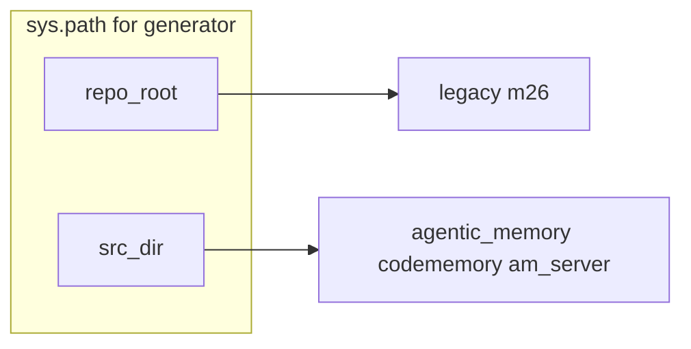

# Handoff: Agentic Memory documentation + NotebookLM generator

## Context for the receiving agent

**Repository:** [`d:\code\agentic-memory`](d:\code\agentic-memory) (GitHub: `jarmen423/agentic-memory`).

**Goal:** (1) Add documentation so AI-readable context is strong. (2) Add an adapted `generate_notebooklm_docs.py` that emits `docs/notebooklm_context.md` for NotebookLM.

**Upstream reference** (source to copy ideas or code from): [mutdb-mobile-apps/scripts/generate_notebooklm_docs.py](c:\Users\jfrie\Documents\DEVDRIVE\code\mutdb-mobile-apps\scripts\generate_notebooklm_docs.py) — the receiving repo does **not** use the same layout; see "Critical differences" below.

---

## Critical differences from the m26 script

| Topic | m26 (mutdb-mobile-apps) | agentic-memory |
|--------|-------------------------|----------------|
| Python layout | Packages at **repo root** (`command_service`, …) | **Hatch src layout**: packages live under [`src/`](d:\code\agentic-memory\src) — see [`pyproject.toml`](d:\code\agentic-memory\pyproject.toml) `[tool.hatch.build.targets.wheel]` |
| Importable package names | Root-level names | **`agentic_memory`**, **`codememory`**, **`am_server`** (three wheel packages) |
| Frontend | Single `mutdashboard-tauri` | **npm workspaces** in root [`package.json`](d:\code\agentic-memory\package.json): `packages/am-temporal-kg`, `packages/am-sync-neo4j`, `packages/am-openclaw`; plus TS under [`bench/`](d:\code\agentic-memory\bench), optional other dirs |
| Monitoring | `monitoring/*.yml` | **None assumed** — use empty list or only if files exist |
| Extra Python | — | Optional nested project [`packages/am-proxy`](d:\code\agentic-memory\packages\am-proxy) with its **own** [`pyproject.toml`](d:\code\agentic-memory\packages\am-proxy\pyproject.toml) (`am_proxy` under `packages/am-proxy/src`) — treat as **optional** second pass |

**Blocking fix for imports:** The stock script does `sys.path.insert(0, REPO_ROOT)`. For Hatch `src/` layout, imports like `import agentic_memory` require **`sys.path.insert(0, REPO_ROOT / "src")`** (or run only after `pip install -e .` with the environment that exposes those packages). The adapted script should insert **`src`** explicitly so `python scripts/generate_notebooklm_docs.py` works from a clean venv without relying on editable install.

---

## Phase 1: Documentation (what to add, in what order)

### 1.1 Understand current doc surface

- Root [`README.md`](d:\code\agentic-memory\README.md) is already strong for humans; NotebookLM still benefits from **in-repo architecture** and **API-level docstrings**.
- Scan [`src/agentic_memory`](d:\code\agentic-memory\src\agentic_memory), [`src/codememory`](d:\code\agentic-memory\src\codememory), [`src/am_server`](d:\code\agentic-memory\src\am_server) for modules with no module docstring and public classes/functions with no docstrings.

### 1.2 Docstring strategy (aligned with how the m26 generator behaves)

The generator uses `inspect.getdoc()` and, in the original script:

- **Classes** are only emitted in full if at least one **method has a non-empty docstring** (otherwise the class section can be skipped).
- **Functions** get a header; docstring + **source** are gated on having a docstring in the original.

**Recommendation:** Prefer **short, accurate module docstrings** (1–3 sentences) on every package submodule that matters, plus docstrings on **public** functions and class `__init__` / main methods. **Style:** Google/NumPy/Plain all work; pick one (repo may already use Ruff; check `ruff` pydocstyle rules if any).

**Optional efficiency:** In Phase 2, **relax the generator** to always append `inspect.getsource` for functions/methods when source is available, even if docstring is empty — then Phase 1 docstrings can be **thinner** while NotebookLM still gets code text.

### 1.3 Narrative docs (optional but high value)

Add or extend under [`docs/`](d:\code\agentic-memory\docs):

- **`docs/ARCHITECTURE.md`** (or similar): data flow among Neo4j, MCP, ingestion, `codememory` vs `agentic_memory` naming, when to use `am_server`.
- Link from root README if appropriate (user may want minimal diff — follow repo conventions).

Do **not** duplicate the entire README; focus on **diagrams-level** relationships and boundaries.

### 1.4 Include narrative in NotebookLM output

Either:

- **Ingest `docs/*.md`** in the generator (new section: glob `docs/**/*.md` excluding huge files), or  
- Rely on docstrings + TS source only.

Recommend **explicitly listing** `docs/ARCHITECTURE.md` and `README.md` in the generator as **static includes** at the top of the Markdown output so NotebookLM sees them first.

---

## Phase 2: Adapt the NotebookLM generator

### 2.1 Placement and invocation

- Add [`scripts/generate_notebooklm_docs.py`](d:\code\agentic-memory\scripts\generate_notebooklm_docs.py) (create `scripts/` at repo root if missing).
- Set `REPO_ROOT = Path(__file__).resolve().parents[1]`.
- Insert `src` on `sys.path`: `sys.path.insert(0, str(REPO_ROOT / "src"))` (and keep repo root if any imports need it).

### 2.2 Configuration constants

- **`PACKAGES`:** `["agentic_memory", "codememory", "am_server"]`.
- **`FRONTEND_PROJECTS`:** e.g. `packages/am-temporal-kg`, `packages/am-sync-neo4j`, `packages/am-openclaw`, and optionally `bench` if TS benchmarks matter — **exclude `node_modules` and `dist`** (existing `document_frontend` logic already skips `node_modules` in path segments; verify `dist/` under packages).
- **`FRONTEND_EXTENSIONS`:** extend beyond `.ts`, `.tsx`, `.css` if the repo uses `.mts`, `.js` in `src/` — align with actual tree.
- **`MONITORING_CONFIGS`:** `[]` unless the repo adds Prometheus later.
- **Title / TOC / section blurbs:** Replace "M26 Pipeline" / Tauri copy with Agentic Memory stack (FastAPI `am_server`, Neo4j, MCP, TS worker packages).

### 2.3 Optional: `am-proxy`

If included: add `packages/am-proxy/src` to `sys.path` **or** run a second pass with `PACKAGES = ["am_proxy"]` and path injection for that subdirectory only. Prefer **not** blocking the main task on this.

### 2.4 Hardening (recommended)

- **`document_module` improvements:** Emit **source** for module-level functions and methods even when docstring is missing (fixes sparse output without mandating a full docstring sweep).
- **Size guard:** Log total output size or file count; optionally `--max-files` / exclude patterns for `codememory` hot paths if the Markdown exceeds practical NotebookLM limits.
- **Secrets:** Add a short comment in the script header: do not upload generated files if they might contain `.env` patterns; the generator should **never** read `.env` files (current script does not — keep it that way).

### 2.5 Verification checklist

- From repo root, with dev deps installed:  
  `python scripts/generate_notebooklm_docs.py` (or `python -m scripts.generate_notebooklm_docs` if packaged — only if `scripts` is a package; simplest is direct script path).
- Confirm `docs/notebooklm_context.md` exists and contains sections for all three Python packages and selected TS roots.
- Run **`pytest`** (or targeted tests) after large docstring edits to ensure no accidental syntax issues.

---

## Deliverables summary

| Deliverable | Description |
|-------------|-------------|
| Docstrings / small `docs/` architecture file | Targeted coverage across `src/` public surfaces |
| [`scripts/generate_notebooklm_docs.py`](d:\code\agentic-memory\scripts\generate_notebooklm_docs.py) | Adapted generator with `src/` path, correct `PACKAGES`, TS roots, optional README/docs includes |
| [`docs/notebooklm_context.md`](d:\code\agentic-memory\docs\notebooklm_context.md) | Generated artifact (gitignore decision: **user choice** — often committed for reproducibility or gitignored if huge) |

---

## Out of scope / risks

- **NotebookLM token limits:** Full monorepo + `node_modules` accidentally included would balloon the file — double-check walks.
- **Import failures:** If optional deps are missing in the environment, `importlib.import_module` may fail for some submodules — catch and log (existing pattern), and document `uv sync` / `pip install -e ".[dev]"` as the supported run environment.
